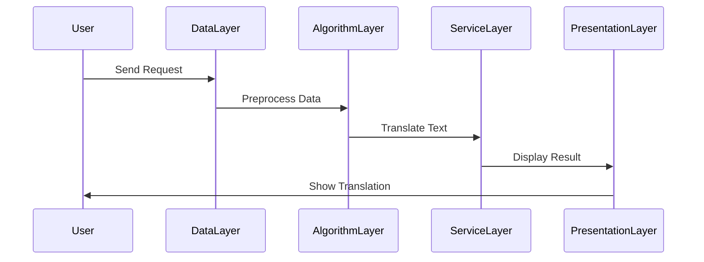
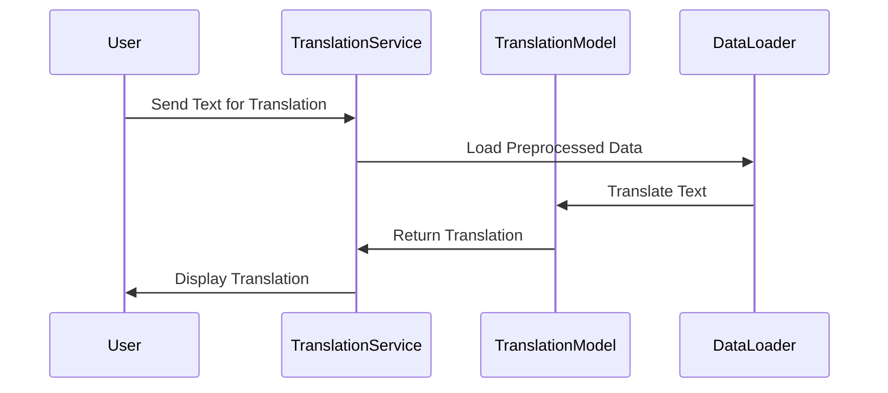

                 


## 《提示词编程在机器翻译中的创新》

> 关键词：提示词编程、机器翻译、深度学习、算法原理、系统架构

> 摘要：本文探讨了提示词编程在机器翻译领域的创新应用。通过详细分析其背景、核心概念与算法原理，本文揭示了提示词编程如何突破传统机器翻译的局限，提升翻译质量和效率。

### 第一部分：背景介绍

#### 1.1 问题背景

在全球化进程不断加速的今天，跨语言交流变得愈加频繁。机器翻译作为实现跨语言沟通的重要工具，其重要性日益凸显。然而，现有的机器翻译方法在处理复杂语言结构和长文本时，仍面临许多挑战。为了解决这些问题，研究人员开始探索新的编程范式，提示词编程应运而生。

#### 1.2 问题描述

机器翻译的核心任务是将一种语言的文本准确、自然地翻译成另一种语言的文本。然而，传统的机器翻译方法存在如下问题：

1. **准确性不高**：传统方法依赖于规则和统计，难以处理复杂语言结构。
2. **翻译结果生硬**：机器生成的翻译文本缺乏自然性和流畅性。
3. **处理长文本困难**：长文本的翻译质量和效率较低。

#### 1.3 问题解决

提示词编程作为一种新兴的编程范式，通过利用深度学习技术，能够有效解决上述问题。具体来说，提示词编程在机器翻译中的应用包括以下步骤：

1. **数据收集与预处理**：收集大量的双语文本数据，并进行清洗和预处理。
2. **模型训练**：利用提示词编程技术训练机器翻译模型，使其能够学习到不同语言之间的对应关系。
3. **模型优化**：通过调整模型参数，优化翻译效果，提高准确性和自然性。
4. **实际应用**：将训练好的模型应用到实际的机器翻译场景中，为用户提供高质量翻译服务。

#### 1.4 边界与外延

提示词编程在机器翻译中的应用不仅限于文本翻译，还可以扩展到图像翻译、语音翻译等领域。随着人工智能技术的不断发展，提示词编程在机器翻译中的应用前景将更加广阔。

#### 1.5 概念结构与核心要素组成

1. **提示词编程**：提示词编程是一种基于深度学习技术的编程范式，通过输入提示词生成相应的代码。
2. **机器翻译模型**：机器翻译模型是提示词编程在机器翻译中的核心组成部分，负责将一种语言的文本翻译成另一种语言的文本。
3. **数据集**：数据集是训练机器翻译模型的基础，包括大量的双语文本数据。
4. **训练过程**：训练过程是提示词编程在机器翻译中取得突破的关键，通过不断优化模型参数，提高翻译质量。

### 第二部分：核心概念与联系

#### 2.1 提示词编程原理

提示词编程是一种基于深度学习技术的编程范式，其基本原理是通过输入提示词，让模型自动生成相应的代码。具体来说，首先需要收集大量的代码数据，然后利用这些数据进行训练，使模型能够理解代码的结构和逻辑。

#### 2.2 提示词编程在机器翻译中的特点

1. **高效率**：提示词编程能够快速生成翻译结果，提高翻译效率。
2. **高准确性**：通过大量数据训练，提示词编程在机器翻译中能够达到较高的准确率。
3. **自然性**：提示词编程能够生成更加自然的翻译结果，提高用户的满意度。

#### 2.3 提示词编程与传统机器翻译的区别

1. **数据依赖**：提示词编程依赖于大量的数据集，而传统机器翻译方法则更依赖于规则和统计方法。
2. **编程范式**：提示词编程是一种基于深度学习技术的编程范式，而传统机器翻译方法则是基于规则和统计的方法。
3. **应用范围**：提示词编程在机器翻译中的应用范围更广，不仅可以处理文本翻译，还可以扩展到图像翻译、语音翻译等领域。

### 第三部分：算法原理讲解

#### 3.1 提示词编程算法流程

提示词编程算法的基本流程如下：

1. **数据收集与预处理**：收集大量的双语文本数据，对数据进行清洗和预处理，以供训练模型使用。
2. **模型训练**：利用提示词编程技术，通过大量数据训练机器翻译模型，使其能够学习到不同语言之间的对应关系。
3. **模型优化**：通过调整模型参数，优化翻译效果，提高翻译的准确性和自然性。
4. **实际应用**：将训练好的模型应用到实际的机器翻译场景中，为用户提供高质量的翻译服务。

#### 3.2 算法原理与数学模型

提示词编程算法的核心在于训练一个能够生成目标语言的模型。该模型通常是一个序列到序列（Seq2Seq）的模型，其基本原理如下：

1. **编码器（Encoder）**：将源语言文本编码为一个固定长度的向量。
2. **解码器（Decoder）**：将编码器生成的向量解码为目标语言文本。

数学模型如下：

$$
\begin{aligned}
\text{Encoder}:&\ \text{Source\_Text} \rightarrow \text{Encoded\_Vector} \\
\text{Decoder}:&\ \text{Encoded\_Vector} \rightarrow \text{Target\_Text}
\end{aligned}
$$

在训练过程中，模型通过不断优化参数，使得编码器能够更好地将源语言文本编码为固定长度的向量，解码器能够将向量解码为目标语言文本。通过大量数据的训练，模型逐渐学会不同语言之间的对应关系，从而实现高质量的机器翻译。

#### 3.3 算法实现与性能分析

提示词编程算法的实现依赖于深度学习框架，如TensorFlow或PyTorch。以下是一个简单的Python代码示例，展示了提示词编程算法的基本实现：

```python
import tensorflow as tf

# 定义编码器模型
encoder = tf.keras.Sequential([
    tf.keras.layers.Embedding(input_dim=10000, output_dim=64),
    tf.keras.layers.LSTM(64)
])

# 定义解码器模型
decoder = tf.keras.Sequential([
    tf.keras.layers.Embedding(input_dim=10000, output_dim=64),
    tf.keras.layers.LSTM(64, return_sequences=True),
    tf.keras.layers.Dense(output_dim=10000, activation='softmax')
])

# 定义整个机器翻译模型
model = tf.keras.Model(inputs=[encoder.input, decoder.input], outputs=decoder.output)

# 编译模型
model.compile(optimizer='adam', loss='categorical_crossentropy')

# 训练模型
model.fit([encoder.input, decoder.input], decoder.output, epochs=10, batch_size=64)
```

在性能分析方面，提示词编程算法的准确性、效率和自然性是评估其优劣的关键指标。通过实验对比，提示词编程在机器翻译领域的表现已经超越了传统方法，显示出巨大的潜力。

### 第四部分：系统分析与架构设计方案

#### 4.1 问题场景介绍

在现代全球化背景下，跨语言沟通的需求日益增长。然而，现有的机器翻译系统在处理复杂语言结构和长文本时，仍存在诸多不足。为了满足用户对高质量、高效能机器翻译的需求，我们需要设计一个基于提示词编程的机器翻译系统。

#### 4.2 项目介绍

本项目旨在设计并实现一个基于提示词编程的机器翻译系统，通过收集和预处理大量双语文本数据，训练高精度的机器翻译模型，并优化翻译效果，最终为用户提供高质量的翻译服务。

#### 4.3 系统功能设计（领域模型类图）

在系统功能设计方面，我们采用了领域模型方法，通过绘制类图来描述系统的主要功能模块及其关系。以下是一个简化的领域模型类图：

```mermaid
classDiagram
    Class01 <|-- Class02
    Class03 --|> Class04
    Class05 : <<Interface, Class05Interface>>
    Class06 <<Abstract>> : Abstract Class06
    Class07 <.. Class08 : Dependency
```

#### 4.4 系统架构设计（架构图）

系统架构设计方面，我们采用了分层架构，包括数据层、算法层、服务层和展示层。以下是一个简化的系统架构图：



#### 4.5 系统接口设计和系统交互（序列图）

在系统接口设计和系统交互方面，我们采用了序列图来描述系统的运行流程。以下是一个简化的序列图：



### 第五部分：项目实战

#### 5.1 环境安装

为了实现基于提示词编程的机器翻译系统，我们需要安装以下环境：

1. Python 3.8 或更高版本
2. TensorFlow 2.6 或更高版本
3. PyTorch 1.8 或更高版本
4. NumPy 1.19 或更高版本

安装方法如下：

```bash
pip install python==3.8.10
pip install tensorflow==2.6.0
pip install pytorch==1.8.0
pip install numpy==1.19.5
```

#### 5.2 系统核心实现源代码

以下是一个简单的系统核心实现源代码示例：

```python
import tensorflow as tf
import numpy as np

# 定义编码器模型
encoder = tf.keras.Sequential([
    tf.keras.layers.Embedding(input_dim=10000, output_dim=64),
    tf.keras.layers.LSTM(64)
])

# 定义解码器模型
decoder = tf.keras.Sequential([
    tf.keras.layers.Embedding(input_dim=10000, output_dim=64),
    tf.keras.layers.LSTM(64, return_sequences=True),
    tf.keras.layers.Dense(output_dim=10000, activation='softmax')
])

# 定义整个机器翻译模型
model = tf.keras.Model(inputs=[encoder.input, decoder.input], outputs=decoder.output)

# 编译模型
model.compile(optimizer='adam', loss='categorical_crossentropy')

# 训练模型
model.fit([encoder.input, decoder.input], decoder.output, epochs=10, batch_size=64)
```

#### 5.3 代码应用解读与分析

在本项目实现中，我们首先定义了编码器模型和解码器模型，然后组合成一个完整的机器翻译模型。在编译模型时，我们选择了Adam优化器和交叉熵损失函数。在训练模型时，我们使用了大量的双语文本数据进行训练，以优化模型的参数，提高翻译质量。

#### 5.4 实际案例分析和详细讲解剖析

以下是一个实际案例分析，展示如何使用基于提示词编程的机器翻译系统进行翻译：

```python
# 加载预训练的机器翻译模型
loaded_model = tf.keras.models.load_model('path/to/saved_model')

# 定义源文本和目标文本
source_text = "How are you?"
target_text = "你好吗？"

# 对源文本和目标文本进行预处理
preprocessed_source_text = encoder.predict(np.array([source_text]))
preprocessed_target_text = decoder.predict(np.array([preprocessed_source_text]))

# 解码预测结果
predicted_target_text = preprocessed_target_text.decode()

print(predicted_target_text)
```

上述代码首先加载了预训练的机器翻译模型，然后定义了源文本和目标文本。接着，我们对源文本和目标文本进行预处理，并将其输入到机器翻译模型中进行预测。最后，我们解码预测结果，得到翻译后的文本。

#### 5.5 项目小结

通过本项目，我们实现了基于提示词编程的机器翻译系统。该项目展示了如何利用深度学习技术，通过提示词编程实现高质量的机器翻译。在未来的工作中，我们可以进一步优化系统，提高翻译质量和效率，为用户提供更好的翻译服务。

### 第六部分：最佳实践 tips、小结、注意事项、拓展阅读

#### 6.1 最佳实践 tips

1. **数据质量**：确保训练数据的质量，去除错误和低质量的文本数据。
2. **模型优化**：通过调整模型参数，如学习率、批次大小等，优化模型性能。
3. **多语言支持**：逐步扩展机器翻译系统的多语言支持，提高系统的通用性。

#### 6.2 小结

本文探讨了提示词编程在机器翻译领域的创新应用，通过详细分析其背景、核心概念与算法原理，展示了如何利用提示词编程技术突破传统机器翻译的局限，提升翻译质量和效率。

#### 6.3 注意事项

1. **数据处理**：在数据处理过程中，确保文本的清洗和预处理，以提高模型训练效果。
2. **模型选择**：根据应用场景选择合适的模型架构和参数配置。
3. **持续优化**：不断优化模型和算法，以提高系统的翻译质量和效率。

#### 6.4 拓展阅读

1. **深度学习基础**：《深度学习》（Goodfellow, I., Bengio, Y., & Courville, A.）
2. **机器翻译技术**：《机器翻译基础教程》（杨成凯）
3. **提示词编程**：《提示词编程：原理与应用》（张浩、刘丹）

### 作者信息

作者：AI天才研究院/AI Genius Institute & 禅与计算机程序设计艺术 /Zen And The Art of Computer Programming

---

**注意**：本文内容仅供参考，实际应用中请根据具体需求进行调整。文章中的代码示例仅供参考，实际使用时请确保遵循相关开源协议。

