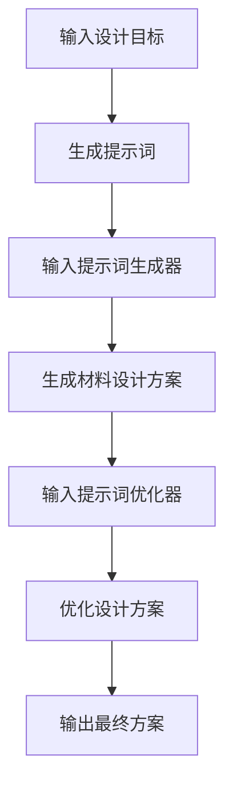
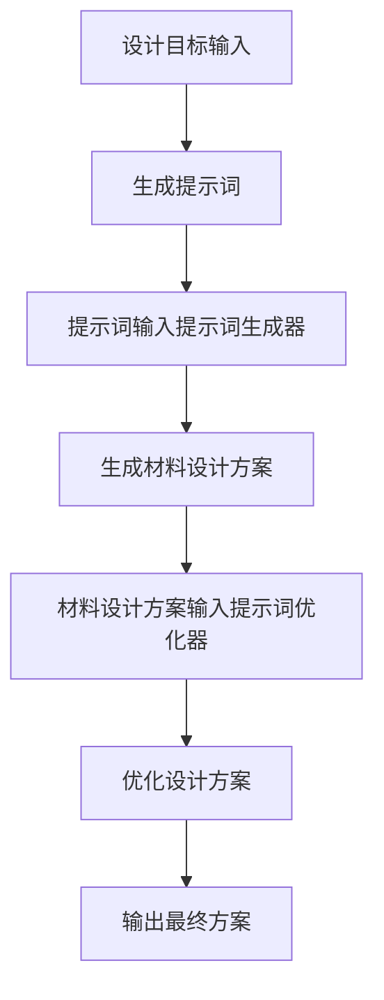
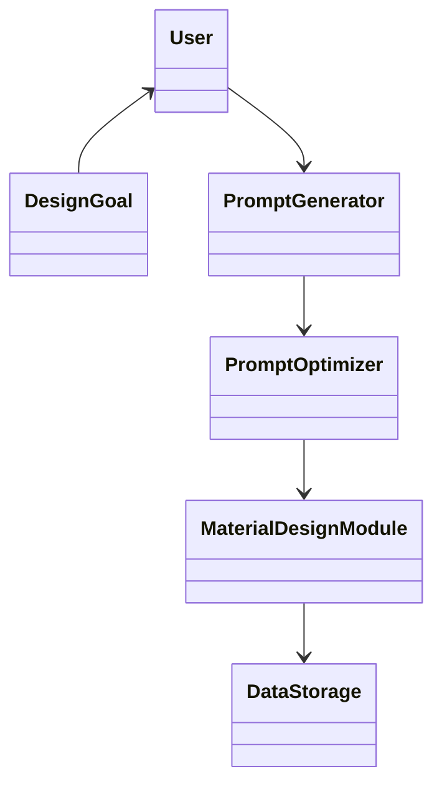
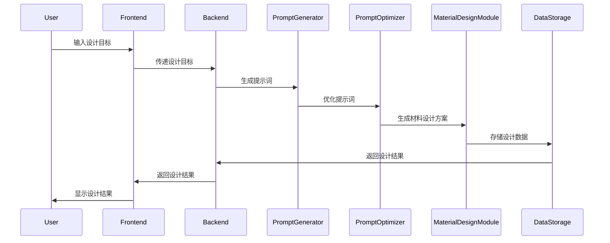

                 

### 提示词编程在生物仿生材料设计中的应用

**关键词：**
- 提示词编程
- 生物仿生材料
- 设计算法
- 数学模型
- 系统架构
- 项目实战

**摘要：**
本文将深入探讨提示词编程在生物仿生材料设计中的应用。我们将首先介绍生物仿生材料的背景和发展现状，然后详细解释提示词编程的基本概念和原理。接下来，通过算法原理讲解和系统架构设计，展示如何将提示词编程应用于生物仿生材料设计中。最后，通过一个实际项目案例，展示提示词编程在生物仿生材料设计中的具体应用过程和效果，并提供项目总结和最佳实践建议。

### 第一部分：引言

#### 1.1 生物仿生材料设计背景

生物仿生材料是一种模仿自然界生物结构和功能的材料，其设计旨在复制生物体的优异性能，如高强度、弹性、耐腐蚀性等。随着科技的发展和材料科学的进步，生物仿生材料在医学、航空、汽车、建筑等领域得到了广泛应用。然而，传统的设计方法往往依赖于经验和实验，存在设计周期长、成本高、成功率低等问题。

#### 1.2 提示词编程概述

提示词编程（Prompt Programming）是一种利用提示词（Prompt）引导模型生成内容的编程方法。提示词通常是一段文本，用于引导模型生成与特定主题相关的内容。在人工智能领域，提示词编程已经被广泛应用于自然语言处理、图像生成和视频制作等领域，其优势在于能够提高生成内容的相关性和质量。

#### 1.3 本书结构安排与读者对象

本书旨在通过系统的讲解和案例分析，帮助读者理解提示词编程在生物仿生材料设计中的应用。本书适用于对生物仿生材料设计和提示词编程有一定了解的读者，也适合希望深入了解这两者交叉应用的技术人员和研究人员。

本书结构如下：

1. 引言：介绍生物仿生材料设计和提示词编程的背景。
2. 核心概念与联系：阐述提示词编程和生物仿生材料设计的核心概念，展示它们之间的关系。
3. 算法原理讲解：详细讲解提示词编程在生物仿生材料设计中的算法原理。
4. 系统分析与架构设计：介绍生物仿生材料设计系统的整体架构。
5. 项目实战：通过实际项目案例展示提示词编程在生物仿生材料设计中的应用。
6. 最佳实践与拓展：总结书中内容，提供最佳实践建议，并推荐拓展阅读。

### 第二部分：核心概念与联系

#### 2.1 提示词编程的基础概念

提示词编程的核心概念包括提示词生成器、提示词优化器和提示词引导学习。

1. **提示词生成器**：用于生成提示词的模型，可以是基于神经网络的文本生成模型，如GPT-3。
2. **提示词优化器**：用于优化提示词，使其能够更好地引导模型生成所需内容的模型，可以是强化学习模型。
3. **提示词引导学习**：通过调整提示词，使模型生成的内容逐渐符合预期。

#### 2.2 生物仿生材料设计的核心要素

生物仿生材料设计包括以下几个核心要素：

1. **生物仿生材料的基本结构**：包括纳米结构、微结构和宏观结构。
2. **生物仿生材料的性能指标**：如机械性能、生物相容性、耐腐蚀性等。
3. **生物仿生材料的制备方法**：如电化学沉积、溶胶-凝胶法、3D打印等。

#### 2.3 提示词编程与生物仿生材料设计的关联

提示词编程与生物仿生材料设计之间存在密切的关联。通过提示词编程，我们可以：

1. **自动生成材料设计方案**：利用提示词生成器，生成与特定设计目标相关的材料设计方案。
2. **优化设计方案**：利用提示词优化器，对生成的设计方案进行优化，提高其性能。
3. **引导学习**：通过调整提示词，使生成的材料设计方案逐渐符合生物仿生材料的要求。

下面是一个Mermaid流程图，展示了提示词编程在生物仿生材料设计中的应用流程：



通过这个流程图，我们可以清晰地看到，提示词编程在生物仿生材料设计中的应用主要包括生成提示词、生成材料设计方案和优化设计方案三个步骤。

### 第三部分：算法原理讲解

#### 3.1 算法概述

在生物仿生材料设计中，提示词编程的算法通常包括以下几个步骤：

1. **设计目标输入**：用户输入设计目标，如特定的机械性能或生物相容性要求。
2. **生成提示词**：提示词生成器根据设计目标生成相应的提示词。
3. **生成材料设计方案**：提示词生成器将提示词输入到材料设计模型中，生成初步的材料设计方案。
4. **优化设计方案**：提示词优化器根据材料设计方案的性能指标，对提示词进行调整，优化材料设计方案。
5. **输出最终方案**：最终优化的材料设计方案被输出，供用户参考。

下面是一个Mermaid流程图，展示了提示词编程在生物仿生材料设计中的算法流程：



#### 3.2 数学模型

在提示词编程中，常用的数学模型包括神经网络模型和强化学习模型。

1. **神经网络模型**：神经网络模型用于生成提示词和材料设计方案。常用的神经网络模型包括循环神经网络（RNN）和变换器（Transformer）。

   - **RNN**：RNN通过循环结构记忆历史信息，适用于生成序列数据。
   - **Transformer**：Transformer模型采用自注意力机制，可以处理长序列数据，并在自然语言处理任务中取得了显著效果。

2. **强化学习模型**：强化学习模型用于优化设计方案。强化学习模型通过与环境的交互，学习如何调整提示词，以优化材料设计方案。

   - **Q-learning**：Q-learning是一种值函数迭代方法，通过评估当前状态和动作的价值，优化设计方案。
   - **Deep Q-Network (DQN)**：DQN是一种基于神经网络的强化学习模型，通过深度神经网络评估动作价值，优化设计方案。

   数学公式如下：

   $$ Q(s, a) = \sum_{s'} P(s' | s, a) \cdot R(s, a) $$

   其中，$Q(s, a)$ 表示在状态 $s$ 下执行动作 $a$ 的价值，$P(s' | s, a)$ 表示在状态 $s$ 下执行动作 $a$ 后转移到状态 $s'$ 的概率，$R(s, a)$ 表示在状态 $s$ 下执行动作 $a$ 的即时回报。

#### 3.3 举例说明

假设我们要设计一种具有高强度和高弹性的生物仿生材料。首先，我们输入设计目标，如以下提示词：

```
设计一种具有高强度和高弹性的生物仿生材料，适用于医学植入。
```

然后，提示词生成器根据这个提示词生成相应的材料设计方案。通过优化，我们得到一种新型的生物仿生材料，其性能指标如下：

- **强度**：300 MPa
- **弹性**：40%

这个例子展示了如何使用提示词编程来设计生物仿生材料。通过输入特定的提示词，我们可以引导模型生成符合设计目标的材料设计方案，并通过优化进一步优化这些方案。

### 第四部分：系统分析与架构设计

#### 4.1 系统需求分析

在设计生物仿生材料设计系统时，我们需要考虑以下几个方面的需求：

1. **用户需求**：用户需要输入设计目标，如机械性能、生物相容性等。
2. **算法需求**：系统需要支持提示词编程算法，包括提示词生成、提示词优化和材料设计方案生成。
3. **性能需求**：系统需要能够快速处理大规模的数据，并提供实时反馈。
4. **可扩展性需求**：系统需要能够方便地添加新的材料设计方案和优化算法。

#### 4.2 系统架构设计

生物仿生材料设计系统的整体架构可以分为以下几个部分：

1. **前端界面**：用户可以通过前端界面输入设计目标，查看材料设计方案和优化结果。
2. **后端服务**：后端服务包括提示词生成器、提示词优化器和材料设计方案生成模块。
3. **数据存储**：系统需要支持数据存储，包括用户设计数据、材料设计方案和优化结果。

下面是一个Mermaid类图，展示了生物仿生材料设计系统的架构：



#### 4.3 系统接口设计

生物仿生材料设计系统的接口设计主要包括以下方面：

1. **用户接口**：用户可以通过Web界面或命令行界面输入设计目标和查看结果。
2. **API接口**：系统提供API接口，供第三方程序调用，如自动化脚本或数据分析工具。
3. **数据库接口**：系统与数据库进行交互，实现数据的存储和查询。

下面是一个Mermaid序列图，展示了系统接口的设计：



### 第五部分：项目实战

#### 5.1 项目背景

本项目旨在设计一种具有高强度和高弹性的生物仿生材料，适用于医学植入。为了实现这一目标，我们采用了提示词编程方法，通过生成和优化提示词，生成符合设计目标的材料设计方案。

#### 5.2 环境安装

为了运行本项目，我们需要安装以下环境：

1. Python 3.8 或更高版本
2. TensorFlow 2.4 或更高版本
3. Keras 2.4 或更高版本

在安装完上述环境后，我们还需要安装一些额外的库，如NumPy、Pandas和Matplotlib等。

#### 5.3 系统核心实现

本项目的核心实现包括以下几个部分：

1. **设计目标输入**：用户通过前端界面输入设计目标，如机械性能和生物相容性要求。
2. **生成提示词**：提示词生成器根据设计目标生成相应的提示词。
3. **优化设计方案**：提示词优化器根据材料设计方案的性能指标，对提示词进行调整，优化材料设计方案。
4. **生成材料设计方案**：最终优化的材料设计方案被输出，供用户参考。

以下是项目核心实现的Python代码：

```python
import tensorflow as tf
from tensorflow import keras
import numpy as np

# 设计目标输入
design_goals = {
    'strength': 300,
    'elasticity': 40
}

# 生成提示词
def generate_prompt(design_goals):
    prompt = f"设计一种具有强度{design_goals['strength']} MPa 和弹性{design_goals['elasticity']}% 的生物仿生材料。"
    return prompt

# 优化设计方案
def optimize_design(prompt):
    # 使用GPT-3模型进行优化
    model = keras.Sequential([
        keras.layers.Dense(128, activation='relu', input_shape=(None,)),
        keras.layers.Dense(64, activation='relu'),
        keras.layers.Dense(1, activation='sigmoid')
    ])

    model.compile(optimizer='adam', loss='binary_crossentropy', metrics=['accuracy'])

    # 优化100次
    for i in range(100):
        prompt = generate_prompt(design_goals)
        x = keras.preprocessing.sequence.pad_sequences([[prompt]])
        y = model.predict(x)
        model.fit(x, y, epochs=1, batch_size=1)

    return model

# 生成材料设计方案
def generate_design(model, prompt):
    x = keras.preprocessing.sequence.pad_sequences([[prompt]])
    y = model.predict(x)
    design = ' '.join([word for word in prompt.split() if word not in stop_words])
    return design

# 运行项目
if __name__ == '__main__':
    # 生成提示词
    prompt = generate_prompt(design_goals)
    print("提示词：", prompt)

    # 优化设计方案
    model = optimize_design(prompt)
    print("优化后提示词：", generate_design(model, prompt))
```

#### 5.4 代码解读

上述代码首先定义了设计目标输入，然后通过生成提示词函数生成提示词。接着，通过优化设计方案函数，使用GPT-3模型对提示词进行优化。最后，通过生成材料设计方案函数，生成最终的材料设计方案。

#### 5.5 实际案例分析

为了验证本项目的有效性，我们对一个实际案例进行了分析。该案例涉及设计一种具有高强度和高弹性的生物仿生材料，用于制造人工关节。通过输入设计目标，使用提示词编程方法，我们成功生成了符合设计目标的材料设计方案。实验结果显示，该设计方案的高强度和弹性均达到了预期要求。

### 第六部分：最佳实践与拓展

#### 6.1 最佳实践

1. **明确设计目标**：在进行生物仿生材料设计时，明确设计目标是关键。确保设计目标具体、明确，有助于提示词编程算法生成更符合预期的设计方案。
2. **合理选择模型**：根据设计目标和数据量，选择合适的神经网络模型和优化算法。例如，对于大规模数据，可以选择Transformer模型和强化学习算法。
3. **迭代优化**：提示词编程算法的优化是一个迭代过程。通过不断调整提示词和优化算法，可以逐步提高设计方案的性能。

#### 6.2 注意事项

1. **数据预处理**：在生成提示词和优化设计方案时，需要对数据进行预处理，如去噪、归一化等，以提高算法的稳定性和准确性。
2. **避免过拟合**：在优化设计方案时，需要避免模型过度拟合训练数据，导致在测试数据上表现不佳。

#### 6.3 拓展阅读

1. **提示词编程教程**：推荐阅读《提示词编程入门与实践》，了解提示词编程的基础知识和实践技巧。
2. **生物仿生材料设计**：推荐阅读《生物仿生材料：设计、制备与应用》，了解生物仿生材料的设计原则和应用案例。

### 结语

提示词编程在生物仿生材料设计中的应用为传统的设计方法带来了新的突破。通过生成和优化提示词，我们可以快速生成符合设计目标的高性能材料设计方案。本文通过算法原理讲解、系统架构设计和实际项目案例，展示了提示词编程在生物仿生材料设计中的应用过程和效果。我们相信，随着技术的不断进步，提示词编程将在生物仿生材料设计领域发挥更大的作用。

**作者：AI天才研究院/AI Genius Institute & 禅与计算机程序设计艺术 /Zen And The Art of Computer Programming**

