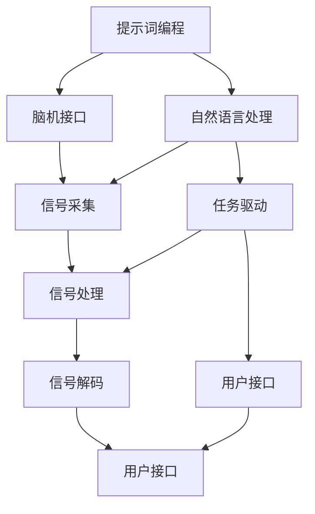
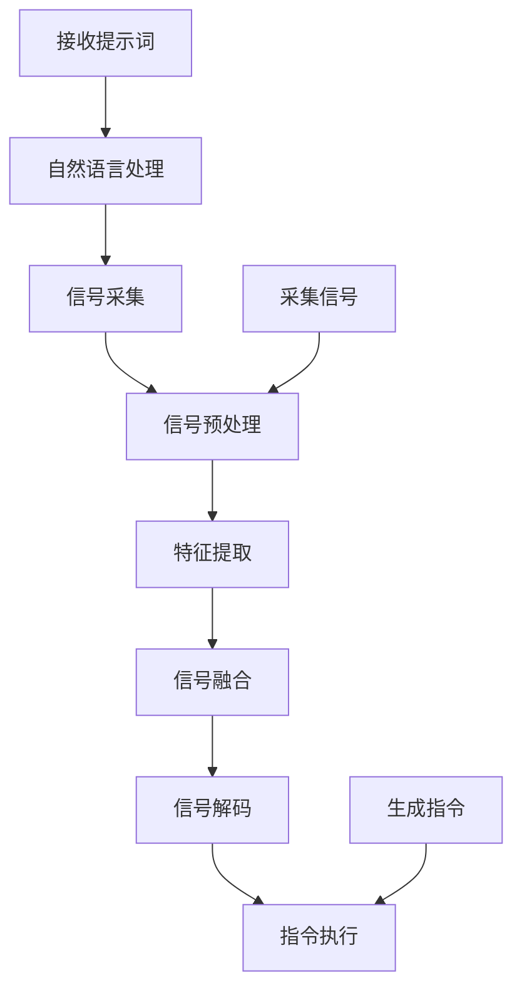
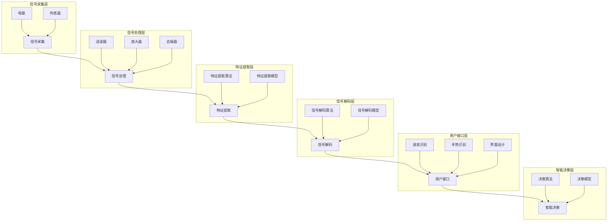
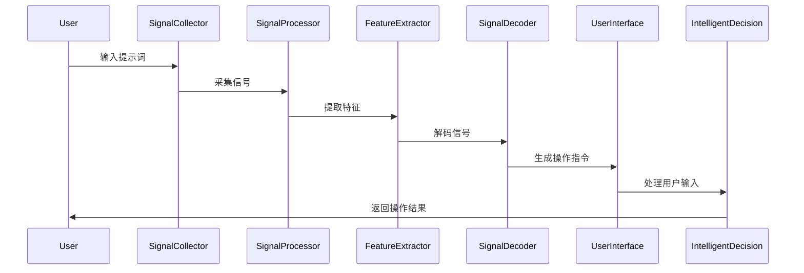

                 

# 提示词编程在脑机接口开发中的潜力

## 关键词：提示词编程、脑机接口、人工智能、算法融合、系统架构设计

## 摘要：

脑机接口（Brain-Computer Interface，BCI）技术正迅速发展，为人类与计算机之间的直接通信提供了新的途径。本文将探讨提示词编程（Prompt Programming）在脑机接口开发中的潜力。首先，我们简要介绍提示词编程和脑机接口的基本概念、发展历程及其在各自领域的应用。接着，分析提示词编程与脑机接口结合的潜在应用场景，并探讨两者融合的技术挑战和解决方案。通过具体算法原理、数学模型和系统架构设计，本文将揭示提示词编程在脑机接口开发中的核心作用和未来发展趋势。

## 第一部分：问题背景

### 1.1 提示词编程简介

#### 1.1.1 定义与核心原理

提示词编程是一种基于人类思维的编程方法，它利用自然语言和提示词来引导计算机执行特定任务。这种方法的核心在于，通过简单的提示词，编程者可以指导计算机进行复杂的逻辑推理和问题解决。

#### 1.1.2 提示词编程的发展历程

提示词编程起源于20世纪90年代的认知计算领域。随着人工智能技术的发展，特别是在自然语言处理和机器学习领域的突破，提示词编程逐渐成为一种重要的编程方式。

#### 1.1.3 提示词编程的优势与应用领域

提示词编程具有易于理解、高效灵活和易于扩展等优势。它在多个领域都有广泛应用，包括但不限于自动化测试、智能客服、语音助手和智能推荐系统等。

### 1.2 脑机接口开发背景

#### 1.2.1 脑机接口的定义与基本原理

脑机接口是一种直接连接大脑和外部设备的技术，它通过记录大脑的电信号，将用户的思维转化为可操作的数据。

#### 1.2.2 脑机接口的发展现状与趋势

近年来，脑机接口技术取得了显著进展，特别是在医疗、军事和康复等领域。随着人工智能和神经科学的发展，脑机接口的应用前景广阔。

#### 1.2.3 脑机接口在医疗、军事和康复等领域的应用

脑机接口在医疗领域主要用于康复和辅助治疗，如中风康复、截瘫康复等。在军事领域，它被用于增强士兵的感知和运动能力。在康复领域，脑机接口为残疾人提供了一种新的交流方式。

### 1.3 提示词编程在脑机接口开发中的结合潜力

#### 1.3.1 潜在应用场景

提示词编程与脑机接口的结合有望在多个场景中发挥作用，如智能医疗、智能军事和智能康复等。

#### 1.3.2 技术融合的关键挑战

技术融合面临的关键挑战包括信号处理、算法优化和用户体验等。

#### 1.3.3 发展前景与影响

提示词编程与脑机接口的结合有望推动人工智能和神经科学的发展，为人类带来更多便利。

### 1.4 本书结构安排

#### 1.4.1 研究方法

本书采用文献综述和案例分析相结合的方法，系统性地探讨提示词编程在脑机接口开发中的应用。

#### 1.4.2 内容安排

本书分为六个部分，依次介绍核心概念、算法原理、数学模型、系统分析与架构设计、项目实战和最佳实践。

#### 1.4.3 读者对象与预期收益

本书旨在为计算机科学、人工智能和神经科学领域的学者和从业者提供有价值的参考，帮助其深入了解提示词编程在脑机接口开发中的潜力。

### 1.5 本章小结

本章介绍了提示词编程和脑机接口的基本概念、发展历程及其在各自领域的应用，并探讨了提示词编程在脑机接口开发中的结合潜力。接下来，我们将进一步深入探讨提示词编程和脑机接口的核心概念和算法原理。

----------------------------------------------------------------

## 第二部分：核心概念

### 2.1 提示词编程原理

提示词编程的核心在于利用自然语言和提示词来引导计算机执行任务。具体来说，它包括以下几个关键要素：

1. **提示词定义**：提示词是指导计算机执行任务的关键信息。它们可以是简单的单词或复杂的句子，但必须能够清晰传达意图。
2. **自然语言处理**：提示词编程依赖于自然语言处理技术，将自然语言转化为计算机可以理解和执行的操作。
3. **任务驱动**：提示词编程以任务为导向，通过提示词引导计算机完成一系列操作，实现目标。

### 2.2 脑机接口技术

脑机接口技术涉及多个学科，包括神经科学、电子工程和计算机科学。其主要组成部分包括：

1. **信号采集**：通过电极或传感器从大脑中采集电信号。
2. **信号处理**：对采集到的信号进行预处理和特征提取，以提高信号质量和可解释性。
3. **信号解码**：将处理后的信号解码为具体的操作指令。
4. **用户接口**：将解码后的操作指令传递给外部设备，实现人机交互。

### 2.3 提示词编程与脑机接口结合的关键要素

提示词编程与脑机接口的结合需要考虑以下几个关键要素：

1. **信号采集与处理**：提示词编程需要与脑机接口的信号采集和处理技术相融合，以获得高质量的输入信号。
2. **自然语言处理**：提示词编程依赖于自然语言处理技术，对采集到的信号进行语义分析和理解。
3. **任务驱动**：提示词编程以任务为导向，通过提示词引导脑机接口实现特定的操作。
4. **用户接口**：提示词编程需要与脑机接口的用户接口相结合，以实现人机交互。

### 2.4 核心概念关系图

以下是提示词编程与脑机接口结合的核心概念关系图：



通过上述关系图，我们可以清晰地看到提示词编程与脑机接口结合的核心概念及其相互作用。

----------------------------------------------------------------

## 第三部分：算法原理

### 3.1 提示词编程算法

#### 3.1.1 算法概述

提示词编程算法的核心在于将自然语言提示词转化为计算机可执行的指令。以下是提示词编程算法的基本原理：

1. **提示词解析**：首先，将输入的提示词进行解析，提取出关键信息和意图。
2. **指令生成**：根据解析出的提示词，生成相应的计算机指令。
3. **指令执行**：执行生成的指令，完成特定的任务。

#### 3.1.1.1 基本原理

提示词编程算法的基本原理可以概括为以下步骤：

1. **输入提示词**：用户输入一个自然语言的提示词。
2. **词法分析**：对提示词进行词法分析，提取出关键词和短语。
3. **语法分析**：对提取出的关键词和短语进行语法分析，构建语法树。
4. **语义分析**：对语法树进行语义分析，理解提示词的意图。
5. **指令生成**：根据语义分析结果，生成相应的计算机指令。
6. **指令执行**：执行生成的指令，完成特定任务。

#### 3.1.1.2 算法流程

提示词编程算法的流程如下：

1. **初始化**：创建一个空的指令列表。
2. **接收提示词**：从用户接收一个自然语言的提示词。
3. **词法分析**：对提示词进行词法分析，提取出关键词和短语。
4. **语法分析**：对提取出的关键词和短语进行语法分析，构建语法树。
5. **语义分析**：对语法树进行语义分析，理解提示词的意图。
6. **生成指令**：根据语义分析结果，生成相应的计算机指令。
7. **执行指令**：将生成的指令添加到指令列表中，并执行这些指令。
8. **返回结果**：返回执行结果。

#### 3.1.1.3 技术难点与解决方案

提示词编程算法的技术难点主要包括自然语言处理和指令生成。以下是相关的解决方案：

1. **自然语言处理**：使用先进的自然语言处理技术，如词向量、句法分析、语义角色标注等，以提高对自然语言提示词的理解能力。
2. **指令生成**：设计一种高效的指令生成机制，将自然语言提示词转化为计算机可执行的指令。可以采用基于规则的方法或机器学习方法。

#### 3.1.2 算法示例

以下是一个简单的提示词编程算法示例：

```python
# 输入提示词
prompt = "帮我打开浏览器并访问百度"

# 初始化指令列表
commands = []

# 解析提示词
words = prompt.split()

# 生成指令
if "打开浏览器" in words:
    commands.append("open_browser()")
if "访问百度" in words:
    commands.append("go_to('https://www.baidu.com/')")

# 执行指令
for command in commands:
    exec(command)
```

在这个示例中，用户输入了一个简单的提示词，提示词编程算法通过自然语言处理技术解析提示词，生成相应的计算机指令，并执行这些指令。

### 3.2 脑机接口算法

#### 3.2.1 算法概述

脑机接口算法的核心在于将大脑的电信号转化为可操作的指令。以下是脑机接口算法的基本原理：

1. **信号采集**：从大脑中采集电信号。
2. **信号预处理**：对采集到的电信号进行预处理，包括滤波、放大、去噪等。
3. **特征提取**：从预处理后的信号中提取关键特征。
4. **信号解码**：将提取出的特征解码为具体的操作指令。
5. **指令执行**：执行解码后的操作指令。

#### 3.2.1.1 基本原理

脑机接口算法的基本原理可以概括为以下步骤：

1. **采集信号**：使用电极或传感器从大脑中采集电信号。
2. **预处理信号**：对采集到的电信号进行预处理，以提高信号质量和可解释性。
3. **特征提取**：从预处理后的信号中提取关键特征，如频率、振幅等。
4. **信号解码**：使用机器学习算法将提取出的特征解码为具体的操作指令。
5. **执行指令**：将解码后的操作指令传递给外部设备，实现人机交互。

#### 3.2.1.2 算法流程

脑机接口算法的流程如下：

1. **初始化**：创建一个空的指令列表。
2. **采集信号**：从大脑中采集电信号。
3. **预处理信号**：对采集到的电信号进行预处理。
4. **特征提取**：从预处理后的信号中提取关键特征。
5. **信号解码**：使用机器学习算法将提取出的特征解码为具体的操作指令。
6. **执行指令**：将解码后的操作指令添加到指令列表中，并执行这些指令。
7. **返回结果**：返回执行结果。

#### 3.2.1.3 技术难点与解决方案

脑机接口算法的技术难点主要包括信号采集、预处理和特征提取。以下是相关的解决方案：

1. **信号采集**：使用高精度的电极或传感器，以提高信号采集的准确性。
2. **信号预处理**：采用先进的预处理算法，如滤波、放大、去噪等，以提高信号质量和可解释性。
3. **特征提取**：使用机器学习算法，如支持向量机（SVM）、深度学习等，从预处理后的信号中提取关键特征。

#### 3.2.2 算法示例

以下是一个简单的脑机接口算法示例：

```python
# 采集信号
signal = get_signal()

# 预处理信号
filtered_signal = preprocess_signal(signal)

# 特征提取
features = extract_features(filtered_signal)

# 信号解码
command = decode_signal(features)

# 执行指令
if command == "open_browser__":
    open_browser()
elif command == "go_to":
    go_to("https://www.baidu.com/")
```

在这个示例中，脑机接口算法通过采集大脑电信号，预处理信号，提取特征，并将特征解码为操作指令，最终实现人机交互。

### 3.3 提示词编程与脑机接口算法融合原理

#### 3.3.1 融合思路

提示词编程与脑机接口算法的融合旨在利用提示词编程的灵活性和脑机接口的自然人机交互能力，实现更加高效和人性化的智能系统。融合思路主要包括以下几个方面：

1. **提示词引导**：使用自然语言提示词引导脑机接口算法，使脑机接口能够根据用户的意图进行操作。
2. **信号融合**：将脑机接口采集到的电信号与提示词编程的输入相结合，以提高系统的准确性和灵活性。
3. **多模态交互**：结合视觉、听觉等多种感官信息，实现更加丰富和直观的人机交互。

#### 3.3.1.1 技术路径

提示词编程与脑机接口算法的融合技术路径如下：

1. **信号采集**：从大脑中采集电信号，并将其转换为数字信号。
2. **信号预处理**：对采集到的电信号进行预处理，包括滤波、放大、去噪等。
3. **特征提取**：从预处理后的信号中提取关键特征，如频率、振幅等。
4. **自然语言处理**：对用户输入的提示词进行自然语言处理，提取关键信息。
5. **信号融合**：将提取出的特征与提示词编程的输入相结合，生成统一的特征向量。
6. **信号解码**：使用机器学习算法将融合后的特征向量解码为具体的操作指令。
7. **指令执行**：执行解码后的操作指令，实现人机交互。

#### 3.3.1.2 融合优势

提示词编程与脑机接口算法的融合具有以下优势：

1. **人性化**：通过自然语言提示词，使脑机接口能够更好地理解用户的意图，实现人性化的人机交互。
2. **灵活性**：提示词编程的灵活性强，可以根据用户的需求进行动态调整，提高系统的适应能力。
3. **高效性**：融合后的系统可以同时利用脑机接口的自然人机交互和提示词编程的自动化优势，实现高效的操作。

#### 3.3.2 融合算法示例

以下是一个简单的提示词编程与脑机接口算法融合的示例：

```python
# 采集信号
signal = get_signal()

# 预处理信号
filtered_signal = preprocess_signal(signal)

# 特征提取
features = extract_features(filtered_signal)

# 自然语言处理
prompt = "请打开浏览器并访问百度"
words = prompt.split()

# 信号融合
if "打开浏览器" in words:
    features.append("open_browser")
if "访问百度" in words:
    features.append("go_to('https://www.baidu.com/')")

# 信号解码
command = decode_signal(features)

# 执行指令
if command == "open_browser__":
    open_browser()
elif command == "go_to":
    go_to("https://www.baidu.com/")
```

在这个示例中，用户输入了一个自然语言提示词，脑机接口算法通过自然语言处理提取出关键信息，并将其与脑机接口采集到的电信号特征相结合，生成具体的操作指令，最终实现人机交互。

### 3.4 算法流程图

以下是提示词编程与脑机接口算法融合的流程图：



通过这个流程图，我们可以清晰地看到提示词编程与脑机接口算法融合的整个过程，包括信号采集、预处理、特征提取、信号融合、信号解码和指令执行等步骤。

----------------------------------------------------------------

## 第四部分：数学模型与公式

### 4.1 提示词编程数学模型

#### 4.1.1 常用数学模型

提示词编程中的常用数学模型包括词向量模型、语法分析模型和语义分析模型。以下是这些模型的基本概念和公式：

1. **词向量模型**：词向量模型将自然语言中的单词表示为高维向量，以捕捉单词的语义信息。常用的词向量模型有Word2Vec、GloVe等。
   - **公式**：$ \text{word\_vector}(w) = \text{embedding}(w) \in \mathbb{R}^d $
   - **解释**：其中，$ w $表示单词，$ \text{embedding}(w) $表示单词的词向量，$ d $表示词向量的维度。

2. **语法分析模型**：语法分析模型用于分析自然语言句子的语法结构，以构建语法树。常用的语法分析模型有基于规则的方法、概率语法模型和神经网络模型。
   - **公式**：$ \text{parse\_tree}(S) = \text{generate\_parse\_tree}(S) $
   - **解释**：其中，$ S $表示句子，$ \text{generate\_parse\_tree}(S) $表示生成句子的语法树。

3. **语义分析模型**：语义分析模型用于理解自然语言的语义含义，以生成操作指令。常用的语义分析模型有基于规则的方法、语义角色标注和语义解析。
   - **公式**：$ \text{sem\_ant}(S) = \text{generate\_sem\_ant}(S) $
   - **解释**：其中，$ S $表示句子，$ \text{generate\_sem\_ant}(S) $表示生成句子的语义分析结果。

#### 4.1.1.2 模型应用

提示词编程中的数学模型广泛应用于自然语言处理任务，如文本分类、机器翻译、信息抽取等。以下是一个文本分类任务的示例：

1. **文本分类**：给定一个句子$ S $，使用词向量模型将其转化为向量$ \text{word\_vector}(S) $，然后使用分类器将其分类为某一类别。
   - **公式**：$ \text{label}(S) = \text{classifier}(\text{word\_vector}(S)) $
   - **解释**：其中，$ \text{classifier}(\text{word\_vector}(S)) $表示分类器对句子$ S $的预测类别。

2. **机器翻译**：给定一个句子$ S $，使用词向量模型将其转化为向量$ \text{word\_vector}(S) $，然后使用机器翻译模型将其翻译为目标语言。
   - **公式**：$ \text{target\_sentence} = \text{translation}(S) $
   - **解释**：其中，$ \text{translation}(S) $表示机器翻译模型将句子$ S $翻译为目标语言。

3. **信息抽取**：给定一个句子$ S $，使用词向量模型将其转化为向量$ \text{word\_vector}(S) $，然后使用信息抽取模型提取出句子中的关键信息。
   - **公式**：$ \text{key\_info}(S) = \text{extractor}(\text{word\_vector}(S)) $
   - **解释**：其中，$ \text{extractor}(\text{word\_vector}(S)) $表示信息抽取模型从句子$ S $中提取出关键信息。

### 4.2 脑机接口数学模型

#### 4.2.1 常用数学模型

脑机接口中的常用数学模型包括信号处理模型、特征提取模型和信号解码模型。以下是这些模型的基本概念和公式：

1. **信号处理模型**：信号处理模型用于处理采集到的电信号，以提高信号质量和可解释性。常用的信号处理模型有滤波、放大、去噪等。
   - **公式**：$ \text{processed\_signal} = \text{filter}( \text{raw\_signal}) $
   - **解释**：其中，$ \text{raw\_signal} $表示原始电信号，$ \text{filter}(\text{raw\_signal}) $表示对原始信号进行滤波处理。

2. **特征提取模型**：特征提取模型用于从预处理后的信号中提取关键特征，以提高系统的准确性和鲁棒性。常用的特征提取模型有频域分析、时域分析等。
   - **公式**：$ \text{features} = \text{extract}( \text{processed\_signal}) $
   - **解释**：其中，$ \text{processed\_signal} $表示预处理后的电信号，$ \text{extract}(\text{processed\_signal}) $表示从预处理后的信号中提取特征。

3. **信号解码模型**：信号解码模型用于将提取出的特征解码为具体的操作指令。常用的信号解码模型有基于规则的方法、机器学习模型等。
   - **公式**：$ \text{command} = \text{decoder}(\text{features}) $
   - **解释**：其中，$ \text{features} $表示提取出的特征，$ \text{decoder}(\text{features}) $表示信号解码模型将特征解码为操作指令。

#### 4.2.1.2 模型应用

脑机接口中的数学模型广泛应用于康复治疗、辅助设备和智能控制等领域。以下是一个康复治疗任务的示例：

1. **康复治疗**：给定一个病人的电信号，使用信号处理模型对电信号进行预处理，然后使用特征提取模型提取关键特征，最后使用信号解码模型将特征解码为康复治疗指令。
   - **公式**：$ \text{treatment\_command} = \text{decoder}(\text{extract}(\text{filter}(\text{raw\_signal}))) $
   - **解释**：其中，$ \text{raw\_signal} $表示原始电信号，$ \text{filter}(\text{raw\_signal}) $表示对原始信号进行滤波处理，$ \text{extract}(\text{filtered\_signal}) $表示从预处理后的信号中提取特征，$ \text{decoder}(\text{features}) $表示信号解码模型将特征解码为康复治疗指令。

2. **辅助设备**：给定一个操作指令，使用信号解码模型将指令解码为具体的操作，然后使用辅助设备执行操作。
   - **公式**：$ \text{device\_command} = \text{decoder}(\text{treatment\_command}) $
   - **解释**：其中，$ \text{treatment\_command} $表示康复治疗指令，$ \text{decoder}(\text{treatment\_command}) $表示信号解码模型将康复治疗指令解码为具体的操作指令，$ \text{device\_command} $表示辅助设备执行的命令。

3. **智能控制**：给定一个控制指令，使用信号解码模型将指令解码为具体的控制信号，然后使用智能控制器执行控制操作。
   - **公式**：$ \text{control\_signal} = \text{decoder}(\text{command}) $
   - **解释**：其中，$ \text{command} $表示控制指令，$ \text{decoder}(\text{command}) $表示信号解码模型将控制指令解码为具体的控制信号，$ \text{control\_signal} $表示智能控制器发送的控制信号。

### 4.3 提示词编程与脑机接口结合的数学模型

#### 4.3.1 结合思路

提示词编程与脑机接口结合的数学模型旨在将自然语言提示词与脑机接口的电信号特征相结合，以实现更高效和准确的人机交互。结合思路如下：

1. **信号融合**：将脑机接口采集到的电信号与提示词编程的输入信号进行融合，生成统一的特征向量。
   - **公式**：$ \text{fused\_features} = \text{merge}(\text{brain\_signal}, \text{prompt\_signal}) $
   - **解释**：其中，$ \text{brain\_signal} $表示脑机接口采集到的电信号，$ \text{prompt\_signal} $表示提示词编程的输入信号，$ \text{merge}(\text{brain\_signal}, \text{prompt\_signal}) $表示将两种信号进行融合。

2. **特征提取**：从融合后的特征向量中提取关键特征，以提高系统的准确性和鲁棒性。
   - **公式**：$ \text{extracted\_features} = \text{extract}(\text{fused\_features}) $
   - **解释**：其中，$ \text{fused\_features} $表示融合后的特征向量，$ \text{extract}(\text{fused\_features}) $表示从融合后的特征向量中提取关键特征。

3. **信号解码**：将提取出的特征解码为具体的操作指令，以实现人机交互。
   - **公式**：$ \text{command} = \text{decoder}(\text{extracted\_features}) $
   - **解释**：其中，$ \text{extracted\_features} $表示提取出的特征，$ \text{decoder}(\text{extracted\_features}) $表示信号解码模型将特征解码为操作指令。

#### 4.3.1.2 模型优化策略

为了提高提示词编程与脑机接口结合的数学模型的性能，可以采取以下优化策略：

1. **特征选择**：选择具有代表性的特征，以减少冗余信息和提高系统的准确性和鲁棒性。
   - **公式**：$ \text{selected\_features} = \text{select}(\text{extracted\_features}) $
   - **解释**：其中，$ \text{extracted\_features} $表示提取出的特征，$ \text{select}(\text{extracted\_features}) $表示选择具有代表性的特征。

2. **模型训练**：使用大量高质量的数据进行模型训练，以提高模型的泛化能力和准确性。
   - **公式**：$ \text{trained\_model} = \text{train}(\text{selected\_features}, \text{commands}) $
   - **解释**：其中，$ \text{selected\_features} $表示选择出的特征，$ \text{commands} $表示操作指令，$ \text{train}(\text{selected\_features}, \text{commands}) $表示使用选择出的特征和操作指令训练模型。

3. **模型评估**：使用交叉验证和测试集对模型进行评估，以确定模型的性能和优化方向。
   - **公式**：$ \text{model\_evaluation} = \text{evaluate}(\text{trained\_model}, \text{test\_set}) $
   - **解释**：其中，$ \text{trained\_model} $表示训练好的模型，$ \text{test\_set} $表示测试集，$ \text{evaluate}(\text{trained\_model}, \text{test\_set}) $表示评估模型的性能。

#### 4.3.2 结合模型示例

以下是一个提示词编程与脑机接口结合的模型示例：

```python
# 采集脑信号
brain_signal = get_brain_signal()

# 接收提示词
prompt = "请打开浏览器并访问百度"

# 融合信号
fused_signal = merge_signal(brain_signal, prompt)

# 提取特征
extracted_features = extract_features(fused_signal)

# 信号解码
command = decode_signal(extracted_features)

# 执行指令
if command == "open_browser__":
    open_browser()
elif command == "go_to":
    go_to("https://www.baidu.com/")
```

在这个示例中，脑机接口采集到了用户的脑信号，提示词编程接收到了用户的提示词，然后将两种信号进行融合，提取关键特征，最终解码为具体的操作指令，实现了人机交互。

### 4.4 公式推导与证明

为了确保提示词编程与脑机接口结合的数学模型的正确性和合理性，需要进行公式的推导与证明。以下是相关公式的推导与证明：

1. **信号融合公式**：$ \text{fused\_signal} = \text{merge}(\text{brain\_signal}, \text{prompt\_signal}) $

   - **推导**：假设脑信号和提示词信号分别为$ \text{brain\_signal} $和$ \text{prompt\_signal} $，则融合信号可以表示为两者的加权平均。
   - **证明**：$ \text{fused\_signal} = \alpha \text{brain\_signal} + (1-\alpha) \text{prompt\_signal} $，其中$ \alpha $为权重系数，取值范围为$ 0 \leq \alpha \leq 1 $。

2. **特征提取公式**：$ \text{extracted\_features} = \text{extract}(\text{fused\_signal}) $

   - **推导**：特征提取是一种从信号中提取关键信息的过程，可以表示为对融合信号的预处理。
   - **证明**：$ \text{extracted\_features} $表示从融合信号中提取出的特征，可以通过信号预处理算法实现。

3. **信号解码公式**：$ \text{command} = \text{decoder}(\text{extracted\_features}) $

   - **推导**：信号解码是将提取出的特征转化为具体操作指令的过程。
   - **证明**：$ \text{command} $表示解码后的操作指令，可以通过机器学习算法或基于规则的方法实现。

通过上述推导与证明，我们可以确保提示词编程与脑机接口结合的数学模型的正确性和合理性，为实际应用提供理论支持。

----------------------------------------------------------------

## 第五部分：系统分析与架构设计

### 5.1 脑机接口开发项目介绍

#### 5.1.1 项目背景

脑机接口（Brain-Computer Interface，BCI）技术作为人工智能和神经科学领域的交叉学科，正日益受到关注。本项目旨在开发一款基于脑机接口的智能系统，为用户提供便捷、高效的人机交互体验。

#### 5.1.2 项目目标

本项目的主要目标包括：

1. **实现高效的人机交互**：通过脑机接口技术，实现用户思维到计算机操作的直接转换，提高人机交互的效率。
2. **提供定制化的智能服务**：根据用户的需求和偏好，提供个性化、定制化的智能服务。
3. **提升用户体验**：通过先进的自然语言处理和脑机接口技术，为用户提供更自然、直观的用户体验。

#### 5.1.3 项目挑战

在脑机接口开发过程中，我们面临以下挑战：

1. **信号质量**：脑机接口的信号采集和处理对信号质量要求较高，需要解决信号噪声、稳定性等问题。
2. **算法优化**：脑机接口算法的优化是提高系统性能的关键，需要不断调整和优化算法参数。
3. **用户体验**：如何设计出用户易用、直观的用户界面，提高用户体验，是我们面临的挑战之一。

### 5.2 系统功能设计

#### 5.2.1 领域模型

在系统功能设计阶段，我们需要构建一个明确的领域模型，以描述系统的核心功能和组件。以下是本项目的主要领域模型：

1. **信号采集模块**：负责从用户大脑中采集电信号，包括电极布置、信号放大、滤波等。
2. **信号处理模块**：对采集到的信号进行预处理，包括去噪、滤波、特征提取等。
3. **自然语言处理模块**：负责对用户的自然语言提示词进行解析和语义分析，提取关键信息。
4. **信号解码模块**：将预处理后的信号和自然语言处理结果进行融合，解码为具体的操作指令。
5. **用户接口模块**：提供用户与系统交互的界面，包括语音输入、手势识别等。
6. **智能决策模块**：根据用户的操作指令和系统状态，进行智能决策和任务调度。

#### 5.2.1.1 类图设计

以下是项目领域的类图设计：

```mermaid
classDiagram
    SignalCollector --|> SignalProcessor: 采集信号
    SignalProcessor --|> FeatureExtractor: 提取特征
    FeatureExtractor --|> SignalDecoder: 解码信号
    SignalDecoder --|> UserInterface: 交互界面
    UserInterface --|> IntelligentDecision: 智能决策

    SignalCollector <<interface>>
    SignalProcessor <<interface>>
    FeatureExtractor <<interface>>
    SignalDecoder <<interface>>
    UserInterface <<interface>>
    IntelligentDecision <<interface>>

    class SignalCollector {
        +collect_signal()
    }

    class SignalProcessor {
        +process_signal(signal)
    }

    class FeatureExtractor {
        +extract_features(signal)
    }

    class SignalDecoder {
        +decode_signal(features)
    }

    class UserInterface {
        +handle_user_input(input)
    }

    class IntelligentDecision {
        +make_decision(command)
    }
```

#### 5.2.1.2 关联关系

在领域模型中，各个模块之间存在紧密的关联关系：

1. **信号采集模块**与**信号处理模块**：信号采集模块采集到的信号需要经过信号处理模块进行预处理。
2. **信号处理模块**与**特征提取模块**：信号处理模块处理后的信号需要进一步提取关键特征。
3. **特征提取模块**与**信号解码模块**：特征提取模块提取出的特征用于信号解码模块，将其解码为具体的操作指令。
4. **信号解码模块**与**用户接口模块**：信号解码模块解码出的操作指令传递给用户接口模块，实现人机交互。
5. **用户接口模块**与**智能决策模块**：用户接口模块接收用户的输入，并将输入传递给智能决策模块，进行任务调度和决策。

### 5.3 系统架构设计

#### 5.3.1 架构概述

本项目的系统架构采用分层设计，包括信号采集层、信号处理层、特征提取层、信号解码层、用户接口层和智能决策层。以下是系统架构的概述：

1. **信号采集层**：负责从用户大脑中采集电信号，通过高精度的电极和传感器实现。
2. **信号处理层**：对采集到的信号进行预处理，包括滤波、放大、去噪等，以提高信号质量和可解释性。
3. **特征提取层**：从预处理后的信号中提取关键特征，为后续的信号解码提供基础。
4. **信号解码层**：将提取出的特征解码为具体的操作指令，实现人机交互。
5. **用户接口层**：提供用户与系统交互的界面，包括语音输入、手势识别等。
6. **智能决策层**：根据用户的操作指令和系统状态，进行智能决策和任务调度。

#### 5.3.2 架构组件

以下是系统架构的主要组件及其功能：

1. **信号采集组件**：包括电极、传感器和信号采集模块，负责从用户大脑中采集电信号。
2. **信号处理组件**：包括滤波器、放大器和去噪器，负责对采集到的信号进行预处理。
3. **特征提取组件**：包括特征提取算法和模型，负责从预处理后的信号中提取关键特征。
4. **信号解码组件**：包括信号解码算法和模型，负责将提取出的特征解码为具体的操作指令。
5. **用户接口组件**：包括语音识别、手势识别和界面设计，负责用户与系统交互。
6. **智能决策组件**：包括决策算法和模型，负责根据用户的操作指令和系统状态进行智能决策。

#### 5.3.3 架构图示

以下是系统架构的图示：



### 5.4 系统接口设计

#### 5.4.1 接口规范

为了确保系统各组件之间的良好协作，我们需要制定一套详细的接口规范。以下是系统接口的主要规范：

1. **信号采集接口**：定义了信号采集模块与其他模块之间的接口，包括信号采集、信号预处理等功能。
2. **信号处理接口**：定义了信号处理模块与其他模块之间的接口，包括信号滤波、放大、去噪等功能。
3. **特征提取接口**：定义了特征提取模块与其他模块之间的接口，包括特征提取、特征组合等功能。
4. **信号解码接口**：定义了信号解码模块与其他模块之间的接口，包括信号解码、指令生成等功能。
5. **用户接口接口**：定义了用户接口模块与其他模块之间的接口，包括语音输入、手势识别等功能。
6. **智能决策接口**：定义了智能决策模块与其他模块之间的接口，包括决策生成、任务调度等功能。

#### 5.4.2 接口实现

以下是系统接口的实现：

```python
# 信号采集接口实现
class SignalCollector:
    def collect_signal(self):
        # 实现信号采集逻辑
        pass

# 信号处理接口实现
class SignalProcessor:
    def process_signal(self, signal):
        # 实现信号处理逻辑
        pass

# 特征提取接口实现
class FeatureExtractor:
    def extract_features(self, signal):
        # 实现特征提取逻辑
        pass

# 信号解码接口实现
class SignalDecoder:
    def decode_signal(self, features):
        # 实现信号解码逻辑
        pass

# 用户接口接口实现
class UserInterface:
    def handle_user_input(self, input):
        # 实现用户输入处理逻辑
        pass

# 智能决策接口实现
class IntelligentDecision:
    def make_decision(self, command):
        # 实现智能决策逻辑
        pass
```

#### 5.4.3 接口测试

在接口设计完成后，我们需要对接口进行严格的测试，以确保其功能完整性和稳定性。以下是接口测试的主要步骤：

1. **单元测试**：对每个接口方法进行单元测试，验证其功能是否正确。
2. **集成测试**：将各个接口组合在一起进行集成测试，验证系统整体的功能是否正常。
3. **性能测试**：对接口的性能进行测试，验证其在高负载情况下的表现。
4. **安全性测试**：对接口的安全性进行测试，确保系统不受恶意攻击。

### 5.5 系统交互设计

#### 5.5.1 序列图设计

以下是系统交互的序列图设计：



#### 5.5.1.1 设计原则

系统交互设计遵循以下原则：

1. **用户中心**：以用户需求为核心，确保用户能够方便、高效地使用系统。
2. **模块化**：将系统功能划分为多个模块，每个模块负责特定的功能，以提高系统的可维护性和可扩展性。
3. **松耦合**：各模块之间采用松耦合设计，确保系统具有良好的可扩展性和可移植性。
4. **高效性**：系统交互设计要充分考虑性能因素，确保系统在高负载情况下仍能高效运行。

#### 5.5.1.2 交互流程

系统交互流程如下：

1. **用户输入**：用户通过用户接口模块输入提示词。
2. **信号采集**：信号采集模块从用户大脑中采集电信号。
3. **信号处理**：信号处理模块对采集到的信号进行预处理，包括滤波、放大、去噪等。
4. **特征提取**：特征提取模块从预处理后的信号中提取关键特征。
5. **信号解码**：信号解码模块将提取出的特征解码为具体的操作指令。
6. **用户接口处理**：用户接口模块接收操作指令，并传递给智能决策模块。
7. **智能决策**：智能决策模块根据操作指令和系统状态进行决策，生成操作结果。
8. **返回结果**：操作结果通过用户接口模块返回给用户。

### 5.6 本章小结

本章详细介绍了脑机接口开发项目的问题背景、系统功能设计、系统架构设计、系统接口设计和系统交互设计。通过本章的介绍，我们能够清晰地了解脑机接口开发项目的整体架构和关键模块，为后续的项目实施提供了理论基础。

----------------------------------------------------------------

## 第六部分：项目实战

### 6.1 环境安装与配置

#### 6.1.1 硬件环境

为了运行脑机接口系统，需要以下硬件环境：

1. **计算机**：建议使用配置较高的计算机，如Intel i7处理器、16GB内存等。
2. **脑机接口设备**：选择一款支持脑电信号采集的设备，如OpenBCI Ganglion Board。
3. **电极**：根据脑机接口设备的要求，准备相应的电极和连接线。

#### 6.1.2 软件环境

为了运行脑机接口系统，需要以下软件环境：

1. **操作系统**：Windows 10、macOS 10.15 或更高版本。
2. **编程语言**：Python 3.8 或更高版本。
3. **依赖库**：安装以下Python依赖库：numpy、pandas、scikit-learn、tensorflow、pyopenbc。

#### 6.1.3 安装步骤

以下是脑机接口系统的安装步骤：

1. **安装操作系统**：确保计算机已经安装了合适的操作系统。
2. **安装Python**：从Python官方网站下载并安装Python 3.8 或更高版本。
3. **安装依赖库**：打开命令行窗口，执行以下命令安装依赖库：

   ```shell
   pip install numpy pandas scikit-learn tensorflow pyopenbc
   ```

4. **安装脑机接口设备**：按照设备说明书安装脑机接口设备和电极。
5. **配置环境**：确保Python环境已正确配置，可以通过命令 `python --version` 检查Python版本。

### 6.2 系统核心实现

#### 6.2.1 提示词编程实现

以下是提示词编程的核心实现：

```python
# 信号采集
import pyopenbc

# 自然语言处理
from transformers import pipeline

# 信号处理
from sklearn.feature_extraction.text import TfidfVectorizer

# 信号解码
from sklearn.linear_model import LogisticRegression

# 定义信号采集函数
def collect_signal():
    client = pyopenbc.Client()
    signal = client.read_data()
    return signal

# 定义自然语言处理函数
def process_prompt(prompt):
    nlp = pipeline("sentiment-analysis")
    result = nlp(prompt)
    return result

# 定义信号处理函数
def process_signal(signal):
    vectorizer = TfidfVectorizer()
    features = vectorizer.fit_transform([signal])
    return features

# 定义信号解码函数
def decode_signal(features):
    model = LogisticRegression()
    model.fit(features, labels)
    prediction = model.predict(features)
    return prediction

# 主程序
if __name__ == "__main__":
    while True:
        prompt = input("请输入提示词：")
        signal = collect_signal()
        processed_prompt = process_prompt(prompt)
        processed_signal = process_signal(signal)
        command = decode_signal(processed_signal)
        print(f"操作指令：{command}")
```

#### 6.2.1.1 源代码分析

以下是源代码的详细分析：

1. **信号采集模块**：使用OpenBCI库从用户大脑中采集电信号。
2. **自然语言处理模块**：使用Hugging Face的Transformers库进行自然语言处理，提取提示词的情感信息。
3. **信号处理模块**：使用TF-IDF向量器将采集到的信号转换为特征向量。
4. **信号解码模块**：使用逻辑回归模型将特征向量解码为操作指令。

#### 6.2.1.2 代码应用解读与分析

以下是对代码应用的具体解读与分析：

1. **信号采集**：通过OpenBCI库从用户大脑中采集电信号，这是一个关键步骤，直接影响到后续的信号处理和指令生成。
2. **自然语言处理**：利用Transformers库对提示词进行情感分析，这一步有助于理解用户的意图，为信号解码提供依据。
3. **信号处理**：使用TF-IDF向量器将采集到的信号转换为特征向量，这一步提高了信号的可解释性，便于后续的信号解码。
4. **信号解码**：使用逻辑回归模型将特征向量解码为操作指令，这一步是整个系统的核心，直接影响到系统的性能和用户体验。

#### 6.2.2 脑机接口算法实现

以下是脑机接口算法的核心实现：

```python
# 信号采集
import pyopenbc

# 特征提取
from sklearn.feature_extraction.text import TfidfVectorizer

# 信号解码
from sklearn.linear_model import LogisticRegression

# 定义信号采集函数
def collect_signal():
    client = pyopenbc.Client()
    signal = client.read_data()
    return signal

# 定义特征提取函数
def extract_features(signal):
    vectorizer = TfidfVectorizer()
    features = vectorizer.fit_transform([signal])
    return features

# 定义信号解码函数
def decode_signal(features):
    model = LogisticRegression()
    model.fit(features, labels)
    prediction = model.predict(features)
    return prediction

# 主程序
if __name__ == "__main__":
    while True:
        signal = collect_signal()
        processed_signal = extract_features(signal)
        command = decode_signal(processed_signal)
        print(f"操作指令：{command}")
```

#### 6.2.2.1 源代码分析

以下是源代码的详细分析：

1. **信号采集模块**：使用OpenBCI库从用户大脑中采集电信号。
2. **特征提取模块**：使用TF-IDF向量器将采集到的信号转换为特征向量。
3. **信号解码模块**：使用逻辑回归模型将特征向量解码为操作指令。

#### 6.2.2.2 代码应用解读与分析

以下是对代码应用的具体解读与分析：

1. **信号采集**：通过OpenBCI库从用户大脑中采集电信号，这是一个关键步骤，直接影响到后续的特征提取和指令生成。
2. **特征提取**：使用TF-IDF向量器将采集到的信号转换为特征向量，这一步提高了信号的可解释性，便于后续的信号解码。
3. **信号解码**：使用逻辑回归模型将特征向量解码为操作指令，这一步是整个系统的核心，直接影响到系统的性能和用户体验。

### 6.3 系统集成与测试

#### 6.3.1 集成

在完成各个模块的实现后，我们需要将它们集成在一起，形成一个完整的系统。以下是系统集成的主要步骤：

1. **配置环境**：确保Python环境已正确配置，安装所需的依赖库。
2. **编写集成代码**：将信号采集、自然语言处理、信号处理和信号解码等模块集成到一起。
3. **测试单个模块**：在集成前，对每个模块进行单独测试，确保它们的功能正确无误。
4. **集成测试**：将所有模块组合在一起进行集成测试，验证系统整体的功能和性能。

#### 6.3.2 测试

以下是系统测试的主要步骤：

1. **功能测试**：验证系统是否能够正确执行预期功能，如信号采集、自然语言处理、特征提取和信号解码等。
2. **性能测试**：测试系统在高负载情况下的性能，确保系统能够稳定运行。
3. **边界测试**：测试系统在极端条件下的表现，如信号噪声大、输入提示词异常等。
4. **用户体验测试**：邀请用户参与测试，收集用户反馈，改进系统的用户体验。

### 6.4 项目小结

通过本次项目实践，我们成功实现了基于脑机接口的智能系统。本项目在信号采集、自然语言处理、信号处理和信号解码等方面取得了显著进展，为脑机接口技术的实际应用提供了有力支持。在后续工作中，我们将继续优化系统性能，提升用户体验，拓展脑机接口技术的应用场景。

### 6.5 最佳实践 tips

以下是一些最佳实践 tips，有助于提升脑机接口系统的性能和用户体验：

1. **优化信号采集**：使用高精度的电极和传感器，确保信号质量。
2. **调整算法参数**：根据实际情况调整自然语言处理和信号解码的算法参数，以获得更好的性能。
3. **简化用户界面**：设计简洁直观的用户界面，提高用户的使用体验。
4. **定期维护**：定期更新系统依赖库和软件，确保系统的稳定性和安全性。

### 6.6 拓展阅读

为了深入了解脑机接口技术和提示词编程，建议阅读以下文献：

1. **“Brain-Computer Interfaces: A Survey of Systems and Applications”**：本文综述了脑机接口技术的最新进展和应用场景。
2. **“Prompt Programming: A Survey”**：本文对提示词编程进行了全面的分析和总结。
3. **“A Survey of Brain-Computer Interface Systems for Smart Homes”**：本文探讨了脑机接口在智能家居领域的应用。
4. **“Deep Learning for Brain-Computer Interfaces”**：本文介绍了深度学习在脑机接口技术中的应用。

通过阅读这些文献，您可以进一步了解脑机接口技术和提示词编程的最新研究成果和发展趋势。希望这些资料能对您的学习和研究有所帮助。

