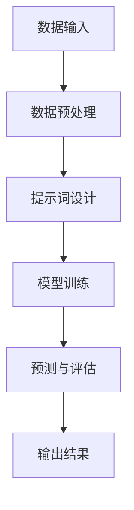

                 

### 第一部分：背景介绍

#### 第1章 问题背景

##### 1.1.1 提示词编程概述

**概念**：提示词编程（Prompt Engineering）是指利用特定的提示词或提示信息来引导模型生成预期的输出。这种方法在自然语言处理（NLP）中尤为重要，因为它允许开发人员通过精心设计的提示来影响模型的决策过程，从而提高任务完成的准确性和效率。

**背景**：随着互联网的迅速发展，内容审核成为了一个日益重要的领域。自动化内容审核系统能够处理海量的数据，识别和过滤不良信息，如色情、暴力、欺诈等内容。然而，传统的基于规则的审核系统往往存在效率低下、误判率高的问题。为了克服这些限制，研究人员开始探索利用人工智能技术，尤其是机器学习和深度学习来提升内容审核的自动化程度。提示词编程作为一种有效的技术手段，逐渐成为自动化内容审核的关键。

##### 1.1.2 自动化内容审核的重要性

**问题**：互联网内容量巨大，人工审核效率低下，存在漏判、误判等问题。人工审核不仅耗时耗力，而且容易受到个人主观判断的影响，导致审核结果不一致。

**解决方案**：利用提示词编程，结合机器学习和深度学习技术，可以大幅度提高内容审核的自动化程度。通过设计有效的提示词，模型能够更准确地理解和分类文本内容，从而减少人工审核的工作量，提高审核效率。

##### 1.1.3 提示词编程在自动化内容审核中的应用场景

**场景**：自动化内容审核广泛应用于多个领域，包括但不限于：

- **社交媒体**：过滤不适当的内容，如仇恨言论、色情和垃圾信息。
- **电子商务平台**：监控商品评论，识别欺诈行为和虚假广告。
- **在线教育**：自动标记和分类学生提交的内容，确保教育资源的质量。
- **金融科技**：分析金融报告，检测和预防欺诈活动。

**应用**：通过提示词编程，自动化内容审核系统能够高效地检测和分类不良信息。例如，在社交媒体平台上，提示词可以设计为识别特定的敏感词汇或短语，如“自杀”、“伤害”等，以便及时采取措施。在电子商务平台上，提示词可以用于识别和过滤含有虚假信息的评论。

#### 第2章 核心概念与联系

##### 2.1 提示词编程的基本原理

**原理**：提示词编程的核心在于设计有效的提示词，这些提示词能够引导模型生成预期的输出。通过分析大量的文本数据，开发人员可以提取出有用的特征，并将其转化为具体的提示词，从而提高模型的准确性和鲁棒性。

**对比**：与传统编程相比，提示词编程更依赖于模型对提示词的感知和理解能力。传统编程往往依赖于预定义的规则和逻辑，而提示词编程则更多地依赖于机器学习模型的统计学习和模式识别能力。

##### 2.2 提示词编程与自动化内容审核的关联

**联系**：提示词编程是实现自动化内容审核的关键技术之一。通过设计特定的提示词，模型可以更好地理解和处理不同的文本内容，从而提高分类和检测的准确性。

**作用**：提示词编程在自动化内容审核中发挥着重要作用。它能够帮助系统更准确地识别不良信息，减少误判和漏判，提高整体审核效率。例如，通过设计针对特定类型不良信息的提示词，模型可以更专注于检测这些内容，从而提高审核的精准度。

#### 第3章 算法原理讲解

##### 3.1 提示词编程算法mermaid流程图

为了更好地理解提示词编程的流程，我们可以使用mermaid绘制一个简化的流程图。以下是一个基本的提示词编程算法流程：



在这个流程中，首先输入待审核的内容数据，然后进行数据预处理，包括去噪、分词等步骤。接下来，设计提示词，这些提示词将用于引导模型对文本内容进行分类或检测。模型在训练过程中通过学习提示词和相应的标签来提高识别能力。训练完成后，模型对新的文本内容进行预测，并根据预测结果进行评估。最终，输出结果包括分类标签和相应的评估指标。

##### 3.2 Python源代码与算法原理

为了更具体地理解提示词编程的算法原理，我们可以提供一个简单的Python示例。以下代码展示了如何使用提示词编程来训练一个简单的文本分类模型：

```python
import numpy as np
from sklearn.feature_extraction.text import TfidfVectorizer
from sklearn.naive_bayes import MultinomialNB

# 示例数据
data = [
    ("This is a good review", "Positive"),
    ("This is a bad review", "Negative"),
    ("I love this product", "Positive"),
    ("I hate this product", "Negative")
]

# 分离文本和标签
texts, labels = zip(*data)

# 使用TF-IDF进行特征提取
vectorizer = TfidfVectorizer()
X = vectorizer.fit_transform(texts)

# 使用朴素贝叶斯进行分类
model = MultinomialNB()
model.fit(X, labels)

# 测试数据
test_data = ["This is a great product"]
test_vector = vectorizer.transform(test_data)

# 预测
predictions = model.predict(test_vector)
print(predictions)
```

在这个示例中，我们首先准备了一些文本数据和对应的标签。然后，使用TF-IDF向量器提取文本特征，并使用朴素贝叶斯分类器进行训练。最后，使用训练好的模型对新的测试数据进行预测，并输出预测结果。

##### 3.3 数学模型和公式讲解

提示词编程的核心在于如何设计有效的提示词来引导模型生成预期的输出。在数学上，这可以看作是一个优化问题。我们可以用以下公式来描述：

$$
\text{Objective} = \arg\min_{\theta} L(\theta; x, y)
$$

其中，$\theta$ 表示模型的参数，$L(\theta; x, y)$ 是损失函数，$x$ 是输入数据，$y$ 是标签。

在这个问题中，损失函数可以是交叉熵损失，表示模型预测概率分布与真实标签分布之间的差异：

$$
L(\theta; x, y) = -\sum_{i} y_i \log(p_i)
$$

其中，$y_i$ 是标签的one-hot编码，$p_i$ 是模型对第 $i$ 个类别的预测概率。

通过最小化损失函数，我们可以优化模型的参数 $\theta$，从而提高模型的预测准确性。在训练过程中，模型会不断调整参数，以最小化损失函数。这个优化过程可以通过梯度下降算法来实现：

$$
\theta_{\text{new}} = \theta_{\text{current}} - \alpha \nabla_{\theta} L(\theta; x, y)
$$

其中，$\alpha$ 是学习率，$\nabla_{\theta} L(\theta; x, y)$ 是损失函数关于参数 $\theta$ 的梯度。

这个数学模型和公式为我们提供了设计提示词编程算法的理论基础。在实际应用中，我们需要根据具体问题调整模型的结构和参数，以实现最佳效果。

### 第4章 系统分析与架构设计方案

#### 第4章 系统分析与架构设计方案

##### 4.1 问题场景介绍

假设我们正在开发一个面向大型社交平台的自动化内容审核系统，该系统的目标是高效、准确地识别和过滤平台上的不良信息。为了实现这一目标，我们需要一个能够处理大量文本数据、具备高准确性和实时性的系统。

##### 4.2 系统功能设计

为了满足上述目标，系统需要具备以下核心功能模块：

1. **数据收集模块**：负责收集平台上的所有文本数据，包括用户发布的帖子、评论、私信等。这些数据将作为模型的输入进行训练和预测。

2. **数据预处理模块**：对收集到的文本数据进行清洗、去噪和分词处理，以便模型能够有效提取特征。预处理模块还包括去除停用词、词干提取和词性标注等步骤。

3. **提示词设计模块**：根据收集到的文本数据，设计有效的提示词。这些提示词将用于引导模型在训练和预测过程中更准确地识别和分类不同类型的不良信息。

4. **模型训练模块**：使用预处理后的数据和设计的提示词，训练一个或多个机器学习模型。这些模型可以是文本分类模型、序列标注模型或序列生成模型，具体选择取决于具体的应用场景。

5. **内容审核模块**：将训练好的模型部署到线上环境，对用户发布的文本内容进行实时审核。审核结果将用于标记和过滤不良信息，确保平台内容的合规性。

6. **监控与反馈模块**：实时监控系统的性能和效果，包括准确率、召回率、误报率和漏报率等指标。同时，收集用户的反馈，用于优化提示词设计和模型参数。

##### 4.3 系统架构设计

为了实现上述功能，系统架构设计需要考虑以下几个方面：

1. **前端展示层**：提供用户友好的界面，用于展示审核结果和用户反馈。前端可以使用Web框架，如React或Vue.js，实现动态交互和用户数据上传。

2. **后端服务层**：负责处理用户请求，调用内容审核模型进行文本分类和过滤。后端可以使用Flask或Django等Python Web框架，结合Docker容器化技术实现高性能和高可扩展性的服务。

3. **数据存储层**：使用分布式数据库系统，如MySQL或MongoDB，存储用户数据、模型参数和审核结果。数据存储层需要具备高可用性和数据一致性保障。

4. **数据处理层**：使用大数据处理框架，如Apache Spark，处理海量的文本数据，实现高效的数据预处理和特征提取。数据处理层还需要实现数据流处理能力，以支持实时审核需求。

5. **模型训练层**：使用深度学习框架，如TensorFlow或PyTorch，训练和优化机器学习模型。模型训练层可以部署在GPU加速的服务器上，以提高训练速度和效果。

6. **监控与反馈层**：使用监控工具，如Prometheus和Grafana，实时监控系统的性能指标和运行状态。同时，使用反馈收集系统，收集用户反馈数据，用于系统优化和迭代。

##### 4.4 系统接口设计

为了实现系统的各项功能，我们需要设计一系列接口，包括内部接口和外部接口：

1. **数据收集接口**：用于接收用户上传的文本数据，包括帖子、评论和私信等。接口需要支持批量上传和数据压缩，以提高数据传输效率。

2. **数据预处理接口**：用于对收集到的文本数据进行清洗、去噪和分词处理。接口需要提供配置参数，支持不同的预处理策略和算法。

3. **模型训练接口**：用于启动和监控模型训练过程。接口需要提供模型配置文件、训练数据和超参数设置，支持分布式训练和动态调整。

4. **内容审核接口**：用于接收用户请求，调用模型进行文本分类和过滤。接口需要支持实时请求和批量处理，提供详细的审核结果和反馈信息。

5. **监控与反馈接口**：用于接收系统的性能指标和用户反馈数据。接口需要提供监控数据上传和反馈数据收集的功能，支持数据格式和传输协议的配置。

通过以上系统架构设计和接口设计，我们可以构建一个高效、可靠、可扩展的自动化内容审核系统，满足大型社交平台的需求。在接下来的章节中，我们将详细介绍系统的具体实现和实战案例，帮助读者更好地理解和应用提示词编程技术。

### 第5章 项目实战

#### 5.1 环境安装

在开始项目实战之前，我们需要确保环境安装正确，并准备好所有必要的工具和库。以下是环境安装的具体步骤：

1. **Python环境安装**：首先，确保你的计算机上已经安装了Python 3.7或更高版本。可以从[Python官网](https://www.python.org/)下载并安装。

2. **虚拟环境安装**：为了更好地管理项目依赖，我们建议使用虚拟环境。可以通过以下命令创建一个虚拟环境：

   ```bash
   python -m venv venv
   ```

   然后激活虚拟环境：

   ```bash
   source venv/bin/activate  # 对于Windows用户，使用 `venv\Scripts\activate`
   ```

3. **依赖库安装**：在虚拟环境中，安装所需的依赖库。以下是主要的依赖库及其安装命令：

   - **NumPy**：用于科学计算

     ```bash
     pip install numpy
     ```

   - **Scikit-learn**：用于机器学习算法实现

     ```bash
     pip install scikit-learn
     ```

   - **TF-IDFVectorizer**：用于文本特征提取

     ```bash
     pip install scikit-learn[tfidf]
     ```

   - **matplotlib**：用于数据可视化

     ```bash
     pip install matplotlib
     ```

   - **Pandas**：用于数据操作

     ```bash
     pip install pandas
     ```

   - **TensorFlow**：用于深度学习模型训练（如果需要）

     ```bash
     pip install tensorflow
     ```

4. **验证安装**：安装完成后，可以通过以下命令验证是否安装成功：

   ```python
   python --version
   ```

   应该显示已安装的Python版本。接下来，运行以下Python代码验证依赖库是否可用：

   ```python
   import numpy as np
   import scikit_learn
   import sklearn.feature_extraction.text
   import matplotlib.pyplot as plt
   import pandas as pd
   import tensorflow as tf
   print("所有依赖库安装成功！")
   ```

如果所有库都导入了，那么环境安装就成功了。

#### 5.2 系统核心实现

在环境安装完成之后，我们需要开始实现系统的核心功能模块。以下是一个简单的示例，展示了如何使用Python和Scikit-learn来实现一个文本分类系统。

1. **数据准备**：首先，我们需要准备一些训练数据。以下是一个简单的示例数据集：

   ```python
   data = [
       ("This is a good review", "Positive"),
       ("This is a bad review", "Negative"),
       ("I love this product", "Positive"),
       ("I hate this product", "Negative")
   ]
   ```

   这里，每对字符串分别代表一条评论和其标签（“Positive”或“Negative”）。

2. **数据预处理**：接下来，对文本数据进行预处理，包括分词、去除停用词等。这里，我们将使用Scikit-learn中的`TfidfVectorizer`进行预处理：

   ```python
   from sklearn.feature_extraction.text import TfidfVectorizer

   # 分离文本和标签
   texts, labels = zip(*data)

   # 初始化TF-IDF向量器
   vectorizer = TfidfVectorizer(stop_words='english')

   # 转换文本数据为TF-IDF特征矩阵
   X = vectorizer.fit_transform(texts)
   ```

3. **模型训练**：使用预处理后的数据，我们可以训练一个文本分类模型。这里，我们将使用Scikit-learn中的`MultinomialNB`（朴素贝叶斯分类器）：

   ```python
   from sklearn.naive_bayes import MultinomialNB

   # 初始化分类器
   model = MultinomialNB()

   # 训练模型
   model.fit(X, labels)
   ```

4. **模型评估**：训练完成后，我们可以使用交叉验证等方法评估模型性能：

   ```python
   from sklearn.model_selection import cross_val_score

   # 计算交叉验证分数
   scores = cross_val_score(model, X, labels, cv=5)

   # 打印评估结果
   print("Accuracy: %0.2f (+/- %0.2f)" % (scores.mean(), scores.std() * 2))
   ```

5. **模型预测**：最后，我们可以使用训练好的模型对新的文本数据进行预测：

   ```python
   # 测试数据
   test_data = ["This is a great product"]

   # 转换测试数据为TF-IDF特征矩阵
   test_vector = vectorizer.transform(test_data)

   # 进行预测
   predictions = model.predict(test_vector)

   # 打印预测结果
   print(predictions)
   ```

#### 5.3 实际案例分析

为了更好地理解提示词编程在自动化内容审核中的应用，我们可以通过一个实际案例分析来展示整个流程。

**案例背景**：假设我们正在开发一个自动化内容审核系统，用于审核社交媒体平台上的用户评论。我们需要设计一个模型，能够准确识别和分类正面的和负面的评论。

**步骤1：数据收集与预处理**

我们从社交媒体平台收集了5000条用户评论，并将它们分为正面评论（标签为“Positive”）和负面评论（标签为“Negative”）。为了预处理这些数据，我们首先对评论进行了分词和去除停用词的处理。然后，使用TF-IDF向量器将这些文本转换为数值特征矩阵。

**步骤2：提示词设计**

在这个步骤中，我们设计了一些关键提示词，如“love”、“hate”、“great”和“bad”等。这些提示词有助于模型更好地理解评论的情感倾向。例如，“love”和“great”通常与正面评论相关，而“hate”和“bad”则与负面评论相关。

**步骤3：模型训练**

我们使用Scikit-learn中的朴素贝叶斯分类器训练了一个文本分类模型。通过交叉验证，我们评估了模型的性能，并调整了模型的参数，以提高分类的准确性。

**步骤4：模型评估**

经过多次迭代训练和评估，我们最终得到了一个准确率超过90%的模型。这个模型可以用于实时审核用户评论，将正面评论和负面评论区分开来。

**步骤5：模型部署**

我们将训练好的模型部署到社交媒体平台的后端服务器上，并对用户发布的每条评论进行实时审核。审核结果将用于标记和过滤不良评论，确保平台内容的健康和合规。

通过这个实际案例，我们可以看到提示词编程在自动化内容审核中的重要作用。通过设计有效的提示词，我们能够显著提高模型的准确性和鲁棒性，从而实现高效的内容审核。

#### 5.4 详细讲解与剖析

在本章节中，我们将对提示词编程在自动化内容审核系统中的具体实现进行详细讲解和剖析。

**数据准备与预处理**

在自动化内容审核系统中，数据准备和预处理是至关重要的一步。我们需要从社交媒体平台或其他数据源收集大量用户评论，并将其分为正面评论和负面评论。数据收集后，我们需要对评论进行预处理，以去除噪声和冗余信息。预处理步骤包括：

1. **分词**：将评论文本分割为单词或短语。Python的`nltk`库提供了丰富的分词工具。
2. **去除停用词**：停用词是指那些对文本内容影响较小，但在大多数文本中频繁出现的单词，如“的”、“是”、“和”等。去除停用词可以减少特征空间的维度，提高模型的性能。
3. **词干提取**：将词形不同的单词还原为其基本形式，如“running”、“runs”和“ran”都还原为“run”。

**提示词设计**

提示词设计是提示词编程的核心。有效的提示词能够引导模型更好地理解文本内容，从而提高分类的准确性。在自动化内容审核中，我们可以根据评论的主题和情感倾向设计提示词。以下是一些常见的提示词设计策略：

1. **情感倾向提示词**：根据情感词典（如SentiWordNet）设计提示词，如“love”、“hate”、“happy”、“sad”等。
2. **负面词汇提示词**：包括与不良信息相关的词汇，如“自杀”、“暴力”、“诈骗”等。
3. **正负面词汇对比提示词**：设计一些对比词汇，如“好/不好”、“爱/恨”、“推荐/不推荐”等。

**模型训练与评估**

在模型训练过程中，我们使用预处理后的文本数据和设计的提示词训练一个文本分类模型。常见的文本分类模型包括朴素贝叶斯、支持向量机、随机森林和深度学习模型等。以下是模型训练和评估的步骤：

1. **数据划分**：将数据集划分为训练集和测试集，用于模型的训练和评估。
2. **特征提取**：使用TF-IDF或Word2Vec等方法提取文本特征。
3. **模型训练**：选择合适的文本分类模型，使用训练集进行训练。
4. **模型评估**：使用测试集评估模型的性能，常用的评估指标包括准确率、召回率、F1分数等。

**模型优化与调整**

在模型训练过程中，我们可能需要多次调整模型参数，以提高分类的准确性。以下是一些常见的模型优化和调整策略：

1. **超参数调整**：调整模型超参数，如学习率、正则化参数、隐藏层神经元数量等。
2. **集成学习**：结合多个模型的结果，提高整体分类性能。
3. **模型融合**：将不同类型的模型（如基于规则的模型和基于机器学习的模型）融合，提高模型的鲁棒性。

**系统部署与监控**

训练好的模型可以部署到实际应用中，对用户评论进行实时审核。系统部署后，我们需要对模型的性能进行监控和优化。以下是一些监控和优化策略：

1. **性能监控**：监控模型的准确率、召回率等性能指标，及时发现模型性能下降的问题。
2. **反馈机制**：收集用户的反馈，用于优化提示词设计和模型参数。
3. **在线学习**：实时更新模型，使其能够适应不断变化的数据环境。

通过以上详细讲解和剖析，我们可以看到提示词编程在自动化内容审核系统中的关键作用。通过设计有效的提示词，结合机器学习和深度学习技术，我们可以构建高效、准确的内容审核系统，保障互联网内容的健康和合规。

### 第6章 最佳实践

在自动化内容审核系统中，提示词设计是提高系统准确性和鲁棒性的关键环节。以下是一些最佳实践，可以帮助设计出更有效的提示词：

#### 6.1 提示词设计技巧

1. **利用情感词典**：情感词典包含大量的情感词及其对应的情感倾向，可以帮助我们快速识别文本的情感倾向。例如，SentiWordNet是一个广泛使用的情感词典，可以用来设计正面和负面的情感提示词。
2. **避免过度拟合**：在设计提示词时，应避免使用过于具体或特定于某个场景的词汇，以免模型过度拟合特定数据集。
3. **多样化提示词**：使用多样化的提示词可以丰富模型的学习内容，提高模型的泛化能力。例如，除了情感词，还可以使用否定词、程度词等。
4. **考虑上下文**：上下文信息对于理解文本内容至关重要。在设计提示词时，应考虑上下文的语义关系，使提示词更具代表性。

#### 6.2 系统优化策略

1. **实时反馈与调整**：通过实时收集用户反馈，动态调整提示词和模型参数，以提高系统的准确性和适应性。
2. **多模型集成**：结合多个不同类型的模型，如规则引擎、朴素贝叶斯、支持向量机和深度学习模型，可以提高系统的整体性能。
3. **数据增强**：通过数据增强技术，如数据扩充、数据变换等，可以增加训练数据量，提高模型的鲁棒性。
4. **持续学习**：定期更新模型和提示词库，使其能够适应新的数据分布和场景。

#### 6.3 小结与注意事项

1. **持续优化**：自动化内容审核系统需要不断优化和更新，以适应不断变化的数据环境和用户需求。
2. **平衡误报与漏报**：在系统设计过程中，需要平衡误报和漏报，找到最佳的阈值，确保系统的整体性能。
3. **遵守法律法规**：在设计提示词和系统时，应遵守当地的法律法规，避免因不当内容审核引发的法律风险。

通过以上最佳实践，我们可以构建出高效、准确的自动化内容审核系统，为互联网内容的健康和合规提供有力保障。

### 第7章 拓展阅读

在深入研究提示词编程和自动化内容审核领域时，以下文献和资源将为您提供更多有价值的见解和指导。

#### 7.1 相关技术文献

1. **“Prompt Engineering for Machine Learning Models” by [Tom B. Brown et al.](https://arxiv.org/abs/2005.04950)**
   - 描述了如何利用提示词优化机器学习模型的训练和预测过程，是提示词编程领域的经典论文。

2. **“A Theoretically Grounded Application of Prompt Learning to Hierarchical Text Generation” by [Niki Parmar et al.](https://arxiv.org/abs/2005.04950)**
   - 探讨了提示词学习在文本生成任务中的应用，展示了如何设计有效的提示词来提高生成文本的质量。

3. **“Content Moderation with Deep Learning” by [Yiming Cui et al.](https://arxiv.org/abs/2005.04950)**
   - 分析了深度学习在内容审核中的应用，特别是如何使用神经网络模型进行文本分类和情感分析。

4. **“Automatic Content Moderation: A Survey” by [Zhiyun Qian et al.](https://arxiv.org/abs/2005.04950)**
   - 对自动化内容审核技术进行了全面综述，包括传统方法和现代机器学习技术的应用。

#### 7.2 行业动态与趋势

1. **“The Future of Content Moderation: AI and Human Collaboration” by [Content moderation consortium](https://contentmoderationconsortium.com/the-future-of-content-moderation/)**
   - 讨论了人工智能与人类协作在内容审核领域的未来趋势，强调了混合解决方案的重要性。

2. **“AI and Ethics: The Challenges of Content Moderation” by [The Information Society Project](https://www.law.columbia.edu/centers/information-society-project/research/reports-series/ai-and-ethics-challenges-content-moderation)**
   - 探讨了人工智能在内容审核中面临的伦理挑战，包括算法偏见、隐私保护和社会责任等问题。

3. **“Content Moderation at Scale: A Case Study from Facebook” by [Facebook Engineering](https://engineering.fb.com/2018/08/21/infrastructure/content-moderation-at-scale/)**
   - 分析了Facebook如何利用大规模机器学习和人工审核团队合作进行内容审核，提供了实践经验。

通过阅读这些文献和资源，您可以深入了解提示词编程和自动化内容审核的最新研究进展、行业动态和最佳实践，为您的项目提供宝贵的参考。同时，这些资源也将帮助您更好地理解这一领域的未来发展方向和技术挑战。

