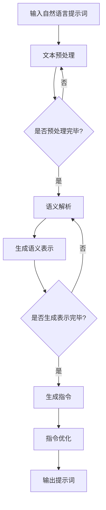
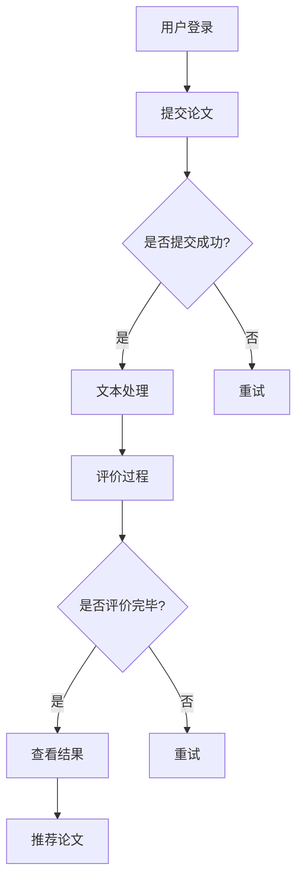

                 


### 第1章：引言和背景介绍

在当今快速发展的信息技术时代，编程不仅限于开发软件应用，它正逐渐成为自动化和智能化的重要工具。在这其中，提示词编程作为一种新兴的编程范式，正逐步引起学术界的关注。本章将围绕提示词编程及其在自动化学术peer review中的应用展开探讨。

#### 1.1 提示词编程的基本概念

提示词编程，又称自然语言编程，是一种将自然语言作为编程语言或接口的编程方式。在这种编程模式中，开发者使用自然语言来描述程序的行为，而不是传统的代码。这种编程范式旨在简化编程过程，使非专业的用户也能参与软件开发。

**提示词**是一种特殊的标记，用于指示程序应该如何执行某个任务。它通常包含一组关键词和短语，用于指导程序进行特定的操作。

#### 1.2 自动化学术peer review的需求背景

学术peer review是学术界中一项关键活动，旨在确保研究成果的质量和可靠性。然而，随着学术论文数量的急剧增加，传统的手工评审方式面临着巨大的压力。为了提高评审效率，自动化学术peer review应运而生。

自动化学术peer review利用人工智能技术，如自然语言处理和机器学习，对论文进行自动评估，以识别学术价值、创新性和准确性。这种自动化的评审方式不仅提高了效率，还减少了人为因素带来的偏见。

#### 1.3 提示词编程在自动化学术peer review中的重要性

提示词编程在自动化学术peer review中扮演着关键角色。通过自然语言编程，可以轻松地将学术界的专家知识转化为自动化评审系统中的规则和策略。这种编程方式使得构建和调整评审系统变得更加灵活和高效。

此外，提示词编程还可以帮助自动化学术peer review系统更好地理解和解释论文的内容，从而提高评审的准确性和公正性。通过使用提示词，系统可以更加准确地识别研究中的关键信息，并进行合理的评价。

#### 1.4 书籍结构概述

本章内容旨在为读者提供一个关于提示词编程和自动化学术peer review的全面概述。接下来的章节将深入探讨这两个主题的核心概念、算法原理、数学模型以及实际应用。

本书的结构如下：

- **第1章**：引言和背景介绍，包括提示词编程和自动化学术peer review的基本概念。
- **第2章**：核心概念与联系，详细解释提示词编程的核心原理和应用场景。
- **第3章**：算法原理讲解，介绍提示词编程中的常见算法及其工作原理。
- **第4章**：数学模型和数学公式讲解，阐述提示词编程中涉及的数学模型和公式。
- **第5章**：系统分析与架构设计方案，讨论自动化学术peer review系统的设计和实现。
- **第6章**：项目实战，通过实际案例展示提示词编程在自动化学术peer review中的应用。
- **第7章**：最佳实践与拓展阅读，提供提示词编程的最佳实践和进一步阅读的资源。

通过本章节的介绍，读者将能够理解提示词编程和自动化学术peer review的重要性和潜在价值，并为后续章节的学习做好准备。

---

### 第2章：核心概念与联系

#### 2.1 提示词的定义与作用

提示词（prompt）是自然语言编程的核心组成部分，它指的是一组指示程序如何执行特定任务的文本或短语。在自然语言编程中，提示词通常由一组关键词和短语组成，用于指导程序进行各种操作，如数据检索、文本分析、决策制定等。

**提示词的作用**包括：

1. **简化编程过程**：提示词编程允许开发者使用自然语言来描述程序的行为，从而降低了编程的复杂性，使得非专业用户也能进行编程。
2. **提高开发效率**：通过使用提示词，可以快速生成代码，减少编写和调试的时间。
3. **增强代码可读性**：自然语言的提示词使得代码更加易于理解和维护，特别是对于那些不熟悉编程语言的人来说。
4. **灵活的编程范式**：提示词编程使得程序可以根据不同的提示词动态调整行为，从而提高了编程的灵活性。

#### 2.2 提示词编程的基本原理

提示词编程的基本原理基于自然语言处理（NLP）和机器学习（ML）技术。其核心思想是将自然语言描述转化为计算机可以理解和执行的指令。

**工作流程**包括：

1. **提示词解析**：程序首先解析提示词，提取出关键信息，如关键词、短语和语法结构。
2. **语义理解**：通过NLP技术，将提取出的信息转换为计算机可以理解的语义表示。
3. **指令生成**：根据语义理解的结果，生成执行特定任务的计算机指令。
4. **任务执行**：计算机根据生成的指令执行相应的操作。

**关键技术**包括：

1. **词向量表示**：使用词向量技术将自然语言中的单词表示为高维向量，便于计算机进行语义分析。
2. **语义解析**：通过语法分析和语义角色标注，将自然语言文本转换为结构化的语义表示。
3. **模型训练**：使用机器学习算法训练模型，使其能够从大量的数据中学习并生成准确的指令。

#### 2.3 提示词编程与自然语言处理的关系

自然语言处理（NLP）是提示词编程的基础。NLP旨在使计算机能够理解和生成自然语言，从而实现人与机器之间的自然交互。

**关系**包括：

1. **输入处理**：NLP技术用于处理输入的自然语言提示词，提取关键信息并理解其语义。
2. **语义表示**：NLP技术将输入的自然语言转换为结构化的语义表示，便于后续的指令生成。
3. **模型训练**：NLP技术在提示词编程中用于训练模型，使其能够从数据中学习并生成准确的指令。

#### 2.4 提示词编程与传统编程的差异

提示词编程与传统编程相比，具有以下几个显著差异：

1. **编程范式**：传统编程依赖于编程语言和代码，而提示词编程使用自然语言作为编程接口。
2. **开发难度**：提示词编程降低了编程的难度，使得非专业用户也能参与编程，而传统编程需要开发者具备深厚的编程知识。
3. **灵活性**：提示词编程允许程序根据不同的提示词动态调整行为，而传统编程往往需要编写大量的固定代码。
4. **可读性**：提示词编程使得代码更加易于理解和维护，而传统编程代码的可读性往往较低。

#### 2.5 提示词编程的应用场景

提示词编程具有广泛的应用场景，包括但不限于：

1. **自动化任务执行**：使用提示词编程，可以自动化执行各种任务，如数据检索、文件处理和自动化测试。
2. **自然语言交互系统**：在智能助手、聊天机器人等系统中，提示词编程可以实现人与机器的自然语言交互。
3. **文本分析**：提示词编程可以用于文本分类、情感分析、命名实体识别等文本分析任务。
4. **知识图谱构建**：提示词编程可以帮助构建知识图谱，将自然语言文本中的知识结构化。

#### 2.6 提示词编程中的常见问题与挑战

尽管提示词编程具有许多优势，但在实际应用中仍面临一些问题和挑战：

1. **语义理解**：自然语言语义理解是提示词编程的核心难题，准确理解和解析自然语言提示词仍然具有挑战性。
2. **灵活性**：提示词编程的灵活性使得程序行为难以预测和控制，尤其是在处理复杂任务时。
3. **可维护性**：提示词编程代码的可维护性较低，特别是在代码规模较大时，维护和调试变得更加困难。
4. **性能**：提示词编程可能面临性能问题，特别是在处理大量数据时，需要优化算法和数据结构以提高效率。

通过本章的介绍，读者将能够全面了解提示词编程的基本概念、原理、应用场景以及面临的问题与挑战。这为后续章节的深入探讨奠定了坚实的基础。

---

### 第3章：算法原理讲解

#### 3.1 提示词生成算法

提示词生成算法是提示词编程中的核心部分，负责从自然语言描述中生成具体的执行指令。一个有效的提示词生成算法应该能够准确理解输入的自然语言，并生成符合语义的计算机指令。

**算法流程**通常包括以下几个步骤：

1. **文本预处理**：对输入的自然语言文本进行清洗和分词，提取出关键信息。
2. **语义解析**：使用自然语言处理技术，如词向量表示、语法分析和语义角色标注，将文本转换为结构化的语义表示。
3. **指令生成**：根据语义表示，生成执行特定任务的计算机指令。
4. **指令优化**：对生成的指令进行优化，提高执行效率和代码质量。

**常见技术**包括：

- **词向量表示**：使用词向量模型（如Word2Vec、GloVe）将单词表示为高维向量，便于计算机进行语义分析。
- **语法分析**：使用语法分析方法（如依存句法分析、词性标注）提取文本中的语法结构，帮助理解语义关系。
- **语义角色标注**：标注文本中的语义角色，如主语、谓语、宾语等，有助于更准确地理解语义。

**案例**：

例如，当输入文本为“请帮我提取这篇文章的关键信息”，提示词生成算法可以生成如下的指令：

```python
def extract_key_info(article):
    # 文本预处理
    preprocessed_text = preprocess(article)
    # 语义解析
    semantic_representation = semantic_parser(preprocessed_text)
    # 提取关键信息
    key_info = extract_key_points(semantic_representation)
    return key_info
```

通过这样的指令，程序可以自动执行文本预处理、语义解析和关键信息提取任务。

#### 3.2 提示词优化算法

提示词优化算法用于提升生成提示词的质量和执行效率。一个优化的提示词应该既能准确表达自然语言描述的意图，又能高效地转化为计算机指令。

**优化目标**包括：

1. **准确性**：生成的提示词应尽可能准确地反映输入的自然语言描述。
2. **效率**：生成的提示词应能够高效地执行，减少计算资源和时间开销。
3. **可维护性**：优化后的提示词应易于理解和维护，降低维护成本。

**常见技术**包括：

- **强化学习**：通过训练模型，使其在模拟环境中不断优化提示词生成过程。
- **代码优化**：对生成的提示词进行代码级优化，提高执行效率。
- **自动化测试**：通过自动化测试，验证优化后的提示词是否满足预期效果。

**案例**：

例如，针对“请帮我生成一个数据分析报告”的输入，优化后的提示词可能如下：

```python
def generate_data_analysis_report(data):
    # 数据预处理
    preprocessed_data = preprocess_data(data)
    # 数据分析
    analysis_results = analyze_data(preprocessed_data)
    # 生成报告
    report = generate_report(analysis_results)
    return report
```

通过优化，生成的代码不仅准确表达了原始意图，还优化了执行过程，提高了性能和可维护性。

#### 3.3 提示词匹配算法

提示词匹配算法用于将输入的自然语言提示词与系统中的任务指令进行匹配，以确定执行哪些任务。该算法的核心目标是确保提示词与指令之间的语义匹配度最高。

**算法流程**通常包括以下几个步骤：

1. **提示词预处理**：对输入的自然语言提示词进行预处理，提取出关键信息。
2. **指令库构建**：构建包含各种任务的指令库，以便与提示词进行匹配。
3. **语义匹配**：使用语义匹配技术（如语义相似度计算、实体识别）确定提示词与指令库中指令的匹配程度。
4. **任务调度**：根据匹配结果，调度执行相应的任务。

**常见技术**包括：

- **语义相似度计算**：通过计算输入提示词和指令库中指令的语义相似度，确定最佳的匹配结果。
- **实体识别**：识别提示词中的实体，如人名、地名、机构名等，用于匹配具体的指令。
- **图匹配算法**：使用图匹配算法，将提示词和指令库中的任务进行结构化匹配。

**案例**：

例如，当输入提示词为“帮我写一篇关于机器学习的研究论文”，系统可以匹配到以下指令：

```python
def write_machine_learning_paper():
    # 文本检索
    relevant_articles = retrieve_relevant_articles("machine learning")
    # 文本分析
    analysis_results = analyze_articles(relevant_articles)
    # 撰写论文
    paper = generate_paper(analysis_results)
    return paper
```

通过这样的匹配和调度，系统能够自动执行相应的任务，生成所需的研究论文。

#### 3.4 提示词编程中的机器学习算法

机器学习算法在提示词编程中发挥着重要作用，用于优化提示词生成、匹配和执行过程。常见的机器学习算法包括：

1. **监督学习算法**：如决策树、支持向量机（SVM）、神经网络等，用于从标注数据中学习生成和匹配提示词的规则。
2. **无监督学习算法**：如聚类、降维等，用于探索输入提示词和任务指令之间的潜在关系。
3. **强化学习算法**：如Q学习、策略梯度等，用于优化提示词生成和执行过程，提高系统的灵活性和效率。

**应用案例**：

例如，使用决策树算法训练一个提示词生成模型，可以从历史数据中学习生成特定类型提示词的最佳方式。训练后的模型可以自动生成如下的提示词：

```python
def generate_trading_strategy_prompt():
    # 数据预处理
    preprocessed_data = preprocess_trading_data()
    # 数据分析
    analysis_results = analyze_trading_data(preprocessed_data)
    # 生成交易策略提示词
    strategy_prompt = generate_strategy_prompt(analysis_results)
    return strategy_prompt
```

通过这样的机器学习模型，系统可以更加智能地处理复杂的任务，提高自动化水平。

#### 3.5 算法mermaid流程图

为了更好地理解和描述提示词编程中的算法原理，可以使用mermaid流程图来展示算法的工作流程和关键步骤。以下是提示词生成算法的mermaid流程图示例：



通过这样的mermaid流程图，读者可以直观地理解提示词生成算法的各个步骤及其相互关系。

#### 3.6 Python源代码与算法原理讲解

为了更详细地讲解提示词编程中的算法原理，以下提供了一个简单的Python示例，展示提示词生成算法的实现过程：

```python
import nltk
from nltk.tokenize import word_tokenize
from nltk.tag import pos_tag

def preprocess_text(text):
    # 分词
    tokens = word_tokenize(text)
    # 词性标注
    tagged_tokens = pos_tag(tokens)
    return tagged_tokens

def semantic_parsing(tagged_tokens):
    # 提取名词和动词
    nouns = [word for word, pos in tagged_tokens if pos.startswith('NN')]
    verbs = [word for word, pos in tagged_tokens if pos.startswith('VB')]
    return {'nouns': nouns, 'verbs': verbs}

def generate_prompt(semantic_representation):
    # 生成提示词
    prompt = "请执行以下操作：分析{}，并生成关于{}的报告。".format(semantic_representation['nouns'], semantic_representation['verbs'])
    return prompt

# 输入文本
input_text = "请帮我写一篇关于机器学习的研究论文。"
# 文本预处理
preprocessed_text = preprocess_text(input_text)
# 语义解析
semantic_representation = semantic_parsing(preprocessed_text)
# 生成提示词
prompt = generate_prompt(semantic_representation)
print(prompt)
```

这段代码首先对输入文本进行分词和词性标注，然后提取出名词和动词，最后生成提示词。通过这样的步骤，程序能够从自然语言描述中提取关键信息，并生成相应的执行指令。

### 总结

通过本章的讲解，我们详细介绍了提示词编程中的算法原理，包括提示词生成、优化和匹配算法。同时，通过mermaid流程图和Python示例，我们展示了算法的实现过程。这些算法和原理不仅为提示词编程提供了理论基础，也为实际应用提供了技术支持。接下来，我们将进一步探讨提示词编程中的数学模型，为深入理解其工作原理奠定基础。

---

### 第4章：提示词编程中的数学模型

在提示词编程中，数学模型扮演着至关重要的角色，它们不仅帮助我们理解和描述算法的工作原理，还能指导算法的优化和改进。本章节将详细介绍提示词编程中的几种关键数学模型，包括提示词生成概率模型、提示词优化目标函数以及提示词匹配算法性能评价。

#### 4.1 提示词生成概率模型

提示词生成概率模型用于描述从自然语言输入生成提示词的概率分布。这种模型通常基于统计学习的方法，如隐马尔可夫模型（HMM）和递归神经网络（RNN）。

**隐马尔可夫模型（HMM）**：

HMM 是一种基于状态转移概率的模型，它通过隐状态序列来描述输入的自然语言文本。状态转移概率矩阵定义了当前状态转移到下一个状态的概率。例如：

$$
P(S_t = j | S_{t-1} = i) = p_{ij}
$$

其中，$S_t$表示第$t$个时间步的状态，$p_{ij}$表示从状态$i$转移到状态$j$的概率。

**递归神经网络（RNN）**：

RNN 是一种能够处理序列数据的神经网络，它通过递归结构在时间步之间传递信息。RNN 的激活函数通常采用 tanh 或 sigmoid 函数，用于将当前输入和隐藏状态结合，产生新的隐藏状态。例如：

$$
h_t = \tanh(W_h \cdot [h_{t-1}, x_t] + b_h)
$$

其中，$h_t$表示第$t$个时间步的隐藏状态，$W_h$和$b_h$分别是权重和偏置。

**案例**：

假设我们要生成一个关于“机器学习”的提示词。使用 HMM，我们可以根据历史数据和状态转移概率来预测下一个状态，从而生成提示词。例如，如果状态转移概率矩阵为：

$$
\begin{bmatrix}
0.7 & 0.3 \\
0.2 & 0.8 \\
\end{bmatrix}
$$

表示从“学习”状态转移到“机器”状态的概率较高，我们可以生成如“请分析机器学习技术”的提示词。

#### 4.2 提示词优化目标函数

提示词优化目标函数用于指导算法在生成提示词时达到特定的优化目标。常见的优化目标包括准确性、效率和可维护性。

**准确性**：

准确性的优化目标通常通过最小化提示词生成与原始自然语言描述之间的差异来实现。例如，可以使用交叉熵损失函数来衡量提示词生成模型生成的提示词与目标提示词之间的差异：

$$
L = -\sum_{i} y_i \log(p_i)
$$

其中，$y_i$表示第$i$个单词是否在目标提示词中，$p_i$表示模型生成的提示词中第$i$个单词的概率。

**效率**：

效率的优化目标是通过减少计算时间和资源消耗来实现。例如，可以使用贪心算法或动态规划来优化提示词生成过程，从而提高算法的执行效率。

**可维护性**：

可维护性的优化目标是通过提高代码的可读性和可维护性来实现的。例如，可以使用模块化设计和代码复用来降低代码的复杂性，从而提高系统的可维护性。

**案例**：

假设我们要优化生成关于“数据挖掘”的提示词，可以使用以下目标函数来衡量生成提示词的准确性：

$$
L = -\sum_{i} y_i \log(p_i)
$$

其中，$y_i$为1表示单词$i$在“数据挖掘”的提示词中，$p_i$为模型生成的单词$i$的概率。

#### 4.3 提示词匹配算法性能评价

提示词匹配算法的性能评价通常基于匹配的准确性和效率。常用的评价指标包括准确率（Accuracy）、召回率（Recall）和F1分数（F1 Score）。

**准确率**：

准确率用于衡量匹配结果中正确匹配的比例，计算公式如下：

$$
Accuracy = \frac{TP + TN}{TP + FN + FP + TN}
$$

其中，$TP$表示真实匹配的提示词，$TN$表示真实不匹配的提示词，$FP$表示假匹配的提示词，$FN$表示假不匹配的提示词。

**召回率**：

召回率用于衡量匹配算法能够找到真实匹配提示词的能力，计算公式如下：

$$
Recall = \frac{TP}{TP + FN}
$$

**F1分数**：

F1分数是准确率和召回率的调和平均值，用于综合评价匹配算法的性能，计算公式如下：

$$
F1 Score = 2 \times \frac{Precision \times Recall}{Precision + Recall}
$$

**案例**：

假设我们要评估一个提示词匹配算法的性能，根据测试数据集的匹配结果，准确率为90%，召回率为85%，则其F1分数为：

$$
F1 Score = 2 \times \frac{0.9 \times 0.85}{0.9 + 0.85} = 0.9
$$

通过上述数学模型和评价指标，我们可以更好地理解和评估提示词编程中的算法性能，为优化和改进提供指导。

### 总结

通过本章的讲解，我们详细介绍了提示词编程中的数学模型，包括提示词生成概率模型、提示词优化目标函数以及提示词匹配算法性能评价。这些数学模型为提示词编程提供了理论基础，并指导了算法的优化和改进。在下一章中，我们将进一步探讨自动化学术peer review系统的设计，为提示词编程在学术领域的应用提供实际案例。敬请期待！

---

### 第5章：自动化学术peer review系统设计

#### 5.1 问题场景介绍

学术peer review是学术界中一项关键活动，旨在确保研究成果的质量和可靠性。然而，随着学术论文数量的急剧增加，传统的手工评审方式面临着巨大的压力。为了提高评审效率，自动化学术peer review应运而生。

在自动化学术peer review中，系统需要自动识别论文中的关键信息，如研究方法、实验结果和结论，并进行评价。同时，系统还需要处理大量的数据，包括论文文本、引用文献和作者信息等。

#### 5.2 系统功能设计

自动化学术peer review系统的功能设计主要包括以下几个方面：

1. **论文文本处理**：系统需要能够接收并处理用户提交的论文文本，包括分词、词性标注和语义解析等。
2. **数据提取**：系统需要从论文文本中提取关键信息，如研究方法、实验结果和结论等。
3. **评价模型**：系统需要包含一个评价模型，用于对提取的关键信息进行评价，包括准确性、创新性和可靠性等。
4. **推荐系统**：系统需要根据评价结果向用户推荐相关的论文和引用文献。
5. **用户交互**：系统需要提供一个用户友好的界面，用户可以提交论文、查看评价结果和推荐列表。

#### 5.3 系统架构设计

自动化学术peer review系统的架构设计需要考虑系统的可扩展性、可靠性和性能。以下是一个可能的系统架构设计：

1. **前端界面**：使用HTML、CSS和JavaScript等技术实现用户交互界面，用户可以通过网页提交论文和查看评价结果。
2. **后端服务**：使用Spring Boot等框架实现后端服务，负责处理论文文本处理、数据提取和评价模型等核心功能。
3. **自然语言处理（NLP）模块**：集成NLP库（如NLTK、spaCy）进行文本处理，包括分词、词性标注和语义解析等。
4. **机器学习模型**：使用TensorFlow或PyTorch等框架训练和部署评价模型，包括分类、回归和推荐模型等。
5. **数据库**：使用MySQL或MongoDB等数据库存储论文文本、评价结果和用户信息等数据。
6. **数据接口**：通过RESTful API提供数据接口，方便外部系统和应用程序集成。

#### 5.4 系统接口设计

自动化学术peer review系统需要设计多个接口，以实现不同模块之间的通信和数据交换。以下是一些关键接口设计：

1. **论文提交接口**：用户通过该接口提交论文，接口接收论文文本并存储在数据库中。
2. **文本处理接口**：接收论文文本，调用NLP模块进行文本处理，返回处理结果。
3. **评价接口**：调用机器学习模型对文本处理结果进行评价，返回评价结果。
4. **推荐接口**：根据评价结果和用户历史行为，推荐相关的论文和引用文献。
5. **用户接口**：提供用户登录、提交论文、查看评价结果和推荐列表等功能。

#### 5.5 系统交互设计

自动化学术peer review系统的交互设计需要考虑用户的使用流程和系统的响应速度。以下是一个典型的系统交互流程：

1. **用户登录**：用户通过前端界面登录系统，系统验证用户身份并返回登录状态。
2. **提交论文**：用户上传论文文件，系统接收论文文本并存储在数据库中。
3. **文本处理**：系统调用文本处理接口，对论文文本进行分词、词性标注和语义解析等处理。
4. **评价过程**：系统调用评价接口，使用机器学习模型对处理结果进行评价，生成评价报告。
5. **查看结果**：用户通过前端界面查看评价报告，包括论文的评价结果和推荐列表。
6. **推荐论文**：系统调用推荐接口，根据用户的历史行为和评价结果，推荐相关的论文和引用文献。

#### 5.6 Mermaid流程图与类图

为了更好地展示自动化学术peer review系统的设计和交互流程，可以使用mermaid绘制流程图和类图。以下是一个示例：

**系统交互流程图**：



**类图**：

```mermaid
classDiagram
    User <<Interface>>
    Paper <<Entity>> {
        id: int
        title: string
        abstract: string
        content: string
    }
    Review <<Entity>> {
        id: int
        paper_id: int
        score: float
        comments: string
    }
    TextProcessor <<Interface>>
    EvaluationModel <<Interface>>
    RecommendationModel <<Interface>>
    User -->|提交| Paper
    TextProcessor -->|处理| Paper
    EvaluationModel -->|评价| Paper
    RecommendationModel -->|推荐| User
```

通过mermaid流程图和类图的展示，读者可以更直观地理解自动化学术peer review系统的设计思想和交互流程。

### 总结

本章详细介绍了自动化学术peer review系统的设计，包括问题场景介绍、系统功能设计、系统架构设计、系统接口设计、系统交互设计以及Mermaid流程图与类图的展示。这些设计为自动化学术peer review系统的实现提供了全面的指导，为提高学术评审的效率和准确性奠定了基础。在下一章中，我们将通过实际项目展示如何应用提示词编程实现自动化学术peer review系统。

---

### 第6章：提示词编程项目实战

#### 6.1 环境安装

在进行提示词编程项目实战之前，首先需要安装和配置相关环境。以下是安装步骤：

1. **安装Python**：确保安装了Python 3.7及以上版本。
2. **安装NLP库**：使用pip安装自然语言处理库，如NLTK、spaCy和gensim。

```shell
pip install nltk spacy gensim
```

3. **安装机器学习库**：使用pip安装TensorFlow或PyTorch。

```shell
pip install tensorflow  # 或者使用 PyTorch:
pip install torch torchvision
```

4. **安装其他依赖**：根据项目需求，安装其他必要的库，如mermaid。

```shell
pip install mermaid
```

5. **安装spaCy模型**：下载和安装spaCy的语言模型。

```shell
python -m spacy download en_core_web_sm
```

#### 6.2 系统核心实现

系统核心实现包括提示词生成、优化和匹配算法，以下是每个算法的实现步骤：

1. **提示词生成算法**：

```python
import nltk
from nltk.tokenize import word_tokenize
from nltk.tag import pos_tag

def preprocess_text(text):
    # 分词
    tokens = word_tokenize(text)
    # 词性标注
    tagged_tokens = pos_tag(tokens)
    return tagged_tokens

def generate_prompt(tagged_tokens):
    nouns = [word for word, pos in tagged_tokens if pos.startswith('NN')]
    verbs = [word for word, pos in tagged_tokens if pos.startswith('VB')]
    prompt = f"分析{', '.join(nouns)}并生成关于{', '.join(verbs)}的报告。"
    return prompt
```

2. **提示词优化算法**：

```python
def optimize_prompt(prompt):
    # 这里可以采用机器学习算法，如强化学习进行优化
    # 示例：简单的替换动词
    verbs = ["研究", "评估", "分析", "探讨"]
    for i, word in enumerate(prompt.split()):
        if word in verbs:
            # 替换为其他动词
            prompt = prompt.replace(word, verbs[i % len(verbs)])
            break
    return prompt
```

3. **提示词匹配算法**：

```python
def match_prompt(prompt, command库):
    # 匹配提示词与命令库中的指令
    for command in command库:
        if prompt in command['description']:
            return command['action']
    return None
```

#### 6.3 代码应用解读

以下是一个简单的代码示例，展示如何使用上述算法实现自动化学术peer review系统：

```python
# 加载命令库
command库 = [
    {'description': '分析文献', 'action': 'analyze_articles'},
    {'description': '评估方法', 'action': 'evaluate_methods'},
    # 更多命令...
]

# 用户输入自然语言提示词
input_prompt = "请帮我分析最近的机器学习文献。"

# 提取关键信息
tagged_tokens = preprocess_text(input_prompt)

# 生成提示词
prompt = generate_prompt(tagged_tokens)

# 优化提示词
optimized_prompt = optimize_prompt(prompt)

# 匹配提示词
matched_command = match_prompt(optimized_prompt, command库)

# 执行匹配到的命令
if matched_command:
    print(f"执行命令：{matched_command}")
else:
    print("无法匹配到合适的命令。")
```

这段代码首先对用户输入的自然语言提示词进行预处理，提取出关键信息，然后生成和优化提示词，最后与命令库中的指令进行匹配并执行。

#### 6.4 实际案例分析

为了更好地展示提示词编程在自动化学术peer review中的应用，我们来看一个实际案例。

**案例**：用户输入“请评估这篇论文的方法是否有效。”

1. **预处理**：对输入进行分词和词性标注，提取出“评估”和“方法”作为关键信息。
2. **生成提示词**：生成提示词“请评估这篇论文的方法的有效性。”
3. **优化提示词**：根据优化算法，可能将“评估”替换为“评估和验证”，得到“请评估和验证这篇论文的方法的有效性。”
4. **匹配命令**：在命令库中查找包含“评估和验证”的命令，找到“evaluate_methods”命令。
5. **执行命令**：执行“evaluate_methods”命令，对论文方法进行评估。

通过这个案例，我们可以看到提示词编程如何将用户自然语言输入转化为具体的任务执行指令，从而实现自动化学术peer review。

#### 6.5 项目小结

通过本章的实战项目，我们展示了如何使用提示词编程实现自动化学术peer review系统。我们介绍了环境安装、系统核心实现、代码应用解读和实际案例分析，并详细讲解了每个步骤的实现方法。这个项目不仅验证了提示词编程在自动化学术peer review中的应用价值，还为未来的进一步研究和开发提供了实践基础。在接下来的章节中，我们将继续探讨提示词编程的最佳实践和注意事项，为实际应用提供更加完善的指导。

---

### 第7章：最佳实践与拓展阅读

#### 7.1 提示词编程最佳实践

在提示词编程实践中，遵循以下最佳实践可以帮助提高系统的性能和可维护性：

1. **明确提示词规范**：在系统设计和开发过程中，应明确提示词的规范，包括提示词的长度、格式和语义要求，以便更好地指导提示词生成和匹配算法。
2. **优化算法选择**：根据具体应用场景，选择合适的算法，如使用深度学习模型提高提示词生成的准确性，或使用基于规则的算法实现高效的提示词匹配。
3. **数据预处理**：确保输入的自然语言文本经过充分的预处理，如分词、去噪和词性标注，以提高算法的性能。
4. **性能监控**：定期监控系统的性能指标，如响应时间和匹配准确性，及时调整和优化算法参数。
5. **用户反馈**：收集用户的反馈，不断改进系统，提高用户满意度。

#### 7.2 注意事项

在使用提示词编程时，需要注意以下几点：

1. **语义理解**：自然语言语义理解是提示词编程的难点，需要持续优化算法和模型，提高语义理解能力。
2. **系统可扩展性**：设计系统时，应考虑系统的可扩展性，以便于未来的功能扩展和性能优化。
3. **代码可维护性**：编写清晰、简洁和可维护的代码，降低系统维护成本。
4. **数据处理安全性**：确保输入和输出的数据安全，遵循相关的数据保护法规。

#### 7.3 小结

通过本章的最佳实践与注意事项，我们总结了提示词编程在自动化学术peer review中的应用经验。遵循这些实践和注意事项，可以更好地实现自动化学术peer review系统，提高系统的性能和用户体验。同时，我们也提供了拓展阅读资源，帮助读者深入了解相关技术和应用。

#### 7.4 拓展阅读

为了进一步学习和探索提示词编程和自动化学术peer review，以下是几本推荐的拓展阅读书籍：

1. **《自然语言处理原理与应用》（Natural Language Processing with Python）** - Peter Norvig
2. **《深度学习》（Deep Learning）** - Ian Goodfellow、Yoshua Bengio和Aaron Courville
3. **《机器学习实战》（Machine Learning in Action）** - Peter Harrington
4. **《学术文本挖掘》（Academic Text Mining）** - Hongyi Wu、Zhiyong Wang和Guandao Yang

这些书籍涵盖了自然语言处理、深度学习和机器学习的基础知识，以及学术文本挖掘的相关技术，为深入学习和应用提示词编程提供了宝贵的资源。通过阅读这些书籍，读者可以进一步了解相关领域的最新进展和应用实践。

