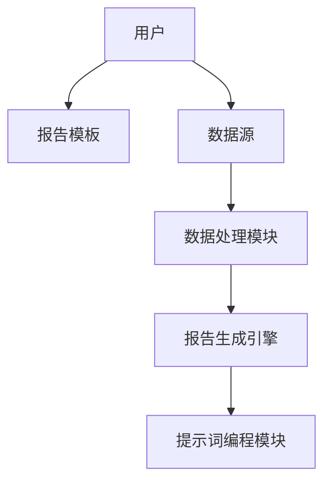
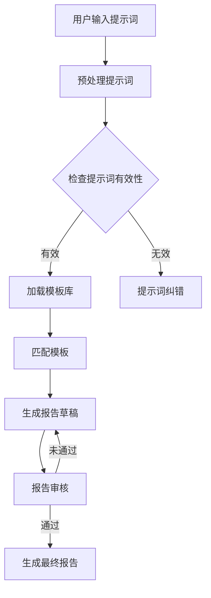

                 

### 《提示词编程在自动化报告生成中的角色》

#### 关键词

- 提示词编程
- 自动化报告生成
- 算法原理
- 数学模型
- 系统架构设计
- 最佳实践

#### 摘要

本文将深入探讨提示词编程在自动化报告生成中的应用，通过详细的背景介绍、概念解析、算法原理讲解、系统分析与架构设计，以及实战案例分析，全面展现这一技术在提高报告生成效率和准确性的重要作用。文章旨在帮助读者理解提示词编程的核心概念及其在自动化报告生成中的实际应用，为后续研究和实践提供有益的参考。

#### 目录大纲

```markdown
# 《提示词编程在自动化报告生成中的角色》

## 第一部分：背景介绍与概念解析

### 第1章：自动化报告生成的现状与挑战

### 第2章：核心概念与联系

## 第二部分：算法原理与实现

### 第3章：算法原理讲解

### 第4章：数学模型和数学公式

## 第三部分：系统分析与架构设计

### 第5章：系统功能设计与架构设计

### 第6章：项目实战

## 第四部分：最佳实践与拓展

### 第7章：最佳实践 Tips

## 第8章：总结与展望
```

---

## 第一部分：背景介绍与概念解析

### 第1章：自动化报告生成的现状与挑战

#### 1.1 自动化报告生成的背景

在信息爆炸的时代，报告作为一种重要的信息传递工具，其生成和分发变得越来越频繁。传统的报告生成方式往往依赖于人工操作，不仅耗时耗力，而且容易出现错误。随着计算机技术和人工智能的迅速发展，自动化报告生成逐渐成为可能。自动化报告生成可以显著提高工作效率，减少人为错误，是实现信息管理现代化的重要手段。

#### 1.2 当前自动化报告生成技术的局限性

尽管自动化报告生成技术有了显著进步，但现有的技术仍存在一些局限性。首先，现有技术大多依赖于模板驱动，灵活性不足，难以满足个性化需求。其次，现有算法在处理复杂数据结构和多样化报告格式时存在困难。此外，自动化报告生成技术往往缺乏对数据质量和报告准确性的保障机制。这些问题限制了自动化报告生成的广泛应用。

#### 1.3 提示词编程的概念与优势

提示词编程（Keyword Programming）是一种基于关键词和语义理解的编程范式，旨在通过语义标记和模板库自动生成代码。相比传统的模板驱动和规则引擎，提示词编程具有更高的灵活性和智能化水平。在自动化报告生成中，提示词编程能够根据用户需求和报告结构，自动生成符合要求的报告内容，从而解决传统技术的局限性。

#### 1.4 提示词编程在自动化报告生成中的应用前景

提示词编程在自动化报告生成中的应用前景广阔。通过引入自然语言处理和机器学习技术，提示词编程能够实现复杂报告内容的自动生成。在未来，提示词编程有望成为自动化报告生成的主要技术路线，推动报告生成技术的发展和创新。

#### 1.5 本章小结

本章介绍了自动化报告生成的背景、当前技术的局限性以及提示词编程的概念和优势。自动化报告生成技术正面临着智能化和自动化的转型需求，提示词编程在这一过程中扮演着关键角色。随着提示词编程技术的不断成熟，自动化报告生成的效率和质量将得到显著提升。

---

### 第2章：核心概念与联系

#### 2.1 自动化报告生成的核心概念

自动化报告生成涉及多个核心概念，包括报告模板、数据源、数据处理、报告生成引擎等。报告模板是报告生成的蓝图，定义了报告的结构和内容布局。数据源是报告生成所需的数据来源，可以是数据库、文件、Web服务等形式。数据处理包括数据清洗、转换和集成等步骤，以确保数据的质量和一致性。报告生成引擎是自动报告生成的核心，负责根据模板和数据生成最终的报告。

#### 2.2 提示词编程的基本原理

提示词编程的基本原理是基于关键词和语义理解，通过语义标记和模板库自动生成代码。提示词编程的关键技术包括自然语言处理、机器学习、模板库管理等。自然语言处理技术用于理解用户输入的关键词和语义，机器学习技术用于从大量数据中学习生成模式，模板库管理技术用于存储和管理不同的模板资源。

#### 2.3 概念属性特征对比表格

下面是一个概念属性特征对比表格，用于展示自动化报告生成和提示词编程的主要概念属性特征：

| 概念           | 属性特征                                  |
|----------------|----------------------------------------|
| 报告模板       | 结构定义、样式设置、内容框架                  |
| 数据源         | 数据类型、数据质量、数据访问方式                |
| 数据处理       | 数据清洗、转换、集成、数据质量评估                |
| 报告生成引擎   | 生成算法、生成速度、兼容性、可扩展性              |
| 提示词编程     | 语义理解、模板库管理、代码生成、灵活性、智能化       |

#### 2.4 ER实体关系图架构

下面是一个ER实体关系图（Entity-Relationship Diagram，ERD）架构，用于展示自动化报告生成和提示词编程的系统关系：



在这个ERD中，用户是报告生成的起点，通过定义报告模板和数据源，数据经过处理模块后由报告生成引擎生成最终的报告。提示词编程模块作为报告生成引擎的一部分，负责实现语义理解和代码生成功能。

---

## 第二部分：算法原理与实现

### 第3章：算法原理讲解

#### 3.1 提示词编程算法的mermaid流程图

下面是一个使用Mermaid绘制的提示词编程算法流程图：



#### 3.2 算法原理的数学模型和公式

提示词编程算法的数学模型可以表示为：

$$
\text{生成报告} = f(\text{提示词}, \text{模板库}, \text{数据集})
$$

其中，`f` 是一个复杂的函数，负责根据提示词和模板库生成报告。这个函数可以进一步拆分为多个子函数，如提示词预处理、模板匹配、报告草稿生成和报告审核等。

#### 3.3 Python源代码实现

以下是提示词编程算法的Python源代码实现示例：

```python
import nltk
from nltk.corpus import wordnet as wn
from sklearn.feature_extraction.text import TfidfVectorizer
from sklearn.metrics.pairwise import cosine_similarity

# 用户输入提示词
user_input = "公司财务报表分析"

# 预处理提示词
def preprocess_keywords(input_keywords):
    # 分词和词性标注
    tokens = nltk.word_tokenize(input_keywords)
    pos_tags = nltk.pos_tag(tokens)
    
    # 提取名词
    nouns = [word for word, pos in pos_tags if pos.startswith('N')]
    
    return nouns

# 加载模板库
def load_template_library():
    # 此处加载模板库，可以是预定义的模板列表或通过机器学习模型生成的模板
    template_library = ["财务报表模板1", "财务报表模板2", "年度财务分析模板"]
    return template_library

# 匹配模板
def match_template(nouns, template_library):
    vectorizer = TfidfVectorizer()
    templates_vectorized = vectorizer.fit_transform(template_library)
    
    user_input_vectorized = vectorizer.transform([nouns])
    similarities = cosine_similarity(user_input_vectorized, templates_vectorized)
    
    best_template_index = similarities.argmax()
    best_template = template_library[best_template_index]
    
    return best_template

# 生成报告草稿
def generate_report_draft(template, data_set):
    # 根据模板和数据集生成报告草稿
    # 这里用一个简单的文本替换示例
    report_draft = template.replace("{{data}}", data_set)
    return report_draft

# 生成最终报告
def generate_final_report(report_draft):
    # 报告审核和最终生成
    final_report = "审核通过的报告：" + report_draft
    return final_report

# 主函数
def main():
    nouns = preprocess_keywords(user_input)
    template_library = load_template_library()
    best_template = match_template(nouns, template_library)
    report_draft = generate_report_draft(best_template, "2022年财务数据")
    final_report = generate_final_report(report_draft)
    print(final_report)

if __name__ == "__main__":
    main()
```

#### 3.4 通俗易懂地举例说明

假设用户需要生成一份公司2022年的财务分析报告。用户输入的提示词为“公司2022年财务分析”。系统首先对提示词进行预处理，提取出关键词“公司”和“财务分析”。接下来，系统在模板库中寻找与关键词最匹配的模板，例如“年度财务分析模板”。然后，系统使用该模板和2022年的财务数据生成报告草稿，如“公司2022年财务分析报告：根据财务数据生成的年度财务分析”。最后，系统将报告草稿提交给审核人员，审核通过后生成最终报告。

---

### 第4章：数学模型和数学公式

#### 4.1 自动化报告生成中的数学模型

在自动化报告生成中，常用的数学模型包括文本相似度计算、概率模型和神经网络模型。文本相似度计算用于匹配提示词和模板，概率模型用于预测报告生成的成功概率，神经网络模型用于生成复杂的报告内容。

一个基本的文本相似度计算模型可以使用余弦相似度公式，如：

$$
\text{similarity} = \frac{\text{dot\_product}}{\text{norm\_a} \cdot \text{norm\_b}}
$$

其中，`dot_product` 是两个向量的内积，`norm_a` 和 `norm_b` 分别是两个向量的模长。

#### 4.2 公式详解

1. **余弦相似度**：用于计算两个文本向量的相似度。

$$
\text{similarity} = \frac{\text{sum}_{i=1}^{n} a_i \cdot b_i}{\sqrt{\sum_{i=1}^{n} a_i^2} \cdot \sqrt{\sum_{i=1}^{n} b_i^2}}
$$

2. **贝叶斯概率**：用于预测报告生成的成功概率。

$$
P(\text{success}|\text{template}) = \frac{P(\text{template}|\text{success}) \cdot P(\text{success})}{P(\text{template})}
$$

3. **神经网络输出**：用于生成报告内容。

$$
\text{output} = \text{activation}(\text{weights} \cdot \text{input} + \text{bias})
$$

其中，`weights` 和 `bias` 是神经网络的权重和偏置，`activation` 是激活函数，`input` 是输入数据。

#### 4.3 LaTeX公式示例

以下是LaTeX格式中的数学公式示例：

```latex
\documentclass{article}
\usepackage{amsmath}
\begin{document}

\begin{equation}
\text{similarity} = \frac{\text{sum}_{i=1}^{n} a_i \cdot b_i}{\sqrt{\sum_{i=1}^{n} a_i^2} \cdot \sqrt{\sum_{i=1}^{n} b_i^2}}
\end{equation}

\end{document}
```

这个示例展示了如何使用LaTeX编写余弦相似度公式。

---

## 第三部分：系统分析与架构设计

### 第5章：系统功能设计与架构设计

#### 5.1 问题场景介绍

在许多企业和组织中，定期生成报告是一项重要但繁琐的任务。例如，财务报告、市场分析报告、项目进度报告等。这些报告通常涉及大量数据，需要复杂的处理和分析。传统的手动报告生成方式不仅效率低下，而且容易出错。因此，设计一个自动化报告生成系统具有重要的实际意义。

#### 5.2 项目介绍

本项目的目标是开发一个基于提示词编程的自动化报告生成系统，旨在提高报告生成效率、减少人工错误，并实现个性化报告生成。系统将具备以下功能：

- 用户输入提示词，系统根据提示词生成报告。
- 报告生成过程自动处理数据源、数据清洗和转换。
- 报告生成完成后，用户可以预览和修改报告内容。
- 系统支持多种报告格式，如PDF、Word、Excel等。

#### 5.3 系统功能设计

系统功能设计主要包括以下几个模块：

1. **用户界面模块**：提供用户输入提示词和预览报告的界面。
2. **数据源管理模块**：管理数据源的连接和配置，支持多种数据源类型，如数据库、文件、Web API等。
3. **数据处理模块**：负责数据清洗、转换和集成，确保数据质量和一致性。
4. **报告生成模块**：根据提示词和模板库生成报告，支持模板自定义和扩展。
5. **报告审核模块**：用户可以预览报告并进行审核，确保报告内容准确无误。

#### 5.4 系统架构设计

系统架构设计采用三层架构，包括表示层、业务逻辑层和数据访问层。

1. **表示层**：提供用户交互界面，包括用户登录、提示词输入、报告预览等功能。
2. **业务逻辑层**：实现系统的核心功能，包括数据源管理、数据处理、报告生成和审核等。
3. **数据访问层**：负责与数据库或其他数据源的连接和操作，实现数据存储和读取。

#### 5.5 系统接口设计

系统接口设计主要包括以下接口：

- **用户接口**：用户输入提示词和预览报告的接口。
- **数据接口**：数据源管理模块和数据访问层的接口，用于连接和操作数据源。
- **报告接口**：报告生成模块和审核模块的接口，用于生成和审核报告。

#### 5.6 系统交互

系统交互主要涉及以下流程：

1. **用户登录**：用户通过用户接口登录系统，获取操作权限。
2. **输入提示词**：用户通过用户接口输入提示词，提交给业务逻辑层处理。
3. **生成报告**：业务逻辑层根据提示词调用数据处理模块和报告生成模块，生成报告草稿。
4. **预览报告**：用户通过用户接口预览报告，如有需

