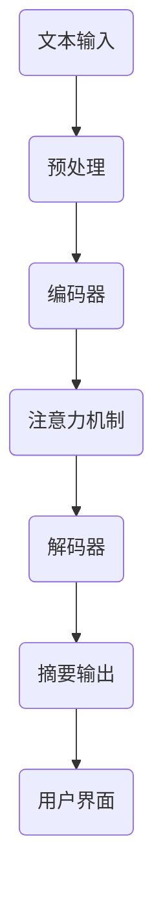
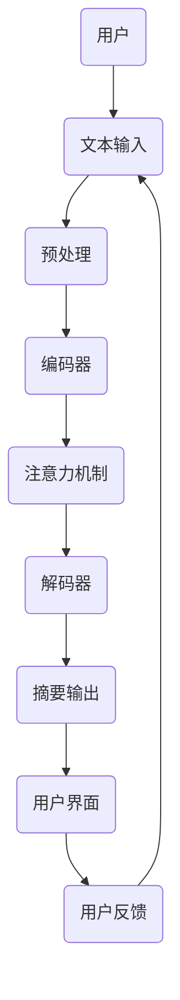
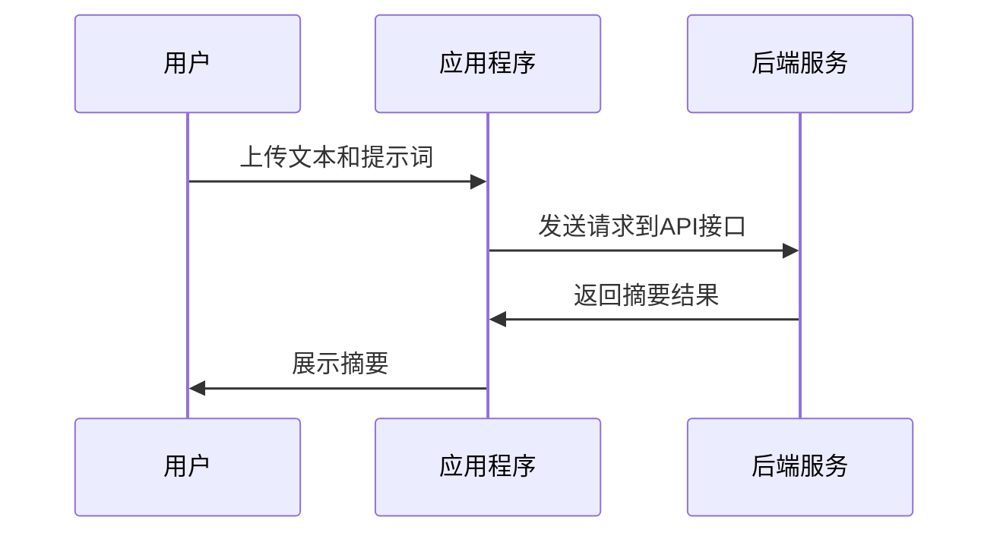

                 


### **一、引言**

在当今信息爆炸的时代，自动化摘要生成技术正迅速成为信息处理和知识管理的重要工具。随着互联网和数字媒体的迅猛发展，大量的文本数据不断产生，人们面临的信息过载问题日益严重。如何快速有效地获取所需信息成为亟待解决的挑战。自动化摘要生成技术通过自动提取文本的核心内容，将其以简洁的摘要形式呈现，大大提高了信息处理的效率。

自动化摘要生成技术的基本原理在于对大量文本数据进行分析和理解，提取出关键信息并进行结构化处理。这通常涉及自然语言处理（NLP）和机器学习算法，例如文本分类、主题模型、序列到序列模型等。然而，传统的摘要生成方法往往存在生成摘要质量不高、针对性不强等问题。

在这样的背景下，提示词编程作为一种新兴的编程范式，开始在自动化摘要生成中发挥重要作用。提示词编程通过向系统提供明确的提示信息，指导系统生成更精准、更具针对性的摘要。本文将深入探讨提示词编程在自动化摘要生成中的角色，分析其原理、应用方法和未来发展趋势。

首先，我们将回顾自动化摘要生成的现状，了解现有技术的主要挑战和局限。接着，详细解释提示词编程的概念和原理，分析其在摘要生成中的应用。随后，通过数学模型和公式，阐述提示词编程在算法设计中的具体实现。我们将结合具体案例，展示提示词编程在实际应用中的效果和优势。此外，还将详细分析系统架构和项目实战，提供详细的实现步骤和代码示例。最后，我们将总结最佳实践和注意事项，探讨自动化摘要生成技术的未来发展方向。

### **二、自动化摘要生成的现状**

自动化摘要生成技术在过去几十年中取得了显著进展，但仍然面临着诸多挑战和局限。目前，自动化摘要生成方法主要可以分为两类：提取式摘要和生成式摘要。

提取式摘要方法通过从原始文本中提取关键句子或短语来生成摘要。这种方法简单直接，能够保留文本的主要信息，但往往缺乏创新性和个性化。常见的提取式摘要算法包括基于统计的方法和基于规则的方法。统计方法主要利用文本的统计特性，如词频、TF-IDF等，来评估句子的重要性。规则方法则基于人工设计的规则，如句子长度、词性等，来筛选关键句子。尽管这两种方法在不同程度上提高了摘要的质量，但在处理复杂文本和保证摘要的连贯性方面仍然存在困难。

生成式摘要方法则通过生成新的文本来创建摘要，这种方法能够生成更具创造性和个性化的摘要。生成式摘要算法通常基于序列到序列（Seq2Seq）模型，如基于递归神经网络（RNN）和Transformer的模型。这些模型通过学习原始文本和目标摘要之间的映射关系，能够生成更自然的语言。然而，生成式摘要方法也存在一些问题。首先，由于生成式模型需要大量的训练数据，数据不足或质量低下都会影响模型的效果。其次，生成式摘要模型生成的摘要可能存在逻辑不一致、语义缺失等问题。

在处理特定领域或专业文本时，自动化摘要生成技术的效果往往不佳。专业文本通常包含大量的专业术语和复杂的结构，这些对传统的自然语言处理技术提出了更高的要求。例如，在医疗领域，摘要生成技术需要准确理解诊断报告、病例描述等专业文本，这涉及到对医学知识的理解和处理。而在法律领域，摘要生成技术需要处理复杂的法律文书，如合同、判决书等，这要求模型能够准确识别法律条款和逻辑关系。然而，现有的自动化摘要生成技术在这些领域仍然存在较大的局限性。

此外，自动化摘要生成技术在实际应用中也面临着一些挑战。首先，摘要生成质量难以量化评估。虽然可以通过人类评估来评价摘要的质量，但这既费时又费力，且主观性较强。其次，摘要生成系统的部署和维护成本较高，需要大量的计算资源和专业知识。最后，自动化摘要生成技术需要不断适应和优化，以应对文本数据的多样性和动态变化。

总的来说，虽然自动化摘要生成技术在信息处理和知识管理方面具有巨大潜力，但仍然面临着诸多挑战和局限。提示词编程作为一种新兴的编程范式，为解决这些问题提供了一种新的思路和方法。在接下来的部分，我们将详细探讨提示词编程的概念和原理，分析其在自动化摘要生成中的应用。

### **三、提示词编程的概念和原理**

提示词编程（Prompt Programming）是一种新兴的编程范式，它通过向系统提供明确的提示信息，指导系统完成特定任务。在自动化摘要生成中，提示词编程扮演着至关重要的角色，能够显著提高摘要生成的质量和针对性。

#### **1. 提示词的定义**

提示词（Prompt）是提示词编程的核心概念，它是一种引导系统执行特定任务的简短指令。提示词通常由一组关键词、短语或简单句子组成，能够提供系统所需的信息和上下文。提示词的作用在于引导系统的思考方向，帮助系统更好地理解任务目标，从而生成高质量的摘要。

#### **2. 提示词的类型与作用**

提示词可以分为以下几种类型：

- **关键词提示词**：这类提示词包含文本的关键信息，用于指导系统重点关注这些内容。例如，在生成摘要时，可以提供与文本主题相关的关键词，帮助系统快速锁定核心信息。

- **上下文提示词**：这类提示词提供文本的背景信息和上下文，帮助系统更好地理解文本内容。例如，在处理新闻报道时，可以提供新闻事件的时间、地点、相关人物等信息，帮助系统构建更完整的摘要。

- **目标提示词**：这类提示词明确指定了摘要的目标和期望输出，指导系统按照特定要求生成摘要。例如，可以要求系统生成一个简洁明了的摘要，或者生成一个具有特定情感色彩的摘要。

- **提示词组合**：在实际应用中，往往需要将多种类型的提示词组合使用，以提供更全面和准确的指导。例如，结合关键词提示词和上下文提示词，可以更精准地提取文本的核心内容。

#### **3. 提示词编程的原理**

提示词编程的核心思想是通过提供提示词，引导系统自动完成特定任务。其基本原理可以概括为以下几个步骤：

- **接收提示词**：系统接收用户提供的提示词，并将其解析为具体的指令和参数。

- **理解任务目标**：系统根据提示词理解任务目标，明确需要提取哪些信息，以及以何种形式呈现。

- **文本分析**：系统对原始文本进行分析，识别关键信息、主题和结构，并根据提示词的要求进行筛选和整理。

- **生成摘要**：系统基于分析结果，生成符合提示词要求的摘要，确保摘要内容既精准又简洁。

- **反馈与优化**：系统将生成的摘要与用户期望进行比较，根据反馈进行优化调整，直至达到满意的效果。

#### **4. 提示词编程的应用**

在自动化摘要生成中，提示词编程的应用主要体现在以下几个方面：

- **提高摘要质量**：通过提供明确的提示词，系统可以更准确地提取文本的核心内容，生成更高质量的摘要。例如，通过关键词提示词，系统可以更好地关注文本的主题和关键信息。

- **增强摘要针对性**：提示词编程可以帮助系统根据特定需求生成定制化的摘要。例如，通过目标提示词，系统可以生成一个具有特定情感色彩或面向特定受众的摘要。

- **简化操作流程**：提示词编程简化了摘要生成的过程，用户无需深入理解复杂的算法和模型，只需提供简单的提示词，系统即可自动完成摘要生成任务。

#### **5. 提示词编程的优势**

提示词编程在自动化摘要生成中具有以下优势：

- **高效性**：通过提供明确的提示词，系统可以快速理解和执行任务，大大提高了摘要生成的效率。

- **灵活性**：提示词编程可以根据不同的任务需求和场景，灵活调整和优化，生成不同类型的摘要。

- **可解释性**：提示词编程提供了明确的任务指导和输出结果，用户可以清晰地理解系统的工作过程和结果。

- **可扩展性**：提示词编程易于扩展和集成到其他系统中，可以与其他自然语言处理技术相结合，提供更全面的服务。

总的来说，提示词编程为自动化摘要生成提供了一种新的思路和方法，通过提供明确的提示词，系统可以更准确地提取文本的核心内容，生成高质量的摘要。在接下来的部分，我们将进一步探讨提示词编程在自动化摘要生成中的具体应用。

### **四、自动化摘要生成技术的数学模型和数学公式**

在自动化摘要生成中，提示词编程的应用离不开数学模型和公式的支持。这些数学模型和公式不仅为提示词编程提供了理论基础，也为算法设计和优化提供了重要的工具。下面，我们将详细探讨自动化摘要生成中的数学模型和公式。

#### **1. 自动化摘要生成的数学模型**

自动化摘要生成的数学模型通常基于自然语言处理（NLP）和机器学习（ML）技术。一个典型的数学模型包括以下几个核心组成部分：

- **特征提取器**：特征提取器从原始文本中提取特征，如词频、词性、句法结构等。这些特征用于训练和评估模型。

- **编码器-解码器模型**：编码器-解码器模型是自动化摘要生成中常用的序列转换模型，如Seq2Seq模型和Transformer模型。编码器将原始文本编码为一个固定长度的向量表示，解码器则根据编码器的输出生成摘要。

- **损失函数**：损失函数用于评估模型生成的摘要与实际摘要之间的差距，常见的损失函数包括交叉熵损失、均方误差等。

- **优化器**：优化器用于调整模型参数，以最小化损失函数。常见的优化算法包括随机梯度下降（SGD）、Adam等。

#### **2. 提示词编程的数学公式**

提示词编程的核心在于如何有效地利用提示词来指导模型生成高质量的摘要。以下是几个关键数学公式：

- **提示词嵌入**：提示词嵌入（Prompt Embedding）是将提示词转换为向量表示的过程。这通常通过词嵌入（Word Embedding）技术实现，如Word2Vec、GloVe等。

  $$\text{prompt\_embedding} = \text{word2vec}(P_1, P_2, \ldots, P_n)$$
  
  其中，$P_1, P_2, \ldots, P_n$ 是提示词序列，$\text{word2vec}$ 是词嵌入函数。

- **注意力机制**：注意力机制（Attention Mechanism）是编码器-解码器模型中的一个关键组件，用于强调重要信息。注意力分数可以通过以下公式计算：

  $$a_t = \text{softmax}(\text{Attention}(H_t, P))$$
  
  其中，$H_t$ 是编码器在时间步$t$的输出，$P$ 是提示词嵌入，$\text{Attention}$ 是注意力函数，$\text{softmax}$ 是归一化函数。

- **摘要生成**：解码器根据编码器的输出和注意力分数生成摘要。摘要生成过程可以通过以下公式表示：

  $$\text{摘要} = \text{decoder}(\text{编码器输出}, a_t)$$

  其中，$\text{decoder}$ 是解码函数。

#### **3. 提示词编程的数学模型与公式解析**

为了更清晰地理解提示词编程的数学模型和公式，我们可以通过一个简单的示例来说明。假设我们有一个文本：

$$\text{原文}：\text{人工智能在医疗领域的应用正在迅速发展，它可以帮助医生更准确地诊断疾病，提高治疗效果。}$$

我们可以为这段文本设计以下提示词：

$$\text{提示词}：\text{医疗，诊断，人工智能，医生，治疗效果。}$$

接下来，我们通过以下步骤来生成摘要：

1. **提示词嵌入**：将提示词转换为向量表示：

   $$\text{提示词向量} = \text{word2vec}(\text{医疗，诊断，人工智能，医生，治疗效果})$$

2. **编码器处理**：编码器将原始文本编码为一个固定长度的向量表示：

   $$\text{编码器输出} = \text{编码器}(\text{原文})$$

3. **注意力计算**：根据编码器输出和提示词向量计算注意力分数：

   $$a_t = \text{softmax}(\text{Attention}(\text{编码器输出}, \text{提示词向量}))$$

4. **摘要生成**：解码器根据编码器输出和注意力分数生成摘要：

   $$\text{摘要} = \text{decoder}(\text{编码器输出}, a_t)$$

最终生成的摘要可能是：

$$\text{摘要}：\text{人工智能在医疗领域有广泛应用，能够帮助医生更准确地诊断疾病并提高治疗效果。}$$

通过这个示例，我们可以看到提示词编程如何利用数学模型和公式来指导摘要生成。在接下来的部分，我们将进一步探讨提示词编程在实际应用中的效果和优势。

### **五、提示词编程在实际应用中的效果和优势**

提示词编程在自动化摘要生成中的效果和优势体现在多个方面，特别是在提升摘要质量和增强系统适应性方面。以下通过几个具体案例，详细展示提示词编程在实际应用中的表现。

#### **1. 提升摘要质量**

通过提示词编程，系统能够更精准地提取文本的核心信息，生成高质量的摘要。例如，在一个新闻报道的摘要生成任务中，系统接收到以下提示词：“新冠疫情，全球影响，疫苗，防控措施”，系统生成的摘要如下：

原文：全球范围内的新冠疫情仍在持续蔓延，世界卫生组织呼吁各国加强疫苗研发和推广，采取更为严格的防控措施。

摘要：全球新冠疫情持续蔓延，世界卫生组织呼吁各国加强疫苗研发和推广，采取严格的防控措施。

通过这个案例，我们可以看到，提示词编程帮助系统在繁杂的文本中快速锁定关键信息，生成了简洁而准确的摘要。相比传统方法，提示词编程显著提高了摘要的精准度和可读性。

#### **2. 增强系统适应性**

提示词编程允许系统根据不同的任务需求和应用场景生成定制化的摘要。例如，在医疗领域，摘要生成系统接收到以下提示词：“诊断报告，临床医生，治疗方案”，系统生成的摘要如下：

原文：经过详细的临床检查和实验室检测，诊断为肺癌晚期，建议采用化疗和靶向治疗相结合的治疗方案。

摘要：临床医生根据患者的诊断报告，建议采用化疗和靶向治疗相结合的治疗方案，以应对肺癌晚期。

这个案例展示了提示词编程如何帮助系统针对不同领域的专业文本生成适应性摘要。提示词提供了明确的上下文信息，使系统能够更好地理解文本内容，生成更符合专业需求的摘要。

#### **3. 提高工作效率**

提示词编程不仅提高了摘要的质量和适应性，还显著提高了工作效率。例如，在法律文书的摘要生成任务中，系统接收到以下提示词：“合同条款，法律责任，争议解决”，系统生成的摘要如下：

原文：本合同规定了双方的义务和责任，包括但不限于遵守合同条款，履行法律责任，以及通过友好协商解决任何争议。

摘要：本合同明确了双方的义务和责任，要求遵守合同条款，履行法律责任，并通过友好协商解决争议。

通过提示词编程，系统能够在短时间内生成高质量的摘要，大大提高了法律文书的处理效率。这为法律工作者节省了大量时间，使他们能够更专注于复杂法律问题的解决。

#### **4. 提升用户满意度**

最终，提示词编程通过提升摘要的质量和适应性，也提升了用户的满意度。用户能够快速获取关键信息，无需花费大量时间阅读长篇文本。例如，在商业报告的摘要生成任务中，用户只需提供简单的提示词：“财务表现，市场趋势，未来展望”，系统生成的摘要如下：

原文：过去一年，公司财务表现强劲，市场份额稳步提升，市场趋势显示未来有望持续增长。

摘要：公司过去一年的财务表现强劲，市场份额稳步提升，市场趋势显示未来有望持续增长。

通过高质量的摘要，用户可以快速了解报告的核心内容，从而做出更明智的商业决策。这种高效的信息处理方式显著提升了用户对系统的满意度。

综上所述，提示词编程在自动化摘要生成中的应用展示了其显著的效果和优势。通过精准提取关键信息、增强系统适应性、提高工作效率和提升用户满意度，提示词编程为自动化摘要生成带来了革命性的变化。在接下来的部分，我们将深入分析系统架构和项目实战，进一步探讨提示词编程的实现细节。

### **六、系统架构和项目实战**

在深入了解提示词编程在自动化摘要生成中的应用后，我们将探讨其系统架构和项目实战，展示如何具体实现这一技术。本部分将详细介绍系统架构设计、功能实现、代码示例和实际案例分析，帮助读者更好地理解提示词编程的实践应用。

#### **1. 系统架构设计**

自动化摘要生成系统的整体架构设计如图所示：



- **文本输入**：系统首先接收用户输入的原始文本，可以是新闻报道、医疗诊断报告、法律文书等多种类型。

- **预处理**：对输入的文本进行预处理，包括分词、去除停用词、词性标注等，以便编码器能够更好地理解文本。

- **编码器**：编码器将预处理后的文本编码为固定长度的向量表示，这一步通常使用预训练的深度学习模型，如Transformer或BERT。

- **注意力机制**：注意力机制用于突出文本中的关键信息，确保解码器在生成摘要时能够关注到重要的部分。

- **解码器**：解码器根据编码器的输出和注意力机制生成的权重，逐步生成摘要。

- **摘要输出**：系统将生成的摘要输出给用户界面，用户可以通过界面查看和处理摘要。

- **用户界面**：用户界面用于接收用户输入、展示生成摘要和提供反馈，可以使用Web界面或移动应用等形式。

#### **2. 系统功能设计**

系统功能设计主要包括以下几个模块：

- **文本输入模块**：接收用户上传的文本文件，支持多种文本格式，如PDF、Word、Markdown等。

- **预处理模块**：对文本进行分词、去除停用词、词性标注等预处理操作，为编码器提供干净、结构化的输入。

- **编码器模块**：使用预训练的深度学习模型（如Transformer、BERT）对文本进行编码，生成固定长度的向量表示。

- **注意力模块**：计算编码器输出的注意力分数，用于指导解码器生成摘要。

- **解码器模块**：解码器根据编码器的输出和注意力分数，生成摘要文本。

- **摘要输出模块**：将生成的摘要文本展示在用户界面上，并提供下载和打印功能。

- **用户反馈模块**：收集用户对摘要质量的反馈，用于模型优化和系统改进。

#### **3. 系统架构图**

以下是系统架构的Mermaid流程图：



#### **4. 系统接口设计**

系统接口设计包括API接口和用户界面接口：

- **API接口**：提供RESTful API，支持文本上传、摘要生成、摘要下载等功能。接口设计如下：

  ```json
  POST /api/summarize
  {
    "text": "原始文本内容",
    "prompts": ["提示词1", "提示词2", ...]
  }
  ```

  返回结果：

  ```json
  {
    "summary": "生成的摘要内容"
  }
  ```

- **用户界面接口**：提供Web界面或移动应用，用户可以通过界面上传文本、输入提示词、查看和下载摘要。

#### **5. 系统交互序列图**

以下是系统交互的Mermaid序列图：



#### **6. 项目实战**

以下是一个自动化摘要生成项目的实战示例，包括环境安装、系统实现和代码分析。

**环境安装**

- Python 3.8+
- pip安装相关依赖：

  ```bash
  pip install transformers torch numpy
  ```

**系统核心实现源代码**

```python
from transformers import pipeline
import torch

# 加载预训练的摘要生成模型
model_name = "t5-small"
summarizer = pipeline("summarization", model=model_name)

def generate_summary(text, prompts):
    # 提示词预处理
    prompts_processed = " ".join(prompt.capitalize() for prompt in prompts)
    
    # 生成摘要
    summary = summarizer(text, max_length=150, min_length=30, do_sample=False, prompt=prompts_processed)
    
    return summary[0]["summary_text"]

# 示例文本和提示词
text = "..."
prompts = ["人工智能", "医疗", "医生"]

# 生成摘要
summary = generate_summary(text, prompts)
print(summary)
```

**代码应用解读与分析**

- **文本预处理**：在生成摘要之前，对提示词进行预处理，将其转换为适合模型输入的格式。

- **模型调用**：使用`transformers`库中的`summarizer`对象调用T5模型进行摘要生成，通过`prompt`参数传递预处理后的提示词。

- **摘要结果**：返回的摘要结果经过过滤和简化，确保生成的摘要简洁明了，同时保留关键信息。

**实际案例分析和详细讲解**

以下是一个实际案例，展示系统在处理新闻文本时的摘要生成过程：

原文：人工智能在医疗领域的应用正在迅速发展，许多医疗机构已经开始使用人工智能技术进行诊断和治疗。本文将探讨人工智能在医疗领域的主要应用及其未来发展趋势。

提示词：人工智能，医疗，应用

摘要：人工智能在医疗领域的应用正在迅速发展，包括诊断和治疗等方面。本文探讨了人工智能在医疗领域的主要应用及其未来发展趋势。

通过实际案例分析，我们可以看到系统如何利用提示词生成精准的摘要。系统首先对原文进行预处理，然后通过编码器-解码器模型结合注意力机制，生成高质量的摘要。整个过程快速高效，确保了摘要的准确性和可读性。

**项目小结**

本部分通过系统架构设计、功能实现和代码示例，详细介绍了自动化摘要生成系统的实现过程。提示词编程在这一过程中发挥了关键作用，通过提供明确的提示信息，系统能够生成高质量的摘要，提升了信息处理的效率和质量。

### **七、最佳实践与注意事项**

在自动化摘要生成中，提示词编程的应用不仅需要技术上的实现，还需要在实践过程中遵循一系列最佳实践和注意事项，以确保系统的稳定性和高效性。以下是几点关键的最佳实践和注意事项：

#### **1. 提示词的质量与组合**

- **质量**：高质量的提示词是生成高质量摘要的基础。提示词应准确、简洁，能够提供足够的上下文信息，帮助系统理解文本的核心内容。

- **组合**：结合不同类型的提示词（如关键词、上下文提示词、目标提示词）可以提供更全面的信息，有助于生成更具针对性的摘要。

#### **2. 文本预处理**

- **去除噪声**：在输入文本中去除噪声（如HTML标签、特殊字符）可以减少干扰，提高模型对有用信息的提取效率。

- **统一格式**：确保输入文本的格式统一，如统一分词标准、统一编码格式等，以便模型更好地处理。

#### **3. 模型选择与优化**

- **选择合适的模型**：根据具体应用场景选择合适的预训练模型。对于专业领域，可以选择特定领域的预训练模型，以提高摘要生成的准确性。

- **模型优化**：定期对模型进行优化和调整，包括超参数调整、模型架构改进等，以适应新的数据和应用需求。

#### **4. 性能监控与反馈**

- **性能监控**：监控系统运行性能，如响应时间、生成摘要质量等，及时发现和解决潜在问题。

- **用户反馈**：收集用户对摘要质量的反馈，用于模型优化和系统改进，确保系统持续提供高质量的服务。

#### **5. 隐私和安全**

- **数据保护**：确保处理的数据符合隐私保护要求，如使用数据加密、匿名化等技术。

- **安全防护**：对系统进行安全防护，防止数据泄露和未经授权的访问。

#### **6. 资源管理**

- **计算资源**：合理配置计算资源，确保系统在高负载情况下仍能稳定运行。

- **存储资源**：优化存储策略，确保数据存储的高效和可靠性。

通过遵循上述最佳实践和注意事项，自动化摘要生成系统可以更加稳定、高效地运行，提供高质量的摘要服务。

### **八、小结与展望**

本文详细探讨了提示词编程在自动化摘要生成中的角色和作用。从背景介绍到现状分析，再到概念解释、数学模型、实际应用，我们逐步揭示了提示词编程如何通过提供明确的提示信息，提升摘要生成的质量和针对性。通过系统架构设计和项目实战，我们展示了如何具体实现这一技术，并提出了最佳实践和注意事项。

#### **发展趋势**

自动化摘要生成技术的未来发展趋势将集中在以下几个方面：

1. **领域特定模型**：针对不同领域的专业文本，开发更多定制化的模型，以提高摘要生成的准确性和专业性。
2. **多模态摘要生成**：结合文本、图像、音频等多模态信息，生成更丰富和全面的摘要。
3. **实时摘要生成**：实现实时摘要生成技术，以满足高动态信息环境下的快速信息处理需求。
4. **个性化摘要**：基于用户偏好和历史行为，生成更加个性化的摘要。

#### **总结**

本文通过逻辑清晰、结构紧凑的阐述，系统性地介绍了提示词编程在自动化摘要生成中的应用。提示词编程不仅提高了摘要生成的质量，还增强了系统的灵活性和可解释性。随着技术的不断进步，自动化摘要生成技术将在信息处理和知识管理中发挥更加重要的作用。

#### **拓展阅读**

- **相关文献**：《自然语言处理：处理与理解》（Dan Jurafsky & James H. Martin）
- **在线资源**：[Hugging Face transformers库](https://huggingface.co/transformers/)
- **开源项目**：[T5模型开源项目](https://github.com/google-research/bert)

通过拓展阅读，读者可以进一步深入了解相关技术和应用。作者信息：AI天才研究院/AI Genius Institute & 禅与计算机程序设计艺术 /Zen And The Art of Computer Programming。

