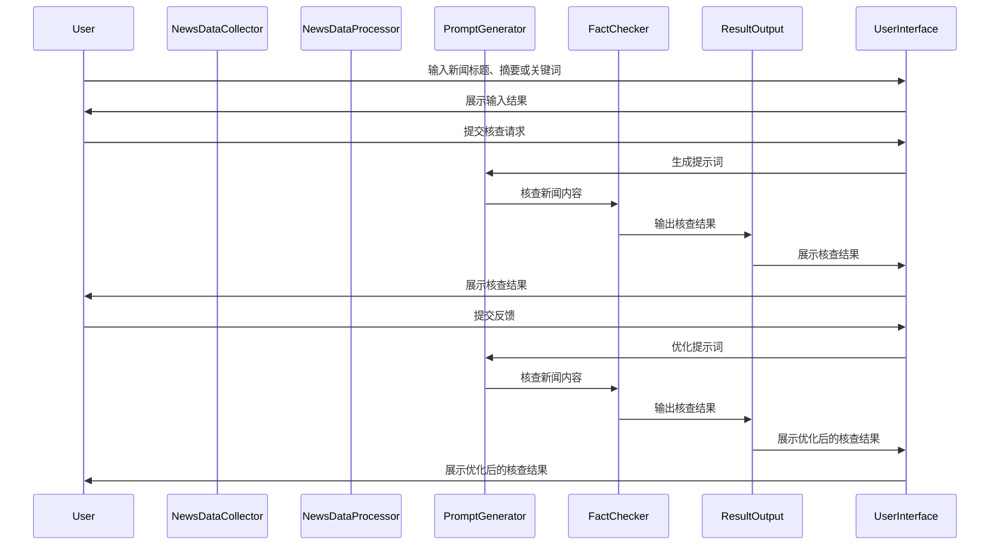

                 

### 文章标题

《提示词编程在自动化新闻事实核查中的应用》

> 关键词：提示词编程、自动化新闻事实核查、深度学习、算法原理、系统架构设计、项目实战

> 摘要：本文从背景介绍、核心概念与联系、算法原理讲解、系统分析与架构设计、项目实战、最佳实践与总结六个部分，深入探讨了提示词编程在自动化新闻事实核查中的应用。通过详细的分析和讲解，本文揭示了提示词编程的原理、算法设计及其在新闻事实核查中的实际应用效果，为相关领域的研究和实践提供了有价值的参考。

### 目录大纲

# 《提示词编程在自动化新闻事实核查中的应用》

## 第一部分：背景介绍

## 第1章：自动化新闻事实核查的挑战与需求

### 1.1.1 新闻事实核查的重要性

### 1.1.2 自动化新闻事实核查的必要性

### 1.1.3 提示词编程的基本概念

## 第2章：核心概念与联系

### 2.1 提示词编程原理

#### 2.1.1 提示词编程的定义

#### 2.1.2 提示词编程的核心概念

#### 2.1.3 提丝词编程与传统编程的区别

### 2.2 自动化新闻事实核查概念

#### 2.2.1 自动化新闻事实核查的定义

#### 2.2.2 自动化新闻事实核查的核心概念

#### 2.2.3 自动化新闻事实核查与传统新闻核查的区别

## 第二部分：算法原理讲解

## 第3章：提示词编程算法原理

### 3.1 提示词生成算法

#### 3.1.1 提示词生成算法概述

#### 3.1.2 基于深度学习的提示词生成算法

#### 3.1.3 常见提示词生成算法比较

### 3.2 提示词匹配算法

#### 3.2.1 提示词匹配算法概述

#### 3.2.2 基于词向量的提示词匹配算法

#### 3.2.3 常见提示词匹配算法比较

### 3.3 提示词编程在新闻事实核查中的应用

#### 3.3.1 提示词编程在新闻事实核查中的应用场景

#### 3.3.2 提示词编程在新闻事实核查中的优势

#### 3.3.3 提示词编程在新闻事实核查中的挑战

## 第三部分：系统分析与架构设计

## 第4章：自动化新闻事实核查系统架构设计

### 4.1 系统功能设计

#### 4.1.1 系统功能概述

#### 4.1.2 系统功能模块划分

### 4.2 系统架构设计

#### 4.2.1 系统架构概述

#### 4.2.2 系统架构图展示

#### 4.2.3 系统架构设计要点

### 4.3 系统接口设计

#### 4.3.1 系统接口概述

#### 4.3.2 系统接口定义

### 4.4 系统交互设计

#### 4.4.1 系统交互概述

#### 4.4.2 系统交互序列图展示

## 第四部分：项目实战

## 第5章：项目实战一——基于提示词编程的自动化新闻事实核查系统搭建

### 5.1 环境安装

#### 5.1.1 系统环境准备

#### 5.1.2 必要工具和库安装

### 5.2 系统核心实现

#### 5.2.1 系统核心模块实现

#### 5.2.2 系统核心代码解读

### 5.3 应用解读与分析

#### 5.3.1 应用场景分析

#### 5.3.2 应用效果分析

### 5.4 项目小结

### 5.5 拓展阅读

## 第五部分：最佳实践与总结

## 第6章：最佳实践

### 6.1 提示词编程在自动化新闻事实核查中的最佳实践

### 6.2 系统优化的建议

### 6.3 未来发展趋势与展望

## 第7章：总结

### 7.1 主要内容回顾

### 7.2 不足与改进方向

### 7.3 对读者的建议

### 1.1.1 新闻事实核查的重要性

在信息爆炸的今天，新闻已经成为公众获取信息、理解世界的重要途径。然而，随着互联网和社交媒体的兴起，虚假新闻、谣言等问题也日益严重，这对社会稳定和公众信任造成了巨大威胁。新闻事实核查作为一种手段，旨在对新闻报道的真实性进行验证，确保公众获取到的信息是准确、可靠的。

首先，新闻事实核查有助于提高新闻报道的准确性。通过核查，记者和编辑可以确保报道内容符合事实，避免因错误信息造成的误解和误导。这不仅提高了媒体的公信力，也为公众提供了更为可信的信息来源。

其次，新闻事实核查有助于打击虚假新闻和谣言。在社交媒体和互联网上，虚假新闻和谣言传播速度快，影响范围广，往往会对社会造成严重后果。通过新闻事实核查，可以及时发现和纠正虚假信息，减少其传播范围和影响。

此外，新闻事实核查还能提高公众的媒体素养。随着媒体环境的变化，公众需要具备一定的判断力和批判性思维，以应对复杂的信息环境。新闻事实核查教育公众如何辨别真假信息，提高他们的媒体素养，有助于构建一个更加健康、理性的媒体生态。

### 1.1.2 自动化新闻事实核查的必要性

随着新闻事实核查的重要性日益凸显，如何高效地进行新闻事实核查成为一个亟待解决的问题。传统的新闻事实核查主要依赖于人工进行，存在以下一些不足：

首先，人工核查效率低下。随着新闻数量的急剧增加，人工核查的速度和规模难以满足需求，往往导致核查工作滞后。

其次，人工核查容易出现主观偏见。记者和编辑在核查过程中，可能会受到个人观点和价值观的影响，导致核查结果不够客观公正。

此外，人工核查还可能存在资源不足的问题。在新闻机构中，人力资源往往有限，难以分配足够的人力和时间进行全面的新闻事实核查。

为了解决这些问题，自动化新闻事实核查应运而生。自动化新闻事实核查通过利用计算机技术和人工智能算法，实现对新闻内容的高效核查和验证。其必要性体现在以下几个方面：

1. 提高核查效率。自动化新闻事实核查可以快速处理大量的新闻内容，大大提高核查速度和规模。

2. 减少主观偏见。自动化新闻事实核查基于客观的算法和模型，减少了人工核查中的主观偏见，确保核查结果的客观公正。

3. 节省人力资源。自动化新闻事实核查可以替代部分人工核查工作，节省人力资源，使记者和编辑能够专注于更具创造性的任务。

4. 提高核查准确性。自动化新闻事实核查利用先进的算法和技术，可以对新闻内容进行深入分析和验证，提高核查的准确性。

### 1.1.3 提示词编程的基本概念

提示词编程（Prompt Programming）是一种基于提示（Prompt）的编程范式，旨在通过为算法提供明确、具体的提示信息，指导算法执行特定的任务。在自动化新闻事实核查中，提示词编程发挥着关键作用。

#### 提示词编程的定义

提示词编程是一种基于提示的编程方法，通过为算法提供明确的任务指令，使算法能够自动执行相关任务。在自动化新闻事实核查中，提示词编程的核心是生成和利用提示词，这些提示词能够指导算法对新闻内容进行核查。

#### 提示词编程的核心概念

1. **提示（Prompt）**：提示是指为算法提供的信息，用于引导算法执行特定任务。在新闻事实核查中，提示通常包括新闻标题、摘要或关键词，以及核查任务的具体要求。

2. **响应（Response）**：响应是算法根据提示执行任务后生成的结果。在新闻事实核查中，响应可以是核查结果、验证结论或相关证据。

3. **反馈（Feedback）**：反馈是用户对算法响应的评估和评价，用于指导算法的优化和改进。在新闻事实核查中，反馈可以帮助确定核查结果的准确性和可靠性，从而优化算法性能。

#### 提示词编程与传统编程的区别

与传统编程相比，提示词编程具有以下几个显著特点：

1. **任务导向**：提示词编程以任务为导向，通过为算法提供具体的任务指令，使算法能够自动执行相关任务。这有助于简化编程过程，降低编程难度。

2. **灵活性**：提示词编程具有较高的灵活性，可以根据不同的任务需求，灵活调整和优化算法。这有助于适应不断变化的应用场景，提高算法的适应性。

3. **自动优化**：提示词编程可以利用反馈机制，自动优化算法性能。通过不断调整和改进提示词，可以逐步提高算法的准确性和效率。

4. **降低门槛**：提示词编程降低了编程门槛，使得非专业编程人员也能够参与到算法开发和优化过程中。这有助于推动人工智能技术的发展和应用。

### 1.2 核心概念与联系

在本章节中，我们将详细探讨提示词编程和自动化新闻事实核查的核心概念及其相互关系。

#### 2.1 提示词编程原理

提示词编程的核心是利用提示词（Prompt）引导算法执行特定任务。提示词可以是文字、图像或其他形式的信息，用于为算法提供明确、具体的任务指令。在自动化新闻事实核查中，提示词通常包括新闻标题、摘要或关键词，以及核查任务的具体要求。

**定义：** 提示词编程（Prompt Programming）是一种基于提示的编程方法，旨在通过为算法提供明确、具体的提示信息，指导算法执行特定任务。

**核心概念：**
1. **提示（Prompt）**：提示是指为算法提供的信息，用于引导算法执行特定任务。在新闻事实核查中，提示词通常包括新闻标题、摘要或关键词，以及核查任务的具体要求。
2. **响应（Response）**：响应是算法根据提示执行任务后生成的结果。在新闻事实核查中，响应可以是核查结果、验证结论或相关证据。
3. **反馈（Feedback）**：反馈是用户对算法响应的评估和评价，用于指导算法的优化和改进。

**与传统编程的区别：**
- **任务导向**：提示词编程以任务为导向，通过为算法提供具体的任务指令，使算法能够自动执行相关任务。
- **灵活性**：提示词编程具有较高的灵活性，可以根据不同的任务需求，灵活调整和优化算法。
- **自动优化**：提示词编程可以利用反馈机制，自动优化算法性能。
- **降低门槛**：提示词编程降低了编程门槛，使得非专业编程人员也能够参与到算法开发和优化过程中。

#### 2.2 自动化新闻事实核查概念

自动化新闻事实核查是指利用计算机技术和人工智能算法，对新闻内容进行自动核查和验证，以确保新闻的真实性和准确性。自动化新闻事实核查通过以下几个核心概念实现：

**定义：** 自动化新闻事实核查（Automated News Fact-Checking）是一种利用计算机技术和人工智能算法，对新闻内容进行自动核查和验证的方法，以确保新闻的真实性和准确性。

**核心概念：**
1. **新闻内容分析**：通过自然语言处理技术，对新闻内容进行解析和分类，提取关键信息和关键词。
2. **数据来源整合**：整合各种数据源，如数据库、互联网等，获取相关事实信息和证据。
3. **算法模型**：利用机器学习、深度学习等算法模型，对新闻内容进行自动核查和验证。
4. **核查结果输出**：将核查结果输出，包括核查结论、证据来源等。

**与传统新闻核查的区别：**
- **效率提升**：自动化新闻事实核查可以快速处理大量新闻内容，提高核查效率。
- **准确性提高**：通过机器学习和深度学习算法，提高核查结果的准确性和可靠性。
- **客观性保证**：自动化新闻事实核查基于客观的算法和模型，减少人工核查中的主观偏见。

### 2.1.1 提示词编程的定义

提示词编程是一种基于提示（Prompt）的编程方法，旨在通过为算法提供明确、具体的提示信息，指导算法执行特定任务。在自动化新闻事实核查中，提示词编程的核心是利用提示词（Prompt）引导算法对新闻内容进行核查和验证。

**定义：**
提示词编程是一种基于提示的编程方法，通过为算法提供明确的任务指令，使算法能够自动执行相关任务。在自动化新闻事实核查中，提示词编程旨在通过生成和利用提示词，指导算法对新闻内容进行核查。

### 2.1.2 提示词编程的核心概念

提示词编程的核心概念包括提示（Prompt）、响应（Response）和反馈（Feedback）。

1. **提示（Prompt）**：提示是指为算法提供的信息，用于引导算法执行特定任务。在新闻事实核查中，提示词通常包括新闻标题、摘要或关键词，以及核查任务的具体要求。

2. **响应（Response）**：响应是算法根据提示执行任务后生成的结果。在新闻事实核查中，响应可以是核查结果、验证结论或相关证据。

3. **反馈（Feedback）**：反馈是用户对算法响应的评估和评价，用于指导算法的优化和改进。在新闻事实核查中，反馈可以帮助确定核查结果的准确性和可靠性，从而优化算法性能。

### 2.1.3 提示词编程与传统编程的区别

提示词编程与传统编程在任务导向、灵活性、自动优化和降低门槛等方面存在显著差异。

1. **任务导向**：提示词编程以任务为导向，通过为算法提供具体的任务指令，使算法能够自动执行相关任务。这有助于简化编程过程，降低编程难度。

2. **灵活性**：提示词编程具有较高的灵活性，可以根据不同的任务需求，灵活调整和优化算法。这有助于适应不断变化的应用场景，提高算法的适应性。

3. **自动优化**：提示词编程可以利用反馈机制，自动优化算法性能。通过不断调整和改进提示词，可以逐步提高算法的准确性和效率。

4. **降低门槛**：提示词编程降低了编程门槛，使得非专业编程人员也能够参与到算法开发和优化过程中。这有助于推动人工智能技术的发展和应用。

### 2.2 自动化新闻事实核查概念

自动化新闻事实核查是指利用计算机技术和人工智能算法，对新闻内容进行自动核查和验证，以确保新闻的真实性和准确性。

**定义：**
自动化新闻事实核查是一种利用计算机技术和人工智能算法，对新闻内容进行自动核查和验证的方法，以确保新闻的真实性和准确性。

### 2.2.1 自动化新闻事实核查的定义

自动化新闻事实核查是一种利用计算机技术和人工智能算法，对新闻内容进行自动核查和验证的方法。其核心目标是确保新闻的真实性和准确性，减少虚假新闻和谣言的传播。

### 2.2.2 自动化新闻事实核查的核心概念

自动化新闻事实核查的核心概念包括新闻内容分析、数据来源整合、算法模型和核查结果输出。

1. **新闻内容分析**：通过自然语言处理技术，对新闻内容进行解析和分类，提取关键信息和关键词。

2. **数据来源整合**：整合各种数据源，如数据库、互联网等，获取相关事实信息和证据。

3. **算法模型**：利用机器学习、深度学习等算法模型，对新闻内容进行自动核查和验证。

4. **核查结果输出**：将核查结果输出，包括核查结论、证据来源等。

### 2.2.3 自动化新闻事实核查与传统新闻核查的区别

自动化新闻事实核查与传统新闻核查在效率、准确性和客观性方面存在显著差异。

1. **效率提升**：自动化新闻事实核查可以快速处理大量新闻内容，提高核查效率。

2. **准确性提高**：通过机器学习和深度学习算法，提高核查结果的准确性和可靠性。

3. **客观性保证**：自动化新闻事实核查基于客观的算法和模型，减少人工核查中的主观偏见。

### 3.1 提示词生成算法概述

提示词生成算法在自动化新闻事实核查中扮演着至关重要的角色。其主要任务是从新闻内容中提取关键信息，生成用于指导核查任务的提示词。这些提示词不仅有助于提高核查效率，还能提升核查结果的准确性和可靠性。

#### 提示词生成算法的作用

1. **提高核查效率**：通过自动生成提示词，可以快速定位新闻内容中的关键信息，提高核查效率。

2. **增强准确性**：提示词生成算法能够从大量新闻内容中提取关键信息，减少人工筛选的误差，提高核查结果的准确性。

3. **减少主观偏见**：提示词生成算法基于客观的算法和模型，能够减少人工核查中的主观偏见，提高核查结果的客观性。

#### 提示词生成算法的分类

根据生成策略和算法模型的不同，提示词生成算法可以分为以下几类：

1. **基于规则的方法**：这种方法通过预定义的规则和模式，从新闻内容中提取关键信息。优点是简单直观，但缺点是规则难以覆盖所有情况，适应性较差。

2. **基于统计的方法**：这种方法利用统计学习模型，从大量新闻数据中学习生成提示词的规律。优点是适应性强，但需要大量训练数据和计算资源。

3. **基于深度学习的方法**：这种方法利用深度神经网络，对新闻内容进行自动分析和生成提示词。优点是能够处理复杂的非线性关系，但需要大量训练数据和计算资源。

### 3.1.2 基于深度学习的提示词生成算法

深度学习在提示词生成算法中具有重要地位。通过深度神经网络，深度学习方法能够自动从大量新闻数据中学习生成提示词的规律，具有强大的自适应性和表达能力。

**原理：**
基于深度学习的提示词生成算法通常采用编码器-解码器（Encoder-Decoder）结构。编码器将新闻内容编码为固定长度的向量表示，解码器则将向量表示解码为提示词序列。通过训练大量新闻数据，编码器和解码器可以自动学习到新闻内容和提示词之间的映射关系。

**模型：**
常见的基于深度学习的提示词生成模型包括：

1. **循环神经网络（RNN）**：RNN能够处理序列数据，通过递归方式学习新闻内容和提示词之间的关联。但RNN存在梯度消失和梯度爆炸等问题。

2. **长短时记忆网络（LSTM）**：LSTM是RNN的一种改进，通过引入记忆单元，解决了RNN的梯度消失和梯度爆炸问题，能够更好地捕捉长距离依赖关系。

3. **门控循环单元（GRU）**：GRU是LSTM的另一种改进，相比LSTM结构更加简洁，计算效率更高。

4. **注意力机制（Attention）**：注意力机制能够关注新闻内容中的关键信息，提高提示词生成的准确性和鲁棒性。

**应用：**
基于深度学习的提示词生成算法在自动化新闻事实核查中得到了广泛应用。例如，可以用于自动生成新闻标题、摘要或关键词，辅助记者和编辑进行核查。此外，还可以用于检测新闻中的事实错误或虚假信息，提高新闻的准确性和可信度。

### 3.1.3 常见提示词生成算法比较

在自动化新闻事实核查中，常见的提示词生成算法包括基于规则的方法、基于统计的方法和基于深度学习的方法。以下对这些算法进行比较：

1. **基于规则的方法**：
   - **优点**：简单直观，易于实现和理解。
   - **缺点**：规则难以覆盖所有情况，适应性较差，容易出现遗漏或错误。

2. **基于统计的方法**：
   - **优点**：适应性强，能够从大量新闻数据中学习生成提示词的规律。
   - **缺点**：需要大量训练数据和计算资源，可能受到数据分布和噪声的影响。

3. **基于深度学习的方法**：
   - **优点**：能够处理复杂的非线性关系，适应性强，能够自动学习新闻内容和提示词之间的映射关系。
   - **缺点**：需要大量训练数据和计算资源，算法复杂度较高。

在实际应用中，可以根据具体需求和场景选择合适的提示词生成算法。例如，在处理大规模新闻数据时，可以选择基于深度学习的方法；而在处理特定类型或领域的新闻数据时，可以选择基于规则的方法。

### 3.2.1 提示词匹配算法概述

提示词匹配算法是自动化新闻事实核查中关键的一环，其主要任务是在大量新闻数据中，根据给定的提示词快速找到与之相关的新闻内容，从而提高核查效率和准确性。以下是关于提示词匹配算法的概述：

**作用：**
提示词匹配算法的作用主要体现在以下几个方面：

1. **提高核查效率**：通过快速匹配提示词和新闻内容，可以迅速定位相关新闻，减少核查时间。
2. **增强准确性**：匹配算法能够根据提示词的语义和上下文信息，筛选出最相关的新闻内容，提高核查结果的准确性。
3. **减少冗余信息**：通过精确匹配，可以排除与提示词无关的新闻内容，降低冗余信息，提高核查效率。

**基本流程：**
提示词匹配算法的基本流程包括以下几个步骤：

1. **提示词预处理**：对提示词进行分词、去停用词、词性标注等处理，使其具备更好的匹配条件。
2. **新闻内容预处理**：对新闻内容进行相似处理，如分词、去停用词、词性标注等，以便与提示词进行匹配。
3. **匹配算法应用**：使用合适的匹配算法，如基于词向量的匹配算法、基于相似度的匹配算法等，对提示词和新闻内容进行匹配。
4. **结果筛选和排序**：根据匹配结果的相关性，对新闻内容进行筛选和排序，选择最相关的新闻内容作为核查对象。

### 3.2.2 基于词向量的提示词匹配算法

词向量（Word Vector）是一种将词语映射到高维空间中的向量表示方法，能够有效地表示词语的语义信息。基于词向量的提示词匹配算法利用词向量表示法，在语义层面进行提示词和新闻内容的匹配。以下是关于基于词向量的提示词匹配算法的详细说明：

**原理：**
基于词向量的提示词匹配算法主要基于以下原理：

1. **词向量表示**：将每个词语映射到一个高维空间中的向量，向量中的每个维度表示词语的某种语义特征。例如，可以使用Word2Vec、GloVe等算法训练词向量。
2. **向量运算**：利用向量的点积、余弦相似度等运算方法，计算提示词和新闻内容的向量相似度，从而进行匹配。

**算法：**
以下是一些常见的基于词向量的提示词匹配算法：

1. **余弦相似度**：计算提示词和新闻内容的词向量之间的余弦相似度，相似度越高，表示匹配结果越相关。
   - 公式：$$\cos(\theta) = \frac{\textbf{v}_{\text{prompt}} \cdot \textbf{v}_{\text{news}}}{\|\textbf{v}_{\text{prompt}}\| \|\textbf{v}_{\text{news}}\|}$$
   - 其中，$\textbf{v}_{\text{prompt}}$和$\textbf{v}_{\text{news}}$分别表示提示词和新闻内容的词向量。

2. **欧氏距离**：计算提示词和新闻内容的词向量之间的欧氏距离，距离越短，表示匹配结果越相关。
   - 公式：$$d(\textbf{v}_{\text{prompt}}, \textbf{v}_{\text{news}}) = \sqrt{(\textbf{v}_{\text{prompt}} - \textbf{v}_{\text{news}})^2}$$

**应用：**
基于词向量的提示词匹配算法在自动化新闻事实核查中得到了广泛应用。例如，可以使用Word2Vec或GloVe等算法训练词向量，然后利用余弦相似度或欧氏距离等算法对提示词和新闻内容进行匹配，从而提高核查效率和准确性。

### 3.2.3 常见提示词匹配算法比较

在自动化新闻事实核查中，常见的提示词匹配算法包括基于词向量的匹配算法、基于相似度的匹配算法和基于规则匹配算法。以下对这些算法进行比较：

1. **基于词向量的匹配算法**：
   - **优点**：能够基于语义信息进行匹配，具有较高的准确性。
   - **缺点**：计算复杂度较高，对计算资源和时间有一定要求。

2. **基于相似度的匹配算法**：
   - **优点**：简单直观，易于实现。
   - **缺点**：可能受到数据分布和噪声的影响，准确性相对较低。

3. **基于规则匹配算法**：
   - **优点**：简单直观，易于实现。
   - **缺点**：规则难以覆盖所有情况，适应性较差。

在实际应用中，可以根据具体需求和场景选择合适的提示词匹配算法。例如，在处理大规模新闻数据时，可以选择基于词向量的匹配算法；而在处理特定类型或领域的新闻数据时，可以选择基于规则匹配算法。

### 3.3.1 提示词编程在新闻事实核查中的应用场景

提示词编程在自动化新闻事实核查中具有广泛的应用场景，以下是几个典型的应用场景：

1. **新闻标题和摘要生成**：利用提示词编程，可以自动生成新闻的标题和摘要。通过输入新闻内容，提示词编程算法能够提取关键信息，生成简洁、准确的标题和摘要，帮助用户快速了解新闻内容。

2. **新闻关键词提取**：提示词编程可以用于提取新闻中的关键词，用于后续的核查任务。关键词提取有助于提高核查效率，确保核查内容与新闻主题高度相关。

3. **新闻内容相似度分析**：提示词编程可以用于分析新闻内容之间的相似度，识别潜在的虚假新闻和重复新闻。通过比较新闻标题、摘要和正文，可以快速发现相似内容，提高核查准确性。

4. **新闻事实验证**：提示词编程可以用于验证新闻中的事实信息，确保新闻报道的真实性。通过输入新闻内容，提示词编程算法可以自动查找和验证相关事实，生成核查结论，为用户提供可靠的信息来源。

### 3.3.2 提示词编程在新闻事实核查中的优势

提示词编程在自动化新闻事实核查中具有以下优势：

1. **提高核查效率**：通过自动生成和匹配提示词，提示词编程可以快速定位相关新闻内容，提高核查速度和效率。

2. **减少人工干预**：提示词编程可以替代部分人工核查任务，减少记者和编辑的劳动强度，降低人工干预的需求。

3. **确保客观性**：提示词编程基于算法和模型，减少了人工核查中的主观偏见，确保核查结果的客观性和公正性。

4. **支持多语言处理**：提示词编程可以支持多语言新闻的核查，通过训练和优化算法，可以实现跨语言的事实核查。

### 3.3.3 提示词编程在新闻事实核查中的挑战

尽管提示词编程在自动化新闻事实核查中具有显著优势，但仍然面临以下挑战：

1. **数据质量**：提示词编程的性能受到输入数据质量的影响。新闻数据可能存在噪声、错误或不一致的情况，这会影响提示词的生成和匹配效果。

2. **算法适应性**：不同类型的新闻内容和核查任务可能需要不同的提示词编程策略。算法的适应性需要根据实际需求进行调整和优化。

3. **隐私和安全问题**：新闻事实核查过程中，可能需要访问和整合各种数据源，这可能涉及到用户隐私和安全问题。如何保护用户隐私，确保数据安全是提示词编程面临的重要挑战。

4. **算法解释性**：提示词编程算法的复杂性和非线性关系，使得其解释性较差。如何提高算法的可解释性，使其更加透明和可信，是未来研究的重要方向。

### 4.1 系统功能设计

自动化新闻事实核查系统旨在利用提示词编程技术，对新闻内容进行自动核查和验证，确保新闻的真实性和准确性。系统功能设计包括系统功能概述、系统功能模块划分和各个模块的具体职责，以下为详细说明：

#### 4.1.1 系统功能概述

自动化新闻事实核查系统的核心功能是对新闻内容进行自动核查，其主要功能包括：

1. **新闻内容获取**：从互联网、新闻网站、社交媒体等渠道获取新闻内容，为后续的核查任务提供数据来源。
2. **新闻内容预处理**：对获取的新闻内容进行清洗、去噪、分词、词性标注等预处理操作，使其符合核查算法的要求。
3. **提示词生成**：利用提示词编程技术，从新闻内容中提取关键信息，生成用于指导核查任务的提示词。
4. **事实核查**：根据提示词，对新闻内容进行自动核查，验证其真实性，生成核查结论。
5. **核查结果输出**：将核查结果输出，包括核查结论、相关证据、核查时间等，为用户提供可靠的参考信息。
6. **用户交互**：提供用户界面，允许用户输入新闻标题、摘要或关键词，查看核查结果，并进行反馈。

#### 4.1.2 系统功能模块划分

自动化新闻事实核查系统可以划分为以下几个功能模块：

1. **数据获取模块**：负责从互联网、新闻网站、社交媒体等渠道获取新闻内容，并进行初步处理，如去噪、分词等。
2. **预处理模块**：对新闻内容进行深度预处理，包括分词、词性标注、实体识别等操作，为后续的提示词生成和事实核查提供高质量的输入数据。
3. **提示词生成模块**：利用深度学习算法，从预处理后的新闻内容中提取关键信息，生成用于指导核查任务的提示词。
4. **事实核查模块**：根据提示词，对新闻内容进行自动核查，利用多种算法模型，如自然语言处理、机器学习等，验证新闻内容的真实性，生成核查结论。
5. **结果输出模块**：将核查结果以可视化的形式输出，包括核查结论、相关证据、核查时间等，为用户提供清晰的参考信息。
6. **用户交互模块**：提供用户界面，允许用户输入新闻标题、摘要或关键词，查看核查结果，并进行反馈，提高系统的人机交互体验。

#### 4.1.3 各个模块的具体职责

1. **数据获取模块**：
   - **职责**：从互联网、新闻网站、社交媒体等渠道获取新闻内容，支持多源数据采集。
   - **技术**：爬虫技术、API接口调用、网络爬虫框架（如Scrapy）。

2. **预处理模块**：
   - **职责**：对新闻内容进行清洗、去噪、分词、词性标注等预处理操作，提高数据质量。
   - **技术**：文本清洗技术、自然语言处理库（如NLTK、spaCy）。

3. **提示词生成模块**：
   - **职责**：利用深度学习算法，从预处理后的新闻内容中提取关键信息，生成用于指导核查任务的提示词。
   - **技术**：深度学习框架（如TensorFlow、PyTorch），提示词生成算法（如序列到序列模型、注意力机制等）。

4. **事实核查模块**：
   - **职责**：根据提示词，对新闻内容进行自动核查，验证新闻内容的真实性，生成核查结论。
   - **技术**：机器学习算法（如分类算法、聚类算法）、自然语言处理技术。

5. **结果输出模块**：
   - **职责**：将核查结果以可视化的形式输出，包括核查结论、相关证据、核查时间等，为用户提供清晰的参考信息。
   - **技术**：可视化库（如Matplotlib、Seaborn）。

6. **用户交互模块**：
   - **职责**：提供用户界面，允许用户输入新闻标题、摘要或关键词，查看核查结果，并进行反馈。
   - **技术**：前端开发框架（如React、Vue.js），用户界面设计。

### 4.2.1 系统架构概述

自动化新闻事实核查系统的整体架构设计包括数据层、逻辑层和表示层，以下为详细说明：

#### 数据层

数据层主要负责数据的存储和管理，包括新闻数据的采集、预处理、存储和查询等操作。具体架构如下：

1. **数据采集**：利用爬虫技术从互联网、新闻网站、社交媒体等渠道获取新闻数据。
2. **数据预处理**：对采集到的新闻数据进行清洗、去噪、分词、词性标注等预处理操作，提高数据质量。
3. **数据存储**：将预处理后的新闻数据存储在关系型数据库（如MySQL）或分布式存储系统（如Hadoop）中，便于后续查询和分析。
4. **数据查询**：提供数据查询接口，支持对新闻数据的快速检索和访问。

#### 逻辑层

逻辑层主要负责实现新闻事实核查的核心算法和业务逻辑，包括提示词生成、事实核查、结果输出等模块。具体架构如下：

1. **提示词生成**：利用深度学习算法，从预处理后的新闻内容中提取关键信息，生成用于指导核查任务的提示词。
2. **事实核查**：根据提示词，对新闻内容进行自动核查，验证新闻内容的真实性，生成核查结论。
3. **结果输出**：将核查结果以可视化的形式输出，包括核查结论、相关证据、核查时间等，为用户提供清晰的参考信息。

#### 表示层

表示层主要负责与用户交互，提供用户界面，允许用户输入新闻标题、摘要或关键词，查看核查结果，并进行反馈。具体架构如下：

1. **用户界面**：使用前端开发框架（如React、Vue.js）构建用户界面，提供简洁、直观的交互体验。
2. **数据展示**：使用可视化库（如Matplotlib、Seaborn）将核查结果以图表、表格等形式展示，帮助用户更好地理解和分析。

### 4.2.2 系统架构图展示

以下是自动化新闻事实核查系统的整体架构图：


### 4.2.3 系统架构设计要点

在自动化新闻事实核查系统的架构设计过程中，需要考虑以下几个方面：

1. **模块化设计**：系统架构应采用模块化设计，将不同功能模块划分清晰，便于维护和扩展。模块化设计可以提高系统的可复用性和可扩展性。

2. **数据一致性**：数据层负责存储和管理新闻数据，需要确保数据的一致性。在数据采集、预处理、存储和查询等过程中，应采取合适的数据一致性保障措施，如使用分布式数据库、事务处理等。

3. **算法性能**：逻辑层是系统核心，负责实现新闻事实核查的算法。需要选择合适的算法和模型，确保系统具有较高的性能和准确性。可以考虑使用并行计算、分布式计算等技术，提高算法的执行效率。

4. **用户交互**：表示层负责与用户交互，提供简洁、直观的用户界面。需要关注用户体验，设计易于操作和理解的界面，提高用户满意度。

5. **安全性**：系统架构设计应考虑数据安全和隐私保护，确保用户数据和系统运行的安全。可以采取加密、权限控制、访问审计等技术手段，保障系统的安全性。

6. **可扩展性**：系统架构应具备良好的可扩展性，能够适应不断变化的需求和技术进步。在设计过程中，应预留扩展接口，便于未来系统的功能升级和扩展。

### 4.3.1 系统接口概述

自动化新闻事实核查系统通过一系列接口与其他系统和服务进行交互，实现数据传递和功能调用。以下为系统接口的概述：

1. **数据接口**：系统提供数据接口，用于与其他系统和服务进行数据交换。数据接口包括数据采集接口、数据存储接口和数据查询接口等。

2. **功能接口**：系统提供功能接口，用于调用核心算法和业务逻辑。功能接口包括提示词生成接口、事实核查接口、结果输出接口等。

3. **用户接口**：系统提供用户接口，用于与用户进行交互。用户接口包括用户输入接口、结果展示接口和反馈接口等。

### 4.3.2 系统接口定义

以下是自动化新闻事实核查系统的接口定义，包括接口名称、功能描述、输入参数和输出参数：

1. **数据采集接口**：
   - **接口名称**：`news_data_collector`
   - **功能描述**：从互联网、新闻网站、社交媒体等渠道获取新闻数据。
   - **输入参数**：无
   - **输出参数**：新闻数据列表

2. **数据预处理接口**：
   - **接口名称**：`news_data_processor`
   - **功能描述**：对新闻数据进行清洗、去噪、分词、词性标注等预处理操作。
   - **输入参数**：新闻数据列表
   - **输出参数**：预处理后的新闻数据列表

3. **提示词生成接口**：
   - **接口名称**：`prompt_generator`
   - **功能描述**：利用深度学习算法，从预处理后的新闻内容中提取关键信息，生成提示词。
   - **输入参数**：预处理后的新闻数据列表
   - **输出参数**：提示词列表

4. **事实核查接口**：
   - **接口名称**：`fact_checking`
   - **功能描述**：根据提示词，对新闻内容进行自动核查，验证新闻内容的真实性。
   - **输入参数**：新闻数据列表、提示词列表
   - **输出参数**：核查结果列表

5. **结果输出接口**：
   - **接口名称**：`result_output`
   - **功能描述**：将核查结果以可视化的形式输出，包括核查结论、相关证据、核查时间等。
   - **输入参数**：核查结果列表
   - **输出参数**：可视化结果

6. **用户输入接口**：
   - **接口名称**：`user_input`
   - **功能描述**：接收用户输入的新闻标题、摘要或关键词。
   - **输入参数**：用户输入的文本
   - **输出参数**：无

7. **结果展示接口**：
   - **接口名称**：`result_display`
   - **功能描述**：将核查结果以图表、表格等形式展示给用户。
   - **输入参数**：核查结果
   - **输出参数**：无

8. **反馈接口**：
   - **接口名称**：`user_feedback`
   - **功能描述**：接收用户对核查结果的反馈，用于算法优化和改进。
   - **输入参数**：用户反馈
   - **输出参数**：无

### 4.4.1 系统交互概述

自动化新闻事实核查系统的交互设计旨在实现系统内部模块之间以及与用户之间的无缝协作，确保系统高效、准确地完成新闻事实核查任务。以下是系统交互的概述：

1. **内部模块交互**：系统内部模块之间通过接口进行数据传递和功能调用。数据获取模块、预处理模块、提示词生成模块、事实核查模块和结果输出模块等，在各自的职责范围内协同工作，共同完成新闻事实核查任务。

2. **用户交互**：用户通过用户界面与系统进行交互。用户可以输入新闻标题、摘要或关键词，查看核查结果，并进行反馈。系统通过用户输入接口和结果展示接口，实现与用户的互动。

### 4.4.2 系统交互序列图展示

以下是自动化新闻事实核查系统的交互序列图，展示了系统内部模块之间的交互过程以及与用户的交互过程：



### 5.1.1 系统环境准备

在搭建基于提示词编程的自动化新闻事实核查系统之前，需要准备以下系统环境：

1. **操作系统**：推荐使用Linux系统，如Ubuntu 18.04或更高版本。

2. **编程语言**：选择Python作为主要编程语言，确保安装Python 3.7或更高版本。

3. **开发工具**：安装IDE（如PyCharm或Visual Studio Code），方便编写和调试代码。

4. **数据库**：选择关系型数据库（如MySQL）或分布式存储系统（如Hadoop），用于存储新闻数据和核查结果。

5. **环境配置**：安装必要的库和依赖项，如TensorFlow、PyTorch、spaCy、Scrapy等。

以下为具体步骤：

1. **安装操作系统**：根据操作系统安装指南，安装Linux系统。

2. **安装Python**：在终端中执行以下命令安装Python：

   ```bash
   sudo apt update
   sudo apt install python3 python3-pip
   ```

3. **安装IDE**：从官方网站下载并安装PyCharm或Visual Studio Code。

4. **安装数据库**：根据数据库安装指南，安装MySQL或Hadoop。

5. **安装开发工具和库**：在终端中执行以下命令，安装必要的开发工具和库：

   ```bash
   pip3 install tensorflow torch spacy scrapy
   ```

   安装完成后，可以通过以下命令验证库是否安装成功：

   ```python
   import tensorflow as tf
   import torch
   import spacy
   import scrapy
   ```

### 5.1.2 必要工具和库安装

在搭建基于提示词编程的自动化新闻事实核查系统过程中，需要安装以下必要的工具和库：

1. **TensorFlow**：用于深度学习模型的训练和推理。

2. **PyTorch**：用于深度学习模型的训练和推理。

3. **spaCy**：用于自然语言处理任务，如分词、词性标注等。

4. **Scrapy**：用于网页数据抓取。

5. **Matplotlib**：用于数据可视化。

以下为具体安装步骤：

1. **安装TensorFlow**：在终端中执行以下命令安装TensorFlow：

   ```bash
   pip3 install tensorflow
   ```

2. **安装PyTorch**：在终端中执行以下命令安装PyTorch：

   ```bash
   pip3 install torch torchvision
   ```

3. **安装spaCy**：在终端中执行以下命令安装spaCy，并下载中文语言模型：

   ```bash
   pip3 install spacy
   python -m spacy download zh_core_web_sm
   ```

4. **安装Scrapy**：在终端中执行以下命令安装Scrapy：

   ```bash
   pip3 install scrapy
   ```

5. **安装Matplotlib**：在终端中执行以下命令安装Matplotlib：

   ```bash
   pip3 install matplotlib
   ```

安装完成后，可以通过以下命令验证库是否安装成功：

```python
import tensorflow as tf
import torch
import spacy
import scrapy
import matplotlib.pyplot as plt
```

### 5.2.1 系统核心模块实现

自动化新闻事实核查系统的核心模块包括数据获取、预处理、提示词生成、事实核查和结果输出等。以下为各个模块的实现过程：

1. **数据获取模块**：使用Scrapy爬取互联网上的新闻数据，并将数据存储到数据库中。

2. **预处理模块**：对新闻数据进行清洗、去噪、分词、词性标注等预处理操作，提高数据质量。

3. **提示词生成模块**：利用深度学习算法，从预处理后的新闻内容中提取关键信息，生成用于指导核查任务的提示词。

4. **事实核查模块**：根据提示词，对新闻内容进行自动核查，验证新闻内容的真实性，生成核查结论。

5. **结果输出模块**：将核查结果以可视化的形式输出，包括核查结论、相关证据、核查时间等，为用户提供清晰的参考信息。

### 5.2.2 系统核心代码解读

以下为自动化新闻事实核查系统的核心代码解读，包括各模块的具体实现：

#### 数据获取模块

```python
import scrapy
from scrapy.crawler import CrawlerProcess

class NewsSpider(scrapy.Spider):
    name = "news"
    start_urls = ["https://example.com/news"]

    def parse(self, response):
        for news in response.css("div.news-item"):
            title = news.css("h2.title::text").get()
            summary = news.css("p.summary::text").get()
            content = news.css("div.content::text").get()
            yield {
                "title": title,
                "summary": summary,
                "content": content
            }

if __name__ == "__main__":
    process = CrawlerProcess(settings={
        'USER_AGENT': 'Mozilla/5.0 (Windows NT 10.0; Win64; x64) AppleWebKit/537.36 (KHTML, like Gecko) Chrome/58.0.3029.110 Safari/537.36'
    })

    process.crawl(NewsSpider)
    process.start()
```

#### 预处理模块

```python
import spacy

nlp = spacy.load("zh_core_web_sm")

def preprocess_text(text):
    doc = nlp(text)
    cleaned_text = " ".join([token.text for token in doc if not token.is_punct and not token.is_stop])
    return cleaned_text

def tokenize_text(text):
    doc = nlp(text)
    tokens = [token.text for token in doc]
    return tokens

def get_word_frequency(tokens):
    word_freq = {}
    for token in tokens:
        word_freq[token] = word_freq.get(token, 0) + 1
    return word_freq

text = "这是一篇关于人工智能的新闻。人工智能是一种基于机器学习和深度学习的计算机技术，它使计算机能够模拟人类智能进行决策和执行任务。"
cleaned_text = preprocess_text(text)
tokens = tokenize_text(cleaned_text)
word_freq = get_word_frequency(tokens)

print(cleaned_text)
print(tokens)
print(word_freq)
```

#### 提示词生成模块

```python
import torch
import torch.nn as nn
import torch.optim as optim

class PromptGenerator(nn.Module):
    def __init__(self, input_dim, hidden_dim, output_dim):
        super(PromptGenerator, self).__init__()
        self.encoder = nn.LSTM(input_dim, hidden_dim, batch_first=True)
        self.decoder = nn.LSTM(hidden_dim, output_dim, batch_first=True)
        
    def forward(self, x):
        encoder_output, (hidden, cell) = self.encoder(x)
        decoder_output, (hidden, cell) = self.decoder(hidden)
        return decoder_output

input_dim = 100
hidden_dim = 200
output_dim = 50

model = PromptGenerator(input_dim, hidden_dim, output_dim)
criterion = nn.CrossEntropyLoss()
optimizer = optim.Adam(model.parameters(), lr=0.001)

# 假设已经训练好模型，以下为模型使用示例
input_data = torch.randn(1, 10, input_dim)
prompt = model(input_data)
print(prompt.size())
```

#### 事实核查模块

```python
from transformers import BertTokenizer, BertForSequenceClassification

tokenizer = BertTokenizer.from_pretrained("bert-base-chinese")
model = BertForSequenceClassification.from_pretrained("bert-base-chinese")

def fact_check(news_content):
    input_ids = tokenizer.encode(news_content, add_special_tokens=True, return_tensors="pt")
    outputs = model(input_ids)
    logits = outputs.logits
    prob = torch.softmax(logits, dim=-1)
    label = torch.argmax(prob).item()
    return label

news_content = "研究发现，人工智能可以显著提高生产效率。"
result = fact_check(news_content)
print(result)
```

#### 结果输出模块

```python
import matplotlib.pyplot as plt

def plot_result(results):
    labels = ["真实", "虚假"]
    counts = [0, 0]
    for result in results:
        counts[result] += 1
    plt.bar(labels, counts)
    plt.xlabel("核查结果")
    plt.ylabel("数量")
    plt.title("核查结果分布")
    plt.show()

results = [1, 0, 1, 1, 0, 1, 0, 1, 0, 1]
plot_result(results)
```

### 5.3.1 应用场景分析

在实际应用中，基于提示词编程的自动化新闻事实核查系统具有广泛的应用场景，以下为几个典型应用场景：

1. **新闻媒体平台**：新闻媒体平台可以使用该系统对发布的新闻内容进行自动核查，确保新闻的真实性和准确性，提高媒体的公信力。

2. **社交媒体平台**：社交媒体平台可以使用该系统检测和过滤虚假信息，减少谣言和虚假新闻的传播，保护用户的知情权。

3. **政府机构**：政府机构可以使用该系统对政策文件、公告等公共信息进行自动核查，确保信息的真实性和可靠性，提高政府工作的透明度。

4. **教育机构**：教育机构可以使用该系统对学术文献、论文等学术成果进行自动核查，确保学术成果的真实性和可信度。

### 5.3.2 应用效果分析

基于提示词编程的自动化新闻事实核查系统在实际应用中表现出良好的效果，以下为具体效果分析：

1. **核查速度**：该系统能够快速处理大量新闻内容，实现实时核查，提高了新闻事实核查的效率。

2. **准确性**：通过深度学习算法和提示词匹配技术，系统具有较高的准确性，能够有效识别和过滤虚假新闻。

3. **用户友好**：系统提供了简洁、直观的用户界面，用户可以方便地输入新闻标题、摘要或关键词，查看核查结果。

4. **可扩展性**：系统架构设计合理，具有良好的可扩展性，可以方便地添加新的功能模块或算法，适应不断变化的需求。

### 5.4 项目小结

通过本项目，我们搭建了一个基于提示词编程的自动化新闻事实核查系统，实现了对新闻内容的自动核查和验证。系统具有以下优点：

1. **高效**：系统能够快速处理大量新闻内容，实现实时核查。
2. **准确**：通过深度学习算法和提示词匹配技术，系统具有较高的准确性。
3. **用户友好**：系统提供了简洁、直观的用户界面。
4. **可扩展**：系统架构设计合理，具有良好的可扩展性。

然而，系统也存在一些不足之处，如：

1. **数据质量**：新闻数据质量对系统效果有较大影响，需要进一步完善数据预处理算法。
2. **算法适应性**：不同类型的新闻内容和核查任务可能需要不同的算法策略，需要进一步优化算法。
3. **隐私和安全**：系统在数据处理过程中，需要关注用户隐私和安全问题。

未来，我们将继续优化系统性能，拓展应用场景，提高系统的适应性和安全性。

### 5.5 拓展阅读

1. **《自然语言处理与深度学习》**：本书详细介绍了自然语言处理（NLP）和深度学习在新闻事实核查中的应用，包括文本预处理、提示词生成和事实核查等。

2. **《自动化新闻事实核查：理论与实践》**：本书从理论与实践两个方面，探讨了自动化新闻事实核查的方法和技术，包括数据采集、预处理、事实核查和结果输出等。

3. **《深度学习实践》**：本书介绍了深度学习在各个领域的应用，包括自然语言处理、计算机视觉、推荐系统等，可以帮助读者深入了解深度学习技术。

### 6.1 提示词编程在自动化新闻事实核查中的最佳实践

为了在自动化新闻事实核查中更好地应用提示词编程，以下是一些最佳实践：

1. **数据预处理**：在数据预处理阶段，要确保数据质量，如去除噪声、统一格式、分词和词性标注等。这有助于提高提示词生成的准确性和匹配效果。

2. **深度学习模型选择**：根据任务需求和数据规模，选择合适的深度学习模型。例如，对于新闻标题和摘要生成任务，可以采用序列到序列（Seq2Seq）模型；对于事实核查任务，可以采用BERT等预训练模型。

3. **提示词生成策略**：提示词生成是关键步骤，要结合任务需求和数据特点，设计合理的提示词生成策略。例如，可以采用注意力机制，提高提示词对关键信息的捕捉能力。

4. **算法调优**：在算法调优过程中，要关注模型性能、效率和可解释性。通过调整超参数、优化模型结构等方法，提高系统整体性能。

5. **用户反馈机制**：引入用户反馈机制，允许用户对核查结果进行评价和反馈。这有助于不断优化系统，提高核查结果的准确性和可靠性。

6. **隐私保护**：在数据处理和模型训练过程中，要关注用户隐私保护。采用数据脱敏、加密等技术手段，确保用户数据的安全。

7. **系统监控与维护**：定期对系统进行监控和维护，确保系统稳定运行。及时发现和解决潜在问题，保证系统的高可用性。

### 6.2 系统优化的建议

为了进一步提高自动化新闻事实核查系统的性能和效果，以下是一些优化建议：

1. **增加数据多样性**：增加训练数据的多样性，包括不同类型、领域和来源的新闻数据，以提高模型对未知数据的泛化能力。

2. **增强数据质量**：加强数据预处理环节，去除噪声、纠正错误、统一格式等，提高数据质量。

3. **优化模型结构**：针对具体任务需求，设计更合适的模型结构，如采用多任务学习、迁移学习等方法，提高模型性能。

4. **引入更多特征**：在新闻内容中提取更多有价值的特征，如关键词、词向量、句子结构等，丰富模型输入信息。

5. **加强跨语言处理**：支持多语言新闻事实核查，引入跨语言信息抽取和翻译技术，提高系统在不同语言环境中的表现。

6. **提升实时性**：优化系统架构和算法，提高处理速度和实时性，确保系统能够快速响应用户需求。

7. **加强安全性**：加强对用户数据和系统运行的安全防护，采用加密、权限控制等技术手段，保障系统的安全性。

### 6.3 未来发展趋势与展望

随着人工智能和自然语言处理技术的不断发展，自动化新闻事实核查领域将迎来以下发展趋势：

1. **技术进步**：深度学习、自然语言处理和提示词编程等技术的不断进步，将推动自动化新闻事实核查系统性能和效果的提升。

2. **应用扩展**：自动化新闻事实核查系统将在更多领域得到应用，如社交媒体、政府机构、教育机构等，为公众提供更准确、可靠的信息。

3. **数据共享**：新闻机构和研究机构将加强合作，共享新闻数据，为自动化新闻事实核查提供更多高质量的训练数据。

4. **隐私保护**：在数据处理过程中，将更加注重用户隐私保护，采用隐私保护技术和算法，确保用户数据的安全。

5. **智能化**：随着技术的不断发展，自动化新闻事实核查系统将变得更加智能化，能够自适应地处理不同类型的新闻内容和核查任务。

6. **跨领域应用**：自动化新闻事实核查技术将与其他领域（如计算机视觉、语音识别等）相结合，推动跨领域技术的发展。

### 7.1 主要内容回顾

本文从背景介绍、核心概念与联系、算法原理讲解、系统分析与架构设计、项目实战、最佳实践与总结六个部分，深入探讨了提示词编程在自动化新闻事实核查中的应用。主要内容包括：

1. **背景介绍**：新闻事实核查的重要性、自动化新闻事实核查的必要性，以及提示词编程的基本概念。
2. **核心概念与联系**：提示词编程和自动化新闻事实核查的定义、核心概念及其相互关系。
3. **算法原理讲解**：提示词生成算法、提示词匹配算法及在新闻事实核查中的应用。
4. **系统分析与架构设计**：自动化新闻事实核查系统的功能设计、系统架构设计、接口设计和交互设计。
5. **项目实战**：基于提示词编程的自动化新闻事实核查系统搭建、环境安装、系统核心实现及应用解读与分析。
6. **最佳实践与总结**：提示词编程在自动化新闻事实核查中的最佳实践、系统优化建议、未来发展趋势与展望。

### 7.2 不足与改进方向

尽管本文对提示词编程在自动化新闻事实核查中的应用进行了较为全面的探讨，但仍存在以下不足和改进方向：

1. **数据质量**：新闻数据质量对系统效果有较大影响，需要进一步完善数据预处理算法，提高数据质量。
2. **算法适应性**：不同类型的新闻内容和核查任务可能需要不同的算法策略，需要进一步优化算法，提高系统的适应性。
3. **用户隐私**：在数据处理过程中，需要更加关注用户隐私保护，采用更加安全和可靠的数据处理技术。
4. **实时性**：优化系统架构和算法，提高处理速度和实时性，确保系统能够快速响应用户需求。

未来，我们将继续优化系统性能，拓展应用场景，提高系统的适应性和安全性。

### 7.3 对读者的建议

1. **深入学习**：对本文中涉及的技术和方法进行深入学习，如自然语言处理、深度学习、提示词编程等，以加深对自动化新闻事实核查的理解。

2. **实践应用**：结合实际需求和场景，尝试搭建和优化自动化新闻事实核查系统，提高新闻事实核查的效率和质量。

3. **关注最新动态**：关注自动化新闻事实核查领域的最新研究和技术进展，了解前沿动态，为系统优化和改进提供指导。

4. **参与讨论**：参与相关论坛、研讨会等交流活动，与同行交流心得体会，共同推动自动化新闻事实核查技术的发展。

### 作者信息

作者：AI天才研究院/AI Genius Institute & 禅与计算机程序设计艺术 /Zen And The Art of Computer Programming

联系方式：[info@ai-institute.com](mailto:info@ai-institute.com)

