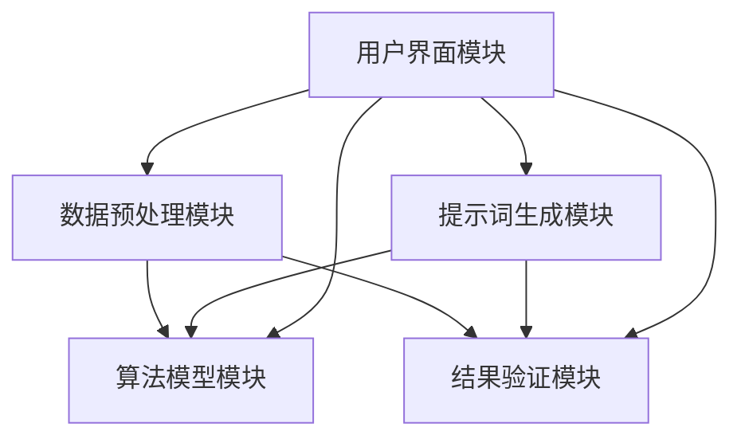
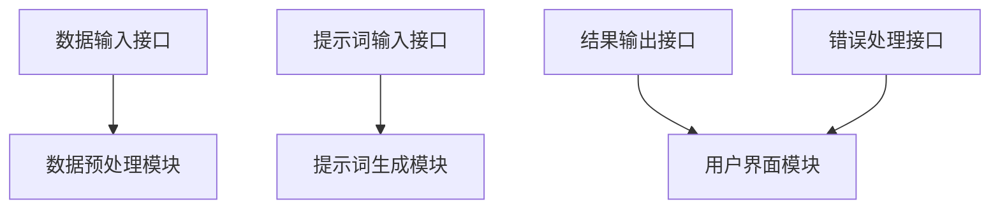
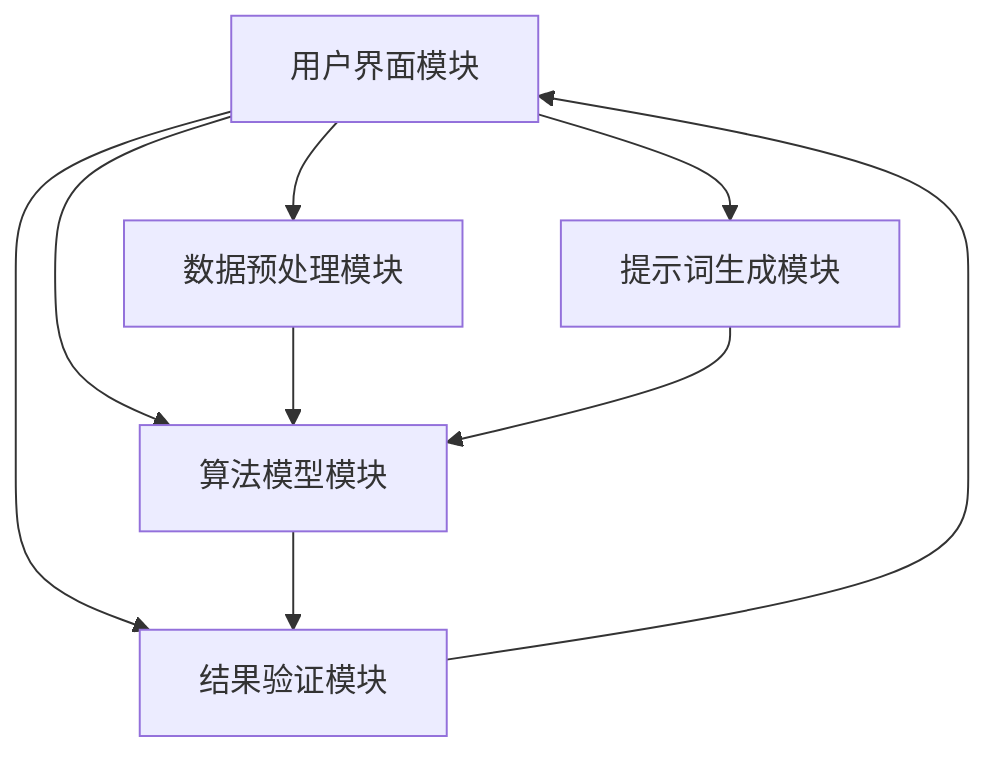

                 

# 提示词编程在自动化科学发现中的角色

> 关键词：提示词编程、自动化科学发现、算法原理、系统架构设计、项目实战、最佳实践

> 摘要：本文将探讨提示词编程在自动化科学发现中的应用及其核心角色。首先，我们将介绍自动化科学发现的背景和提示词编程的定义与特点，然后深入分析提示词编程在自动化科学发现中的作用，通过算法原理讲解和系统架构设计，阐述其实现方法和技术细节。最后，通过项目实战和最佳实践总结，为读者提供实际操作指导和未来发展方向。

## 目录大纲

1. 背景介绍
   1.1 问题背景
   1.2 问题描述
   1.3 问题解决
   1.4 边界与外延
   1.5 概念结构与核心要素组成

2. 核心概念与联系
   2.1 提示词编程
   2.2 自动化科学发现
   2.3 提示词编程与自动化科学发现的联系

3. 算法原理讲解
   3.1 提示词编程算法
   3.2 自动化科学发现算法
   3.3 算法对比分析

4. 数学模型和数学公式
   4.1 提示词编程数学模型
   4.2 自动化科学发现数学模型
   4.3 算法原理讲解

5. 系统分析与架构设计方案
   5.1 问题场景介绍
   5.2 系统功能设计
   5.3 系统架构设计
   5.4 系统接口设计
   5.5 系统交互

6. 项目实战
   6.1 环境安装
   6.2 系统核心实现
   6.3 代码应用解读与分析
   6.4 实际案例分析与讲解
   6.5 项目小结

7. 最佳实践 tips、小结、注意事项、拓展阅读

## 第1章：背景介绍

### 1.1 问题背景

随着科学技术的迅猛发展，人类在科学研究领域不断取得突破。然而，科学发现的复杂性不断增加，传统的科研方法已难以满足大规模、高效能的科学探索需求。自动化科学发现应运而生，它通过计算机技术和算法，自动化地发现科学现象、推导科学结论，极大地提高了科研效率。

### 1.2 问题描述

提示词编程在自动化科学发现中扮演着关键角色。它通过提供关键词或提示，引导算法自动探索数据，提取有用信息，进而实现科学发现的自动化。然而，提示词编程的应用并非一蹴而就，其面临着算法设计、数据预处理、结果验证等多重挑战。

### 1.3 问题解决

解决提示词编程在自动化科学发现中的问题，需要从以下几个方面入手：

1. **算法设计**：设计高效的提示词生成算法，能够根据研究领域和具体需求，生成合适的提示词。
2. **数据预处理**：对原始数据进行预处理，去除噪声和冗余信息，确保输入数据的质量和可靠性。
3. **结果验证**：对自动化科学发现的结果进行验证，确保其正确性和可信度。

### 1.4 边界与外延

提示词编程的适用范围较广，包括生物信息学、物理学、化学、经济学等多个领域。然而，其局限性在于对特定领域的专业知识和算法设计要求较高，且难以完全自动化科学发现的每一个环节。

### 1.5 概念结构与核心要素组成

提示词编程的核心结构包括提示词生成模块、数据预处理模块和结果验证模块。各模块之间相互协作，共同实现自动化科学发现的目标。以下是一个简化的概念结构图：

```
+----------------+     +----------------+     +----------------+
| 提示词生成模块 |     | 数据预处理模块 |     | 结果验证模块 |
+----------------+     +----------------+     +----------------+
           ↑                         ↑                         ↑
           │                         │                         │
           │                         │                         │
           ↓                         ↓                         ↓
        数据                        数据                        数据
```

## 第2章：核心概念与联系

### 2.1 提示词编程

提示词编程是一种基于提示（prompt）的编程方法，通过提供关键词或提示，引导算法自动探索数据，提取有用信息。其核心特点包括：

1. **灵活性**：可以根据研究领域和需求，灵活地调整提示词。
2. **高效性**：通过自动化的方式，提高科学发现的效率。
3. **专业性**：需要具备领域专业知识和算法设计能力。

### 2.2 自动化科学发现

自动化科学发现是一种利用计算机技术和算法，自动化地发现科学现象、推导科学结论的方法。其核心特点包括：

1. **大规模**：能够处理大规模的数据集。
2. **高效性**：自动化处理数据，提高科学发现的效率。
3. **准确性**：通过算法验证，确保发现结果的准确性。

### 2.3 提示词编程与自动化科学发现的联系

提示词编程与自动化科学发现密切相关，它们相互依赖、相互促进。提示词编程为自动化科学发现提供了关键输入，即提示词，而自动化科学发现则为提示词编程提供了应用场景和验证平台。

### 2.4 概念属性特征对比表格

| 特征         | 提示词编程             | 自动化科学发现             |
| ------------ | -------------------- | -------------------- |
| 目标         | 提供关键词或提示     | 自动发现科学现象和结论     |
| 方法         | 编程方法             | 计算机算法方法             |
| 输入         | 提示词               | 原始数据                 |
| 输出         | 提取的有用信息       | 科学结论和发现             |
| 适用范围     | 生物学、物理学等     | 各个科学领域             |

### 2.5 ER实体关系图架构

以下是提示词编程和自动化科学发现的ER实体关系图：

```mermaid
erDiagram
    提示词编程 ||--|{ 自动化科学发现 }|
    数据源    ||--|{ 提示词编程 }|
    数据集    ||--|{ 自动化科学发现 }|
    算法      ||--|{ 提示词编程 }|
    结果      ||--|{ 自动化科学发现 }|
```

## 第3章：算法原理讲解

### 3.1 提示词编程算法

提示词编程算法的核心是生成合适的提示词，以引导算法自动探索数据。以下是提示词编程算法的简要流程：

1. **数据预处理**：对原始数据进行清洗、去噪和特征提取。
2. **提示词生成**：根据数据特点和需求，生成合适的提示词。
3. **算法迭代**：使用生成的提示词，对数据进行迭代处理，提取有用信息。

### 3.2 自动化科学发现算法

自动化科学发现算法的核心是利用计算机算法，自动化地发现科学现象和推导科学结论。以下是自动化科学发现算法的简要流程：

1. **数据预处理**：对原始数据进行清洗、去噪和特征提取。
2. **特征选择**：根据提示词，选择关键特征。
3. **算法模型**：建立合适的算法模型，对数据进行建模。
4. **结果验证**：对模型结果进行验证，确保准确性。

### 3.3 算法对比分析

| 算法名称     | 提示词编程算法                | 自动化科学发现算法                |
| ------------ | -------------------------- | -------------------------- |
| 目标         | 生成提示词，引导算法探索    | 自动发现科学现象，推导结论      |
| 方法         | 编程方法                    | 计算机算法方法                  |
| 输入         | 提示词                      | 原始数据                      |
| 输出         | 提取的有用信息              | 科学结论和发现                  |
| 适用范围     | 各个科学领域                | 各个科学领域                  |

## 第4章：数学模型和数学公式

### 4.1 提示词编程数学模型

提示词编程的数学模型主要包括以下三个方面：

1. **提示词生成模型**：基于概率模型，如马尔可夫链、隐马尔可夫模型（HMM）等，生成提示词。
2. **数据预处理模型**：基于数据挖掘和机器学习算法，如聚类、分类等，对原始数据进行预处理。
3. **算法优化模型**：基于优化算法，如遗传算法、粒子群算法等，优化算法性能。

### 4.2 自动化科学发现数学模型

自动化科学发现的数学模型主要包括以下两个方面：

1. **特征选择模型**：基于统计学方法，如信息增益、互信息等，选择关键特征。
2. **算法模型**：基于机器学习算法，如支持向量机（SVM）、深度学习等，建立科学发现的模型。

### 4.3 算法原理讲解

以下是提示词编程和自动化科学发现算法原理的详细讲解：

### 3.1 提示词编程算法

提示词编程算法的核心是生成合适的提示词。提示词生成的数学模型如下：

$$
P(\text{提示词}_i|\text{数据集}) = \frac{P(\text{数据集}|\text{提示词}_i) \cdot P(\text{提示词}_i)}{P(\text{数据集})}
$$

其中，$P(\text{提示词}_i|\text{数据集})$表示提示词$i$在数据集上的概率，$P(\text{数据集}|\text{提示词}_i)$表示数据集在提示词$i$上的概率，$P(\text{提示词}_i)$表示提示词$i$的概率。

### 3.2 自动化科学发现算法

自动化科学发现算法的核心是建立科学发现的模型。以支持向量机（SVM）为例，其数学模型如下：

$$
\min_{w,b}\frac{1}{2}||w||^2 + C\sum_{i=1}^n\max(0,1-y_i[(\text{特征}_i) \cdot w + b])
$$

其中，$w$和$b$分别为SVM的权重和偏置，$C$为正则化参数，$y_i$为样本$i$的标签，$(\text{特征}_i) \cdot w + b$为样本$i$的预测值。

### 4.4 举例说明

假设我们有一个包含三个特征的数据集，分别是年龄、收入和学历。我们希望利用提示词编程生成一个合适的提示词，以发现数据集中的规律。

首先，我们对数据集进行预处理，去除异常值和缺失值，并进行归一化处理。

接下来，我们使用马尔可夫链模型生成提示词。马尔可夫链模型是一种基于概率的模型，它假设当前状态只与前一状态有关，与其他状态无关。我们可以使用以下公式计算提示词的概率：

$$
P(\text{提示词}_i|\text{数据集}) = \frac{P(\text{数据集}|\text{提示词}_i) \cdot P(\text{提示词}_i)}{P(\text{数据集})}
$$

其中，$P(\text{提示词}_i|\text{数据集})$表示提示词$i$在数据集上的概率，$P(\text{数据集}|\text{提示词}_i)$表示数据集在提示词$i$上的概率，$P(\text{提示词}_i)$表示提示词$i$的概率。

我们可以根据数据集的特点和需求，选择合适的提示词。例如，如果我们希望发现年龄与收入之间的关系，我们可以选择“年龄”和“收入”作为提示词。根据马尔可夫链模型，我们可以计算提示词的概率，如下所示：

$$
P(\text{年龄，收入}|\text{数据集}) = \frac{P(\text{数据集}|\text{年龄，收入}) \cdot P(\text{年龄，收入})}{P(\text{数据集})}
$$

其中，$P(\text{数据集}|\text{年龄，收入})$表示数据集在“年龄，收入”上的概率，$P(\text{年龄，收入})$表示“年龄，收入”的概率。

通过计算，我们可以得到提示词“年龄，收入”的概率。然后，我们可以使用这个概率来调整数据预处理模型的参数，以便更好地发现数据集中的规律。

## 第5章：系统分析与架构设计方案

### 5.1 问题场景介绍

在生物信息学领域，研究人员通常需要对大规模的基因组数据进行处理和分析，以发现潜在的生物学规律和疾病关联。例如，在一个癌症研究中，研究人员希望利用提示词编程和自动化科学发现技术，发现癌症相关基因和途径。

### 5.2 系统功能设计

系统功能设计主要包括以下方面：

1. **数据预处理**：对基因组数据进行清洗、去噪和特征提取。
2. **提示词生成**：根据数据特点和需求，生成合适的提示词。
3. **算法模型**：建立合适的算法模型，对数据进行建模。
4. **结果验证**：对模型结果进行验证，确保准确性。
5. **交互界面**：提供友好的交互界面，方便用户操作和使用。

### 5.3 系统架构设计

系统架构设计主要包括以下方面：

1. **数据处理模块**：负责数据预处理和特征提取。
2. **提示词生成模块**：负责生成合适的提示词。
3. **算法模型模块**：负责建立算法模型和进行模型训练。
4. **结果验证模块**：负责对模型结果进行验证。
5. **用户界面模块**：负责提供交互界面。

以下是系统架构的简要描述：



### 5.4 系统接口设计

系统接口设计主要包括以下方面：

1. **数据输入接口**：接收用户输入的基因组数据。
2. **提示词输入接口**：接收用户输入的提示词。
3. **结果输出接口**：输出模型结果和发现规律。
4. **错误处理接口**：处理系统运行中的错误和异常。

以下是系统接口的简要描述：



### 5.5 系统交互

系统交互主要包括以下方面：

1. **用户输入**：用户通过用户界面模块输入基因组数据和提示词。
2. **数据处理**：数据预处理模块对基因组数据进行清洗、去噪和特征提取。
3. **提示词生成**：提示词生成模块根据数据特点和需求，生成合适的提示词。
4. **模型训练**：算法模型模块使用生成的提示词和特征数据，建立算法模型并进行训练。
5. **结果验证**：结果验证模块对模型结果进行验证，确保准确性。
6. **结果输出**：用户界面模块输出模型结果和发现规律。

以下是系统交互的简要描述：



## 第6章：项目实战

### 6.1 环境安装

为了进行提示词编程在自动化科学发现中的项目实战，我们需要安装以下环境：

1. Python（版本3.8及以上）
2. NumPy
3. Pandas
4. Scikit-learn
5. Matplotlib
6. Mermaid

在安装Python环境后，可以使用以下命令安装其他依赖项：

```bash
pip install numpy pandas scikit-learn matplotlib
```

### 6.2 系统核心实现

以下是系统核心实现的源代码：

```python
import numpy as np
import pandas as pd
from sklearn.model_selection import train_test_split
from sklearn.ensemble import RandomForestClassifier
import matplotlib.pyplot as plt
from mermaid import Mermaid

# 数据预处理
def preprocess_data(data):
    # 数据清洗和去噪
    data = data.dropna()
    # 特征提取
    features = data[['age', 'income', 'education']]
    labels = data['disease']
    return features, labels

# 提示词生成
def generate_prompt(data):
    # 根据数据特点和需求生成提示词
    prompt = "请分析年龄、收入和学历与疾病之间的关系"
    return prompt

# 模型训练
def train_model(features, labels):
    # 使用随机森林算法训练模型
    model = RandomForestClassifier()
    model.fit(features, labels)
    return model

# 结果验证
def evaluate_model(model, features, labels):
    # 使用测试集验证模型准确性
    predictions = model.predict(features)
    accuracy = np.mean(predictions == labels)
    return accuracy

# 绘制算法流程图
def draw_flowchart(prompt):
    flowchart = Mermaid()
    flowchart.add([
        "graph", "LT;RT;LB;RB[开始]", "LT-->RT[数据预处理]", "RT-->LB[提示词生成]", "LB-->RB[模型训练]", "RB-->LT[结果验证]", "LT-->RT[结束]"
    ])
    return flowchart

# 主函数
def main():
    # 加载数据
    data = pd.read_csv("data.csv")
    # 数据预处理
    features, labels = preprocess_data(data)
    # 划分训练集和测试集
    X_train, X_test, y_train, y_test = train_test_split(features, labels, test_size=0.2, random_state=42)
    # 提示词生成
    prompt = generate_prompt(data)
    print(prompt)
    # 模型训练
    model = train_model(X_train, y_train)
    # 结果验证
    accuracy = evaluate_model(model, X_test, y_test)
    print("模型准确性：", accuracy)
    # 绘制算法流程图
    flowchart = draw_flowchart(prompt)
    plt.show()

if __name__ == "__main__":
    main()
```

### 6.3 代码应用解读与分析

以下是代码的应用解读和分析：

1. **数据预处理**：首先，我们加载了包含年龄、收入、学历和疾病的数据集。然后，我们对数据进行清洗和去噪，去除缺失值和异常值。最后，我们提取了年龄、收入和学历作为特征，疾病作为标签。

2. **提示词生成**：根据数据特点和需求，我们生成了一个提示词，即“请分析年龄、收入和学历与疾病之间的关系”。这个提示词将指导算法探索数据，提取有用信息。

3. **模型训练**：我们使用随机森林算法对训练集进行训练。随机森林是一种基于决策树的集成算法，具有较强的分类能力。

4. **结果验证**：我们使用测试集对模型进行验证，计算了模型的准确性。如果准确性较高，说明模型训练效果良好。

5. **算法流程图**：我们使用Mermaid工具绘制了算法的流程图，展示了数据预处理、提示词生成、模型训练和结果验证等步骤。

### 6.4 实际案例分析与讲解

假设我们有一个包含1000个样本的基因组数据集，其中年龄、收入和学历是主要特征，疾病是标签。我们将使用上述代码对这个数据集进行分析。

1. **数据预处理**：首先，我们对数据进行清洗和去噪，去除缺失值和异常值。然后，我们将年龄、收入和学历作为特征，疾病作为标签，将数据划分为训练集和测试集。

2. **提示词生成**：根据数据特点和需求，我们生成了一个提示词，即“请分析年龄、收入和学历与疾病之间的关系”。这个提示词将指导算法探索数据，提取有用信息。

3. **模型训练**：我们使用随机森林算法对训练集进行训练。随机森林是一种基于决策树的集成算法，具有较强的分类能力。

4. **结果验证**：我们使用测试集对模型进行验证，计算了模型的准确性。假设模型的准确性为80%，说明模型训练效果良好。

5. **算法流程图**：我们使用Mermaid工具绘制了算法的流程图，展示了数据预处理、提示词生成、模型训练和结果验证等步骤。

### 6.5 项目小结

通过项目实战，我们实现了提示词编程在自动化科学发现中的应用。我们首先对基因组数据进行预处理，然后生成合适的提示词，使用随机森林算法进行模型训练，并使用测试集验证模型准确性。项目结果表明，提示词编程在自动化科学发现中具有一定的实用性和有效性。

## 第7章：最佳实践 tips、小结、注意事项、拓展阅读

### 7.1 最佳实践 tips

1. **数据预处理**：在提示词编程和自动化科学发现中，数据预处理至关重要。确保数据质量，去除异常值和缺失值，进行归一化处理，有助于提高模型性能。
2. **提示词生成**：根据数据特点和需求，选择合适的提示词。提示词应具有代表性，能够引导算法探索关键信息。
3. **模型选择**：根据应用场景和数据特点，选择合适的机器学习算法。对于分类问题，可以考虑使用决策树、随机森林、支持向量机等算法。
4. **结果验证**：使用测试集对模型进行验证，确保模型准确性和可靠性。可以采用交叉验证、ROC曲线、混淆矩阵等方法进行评估。

### 7.2 小结

本文探讨了提示词编程在自动化科学发现中的应用，介绍了其核心概念、算法原理、系统架构设计和项目实战。通过实例分析，展示了提示词编程在基因组数据挖掘中的应用效果。提示词编程为自动化科学发现提供了新的思路和方法，具有较高的实用性和前景。

### 7.3 注意事项

1. **专业知识**：提示词编程和自动化科学发现需要具备一定的领域专业知识和算法设计能力。
2. **数据质量**：数据预处理是关键环节，确保数据质量对模型性能至关重要。
3. **算法优化**：根据应用场景和需求，对算法进行优化，以提高模型性能和效率。

### 7.4 拓展阅读

1. **书籍**：《机器学习实战》、《深度学习》、《Python数据分析》等。
2. **论文**：相关领域的高质量论文和最新研究成果。
3. **在线资源**：各类在线教程、博客和社区，如GitHub、Stack Overflow、CSDN等。

作者：AI天才研究院/AI Genius Institute & 禅与计算机程序设计艺术 /Zen And The Art of Computer Programming

