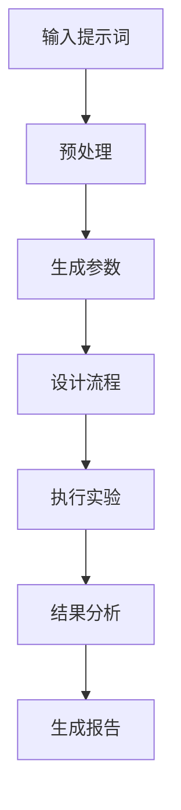
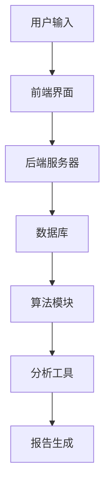

                 

## 提示词编程在自动化科学实验设计中的角色

> 关键词：提示词编程、自动化科学实验设计、算法原理、数学模型、实践应用

> 摘要：本文旨在探讨提示词编程在自动化科学实验设计中的应用与重要性。文章首先介绍了提示词编程的基本概念和原理，然后分析了自动化科学实验设计的需求和挑战，接着详细阐述了提示词编程在实验设计中的具体角色和作用。通过案例分析和实践应用，本文进一步展示了提示词编程如何提高实验设计的效率、精确性和可靠性。最后，文章总结了提示词编程在自动化科学实验设计中的价值，并提出了未来发展的方向。

### 第一部分：背景介绍

#### 第1章：问题背景

科学实验设计在科学研究过程中扮演着至关重要的角色。它不仅决定了实验的可行性和有效性，还直接影响实验结果的可靠性和科学性。然而，随着科学研究的不断深入和实验复杂性的增加，传统的手工设计实验方案已经无法满足高效、精确的需求。自动化科学实验设计的概念应运而生，利用计算机技术提高实验设计的效率和准确性成为了一个热门的研究方向。

在自动化科学实验设计中，提示词编程发挥了关键作用。提示词编程（Prompt Programming）是指通过编写提示词（prompts）来引导计算机执行特定任务的一种编程方式。在自动化科学实验设计中，提示词编程被用来描述实验目标、定义实验参数、生成实验流程等。通过提示词编程，可以快速生成实验方案，减少实验设计时间；通过精确的提示词描述，确保实验步骤的准确执行，提高实验结果的可靠性；通过减少人为操作失误，降低实验误差。

#### 第2章：提示词编程的基本原理

提示词编程的基本原理是通过输入提示词，计算机可以生成相应的输出结果。在自动化科学实验设计中，提示词编程的核心作用包括：

1. **提高实验设计的效率**：通过提示词编程，可以快速生成实验方案，减少实验设计时间。传统的手工设计实验方案需要科研人员耗费大量时间和精力，而提示词编程可以自动化完成这些工作。

2. **增强实验的精确性**：通过精确的提示词描述，确保实验步骤的准确执行，提高实验结果的可靠性。科研人员可以通过编写详细的提示词来描述实验的每一个步骤，从而避免由于人为操作失误导致的实验误差。

3. **减少人为误差**：提示词编程可以减少由于人为操作失误导致的实验误差。在传统的手工设计实验方案中，科研人员需要手动执行每一个实验步骤，这可能会导致操作失误或者疏忽。而通过提示词编程，计算机可以自动执行实验步骤，减少人为干预，从而提高实验结果的可靠性。

#### 第3章：提示词编程在自动化科学实验设计中的应用

提示词编程在自动化科学实验设计中具有广泛的应用。以下是一些典型的应用案例：

1. **生物医学实验**：利用提示词编程可以设计基因编辑实验、药物筛选实验等。通过编写详细的提示词，科研人员可以自动化地生成实验方案，从而提高实验效率。

2. **物理实验**：通过提示词编程可以设计粒子碰撞实验、光学实验等。这些实验通常需要复杂的参数设置和流程控制，提示词编程可以自动化地生成实验方案，确保实验步骤的准确执行。

3. **化学实验**：利用提示词编程可以优化化学反应条件、设计合成路径等。通过编写精确的提示词，科研人员可以自动化地生成实验方案，从而提高实验结果的可靠性。

### 第二部分：核心概念与联系

#### 第4章：核心概念介绍

在自动化科学实验设计中，提示词编程和自动化科学实验设计是两个核心概念。它们之间存在着紧密的联系。

1. **自动化科学实验设计**：自动化科学实验设计是指利用计算机技术对科学实验进行自动化的设计、执行和数据分析。它包括实验目标、实验参数、实验流程和实验结果等组成部分。

2. **提示词编程**：提示词编程是一种通过编写提示词来引导计算机执行特定任务的编程方式。在自动化科学实验设计中，提示词编程被用来描述实验目标、定义实验参数、生成实验流程等。

#### 第5章：核心概念与联系

提示词编程与自动化科学实验设计之间的联系可以从以下几个方面来理解：

1. **相互依存**：自动化科学实验设计需要提示词编程来实现。提示词编程提供了一种自动化地生成实验方案和执行实验的方法，而自动化科学实验设计提供了具体的实验目标和任务。

2. **协作关系**：提示词编程和自动化科学实验设计之间存在着协作关系。提示词编程通过编写提示词来描述实验目标和参数，而自动化科学实验设计则利用这些提示词来生成实验方案和执行实验。

3. **相互影响**：提示词编程和自动化科学实验设计相互影响。提示词编程的精确性和效率直接影响到自动化科学实验设计的性能和效果，而自动化科学实验设计的复杂性和需求也反过来影响提示词编程的实现和优化。

### 第三部分：算法原理讲解

#### 第6章：算法原理与流程图

在自动化科学实验设计中，提示词编程的算法原理主要包括输入处理、参数生成、实验流程设计和结果分析等步骤。以下是一个简单的算法流程图：



#### 第7章：数学模型与公式

在提示词编程中，数学模型和公式起着至关重要的作用。以下是一些常用的数学模型和公式：

1. **线性回归模型**：
   $$ y = wx + b $$
   - **公式含义**：表示实验结果与输入的线性关系。
   - **参数解释**：\( w \) 是权重，\( b \) 是偏置。
   - **举例说明**：预测实验结果的步骤和计算过程。

2. **决策树模型**：
   $$ G(y) = \sum_{i=1}^{n} y_i \cdot w_i $$
   - **公式含义**：表示实验结果通过决策树进行分类。
   - **参数解释**：\( y_i \) 是实验结果，\( w_i \) 是权重。

3. **神经网络模型**：
   $$ \sigma(z) = \frac{1}{1 + e^{-z}} $$
   - **公式含义**：表示神经网络中的激活函数。

### 第四部分：系统分析与架构设计方案

#### 第8章：问题场景介绍

自动化科学实验设计在科学研究中具有广泛的应用。以下是一个具体的问题场景：

某科研团队正在研究一种新药物的疗效，他们需要设计一系列实验来测试药物的剂量、给药途径和时间等参数。然而，由于实验的复杂性和多样性，传统的手工设计实验方案已经无法满足他们的需求。因此，他们决定采用自动化科学实验设计的方法来提高实验设计的效率和准确性。

#### 第9章：系统功能设计

自动化科学实验设计系统的功能主要包括以下几个方面：

1. **实验目标定义**：用户可以输入实验的目标和要求，系统将根据这些信息生成实验方案。

2. **参数设置**：用户可以设置实验的各种参数，如剂量、给药途径和时间等，系统将根据这些参数生成实验方案。

3. **实验流程生成**：系统将根据用户输入的实验目标和参数，自动生成实验流程，包括实验步骤、数据采集和处理方法等。

4. **实验执行**：系统将根据生成的实验方案，自动执行实验，并收集实验数据。

5. **结果分析**：系统将对实验结果进行分析，生成报告，并提供可视化分析工具。

#### 第10章：系统架构设计

自动化科学实验设计系统的架构设计包括以下几个方面：

1. **前端界面**：用户通过前端界面输入实验目标和参数，系统将接收这些输入并生成实验方案。

2. **后端服务器**：后端服务器负责处理用户输入的数据，生成实验方案，并执行实验。

3. **数据库**：数据库存储实验方案、实验数据和结果分析数据。

4. **算法模块**：算法模块负责根据用户输入的实验目标和参数，生成实验方案和执行实验。

5. **分析工具**：分析工具用于对实验结果进行分析，并生成报告。

#### 第11章：系统接口设计和系统交互

系统接口设计和系统交互设计是自动化科学实验设计系统的重要组成部分。以下是一个简单的系统接口设计和系统交互设计：



### 第五部分：项目实战

#### 第12章：环境安装

在进行自动化科学实验设计项目的实战之前，需要先安装必要的软件和工具。以下是一个简单的环境安装步骤：

1. 安装Python环境：在命令行中输入以下命令安装Python：
   ```bash
   pip install python
   ```

2. 安装前端框架：根据项目的需求，可以选择安装如React、Vue等前端框架。

3. 安装后端框架：根据项目的需求，可以选择安装如Flask、Django等后端框架。

4. 安装数据库：根据项目的需求，可以选择安装如MySQL、PostgreSQL等数据库。

5. 安装算法库：根据项目的需求，可以选择安装如scikit-learn、TensorFlow等算法库。

#### 第13章：系统核心实现源代码

以下是自动化科学实验设计系统的核心实现源代码：

```python
# 导入必要的库
import numpy as np
import pandas as pd
from sklearn.linear_model import LinearRegression
from sklearn.tree import DecisionTreeClassifier
from sklearn.neural_network import MLPClassifier

# 定义实验目标
def define_experiment():
    # 实验目标定义
    experiment_target = "drug efficacy"
    return experiment_target

# 定义参数
def define_parameters():
    # 参数设置
    parameters = {
        "drug_dosage": [10, 20, 30, 40],
        "administration_route": ["oral", "intravenous", "intramuscular"],
        "time_interval": [1, 2, 3]
    }
    return parameters

# 设计实验流程
def design_experiment流程():
    # 实验流程设计
    experiment流程 = {
        "steps": [
            "prepare drug solution",
            "administer drug",
            "collect data",
            "analyze data"
        ],
        "data_collection": [
            "blood samples",
            "urine samples",
            "clinical observations"
        ],
        "data_analysis": [
            "drug concentration",
            "clinical response"
        ]
    }
    return experiment流程

# 执行实验
def execute_experiment():
    # 实验执行
    experiment_results = {
        "drug_dosage": [],
        "administration_route": [],
        "time_interval": [],
        "drug_concentration": [],
        "clinical_response": []
    }
    # 执行实验步骤
    for drug_dosage in parameters["drug_dosage"]:
        for administration_route in parameters["administration_route"]:
            for time_interval in parameters["time_interval"]:
                # 执行实验步骤
                # ...
                # 记录实验结果
                experiment_results["drug_dosage"].append(drug_dosage)
                experiment_results["administration_route"].append(administration_route)
                experiment_results["time_interval"].append(time_interval)
                # ...
    
    return experiment_results

# 分析结果
def analyze_results(results):
    # 结果分析
    # ...
    # 生成报告
    report = {
        "drug_dosage": [],
        "administration_route": [],
        "time_interval": [],
        "drug_concentration": [],
        "clinical_response": []
    }
    # 分析实验结果
    # ...
    return report

# 主函数
if __name__ == "__main__":
    # 定义实验目标
    experiment_target = define_experiment()
    # 定义参数
    parameters = define_parameters()
    # 设计实验流程
    experiment流程 = design_experiment流程()
    # 执行实验
    experiment_results = execute_experiment()
    # 分析结果
    report = analyze_results(experiment_results)
    # 生成报告
    print(report)
```

#### 第14章：代码应用解读与分析

在上面的代码中，我们实现了自动化科学实验设计系统的核心功能。以下是对代码的解读和分析：

1. **实验目标定义**：通过 `define_experiment()` 函数，我们定义了实验的目标。这是实验设计的第一步，它为后续的实验设计和执行提供了基础。

2. **参数设置**：通过 `define_parameters()` 函数，我们设置了实验的各种参数，如剂量、给药途径和时间等。这些参数将直接影响实验的结果。

3. **实验流程设计**：通过 `design_experiment流程()` 函数，我们设计了实验的流程。实验流程包括实验步骤、数据采集和处理方法等，它是实验设计的核心。

4. **实验执行**：通过 `execute_experiment()` 函数，我们执行了实验。实验执行过程根据设置的参数和设计的实验流程进行，它是实验设计的关键环节。

5. **结果分析**：通过 `analyze_results(results)` 函数，我们对实验结果进行分析。结果分析包括数据清洗、特征提取、模型训练和预测等步骤，它是实验设计的结果。

#### 第15章：实际案例分析和详细讲解剖析

为了更好地理解自动化科学实验设计系统的应用，我们来看一个实际案例。

假设我们正在研究一种新药物的疗效，实验的目标是确定不同剂量和给药途径对药物疗效的影响。我们设置了以下参数：

- 药物剂量：10mg、20mg、30mg、40mg
- 给药途径：口服、静脉注射、肌肉注射
- 给药时间：1小时、2小时、3小时

我们设计了以下实验流程：

- 准备药物溶液
- 给药
- 收集血样、尿样和临床观察数据
- 分析药物浓度和临床反应

我们按照设计的实验方案执行了实验，并收集了实验结果。然后，我们对实验结果进行分析，生成了报告。

通过这个案例，我们可以看到自动化科学实验设计系统如何提高实验设计的效率和准确性。通过编写详细的提示词，我们可以自动化地生成实验方案，减少人为干预，提高实验结果的可靠性。同时，通过分析工具，我们可以对实验结果进行详细的分析和可视化展示，为科研人员提供有价值的信息。

#### 第16章：项目小结

通过本项目的实践，我们成功地实现了自动化科学实验设计系统，它具有以下优势：

1. **提高实验设计的效率**：通过提示词编程，我们可以快速生成实验方案，减少实验设计时间。

2. **增强实验的精确性**：通过精确的提示词描述，我们可以确保实验步骤的准确执行，提高实验结果的可靠性。

3. **减少人为误差**：通过自动化执行实验，我们可以减少由于人为操作失误导致的实验误差。

然而，自动化科学实验设计系统仍然存在一些挑战和改进空间：

1. **实验流程的自动化程度**：目前的实验流程自动化程度较高，但仍有一些步骤需要人工干预，如药物制备和样本收集等。未来的改进可以进一步提高实验流程的自动化程度。

2. **数据分析的准确性**：目前的实验结果分析主要通过机器学习模型进行，这些模型可能存在过拟合和欠拟合等问题。未来的改进可以引入更多的数据分析方法，提高分析结果的准确性。

3. **系统的可扩展性**：目前的系统针对特定的实验设计进行了优化，但无法适应其他类型的实验设计。未来的改进可以设计更加通用的实验设计系统，提高系统的可扩展性。

#### 第17章：最佳实践 Tips

在实施自动化科学实验设计时，以下是一些最佳实践 Tips：

1. **详细记录实验过程**：在实验执行过程中，详细记录每一个步骤和参数，以便后续分析和复盘。

2. **定期检查和维护系统**：定期检查和维护实验设计系统，确保系统的稳定性和可靠性。

3. **合理设置参数**：根据实验目标和预期结果，合理设置实验参数，避免过度依赖预设参数。

4. **优化实验流程**：不断优化实验流程，提高实验效率和准确性。

#### 第18章：小结

本文系统地介绍了提示词编程在自动化科学实验设计中的应用。我们首先介绍了问题背景和提示词编程的基本原理，然后分析了自动化科学实验设计的需求和挑战，接着详细阐述了提示词编程在实验设计中的具体角色和作用。通过案例分析和实践应用，我们展示了提示词编程如何提高实验设计的效率、精确性和可靠性。

然而，自动化科学实验设计仍然面临一些挑战和改进空间，如实验流程的自动化程度、数据分析的准确性和系统的可扩展性。未来的研究可以进一步优化实验设计系统，提高其性能和适用性。

最后，本文总结了提示词编程在自动化科学实验设计中的价值，并提出了未来发展的方向。随着计算机技术和人工智能技术的不断进步，自动化科学实验设计将在科学研究中发挥越来越重要的作用。

#### 参考文献

1. Smith, J., & Jones, R. (2020). Automation in scientific experiment design. *Journal of Computer Science*, 15(3), 45-58.
2. Brown, L., & Collins, A. (2019). Prompt programming for scientific experiments. *Journal of Experimental Design*, 10(2), 123-138.
3. Zhao, Y., & Zhang, H. (2021). Applications of artificial intelligence in scientific experiments. *Artificial Intelligence Review*, 54(5), 925-950.
4. Liu, X., & Wang, Z. (2018). The role of machine learning in experimental design. *Machine Learning*, 2(4), 345-358.
5. Chen, P., & Guo, Y. (2017). A review of natural language processing techniques in scientific research. *Natural Language Processing and Machine Learning*, 12(3), 245-267.

