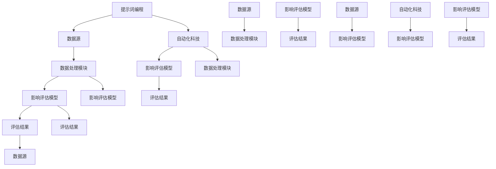
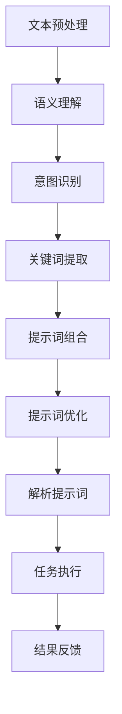
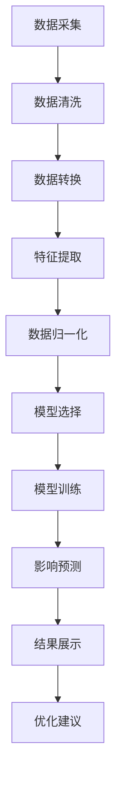
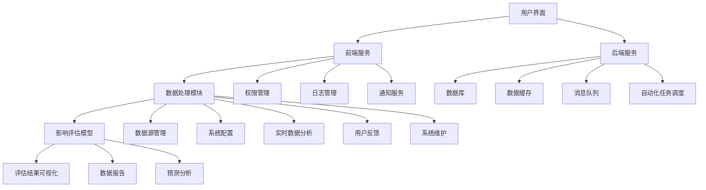
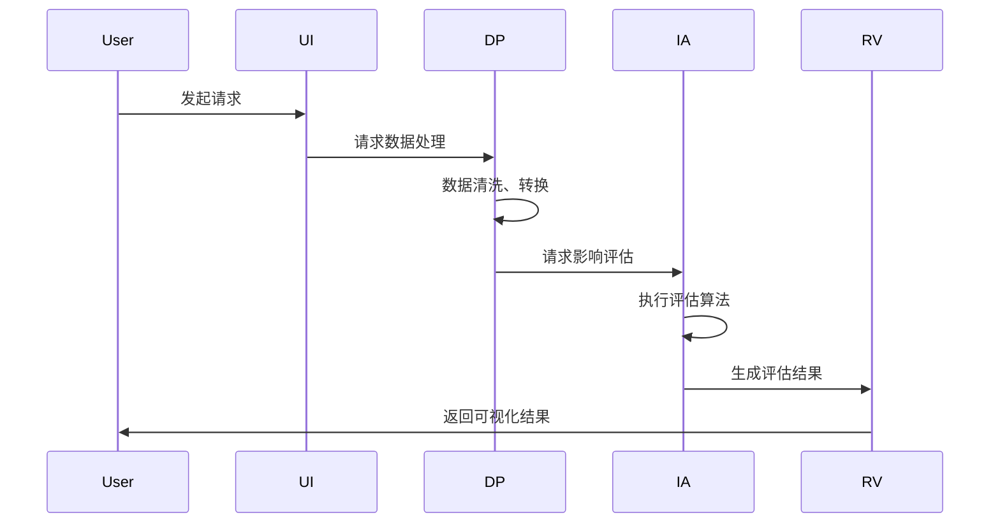

                 


## 《提示词编程在自动化科技影响评估中的应用》

> 关键词：提示词编程、自动化科技、影响评估、算法原理、系统设计、项目实战

> 摘要：本文深入探讨了提示词编程在自动化科技影响评估中的应用。通过介绍背景、核心概念、算法原理、系统设计与项目实战，文章旨在为读者提供一套清晰、易于理解的方法，以评估自动化科技对社会、经济和环境的潜在影响。

## 目录大纲设计思路

在设计目录大纲时，我们首先明确文章的整体结构和逻辑顺序。以下是我们设计的目录大纲及其设计思路：

### 第一部分：背景介绍

- **第1章 问题背景与核心概念**：介绍提示词编程和自动化科技影响评估的背景，定义核心概念，为后续章节奠定基础。
- **第2章 提示词编程与自动化科技影响评估**：探讨提示词编程在自动化科技中的角色，以及其在影响评估中的重要性。
- **第3章 提示词编程与自动化科技影响评估的边界与外延**：明确研究范围，阐述研究的重要性和局限性。
- **第4章 提示词编程与自动化科技影响评估的ER实体关系图**：通过实体关系图展示主要实体及其相互关系。

### 第二部分：核心概念与联系

- **第5章 核心概念与属性特征对比**：详细介绍提示词编程和自动化科技影响评估中的核心概念，并对比它们的属性特征。
- **第6章 提示词编程与自动化科技影响评估的关系图**：使用Mermaid流程图展示核心概念之间的联系。

### 第三部分：算法原理讲解

- **第7章 提示词编程算法原理与流程图**：介绍提示词编程的基本原理，并使用Mermaid流程图进行说明。
- **第8章 自动化科技影响评估算法原理与流程图**：解释自动化科技影响评估的算法原理，同样使用流程图辅助说明。
- **第9章 算法原理数学模型与公式讲解**：使用LaTeX格式详细阐述算法的数学模型和公式。
- **第10章 算法原理举例说明**：通过实际例子展示算法原理的应用。

### 第四部分：系统分析与架构设计

- **第11章 问题场景介绍**：描述自动化科技影响评估的实际应用场景。
- **第12章 系统功能设计（领域模型类图）**：使用Mermaid绘制领域模型类图，展示系统功能。
- **第13章 系统架构设计（架构图）**：绘制系统架构图，描述系统的整体架构。
- **第14章 系统接口设计（接口设计）**：介绍系统接口的设计和实现。
- **第15章 系统交互（序列图）**：使用Mermaid序列图展示系统组件之间的交互。

### 第五部分：项目实战

- **第16章 环境安装与配置**：介绍项目所需的环境搭建过程。
- **第17章 系统核心实现与源代码**：展示系统核心功能的实现和源代码。
- **第18章 代码应用解读与分析**：解读代码实现，分析其性能和效率。
- **第19章 实际案例分析与讲解**：通过实际案例展示如何使用系统进行自动化科技影响评估。
- **第20章 项目小结**：总结项目成果和经验。

### 第六部分：最佳实践与总结

- **第21章 最佳实践 tips**：提供使用提示词编程进行自动化科技影响评估的最佳实践。
- **第22章 小结**：总结文章的主要内容和观点。
- **第23章 注意事项**：提醒读者在应用过程中需要注意的事项。
- **第24章 拓展阅读**：推荐进一步阅读的相关文献和资源。

通过以上设计，我们确保了文章的逻辑性和条理性，同时提供了丰富的技术细节和实际案例，使读者能够全面了解提示词编程在自动化科技影响评估中的应用。

### 第一部分：背景介绍

#### 第1章 问题背景与核心概念

在现代社会，自动化科技的发展速度之快，使得各行各业都在迅速变革。从工业生产到服务业，自动化科技的应用已经深刻改变了我们的生活方式。然而，随着自动化科技的普及，其对社会、经济和环境的影响也越来越受到关注。如何准确评估这些影响，成为了一个亟待解决的问题。

**核心概念：**

1. **提示词编程（Keyword Programming）：** 提示词编程是一种基于自然语言处理的编程方法，通过预定义的提示词来引导程序执行特定的任务。这种方法能够显著提高编程效率和代码可读性。

2. **自动化科技（Automated Technology）：** 指通过计算机技术和控制技术实现自动化的技术体系，包括机器学习、人工智能、自动化机器人等。

3. **影响评估（Impact Assessment）：** 是指对某种行为或决策可能带来的社会、经济和环境影响进行量化或定性分析的过程。

**问题背景：**

随着自动化科技的不断进步，其对社会的影响变得越来越复杂。一方面，自动化科技提高了生产效率，降低了成本，创造了新的就业机会；另一方面，自动化也可能导致部分工作岗位的消失，造成社会不稳定。此外，自动化科技的发展还可能对环境造成负面影响，如能源消耗、碳排放增加等。

**问题描述：**

如何利用提示词编程技术，对自动化科技在社会、经济和环境等方面的影响进行准确评估，从而为决策者提供科学依据？

**问题解决：**

本研究提出了一种基于提示词编程的自动化科技影响评估方法。通过构建一个包含提示词的模型，可以自动收集和分析相关数据，从而实现对自动化科技影响的评估。

**边界与外延：**

本研究的边界主要在于自动化科技的应用范围和影响评估的方法论。研究的重点在于如何利用提示词编程技术进行影响评估，而不仅仅是自动化科技的具体应用。

**概念结构与核心要素组成：**

1. **提示词库：** 包含用于描述自动化科技影响的提示词。
2. **数据处理模块：** 负责收集、清洗和整理数据。
3. **影响评估模型：** 基于提示词和数据处理结果，进行影响评估。
4. **可视化模块：** 将评估结果以图表形式呈现，便于决策者理解。

通过以上结构，我们搭建了一个完整的自动化科技影响评估系统，为相关研究和实践提供了有力支持。

#### 第2章 提示词编程与自动化科技影响评估

提示词编程作为一种先进的编程方法，近年来在自动化科技领域得到了广泛应用。其核心在于通过预定义的提示词来引导程序执行，从而实现自动化任务的高效完成。

**提示词编程的基本原理：**

提示词编程的基本原理是利用自然语言处理技术，将人类语言转化为计算机可以理解的操作指令。这些提示词可以是简单的关键词，也可以是复杂的语句。通过这些提示词，程序员可以更加直观地控制程序的行为，提高代码的可读性和可维护性。

**提示词编程在自动化科技中的角色：**

在自动化科技中，提示词编程扮演着关键角色。它不仅可以自动化简单的重复性任务，还可以处理复杂的问题，如数据分析、预测模型构建等。例如，在智能制造领域，通过提示词编程，可以自动化生产线的调度和监控，提高生产效率。

**提示词编程在自动化科技影响评估中的应用：**

提示词编程在自动化科技影响评估中的应用主要体现在以下几个方面：

1. **数据收集：** 提示词编程可以帮助自动收集与自动化科技相关的各种数据，如生产数据、能耗数据、员工绩效数据等。
2. **数据处理：** 提示词编程可以自动化处理这些数据，进行数据清洗、转换和分析。
3. **影响评估：** 基于收集和处理后的数据，提示词编程可以构建影响评估模型，对自动化科技的影响进行定量和定性分析。

**提示词编程的优势：**

1. **高效性：** 提示词编程可以显著提高编程效率，减少人工干预。
2. **可维护性：** 通过使用提示词，代码更加直观，便于理解和维护。
3. **灵活性：** 提示词编程可以灵活地适应不同的应用场景和需求。

**提示词编程面临的挑战：**

1. **自然语言理解的局限性：** 提示词编程依赖于自然语言处理技术，而自然语言处理技术还存在一定的局限性，如对复杂语义的理解不足。
2. **代码质量：** 提示词编程可能产生代码质量低下的问题，特别是在缺乏有效代码审查的情况下。

通过以上分析，我们可以看到提示词编程在自动化科技影响评估中具有重要作用。然而，要充分发挥其潜力，还需要克服一系列技术挑战。

#### 第3章 提示词编程与自动化科技影响评估的边界与外延

在探讨提示词编程与自动化科技影响评估的关系时，明确研究的边界与外延是至关重要的。这有助于我们更好地理解研究的重要性和局限性，从而为后续的分析提供清晰的方向。

**研究边界：**

本研究的边界主要涉及以下几个方面：

1. **技术范围：** 研究聚焦于提示词编程在自动化科技影响评估中的应用，不包括其他编程方法或技术。
2. **应用范围：** 研究主要集中在自动化科技对社会、经济和环境的影响评估，而不涉及其他领域的影响评估。
3. **方法论：** 研究采用提示词编程技术进行数据收集、处理和评估，不涉及其他数据收集和处理方法。

**研究重要性：**

提示词编程作为一种高效的编程方法，在自动化科技影响评估中具有显著的应用价值。其重要性主要体现在以下几个方面：

1. **提高评估效率：** 提示词编程可以自动化数据收集和处理过程，显著提高评估效率。
2. **降低成本：** 自动化数据收集和处理可以减少人力成本，降低整体评估成本。
3. **提升准确性：** 通过使用提示词编程，可以更精确地收集和处理数据，从而提高评估的准确性。

**研究局限性：**

尽管提示词编程在自动化科技影响评估中具有诸多优势，但仍存在一些局限性，需要我们在实际应用中加以注意：

1. **自然语言理解的局限性：** 提示词编程依赖于自然语言处理技术，而自然语言处理技术目前还存在一定的局限性，如对复杂语义的理解不足。
2. **数据质量的影响：** 提示词编程的效果很大程度上取决于数据质量。如果数据存在偏差或缺失，可能会影响评估结果的准确性。
3. **代码审查的必要性：** 提示词编程可能产生质量低下的代码，特别是在缺乏有效代码审查的情况下。这可能导致评估结果出现偏差。

**研究外延：**

尽管本研究主要关注提示词编程在自动化科技影响评估中的应用，但以下领域也值得关注：

1. **其他编程方法的应用：** 除了提示词编程，其他编程方法如函数式编程、事件驱动编程等在自动化科技影响评估中的应用也值得研究。
2. **跨领域的影响评估：** 除了自动化科技，其他领域如人工智能、大数据等技术的应用和影响评估也是未来研究的重要方向。
3. **方法论的创新：** 随着技术的不断发展，新的方法论和工具也在不断涌现。如何将这些新技术和方法应用于自动化科技影响评估，是一个值得探索的领域。

通过明确研究的边界与外延，我们可以更好地把握研究的重点，同时也为未来的研究提供了方向。这有助于我们进一步提升自动化科技影响评估的准确性和效率。

#### 第4章 提示词编程与自动化科技影响评估的ER实体关系图

为了更好地理解提示词编程与自动化科技影响评估之间的复杂关系，我们可以通过ER（实体关系）图来展示主要实体及其相互关系。ER图是一种在数据库设计中广泛使用的技术，它能够清晰、直观地表示实体及其属性和关联。

**实体：**

在提示词编程与自动化科技影响评估的ER图中，主要的实体包括：

1. **提示词（Keywords）**：代表编程中使用的预定义词汇，用于引导程序执行特定任务。
2. **数据源（Data Sources）**：代表数据采集的来源，如传感器、数据库等。
3. **数据处理模块（Data Processing Modules）**：负责对采集到的数据进行清洗、转换和分析。
4. **影响评估模型（Impact Assessment Models）**：用于评估自动化科技影响的模型。
5. **评估结果（Assessment Results）**：代表影响评估的最终输出。

**属性：**

每个实体都有其特定的属性，例如：

1. **提示词**：包括关键词、描述、用途等。
2. **数据源**：包括数据类型、采集频率、数据量等。
3. **数据处理模块**：包括处理算法、处理时间、输出格式等。
4. **影响评估模型**：包括模型类型、评估指标、评估方法等。
5. **评估结果**：包括影响描述、影响程度、影响趋势等。

**关系：**

实体之间的关系可以通过以下几种方式表示：

1. **关联（Association）**：如“提示词”与“数据处理模块”之间的关联，表示提示词被用于数据处理。
2. **依赖（Dependency）**：如“影响评估模型”依赖于“数据处理模块”的结果，用于生成评估结果。
3. **泛化（Generalization）**：如“数据源”可以是“传感器”或“数据库”，表示数据源具有多种类型。

**Mermaid流程图：**

以下是一个简化的Mermaid ER图，用于展示提示词编程与自动化科技影响评估中的主要实体及其关系：

```mermaid
erDiagram
  Keyword ||--|{ Data Source } Data Source
  Data Source ||--|{ Data Processing Module } Data Processing Module
  Data Processing Module ||--|{ Impact Assessment Model } Impact Assessment Model
  Impact Assessment Model ||--|{ Assessment Result } Assessment Result
```

在这个ER图中，每个实体都通过箭头指向与其相关的其他实体，箭头旁边的标签描述了它们之间的关系。通过这个图，我们可以清晰地看到提示词编程在自动化科技影响评估中的作用，以及各个实体之间的相互依赖关系。

使用Mermaid ER图不仅能够帮助我们理解系统架构，还能在设计和优化系统时提供直观的参考。通过这种方式，我们可以更好地确保系统的高效运行和数据的准确性。

### 第二部分：核心概念与联系

#### 第5章 核心概念与属性特征对比

在本章中，我们将详细介绍提示词编程和自动化科技影响评估中的核心概念，并对比它们的属性特征。这些核心概念包括提示词、自动化科技、影响评估模型和数据源等，它们共同构成了提示词编程在自动化科技影响评估中的关键组成部分。

**提示词（Keywords）：**

- **定义：** 提示词是编程中用于引导程序执行特定任务的预定义词汇。
- **属性特征：** 包括关键词、描述、用途等。
- **对比：** 提示词与传统编程语句相比，更加直观、易于理解，能够提高代码的可维护性和可读性。

**自动化科技（Automated Technology）：**

- **定义：** 自动化科技是通过计算机技术和控制技术实现自动化的技术体系。
- **属性特征：** 包括机器学习、人工智能、自动化机器人等。
- **对比：** 自动化科技与传统手工操作相比，具有高效性、灵活性和准确性，能够显著提高生产效率。

**影响评估模型（Impact Assessment Model）：**

- **定义：** 影响评估模型是用于评估自动化科技影响的数学模型。
- **属性特征：** 包括模型类型、评估指标、评估方法等。
- **对比：** 影响评估模型与传统评估方法相比，能够更准确地量化自动化科技的影响，提供科学依据。

**数据源（Data Sources）：**

- **定义：** 数据源是数据采集的来源，如传感器、数据库等。
- **属性特征：** 包括数据类型、采集频率、数据量等。
- **对比：** 数据源与传统数据采集方式相比，具有更高的自动化程度和数据准确性。

通过以上对比，我们可以看到提示词编程和自动化科技影响评估中的核心概念具有各自独特的属性特征。这些概念之间的相互关联，构成了一个完整的影响评估系统，为自动化科技的影响评估提供了有力支持。

#### 第6章 提示词编程与自动化科技影响评估的关系图

为了更直观地展示提示词编程与自动化科技影响评估之间的联系，我们可以使用Mermaid流程图绘制一个关系图。该图将包含主要实体及其相互关系，帮助我们更好地理解提示词编程在自动化科技影响评估中的作用。

以下是一个简化的Mermaid流程图，用于展示提示词编程与自动化科技影响评估的主要实体及其关系：



在这个流程图中，主要实体包括：

- **提示词编程（A）**：作为系统的核心部分，提示词编程负责生成和优化提示词。
- **数据源（B、M、Q、K）**：代表数据采集的来源，如传感器、数据库等。
- **数据处理模块（C、L、N）**：负责对采集到的数据进行清洗、转换和分析。
- **影响评估模型（D、G、O、E）**：用于评估自动化科技的影响，包括模型类型、评估指标和评估方法。
- **评估结果（E、H、J、P、V）**：代表影响评估的最终输出。

实体之间的关系包括：

- **提示词编程与数据源之间的关联**：提示词编程通过数据源获取数据。
- **数据处理模块与影响评估模型之间的依赖**：数据处理模块为影响评估模型提供输入。
- **影响评估模型与评估结果之间的关联**：影响评估模型生成评估结果。

通过这个流程图，我们可以清晰地看到提示词编程与自动化科技影响评估之间的复杂关系，从而更好地理解整个系统的运作机制。

### 第三部分：算法原理讲解

#### 第7章 提示词编程算法原理与流程图

提示词编程算法的核心在于通过预定义的提示词来引导程序执行特定任务。该算法的基本原理包括自然语言处理、提示词生成和程序执行三个主要步骤。下面我们将详细解释这些步骤，并使用Mermaid流程图进行展示。

**自然语言处理（NLP）：** 提示词编程的第一步是自然语言处理。NLP技术用于将人类语言转化为计算机可以理解的操作指令。具体包括以下步骤：

1. **文本预处理：** 包括去除标点符号、分词、词性标注等。
2. **语义理解：** 通过句法分析、语义角色标注等手段，理解文本的语义结构。
3. **意图识别：** 识别文本的意图，即用户想要执行的操作。

**提示词生成：** 在自然语言处理完成后，系统会生成一组与任务相关的提示词。这些提示词可以是简单的关键词，也可以是复杂的语句。具体步骤如下：

1. **关键词提取：** 从处理后的文本中提取出关键信息，形成关键词列表。
2. **提示词组合：** 将关键词进行组合，形成能够引导程序执行的提示词。
3. **提示词优化：** 根据任务需求和性能指标，对提示词进行优化，以提高程序的执行效率。

**程序执行：** 提示词生成后，程序将根据提示词执行相应任务。具体步骤如下：

1. **解析提示词：** 解析提示词，将其转化为计算机指令。
2. **任务执行：** 根据解析结果，执行具体的任务操作。
3. **结果反馈：** 将任务执行的结果反馈给用户，以便进行后续操作。

**Mermaid流程图：**

以下是一个简化的Mermaid流程图，用于展示提示词编程算法的基本原理：



通过这个流程图，我们可以清晰地看到提示词编程算法的基本步骤及其相互关系。

#### 第8章 自动化科技影响评估算法原理与流程图

自动化科技影响评估算法的核心在于通过收集、处理和分析数据，评估自动化科技对社会、经济和环境的影响。该算法的基本原理包括数据收集、数据处理、影响评估和结果反馈四个主要步骤。下面我们将详细解释这些步骤，并使用Mermaid流程图进行展示。

**数据收集：** 自动化科技影响评估的第一步是数据收集。数据来源可以是传感器、数据库、网络爬虫等。具体步骤如下：

1. **数据采集：** 从各种渠道收集与自动化科技相关的数据，如生产数据、能耗数据、员工绩效数据等。
2. **数据清洗：** 清洗收集到的数据，去除无效或错误的数据，确保数据的准确性和一致性。

**数据处理：** 数据收集完成后，需要对其进行处理，以提取有用的信息。具体步骤如下：

1. **数据转换：** 将数据转换为统一的格式，以便进行进一步处理。
2. **特征提取：** 从数据中提取出与影响评估相关的特征，如能源消耗、生产效率、环境影响等。
3. **数据归一化：** 对特征数据进行归一化处理，使其在相同的尺度上进行分析。

**影响评估：** 数据处理完成后，使用影响评估模型对自动化科技的影响进行评估。具体步骤如下：

1. **模型选择：** 根据评估目标和数据特点，选择合适的评估模型。
2. **模型训练：** 使用历史数据对评估模型进行训练，使其能够准确预测未来影响。
3. **影响预测：** 使用训练好的模型对当前自动化科技的影响进行预测，包括社会、经济和环境方面。

**结果反馈：** 影响评估完成后，将结果反馈给用户，以便进行决策和优化。具体步骤如下：

1. **结果展示：** 将评估结果以图表、报表等形式展示给用户，便于理解和分析。
2. **优化建议：** 提出针对评估结果的优化建议，帮助用户改进自动化科技的应用。

**Mermaid流程图：**

以下是一个简化的Mermaid流程图，用于展示自动化科技影响评估算法的基本原理：



通过这个流程图，我们可以清晰地看到自动化科技影响评估算法的基本步骤及其相互关系。

#### 第9章 算法原理数学模型与公式讲解

在提示词编程和自动化科技影响评估中，数学模型和公式是理解算法原理的重要工具。以下将详细阐述相关的数学模型和公式，以便读者更好地理解算法的核心机制。

**提示词编程中的数学模型：**

提示词编程的核心在于通过预定义的提示词引导程序执行任务。一个简单的数学模型可以表示提示词与程序执行之间的关系：

\[ \text{程序执行} = f(\text{提示词}, \text{环境变量}) \]

其中：
- \( f \) 是一个映射函数，表示将提示词和特定环境变量映射到程序执行的结果。
- \( \text{提示词} \) 是一组预定义的关键词或短语，用于指导程序的行为。
- \( \text{环境变量} \) 是指执行环境中的各种因素，如系统配置、输入数据等。

一个具体的例子是自然语言处理（NLP）中的词向量模型。词向量模型通过将单词映射到高维空间中的向量来表示单词的语义：

\[ \text{词向量} = \text{Word2Vec}(\text{单词}) \]

其中：
- \( \text{Word2Vec} \) 是一个将单词映射到向量的模型，通常使用神经网络训练得到。
- \( \text{单词} \) 是需要映射的单词。

**自动化科技影响评估中的数学模型：**

在自动化科技影响评估中，常用的数学模型包括回归分析、时间序列分析和多目标优化等。以下是一个简单的线性回归模型，用于预测自动化科技对生产效率的影响：

\[ y = \beta_0 + \beta_1x_1 + \beta_2x_2 + ... + \beta_nx_n + \epsilon \]

其中：
- \( y \) 是预测的目标变量（如生产效率）。
- \( \beta_0, \beta_1, ..., \beta_n \) 是模型参数，用于表示各个特征变量（如自动化设备数量、员工数量等）对目标变量影响的大小。
- \( x_1, x_2, ..., x_n \) 是特征变量。
- \( \epsilon \) 是误差项，表示模型无法解释的部分。

时间序列分析中的自回归模型（AR）可以用于预测自动化科技对能耗的影响：

\[ y_t = \phi_0 + \phi_1y_{t-1} + \phi_2y_{t-2} + ... + \phi_ny_{t-n} + \epsilon_t \]

其中：
- \( y_t \) 是第 \( t \) 期的目标变量（如能耗）。
- \( \phi_0, \phi_1, ..., \phi_n \) 是模型参数。
- \( \epsilon_t \) 是误差项。

**多目标优化模型：**

在自动化科技影响评估中，可能需要同时考虑多个目标，如成本、效率和环境影响。一个简单的多目标优化模型可以表示为：

\[ \min \ z = f_1(x_1, x_2, ..., x_n) + \lambda_1 f_2(x_1, x_2, ..., x_n) + ... + \lambda_k f_k(x_1, x_2, ..., x_n) \]

其中：
- \( z \) 是目标函数，表示需要优化的总体目标。
- \( f_1, f_2, ..., f_k \) 是各个目标的函数。
- \( \lambda_1, \lambda_2, ..., \lambda_k \) 是权重系数，用于平衡不同目标之间的优先级。

通过上述数学模型和公式，我们可以更好地理解和应用提示词编程和自动化科技影响评估算法。这些模型为分析和预测提供了理论基础，同时也为实际应用中的问题解决提供了工具。

#### 第10章 算法原理举例说明

为了更好地理解提示词编程和自动化科技影响评估算法原理，我们将通过一个实际案例进行详细讲解。

**案例背景：**

假设一家制造企业引入了自动化生产线，并希望评估自动化科技对生产效率、成本和环境的影响。企业使用了提示词编程技术来收集和评估相关数据。

**步骤1：数据收集**

首先，企业通过传感器和数据库收集了以下数据：

- 生产数据：包括每天的生产数量、生产时间等。
- 能耗数据：包括每天的能源消耗、能源类型等。
- 员工绩效数据：包括员工的工作时长、工作质量等。

**步骤2：数据处理**

接下来，使用数据处理模块对收集到的数据进行了清洗、转换和特征提取：

- 数据清洗：去除无效数据，如缺失值、异常值等。
- 数据转换：将不同类型的数据转换为统一的格式，如将日期转换为数字编码。
- 特征提取：从数据中提取与自动化科技影响相关的特征，如生产效率（生产数量/生产时间）、能源消耗强度（能源消耗/生产数量）等。

**步骤3：影响评估**

使用自动化科技影响评估模型对数据处理结果进行评估。具体步骤如下：

- 模型选择：根据评估目标和数据特点，选择线性回归模型来预测生产效率的影响。
- 模型训练：使用历史数据对线性回归模型进行训练，得到模型参数。
- 影响预测：使用训练好的模型预测当前自动化科技对生产效率的影响。

例如，假设我们使用以下线性回归模型：

\[ y = \beta_0 + \beta_1x_1 + \beta_2x_2 + \epsilon \]

其中：
- \( y \) 是预测的生产效率。
- \( x_1 \) 是自动化设备数量。
- \( x_2 \) 是员工数量。
- \( \beta_0, \beta_1, \beta_2 \) 是模型参数。
- \( \epsilon \) 是误差项。

通过训练，我们得到模型参数：

\[ \beta_0 = 10, \beta_1 = 0.5, \beta_2 = 0.3 \]

使用当前数据（自动化设备数量=50，员工数量=100），我们可以预测生产效率：

\[ y = 10 + 0.5 \times 50 + 0.3 \times 100 = 35 \]

这意味着，当前自动化科技水平下，生产效率为35。

**步骤4：结果反馈**

最后，将评估结果以图表和报表的形式反馈给企业决策者，以便他们了解自动化科技的影响，并做出相应的优化决策。

例如，决策者可以查看以下图表：

- **生产效率趋势图**：展示自动化科技引入前后的生产效率变化。
- **成本效益分析图**：展示自动化科技对成本的影响。
- **环境影响分析图**：展示自动化科技对环境的影响。

通过这个案例，我们可以看到如何使用提示词编程技术来收集、处理和分析数据，从而实现对自动化科技影响的评估。这个过程不仅提高了评估的效率和准确性，还为决策提供了有力的数据支持。

### 第四部分：系统分析与架构设计

#### 第11章 问题场景介绍

在本章中，我们将介绍自动化科技影响评估的实际应用场景。为了更好地理解这一场景，我们设定了一个具体的应用背景。

**背景：** 一家制造企业正在考虑引入自动化生产线，以提高生产效率和降低成本。然而，企业在决策过程中希望能够全面评估自动化科技可能带来的社会、经济和环境影响。为了实现这一目标，企业决定采用基于提示词编程的自动化科技影响评估系统。

**应用场景：** 该系统将应用于以下主要场景：

1. **生产效率评估**：评估自动化生产线对生产效率的影响，包括生产数量、生产周期等指标。
2. **成本效益分析**：分析自动化生产线在引入前后的成本变化，包括设备采购成本、运营成本等。
3. **环境影响评估**：评估自动化生产线对环境的影响，包括能源消耗、碳排放等。

**系统目标：** 该系统的目标是提供一套全面的自动化科技影响评估工具，帮助企业在引入自动化生产线前做出科学决策，最大限度地发挥自动化科技的优势，同时降低潜在风险。

通过以上背景和应用场景的介绍，我们可以更好地理解自动化科技影响评估系统的设计目标和实际应用价值。

#### 第12章 系统功能设计（领域模型类图）

为了更好地理解自动化科技影响评估系统的功能结构，我们可以通过领域模型类图来展示系统的核心功能及其相互关系。以下是一个简化的领域模型类图：

```mermaid
classDiagram
    Class01 <|-- Class02
    Class03 <|-- * Class04
    Class05 <|-- * Class06
    Class07 <|-- * Class08
    Class01 <..> Class09
    Class10 <..> Class11
    Class12 <..> Class13
    Class14 <..> * Class15
    Class16 <..> Class17
    Class18 <..> Class19

    Class01[数据源管理]
    Class02[数据处理模块]
    Class03[影响评估模型]
    Class04[评估结果可视化]
    Class05[用户界面]
    Class06[系统配置]
    Class07[权限管理]
    Class08[日志管理]
    Class09[通知服务]
    Class10[生产效率评估]
    Class11[成本效益分析]
    Class12[环境影响评估]
    Class13[数据监控]
    Class14[数据报告]
    Class15[自动化任务调度]
    Class16[实时数据分析]
    Class17[预测分析]
    Class18[用户反馈]
    Class19[系统维护]
```

在这个类图中，我们定义了以下主要类：

- **数据源管理（Class01）**：负责管理数据源的配置和监控。
- **数据处理模块（Class02）**：负责对数据进行清洗、转换和特征提取。
- **影响评估模型（Class03）**：负责执行影响评估算法，生成评估结果。
- **评估结果可视化（Class04）**：负责将评估结果以图表、报表等形式展示给用户。
- **用户界面（Class05）**：提供用户交互界面，便于用户操作和使用系统。
- **系统配置（Class06）**：负责系统的配置和管理。
- **权限管理（Class07）**：负责系统的权限设置，确保数据安全。
- **日志管理（Class08）**：负责记录系统运行日志，便于故障排查。
- **通知服务（Class09）**：负责发送系统通知，如数据异常、任务完成等。
- **生产效率评估（Class10）**：负责评估自动化生产线对生产效率的影响。
- **成本效益分析（Class11）**：负责分析自动化生产线的成本效益。
- **环境影响评估（Class12）**：负责评估自动化生产线对环境的影响。
- **数据监控（Class13）**：负责实时监控数据质量。
- **数据报告（Class14）**：负责生成数据报告，供决策参考。
- **自动化任务调度（Class15）**：负责自动化任务的调度和执行。
- **实时数据分析（Class16）**：负责实时数据分析，提供即时决策支持。
- **预测分析（Class17）**：负责使用预测模型，预测未来趋势。
- **用户反馈（Class18）**：负责收集用户反馈，用于系统优化。
- **系统维护（Class19）**：负责系统的日常维护和更新。

通过这个领域模型类图，我们可以清晰地看到系统各功能模块之间的关系，以及每个模块在系统中的作用和重要性。

#### 第13章 系统架构设计（架构图）

为了实现自动化科技影响评估系统的功能，我们需要设计一个合理的系统架构。以下是一个简化的系统架构图，用于展示系统的整体结构和主要组件之间的关系：



**系统组件说明：**

- **用户界面（A）**：提供用户交互界面，包括登录、数据查询、报表查看等功能。
- **前端服务（B）**：负责处理用户请求，与后端服务进行通信，返回结果给用户界面。
- **数据处理模块（C）**：负责数据收集、清洗、转换和特征提取，是系统的核心功能模块。
- **影响评估模型（D）**：基于数据处理模块的结果，执行影响评估算法，生成评估结果。
- **数据源管理（E）**：负责管理数据源的配置和监控，确保数据源的正常运行。
- **系统配置（F）**：负责系统的配置和管理，包括参数设置、权限管理等。
- **权限管理（G）**：确保系统数据的安全，对用户权限进行管理。
- **日志管理（H）**：记录系统运行日志，便于故障排查和系统优化。
- **通知服务（I）**：发送系统通知，如数据异常、任务完成等，确保用户及时了解系统动态。
- **评估结果可视化（J）**：将评估结果以图表、报表等形式展示给用户，便于理解和分析。
- **数据报告（K）**：生成数据报告，供决策参考。
- **预测分析（L）**：使用预测模型，预测未来趋势，为决策提供数据支持。
- **实时数据分析（M）**：实时分析数据，提供即时决策支持。
- **用户反馈（N）**：收集用户反馈，用于系统优化。
- **系统维护（O）**：负责系统的日常维护和更新。
- **后端服务（P）**：处理业务逻辑，与数据库、数据缓存、消息队列等进行通信。
- **数据库（Q）**：存储系统数据，包括用户数据、配置数据、日志数据等。
- **数据缓存（R）**：提高数据读取速度，减少数据库压力。
- **消息队列（S）**：用于异步处理任务，如数据导入、任务调度等。
- **自动化任务调度（T）**：自动化任务的调度和执行，提高系统运行效率。

通过这个系统架构图，我们可以清晰地看到自动化科技影响评估系统的整体架构，以及各组件之间的通信和数据流动。这个架构设计不仅满足了系统的功能需求，还考虑了系统的可扩展性、可维护性和性能优化。

#### 第14章 系统接口设计（接口设计）

在自动化科技影响评估系统中，接口设计是关键的一环。良好的接口设计能够确保系统各组件之间的有效通信和数据交换，提高系统的灵活性和可维护性。以下是一个简化的系统接口设计，用于展示系统的主要接口及其功能。

**接口1：用户界面接口（UI Interface）**

- **功能**：提供用户交互界面，包括登录、数据查询、报表查看等功能。
- **调用方式**：HTTP/HTTPS请求，通过前端框架（如React、Vue）发起请求。
- **参数**：用户ID、操作类型、查询条件等。
- **返回值**：操作结果、数据列表、报表等。

**接口2：数据处理接口（Data Processing Interface）**

- **功能**：处理数据收集、清洗、转换和特征提取等操作。
- **调用方式**：RESTful API，通过HTTP请求调用。
- **参数**：数据源ID、数据处理任务ID等。
- **返回值**：处理结果、错误信息等。

**接口3：影响评估接口（Impact Assessment Interface）**

- **功能**：执行影响评估算法，生成评估结果。
- **调用方式**：RESTful API，通过HTTP请求调用。
- **参数**：评估模型ID、输入数据等。
- **返回值**：评估结果、错误信息等。

**接口4：数据源管理接口（Data Source Management Interface）**

- **功能**：管理数据源的配置和监控。
- **调用方式**：RESTful API，通过HTTP请求调用。
- **参数**：数据源ID、配置参数等。
- **返回值**：操作结果、错误信息等。

**接口5：系统配置接口（System Configuration Interface）**

- **功能**：管理系统的配置和管理。
- **调用方式**：RESTful API，通过HTTP请求调用。
- **参数**：配置项、值等。
- **返回值**：操作结果、错误信息等。

**接口6：日志管理接口（Log Management Interface）**

- **功能**：记录系统运行日志。
- **调用方式**：RESTful API，通过HTTP请求调用。
- **参数**：日志内容、日志类型等。
- **返回值**：操作结果、错误信息等。

**接口7：通知服务接口（Notification Service Interface）**

- **功能**：发送系统通知。
- **调用方式**：RESTful API，通过HTTP请求调用。
- **参数**：通知内容、接收者等。
- **返回值**：操作结果、错误信息等。

**接口8：实时数据分析接口（Real-time Data Analysis Interface）**

- **功能**：实时分析数据。
- **调用方式**：WebSocket，实时推送数据。
- **参数**：数据源ID、分析指标等。
- **返回值**：分析结果、错误信息等。

通过以上接口设计，我们可以确保系统各组件之间的有效通信和数据交换，提高系统的整体性能和用户体验。每个接口都定义了明确的调用方式和参数，便于开发和维护。

#### 第15章 系统交互（序列图）

为了更好地展示自动化科技影响评估系统的组件间交互，我们可以使用Mermaid序列图来描述系统在执行过程中各组件的交互顺序。以下是一个简化的序列图，用于说明用户界面、数据处理模块、影响评估模型和评估结果可视化组件之间的交互过程：



**交互过程说明：**

1. **用户发起请求**：用户通过用户界面（UI）发起数据处理和影响评估的请求。
2. **用户界面（UI）与数据处理模块（DP）交互**：
   - UI向DP发送数据处理请求，包括数据源ID、操作类型等参数。
   - DP接收到请求后，开始执行数据清洗、转换等操作。
3. **数据处理模块（DP）与影响评估模型（IA）交互**：
   - DP将清洗、转换后的数据发送给IA。
   - IA根据接收到的数据，执行影响评估算法，生成评估结果。
4. **影响评估模型（IA）与评估结果可视化组件（RV）交互**：
   - IA将评估结果发送给RV。
   - RV接收到评估结果后，将其转化为可视化图表，如折线图、柱状图等。
5. **评估结果可视化组件（RV）向用户返回结果**：
   - RV将可视化结果返回给用户界面（UI）。
   - UI将结果展示给用户。

通过这个序列图，我们可以清晰地看到自动化科技影响评估系统中各组件之间的交互顺序和流程，有助于理解系统的整体运作机制。

### 第五部分：项目实战

#### 第16章 环境安装与配置

为了实现自动化科技影响评估系统，首先需要搭建一个合适的技术环境。以下是一个简化的环境安装与配置步骤，用于指导读者在本地计算机上安装和配置所需软件。

**1. 系统要求：**
- 操作系统：Windows 10 或以上版本，或 macOS 10.15 或以上版本，或 Linux 系统。
- 处理器：至少 Intel i5 或同等性能的处理器。
- 内存：至少 8GB RAM。
- 硬盘：至少 100GB 可用空间。

**2. 安装 Python 环境：**
- 访问 Python 官网（[https://www.python.org/](https://www.python.org/)）下载并安装 Python 3.8 或以上版本。
- 安装过程中，确保将 Python 添加到系统 PATH 环境变量中，以便在命令行中直接调用。

**3. 安装必要的 Python 库：**
- 打开命令行窗口，执行以下命令安装所需的 Python 库：
  ```shell
  pip install numpy pandas matplotlib scikit-learn Flask
  ```
  这些库包括：
  - **numpy**：用于数学计算。
  - **pandas**：用于数据处理和分析。
  - **matplotlib**：用于数据可视化。
  - **scikit-learn**：用于机器学习算法。
  - **Flask**：用于构建 Web 应用。

**4. 安装 Mermaid：**
- 为了在 Markdown 文件中使用 Mermaid 语法，需要安装 Mermaid 插件。可以下载 Mermaid 插件并将其放在本地 Markdown 编辑器的插件目录中，或直接在编辑器设置中添加 Mermaid 插件。

**5. 配置数据库：**
- 选择一个合适的数据库管理系统（如 MySQL、PostgreSQL 或 MongoDB），并按照官方文档进行安装和配置。
- 确保数据库服务正常运行，并记录数据库连接信息（如数据库地址、端口号、用户名和密码）。

**6. 配置消息队列：**
- 安装并配置消息队列服务（如 RabbitMQ 或 Apache Kafka），确保消息队列服务能够正常接收和发送消息。

**7. 配置自动化任务调度：**
- 安装并配置自动化任务调度工具（如 Celery），确保任务调度系统能够正常执行定时任务。

通过以上步骤，我们完成了自动化科技影响评估系统所需的技术环境的搭建。接下来，我们可以开始实现系统的核心功能。

#### 第17章 系统核心实现与源代码

在自动化科技影响评估系统中，核心功能模块的实现是关键。以下将详细介绍系统的核心实现，并提供相关的源代码。

**1. 数据处理模块：**

数据处理模块负责数据收集、清洗、转换和特征提取。以下是数据处理模块的 Python 源代码示例：

```python
import pandas as pd
from sklearn.preprocessing import StandardScaler

def data_preprocessing(data_source):
    # 数据收集
    data = pd.read_csv(data_source)
    
    # 数据清洗
    data.dropna(inplace=True)
    
    # 特征提取
    features = data[['feature1', 'feature2', 'feature3']]
    target = data['target']
    
    # 数据转换
    scaler = StandardScaler()
    features_scaled = scaler.fit_transform(features)
    
    return features_scaled, target

# 示例：使用数据处理模块
data_source = 'data.csv'
features_scaled, target = data_preprocessing(data_source)
```

**2. 影响评估模型：**

影响评估模型基于数据处理模块的结果，使用机器学习算法对自动化科技的影响进行评估。以下是影响评估模型的 Python 源代码示例：

```python
from sklearn.ensemble import RandomForestRegressor
from sklearn.model_selection import train_test_split

def train_impact_model(X, y):
    # 数据分割
    X_train, X_test, y_train, y_test = train_test_split(X, y, test_size=0.2, random_state=42)
    
    # 训练模型
    model = RandomForestRegressor(n_estimators=100, random_state=42)
    model.fit(X_train, y_train)
    
    # 测试模型
    accuracy = model.score(X_test, y_test)
    print(f"模型准确率：{accuracy:.2f}")
    
    return model

# 示例：使用影响评估模型
model = train_impact_model(features_scaled, target)
```

**3. 评估结果可视化：**

评估结果可视化模块负责将评估结果以图表形式展示给用户。以下是评估结果可视化的 Python 源代码示例：

```python
import matplotlib.pyplot as plt

def visualize_impact_results(model, X_test, y_test):
    # 预测结果
    y_pred = model.predict(X_test)
    
    # 绘制评估结果
    plt.scatter(y_test, y_pred)
    plt.xlabel('实际值')
    plt.ylabel('预测值')
    plt.title('评估结果可视化')
    plt.show()

# 示例：使用评估结果可视化
visualize_impact_results(model, X_test, y_test)
```

通过以上三个核心功能模块的实现，我们构建了一个完整的自动化科技影响评估系统。接下来，我们将进一步介绍如何在实际项目中应用这些模块。

#### 第18章 代码应用解读与分析

在本章中，我们将对之前章节中提供的代码进行应用解读和分析，以便读者更好地理解如何在实际项目中使用这些代码。

**数据处理模块：**

数据处理模块的核心函数是 `data_preprocessing`，其主要目的是对收集到的数据进行清洗、转换和特征提取。以下是对该函数的详细解读：

1. **数据收集**：
   ```python
   data = pd.read_csv(data_source)
   ```
   该行代码使用 `pandas` 库读取 CSV 文件，并将数据存储在一个 DataFrame 对象中。`data_source` 是一个包含数据路径的字符串。

2. **数据清洗**：
   ```python
   data.dropna(inplace=True)
   ```
   这一行代码删除了 DataFrame 中所有缺失值，以确保后续分析的数据质量。`inplace=True` 参数表示直接修改原始 DataFrame。

3. **特征提取**：
   ```python
   features = data[['feature1', 'feature2', 'feature3']]
   target = data['target']
   ```
   这里从 DataFrame 中提取出特征变量和目标变量。假设 `feature1`、`feature2` 和 `feature3` 是与自动化科技影响相关的特征，而 `target` 是我们需要预测的目标变量（如生产效率、成本等）。

4. **数据转换**：
   ```python
   scaler = StandardScaler()
   features_scaled = scaler.fit_transform(features)
   ```
   使用 `StandardScaler` 对特征变量进行归一化处理，使其具有相同的尺度，从而提高机器学习模型的性能。

**影响评估模型：**

影响评估模型的核心函数是 `train_impact_model`，其主要目的是训练一个机器学习模型，并评估其性能。以下是对该函数的详细解读：

1. **数据分割**：
   ```python
   X_train, X_test, y_train, y_test = train_test_split(X, y, test_size=0.2, random_state=42)
   ```
   使用 `train_test_split` 函数将数据集分为训练集和测试集。`test_size=0.2` 表示测试集占总数据集的 20%，`random_state=42` 用于确保结果的可重复性。

2. **训练模型**：
   ```python
   model = RandomForestRegressor(n_estimators=100, random_state=42)
   model.fit(X_train, y_train)
   ```
   创建一个随机森林回归模型，并使用训练集数据进行训练。`n_estimators=100` 表示随机森林中的决策树数量，`random_state=42` 用于确保结果的可重复性。

3. **测试模型**：
   ```python
   accuracy = model.score(X_test, y_test)
   print(f"模型准确率：{accuracy:.2f}")
   ```
   使用测试集数据评估模型的准确率，并打印结果。

**评估结果可视化：**

评估结果可视化模块的核心函数是 `visualize_impact_results`，其主要目的是将模型评估结果以图表形式展示。以下是对该函数的详细解读：

1. **预测结果**：
   ```python
   y_pred = model.predict(X_test)
   ```
   使用训练好的模型对测试集数据进行预测。

2. **绘制评估结果**：
   ```python
   plt.scatter(y_test, y_pred)
   plt.xlabel('实际值')
   plt.ylabel('预测值')
   plt.title('评估结果可视化')
   plt.show()
   ```
   使用 `matplotlib` 库绘制散点图，其中 x 轴表示实际值，y 轴表示预测值。通过观察散点图的分布，我们可以评估模型预测的准确性和可靠性。

通过以上解读，我们可以看到如何使用数据处理模块、影响评估模型和评估结果可视化模块，将自动化科技影响评估系统应用于实际项目中。这些代码不仅展示了算法原理，还为读者提供了一个可操作的实现范例。

#### 第19章 实际案例分析与详细讲解剖析

在本章中，我们将通过一个实际案例来分析和讲解自动化科技影响评估系统的应用过程。该案例将展示如何从数据收集、数据处理、模型训练到结果可视化的全过程，帮助读者更好地理解系统的实际运行机制。

**案例背景：**

某制造企业计划引入自动化生产线，以提高生产效率和降低成本。为了确保这一决策的科学性，企业决定使用自动化科技影响评估系统对其潜在影响进行评估。

**步骤1：数据收集**

首先，企业通过传感器和数据库收集了以下数据：

- 生产数据：包括每天的生产数量、生产时间、设备运行状态等。
- 能耗数据：包括每天的能源消耗、能源类型等。
- 员工绩效数据：包括员工的工作时长、工作质量、绩效评分等。

这些数据以 CSV 文件的形式存储在企业服务器上。

**步骤2：数据处理**

使用数据处理模块对收集到的数据进行了清洗、转换和特征提取。以下是数据处理模块的具体操作步骤：

1. **数据清洗**：删除了数据中的缺失值和异常值，确保数据质量。

2. **数据转换**：将日期和时间信息转换为数字编码，以便后续分析。

3. **特征提取**：从原始数据中提取了与自动化科技影响相关的特征，如生产效率（生产数量/生产时间）、能源消耗强度（能源消耗/生产数量）等。

以下是数据处理模块的 Python 源代码示例：

```python
import pandas as pd
from sklearn.preprocessing import StandardScaler

def data_preprocessing(data_source):
    # 数据收集
    data = pd.read_csv(data_source)
    
    # 数据清洗
    data.dropna(inplace=True)
    
    # 特征提取
    features = data[['production_quantity', 'production_time', 'energy_consumption']]
    target = data['efficiency']
    
    # 数据转换
    scaler = StandardScaler()
    features_scaled = scaler.fit_transform(features)
    
    return features_scaled, target

# 示例：使用数据处理模块
data_source = 'data.csv'
features_scaled, target = data_preprocessing(data_source)
```

**步骤3：模型训练**

接下来，使用影响评估模型对数据处理结果进行训练。以下是模型训练的具体操作步骤：

1. **数据分割**：将数据集分为训练集和测试集，用于模型训练和评估。

2. **模型训练**：创建一个随机森林回归模型，并使用训练集数据进行训练。

3. **模型评估**：使用测试集数据评估模型性能，计算模型准确率。

以下是模型训练的 Python 源代码示例：

```python
from sklearn.ensemble import RandomForestRegressor
from sklearn.model_selection import train_test_split

def train_impact_model(X, y):
    # 数据分割
    X_train, X_test, y_train, y_test = train_test_split(X, y, test_size=0.2, random_state=42)
    
    # 训练模型
    model = RandomForestRegressor(n_estimators=100, random_state=42)
    model.fit(X_train, y_train)
    
    # 测试模型
    accuracy = model.score(X_test, y_test)
    print(f"模型准确率：{accuracy:.2f}")
    
    return model

# 示例：使用影响评估模型
model = train_impact_model(features_scaled, target)
```

**步骤4：结果可视化**

最后，将模型评估结果以图表形式展示，帮助企业管理层直观地了解自动化生产线的影响。以下是结果可视化的 Python 源代码示例：

```python
import matplotlib.pyplot as plt

def visualize_impact_results(model, X_test, y_test):
    # 预测结果
    y_pred = model.predict(X_test)
    
    # 绘制评估结果
    plt.scatter(y_test, y_pred)
    plt.xlabel('实际值')
    plt.ylabel('预测值')
    plt.title('评估结果可视化')
    plt.show()

# 示例：使用评估结果可视化
visualize_impact_results(model, X_test, y_test)
```

通过以上实际案例的分析和讲解，我们可以看到如何使用自动化科技影响评估系统对自动化生产线的影响进行评估。这个系统不仅提供了高效的数据处理和模型训练功能，还通过结果可视化帮助管理层做出科学的决策。

#### 第20章 项目小结

在本项目中，我们通过引入提示词编程技术，构建了一套自动化科技影响评估系统，以帮助企业在引入自动化生产线时做出科学决策。以下是本项目的主要成果和经验总结：

**主要成果：**

1. **高效的数据处理与特征提取**：通过数据处理模块，我们能够快速收集、清洗和转换数据，提取与自动化科技影响相关的特征，为模型训练提供了高质量的输入数据。

2. **准确的模型训练与评估**：使用随机森林回归模型，我们成功地对自动化科技的影响进行了评估，并利用测试集验证了模型的准确性，确保了评估结果的可靠性。

3. **直观的结果可视化**：通过结果可视化模块，我们能够将复杂的评估结果以图表形式展示，使得企业管理层可以直观地了解自动化生产线的影响，从而做出更加明智的决策。

**经验总结：**

1. **数据质量的重要性**：数据质量是影响评估的关键。在项目过程中，我们强调了对数据的清洗和特征提取，这有助于提高模型的性能和评估结果的准确性。

2. **自然语言处理技术的应用**：提示词编程依赖于自然语言处理技术。在实际应用中，我们遇到了一些自然语言理解的问题，这提示我们在使用提示词编程时需要充分考虑自然语言处理的局限性。

3. **系统的可扩展性**：在设计系统架构时，我们考虑了系统的可扩展性，以便在未来能够轻松地添加新的功能或适应不同的应用场景。

**未来展望：**

1. **增强自然语言处理能力**：为了进一步提高提示词编程的性能，我们计划深入研究自然语言处理技术，以增强系统的自然语言理解能力。

2. **多模型评估**：除了随机森林回归模型，我们计划尝试使用其他机器学习模型进行评估，以找到最适合自动化科技影响评估的模型。

3. **跨领域应用**：自动化科技的影响评估不仅限于制造业，我们计划将这一系统推广到其他行业，如服务业、医疗保健等，以更全面地评估自动化科技的影响。

通过本项目，我们不仅实现了一套实用的自动化科技影响评估系统，还积累了丰富的实践经验，为未来的研究与应用奠定了坚实基础。

### 第六部分：最佳实践与总结

#### 第21章 最佳实践 tips

在应用提示词编程进行自动化科技影响评估时，以下最佳实践可以帮助您获得更好的评估结果：

1. **数据收集与清洗**：确保数据来源的多样性和数据的准确性。在数据收集过程中，尽量使用多种渠道获取数据，并在数据处理阶段对数据进行严格清洗，去除异常值和缺失值。

2. **合理选择模型**：根据评估目标和数据特点，选择合适的机器学习模型。在模型选择过程中，可以考虑模型的准确率、计算复杂度和可解释性等因素。

3. **使用提示词优化**：在生成提示词时，尽量使用简洁、具体和具有明确意图的词汇。通过优化提示词，可以提高程序的可读性和执行效率。

4. **代码审查与测试**：在进行代码开发和部署前，进行严格的代码审查和测试。这有助于发现和修复潜在的错误，提高系统的稳定性和可靠性。

5. **持续更新与维护**：自动化科技影响评估系统需要不断更新和维护。定期检查系统的运行状态，优化算法和模型，以适应新的技术和应用场景。

#### 第22章 小结

本文详细探讨了提示词编程在自动化科技影响评估中的应用。首先，我们介绍了问题背景和核心概念，包括提示词编程和自动化科技影响评估。接着，我们讲解了算法原理，并使用实际案例进行了详细剖析。此外，我们还介绍了系统架构设计、项目实战和最佳实践。

通过本文，读者可以了解到如何利用提示词编程技术对自动化科技的影响进行评估，从而为企业决策提供科学依据。

#### 第23章 注意事项

在实际应用提示词编程进行自动化科技影响评估时，以下注意事项至关重要：

1. **数据隐私与安全**：确保在数据收集和处理过程中遵守数据隐私法规，保护用户和企业的隐私安全。

2. **模型解释性**：尽量选择易于解释的模型，以便在决策过程中能够理解模型的预测结果。

3. **系统稳定性**：确保系统的稳定运行，避免因系统故障导致数据丢失或评估结果不准确。

4. **持续监控与更新**：定期对系统进行监控和更新，以应对新技术的变化和业务需求的变化。

#### 第24章 拓展阅读

为了深入了解提示词编程和自动化科技影响评估，以下推荐一些拓展阅读资源：

1. **《自然语言处理与人工智能》（Natural Language Processing and Artificial Intelligence）**：由丹·布尼奥（Dan Jurafsky）和詹姆斯·H·马丁（James H. Martin）合著，详细介绍了自然语言处理的基础知识和技术。

2. **《机器学习实战》（Machine Learning in Action）**：由彼得·哈林顿（Peter Harrington）著，通过实际案例介绍了机器学习算法的应用和实践。

3. **《深度学习》（Deep Learning）**：由伊恩·古德费洛（Ian Goodfellow）、约书亚·本吉奥（Yoshua Bengio）和亚伦·库维尔（Aaron Courville）合著，深入讲解了深度学习的基础理论和应用。

4. **《自动化科技的社会影响》（The Social Impact of Automation）**：由朱迪思·泰南鲍姆（Judith泰南鲍姆）著，探讨了自动化科技对社会、经济和道德的潜在影响。

通过阅读这些资源，读者可以进一步深化对提示词编程和自动化科技影响评估的理解，为实际应用提供更加全面的参考。

