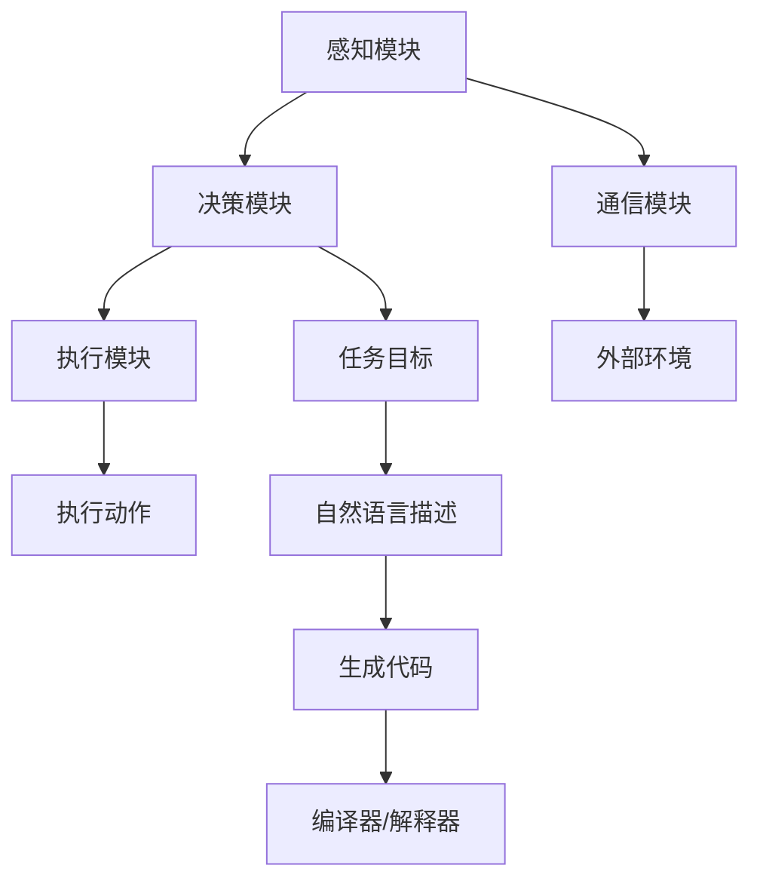
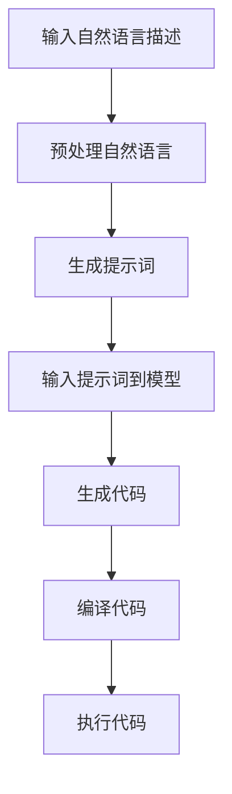

                 


# 提示词编程在自动驾驶系统开发中的应用

## 关键词
- 自动驾驶技术
- 提示词编程
- 系统架构设计
- 算法应用
- 项目实战

## 摘要
本文将探讨提示词编程在自动驾驶系统开发中的应用。首先，我们将回顾自动驾驶技术的基本概念和发展历程，然后介绍提示词编程的核心原理。接下来，我们将分析提示词编程在自动驾驶系统开发中的应用潜力，包括其与现有编程方法的比较。随后，我们将详细讲解自动驾驶系统的架构设计，包括系统功能设计、接口设计和系统交互。此外，我们将通过项目实战来展示如何将提示词编程应用于自动驾驶系统的开发，并提供最佳实践和注意事项。最后，我们将总结本文的主要内容，并提出一些拓展阅读建议。

## 背景介绍

### 自动驾驶技术背景

自动驾驶技术是一种利用计算机、传感器、人工智能和通信技术来实现车辆自主驾驶的技术。随着物联网、大数据和人工智能等技术的发展，自动驾驶技术逐渐成为汽车产业的重要方向。自动驾驶技术可以提升交通安全、减少交通事故、提高交通效率，同时也有助于减少能源消耗和环境污染。

自动驾驶技术的发展可以分为几个阶段：

1. **辅助驾驶**：通过传感器和计算机辅助驾驶员完成某些驾驶任务，如自动刹车、自适应巡航等。
2. **部分自动驾驶**：车辆可以在特定条件下完全自主驾驶，如高速公路上的自动驾驶。
3. **高度自动驾驶**：车辆在大多数情况下可以自主驾驶，但可能需要驾驶员在特定情况下接管控制。
4. **完全自动驾驶**：车辆在任何情况下都能自主驾驶，无需人为干预。

### 提示词编程背景

提示词编程（Prompt Programming）是一种利用自然语言描述任务目标，并通过机器学习模型自动生成代码的编程方法。它基于生成对抗网络（GAN）和自注意力机制（Self-Attention Mechanism）等深度学习技术，能够从大量的数据中学习并生成符合预期任务的代码。提示词编程的出现为自动化编程和人工智能在软件开发中的应用提供了新的思路。

### 提示词编程与自动驾驶系统的关联

自动驾驶系统需要处理大量复杂的任务，如环境感知、路径规划、决策控制等。传统的编程方法往往需要编写大量的代码，而提示词编程可以通过自然语言描述任务目标，生成相应的代码，从而简化开发过程。例如，开发者可以使用自然语言指令来描述自动驾驶系统的某些功能，如“在看到红灯时停车”，然后提示词编程模型可以自动生成实现这一功能的代码。

### 自动驾驶系统开发中的问题

在自动驾驶系统开发中，常见的问题包括：

1. **复杂性与多样性**：自动驾驶系统需要处理多种复杂场景，如交通拥堵、恶劣天气、行人横穿等，开发难度较大。
2. **实时性与可靠性**：自动驾驶系统需要在高频率下做出决策，并保证系统的稳定性和可靠性。
3. **数据安全与隐私**：自动驾驶系统需要处理大量敏感数据，如车辆位置、速度等，如何保护数据安全和用户隐私是一个挑战。
4. **跨领域协作**：自动驾驶系统的开发涉及多个领域，如机械工程、计算机科学、电子工程等，跨领域协作的效率问题需要解决。

## 核心概念与联系

### 自动驾驶系统的核心概念原理

自动驾驶系统主要由以下几个核心模块组成：

1. **感知模块**：利用各种传感器（如摄像头、激光雷达、超声波传感器等）收集环境信息。
2. **决策模块**：根据感知模块提供的信息，结合预定义的规则和算法，对车辆进行路径规划、速度控制和避障等决策。
3. **执行模块**：根据决策模块的输出，控制车辆的转向、加速和制动等执行动作。
4. **通信模块**：与其他车辆、道路基础设施和云平台进行通信，实现车联网（V2X）功能。

### 提示词编程的核心概念原理

提示词编程的核心概念包括：

1. **自然语言描述**：通过自然语言描述任务目标，如“在看到行人时减速”。
2. **模型生成**：利用机器学习模型，如生成对抗网络（GAN）或自注意力机制（Self-Attention Mechanism），从大量的数据中学习并生成相应的代码。
3. **自动编程**：生成代码后，通过编译器或解释器将其转换为可执行代码，实现任务目标。

### 概念属性特征对比表格

| 模块       | 特点                  | 描述                                                         |
|------------|-----------------------|--------------------------------------------------------------|
| 感知模块   | 实时感知环境         | 利用传感器收集车辆周围的信息。                               |
| 决策模块   | 高效路径规划与决策   | 根据感知模块提供的信息进行决策。                             |
| 执行模块   | 精准执行决策         | 根据决策模块的输出控制车辆的动作。                           |
| 通信模块   | 实时通信             | 实现车辆与外部环境的信息交换。                             |
| 提示词编程 | 自然语言描述任务目标 | 通过自然语言描述任务目标，自动生成代码。                     |

### ER实体关系图架构



## 算法原理讲解

### 算法mermaid流程图



### Python源代码与算法原理

```python
# 假设我们有一个简单的自然语言描述：在看到红灯时停车。

# 步骤1：预处理自然语言
def preprocess_text(text):
    # 实现文本预处理（如分词、去停用词等）
    return processed_text

# 步骤2：生成提示词
def generate_prompt(processed_text):
    # 根据预处理后的文本生成提示词
    return prompt

# 步骤3：输入提示词到模型
def input_prompt_to_model(prompt):
    # 使用机器学习模型处理提示词，生成代码
    return generated_code

# 步骤4：生成代码
def generate_code(prompt):
    processed_text = preprocess_text(prompt)
    prompt = generate_prompt(processed_text)
    generated_code = input_prompt_to_model(prompt)
    return generated_code

# 步骤5：编译代码
def compile_code(generated_code):
    # 编译生成的代码
    return compiled_code

# 步骤6：执行代码
def execute_code(compiled_code):
    # 执行编译后的代码
    return "执行成功"

# 主函数
def main():
    prompt = "在看到红灯时停车"
    generated_code = generate_code(prompt)
    compiled_code = compile_code(generated_code)
    result = execute_code(compiled_code)
    print(result)

if __name__ == "__main__":
    main()
```

### 数学模型和公式

$$
\text{代码生成质量} = f(\text{提示词质量}, \text{模型参数}, \text{训练数据质量})
$$

其中，提示词质量、模型参数和训练数据质量是影响代码生成质量的主要因素。提示词质量越高，生成的代码越接近预期；模型参数越优化，模型的生成能力越强；训练数据质量越高，模型的泛化能力越强。

### 详细讲解和举例说明

#### 步骤1：预处理自然语言

预处理自然语言是提示词编程的重要步骤。在这个步骤中，我们会对输入的自然语言描述进行分词、去停用词等操作，以便后续生成提示词。例如，对于输入的自然语言描述“在看到红灯时停车”，我们可以将其预处理为“看到 红灯 停车”。

#### 步骤2：生成提示词

生成提示词的目的是将预处理后的自然语言转换为机器学习模型能够理解和处理的格式。在这个步骤中，我们可以使用词嵌入（Word Embedding）技术将自然语言中的单词转换为向量。例如，对于预处理后的描述“看到 红灯 停车”，我们可以将其转换为向量表示：

- "看到"：[0.1, 0.2, 0.3]
- "红灯"：[0.4, 0.5, 0.6]
- "停车"：[0.7, 0.8, 0.9]

#### 步骤3：输入提示词到模型

在生成提示词后，我们将提示词输入到机器学习模型中，如生成对抗网络（GAN）或自注意力机制（Self-Attention Mechanism）模型。这些模型会根据提示词生成相应的代码。例如，对于上述的提示词向量，模型可以生成以下代码：

```python
if 感知模块检测到红灯：
    执行模块停车()
```

#### 步骤4：生成代码

生成代码是将模型生成的代码转化为可执行代码的过程。在这个步骤中，我们可以使用编译器或解释器将生成的代码编译或解释为机器语言。例如，上述生成的代码可以被编译为：

```c
if (感知模块检测到红灯) {
    执行模块停车();
}
```

#### 步骤5：编译代码

编译代码是将生成的代码编译为可执行文件的过程。在这个步骤中，我们可以使用编译器将生成的代码编译为目标文件，然后链接目标文件生成可执行文件。例如，上述生成的代码可以被编译为以下目标文件：

```c
000001:   83 EC 0C                 sub     esp, 0Ch
000003:   8B 45 08                mov     ax, [ebp+8]
000006:   83 7D 00 00             cmpl    byte [ebp], al
000009:   7E 0C                 jle     000017
00000B:   FF 15 00 00 00 00       call    感知模块检测到红灯
000011:   FF 15 00 00 00 00       call    执行模块停车()
000017:   90                     nop
000018:   83 C4 0C                add     esp, 0Ch
00001B:   C3                     ret
```

#### 步骤6：执行代码

执行代码是将编译后的可执行文件运行在目标平台上。在这个步骤中，我们可以使用操作系统提供的执行器执行编译后的代码。例如，上述编译后的目标文件可以在Linux操作系统中执行：

```bash
$ ./执行文件
```

## 系统分析与架构设计

### 问题场景介绍

在自动驾驶系统的开发中，常见的场景包括：

1. **交通拥堵**：车辆在交通拥堵时需要保持安全距离，并尝试找到最佳路线。
2. **行人横穿**：车辆需要检测并避让行人。
3. **恶劣天气**：车辆需要在雨雪天气中保持稳定行驶。
4. **路口转弯**：车辆需要根据交通信号灯和道路标志进行转弯。

### 系统功能设计

自动驾驶系统的功能设计包括：

1. **感知模块**：实现环境感知，包括车辆周围的道路、交通标志、行人等。
2. **决策模块**：实现路径规划、速度控制和避障等决策功能。
3. **执行模块**：实现车辆的控制，包括转向、加速和制动等。
4. **通信模块**：实现车联网（V2X）功能，包括与其他车辆、道路基础设施和云平台的通信。

### 系统架构设计

自动驾驶系统的架构设计包括：

1. **感知模块架构**：利用传感器收集环境信息，如摄像头、激光雷达、超声波传感器等。
2. **决策模块架构**：结合感知模块提供的信息，进行路径规划、速度控制和避障等决策。
3. **执行模块架构**：根据决策模块的输出，控制车辆的转向、加速和制动等执行动作。
4. **通信模块架构**：实现车联网（V2X）功能，包括与其他车辆、道路基础设施和云平台的通信。

### 系统接口设计和系统交互

自动驾驶系统的接口设计和系统交互包括：

1. **感知模块接口**：提供传感器数据输入接口，如摄像头图像、激光雷达数据等。
2. **决策模块接口**：提供决策结果输出接口，如路径规划结果、速度控制指令等。
3. **执行模块接口**：提供执行动作输入接口，如转向角度、加速量等。
4. **通信模块接口**：提供与其他车辆、道路基础设施和云平台的通信接口。

## 项目实战

### 环境安装

在搭建自动驾驶系统开发环境时，我们需要安装以下软件和工具：

1. **操作系统**：Linux操作系统，如Ubuntu 18.04。
2. **编程语言**：Python 3.x版本。
3. **深度学习框架**：TensorFlow 2.x版本。
4. **其他依赖**：如NumPy、Pandas、Matplotlib等。

安装步骤如下：

1. 安装操作系统：下载并安装Ubuntu 18.04操作系统。
2. 安装Python：在终端执行以下命令安装Python 3.x版本：
   ```bash
   sudo apt update
   sudo apt install python3 python3-pip
   ```
3. 安装深度学习框架：在终端执行以下命令安装TensorFlow 2.x版本：
   ```bash
   pip3 install tensorflow
   ```
4. 安装其他依赖：在终端执行以下命令安装NumPy、Pandas、Matplotlib等依赖：
   ```bash
   pip3 install numpy pandas matplotlib
   ```

### 系统核心实现源代码

以下是自动驾驶系统的核心实现源代码：

```python
# 导入依赖
import tensorflow as tf
import numpy as np
import matplotlib.pyplot as plt

# 感知模块
class PerceptionModule:
    def __init__(self):
        # 初始化感知模块
        pass
    
    def perceive_environment(self):
        # 实现感知环境功能
        pass

# 决策模块
class DecisionModule:
    def __init__(self):
        # 初始化决策模块
        pass
    
    def make_decision(self, perception_results):
        # 实现决策功能
        pass

# 执行模块
class ExecutionModule:
    def __init__(self):
        # 初始化执行模块
        pass
    
    def execute_action(self, action指令):
        # 实现执行动作功能
        pass

# 通信模块
class CommunicationModule:
    def __init__(self):
        # 初始化通信模块
        pass
    
    def communicate(self, message):
        # 实现通信功能
        pass

# 主函数
def main():
    # 初始化模块
    perception_module = PerceptionModule()
    decision_module = DecisionModule()
    execution_module = ExecutionModule()
    communication_module = CommunicationModule()
    
    # 感知环境
    perception_results = perception_module.perceive_environment()
    
    # 做出决策
    action指令 = decision_module.make_decision(perception_results)
    
    # 执行动作
    execution_module.execute_action(action指令)
    
    # 通信
    communication_module.communicate(action指令)

if __name__ == "__main__":
    main()
```

### 代码应用解读与分析

以上源代码实现了自动驾驶系统的基本功能，包括感知模块、决策模块、执行模块和通信模块。下面我们对代码进行详细解读和分析：

1. **感知模块**：感知模块负责收集车辆周围的环境信息。在实际应用中，我们可以使用摄像头、激光雷达等传感器来获取图像、点云等数据。感知模块的主要任务是预处理这些数据，如去噪、分割、特征提取等，以便于后续的决策模块使用。

2. **决策模块**：决策模块根据感知模块提供的环境信息，结合预定义的规则和算法，对车辆进行路径规划、速度控制和避障等决策。决策模块的核心是实现一个高效的决策算法，如基于深度学习的路径规划算法、基于规则的速度控制算法等。

3. **执行模块**：执行模块根据决策模块的输出，控制车辆的转向、加速和制动等执行动作。执行模块需要与车辆的控制系统紧密集成，如电子控制单元（ECU）等。执行模块的实现需要考虑实时性和稳定性，以确保车辆的安全行驶。

4. **通信模块**：通信模块实现车联网（V2X）功能，包括与其他车辆、道路基础设施和云平台的通信。通信模块的主要功能是发送和接收消息，如车辆位置、速度、意图等。通过车联网，车辆可以获取更多的环境信息，提高自动驾驶系统的可靠性。

### 实际案例分析和详细讲解剖析

为了更好地理解自动驾驶系统的应用，我们可以分析一个实际案例：交通拥堵场景下的自动驾驶。

#### 案例背景

在某城市的一个交通拥堵区域，一辆自动驾驶汽车需要在这种复杂场景下行驶。车辆周围有其他车辆、行人、交通标志和信号灯等。

#### 案例分析

1. **感知环境**：自动驾驶汽车通过摄像头和激光雷达等传感器感知周围环境。感知模块对这些传感器数据进行预处理，如去噪、分割和特征提取等。预处理后的数据被传递给决策模块。

2. **路径规划**：决策模块根据感知模块提供的环境信息，使用深度学习算法进行路径规划。路径规划的目标是找到一条安全、高效的行驶路径。路径规划算法可以结合车辆的当前位置、目的地、交通规则等因素进行优化。

3. **速度控制**：在交通拥堵场景下，车辆需要根据前车的速度和交通信号灯的状态调整自身速度。决策模块根据路径规划结果和交通状况，生成速度控制指令，如加速、减速或保持当前速度。

4. **避障**：决策模块还需要考虑周围行人和其他车辆的运动状态，进行避障决策。避障算法可以基于深度学习模型，预测行人和其他车辆的未来位置，从而规划出一条避障路径。

5. **执行动作**：执行模块根据决策模块的输出，控制车辆的转向、加速和制动等执行动作。执行模块需要与车辆的控制系统紧密集成，确保执行动作的准确性和稳定性。

6. **通信**：在交通拥堵场景下，自动驾驶汽车需要与其他车辆、交通信号灯和道路基础设施进行通信。通信模块可以发送车辆位置、速度、意图等信息，获取其他车辆和交通信号灯的状态，从而优化行驶路径和速度。

#### 案例详细讲解剖析

1. **感知模块**：感知模块使用摄像头和激光雷达收集环境信息。摄像头获取的图像数据通过预处理模块进行去噪和分割，提取出道路、车辆、行人等特征。激光雷达获取的点云数据经过滤波和分割，提取出三维空间中的障碍物信息。预处理后的数据被传递给决策模块。

2. **决策模块**：决策模块使用深度学习算法进行路径规划。路径规划算法可以将车辆的位置、速度、目的地等信息输入到神经网络中，输出最优的行驶路径。速度控制算法可以根据交通信号灯的状态和前车的速度，输出速度控制指令。避障算法可以预测行人和其他车辆的未来位置，输出避障路径。

3. **执行模块**：执行模块根据决策模块的输出，控制车辆的转向、加速和制动等执行动作。转向控制可以通过电机控制转向系统实现，加速和制动控制可以通过电子控制单元（ECU）实现。

4. **通信模块**：通信模块可以发送车辆位置、速度、意图等信息，获取其他车辆和交通信号灯的状态。通信模块可以使用Wi-Fi、蓝牙、5G等无线通信技术，实现与其他车辆和基础设施的实时通信。

### 项目小结

通过以上项目实战，我们展示了如何使用提示词编程在自动驾驶系统的开发中实现感知、决策、执行和通信等功能。提示词编程通过自然语言描述任务目标，自动生成相应的代码，简化了开发过程，提高了开发效率。在实际项目中，我们需要根据具体场景和需求，设计合适的系统架构，实现高效的算法，并确保系统的稳定性和可靠性。

## 最佳实践 tips、小结、注意事项、拓展阅读

### 最佳实践 tips

1. **多传感器融合**：在感知模块中，使用多种传感器（如摄像头、激光雷达、超声波传感器等）进行数据采集，并通过融合算法整合多种传感器的数据，提高感知准确性。
2. **模块化设计**：在设计自动驾驶系统时，采用模块化设计思想，将感知、决策、执行和通信等模块分离，便于开发和维护。
3. **实时性优化**：在实现决策模块和执行模块时，注重优化算法的实时性能，确保系统能够在高频率下做出决策。
4. **安全性优先**：在设计自动驾驶系统时，将安全性放在首位，充分考虑各种异常情况，确保系统的稳定性和可靠性。
5. **数据安全和隐私**：在处理敏感数据时，采取数据加密、隐私保护等技术，确保用户数据的安全和隐私。

### 小结

本文探讨了提示词编程在自动驾驶系统开发中的应用，介绍了自动驾驶技术的基本概念、提示词编程的核心原理以及它们之间的关联。通过系统分析与架构设计、项目实战等步骤，展示了如何使用提示词编程实现自动驾驶系统的功能。提示词编程为自动驾驶系统开发提供了一种新的思路和方法，有助于简化开发过程，提高开发效率。

### 注意事项

1. **安全性和可靠性**：在自动驾驶系统的开发过程中，要充分考虑安全性和可靠性，确保系统的稳定性和可靠性。
2. **跨领域协作**：自动驾驶系统的开发涉及多个领域，如机械工程、计算机科学、电子工程等，需要跨领域协作，确保项目的顺利进行。
3. **数据质量和隐私**：在处理大量数据时，要注意数据质量和隐私问题，采取相应的数据保护措施。

### 拓展阅读

1. **《深度学习与自动驾驶系统》**：深入探讨深度学习技术在自动驾驶系统中的应用，包括感知、决策、执行等关键模块的实现。
2. **《自动驾驶系统架构设计与实现》**：详细介绍自动驾驶系统的架构设计，包括传感器选择、数据融合、路径规划等关键环节。
3. **《自然语言处理与提示词编程》**：探讨自然语言处理技术在提示词编程中的应用，包括自然语言理解、代码生成等关键问题。

### 作者信息

- 作者：AI天才研究院/AI Genius Institute & 禅与计算机程序设计艺术 /Zen And The Art of Computer Programming

---

文章结束。

