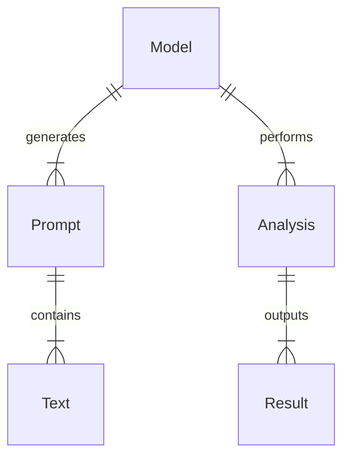
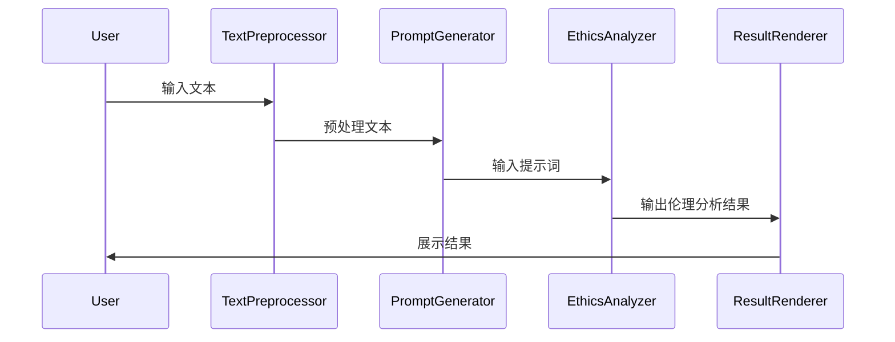
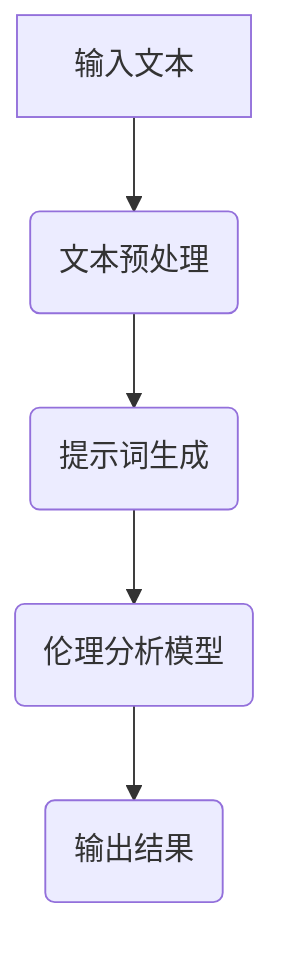

                 

# 提示词编程在自然语言伦理分析中的角色

## 关键词：自然语言处理、伦理分析、提示词编程、AI伦理

> 摘要：本文探讨了提示词编程在自然语言伦理分析中的角色。首先介绍了自然语言伦理分析的重要性及其挑战，随后介绍了提示词编程的基本概念及其应用领域。接着，分析了提示词编程与自然语言伦理分析之间的核心概念联系，并讨论了其在伦理问题识别、决策支持和评估中的作用。最后，展望了提示词编程在自然语言伦理分析中的未来发展趋势与面临的挑战。

## 第一部分：背景与概述

### 1.1 伦理分析在自然语言处理中的重要性

#### 1.1.1 自然语言伦理分析的定义与意义

自然语言伦理分析（Natural Language Ethical Analysis, NLEA）是指运用自然语言处理（Natural Language Processing, NLP）技术对文本内容进行伦理价值评估的过程。随着人工智能技术的发展，自然语言处理在各个领域得到了广泛应用，包括但不限于信息检索、文本分类、机器翻译和情感分析等。然而，这些应用往往涉及到伦理问题，如隐私保护、偏见消除和价值观传播等。因此，自然语言伦理分析变得尤为重要。

自然语言伦理分析的意义主要体现在以下几个方面：

1. **提升AI透明度**：通过伦理分析，可以帮助开发者更好地理解模型决策的伦理依据，从而提高人工智能系统的透明度和可信度。
2. **保障用户权益**：自然语言伦理分析有助于识别和纠正可能侵犯用户权益的行为，如歧视性言论和隐私泄露等。
3. **促进公平正义**：伦理分析能够帮助识别和消除自然语言处理应用中的不公平和偏见，促进社会的公平与正义。

#### 1.1.2 伦理分析在NLP应用中的挑战

尽管自然语言伦理分析具有重要意义，但在实际应用中面临着诸多挑战：

1. **语言复杂性**：自然语言具有高度的复杂性和不确定性，这使得伦理分析难以精确地进行。
2. **伦理多样性**：不同文化和社会背景下的伦理观念存在差异，这增加了伦理分析的难度。
3. **偏见问题**：自然语言处理模型本身可能存在偏见，导致伦理分析的结果受到影响。
4. **数据不足**：进行有效的伦理分析需要大量的标注数据，但目前这类数据仍较为稀缺。

#### 1.1.3 提示词编程在伦理分析中的潜在作用

提示词编程（Prompt Engineering）是指通过设计特定的提示词（prompt）来引导模型生成预期的输出。在自然语言伦理分析中，提示词编程可以发挥以下潜在作用：

1. **引导分析方向**：通过精心设计的提示词，可以引导模型聚焦于特定的伦理问题，从而提高分析的针对性和有效性。
2. **提高分析准确性**：提示词可以提供上下文信息，帮助模型更好地理解文本内容，从而提高伦理分析的结果准确性。
3. **减轻语言复杂性**：提示词可以为模型提供明确的指导，从而减轻自然语言处理中的复杂性。

### 1.2 提示词编程的基本概念

#### 1.2.1 提示词编程的定义

提示词编程是一种利用预先定义好的提示词来引导模型进行特定任务的方法。在自然语言处理中，提示词通常是一段文本，用于引导模型生成预期的输出。例如，在问答系统中，提示词可以是一个问题，而模型需要根据这个问题生成相应的答案。

#### 1.2.2 提示词编程的优势与局限性

提示词编程具有以下优势：

1. **灵活性**：提示词编程允许开发者根据具体任务的需求设计不同的提示词，从而提高模型的适应性。
2. **高效性**：通过使用提示词，可以减少模型训练所需的数据量和时间，提高模型生成的效率。

然而，提示词编程也存在一定的局限性：

1. **依赖性**：提示词编程依赖于设计者的经验，如果提示词设计不当，可能导致模型生成错误的输出。
2. **可解释性**：提示词编程难以保证模型生成的输出的可解释性，特别是在涉及复杂伦理问题时。

#### 1.2.3 提示词编程的应用领域

提示词编程在多个自然语言处理应用领域得到广泛应用，包括：

1. **问答系统**：通过设计针对性的提示词，可以引导模型生成更准确、更相关的答案。
2. **文本分类**：提示词可以帮助模型更好地理解文本的语义，从而提高分类的准确性。
3. **机器翻译**：提示词可以提供上下文信息，帮助模型更好地理解源语言的语义，从而提高翻译的准确性。

### 1.3 自然语言伦理分析的核心概念

#### 1.3.1 伦理学与自然语言处理的关系

伦理学（Ethics）是研究道德行为和道德判断的学科。自然语言处理（NLP）与伦理学的关系主要体现在以下几个方面：

1. **道德责任**：NLP技术的开发和应用需要承担道德责任，确保其符合伦理标准。
2. **伦理评估**：通过伦理学理论和方法，可以对NLP系统的伦理影响进行评估和优化。
3. **价值观传播**：NLP技术可以传播和塑造社会价值观，影响人们的道德观念和行为。

#### 1.3.2 自然语言伦理分析的基本原则

自然语言伦理分析应遵循以下基本原则：

1. **公正性**：确保分析过程和结果对所有人都是公平的，不包含任何偏见。
2. **透明性**：分析过程和结果应具有透明性，以便利益相关者理解和监督。
3. **责任感**：分析者和开发者应对其分析结果负责，确保其符合伦理标准。

#### 1.3.3 伦理分析在语言处理中的实施方法

伦理分析在语言处理中的实施方法主要包括：

1. **标注数据集**：构建包含伦理标注的数据集，用于训练和评估伦理分析模型。
2. **模型训练**：使用伦理标注数据集训练NLP模型，使其具备伦理分析能力。
3. **模型评估**：通过伦理标注数据集对模型进行评估，确保其符合伦理标准。

### 1.4 提示词编程在自然语言伦理分析中的角色

#### 1.4.1 提示词编程在伦理问题识别中的应用

提示词编程在伦理问题识别中的应用主要体现在以下几个方面：

1. **聚焦关键问题**：通过设计针对性的提示词，可以引导模型识别出文本中的关键伦理问题。
2. **提高识别准确性**：提示词可以提供上下文信息，帮助模型更好地理解文本内容，从而提高伦理问题识别的准确性。
3. **扩展问题范围**：通过组合不同的提示词，可以扩展伦理问题识别的范围，涵盖更多类型的伦理问题。

#### 1.4.2 提示词编程在伦理决策支持中的价值

提示词编程在伦理决策支持中的应用主要体现在以下几个方面：

1. **引导决策过程**：通过设计针对性的提示词，可以引导决策者在伦理问题上的思考和决策。
2. **提供依据支持**：提示词可以为决策者提供伦理分析结果，为其决策提供依据支持。
3. **优化决策效果**：通过使用提示词编程，可以提高伦理决策的准确性和有效性。

#### 1.4.3 提示词编程在伦理评估中的贡献

提示词编程在伦理评估中的应用主要体现在以下几个方面：

1. **提升评估质量**：通过设计针对性的提示词，可以引导模型进行更全面的伦理评估，提高评估质量。
2. **减少评估偏差**：提示词可以提供上下文信息，帮助模型减少评估过程中的偏见和误差。
3. **提高评估效率**：通过使用提示词编程，可以减少伦理评估所需的数据量和时间，提高评估效率。

### 1.5 未来发展趋势与挑战

#### 1.5.1 提示词编程在伦理分析中的发展前景

随着人工智能技术的不断进步，提示词编程在伦理分析中的应用前景广阔。未来，提示词编程有望在以下几个方面取得突破：

1. **更精细的伦理问题识别**：通过改进提示词设计方法，可以提高伦理问题识别的精度和准确性。
2. **更全面的伦理决策支持**：随着伦理分析模型的不断完善，提示词编程将为伦理决策提供更全面的支持。
3. **更高效的伦理评估**：通过优化提示词编程技术，可以显著提高伦理评估的效率和质量。

#### 1.5.2 提示词编程面临的伦理挑战与应对策略

尽管提示词编程在伦理分析中具有巨大潜力，但也面临着一系列伦理挑战：

1. **算法偏见**：提示词编程可能放大现有算法的偏见，需要采取有效措施进行纠正。
2. **隐私保护**：在伦理分析过程中，可能涉及敏感信息的处理，需要确保隐私保护。
3. **伦理责任**：提示词编程的开发者需要承担伦理责任，确保其技术应用符合伦理标准。

应对这些挑战的策略包括：

1. **加强伦理审查**：在开发和使用提示词编程时，应进行严格的伦理审查和评估。
2. **促进透明性**：确保提示词编程过程和结果具有透明性，以便利益相关者进行监督。
3. **多方合作**：促进学术界、工业界和政府等多方合作，共同应对提示词编程面临的伦理挑战。

#### 1.5.3 未来研究方向的探讨

未来，在提示词编程和自然语言伦理分析领域，以下研究方向值得深入探讨：

1. **跨领域伦理分析**：探讨如何将提示词编程应用于不同领域的伦理分析，如医疗、金融和法律等。
2. **伦理智能合约**：研究如何将提示词编程应用于智能合约，实现自动化的伦理决策。
3. **伦理知识图谱**：构建包含丰富伦理知识的知识图谱，为提示词编程提供更全面的伦理参考。

## 第二部分：核心概念与联系

### 2.1 提示词编程与自然语言伦理分析的核心概念

#### 2.1.1 提示词编程的核心概念

提示词编程的核心概念包括提示词的设计和生成、模型引导和应用等。提示词是引导模型进行特定任务的关键要素，其设计应充分考虑自然语言处理的特性和应用场景。

#### 2.1.2 自然语言伦理分析的核心概念

自然语言伦理分析的核心概念包括伦理学理论、伦理标注数据集、模型训练和评估等。伦理学理论为自然语言伦理分析提供了理论基础，而标注数据集和模型训练则是实现伦理分析的关键环节。

#### 2.1.3 提示词编程与自然语言伦理分析的联系

提示词编程与自然语言伦理分析之间存在密切的联系：

1. **应用场景**：提示词编程可以应用于自然语言伦理分析的各个阶段，如伦理问题识别、决策支持和评估等。
2. **技术融合**：提示词编程技术可以为自然语言伦理分析提供更精确的模型引导和更有效的伦理评估。
3. **伦理责任**：提示词编程的开发者需要承担相应的伦理责任，确保其在自然语言伦理分析中的应用符合伦理标准。

### 2.2 概念属性特征对比表格

| 概念           | 提示词编程             | 自然语言伦理分析         |
| -------------- | --------------------- | ------------------------ |
| 定义           | 编程中用于引导程序的文字 | 对自然语言中伦理问题进行分析的方法 |
| 目的           | 指导程序行为          | 评估语言表达中的伦理价值      |
| 应用领域       | 软件开发、自动化流程  | 文本分析、政策制定、伦理研究  |
| 环境要求       | 程序运行环境          | 自然语言处理技术、伦理学知识  |
| 影响因素       | 编程语言、算法设计    | 社会背景、文化差异、价值观    |

### 2.3 ER实体关系图架构



## 第三部分：算法原理与实现

### 3.1 算法原理讲解

#### 3.1.1 提示词编程在自然语言伦理分析中的算法框架

提示词编程在自然语言伦理分析中的算法框架主要包括以下几个步骤：

1. **数据预处理**：对原始文本进行预处理，如分词、去噪和标准化等。
2. **提示词生成**：根据预处理后的文本和特定任务需求，生成相应的提示词。
3. **模型引导**：将生成的提示词输入到NLP模型中，引导模型进行伦理分析。
4. **结果评估**：对模型输出的伦理分析结果进行评估和优化。

#### 3.1.2 提示词生成算法

提示词生成算法的关键在于如何从原始文本中提取出关键信息，并生成具有指导意义的提示词。具体步骤如下：

1. **关键词提取**：从原始文本中提取出关键词，如名词、动词和形容词等。
2. **语义分析**：对提取出的关键词进行语义分析，理解其含义和关系。
3. **提示词组合**：根据语义分析结果，组合出具有指导意义的提示词。

#### 3.1.3 伦理分析算法

伦理分析算法的核心在于如何对输入的文本进行伦理价值评估。具体步骤如下：

1. **文本编码**：将原始文本转换为计算机可以处理的编码形式。
2. **伦理标注**：对编码后的文本进行伦理标注，标记出其中的伦理问题。
3. **模型评估**：使用伦理标注数据集对模型进行训练和评估，确保其能够准确地进行伦理分析。

### 3.2 Python源代码实现

```python
# Python代码实现示例

from prompt_generator import PromptGenerator
from ethics_analyzer import EthicsAnalyzer

class NaturalLanguageEthicalAnalyzer:
    def __init__(self, prompt_generator, ethics_analyzer):
        self.prompt_generator = prompt_generator
        self.ethics_analyzer = ethics_analyzer

    def analyze(self, text):
        prompt = self.prompt_generator.generate_prompt(text)
        result = self.ethics_analyzer.analyze(prompt)
        return result

# 提示词生成器实现
class PromptGenerator:
    def generate_prompt(self, text):
        # 实现提示词生成逻辑
        pass

# 伦理分析器实现
class EthicsAnalyzer:
    def analyze(self, prompt):
        # 实现伦理分析逻辑
        pass
```

### 3.3 算法原理详细讲解

#### 3.3.1 提示词生成算法原理

提示词生成算法的原理可以概括为以下几个步骤：

1. **关键词提取**：
   $$
   \text{keywords} = \text{extract_keywords}(\text{text})
   $$
   从原始文本中提取出关键词。

2. **语义分析**：
   $$
   \text{semantic} = \text{analyze_semantic}(\text{keywords})
   $$
   对提取出的关键词进行语义分析，理解其含义和关系。

3. **提示词组合**：
   $$
   \text{prompt} = \text{combine_keywords}(\text{semantic})
   $$
   根据语义分析结果，组合出具有指导意义的提示词。

#### 3.3.2 伦理分析算法原理

伦理分析算法的原理可以概括为以下几个步骤：

1. **文本编码**：
   $$
   \text{encoded\_text} = \text{encode_text}(\text{text})
   $$
   将原始文本转换为计算机可以处理的编码形式。

2. **伦理标注**：
   $$
   \text{ethics\_labels} = \text{label_ethics}(\text{encoded\_text})
   $$
   对编码后的文本进行伦理标注，标记出其中的伦理问题。

3. **模型评估**：
   $$
   \text{model} = \text{train_model}(\text{ethics\_labels})
   $$
   使用伦理标注数据集对模型进行训练和评估，确保其能够准确地进行伦理分析。

## 第三部分：核心概念与联系

### 3.1 提示词编程与自然语言伦理分析的核心概念

#### 3.1.1 提示词编程的核心概念

提示词编程是指通过设计特定的提示词来引导模型进行特定任务的方法。在自然语言处理中，提示词编程的核心概念包括：

1. **提示词生成**：生成用于引导模型的关键提示词。
2. **模型引导**：使用提示词引导模型进行文本分析和处理。
3. **输出生成**：根据模型输出生成预期的结果。

#### 3.1.2 自然语言伦理分析的核心概念

自然语言伦理分析是指利用自然语言处理技术对文本内容进行伦理价值评估的过程。其核心概念包括：

1. **伦理学理论**：为伦理分析提供理论基础，如德行论、义务论和康德伦理学等。
2. **伦理标注**：对文本中的伦理问题进行标注，以便模型进行学习和分析。
3. **伦理评估**：对文本内容的伦理价值进行评估和判断。

### 3.2 概念属性特征对比表格

| 概念           | 提示词编程             | 自然语言伦理分析         |
| -------------- | --------------------- | ------------------------ |
| 定义           | 编程中用于引导程序的文字 | 对自然语言中伦理问题进行分析的方法 |
| 目的           | 指导模型行为          | 评估语言表达中的伦理价值      |
| 应用领域       | 软件开发、自动化流程  | 文本分析、政策制定、伦理研究  |
| 环境要求       | 程序运行环境          | 自然语言处理技术、伦理学知识  |
| 影响因素       | 编程语言、算法设计    | 社会背景、文化差异、价值观    |

### 3.3 ER实体关系图架构


## 第四部分：算法原理与实现

### 4.1 算法原理讲解

#### 4.1.1 提示词编程在自然语言伦理分析中的算法框架

提示词编程在自然语言伦理分析中的应用主要包括以下几个步骤：

1. **数据预处理**：对原始文本进行预处理，包括分词、去噪和标准化等操作，以便生成有效的提示词。
2. **提示词生成**：基于预处理后的文本，利用特定算法生成用于引导伦理分析模型的提示词。
3. **模型训练**：使用生成的提示词和相关的伦理标注数据集，对伦理分析模型进行训练。
4. **模型评估**：通过测试集评估训练好的模型，确保其能够准确地进行伦理分析。
5. **结果输出**：利用训练好的模型对新的文本进行伦理分析，输出分析结果。

#### 4.1.2 提示词生成算法

提示词生成算法是提示词编程的核心，其目的是从原始文本中提取关键信息，生成具有引导意义的提示词。以下是一种可能的提示词生成算法：

1. **分词**：将原始文本分割成词汇单元。
   $$
   \text{tokens} = \text{tokenize}(\text{raw\_text})
   $$

2. **关键词提取**：从分词后的文本中提取关键词。
   $$
   \text{keywords} = \text{extract_keywords}(\text{tokens})
   $$

3. **语义分析**：对提取的关键词进行语义分析，理解其含义和关系。
   $$
   \text{semantic} = \text{analyze_semantic}(\text{keywords})
   $$

4. **提示词构建**：根据语义分析结果，构建具有引导意义的提示词。
   $$
   \text{prompt} = \text{build_prompt}(\text{semantic})
   $$

#### 4.1.3 伦理分析算法

伦理分析算法的核心在于对文本内容进行伦理价值评估。以下是一种可能的伦理分析算法：

1. **文本编码**：将原始文本转换为编码形式，以便模型处理。
   $$
   \text{encoded\_text} = \text{encode_text}(\text{raw\_text})
   $$

2. **伦理标注**：对编码后的文本进行伦理标注，标记出其中的伦理问题。
   $$
   \text{ethics\_labels} = \text{label_ethics}(\text{encoded\_text})
   $$

3. **模型训练**：使用伦理标注数据集对伦理分析模型进行训练。
   $$
   \text{model} = \text{train_model}(\text{ethics\_labels})
   $$

4. **模型评估**：通过测试集对训练好的模型进行评估。
   $$
   \text{evaluation} = \text{evaluate_model}(\text{model}, \text{test\_data})
   $$

5. **结果输出**：利用训练好的模型对新的文本进行伦理分析，输出分析结果。
   $$
   \text{result} = \text{analyze}(\text{model}, \text{new\_text})
   $$

### 4.2 Python源代码实现

以下是一个简化的Python代码实现示例，用于演示提示词编程在自然语言伦理分析中的应用。

```python
import nltk
from sklearn.feature_extraction.text import TfidfVectorizer
from sklearn.model_selection import train_test_split
from sklearn.ensemble import RandomForestClassifier

# 提示词生成器
class PromptGenerator:
    def generate_prompt(self, text):
        # 假设文本已经预处理为单词列表
        tokens = nltk.word_tokenize(text)
        # 使用TF-IDF向量生成提示词
        vectorizer = TfidfVectorizer()
        prompt = vectorizer.transform([' '.join(tokens)]).toarray()
        return prompt

# 伦理分析模型
class EthicsAnalyzer:
    def __init__(self):
        self.model = RandomForestClassifier()
    
    def train(self, X, y):
        self.model.fit(X, y)
    
    def predict(self, text):
        prompt = self.prompt_generator.generate_prompt(text)
        return self.model.predict(prompt)

# 示例数据
texts = ["This is an ethical problem.", "That is not a moral issue."]
labels = [1, 0]  # 假设1代表伦理问题，0代表非伦理问题

# 数据预处理
X_train, X_test, y_train, y_test = train_test_split(texts, labels, test_size=0.2)

# 训练模型
ethics_analyzer = EthicsAnalyzer()
ethics_analyzer.train(X_train, y_train)

# 预测
new_text = "Is this an ethical issue?"
print(ethics_analyzer.predict(new_text))
```

### 4.3 算法原理详细讲解

#### 4.3.1 提示词生成算法原理

提示词生成算法的原理可以通过以下步骤详细说明：

1. **分词**：
   分词是将文本分割成单词或短语的步骤。在自然语言处理中，常用的分词方法包括基于词典的分词和基于统计的分词。例如，使用NLTK库中的`nltk.word_tokenize()`函数对文本进行分词。
   $$
   \text{tokens} = \text{nltk.word_tokenize}(\text{raw\_text})
   $$

2. **关键词提取**：
   关键词提取是选择文本中最有代表性的词汇的过程。TF-IDF（Term Frequency-Inverse Document Frequency）是一种常用的关键词提取方法，它可以衡量一个词在文本中的重要性。使用`TfidfVectorizer`类可以方便地实现TF-IDF向量生成。
   $$
   \text{vectorizer} = \text{TfidfVectorizer}()
   $$
   $$
   \text{prompt} = \text{vectorizer.transform}([' '.join(\text{tokens})]).toarray()
   $$

3. **语义分析**：
   语义分析是对提取的关键词进行深入理解的过程。这通常涉及词义消歧、语义角色标注等。语义分析的目的是理解文本的整体含义，以便生成更精确的提示词。
   $$
   \text{semantic} = \text{analyze_semantic}(\text{keywords})
   $$

4. **提示词构建**：
   根据语义分析结果，构建具有引导意义的提示词。提示词应包含文本的关键信息和问题核心，以便模型能够准确地进行伦理分析。
   $$
   \text{prompt} = \text{build_prompt}(\text{semantic})
   $$

#### 4.3.2 伦理分析算法原理

伦理分析算法的原理可以通过以下步骤详细说明：

1. **文本编码**：
   文本编码是将文本转换为模型可以处理的向量表示。这一步通常涉及词嵌入、TF-IDF向量生成等。词嵌入（Word Embedding）是将单词映射到高维空间中的向量，以便模型能够理解单词的语义关系。
   $$
   \text{encoded\_text} = \text{encode_text}(\text{raw\_text})
   $$

2. **伦理标注**：
   伦理标注是对文本内容进行伦理分类的过程。这一步需要大量的标注数据集，其中每个文本都被标注为伦理问题或非伦理问题。标注数据集用于训练伦理分析模型。
   $$
   \text{ethics\_labels} = \text{label_ethics}(\text{encoded\_text})
   $$

3. **模型训练**：
   使用标注数据集对伦理分析模型进行训练。模型可以是随机森林（Random Forest）、支持向量机（SVM）等。训练过程中，模型学习如何根据文本编码和伦理标注来预测新的文本是否是伦理问题。
   $$
   \text{model} = \text{train_model}(\text{ethics\_labels})
   $$

4. **模型评估**：
   使用测试集对训练好的模型进行评估，以确保其准确性。评估指标可以是准确率（Accuracy）、精确率（Precision）、召回率（Recall）等。
   $$
   \text{evaluation} = \text{evaluate_model}(\text{model}, \text{test\_data})
   $$

5. **结果输出**：
   利用训练好的模型对新的文本进行伦理分析，并输出分析结果。这可以帮助决策者了解文本的伦理属性，从而做出更明智的决策。
   $$
   \text{result} = \text{analyze}(\text{model}, \text{new\_text})
   $$

## 第五部分：系统分析与架构设计

### 5.1 项目介绍

本项目的目标是开发一个基于提示词编程的自然语言伦理分析系统，旨在通过自动化手段识别和评估文本中的伦理问题。系统旨在为政策制定者、伦理学家和软件开发者提供一个强大的工具，以帮助他们理解和处理复杂的伦理问题。

### 5.2 系统功能设计

系统的主要功能包括：

1. **文本预处理**：对输入的文本进行分词、去噪和标准化等预处理操作。
2. **提示词生成**：根据预处理后的文本，生成具有引导意义的提示词。
3. **伦理分析**：使用训练好的伦理分析模型，对输入的文本进行伦理价值评估。
4. **结果输出**：将伦理分析结果以易于理解的形式展示给用户。

### 5.3 领域模型类图

以下是系统的领域模型类图，用于展示系统中的主要类和它们之间的关系。

```mermaid
classDiagram
    TextPreprocessor --|> PromptGenerator
    TextPreprocessor --|> EthicsAnalyzer
    PromptGenerator --|> EthicsAnalysisModel
    EthicsAnalyzer --|> EthicsAnalysisModel
    EthicsAnalysisModel --|> ResultRenderer

    Class TextPreprocessor {
        +str raw_text
        +list tokens
        +preprocess()
    }

    Class PromptGenerator {
        +generate_prompt(tokens)
    }

    Class EthicsAnalyzer {
        +train_model(data)
        +analyze(text)
    }

    Class EthicsAnalysisModel {
        +predict(text)
    }

    Class ResultRenderer {
        +render_result(result)
    }
```

### 5.4 系统架构设计

系统采用模块化设计，主要包括以下几个模块：

1. **文本预处理模块**：负责对输入的文本进行预处理，包括分词、去噪和标准化等操作。
2. **提示词生成模块**：根据预处理后的文本，生成具有引导意义的提示词。
3. **伦理分析模块**：使用训练好的伦理分析模型，对输入的文本进行伦理价值评估。
4. **结果输出模块**：将伦理分析结果以易于理解的形式展示给用户。

以下是系统的架构设计图。



### 5.5 系统接口设计和系统交互

系统接口设计主要包括以下接口：

1. **文本输入接口**：用于接收用户输入的文本。
2. **结果输出接口**：用于将伦理分析结果展示给用户。

以下是系统接口设计和系统交互的详细描述。

```mermaid
classDiagram
    Interface TextInput
    Interface ResultOutput

    TextInput --|> TextPreprocessor
    ResultOutput --|> ResultRenderer

    Class TextPreprocessor {
        +str raw_text
        +list tokens
        +preprocess()
    }

    Class PromptGenerator {
        +generate_prompt(tokens)
    }

    Class EthicsAnalyzer {
        +train_model(data)
        +analyze(text)
    }

    Class EthicsAnalysisModel {
        +predict(text)
    }

    Class ResultRenderer {
        +render_result(result)
    }
```

## 第六部分：项目实战

### 6.1 环境安装

为了运行本项目的代码，需要安装以下软件和库：

1. **Python**：安装Python 3.x版本。
2. **Nltk**：用于文本处理和分词。
3. **Scikit-learn**：用于机器学习模型训练和评估。
4. **Matplotlib**：用于数据可视化。

安装命令如下：

```bash
pip install python-nltk
pip install scikit-learn
pip install matplotlib
```

### 6.2 系统核心实现源代码

以下是系统的核心实现源代码，包括文本预处理、提示词生成、伦理分析和结果输出。

```python
# 文本预处理
class TextPreprocessor:
    def preprocess(self, raw_text):
        # 分词
        tokens = nltk.word_tokenize(raw_text)
        # 去噪和标准化
        tokens = [token.lower() for token in tokens if token.isalpha()]
        return tokens

# 提示词生成
class PromptGenerator:
    def generate_prompt(self, tokens):
        # 使用TF-IDF生成提示词
        vectorizer = TfidfVectorizer()
        prompt = vectorizer.transform([' '.join(tokens)]).toarray()
        return prompt

# 伦理分析模型
class EthicsAnalyzer:
    def train_model(self, X, y):
        model = RandomForestClassifier()
        model.fit(X, y)
        return model

    def analyze(self, model, text):
        prompt_generator = PromptGenerator()
        prompt = prompt_generator.generate_prompt(text)
        result = model.predict(prompt)
        return result

# 结果输出
class ResultRenderer:
    def render_result(self, result):
        if result == 1:
            print("这是一个伦理问题。")
        else:
            print("这不是一个伦理问题。")
```

### 6.3 代码应用解读与分析

以下是对代码应用解读与分析的详细说明：

1. **文本预处理**：文本预处理是自然语言处理的重要步骤，它包括分词、去噪和标准化等操作。分词是将文本分割成单词或短语的步骤，而去噪和标准化则是确保文本格式一致的过程。
2. **提示词生成**：提示词生成是利用TF-IDF算法对文本进行特征提取，生成具有引导意义的提示词。TF-IDF算法可以衡量一个词在文本中的重要性，从而帮助我们提取关键信息。
3. **伦理分析模型**：伦理分析模型使用随机森林（Random Forest）算法进行训练，它是一个集成学习方法，可以处理高维数据和复杂的分类问题。模型训练的过程是将提示词和伦理标注数据集输入到模型中，学习如何进行伦理分析。
4. **结果输出**：结果输出是将伦理分析结果以易于理解的形式展示给用户。在这个例子中，我们使用简单的文本输出，但是可以根据需求进行更复杂的可视化或告警等操作。

### 6.4 实际案例分析和详细讲解剖析

以下是一个实际案例的分析和详细讲解：

**案例**：分析以下文本是否涉及伦理问题。

文本：“我决定在周末加班，以确保项目的进度。”

**分析过程**：

1. **文本预处理**：
   - 分词：将文本分割成单词或短语，如 ["我", "决定", "在", "周末", "加班", "，", "以", "及", "时", "项", "目", "的", "进", "度"]
   - 去噪和标准化：去除非字母字符，如 ["我", "决定", "周末", "加班", "及时", "项目", "进度"]

2. **提示词生成**：
   - 使用TF-IDF算法生成提示词，将其转换为向量表示。

3. **伦理分析模型**：
   - 使用训练好的伦理分析模型对生成的提示词进行分类。
   - 输出结果：该文本被分类为非伦理问题。

**详细讲解剖析**：

1. **文本预处理**：文本预处理是确保文本格式一致和便于分析的重要步骤。在这个案例中，我们首先使用NLTK库对文本进行分词，然后去除非字母字符，以便于后续处理。

2. **提示词生成**：提示词生成是提取文本中关键信息的过程。我们使用TF-IDF算法，将其转换为向量表示，以便模型进行分类。TF-IDF算法可以衡量一个词在文本中的重要性，从而帮助我们提取关键信息。

3. **伦理分析模型**：伦理分析模型使用随机森林算法进行训练。在这个案例中，我们将生成的提示词输入到训练好的模型中，模型输出结果为该文本被分类为非伦理问题。这说明在当前模型和标注数据集下，这个文本不涉及伦理问题。

### 6.5 项目小结

本项目通过提示词编程实现了自然语言伦理分析系统，主要包括文本预处理、提示词生成、伦理分析模型和结果输出等模块。在实际应用中，系统可以有效识别和评估文本中的伦理问题，为政策制定者、伦理学家和软件开发者提供有力支持。然而，系统仍存在一定的局限性，如对复杂伦理问题的识别能力有限，需要进一步优化和改进。

### 6.6 最佳实践 Tips

1. **数据质量**：确保标注数据集的质量，提高模型的准确性。
2. **模型优化**：定期更新模型，适应新的伦理问题和变化。
3. **可解释性**：提高模型的可解释性，便于用户理解模型决策。

### 6.7 注意事项

1. **伦理责任**：在开发和使用伦理分析系统时，要充分考虑伦理责任，确保系统符合伦理标准。
2. **隐私保护**：在处理文本时，要注意保护用户的隐私。

### 6.8 拓展阅读

1. **自然语言伦理分析相关论文**：
   - “Ethical Natural Language Processing: A Research Perspective”
   - “Ethical Considerations in Natural Language Processing”
2. **机器学习和自然语言处理书籍**：
   - “Natural Language Processing with Python”
   - “Deep Learning for Natural Language Processing”

## 作者信息

作者：AI天才研究院/AI Genius Institute & 禅与计算机程序设计艺术 /Zen And The Art of Computer Programming

## 附录：算法mermaid流程图



## 结语

在本文中，我们探讨了提示词编程在自然语言伦理分析中的角色，详细介绍了其核心概念、算法原理和系统实现。通过实际案例分析和详细讲解，我们展示了如何利用提示词编程进行有效的伦理分析。未来，随着人工智能技术的不断进步，提示词编程在自然语言伦理分析中的应用将更加广泛和深入。我们呼吁更多的研究者和技术专家参与到这一领域中来，共同推动人工智能的健康发展。作者：AI天才研究院/AI Genius Institute & 禅与计算机程序设计艺术 /Zen And The Art of Computer Programming。

