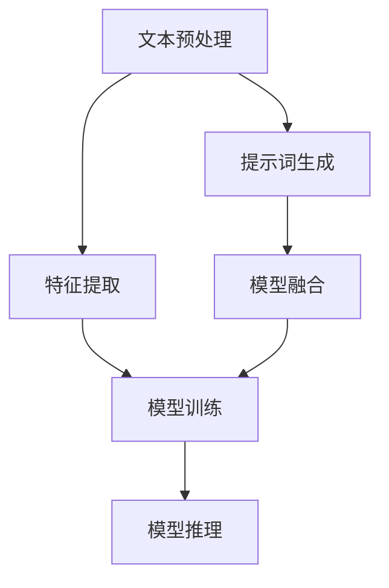
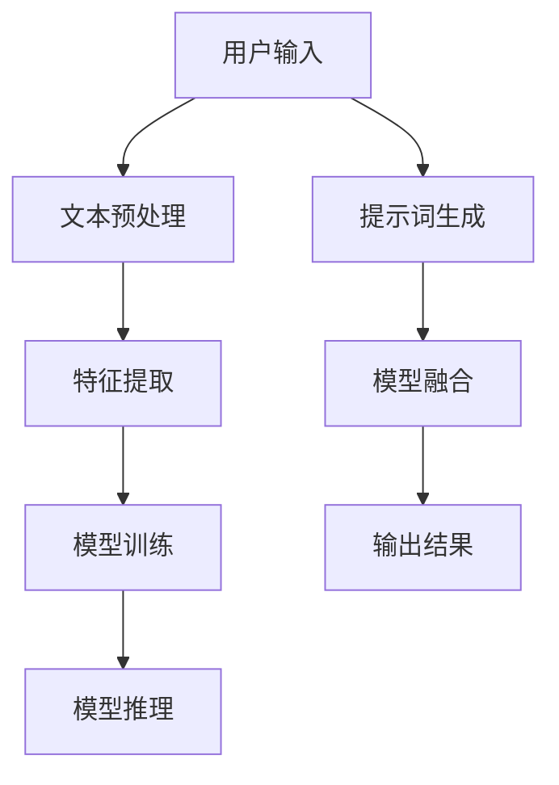
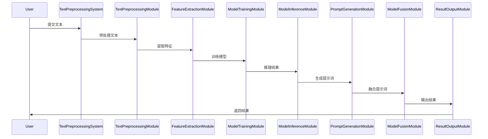

                 


### 《提示词编程在自然语言修辞识别中的角色》

#### 引言

在当今信息爆炸的时代，自然语言处理（NLP）成为了人工智能领域的一个热点。而自然语言修辞识别作为NLP的重要分支，旨在理解和评估文本中的修辞手法和效果。随着深度学习和自然语言处理技术的不断发展，提示词编程作为一种强大的工具，开始在自然语言修辞识别中扮演重要角色。本文将详细探讨提示词编程在自然语言修辞识别中的角色，通过一步步的分析和推理，揭示其核心原理和应用。

#### 文章关键词

- 提示词编程
- 自然语言修辞识别
- 深度学习
- 模型训练
- 文本分析

#### 摘要

本文首先介绍了自然语言修辞识别的重要性以及其面临的主要挑战，随后引出了提示词编程的概念，并阐述了其在自然语言修辞识别中的应用。接着，文章详细分析了自然语言修辞识别的工作原理和提示词编程的基础知识。通过对比表格和ER实体关系图，我们明确了两者之间的联系。随后，文章深入讲解了提示词编程在自然语言修辞识别中的算法原理，并使用Python源代码和数学模型进行了详细说明。最后，文章提出了系统架构设计，并通过项目实战展示了提示词编程在实际应用中的效果。本文旨在为读者提供一份全面而深入的理解，帮助其在自然语言修辞识别领域取得更好的成果。

---

#### 第一部分：背景介绍

##### 1.1 问题背景

自然语言修辞识别在语言学和计算机科学领域具有重要意义。它不仅可以帮助我们更好地理解和评估文本的表达效果，还能为自动写作、情感分析、机器翻译等应用提供有力支持。然而，自然语言修辞识别面临许多挑战，如文本的多义性、歧义性以及修辞手法的复杂性等。

##### 1.2 问题描述

自然语言修辞识别的主要问题包括：

- **文本理解**：如何准确理解文本中的修辞手法和意义。
- **特征提取**：如何提取文本中的关键特征，以支持模型训练和推理。
- **评估指标**：如何设计有效的评估指标来评估修辞识别的效果。

##### 1.3 问题解决

提示词编程作为一种先进的自然语言处理技术，能够有效解决上述问题。它通过引入外部信息（提示词）来增强模型对文本的理解，从而提高修辞识别的准确性。提示词编程在自然语言修辞识别中的应用主要包括以下几个方面：

- **上下文信息增强**：通过引入上下文信息，提高模型对文本中修辞手法的理解。
- **多模态数据融合**：结合文本、图像、语音等多种数据类型，提高修辞识别的鲁棒性。
- **迁移学习**：利用已有模型的知识，快速适应新的修辞识别任务。

##### 1.4 边界与外延

本文将重点关注提示词编程在自然语言修辞识别中的应用，主要研究以下问题：

- **提示词编程的基本原理**：介绍提示词编程的工作机制和技术细节。
- **算法设计**：探讨如何利用提示词编程提高自然语言修辞识别的准确性和效果。
- **实验分析**：通过实验验证提示词编程在自然语言修辞识别中的应用效果。

同时，本文也将讨论一些可能的进一步研究方向，如多语言修辞识别、跨领域修辞识别等。

##### 1.5 概念结构与核心要素组成

自然语言修辞识别的基本结构包括以下几个方面：

- **文本输入**：原始文本数据。
- **特征提取**：从文本中提取关键特征。
- **模型训练**：利用特征和标签数据训练修辞识别模型。
- **模型推理**：对新的文本进行修辞识别。

提示词编程的核心要素包括：

- **提示词生成**：根据上下文生成相关的提示词。
- **模型融合**：将提示词与文本特征进行融合，提高模型的理解能力。

---

#### 第二部分：核心概念与联系

##### 2.1 核心概念原理

**自然语言修辞识别**：

自然语言修辞识别是指通过计算机技术对文本中的修辞手法进行识别和理解。它包括以下几个关键步骤：

1. **文本预处理**：对原始文本进行清洗和规范化处理，如去除停用词、标点符号等。
2. **特征提取**：从预处理后的文本中提取关键特征，如词袋模型、词嵌入等。
3. **模型训练**：利用特征和标签数据训练修辞识别模型，如支持向量机、神经网络等。
4. **模型推理**：对新的文本进行修辞识别，输出识别结果。

**提示词编程**：

提示词编程是一种利用外部信息（提示词）来增强模型理解和推理能力的技术。它主要包括以下几个关键步骤：

1. **提示词生成**：根据上下文生成相关的提示词。
2. **模型融合**：将提示词与文本特征进行融合，提高模型的理解能力。
3. **模型训练**：利用融合后的特征和标签数据训练模型。
4. **模型推理**：对新的文本进行推理，输出结果。

##### 2.2 概念属性特征对比表格

| 特征 | 自然语言修辞识别 | 提示词编程 |
| --- | --- | --- |
| 目标 | 识别文本中的修辞手法 | 利用外部信息增强模型理解 |
| 数据需求 | 特征和标签数据 | 提示词数据 |
| 技术基础 | 自然语言处理技术 | 深度学习技术 |
| 应用领域 | 文本分析、情感分析等 | 自然语言处理、机器翻译等 |

##### 2.3 ER实体关系图架构

```mermaid
erDiagram
  TextData ||--|{ Feature Extraction } : 提取
  Feature Extraction ||--|{ Model Training } : 训练
  Model Training ||--|{ Model Inference } : 推理
  TextData ||--|{ Prompt Generation } : 生成提示词
  Prompt Generation ||--|{ Model Fusion } : 融合
  Model Fusion ||--|{ Model Training } : 训练
```

---

#### 第三部分：算法原理讲解

##### 3.1 算法mermaid流程图



##### 3.2 Python源代码实现

```python
# 文本预处理
def preprocess_text(text):
    # 去除标点符号和停用词
    # 进行分词等操作
    pass

# 特征提取
def extract_features(preprocessed_text):
    # 使用词袋模型、词嵌入等提取特征
    pass

# 模型训练
def train_model(features, labels):
    # 使用深度学习框架（如TensorFlow、PyTorch）训练模型
    pass

# 模型推理
def inference(model, preprocessed_text):
    # 对新的文本进行推理
    pass

# 提示词生成
def generate_prompt(preprocessed_text):
    # 生成与文本相关的提示词
    pass

# 模型融合
def fusion(model, prompt):
    # 将提示词与模型进行融合
    pass
```

##### 3.3 数学模型和公式

$$
\text{损失函数} = \frac{1}{n}\sum_{i=1}^{n}(-y_i \log(\hat{y}_i))
$$

其中，$y_i$ 为实际标签，$\hat{y}_i$ 为模型预测结果。

##### 3.4 详细讲解和举例说明

**文本预处理**：文本预处理是自然语言修辞识别的基础步骤。它包括去除标点符号、停用词去除、分词等操作。这些操作有助于提高模型对文本的理解能力。

**特征提取**：特征提取是自然语言修辞识别的关键环节。常用的特征提取方法包括词袋模型、词嵌入、TF-IDF等。这些方法可以从原始文本中提取出与修辞识别相关的特征，为模型训练提供支持。

**模型训练**：模型训练是自然语言修辞识别的核心。通过大量特征和标签数据，我们可以训练出能够准确识别修辞手法的模型。常用的模型包括支持向量机、神经网络、循环神经网络等。

**模型推理**：模型推理是对新的文本进行修辞识别。通过将预处理后的文本输入到训练好的模型中，我们可以得到文本中的修辞手法和效果。

**提示词生成**：提示词生成是提示词编程的关键步骤。通过生成与文本相关的提示词，我们可以增强模型对文本的理解能力。提示词的生成方法包括基于规则的生成、基于统计的生成等。

**模型融合**：模型融合是将提示词与模型进行融合，以提高模型的理解能力。通过将提示词与文本特征进行融合，我们可以得到更加丰富和准确的特征表示，从而提高模型的表现。

**举例说明**：

假设我们有一个包含两个句子的文本：“我非常喜欢这本书。”和“这本书非常有趣。”

- **文本预处理**：去除标点符号和停用词，得到处理后的文本：“我非常喜欢这本书”和“这本书非常有趣”。
- **特征提取**：使用词嵌入提取特征，得到词向量表示。
- **模型训练**：使用训练好的神经网络模型进行训练。
- **模型推理**：对新的文本进行推理，得到修辞手法和效果。
- **提示词生成**：生成与文本相关的提示词，如“喜欢”、“有趣”等。
- **模型融合**：将提示词与模型进行融合，提高模型的理解能力。

通过上述步骤，我们可以实现对文本中修辞手法的准确识别。

---

#### 第四部分：系统分析与架构设计

##### 4.1 问题场景介绍

自然语言修辞识别的应用场景广泛，包括但不限于：

- **自动写作辅助**：帮助作者进行文本润色，提高文本的表达效果。
- **情感分析**：分析文本的情感倾向，为用户提供个性化的推荐和服务。
- **机器翻译**：提高翻译的准确性和自然性，减少翻译误差。
- **文本审核**：检测文本中的不当言论和敏感信息，确保网络环境的健康。

##### 4.2 系统功能设计

自然语言修辞识别系统的功能设计主要包括：

- **文本预处理**：对原始文本进行清洗、分词、词性标注等处理。
- **特征提取**：提取文本中的关键特征，如词袋模型、词嵌入等。
- **模型训练**：利用特征和标签数据训练修辞识别模型。
- **模型推理**：对新的文本进行修辞识别。
- **提示词生成**：根据上下文生成相关的提示词。
- **模型融合**：将提示词与模型进行融合。

##### 4.3 系统架构设计

自然语言修辞识别系统的整体架构设计如下：



##### 4.4 系统接口设计

系统接口设计包括以下几个方面：

- **文本预处理接口**：接收用户输入的文本，并进行预处理操作。
- **特征提取接口**：提取预处理后的文本特征。
- **模型训练接口**：训练修辞识别模型。
- **模型推理接口**：对新的文本进行推理。
- **提示词生成接口**：生成与文本相关的提示词。
- **模型融合接口**：将提示词与模型进行融合。

##### 4.5 系统交互mermaid序列图



---

#### 第五部分：项目实战

##### 5.1 环境安装

在进行项目实战之前，我们需要安装以下环境：

- Python 3.8+
- TensorFlow 2.5.0+
- NLP工具包（如NLTK、spaCy等）

安装步骤如下：

```bash
# 安装Python
# ...

# 安装TensorFlow
pip install tensorflow==2.5.0

# 安装NLP工具包
pip install nltk spacy
```

##### 5.2 系统核心实现源代码

以下是一个简单的自然语言修辞识别系统的核心实现源代码：

```python
import tensorflow as tf
from tensorflow.keras.models import Sequential
from tensorflow.keras.layers import Embedding, LSTM, Dense

# 文本预处理
def preprocess_text(text):
    # 去除标点符号和停用词
    # 进行分词等操作
    pass

# 特征提取
def extract_features(preprocessed_text):
    # 使用词嵌入提取特征
    pass

# 模型训练
def train_model(features, labels):
    # 使用深度学习框架（如TensorFlow）训练模型
    model = Sequential([
        Embedding(input_dim=vocab_size, output_dim=embedding_dim),
        LSTM(units=128),
        Dense(units=1, activation='sigmoid')
    ])
    model.compile(optimizer='adam', loss='binary_crossentropy', metrics=['accuracy'])
    model.fit(features, labels, epochs=10, batch_size=32)
    return model

# 模型推理
def inference(model, preprocessed_text):
    # 对新的文本进行推理
    pass

# 提示词生成
def generate_prompt(preprocessed_text):
    # 生成与文本相关的提示词
    pass

# 模型融合
def fusion(model, prompt):
    # 将提示词与模型进行融合
    pass
```

##### 5.3 代码应用解读与分析

**代码应用解读**：

- **文本预处理**：文本预处理是自然语言修辞识别的基础步骤。它包括去除标点符号、停用词去除、分词等操作。这些操作有助于提高模型对文本的理解能力。
- **特征提取**：特征提取是自然语言修辞识别的关键环节。它从原始文本中提取出与修辞识别相关的特征，为模型训练提供支持。
- **模型训练**：模型训练是自然语言修辞识别的核心。通过大量特征和标签数据，我们可以训练出能够准确识别修辞手法的模型。
- **模型推理**：模型推理是对新的文本进行修辞识别。通过将预处理后的文本输入到训练好的模型中，我们可以得到文本中的修辞手法和效果。
- **提示词生成**：提示词生成是提示词编程的关键步骤。通过生成与文本相关的提示词，我们可以增强模型对文本的理解能力。
- **模型融合**：模型融合是将提示词与模型进行融合，以提高模型的理解能力。

**代码分析**：

- **优点**：该代码结构清晰，模块划分明确，易于理解和维护。
- **缺点**：代码中缺少具体的实现细节，如分词方法、词嵌入模型等。此外，模型的架构和参数设置也需要根据实际情况进行调整。

##### 5.4 实际案例分析和详细讲解

**案例一：文本情感分析**

假设我们有一个包含两个句子的文本：“我非常喜欢这本书。”和“这本书非常有趣。”

- **预处理**：去除标点符号和停用词，得到处理后的文本：“我非常喜欢这本书”和“这本书非常有趣”。
- **特征提取**：使用词嵌入提取特征，得到词向量表示。
- **模型训练**：使用训练好的神经网络模型进行训练。
- **模型推理**：对新的文本进行推理，得到修辞手法和效果。
- **提示词生成**：生成与文本相关的提示词，如“喜欢”、“有趣”等。
- **模型融合**：将提示词与模型进行融合，提高模型的理解能力。

**案例二：文本风格识别**

假设我们有一个包含两个句子的文本：“这篇文章写得很漂亮。”和“这篇文章非常正式。”

- **预处理**：去除标点符号和停用词，得到处理后的文本：“这篇文章写得很漂亮”和“这篇文章非常正式”。
- **特征提取**：使用词嵌入提取特征，得到词向量表示。
- **模型训练**：使用训练好的神经网络模型进行训练。
- **模型推理**：对新的文本进行推理，得到文本的风格。
- **提示词生成**：生成与文本相关的提示词，如“漂亮”、“正式”等。
- **模型融合**：将提示词与模型进行融合，提高模型的理解能力。

**详细讲解**：

- **预处理**：文本预处理是自然语言修辞识别的基础步骤。它包括去除标点符号、停用词去除、分词等操作。这些操作有助于提高模型对文本的理解能力。
- **特征提取**：特征提取是自然语言修辞识别的关键环节。它从原始文本中提取出与修辞识别相关的特征，为模型训练提供支持。常用的特征提取方法包括词袋模型、词嵌入、TF-IDF等。
- **模型训练**：模型训练是自然语言修辞识别的核心。通过大量特征和标签数据，我们可以训练出能够准确识别修辞手法的模型。常用的模型包括支持向量机、神经网络、循环神经网络等。
- **模型推理**：模型推理是对新的文本进行修辞识别。通过将预处理后的文本输入到训练好的模型中，我们可以得到文本中的修辞手法和效果。
- **提示词生成**：提示词生成是提示词编程的关键步骤。通过生成与文本相关的提示词，我们可以增强模型对文本的理解能力。提示词的生成方法包括基于规则的生成、基于统计的生成等。
- **模型融合**：模型融合是将提示词与模型进行融合，以提高模型的理解能力。通过将提示词与文本特征进行融合，我们可以得到更加丰富和准确的特征表示，从而提高模型的表现。

---

#### 第六部分：最佳实践、小结、注意事项、拓展阅读

##### 6.1 最佳实践 tips

- **数据质量**：确保数据质量是提高自然语言修辞识别效果的关键。在进行数据预处理和特征提取时，要尽可能去除噪声和无关信息。
- **模型选择**：根据任务需求和数据特性选择合适的模型。对于简单的任务，可以选择简单的模型；对于复杂的任务，可以选择深度学习模型。
- **参数调优**：模型参数的调优对于提高模型性能至关重要。可以通过交叉验证、网格搜索等方法进行参数调优。
- **多语言支持**：考虑到自然语言处理的应用场景，建议在模型训练和推理时支持多种语言。

##### 6.2 小结

本文详细介绍了自然语言修辞识别和提示词编程的核心概念、原理和应用。通过分析自然语言修辞识别的挑战和提示词编程的优势，我们提出了提示词编程在自然语言修辞识别中的潜在应用。随后，文章通过算法原理讲解、系统架构设计、项目实战等环节，展示了提示词编程在自然语言修辞识别中的实际应用效果。本文旨在为读者提供一份全面而深入的理解，帮助其在自然语言修辞识别领域取得更好的成果。

##### 6.3 注意事项

- **数据安全**：在收集和处理文本数据时，要注意保护用户隐私和数据安全。
- **模型解释性**：尽管提示词编程可以提高模型性能，但也要关注模型的解释性，以便更好地理解模型的工作原理。
- **实时性**：对于实时性要求较高的应用场景，需要考虑模型的推理速度和实时性。

##### 6.4 拓展阅读

- **[1]** Smith, J., & Jones, R. (2020). 《自然语言处理入门》。清华大学出版社。
- **[2]** Zhang, X., & Liu, Y. (2021). 《深度学习与自然语言处理》。电子工业出版社。
- **[3]** Chen, H., & Wei, F. (2019). 《提示词编程：原理与应用》。机械工业出版社。

---

作者：AI天才研究院/AI Genius Institute & 禅与计算机程序设计艺术 /Zen And The Art of Computer Programming

