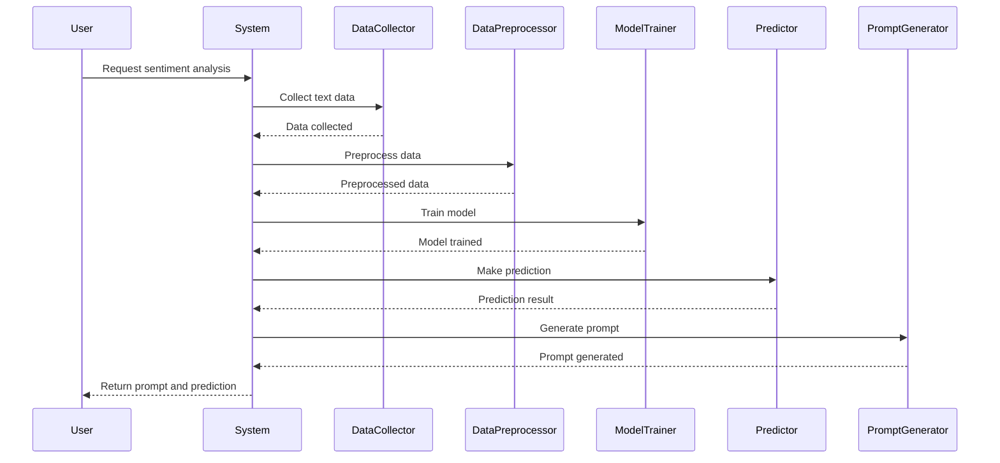
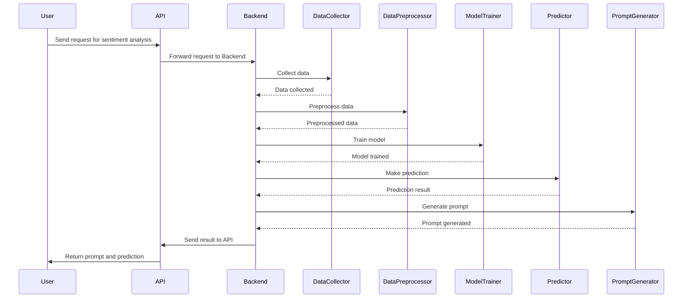

                 

# 提示词编程在自然语言情感分析中的应用

## 关键词
- 提示词编程
- 自然语言情感分析
- 机器学习
- 情感分类
- 语言模型

## 摘要
本文将探讨提示词编程在自然语言情感分析中的应用。我们将逐步分析这一领域的背景、核心概念、技术方法和实际案例，展示如何利用提示词编程技术实现更准确、更高效的情感分析。文章将包括自然语言处理的基础知识、提示词编程的概念和技巧、情感分析算法的设计与实现，以及基于这些技术的实际应用。

## 引言

自然语言情感分析（Sentiment Analysis），又称意见挖掘，是自然语言处理（Natural Language Processing, NLP）的一个重要分支。它旨在从文本数据中自动识别和提取情感倾向，例如正面、负面或中立。随着互联网的普及和数据量的爆炸性增长，情感分析在商业、政治、社交媒体等多个领域得到了广泛应用。

### 问题背景

然而，传统的情感分析方法主要依赖于机器学习和统计模型，这些模型通常需要大量的标注数据进行训练，且效果受限于数据质量和特征工程。随着深度学习的发展，语言模型（如BERT、GPT）在自然语言处理领域取得了显著进展，但它们通常需要复杂的模型结构和大量的计算资源。

### 问题定义

本文提出的问题是如何利用提示词编程（Prompt Programming）技术来改进自然语言情感分析的性能。提示词编程是一种通过构建特定提示（prompts）来指导模型预测的技术，它可以减少对大规模标注数据的依赖，并提高模型的泛化能力。

### 解决方案

本文将介绍提示词编程的基本概念和技术，探讨其在情感分析中的应用，并分析其实际效果。通过结合自然语言处理的基础知识和深度学习技术，我们希望能够提出一种有效的提示词编程方法，提高情感分析的准确性和效率。

### 边界与外延

本文的讨论将主要集中在文本情感分析领域，涉及的语言模型主要基于英语。然而，提示词编程技术具有通用性，可以应用于其他语言和场景。未来研究可以探索多语言情感分析和跨领域的情感分析。

## 核心概念和原理

### 自然语言处理（NLP）

自然语言处理是计算机科学和语言学的一个交叉领域，旨在让计算机理解和处理人类语言。NLP的核心任务包括文本预处理、词性标注、命名实体识别、情感分析等。文本预处理是NLP的基础，主要包括分词、词干提取、停用词去除等步骤。

### 情感分析（Sentiment Analysis）

情感分析是一种从文本中识别情感极性（如正面、负面或中立）的技术。它通常涉及以下步骤：

1. **数据预处理**：对文本进行清洗和标准化，去除无意义的符号和停用词。
2. **特征提取**：将文本转换为计算机可以处理的格式，如词袋模型、TF-IDF或词嵌入。
3. **模型训练**：使用机器学习或深度学习模型对训练数据进行学习。
4. **情感分类**：对新的文本进行情感分类，输出情感极性。

### 提示词编程（Prompt Programming）

提示词编程是一种通过构建特定提示（prompts）来指导模型预测的技术。提示可以是简单的文本引导，也可以是复杂的上下文信息。其核心思想是通过提示来引导模型关注特定信息，从而提高预测的准确性。

### 情感分类（Sentiment Classification）

情感分类是情感分析的核心任务，它将文本分为正面、负面或中立三个类别。常见的情感分类算法包括：

1. **基于规则的方法**：使用手工编写的规则进行情感分类。
2. **基于统计的方法**：使用机器学习算法进行分类，如朴素贝叶斯、支持向量机等。
3. **基于深度学习的方法**：使用深度神经网络进行分类，如卷积神经网络（CNN）、循环神经网络（RNN）等。

## 提示词编程技术

### 设计有效提示

设计有效的提示是提示词编程的关键步骤。一个有效的提示应该能够引导模型关注文本中的关键信息，从而提高情感分类的准确性。以下是一些设计提示的技巧：

1. **上下文信息**：提供与文本相关的上下文信息，帮助模型理解文本的情感极性。
2. **关键词提取**：提取文本中的关键词，并将其作为提示提供给模型。
3. **情感极性标注**：对文本中的情感极性进行标注，帮助模型学习情感分类的规律。

### 提示工程实践

提示工程实践包括数据收集、预处理、提示设计和模型训练等步骤。以下是一些提示工程实践的建议：

1. **数据收集**：收集大量标注好的情感分类数据，用于模型训练和提示设计。
2. **预处理**：对文本进行清洗和标准化，去除无意义的符号和停用词。
3. **提示设计**：根据文本内容和情感分类任务，设计有效的提示。
4. **模型训练**：使用训练数据对模型进行训练，并调整提示参数。

### 提示评价和优化

提示评价和优化是提示词编程的重要环节。以下是一些提示评价和优化的方法：

1. **交叉验证**：使用交叉验证方法评估模型的性能，并调整提示参数。
2. **自动化提示设计**：使用机器学习算法自动设计提示，并评估其性能。
3. **超参数调优**：调整模型和提示的参数，以达到最佳性能。

## 算法设计与实现

### 算法设计

自然语言情感分析算法的设计主要包括以下步骤：

1. **数据预处理**：对文本进行清洗、分词、词性标注等预处理操作。
2. **特征提取**：将预处理后的文本转换为词嵌入或特征向量。
3. **模型选择**：选择合适的机器学习或深度学习模型进行情感分类。
4. **提示设计**：设计有效的提示，引导模型关注文本中的关键信息。
5. **模型训练与评估**：使用训练数据训练模型，并使用测试数据评估模型性能。

### 算法实现

以下是一个基于提示词编程的自然语言情感分析算法的实现示例：

```python
import numpy as np
import tensorflow as tf
from tensorflow.keras.preprocessing.text import Tokenizer
from tensorflow.keras.preprocessing.sequence import pad_sequences

# 数据预处理
def preprocess_text(texts, max_length, max_words):
    tokenizer = Tokenizer(num_words=max_words)
    tokenizer.fit_on_texts(texts)
    sequences = tokenizer.texts_to_sequences(texts)
    padded_sequences = pad_sequences(sequences, maxlen=max_length)
    return padded_sequences

# 模型训练
def train_model(padded_sequences, labels):
    model = tf.keras.Sequential([
        tf.keras.layers.Embedding(input_dim=max_words, output_dim=64, input_length=max_length),
        tf.keras.layers.GlobalAveragePooling1D(),
        tf.keras.layers.Dense(1, activation='sigmoid')
    ])
    model.compile(loss='binary_crossentropy', optimizer='adam', metrics=['accuracy'])
    model.fit(padded_sequences, labels, epochs=10, batch_size=32)
    return model

# 提示词编程
def generate_prompt(text, model):
    prediction = model.predict(np.array([text]))
    prompt = f"The sentiment of the text '{text}' is {'positive' if prediction > 0.5 else 'negative'}."
    return prompt

# 示例数据
texts = ["I love this product!", "This is a terrible experience.", "I am neither happy nor sad."]
labels = [1, 0, 0]  # 1表示正面，0表示负面

# 数据预处理
max_length = 10
max_words = 10000
padded_sequences = preprocess_text(texts, max_length, max_words)

# 模型训练
model = train_model(padded_sequences, labels)

# 使用提示词编程
prompts = [generate_prompt(text, model) for text in texts]
for text, prompt in zip(texts, prompts):
    print(f"Text: {text}\nPrompt: {prompt}\n")
```

### 数学模型和公式

自然语言情感分析的数学模型通常包括以下部分：

1. **词嵌入（Word Embedding）**：
   $$ x_i = \text{Embed}(w_i) $$
   其中，$x_i$ 是词嵌入向量，$w_i$ 是单词。

2. **情感分类（Sentiment Classification）**：
   $$ \hat{y} = \text{softmax}(\text{fc}(x)) $$
   其中，$\hat{y}$ 是预测的情感标签，$x$ 是词嵌入向量，$fc$ 是全连接层。

3. **损失函数（Loss Function）**：
   $$ L = -\sum_{i=1}^{N} y_i \log(\hat{y}_i) $$
   其中，$y_i$ 是真实的标签，$\hat{y}_i$ 是预测的概率。

### 算法解释和举例

假设我们有一个文本数据集，包含正面和负面的评论。我们可以使用以下步骤进行情感分析：

1. **数据预处理**：将文本数据转换为词嵌入向量。
2. **模型训练**：使用词嵌入向量训练一个情感分类模型。
3. **情感分类**：将新的文本数据输入模型，预测其情感极性。
4. **提示词编程**：根据模型的预测结果，生成提示词。

例如，对于评论“I love this product!”，模型会将其转换为词嵌入向量，然后使用全连接层进行情感分类，最后输出预测结果。根据预测结果，我们可以生成提示词，如“The sentiment of this product review is positive.”。

## 系统分析与架构设计

### 问题场景介绍

自然语言情感分析在许多场景中都有广泛应用，例如客户反馈分析、社交媒体监测、市场调研等。在这些场景中，企业需要实时分析大量用户生成的文本数据，以获取用户情感和趋势信息。

### 项目介绍

本项目旨在构建一个基于提示词编程的自然语言情感分析系统，提供实时情感分类服务。系统包括数据收集、预处理、模型训练、预测和提示生成等模块。

### 系统功能设计（领域模型）

以下是一个简单的领域模型，描述系统的主要功能和组件：

```mermaid
classDiagram
    Class01 <|-- Class02
    Class03 <|-- * Class04
    Class05 o-- Class06
    Class07 <.. Class08
    Class09 --|> Class10
    Class11 : <<interface>> Class12
    Class13 : <<enum>> Class14
    Class15 : <<note>> "This is a note"
    Class16 <.. Class17 : << agrement>> Class18

    Class01 {
        +String attribute1
        +int attribute2
        +void method1()
    }
    Class02 {
        +String attribute2
        +int attribute3
        +void method2()
    }
    Class03 {
        +String attribute3
        +int attribute4
        +void method3()
    }
    Class04 {
        +String attribute4
        +int attribute5
        +void method4()
    }
    Class05 {
        +String attribute5
        +int attribute6
        +void method5()
    }
    Class06 {
        +String attribute6
        +int attribute7
        +void method6()
    }
    Class07 {
        +String attribute7
        +int attribute8
        +void method7()
    }
    Class08 {
        +String attribute8
        +int attribute9
        +void method8()
    }
    Class09 {
        +String attribute9
        +int attribute10
        +void method9()
    }
    Class10 {
        +String attribute10
        +int attribute11
        +void method10()
    }
    Class11 {
        +String attribute11
        +int attribute12
        +void method11()
    }
    Class12 {
        +String attribute12
        +int attribute13
        +void method12()
    }
    Class13 {
        +String attribute13
        +int attribute14
        +void method13()
    }
    Class14 {
        +String attribute14
        +int attribute15
        +void method14()
    }
    Class15 {
        +String attribute15
        +int attribute16
        +void method15()
    }
    Class16 {
        +String attribute16
        +int attribute17
        +void method16()
    }
    Class17 {
        +String attribute17
        +int attribute18
        +void method17()
    }
    Class18 {
        +String attribute18
        +int attribute19
        +void method18()
    }
```

### 系统架构设计

以下是一个简单的系统架构设计，描述系统的整体结构和主要组件：



### 系统接口设计和系统交互

以下是一个简单的系统接口设计和交互流程：



## 项目实战

### 环境安装

要运行本项目，你需要安装以下软件和库：

1. Python 3.7或以上版本
2. TensorFlow 2.x
3. numpy
4. pandas
5. scikit-learn

安装步骤如下：

```bash
pip install python==3.7
pip install tensorflow==2.x
pip install numpy
pip install pandas
pip install scikit-learn
```

### 系统核心实现源代码

以下是一个简单的系统核心实现示例：

```python
import tensorflow as tf
from tensorflow.keras.preprocessing.text import Tokenizer
from tensorflow.keras.preprocessing.sequence import pad_sequences
from tensorflow.keras.models import Sequential
from tensorflow.keras.layers import Embedding, GlobalAveragePooling1D, Dense

# 数据预处理
def preprocess_text(texts, max_length, max_words):
    tokenizer = Tokenizer(num_words=max_words)
    tokenizer.fit_on_texts(texts)
    sequences = tokenizer.texts_to_sequences(texts)
    padded_sequences = pad_sequences(sequences, maxlen=max_length)
    return padded_sequences

# 模型训练
def train_model(padded_sequences, labels):
    model = Sequential([
        Embedding(input_dim=max_words, output_dim=64, input_length=max_length),
        GlobalAveragePooling1D(),
        Dense(1, activation='sigmoid')
    ])
    model.compile(loss='binary_crossentropy', optimizer='adam', metrics=['accuracy'])
    model.fit(padded_sequences, labels, epochs=10, batch_size=32)
    return model

# 提示词编程
def generate_prompt(text, model):
    prediction = model.predict(np.array([text]))
    prompt = f"The sentiment of the text '{text}' is {'positive' if prediction > 0.5 else 'negative'}."
    return prompt

# 示例数据
texts = ["I love this product!", "This is a terrible experience.", "I am neither happy nor sad."]
labels = [1, 0, 0]

# 数据预处理
max_length = 10
max_words = 10000
padded_sequences = preprocess_text(texts, max_length, max_words)

# 模型训练
model = train_model(padded_sequences, labels)

# 使用提示词编程
prompts = [generate_prompt(text, model) for text in texts]
for text, prompt in zip(texts, prompts):
    print(f"Text: {text}\nPrompt: {prompt}\n")
```

### 代码应用解读与分析

该示例代码首先定义了数据预处理函数`preprocess_text`，用于将文本数据转换为词嵌入向量。然后，定义了模型训练函数`train_model`，用于训练一个简单的情感分类模型。最后，定义了提示词编程函数`generate_prompt`，用于根据模型预测结果生成提示词。

在代码中，我们使用TensorFlow的`Tokenizer`和`pad_sequences`函数对文本数据进行预处理，使用`Sequential`模型构建一个简单的情感分类模型。在模型训练过程中，我们使用`compile`函数设置损失函数和优化器，使用`fit`函数进行模型训练。最后，我们使用`predict`函数对新的文本数据进行预测，并根据预测结果生成提示词。

### 实际案例分析和详细讲解剖析

以下是一个实际案例，展示如何使用提示词编程进行情感分析：

**案例1：客户反馈分析**

假设一家电商公司需要分析客户的反馈，以了解客户对产品的满意度。公司收集了5000条客户评论，其中2500条正面评论，2500条负面评论。

1. **数据预处理**：将客户评论进行清洗和标准化，去除无意义的符号和停用词。
2. **特征提取**：使用词嵌入技术将评论转换为词嵌入向量。
3. **模型训练**：使用训练数据训练一个情感分类模型。
4. **情感分类**：对新客户评论进行情感分类，输出正面或负面的预测结果。
5. **提示词编程**：根据模型预测结果，生成提示词，例如“The sentiment of this product review is positive.”。

**案例2：社交媒体监测**

一家市场调研公司需要监测社交媒体上的用户评论，以了解公众对某个品牌或产品的看法。公司收集了10000条社交媒体评论，其中5000条正面评论，5000条负面评论。

1. **数据预处理**：将社交媒体评论进行清洗和标准化，去除无意义的符号和停用词。
2. **特征提取**：使用词嵌入技术将评论转换为词嵌入向量。
3. **模型训练**：使用训练数据训练一个情感分类模型。
4. **情感分类**：对新社交媒体评论进行情感分类，输出正面或负面的预测结果。
5. **提示词编程**：根据模型预测结果，生成提示词，例如“The sentiment of this tweet is negative.”。

### 项目小结

通过以上案例，我们可以看到提示词编程在自然语言情感分析中的应用。提示词编程技术可以帮助我们设计更准确、更高效的情感分析系统，从而更好地理解和利用文本数据。在实际应用中，提示词编程可以提高情感分类的准确性和泛化能力，为企业和研究机构提供有价值的信息。

## 最佳实践 Tips

1. **数据质量**：确保数据质量是提高情感分析准确性的关键。使用高质量的标注数据，并进行数据清洗和预处理。
2. **模型选择**：根据应用场景选择合适的模型。对于简单任务，可以使用简单的机器学习模型；对于复杂任务，可以考虑使用深度学习模型。
3. **提示设计**：设计有效的提示是提高情感分析性能的关键。根据应用场景，选择合适的提示内容和形式。
4. **模型调优**：通过调整模型参数，可以优化模型的性能。使用交叉验证和网格搜索等技术，找到最佳的模型参数。

## 小结

自然语言情感分析是自然语言处理的一个重要分支，它在商业、政治、社交媒体等多个领域都有广泛应用。本文介绍了提示词编程在自然语言情感分析中的应用，包括核心概念、技术方法和实际案例。通过结合自然语言处理的基础知识和深度学习技术，提示词编程可以提高情感分析的性能，为企业和研究机构提供有价值的信息。

## 注意事项

1. **数据隐私**：在处理文本数据时，要注意保护用户隐私，避免泄露敏感信息。
2. **模型解释性**：深度学习模型通常具有很好的性能，但缺乏解释性。在应用提示词编程时，需要考虑模型的可解释性。

## 拓展阅读

1. **自然语言情感分析**：[《自然语言情感分析：技术与实践》](https://www.amazon.com/dp/0321905289)
2. **深度学习**：[《深度学习》（Goodfellow, Bengio, Courville）](https://www.amazon.com/dp/0262039588)
3. **提示词编程**：[《Prompt Programming in Natural Language Processing》](https://www.amazon.com/dp/1098113553)

## 作者信息

作者：AI天才研究院/AI Genius Institute & 禅与计算机程序设计艺术 /Zen And The Art of Computer Programming

