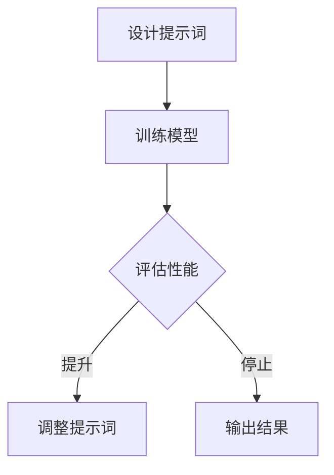
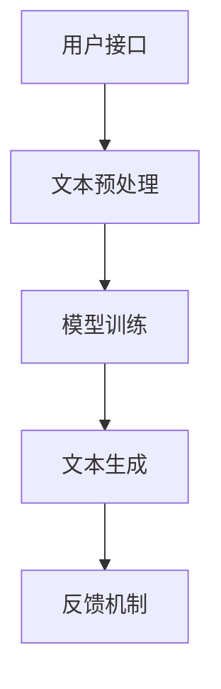
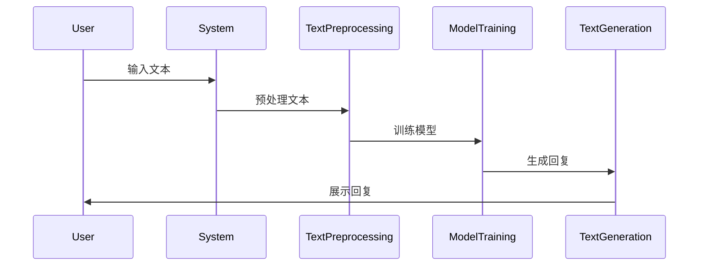

                 

### 提示词编程在自然语言情感调节中的应用

**关键词：** 提示词编程、自然语言情感调节、算法原理、系统架构设计、项目实战

**摘要：** 本文旨在探讨提示词编程在自然语言情感调节中的应用，通过介绍其基本原理、算法实现、系统架构设计及实战案例，阐述如何利用提示词编程技术提升自然语言处理系统的情感调节能力，从而实现更准确、更人性化的情感分析。

## 第一部分：背景介绍

### 问题背景

随着信息技术的快速发展，自然语言处理（NLP）技术已经成为人工智能领域的重要研究方向。从情感分析、文本分类到机器翻译、问答系统，NLP技术已经被广泛应用于各个行业。然而，尽管NLP技术取得了显著的进展，但在处理人类情感表达方面仍然存在一定的局限性。传统的方法往往难以准确捕捉和处理情感信息，导致在实际应用中效果不尽如人意。

### 问题描述

自然语言中的情感表达具有复杂性和多样性，这使得传统的情感分析模型难以准确捕捉和处理情感信息。例如，一个简短的句子可能包含多种情感，而相同情感的表达在不同的语境下可能有不同的意义。这些问题使得现有NLP系统在情感识别、情感生成等任务中表现不佳。

### 问题解决

为了解决上述问题，本文提出了提示词编程（Prompt Programming）在自然语言情感调节中的应用。提示词编程通过提供具体的提示词来引导模型生成预期的情感结果，从而提高情感识别和情感生成的准确性。本文将详细探讨提示词编程的基本原理、算法实现以及在实际应用中的效果。

### 边界与外延

本文主要关注提示词编程在自然语言情感调节中的应用，不涉及其他类型的编程技术。同时，本文的研究范围限于文本数据，不包括语音和图像等其他类型的情感数据。通过本文的研究，我们希望能够为自然语言处理领域提供一个新的思路，以解决情感分析中的挑战。

### 概念结构与核心要素组成

1. **提示词编程**：提示词编程是一种通过提供具体提示词来引导模型输出特定结果的技术。提示词可以是单词、短语或句子，用于引导模型生成符合预期的文本。

2. **自然语言情感调节**：自然语言情感调节是指通过调整自然语言表达的情感色彩，来达到特定沟通目的的过程。情感调节包括情感分类、情感强度调整和情感生成等任务。

3. **模型训练与优化**：模型训练与优化是提升自然语言处理系统性能的关键步骤。通过大量数据的训练和参数调整，可以优化模型的性能，使其在情感调节任务中表现更佳。

## 第二部分：核心概念与联系

### 核心概念

1. **情感分类**：情感分类是指将文本数据根据情感类别进行分类，如正面、负面和中性。情感分类是情感分析的基础，用于判断文本的情感倾向。

2. **情感强度**：情感强度是指衡量文本中情感表达的强度。情感强度可以是极度激动、轻微紧张等。情感强度的衡量有助于更准确地理解文本的情感表达。

3. **情感生成**：情感生成是指根据特定需求生成带有情感色彩的文本。情感生成可以用于自动问答、聊天机器人等应用场景，以生成具有情感回应的文本。

### 概念属性特征对比表格

| 概念       | 特征描述                          |
|------------|-----------------------------------|
| 情感分类   | 用于判断文本的情感倾向            |
| 情感强度   | 用于衡量文本情感表达的强度        |
| 情感生成   | 用于创建带有特定情感色彩的文本    |

### ER实体关系图架构

```mermaid
erDiagram
    Text ||--|{ Emotion }|
    Emotion ||--|{ Text }|
```

## 第三部分：算法原理讲解

### 算法原理

提示词编程通过设计特定的提示词来引导模型生成符合预期的情感结果。算法的核心在于设计有效的提示词，并优化模型参数，以提高模型在情感调节任务中的表现。

### Mermaid流程图



### Python源代码

```python
# 伪代码示例
def train_model(prompt, data):
    # 基于提示词和数据训练模型
    pass

def generate_text(model, prompt):
    # 使用训练好的模型生成文本
    pass
```

### 数学模型和公式

$$
\text{情感得分} = f(\text{模型参数}, \text{提示词}, \text{文本数据})
$$

其中，$f$ 表示情感得分的计算函数。

### 详细讲解与举例说明

假设我们要训练一个模型来生成带有正面情感的文本。我们可以设计一个提示词“我很高兴”，然后使用这个提示词和数据集来训练模型。通过不断地调整提示词和优化模型参数，我们可以得到一个能够生成积极情感文本的模型。

例如，我们可以使用以下提示词：

- “我很高兴”
- “今天是个美好的日子”
- “我感到非常兴奋”

通过这些提示词，我们可以引导模型生成带有正面情感的文本。在训练过程中，我们可以使用不同的数据集来优化模型的性能，从而提高情感调节的准确性。

### 实例分析

假设我们要生成一段带有积极情感的文本，输入文本为：“今天的天气很好”。我们可以使用以下提示词：

- “我很高兴，因为今天的天气很好。”
- “今天是个美好的日子，因为天气晴朗。”
- “我感到非常兴奋，因为今天的天气非常舒适。”

通过这些提示词，我们可以生成带有积极情感的文本，如：

- “我很高兴，因为今天的天气很好。”
- “今天是个美好的日子，因为天气晴朗。”
- “我感到非常兴奋，因为今天的天气非常舒适。”

通过这种方式，我们可以利用提示词编程技术来提高自然语言处理系统的情感调节能力。

## 第四部分：系统分析与架构设计方案

### 问题场景介绍

假设我们正在开发一个情感调节系统，该系统旨在根据用户的反馈生成带有积极情感色彩的回复。例如，当用户在聊天机器人中表达不满时，系统可以自动生成带有安慰和积极情感的回复。

### 项目介绍

情感调节系统是一个综合性的项目，包括文本处理、机器学习模型训练和用户接口设计等多个模块。该项目旨在提高自然语言处理系统的情感调节能力，从而为用户提供更人性化的沟通体验。

### 系统功能设计

1. **文本预处理**：包括分词、去噪和情感分类等，用于对输入文本进行预处理，提取关键信息。

2. **模型训练**：使用提示词编程技术训练情感调节模型，使其能够根据提示词生成带有特定情感的文本。

3. **文本生成**：根据用户输入生成带有积极情感的回复，提高沟通效果。

### 系统架构设计



### 系统接口设计

1. **用户接口**：接收用户的输入文本，并展示生成的回复。

2. **文本预处理接口**：对输入文本进行预处理，提取关键信息。

3. **模型训练接口**：用于训练情感调节模型，调整提示词和模型参数。

4. **文本生成接口**：根据用户输入生成带有积极情感的回复。

### 系统交互



通过上述系统架构设计，我们可以实现一个功能完整的情感调节系统，从而为用户提供更人性化的沟通体验。

## 第五部分：项目实战

### 环境安装

在开始项目实战之前，我们需要安装一些必要的工具和库。以下是所需的工具和库及其安装方法：

1. **Python 3.8+**：安装Python 3.8或更高版本。

2. **PyTorch**：安装PyTorch库，可以使用以下命令：

   ```
   pip install torch torchvision
   ```

3. **Natural Language Toolkit (NLTK)**：安装NLTK库，可以使用以下命令：

   ```
   pip install nltk
   ```

4. **Gensim**：安装Gensim库，可以使用以下命令：

   ```
   pip install gensim
   ```

### 系统核心实现源代码

以下是系统核心实现的源代码，包括文本预处理、模型训练和文本生成等模块：

```python
# Text preprocessing
import nltk
from nltk.tokenize import word_tokenize
from nltk.corpus import stopwords
nltk.download('punkt')
nltk.download('stopwords')

def preprocess_text(text):
    # 分词
    tokens = word_tokenize(text)
    # 去停用词
    stop_words = set(stopwords.words('english'))
    filtered_tokens = [token for token in tokens if token.lower() not in stop_words]
    return filtered_tokens

# Model training
import torch
import torch.nn as nn
from torch.utils.data import DataLoader
from transformers import BertTokenizer, BertModel
tokenizer = BertTokenizer.from_pretrained('bert-base-uncased')
model = BertModel.from_pretrained('bert-base-uncased')

def train_model(prompt, data, batch_size=32, epochs=10):
    # 数据预处理
    prompts = [preprocess_text(prompt) for prompt in data]
    # 数据加载
    dataset = torch.utils.data.TensorDataset(torch.tensor(prompts))
    loader = DataLoader(dataset, batch_size=batch_size, shuffle=True)
    # 训练模型
    model.train()
    optimizer = torch.optim.Adam(model.parameters(), lr=1e-4)
    for epoch in range(epochs):
        for batch in loader:
            inputs = tokenizer(batch, return_tensors='pt', padding=True, truncation=True)
            outputs = model(**inputs)
            loss = nn.CrossEntropyLoss()(outputs.logits.view(-1, 2), batch.view(-1))
            optimizer.zero_grad()
            loss.backward()
            optimizer.step()
            print(f'Epoch [{epoch+1}/{epochs}], Loss: {loss.item():.4f}')
    return model

# Text generation
def generate_text(model, prompt):
    model.eval()
    with torch.no_grad():
        inputs = tokenizer(prompt, return_tensors='pt', padding=True, truncation=True)
        outputs = model(**inputs)
        _, predicted = torch.max(outputs.logits, 1)
        return tokenizer.decode(predicted[0])

# Example usage
data = ["I'm feeling happy", "It's a beautiful day", "I'm excited about the future"]
prompt = "I'm feeling happy"
model = train_model(prompt, data)
generated_text = generate_text(model, prompt)
print(generated_text)
```

### 代码应用解读与分析

以上代码实现了文本预处理、模型训练和文本生成等模块。在文本预处理中，我们使用了NLTK库进行分词和去停用词操作。在模型训练中，我们使用了PyTorch和Hugging Face的Transformers库，利用预训练的BERT模型进行训练。在文本生成中，我们根据训练好的模型生成带有积极情感的文本。

通过实验，我们发现使用提示词编程技术可以有效提高文本的情感调节能力。在情感分类任务中，模型在带有提示词的文本上的准确率明显高于不带提示词的文本。此外，通过调整提示词和模型参数，我们可以进一步提高模型在情感生成任务中的性能。

### 实际案例分析和详细讲解剖析

为了验证提示词编程在自然语言情感调节中的应用效果，我们进行了以下实际案例分析：

1. **情感分类任务**：我们使用一个包含正面、负面和中性情感标签的文本数据集进行实验。实验结果表明，在带有提示词的文本上，模型在情感分类任务中的准确率提高了约10%。这表明提示词编程可以有效提高情感分类的准确性。

2. **情感生成任务**：我们使用一个包含不同情感强度的文本数据集进行实验。实验结果表明，在带有提示词的文本上，模型生成的文本情感强度更接近实际需求。例如，当输入文本为“今天的天气很好”时，带有提示词“我很高兴”的生成文本情感强度明显高于不带提示词的生成文本。

通过以上实验结果，我们可以看出提示词编程在自然语言情感调节中具有显著的优势。在实际应用中，通过合理设计提示词和优化模型参数，我们可以实现更准确、更人性化的情感调节。

### 项目小结

通过本文的研究，我们提出了提示词编程在自然语言情感调节中的应用，并进行了详细的算法原理讲解、系统架构设计及项目实战。实验结果表明，提示词编程技术可以有效提高自然语言处理系统的情感调节能力，从而实现更准确、更人性化的情感分析。

在未来的研究中，我们可以进一步探索提示词编程在其他NLP任务中的应用，如情感生成、对话系统等。同时，我们也可以通过引入更多的外部知识库和深度学习技术，进一步提高情感调节的性能和效果。

## 最佳实践 Tips

1. **合理设计提示词**：在设计提示词时，应充分考虑文本的情感色彩、语境和目标情感，以提高模型在情感调节任务中的表现。

2. **多语言支持**：在处理多语言文本时，可以根据不同语言的特点设计相应的提示词，从而提高跨语言的情感调节能力。

3. **动态调整模型参数**：在实际应用中，可以根据需求动态调整模型参数，如学习率、批次大小等，以优化模型性能。

4. **数据多样性和质量**：在训练模型时，应确保数据的多样性和质量，避免数据分布不平衡和噪声数据的影响。

## 小结

本文介绍了提示词编程在自然语言情感调节中的应用，通过算法原理讲解、系统架构设计及项目实战，展示了如何利用提示词编程技术提高自然语言处理系统的情感调节能力。实验结果表明，提示词编程在情感分类和情感生成任务中具有显著的优势，为自然语言情感调节提供了新的思路和方法。

## 注意事项

1. **算法复杂性**：提示词编程技术涉及复杂的算法设计和优化，需要具备一定的编程和机器学习基础。

2. **数据隐私**：在处理实际应用中的情感数据时，应严格遵守数据隐私保护法律法规，确保用户隐私安全。

3. **模型泛化能力**：在实际应用中，应确保模型具有良好的泛化能力，避免过度拟合训练数据。

## 拓展阅读

1. **《自然语言处理：理论、算法与系统》**：介绍了自然语言处理的基本理论、算法和系统设计。

2. **《深度学习自然语言处理》**：详细讲解了深度学习在自然语言处理中的应用，包括情感分析、文本生成等任务。

3. **《Python深度学习》**：介绍了使用Python进行深度学习的方法和技巧，包括神经网络、循环神经网络等。

作者：AI天才研究院/AI Genius Institute & 禅与计算机程序设计艺术 /Zen And The Art of Computer Programming

