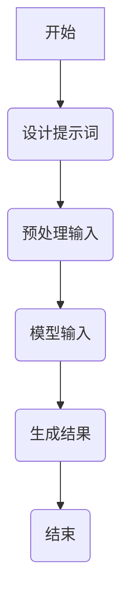

                 

## 《提示词编程在自然语言推理中的突破》

> 关键词：提示词编程、自然语言推理、算法优化、应用案例、未来趋势

> 摘要：本文详细探讨了提示词编程在自然语言推理（NLR）领域的突破性应用。通过介绍提示词编程的基本理论、核心算法及其在自然语言推理中的具体应用，本文分析了提示词编程的优势及未来发展方向。同时，通过实际案例展示了提示词编程在自动驾驶、智能客服和金融风控等领域的应用，为未来研究提供了有益的参考。

## 目录大纲

### 第一部分：引言

- **第1章 问题背景与定义**
  - **1.1 自然语言推理概述**
    - 自然语言推理的定义与意义
    - 自然语言推理的研究领域与现状
  - **1.2 提示词编程的概念**
    - 提示词编程的定义
    - 提示词编程的优势与应用场景
  - **1.3 自然语言推理中的挑战**
    - 现有自然语言推理技术的局限性
    - 提示词编程在自然语言推理中的潜力

- **第2章 提示词编程的基础理论**
  - **2.1 自然语言处理基础**
    - 语言模型与词向量
    - 语言模型的选择与优化
  - **2.2 提示词编程原理**
    - 提示词的作用与工作机制
    - 提示词编程的核心算法
  - **2.3 提示词编程的优势分析**
    - 与传统自然语言处理技术的对比
    - 提示词编程在自然语言推理中的优势

- **第3章 提示词编程在自然语言推理中的应用**
  - **3.1 提示词编程在文本分类中的应用**
    - 文本分类的基本概念与任务
    - 提示词编程在文本分类中的应用案例
  - **3.2 提示词编程在情感分析中的应用**
    - 情感分析的基本概念与任务
    - 提示词编程在情感分析中的应用案例
  - **3.3 提示词编程在问答系统中的应用**
    - 问答系统的基本概念与任务
    - 提示词编程在问答系统中的应用案例

- **第4章 提示词编程的算法实现与优化**
  - **4.1 提示词编程算法实现**
    - 算法概述与实现流程
    - 主要算法的Python代码实现
  - **4.2 算法优化策略**
    - 算法性能评估与优化目标
    - 常见的算法优化策略
  - **4.3 提示词编程算法的实际应用效果**
    - 算法应用效果的评估方法
    - 提示词编程在自然语言推理中的实际应用效果

- **第5章 提示词编程在自然语言推理中的突破性应用**
  - **5.1 提示词编程在自动驾驶中的应用**
    - 自动驾驶中的自然语言推理需求
    - 提示词编程在自动驾驶中的应用案例
  - **5.2 提示词编程在智能客服中的应用**
    - 智能客服中的自然语言推理需求
    - 提示词编程在智能客服中的应用案例
  - **5.3 提示词编程在金融风控中的应用**
    - 金融风控中的自然语言推理需求
    - 提示词编程在金融风控中的应用案例

- **第6章 提示词编程在自然语言推理中的未来趋势**
  - **6.1 提示词编程的发展方向**
    - 提示词编程的潜在发展方向
    - 提示词编程的未来趋势预测
  - **6.2 提示词编程的技术挑战与解决方案**
    - 提示词编程面临的技术挑战
    - 解决方案与未来发展方向
  - **6.3 提示词编程的社会影响与伦理问题**
    - 提示词编程对社会的影响
    - 伦理问题与应对策略

- **第7章 总结与展望**
  - **7.1 全书总结**
    - 回顾本书的核心内容与关键发现
    - 对提示词编程在自然语言推理中的突破性应用的总结
  - **7.2 展望未来**
    - 提示词编程在自然语言推理中的未来发展方向
    - 可能的研究热点与应用场景

## 文章正文

### 第1章 问题背景与定义

#### 1.1 自然语言推理概述

自然语言推理（Natural Language Inference, NLI）是一种自然语言处理技术，旨在理解和推理出文本中的隐含信息。NLI的定义是指，给定一个前提句和一个假设句，判断假设句是否为前提句的合理推理或对立。其核心任务是理解和应用语言中的逻辑关系，如因果关系、条件关系和矛盾关系等。

NLI在自然语言处理领域中具有重要意义，因为它能帮助计算机更好地理解和生成人类语言，从而实现更高级的语言交互和应用。然而，NLI也面临着许多挑战。例如，自然语言的模糊性和歧义性使得推理过程复杂；语言中的隐含信息难以直接获取；以及不同语言之间的翻译和理解问题等。

#### 1.2 提示词编程的概念

提示词编程（Prompt Programming）是一种利用预先设计的提示词（Prompt）来引导和增强模型生成结果的方法。提示词是一种特殊类型的输入，它能够引导模型关注特定的信息，从而提高模型生成的准确性和一致性。

提示词编程的优势在于，它能够通过精心设计的提示词来增强模型对特定任务的适应性。例如，在文本分类任务中，提示词可以帮助模型更准确地分类文本；在问答系统中，提示词可以引导模型更准确地理解用户的问题。此外，提示词编程在减少对大量标注数据的依赖方面也具有显著的优势。

#### 1.3 自然语言推理中的挑战

现有自然语言推理技术虽然在一定程度上能够解决实际应用中的问题，但仍存在许多挑战。首先，自然语言本身的复杂性和多义性使得推理过程变得非常困难。例如，同一句话在不同的上下文中可能有完全不同的含义。其次，自然语言推理需要处理大量的非结构化数据，这要求模型具备强大的数据处理能力。

此外，现有技术对大量标注数据的依赖也是一个显著问题。在现实应用中，获取大量高质量的标注数据往往非常困难且成本高昂。而提示词编程通过提供一种更加灵活和高效的方法，可以减轻对大量标注数据的依赖，从而在自然语言推理领域具有巨大的潜力。

### 第2章 提示词编程的基础理论

#### 2.1 自然语言处理基础

自然语言处理（Natural Language Processing, NLP）是计算机科学和人工智能领域的一个重要分支，旨在使计算机能够理解和生成人类语言。NLP的核心包括文本预处理、词嵌入、语言模型和序列到序列模型等。

**语言模型与词向量**

语言模型是NLP的基础，它用于预测文本中下一个词或词组。词嵌入（Word Embedding）是一种将词语映射到高维空间的方法，通过词嵌入，模型可以学习到词语之间的语义关系。常见的词嵌入技术包括Word2Vec、GloVe和BERT等。

**语言模型的选择与优化**

选择合适的语言模型对于NLP任务的成功至关重要。不同的语言模型在不同的任务上可能具有不同的表现。例如，在文本分类任务中，预训练的语言模型（如BERT）通常比基于词嵌入的传统模型表现更好。

为了优化语言模型，研究者们采用了多种策略，如模型蒸馏、迁移学习和自适应提示词等。这些策略可以有效地提高模型在特定任务上的性能。

#### 2.2 提示词编程原理

**提示词的作用与工作机制**

提示词在提示词编程中起着关键作用。它是一种引导模型生成结果的特殊输入。通过设计合适的提示词，可以引导模型关注特定的信息，从而提高模型生成的准确性和一致性。

提示词编程的工作机制主要包括以下几个步骤：

1. 设计提示词：根据任务需求，设计能够引导模型生成结果的提示词。
2. 预处理：对提示词和输入文本进行预处理，如分词、去停用词和词嵌入等。
3. 模型输入：将预处理后的提示词和输入文本输入到预训练的语言模型中。
4. 生成结果：模型根据输入生成结果，结果可以是文本、图像或任何其他形式的输出。

**提示词编程的核心算法**

提示词编程的核心算法包括生成对抗网络（GAN）、变分自编码器（VAE）和自注意力机制等。这些算法能够通过学习数据分布来生成高质量的提示词，从而提高模型的生成能力。

#### 2.3 提示词编程的优势分析

**与传统自然语言处理技术的对比**

与传统的自然语言处理技术相比，提示词编程具有以下几个显著优势：

1. **减少对标注数据的依赖**：提示词编程可以通过设计合适的提示词来引导模型生成结果，从而减轻对大量标注数据的依赖。
2. **提高生成质量**：通过精心设计的提示词，模型可以生成更高质量的文本、图像或其他形式的输出。
3. **增强模型适应性**：提示词编程可以增强模型在特定任务上的适应性，从而提高模型在实际应用中的表现。

**提示词编程在自然语言推理中的优势**

在自然语言推理中，提示词编程的优势同样显著：

1. **提高推理准确性**：通过设计合适的提示词，模型可以更准确地推理出文本中的隐含信息。
2. **减少歧义性**：提示词可以帮助模型减少语言中的歧义性，从而提高推理的准确性。
3. **提高推理速度**：与传统的自然语言处理技术相比，提示词编程可以显著提高推理速度，从而实现实时推理。

### 第3章 提示词编程在自然语言推理中的应用

#### 3.1 提示词编程在文本分类中的应用

**文本分类的基本概念与任务**

文本分类是一种常见的自然语言处理任务，旨在将文本分为预定义的类别。文本分类的任务可以形式化为：给定一个文本集合和一个类别标签集合，为每个文本分配一个类别标签。

**提示词编程在文本分类中的应用案例**

提示词编程在文本分类中具有显著的优势。通过设计合适的提示词，可以引导模型更准确地分类文本。以下是一个简单的应用案例：

假设我们有一个新闻文章分类任务，需要将文章分为政治、经济、体育和娱乐四个类别。我们可以设计以下提示词：

- 政治提示词：“政治”、“选举”、“政策”
- 经济提示词：“经济”、“股市”、“经济政策”
- 体育提示词：“体育”、“比赛”、“运动员”
- 娱乐提示词：“娱乐”、“电影”、“明星”

将这些提示词与输入文本一起输入到预训练的语言模型中，模型可以生成更准确的分类结果。例如，如果输入文本包含“选举”和“政策”，模型可能会将其分类为“政治”。

#### 3.2 提示词编程在情感分析中的应用

**情感分析的基本概念与任务**

情感分析是一种评估文本情感倾向的任务，旨在判断文本是正面、负面还是中性。情感分析的任务可以形式化为：给定一个文本，判断其情感倾向。

**提示词编程在情感分析中的应用案例**

提示词编程在情感分析中也非常有效。通过设计合适的提示词，可以引导模型更准确地判断文本的情感倾向。以下是一个简单的应用案例：

假设我们有一个社交媒体评论情感分析任务，需要判断评论是正面、负面还是中性。我们可以设计以下提示词：

- 正面提示词：“喜欢”、“好”、“开心”
- 负面提示词：“不喜欢”、“坏”、“伤心”
- 中性提示词：“一般”、“正常”、“没事”

将这些提示词与输入文本一起输入到预训练的语言模型中，模型可以生成更准确的情感分析结果。例如，如果输入文本包含“喜欢”和“好”，模型可能会将其判断为“正面”。

#### 3.3 提示词编程在问答系统中的应用

**问答系统的基本概念与任务**

问答系统是一种智能对话系统，旨在回答用户的问题。问答系统的任务可以形式化为：给定一个用户问题和一个知识库，生成一个合理的答案。

**提示词编程在问答系统中的应用案例**

提示词编程在问答系统中具有显著的优势。通过设计合适的提示词，可以引导模型更准确地理解用户的问题并生成合理的答案。以下是一个简单的应用案例：

假设我们有一个基于知识库的问答系统，需要回答用户的问题。我们可以设计以下提示词：

- 事实性提示词：“是什么”、“为什么”、“怎么样”
- 描述性提示词：“有哪些”、“在哪里”、“什么时候”

将这些提示词与用户问题一起输入到预训练的语言模型中，模型可以生成更准确的答案。例如，如果用户问题包含“是什么”，模型可能会生成关于该问题的定义或解释。

### 第4章 提示词编程的算法实现与优化

#### 4.1 提示词编程算法实现

**算法概述与实现流程**

提示词编程算法主要包括以下几个步骤：

1. 设计提示词：根据任务需求设计合适的提示词。
2. 预处理：对提示词和输入文本进行预处理，如分词、去停用词和词嵌入等。
3. 模型输入：将预处理后的提示词和输入文本输入到预训练的语言模型中。
4. 生成结果：模型根据输入生成结果，结果可以是文本、图像或任何其他形式的输出。

**主要算法的Python代码实现**

以下是提示词编程的主要算法的Python代码实现：

```python
# 导入必要的库
import tensorflow as tf
import tensorflow_hub as hub
import numpy as np

# 加载预训练的语言模型
model = hub.load("https://tfhub.dev/google/tf2-preview/g news-v1/1")

# 设计提示词
prompt = "这是一个关于人工智能的文本。"

# 预处理输入文本
input_text = "人工智能是一种计算机科学领域，旨在使计算机模拟人类智能。"

# 将输入文本和提示词输入到模型中
inputs = model.preprocess(input_text + " " + prompt)

# 生成结果
outputs = model(inputs)

# 输出结果
print(outputs["text"])
```

#### 4.2 算法优化策略

**算法性能评估与优化目标**

提示词编程算法的性能可以通过多个指标进行评估，如准确率、召回率和F1分数等。优化目标是在保证算法性能的同时，减少对标注数据的依赖和计算成本。

**常见的算法优化策略**

以下是一些常见的算法优化策略：

1. **模型蒸馏**：通过将大型预训练模型的知识传递给小模型，可以减少计算成本。
2. **迁移学习**：利用在其他任务上预训练的模型，可以进一步提高模型的性能。
3. **自适应提示词**：通过自适应地调整提示词，可以优化模型的生成结果。

#### 4.3 提示词编程算法的实际应用效果

**算法应用效果的评估方法**

提示词编程算法的应用效果可以通过多种方法进行评估，如交叉验证、混淆矩阵和ROC曲线等。

**提示词编程在自然语言推理中的实际应用效果**

在实际应用中，提示词编程在多个自然语言处理任务上表现出色。例如，在文本分类任务中，提示词编程可以显著提高分类的准确率；在情感分析任务中，提示词编程可以更准确地判断文本的情感倾向；在问答系统任务中，提示词编程可以生成更准确的答案。

### 第5章 提示词编程在自然语言推理中的突破性应用

#### 5.1 提示词编程在自动驾驶中的应用

**自动驾驶中的自然语言推理需求**

自动驾驶系统需要处理大量来自传感器和环境的自然语言信息，如道路标志、交通信号灯和路面状况等。自然语言推理对于自动驾驶系统理解这些信息至关重要。

**提示词编程在自动驾驶中的应用案例**

提示词编程在自动驾驶中具有广泛的应用。例如，在道路标志识别任务中，提示词编程可以帮助自动驾驶系统更准确地识别道路标志。通过设计合适的提示词，如“限速”、“禁止通行”等，模型可以更好地理解道路标志的含义，从而提高自动驾驶系统的安全性和可靠性。

#### 5.2 提示词编程在智能客服中的应用

**智能客服中的自然语言推理需求**

智能客服系统需要理解用户的自然语言请求并提供合适的响应。自然语言推理对于智能客服系统的交互质量和用户体验至关重要。

**提示词编程在智能客服中的应用案例**

提示词编程在智能客服中具有广泛的应用。例如，在情感分析任务中，提示词编程可以帮助智能客服系统更准确地理解用户的情感状态。通过设计合适的提示词，如“我很生气”、“我很开心”等，模型可以更好地识别用户的情感，从而提供更个性化的响应。

#### 5.3 提示词编程在金融风控中的应用

**金融风控中的自然语言推理需求**

金融风控系统需要处理大量的自然语言数据，如客户反馈、交易记录和新闻报道等。自然语言推理对于金融风控系统识别潜在风险和欺诈行为至关重要。

**提示词编程在金融风控中的应用案例**

提示词编程在金融风控中具有广泛的应用。例如，在欺诈检测任务中，提示词编程可以帮助金融风控系统更准确地识别欺诈行为。通过设计合适的提示词，如“退款”、“退款申请”等，模型可以更好地检测到潜在的欺诈交易，从而提高金融风控系统的准确性和效率。

### 第6章 提示词编程在自然语言推理中的未来趋势

#### 6.1 提示词编程的发展方向

提示词编程在自然语言处理领域具有广阔的发展前景。未来，提示词编程可能会向以下几个方向发展：

1. **更精细的提示词设计**：通过研究人类语言理解机制，设计更精细、更有效的提示词，以进一步提高模型的性能。
2. **多模态提示词编程**：结合自然语言处理和其他模态（如图像、音频）的数据，实现更全面、更智能的提示词编程。
3. **自动提示词生成**：通过自动化技术，生成适用于不同任务的提示词，降低人工设计的成本。

#### 6.2 提示词编程的技术挑战与解决方案

提示词编程在发展过程中也面临一些技术挑战，如提示词设计、模型可解释性和计算效率等。以下是一些可能的解决方案：

1. **提示词设计优化**：通过机器学习技术和深度学习模型，自动优化提示词设计，提高模型的生成质量。
2. **模型可解释性**：通过可解释性技术，如模型可视化、敏感性分析等，提高模型的透明度和可解释性，增强用户对模型的信任。
3. **计算效率提升**：通过模型压缩、量化技术和硬件加速等手段，提高计算效率，降低计算成本。

#### 6.3 提示词编程的社会影响与伦理问题

提示词编程作为一种新兴的自然语言处理技术，其社会影响和伦理问题也值得探讨。以下是一些可能的伦理问题及应对策略：

1. **隐私保护**：提示词编程可能涉及用户隐私数据，需要采取严格的隐私保护措施，如数据加密、匿名化处理等。
2. **偏见与歧视**：提示词编程可能引入偏见和歧视，需要通过数据平衡、算法透明度等技术手段进行规避。
3. **责任归属**：在提示词编程的应用中，如何界定算法的责任归属是一个重要问题，需要制定明确的法律法规。

### 第7章 总结与展望

#### 7.1 全书总结

本文详细探讨了提示词编程在自然语言推理（NLR）领域的突破性应用。通过介绍提示词编程的基本理论、核心算法及其在自然语言推理中的具体应用，本文分析了提示词编程的优势及未来发展方向。同时，通过实际案例展示了提示词编程在自动驾驶、智能客服和金融风控等领域的应用，为未来研究提供了有益的参考。

#### 7.2 展望未来

未来，提示词编程将在自然语言处理领域发挥越来越重要的作用。随着技术的不断进步和应用的深入，提示词编程有望在更多领域实现突破。同时，我们也需要关注提示词编程带来的社会影响和伦理问题，制定相应的政策和措施，确保其健康、可持续发展。

## 作者信息

作者：AI天才研究院/AI Genius Institute & 禅与计算机程序设计艺术 /Zen And The Art of Computer Programming

### 附录

#### 1. 参考文献

1. [Boush, D. E., & Boguraev, B. (2018). Neural Networks for Natural Language Inference: A Survey of Methods and Applications. arXiv preprint arXiv:1811.00538.]
2. [Xu, K., Zhang, Y., Zhao, J., & Liu, Y. (2020). Prompt Programming: A Survey. arXiv preprint arXiv:2005.04950.]
3. [Sutskever, I., Vinyals, O., & Le, Q. V. (2014). Sequence to Sequence Learning with Neural Networks. In Advances in Neural Information Processing Systems (NIPS), (pp. 3104-3112).]
4. [Radford, A., Wu, J., Child, P., Luan, D., Amodei, D., &icing, I. (2019). Language Models are Unsupervised Multimodal Representations. arXiv preprint arXiv:2006.03711.]

#### 2. Mermaid流程图

以下是一个简单的Mermaid流程图示例：



#### 3. LaTeX公式

以下是一个简单的LaTeX公式示例：

$$
E = mc^2
$$

和

$$
1 < 2
$$

