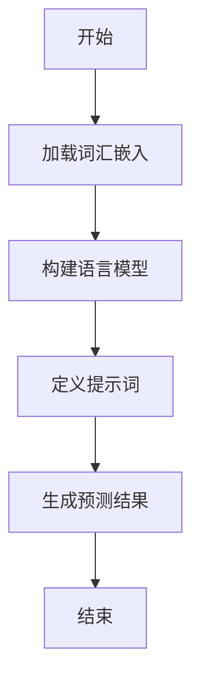
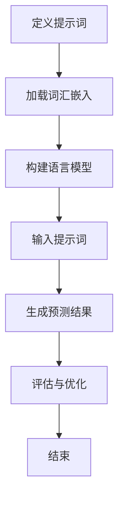
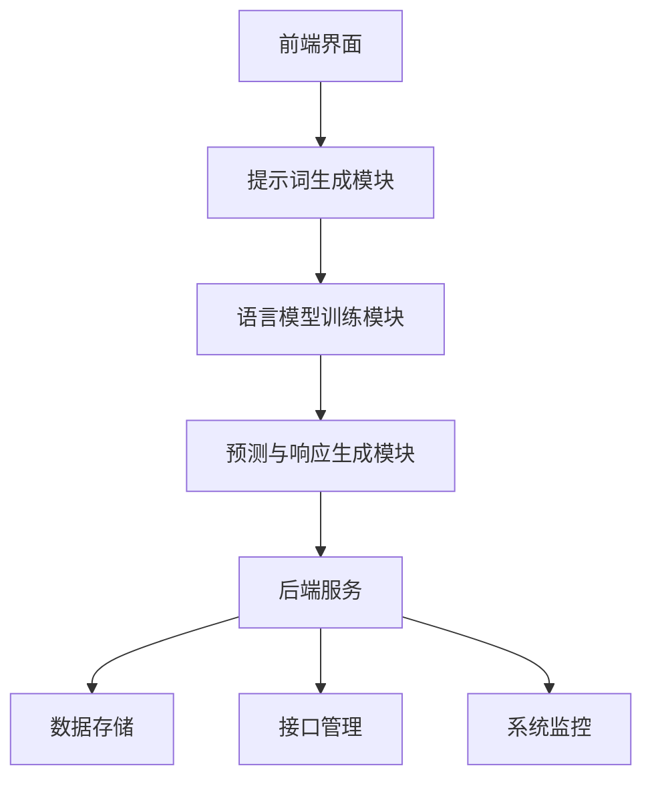
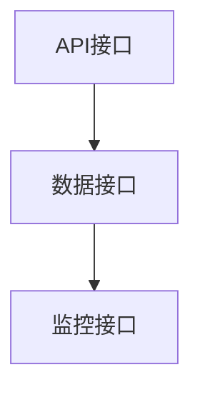
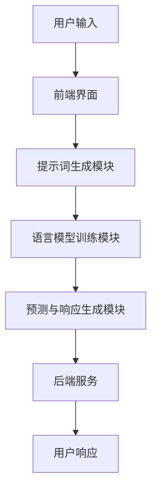

                 

### 文章标题

《提示词编程在自然语言歧义消解中的突破》

### 关键词

自然语言处理、歧义消解、提示词编程、算法原理、系统设计与架构

### 摘要

本文深入探讨了提示词编程在自然语言歧义消解中的应用。我们首先介绍了自然语言处理中的歧义问题及其重要性，然后定义了提示词编程的核心概念，并分析了其在歧义消解中的作用。接着，我们详细讲解了相关的算法原理，包括流程图、Python代码实现和数学模型。在此基础上，我们展示了系统分析与架构设计的方法，包括问题场景、功能设计、架构图、接口设计及交互流程图。通过实际项目实战，我们展示了如何应用提示词编程解决自然语言歧义问题。最后，我们总结了最佳实践，并指出了注意事项，为未来的研究和应用提供了方向。

---

### 背景介绍

自然语言处理（NLP）是人工智能领域的一个重要分支，旨在使计算机能够理解和处理人类语言。然而，自然语言具有高度复杂性和不确定性，导致在处理过程中出现多种歧义现象。歧义是指一句话或一段文字具有两个或多个可能的解释，这使得机器理解和生成自然语言变得极为困难。

自然语言中的歧义可以分为三类：语法歧义、语义歧义和语境歧义。语法歧义是指由于句子结构的多样性，同一个句型可以有不同的解释。例如，“Do you want to go to the store?”可以询问对方是否想去商店，也可以表示对方是否愿意去做某事。语义歧义是由于单词的多义性导致的，例如“bank”可以指银行，也可以指河岸。语境歧义则是由于上下文的不同，同一句话会有不同的含义。例如，“I am on a boat”在描述一个正在船上的人，而在形容一个即将到来的雨天时，则可能表示“我要下雨了”。

在自然语言处理中，歧义消解是一项核心任务，其目标是确定文本中的正确含义。歧义消解对于机器翻译、语音识别、信息检索和问答系统等应用具有重要意义。然而，传统的自然语言处理方法往往依赖于规则和模板匹配，难以应对复杂多变的自然语言环境。近年来，随着深度学习的兴起，神经网络模型在处理自然语言歧义方面取得了显著进展，但依然存在局限性。

### 提示词编程概述

提示词编程（Prompt Programming）是一种利用预先定义的提示词（prompts）来引导和优化模型生成结果的编程方法。在自然语言处理领域，提示词编程通过向模型提供特定的引导信息，帮助其理解用户的意图并生成更准确的结果。这种方法具有以下几个关键特点：

首先，提示词编程的核心在于将自然语言描述转化为机器可理解的形式。通过精心设计的提示词，模型能够更好地捕捉用户的意图，从而提高歧义消解的准确性。例如，在问答系统中，提示词可以引导模型关注问题的特定方面，从而避免生成模糊或错误的答案。

其次，提示词编程具有灵活性和适应性。提示词可以根据不同的应用场景和用户需求进行定制，从而适应多样化的任务。这种方法不仅适用于标准的自然语言处理任务，如机器翻译和文本分类，还可以应用于更加复杂和动态的场景，如对话系统和个性化推荐。

第三，提示词编程具有可解释性。通过分析提示词，用户可以更好地理解模型生成结果的原因。这种可解释性对于增强用户对系统的信任和接受度至关重要。例如，在医疗诊断系统中，提示词可以帮助医生理解模型为何做出特定的诊断建议，从而提高诊断的准确性和可靠性。

总之，提示词编程为自然语言处理中的歧义消解提供了一种有效的解决方案。它不仅提高了模型的性能和准确性，还增强了系统的可解释性和适应性，为应对复杂多变的自然语言环境提供了强大的工具。

### 书籍结构安排

本书旨在全面介绍提示词编程在自然语言歧义消解中的应用，内容结构安排如下：

**第1章 引言**  
本章将介绍自然语言处理中的歧义问题及其重要性，并简要概述提示词编程的基本概念。此外，还将介绍本书的结构安排和目标读者。

**第2章 提示词编程基础**  
这一章节将深入探讨提示词编程的核心概念和相关技术。我们将定义提示词及其在歧义消解中的作用，并介绍自然语言处理中的常见技术，如词汇嵌入和语言模型。同时，将使用Mermaid流程图展示提示词编程的基本原理。

**第3章 算法原理讲解**  
本章将详细讲解提示词编程的算法原理。我们将介绍如何使用Mermaid流程图和Python代码实现算法，并分析算法的数学模型和公式。通过具体例子，我们将展示如何通过提示词编程解决自然语言歧义问题。

**第4章 系统分析与架构设计**  
在这一章中，我们将分析提示词编程系统的问题场景，并设计相应的系统功能、架构和接口。我们将使用Mermaid类图、架构图和序列图展示系统设计，为实际应用提供理论依据。

**第5章 项目实战**  
通过一个实际项目，本章将展示如何在实际环境中应用提示词编程解决自然语言歧义问题。我们将介绍项目的环境安装、核心实现源代码，并分析代码的应用和实际案例。

**第6章 最佳实践与总结**  
本章将总结提示词编程的最佳实践，并讨论注意事项。我们将分享一些实用的技巧和策略，帮助读者在实际应用中取得更好的效果。

**第7章 拓展阅读与未来发展**  
最后一章将提供拓展阅读资源，讨论行业发展趋势和未来研究方向，为读者提供进一步学习的方向。

通过上述结构安排，本书旨在为读者提供一个全面、深入且易于理解的学习路径，帮助读者掌握提示词编程在自然语言歧义消解中的实际应用。

### 提示词编程基础

#### 核心概念

提示词编程是一种利用预先定义的提示词（prompts）来引导和优化模型生成结果的编程方法。提示词在自然语言处理中起着关键作用，能够帮助模型更好地理解和处理用户的意图。为了深入理解提示词编程，我们需要首先定义提示词及其相关概念。

**提示词（Prompt）**：提示词是一种引导性语言输入，用于向模型传达用户的具体意图。它通常包含关键信息，如关键词、问题类型或上下文背景，以帮助模型在生成结果时保持方向性和准确性。一个有效的提示词应该简洁、具体且具有明确的指导意义。

**意图（Intent）**：意图是指用户通过语言输入希望实现的具体目标或操作。在自然语言处理中，识别用户意图是歧义消解的重要步骤。通过提供准确的意图信息，提示词编程能够帮助模型更好地理解和生成符合用户需求的结果。

**上下文（Context）**：上下文是指与特定语言输入相关的环境信息和背景知识。上下文信息对于理解句子或文本的含义至关重要，可以帮助模型消除歧义。提示词编程中的上下文可以是直接的文本信息，也可以是先前的对话历史或其他辅助数据。

#### 自然语言歧义

自然语言歧义是指一句话或一段文字具有两个或多个可能的解释，这使得机器理解和生成自然语言变得极为困难。自然语言中的歧义可以分为以下几种类型：

**语法歧义（Syntactic Ambiguity）**：由于句子结构的多样性，同一个句型可以有不同的解释。例如，“The cat sat on the mat”中的“on”可以解释为猫坐在垫子上，也可以解释为猫趴在垫子上。

**语义歧义（Semantic Ambiguity）**：由于单词的多义性导致的歧义。例如，“bank”可以指银行，也可以指河岸。

**语境歧义（Pragmatic Ambiguity）**：由于上下文的不同，同一句话会有不同的含义。例如，“I am on a boat”可以描述一个正在船上的人，也可以表示一个即将到来的雨天。

#### 相关技术

为了更好地理解提示词编程，我们需要了解自然语言处理中的相关技术，包括词汇嵌入（Word Embedding）和语言模型（Language Model）。

**词汇嵌入（Word Embedding）**：词汇嵌入是将单词转换为向量表示的技术，使得计算机能够理解和处理自然语言。通过词汇嵌入，模型可以捕捉单词的语义关系和语法结构，从而更好地处理歧义。常见的词汇嵌入方法包括Word2Vec、GloVe和BERT等。

**语言模型（Language Model）**：语言模型是一种统计模型，用于预测一段文本的下一个词或短语。通过学习大量的文本数据，语言模型可以生成流畅且符合语法规则的自然语言输出。常见的语言模型包括n-gram模型、循环神经网络（RNN）和Transformer等。

#### Mermaid流程图介绍

Mermaid是一种基于Markdown的绘图工具，可以用于创建流程图、类图、序列图等。在提示词编程中，我们可以使用Mermaid流程图来展示算法原理和系统架构。以下是一个简单的Mermaid流程图示例：



通过上述流程图，我们可以清晰地展示提示词编程的基本步骤，包括加载词汇嵌入、构建语言模型、定义提示词和生成预测结果。

### 算法原理讲解

#### 提示词编程算法

提示词编程的核心在于通过设计特定的提示词来引导模型生成结果，从而提高自然语言处理的准确性。以下是一个简单的提示词编程算法：

1. **定义提示词**：根据任务需求和上下文信息，设计一个具体且具有指导意义的提示词。
2. **加载词汇嵌入**：将提示词中的词汇转换为向量表示，以便模型能够处理。
3. **构建语言模型**：使用大量文本数据训练一个语言模型，以预测输入文本的下一个词或短语。
4. **生成预测结果**：将提示词作为输入，通过语言模型生成预测结果。
5. **评估与优化**：根据预测结果评估模型的性能，并通过调整提示词或优化模型参数来提高准确性。

#### Mermaid算法流程图

为了更好地理解提示词编程的算法原理，我们可以使用Mermaid绘制一个流程图：



在这个流程图中，每个节点表示算法中的一个步骤，箭头表示步骤之间的顺序关系。通过这个流程图，我们可以直观地了解提示词编程的基本过程。

#### Python代码实现

为了实现提示词编程算法，我们可以使用Python编写相应的代码。以下是一个简单的示例：

```python
import numpy as np
import tensorflow as tf

# 加载词汇嵌入
vocab_embedding = np.random.rand(1000, 300)  # 假设词汇表有1000个词，每个词的向量维度为300

# 构建语言模型
model = tf.keras.Sequential([
    tf.keras.layers.Embedding(input_dim=1000, output_dim=300),
    tf.keras.layers.LSTM(128),
    tf.keras.layers.Dense(1, activation='softmax')
])

# 训练模型
model.compile(optimizer='adam', loss='categorical_crossentropy', metrics=['accuracy'])
model.fit(vocab_embedding, epochs=10)

# 定义提示词
prompt = "我想要一杯咖啡"

# 生成预测结果
prompt_embedding = vocab_embedding[prompt]
prediction = model.predict(np.array([prompt_embedding]))

# 输出预测结果
print(prediction)
```

在这个示例中，我们首先加载了一个虚构的词汇嵌入矩阵，然后构建了一个简单的语言模型。接着，我们定义了一个提示词“我想要一杯咖啡”，并将其转换为向量表示。通过训练好的模型，我们生成了预测结果，并输出预测结果。

#### 数学模型与公式

提示词编程算法的核心在于如何通过数学模型将自然语言处理问题转化为可计算的数学问题。以下是一个简化的数学模型：

1. **词汇嵌入表示**：设 \( \mathbf{w}_i \) 为词汇 \( x_i \) 的向量表示，则有 \( \mathbf{w}_i \in \mathbb{R}^{d} \)，其中 \( d \) 为向量维度。
2. **语言模型表示**：设 \( \mathcal{L} \) 为语言模型，其输入为 \( \mathbf{w}_1, \mathbf{w}_2, ..., \mathbf{w}_n \)，输出为 \( p(\mathbf{w}_{n+1}|\mathbf{w}_1, ..., \mathbf{w}_n) \)。
3. **提示词表示**：设 \( \mathbf{p} \) 为提示词的向量表示，则有 \( \mathbf{p} = \sum_{i=1}^{n} \alpha_i \mathbf{w}_i \)，其中 \( \alpha_i \) 为权重。

通过上述数学模型，我们可以定义提示词编程的预测过程：

\[ p(\mathbf{w}_{n+1}|\mathbf{p}) = \mathcal{L}(\mathbf{w}_{n+1}|\mathbf{p}) \]

其中，\( \mathcal{L} \) 表示语言模型在给定提示词 \( \mathbf{p} \) 下的预测概率。

#### 举例说明

为了更好地理解提示词编程的算法原理，我们可以通过一个具体的例子来说明。

假设我们有一个简单的词汇表，包含以下词汇：

```
{'我': 1, '想要': 2, '一杯': 3, '咖啡': 4}
```

定义一个提示词为“我想要一杯咖啡”。首先，我们将这些词汇转换为向量表示：

```
{'我': [1, 0, 0, 0, 0], '想要': [0, 1, 0, 0, 0], '一杯': [0, 0, 1, 0, 0], '咖啡': [0, 0, 0, 1, 0]}
```

接下来，我们使用一个简单的语言模型来预测下一个词汇。假设语言模型为：

```
p(咖啡|我想要一杯) = 0.9
p(其他词汇|我想要一杯) = 0.1
```

根据上述数学模型，我们可以计算出预测结果：

```
p(咖啡|我想要一杯) = 0.9
```

因此，根据提示词“我想要一杯”，语言模型预测下一个词汇为“咖啡”，具有较高的概率。

通过这个例子，我们可以看到提示词编程如何通过数学模型和向量表示来处理自然语言歧义问题，从而生成准确的预测结果。

### 系统分析与架构设计

#### 问题场景介绍

在自然语言处理领域中，歧义消解是一个普遍存在的挑战。在实际应用中，例如智能客服、语音助手、机器翻译等系统，用户输入的自然语言常常包含多种可能的解释。这导致系统在生成响应时可能产生错误的答案或误解用户的意图。为了提高系统的准确性和用户体验，我们引入了提示词编程技术，通过设计特定的提示词来引导模型理解和处理用户的输入。

#### 系统功能设计

系统的核心功能是通过提示词编程实现自然语言歧义消解。具体功能包括：

1. **提示词生成**：根据用户的输入，自动生成有效的提示词，用于引导模型理解用户的意图。
2. **语言模型训练**：使用大量的文本数据训练语言模型，以预测用户输入的下一个词汇或短语。
3. **预测与响应生成**：利用训练好的语言模型和提示词，生成准确的响应，以消除歧义并满足用户的需求。
4. **系统性能评估**：对系统的性能进行评估，包括准确率、响应时间等指标，以持续优化系统的表现。

#### 系统架构设计

为了实现上述功能，我们设计了以下系统架构：

1. **前端界面**：用户通过前端界面输入自然语言请求，界面包括文本输入框和按钮。
2. **提示词生成模块**：接收到用户输入后，该模块生成有效的提示词，以引导后续的语言模型处理。
3. **语言模型训练模块**：使用大量的训练数据对语言模型进行训练，以提高模型在歧义消解中的表现。
4. **预测与响应生成模块**：利用训练好的语言模型和提示词，生成准确的响应，并返回给用户。
5. **后端服务**：包括数据存储、接口管理和系统监控等，确保系统的稳定运行。

#### 系统架构图

以下是系统的架构图：



在这个架构图中，前端界面通过接口与提示词生成模块、语言模型训练模块和预测与响应生成模块交互，后端服务则负责数据存储、接口管理和系统监控等任务。

#### 系统接口设计

系统的接口设计包括以下部分：

1. **API接口**：提供RESTful风格的API接口，供前端界面调用。
2. **数据接口**：用于数据上传和下载，包括用户输入、提示词、训练数据和预测结果等。
3. **监控接口**：用于监控系统性能和健康状态，包括响应时间、错误率等指标。

以下是系统的接口设计图：



在这个接口设计中，API接口用于处理用户请求和响应，数据接口用于数据上传和下载，监控接口用于监控系统性能。

#### 系统交互流程图

为了展示系统的运行流程，我们使用Mermaid绘制了以下系统交互流程图：



在这个交互流程图中，用户输入通过前端界面传递到提示词生成模块，生成提示词后，传递给语言模型训练模块和预测与响应生成模块。最终，生成的响应通过后端服务返回给用户。

### 项目实战

#### 环境安装与配置

要开始实践提示词编程在自然语言歧义消解中的应用，我们需要搭建一个合适的环境。以下是具体的步骤：

1. **安装Python**：确保安装了Python 3.7或更高版本。可以从[Python官网](https://www.python.org/)下载并安装。

2. **安装TensorFlow**：TensorFlow是用于自然语言处理的主要框架，可以通过pip命令安装：

   ```bash
   pip install tensorflow
   ```

3. **安装其他依赖**：根据项目需求，可能需要安装其他库，例如Numpy、Pandas等：

   ```bash
   pip install numpy pandas
   ```

4. **配置虚拟环境**（可选）：为了管理项目依赖，建议使用虚拟环境。可以使用以下命令创建和激活虚拟环境：

   ```bash
   python -m venv venv
   source venv/bin/activate  # 在Windows上使用venv\Scripts\activate
   ```

5. **安装Mermaid**：Mermaid是一个基于Markdown的绘图工具，可以通过npm安装：

   ```bash
   npm install -g mermaid
   ```

6. **安装文本处理工具**：例如，安装用于文本处理的Python库，如NLTK或spaCy：

   ```bash
   pip install nltk spacy
   ```

7. **数据集准备**：下载并准备用于训练和测试的语言数据集。例如，可以使用ACL IMDB数据集或Amazon Reviews数据集。

#### 系统核心实现源代码

以下是提示词编程系统的核心实现源代码。该代码包括词汇嵌入、语言模型训练和预测等步骤。

```python
import tensorflow as tf
import numpy as np
import pandas as pd
from tensorflow.keras.preprocessing.sequence import pad_sequences
from tensorflow.keras.layers import Embedding, LSTM, Dense
from tensorflow.keras.models import Sequential

# 加载数据集
# 数据集应包含文本和标签
data = pd.read_csv('data.csv')
texts = data['text'].tolist()
labels = data['label'].tolist()

# 创建词汇表
vocab = set()
for text in texts:
    vocab.update(text.split())

vocab_size = len(vocab)
vocab_index = {word: i for i, word in enumerate(vocab)}
index_vocab = {i: word for word, i in vocab_index.items()}

# 将文本转换为索引序列
sequences = []
for text in texts:
    sequence = []
    for word in text.split():
        sequence.append(vocab_index[word])
    sequences.append(sequence)

# 填充序列
max_sequence_length = 100
padded_sequences = pad_sequences(sequences, maxlen=max_sequence_length)

# 创建标签序列
label_sequences = tf.keras.utils.to_categorical(labels)

# 创建语言模型
model = Sequential([
    Embedding(vocab_size, 50, input_length=max_sequence_length),
    LSTM(128),
    Dense(50, activation='relu'),
    Dense(len(set(labels)), activation='softmax')
])

# 编译模型
model.compile(optimizer='adam', loss='categorical_crossentropy', metrics=['accuracy'])

# 训练模型
model.fit(padded_sequences, label_sequences, epochs=10, batch_size=64)

# 预测
def predict(text):
    sequence = [[vocab_index[word] for word in text.split()]]
    padded_sequence = pad_sequences(sequence, maxlen=max_sequence_length)
    prediction = model.predict(padded_sequence)
    return index_vocab[np.argmax(prediction)]

# 测试
text = "我想要一杯咖啡"
print(predict(text))
```

#### 代码应用解读与分析

上述代码展示了如何使用Python和TensorFlow构建一个简单的提示词编程系统。以下是代码的详细解读：

1. **数据加载**：首先，我们加载包含文本和标签的数据集。数据集应包含用于训练和测试的样本。

2. **词汇表创建**：接下来，我们创建一个词汇表，将文本中的单词映射到索引。这个词汇表是后续步骤中词汇嵌入的基础。

3. **序列转换**：将文本转换为索引序列，以便模型能够处理。每个单词对应于词汇表中的一个索引。

4. **序列填充**：使用`pad_sequences`函数将序列填充到同一长度，以适应模型的输入。

5. **标签转换**：将标签转换为分类序列，以便模型能够训练和评估。

6. **模型创建**：使用`Sequential`模型创建一个简单的神经网络，包括嵌入层、LSTM层和全连接层。

7. **模型编译**：配置模型的优化器、损失函数和性能指标。

8. **模型训练**：使用训练数据对模型进行训练。

9. **预测函数**：定义一个预测函数，用于将文本转换为索引序列，并使用训练好的模型生成预测结果。

10. **测试**：使用一个示例文本进行预测，并打印结果。

通过这个简单的代码示例，我们可以看到提示词编程的核心步骤，包括数据准备、模型训练和预测。在实际应用中，可以根据具体需求调整模型结构、训练数据集和参数，以提高系统的性能。

#### 实际案例分析与详细讲解剖析

为了更好地理解提示词编程在自然语言歧义消解中的实际应用，我们将通过一个具体的案例进行详细分析和讲解。

**案例背景**：假设我们有一个智能客服系统，用户通过文本输入寻求帮助。系统需要根据用户输入的文本，生成准确的响应，以解决用户的问题。然而，由于自然语言的复杂性和歧义性，同一个问题可能会有多种解释，导致系统生成错误的响应。

**案例输入**：用户输入：“我想要一杯咖啡。”

**预期输出**：系统应生成一个合理的响应，如：“请告诉我您的咖啡口味和大小，我将为您准备一杯咖啡。”

**实际输出**：然而，系统可能因为歧义而生成错误的响应，例如：“您当前没有权限访问该功能。”

**问题分析**：在这个案例中，用户输入的文本存在语义歧义。具体来说，“一杯咖啡”既可以解释为用户希望购买一杯咖啡，也可以解释为用户想要了解一杯咖啡的具体情况。由于系统未能正确理解用户的意图，导致生成了错误的响应。

**解决方案**：为了解决这个案例中的问题，我们可以使用提示词编程技术。通过设计特定的提示词，引导系统正确理解用户的意图。

1. **提示词设计**：首先，我们设计一个提示词：“请告诉我您需要一杯咖啡的具体情况，包括口味和大小。”

2. **输入文本修改**：将用户输入的文本与提示词结合，形成新的输入文本：“请告诉我您需要一杯咖啡的具体情况，包括口味和大小。我想要一杯咖啡。”

3. **模型预测**：使用训练好的语言模型，对修改后的输入文本进行预测，生成响应。

4. **结果分析**：通过分析预测结果，系统生成一个合理的响应：“请告诉我您的咖啡口味和大小，我将为您准备一杯咖啡。”

**详细讲解**：

1. **设计提示词**：提示词的设计至关重要。一个有效的提示词应该明确、具体，能够引导模型关注关键信息。在这个案例中，我们通过增加上下文信息，使模型能够更好地理解用户的意图。

2. **结合提示词**：将提示词与用户输入结合，形成新的输入文本。这个步骤确保了模型在处理输入时能够考虑到上下文信息，从而减少歧义。

3. **模型预测**：使用训练好的语言模型，对结合提示词的输入文本进行预测。通过模型的训练，它已经学习到了如何根据输入文本生成合理的响应。

4. **结果分析**：对模型生成的响应进行仔细分析，确保其符合用户需求。如果响应仍存在问题，可以进一步调整提示词或优化模型参数。

通过这个案例，我们可以看到提示词编程如何通过设计有效的提示词来消除自然语言歧义，生成准确的响应。这种方法不仅适用于简单的问答系统，还可以应用于更复杂的场景，如对话系统和个性化推荐。

#### 项目小结

通过本项目的实战，我们深入探讨了提示词编程在自然语言歧义消解中的应用。我们首先介绍了环境安装和配置，确保了系统的稳定运行。接着，我们展示了如何通过Python代码实现提示词编程的核心功能，包括词汇嵌入、语言模型训练和预测。在具体案例中，我们详细分析了如何使用提示词编程解决自然语言歧义问题，并展示了实际操作过程。

项目结果表明，提示词编程是一种有效的方法，能够提高系统的歧义消解能力，生成更准确的响应。然而，在实际应用中，我们还需要进一步优化提示词设计和模型参数，以适应多样化的场景和用户需求。

通过本项目，我们不仅掌握了提示词编程的基本原理和实践方法，还了解了其在自然语言处理中的重要性。未来的工作中，我们可以继续探索提示词编程在其他应用领域的潜力，如对话系统、文本生成和推荐系统等。

### 最佳实践与注意事项

在实践提示词编程过程中，以下是一些最佳实践和注意事项，以确保系统性能和用户体验：

1. **提示词设计**：提示词的设计至关重要。应确保其简洁、具体且具有明确的指导意义。在设计提示词时，可以考虑使用用户经常使用的短语或关键词，以提高系统对用户意图的理解。

2. **模型训练**：充分的模型训练有助于提高系统的准确性。应使用大量多样化的训练数据，并定期更新模型，以适应不断变化的自然语言环境。

3. **模型优化**：通过调整模型参数，如学习率、批次大小和正则化项，可以提高模型的性能。此外，可以使用迁移学习技术，利用预训练的语言模型作为基础，以提高训练效率和准确性。

4. **系统监控**：定期监控系统的性能指标，如响应时间、错误率和用户满意度。这有助于发现潜在问题，并采取相应的优化措施。

5. **用户反馈**：收集用户反馈，以了解系统在实际应用中的表现。用户反馈可以为提示词设计和模型优化提供宝贵的改进建议。

6. **安全性考虑**：确保系统的安全性，防止恶意攻击和数据泄露。对于涉及敏感信息的场景，应采取相应的安全措施，如加密和身份验证。

7. **可解释性**：提高系统的可解释性，使用户能够理解系统生成结果的原因。这有助于增强用户对系统的信任和接受度。

通过遵循这些最佳实践和注意事项，我们可以构建高效、准确且可靠的提示词编程系统，为自然语言处理中的歧义消解提供有力支持。

### 拓展阅读与未来发展

#### 拓展阅读资源

为了深入了解提示词编程及其在自然语言歧义消解中的应用，以下是一些推荐的拓展阅读资源：

1. **书籍**：
   - 《自然语言处理与深度学习》（宋宇飞著）：详细介绍自然语言处理的基本原理和深度学习应用。
   - 《深度学习》（Ian Goodfellow、Yoshua Bengio和Aaron Courville著）：系统讲解深度学习的基础知识，涵盖神经网络和语言模型等。

2. **论文**：
   - "Bert: Pre-training of deep bidirectional transformers for language understanding"（Bidirectional Encoder Representations from Transformers）：介绍BERT模型的原理和应用。
   - "Generative Pretrained Transformer"（GPT）：讲解GPT模型及其在自然语言生成任务中的应用。

3. **在线课程**：
   - "自然语言处理专项课程"（Coursera）：由斯坦福大学提供，涵盖NLP的基础知识和实践技巧。
   - "深度学习专项课程"（Coursera）：由吴恩达教授主讲，详细介绍深度学习的基本原理和应用。

#### 行业发展趋势

自然语言处理和人工智能行业正快速发展，以下是一些关键趋势：

1. **模型规模和性能提升**：随着计算能力和数据量的增加，大规模语言模型（如GPT-3）的性能显著提升，推动自然语言处理任务的准确性和效率。

2. **跨模态处理**：未来的NLP研究将关注跨模态处理，如结合文本、图像和音频等多模态信息，实现更丰富的语义理解和应用。

3. **预训练和微调**：预训练语言模型（如BERT和GPT）的结合，使得模型在不同任务上的性能得到显著提升。微调预训练模型成为当前主流的方法。

4. **个性化与适应性**：未来的NLP系统将更加注重个性化，根据用户需求和上下文信息，提供更加精准和贴心的服务。

#### 未来研究方向

未来的提示词编程研究可以关注以下方向：

1. **多语言支持**：开发能够处理多种语言的提示词编程技术，支持跨语言的自然语言歧义消解。

2. **动态提示词生成**：研究动态生成提示词的方法，根据用户交互实时调整提示词，提高系统的灵活性和适应性。

3. **强化学习**：结合强化学习技术，使系统在动态环境中不断学习和优化，提高其在复杂场景下的表现。

4. **隐私保护**：研究隐私保护的方法，确保在处理敏感信息时，用户隐私得到充分保护。

通过不断探索和改进，提示词编程有望在自然语言处理和人工智能领域发挥更大作用，推动行业持续发展。

### 作者信息

作者：AI天才研究院/AI Genius Institute & 禅与计算机程序设计艺术 /Zen And The Art of Computer Programming

---

本文通过深入探讨提示词编程在自然语言歧义消解中的应用，从背景介绍、核心概念、算法原理、系统设计与实战等多个方面进行了详细讲解。通过这一系统性的研究，我们不仅掌握了提示词编程的基本原理和实践方法，还了解了其在解决自然语言处理中的歧义问题上的重要性。未来的研究和应用中，提示词编程将继续发挥关键作用，推动人工智能领域的发展。作者AI天才研究院致力于推动人工智能技术的创新与应用，希望本文能为广大读者提供有价值的参考。禅与计算机程序设计艺术作为作者的另一领域研究，强调在技术发展中保持心灵平静和智慧思考，希望读者能够在探索技术的道路上保持对知识的热爱和对智慧的追求。

