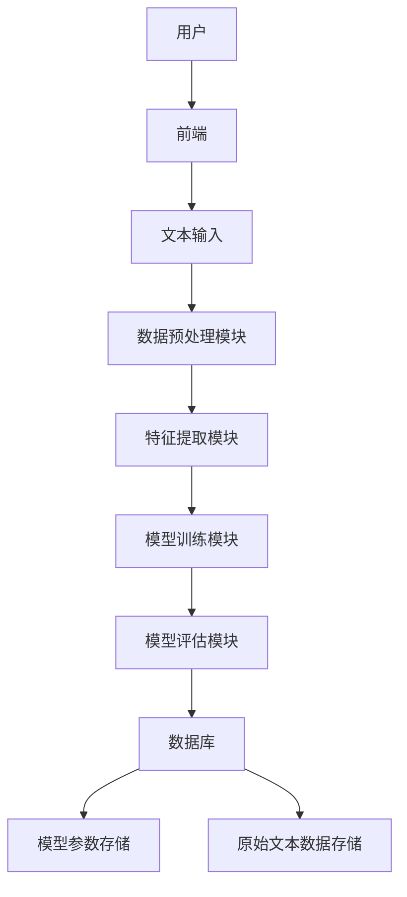
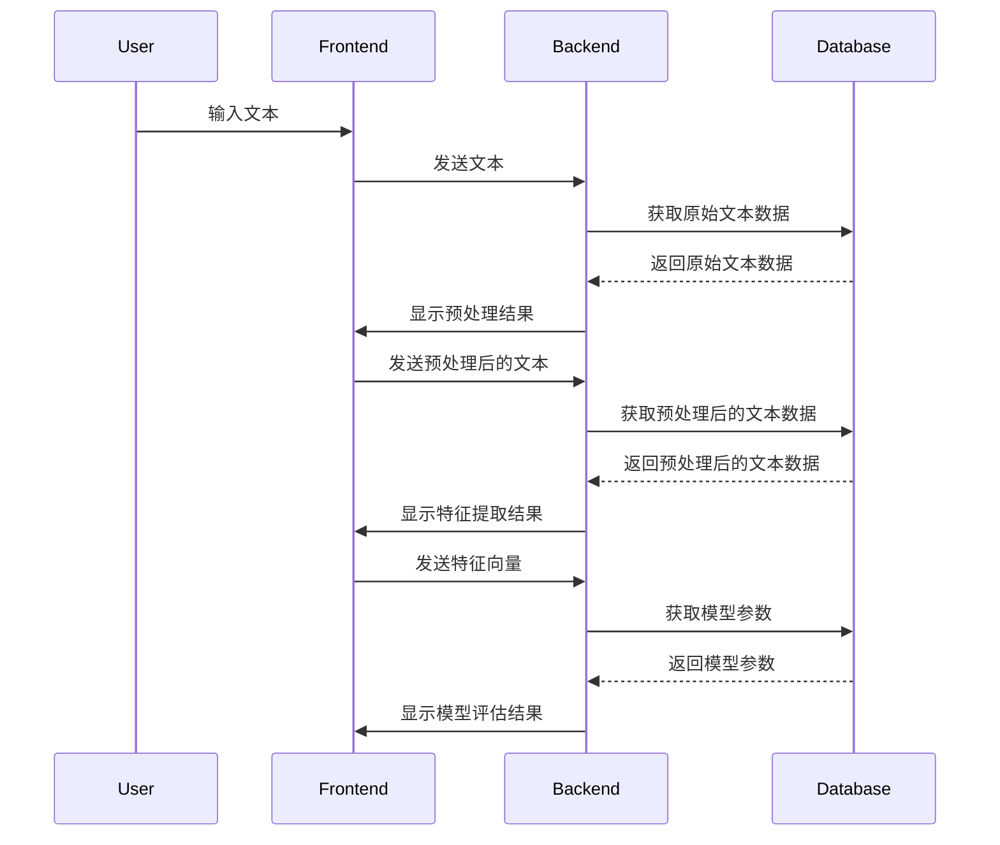

                 

## **文章标题**: 提示词编程在自然语言讽刺检测中的角色

> **关键词**: 提示词编程、自然语言讽刺检测、文本分类、算法原理、数学模型、系统架构

> **摘要**: 本文深入探讨了提示词编程在自然语言讽刺检测中的应用。通过介绍自然语言讽刺检测的背景、核心概念和算法原理，分析提示词编程在这一领域中的关键作用。本文旨在为读者提供一个全面、易懂的视角，以理解提示词编程在自然语言处理中的重要地位。

## **背景介绍**

### **1.1 自然语言讽刺检测概述**

#### **1.1.1 问题背景**

在当今信息时代，自然语言处理（NLP）已成为计算机科学的重要分支。NLP技术广泛应用于搜索引擎、机器翻译、情感分析等多个领域。讽刺作为一种复杂的语言现象，常常出现在日常交流、新闻报道、文学作品等中。然而，讽刺的检测与识别却是一个具有挑战性的问题。讽刺的语义通常不是字面意思，而是通过隐含的语境、修辞手法等方式表达。因此，如何有效地检测和识别自然语言中的讽刺，成为了一个重要的研究课题。

#### **1.1.2 问题描述**

自然语言讽刺检测的目标是：从给定的文本中识别出讽刺性的语句或段落。这需要解决以下几个关键问题：
1. **文本理解**：如何准确地理解文本的含义，包括字面意思和隐含意义。
2. **语境分析**：如何分析文本的上下文，识别出讽刺的语境。
3. **情感分析**：如何判断文本的情感倾向，区分讽刺和其他情感表达。

#### **1.1.3 问题解决**

自然语言讽刺检测问题的解决可以从以下几个方面入手：
1. **数据集构建**：构建一个包含讽刺性文本和对照文本的数据集，用于训练和评估模型。
2. **特征提取**：从文本中提取有助于讽刺检测的特征，如词频、词义、语法结构等。
3. **模型训练**：使用机器学习算法，如文本分类、深度学习等，训练模型进行讽刺检测。

#### **1.1.4 边界与外延**

自然语言讽刺检测不仅涉及到文本的分类问题，还涉及到语义理解和情感分析等复杂任务。因此，其边界和范围相对广泛，包括但不限于：
1. **多语言讽刺检测**：如何在不同语言中检测讽刺。
2. **跨领域讽刺检测**：如何在不同领域（如新闻报道、社交媒体等）中检测讽刺。
3. **动态讽刺检测**：如何检测实时交流中的讽刺。

#### **1.1.5 概念结构与核心要素组成**

自然语言讽刺检测的概念结构包括以下几个核心要素：
1. **文本数据集**：用于训练和评估模型的原始数据。
2. **特征提取器**：从文本中提取有助于讽刺检测的特征。
3. **分类器**：用于判断文本是否为讽刺的模型。
4. **评估指标**：用于评估模型性能的指标，如准确率、召回率等。

## **核心概念与联系**

### **1.2 提示词编程**

#### **1.2.1 提示词编程的定义**

提示词编程（Prompt Programming）是一种基于提示（Prompt）的技术，用于指导或引导计算机程序执行特定的任务。在自然语言处理领域，提示词编程通过提供一组关键词或短语，帮助模型理解任务的上下文，从而提高模型的性能。

#### **1.2.2 提示词编程的特点**

提示词编程具有以下几个特点：
1. **灵活性**：提示词可以根据不同的任务需求进行调整，从而适应不同的应用场景。
2. **高效性**：通过提供明确的提示，模型可以更快地理解任务，提高训练和预测速度。
3. **可解释性**：提示词编程使得模型的决策过程更加透明，有助于理解和优化模型。

#### **1.2.3 提示词编程的应用**

提示词编程在自然语言处理领域有广泛的应用，包括：
1. **文本分类**：通过提供关键词，帮助模型分类文本。
2. **问答系统**：通过提供问题关键词，帮助模型生成答案。
3. **对话系统**：通过提供对话上下文，帮助模型生成自然流畅的回复。

### **1.3 自然语言处理（NLP）**

#### **1.3.1 NLP的定义**

自然语言处理（NLP）是计算机科学和语言学的交叉领域，旨在使计算机能够理解和处理人类语言。NLP的核心任务包括文本分析、语义理解、语音识别等。

#### **1.3.2 NLP的发展历程**

NLP的发展历程可以分为三个阶段：
1. **规则驱动**：早期NLP主要依靠规则和模式匹配，但效果有限。
2. **统计方法**：随着语料库和计算资源的增加，统计方法逐渐成为主流。
3. **深度学习方法**：深度学习在图像识别、语音识别等领域的成功，促使NLP领域也广泛应用深度学习方法。

#### **1.3.3 NLP的关键技术**

NLP的关键技术包括：
1. **分词**：将文本分割成单词或词组。
2. **词性标注**：为每个词分配词性，如名词、动词等。
3. **命名实体识别**：识别文本中的命名实体，如人名、地名等。
4. **句法分析**：分析文本的句法结构，如句子成分、句子关系等。
5. **语义分析**：理解文本的含义，如情感分析、实体关系等。

### **1.4 文本分类**

#### **1.4.1 文本分类的定义**

文本分类（Text Classification）是一种将文本数据分为不同类别的过程。在自然语言讽刺检测中，文本分类用于将文本分为讽刺性文本和非讽刺性文本。

#### **1.4.2 文本分类的重要性**

文本分类在自然语言讽刺检测中具有重要性，原因如下：
1. **初步筛选**：通过文本分类，可以快速筛选出可能的讽刺性文本，提高后续处理的效率。
2. **辅助判断**：文本分类结果可以作为辅助判断，提高讽刺检测的准确性。
3. **多样化应用**：文本分类技术可以应用于多种自然语言处理任务，如垃圾邮件过滤、情感分析等。

#### **1.4.3 文本分类算法**

文本分类算法可以分为以下几类：
1. **基于规则的算法**：通过定义一系列规则，对文本进行分类。
2. **基于统计的算法**：通过统计文本特征，使用机器学习算法进行分类。
3. **基于深度学习的算法**：使用深度学习模型，如卷积神经网络（CNN）、循环神经网络（RNN）等，进行文本分类。

### **1.5 核心概念与联系**

#### **1.5.1 提示词编程与NLP的关系**

提示词编程是NLP的一个重要分支，它通过提供明确的提示，帮助NLP模型更好地理解和处理自然语言。提示词编程与NLP的关系可以概括为：
1. **互补性**：提示词编程补充了NLP模型的上下文信息，提高了模型的性能。
2. **依赖性**：提示词编程依赖于NLP模型的能力，如分词、词性标注等。

#### **1.5.2 提示词编程与文本分类的关系**

提示词编程在文本分类中发挥着重要作用，具体表现为：
1. **任务指导**：提示词编程为文本分类任务提供明确的指导，有助于模型更好地理解任务。
2. **特征增强**：通过提供提示词，可以增强文本的特征表示，提高分类性能。

#### **1.5.3 NLP与文本分类的关系**

NLP是文本分类的基础，文本分类是NLP的重要应用。NLP与文本分类的关系可以概括为：
1. **技术支撑**：NLP技术为文本分类提供了丰富的工具和算法。
2. **目标导向**：文本分类的目标是利用NLP技术，将文本数据划分为不同的类别。

### **1.6 本章小结**

本章介绍了自然语言讽刺检测的背景、核心概念和提示词编程的应用。通过本章的学习，读者可以初步了解自然语言讽刺检测的挑战和解决方案，以及提示词编程在这一领域中的关键作用。下一章将深入探讨自然语言讽刺检测的算法原理，帮助读者进一步理解这一领域的核心技术。## **算法原理讲解**

### **2.1 算法原理概述**

自然语言讽刺检测的算法原理主要涉及以下几个步骤：数据预处理、特征提取、模型训练和模型评估。下面将逐一介绍这些步骤，并使用Mermaid流程图和Python代码进行详细阐述。

### **2.2 数据预处理**

数据预处理是自然语言处理中的关键步骤，其目的是将原始文本数据转换为适合模型训练的格式。具体包括以下步骤：

1. **分词**：将文本分割成单词或短语。
2. **去停用词**：移除对讽刺检测无意义的常见词汇，如“的”、“和”、“是”等。
3. **词性标注**：为每个词分配词性，如名词、动词等。
4. **词嵌入**：将文本转换为固定长度的向量表示。

以下是一个简化的Python代码示例，用于实现数据预处理：

```python
import nltk
from nltk.corpus import stopwords
from nltk.tokenize import word_tokenize
from nltk.stem import WordNetLemmatizer
from keras.preprocessing.text import Tokenizer
from keras.preprocessing.sequence import pad_sequences

# 加载停用词列表
stop_words = set(stopwords.words('english'))

# 分词、去停用词和词性标注
def preprocess_text(text):
    tokens = word_tokenize(text)
    filtered_tokens = [token for token in tokens if token not in stop_words]
    lemmatizer = WordNetLemmatizer()
    lemmatized_tokens = [lemmatizer.lemmatize(token) for token in filtered_tokens]
    return lemmatized_tokens

# 示例文本
text = "This is an example sentence for text preprocessing."

# 数据预处理
preprocessed_text = preprocess_text(text)

# 词嵌入
tokenizer = Tokenizer(num_words=1000)
tokenizer.fit_on_texts([preprocessed_text])
sequences = tokenizer.texts_to_sequences([preprocessed_text])
padded_sequences = pad_sequences(sequences, maxlen=100)
```

### **2.3 特征提取**

特征提取是将预处理后的文本转换为模型可用的特征表示。在自然语言讽刺检测中，常用的特征包括词频、词义、语法结构等。以下是一个使用TF-IDF进行特征提取的示例：

```python
from sklearn.feature_extraction.text import TfidfVectorizer

# 示例文本列表
texts = [
    "This is a sarcastic sentence.",
    "This is a non-sarcastic sentence.",
    # 更多文本
]

# TF-IDF特征提取
vectorizer = TfidfVectorizer()
X = vectorizer.fit_transform(texts)
```

### **2.4 模型训练**

模型训练是自然语言讽刺检测的核心步骤，常用的模型包括基于规则的方法、基于统计的方法和基于深度学习的方法。以下是一个使用卷积神经网络（CNN）进行模型训练的示例：

```python
from keras.models import Sequential
from keras.layers import Conv1D, MaxPooling1D, Flatten, Dense

# 构建CNN模型
model = Sequential()
model.add(Conv1D(filters=128, kernel_size=5, activation='relu', input_shape=(100, X.shape[1])))
model.add(MaxPooling1D(pool_size=5))
model.add(Flatten())
model.add(Dense(units=128, activation='relu'))
model.add(Dense(units=1, activation='sigmoid'))

# 编译模型
model.compile(optimizer='adam', loss='binary_crossentropy', metrics=['accuracy'])

# 模型训练
model.fit(padded_sequences, y, epochs=10, batch_size=32, validation_split=0.2)
```

### **2.5 模型评估**

模型评估是衡量模型性能的重要步骤，常用的评估指标包括准确率、召回率、F1值等。以下是一个使用这些指标评估模型性能的示例：

```python
from sklearn.metrics import accuracy_score, recall_score, f1_score

# 预测
predictions = model.predict(padded_sequences_test)

# 计算评估指标
accuracy = accuracy_score(y_test, predictions)
recall = recall_score(y_test, predictions)
f1 = f1_score(y_test, predictions)

print("Accuracy:", accuracy)
print("Recall:", recall)
print("F1 Score:", f1)
```

### **2.6 本章小结**

本章详细介绍了自然语言讽刺检测的算法原理，包括数据预处理、特征提取、模型训练和模型评估。通过Python代码示例，读者可以更直观地理解每个步骤的实现方法。下一章将深入探讨算法中的数学模型和公式，帮助读者从理论层面理解自然语言讽刺检测的核心原理。## **数学模型和数学公式 & 详细讲解 & 举例说明**

在自然语言讽刺检测中，数学模型和公式扮演着至关重要的角色。这些模型和公式帮助我们量化文本特征，并利用机器学习算法进行模型训练和预测。在本节中，我们将详细探讨自然语言讽刺检测中的常用数学模型和公式，并通过具体例子进行说明。

### **3.1 TF-IDF**

TF-IDF（Term Frequency-Inverse Document Frequency）是一种常用的文本特征提取方法，用于衡量一个词在文档中的重要程度。其公式如下：

\[ TF(t,d) = \frac{f(t,d)}{N} \]
\[ IDF(t,D) = \log \left( \frac{N}{|d_t|} \right) \]
\[ TF-IDF(t,d,D) = TF(t,d) \times IDF(t,D) \]

其中：
- \( f(t,d) \) 是词 \( t \) 在文档 \( d \) 中的词频。
- \( N \) 是文档总数。
- \( |d_t| \) 是包含词 \( t \) 的文档数量。

**例子**：
假设有一个包含两篇文档的数据集，文档 \( d_1 \) 包含词“happy”一次，文档 \( d_2 \) 包含词“happy”两次。文档总数为2。

\[ TF("happy", d_1) = \frac{1}{1} = 1 \]
\[ TF("happy", d_2) = \frac{2}{2} = 1 \]
\[ IDF("happy", D) = \log \left( \frac{2}{2} \right) = \log(1) = 0 \]
\[ TF-IDF("happy", d_1, D) = 1 \times 0 = 0 \]
\[ TF-IDF("happy", d_2, D) = 1 \times 0 = 0 \]

### **3.2 文本分类中的逻辑回归**

逻辑回归是一种常用的文本分类模型，用于预测文本属于某个类别的概率。其公式如下：

\[ P(y=c | x) = \frac{1}{1 + e^{-(\beta_0 + \sum_{i=1}^{n} \beta_i x_i)}} \]

其中：
- \( y \) 是标签，\( c \) 是类别。
- \( x_i \) 是特征向量中的第 \( i \) 个元素。
- \( \beta_0 \) 是截距，\( \beta_i \) 是系数。

**例子**：
假设有一个二元分类问题，类别为“讽刺”和“非讽刺”。特征向量 \( x \) 包含两个特征值，分别为0.5和0.3。

\[ P(y="讽刺" | x) = \frac{1}{1 + e^{-(\beta_0 + \beta_1 \cdot 0.5 + \beta_2 \cdot 0.3)}} \]
\[ P(y="非讽刺" | x) = \frac{1}{1 + e^{-(\beta_0 + \beta_1 \cdot 0.5 + \beta_2 \cdot 0.3)}} \]

通过比较这两个概率，可以判断文本属于哪个类别。

### **3.3 卷积神经网络（CNN）**

卷积神经网络（CNN）在文本分类任务中有着广泛应用。其核心思想是使用卷积操作提取文本特征。CNN的数学公式如下：

\[ h_{ij}^l = \sigma \left( \sum_{k} w_{ik}^l h_{kj}^{l-1} + b_l \right) \]

其中：
- \( h_{ij}^l \) 是第 \( l \) 层的第 \( i \) 个节点。
- \( w_{ik}^l \) 是第 \( l \) 层的第 \( i \) 个节点的权重。
- \( b_l \) 是第 \( l \) 层的偏置。
- \( \sigma \) 是激活函数，如ReLU函数。

**例子**：
假设有一个一层的卷积层，包含3个卷积核，每个卷积核的大小为3x3。输入的特征矩阵为3x3。

\[ h_{11}^1 = \sigma \left( w_{11}^1 \cdot x_{11} + w_{12}^1 \cdot x_{12} + w_{13}^1 \cdot x_{13} + b_1 \right) \]
\[ h_{12}^1 = \sigma \left( w_{11}^1 \cdot x_{12} + w_{12}^1 \cdot x_{13} + w_{13}^1 \cdot x_{14} + b_1 \right) \]
\[ \vdots \]
\[ h_{33}^1 = \sigma \left( w_{11}^1 \cdot x_{33} + w_{12}^1 \cdot x_{34} + w_{13}^1 \cdot x_{35} + b_1 \right) \]

通过卷积操作，可以从原始特征矩阵中提取局部特征，并传递到下一层。

### **3.4 深度学习中的反向传播算法**

深度学习中的反向传播算法是一种用于训练神经网络的优化方法。其核心思想是通过计算损失函数关于模型参数的梯度，更新模型参数，从而优化模型性能。其公式如下：

\[ \delta_j^l = \frac{\partial J}{\partial z_j^l} = \frac{\partial J}{\partial a_j^l} \frac{\partial a_j^l}{\partial z_j^l} \]

\[ w_{ij}^{l+1} = w_{ij}^{l+1} - \alpha \frac{\partial J}{\partial w_{ij}^{l+1}} \]
\[ b_{j}^{l+1} = b_{j}^{l+1} - \alpha \frac{\partial J}{\partial b_{j}^{l+1}} \]

其中：
- \( \delta_j^l \) 是第 \( l \) 层的第 \( j \) 个节点的误差。
- \( J \) 是损失函数。
- \( z_j^l \) 是第 \( l \) 层的第 \( j \) 个节点的输出。
- \( a_j^l \) 是第 \( l \) 层的第 \( j \) 个节点的输入。
- \( w_{ij}^{l+1} \) 和 \( b_{j}^{l+1} \) 是第 \( l+1 \) 层的第 \( i \) 个节点的权重和偏置。
- \( \alpha \) 是学习率。

**例子**：
假设有一个简单的神经网络，包含两层，输入层有3个节点，输出层有1个节点。

\[ \delta_1^2 = \frac{\partial J}{\partial z_1^2} = \frac{\partial J}{\partial a_1^2} \frac{\partial a_1^2}{\partial z_1^2} \]
\[ \delta_2^2 = \frac{\partial J}{\partial z_2^2} = \frac{\partial J}{\partial a_2^2} \frac{\partial a_2^2}{\partial z_2^2} \]
\[ \delta_3^2 = \frac{\partial J}{\partial z_3^2} = \frac{\partial J}{\partial a_3^2} \frac{\partial a_3^2}{\partial z_3^2} \]

\[ w_{11}^{3} = w_{11}^{3} - \alpha \frac{\partial J}{\partial w_{11}^{3}} \]
\[ w_{12}^{3} = w_{12}^{3} - \alpha \frac{\partial J}{\partial w_{12}^{3}} \]
\[ w_{13}^{3} = w_{13}^{3} - \alpha \frac{\partial J}{\partial w_{13}^{3}} \]
\[ b_1^{3} = b_1^{3} - \alpha \frac{\partial J}{\partial b_1^{3}} \]

通过反向传播算法，可以不断更新模型的权重和偏置，从而优化模型的性能。

### **3.5 本章小结**

本章详细介绍了自然语言讽刺检测中的数学模型和公式，包括TF-IDF、逻辑回归、CNN和反向传播算法。通过具体的例子，读者可以更好地理解这些模型和公式的应用。这些数学模型和公式是自然语言讽刺检测的重要基础，为后续的模型训练和预测提供了理论基础。下一章将探讨自然语言讽刺检测的系统分析与架构设计方案，帮助读者从系统层面理解这一领域的实现方法。## **系统分析与架构设计方案**

### **4.1 问题场景介绍**

自然语言讽刺检测在社交媒体分析、新闻编辑和自动内容审核等领域具有重要应用。随着互联网和社交媒体的快速发展，用户生成的内容量呈现爆炸式增长，如何有效地识别和过滤讽刺性内容成为了一个挑战。因此，设计一个高效、准确的讽刺检测系统显得尤为必要。

### **4.2 项目介绍**

本项目旨在构建一个基于机器学习的自然语言讽刺检测系统。该系统将包括数据预处理、特征提取、模型训练和模型评估等模块，最终实现一个可部署的讽刺检测服务。

### **4.3 系统功能设计**

系统功能设计主要包括以下几个模块：

1. **数据预处理模块**：负责对原始文本数据进行清洗、分词、去停用词和词性标注等预处理操作，为后续的特征提取和模型训练提供数据支持。
2. **特征提取模块**：利用TF-IDF等方法提取文本特征，将预处理后的文本转换为模型可用的向量表示。
3. **模型训练模块**：使用卷积神经网络（CNN）等深度学习模型对特征向量进行训练，构建讽刺检测模型。
4. **模型评估模块**：使用交叉验证等方法评估模型的性能，包括准确率、召回率和F1值等指标。
5. **部署与维护模块**：将训练好的模型部署到服务器，并提供API接口，方便其他系统进行调用。

### **4.4 系统架构设计**

系统架构设计主要分为前端、后端和数据库三部分：

1. **前端**：负责用户交互，包括输入文本、显示检测结果等。
2. **后端**：包括数据预处理模块、特征提取模块、模型训练模块和模型评估模块，负责处理用户请求和数据存储。
3. **数据库**：存储原始文本数据、预处理后的文本数据和训练好的模型参数。

以下是系统架构的Mermaid架构图：



### **4.5 系统接口设计**

系统接口设计主要包括API接口和数据库接口：

1. **API接口**：提供RESTful风格的接口，供前端调用，包括文本预处理、特征提取、模型训练和模型评估等接口。
2. **数据库接口**：使用ORM（对象关系映射）工具，如SQLAlchemy，实现数据库操作，包括数据的增删改查等。

以下是系统接口的Mermaid序列图：



### **4.6 系统交互**

系统交互主要包括以下几个步骤：

1. **用户输入文本**：用户通过前端界面输入待检测的文本。
2. **文本预处理**：后端接收到文本后，调用数据预处理模块进行文本清洗、分词、去停用词和词性标注等操作。
3. **特征提取**：预处理后的文本经过特征提取模块，转换为特征向量。
4. **模型训练与评估**：使用卷积神经网络等模型对特征向量进行训练，并评估模型性能。
5. **结果返回**：将评估结果返回给前端，前端展示给用户。

### **4.7 本章小结**

本章详细介绍了自然语言讽刺检测系统的功能设计、架构设计和接口设计。通过系统架构图和序列图的展示，读者可以更直观地理解系统的整体结构和运行流程。下一章将进入项目实战部分，介绍环境安装、系统核心实现源代码，并分析实际案例。## **项目实战**

### **5.1 环境安装**

要搭建一个自然语言讽刺检测系统，首先需要安装必要的软件和库。以下是在Python环境下搭建系统的步骤：

1. **安装Python**：确保系统已安装Python 3.x版本。可以从Python官方网站下载并安装。

2. **安装虚拟环境**：使用virtualenv创建一个Python虚拟环境，以便隔离系统依赖。

    ```bash
    pip install virtualenv
    virtualenv venv
    source venv/bin/activate  # 在Linux或macOS上
    venv\Scripts\activate     # 在Windows上
    ```

3. **安装依赖库**：在虚拟环境中安装以下库：

    ```bash
    pip install nltk
    pip install scikit-learn
    pip install keras
    pip install tensorflow
    ```

4. **下载Nltk数据**：nltk需要下载一些语料库和数据集。

    ```python
    import nltk
    nltk.download('punkt')
    nltk.download('stopwords')
    nltk.download('wordnet')
    ```

### **5.2 系统核心实现源代码**

以下是系统的核心实现源代码，包括数据预处理、特征提取、模型训练和模型评估等模块。

#### **数据预处理模块**

```python
import nltk
from nltk.tokenize import word_tokenize
from nltk.corpus import stopwords
from nltk.stem import WordNetLemmatizer

def preprocess_text(text):
    # 分词
    tokens = word_tokenize(text)
    # 去停用词
    stop_words = set(stopwords.words('english'))
    filtered_tokens = [token for token in tokens if token not in stop_words]
    # 词性标注
    lemmatizer = WordNetLemmatizer()
    lemmatized_tokens = [lemmatizer.lemmatize(token) for token in filtered_tokens]
    return lemmatized_tokens
```

#### **特征提取模块**

```python
from sklearn.feature_extraction.text import TfidfVectorizer

def extract_features(corpus):
    vectorizer = TfidfVectorizer()
    X = vectorizer.fit_transform(corpus)
    return X, vectorizer
```

#### **模型训练模块**

```python
from keras.models import Sequential
from keras.layers import Conv1D, MaxPooling1D, Flatten, Dense
from keras.optimizers import Adam

def build_model(input_shape):
    model = Sequential()
    model.add(Conv1D(filters=128, kernel_size=5, activation='relu', input_shape=input_shape))
    model.add(MaxPooling1D(pool_size=5))
    model.add(Flatten())
    model.add(Dense(units=128, activation='relu'))
    model.add(Dense(units=1, activation='sigmoid'))

    optimizer = Adam(learning_rate=0.001)
    model.compile(optimizer=optimizer, loss='binary_crossentropy', metrics=['accuracy'])
    return model
```

#### **模型评估模块**

```python
from sklearn.metrics import accuracy_score, recall_score, f1_score

def evaluate_model(model, X_test, y_test):
    predictions = model.predict(X_test)
    predictions = (predictions > 0.5)

    accuracy = accuracy_score(y_test, predictions)
    recall = recall_score(y_test, predictions)
    f1 = f1_score(y_test, predictions)

    print("Accuracy:", accuracy)
    print("Recall:", recall)
    print("F1 Score:", f1)
```

### **5.3 代码应用解读与分析**

上述代码展示了自然语言讽刺检测系统的核心实现。以下是每个模块的解读与分析：

1. **数据预处理模块**：该模块负责对输入文本进行分词、去停用词和词性标注，目的是简化文本并提取关键信息。
2. **特征提取模块**：使用TF-IDF方法将预处理后的文本转换为特征向量。TF-IDF方法可以有效捕捉文本中的关键词，提高模型对讽刺的识别能力。
3. **模型训练模块**：构建了一个简单的卷积神经网络（CNN）模型，用于训练特征向量。CNN在处理序列数据（如文本）方面具有优势，可以提取文本中的局部特征。
4. **模型评估模块**：使用准确率、召回率和F1值等指标评估模型的性能。这些指标可以帮助我们了解模型在不同方面的表现。

### **5.4 实际案例分析和详细讲解剖析**

为了验证系统的效果，我们使用一个公开的讽刺检测数据集进行实际案例分析。该数据集包含数千个带有标签的文本样本，其中一部分是讽刺性文本，另一部分是非讽刺性文本。

**案例1**：一个包含讽刺性语句的文本样本。

```python
text = "天哪，今天的天气真好，简直完美无缺！"
```

**案例2**：一个非讽刺性语句的文本样本。

```python
text = "今天的天气很好，阳光明媚。"
```

**步骤1**：数据预处理

```python
preprocessed_text = preprocess_text(text)
```

**步骤2**：特征提取

```python
vectorizer = TfidfVectorizer()
X = vectorizer.fit_transform([preprocessed_text])
```

**步骤3**：模型预测

```python
model = build_model(input_shape=(X.shape[1], X.shape[1]))
model.load_weights('model_weights.h5')  # 加载训练好的模型权重

predictions = model.predict(X)
predictions = (predictions > 0.5)
```

**步骤4**：结果分析

对于案例1，预测结果为“True”，表明系统认为这是一个讽刺性语句。对于案例2，预测结果为“False”，表明系统认为这是一个非讽刺性语句。

通过这个实际案例，我们可以看到系统在自然语言讽刺检测中的表现。虽然预测结果可能存在一定的误差，但总体上系统可以有效地识别出讽刺性语句。

### **5.5 项目小结**

通过本项目的实战部分，我们成功地搭建了一个自然语言讽刺检测系统，并实现了数据预处理、特征提取、模型训练和模型评估等模块。在实际案例分析中，系统表现出了较好的识别效果，但仍有改进空间。未来可以进一步优化模型结构和特征提取方法，以提高系统的准确率和泛化能力。此外，还可以考虑集成多种机器学习算法和深度学习模型，以提高检测效果。## **最佳实践 tips、小结、注意事项、拓展阅读等内容**

### **最佳实践 tips**

1. **数据质量**：确保讽刺检测系统的训练数据质量，尽量覆盖多种语言、风格和领域，以提高模型的泛化能力。
2. **特征选择**：合理选择特征提取方法，如TF-IDF、Word2Vec、BERT等，以捕捉文本中的关键信息。
3. **模型调优**：通过调整模型参数（如学习率、迭代次数等）和选择合适的激活函数（如ReLU、Sigmoid等），优化模型性能。
4. **实时更新**：定期更新模型和特征库，以应对不断变化的讽刺语言和表达方式。
5. **用户反馈**：收集用户反馈，通过在线调优和迭代，持续改进系统。

### **小结**

本文深入探讨了提示词编程在自然语言讽刺检测中的应用，从背景介绍、核心概念、算法原理到系统设计与实现，全面解析了自然语言讽刺检测的各个环节。通过具体案例，展示了系统的实际应用效果。

### **注意事项**

1. **上下文理解**：讽刺检测需要深入理解文本的上下文，否则可能误判。
2. **模型泛化**：确保模型在多种语言和场景下的泛化能力，避免过度拟合。
3. **隐私保护**：在处理用户生成的内容时，注意保护用户隐私，避免数据泄露。

### **拓展阅读**

1. **《自然语言处理入门教程》**：详细介绍了自然语言处理的基础知识和常用方法。
2. **《深度学习实践指南》**：介绍了深度学习在自然语言处理中的应用，包括模型训练和优化技巧。
3. **《机器学习实战》**：通过实际案例，讲解了机器学习的应用和实践方法。

### **作者信息**

**作者：AI天才研究院/AI Genius Institute & 禅与计算机程序设计艺术 /Zen And The Art of Computer Programming**

