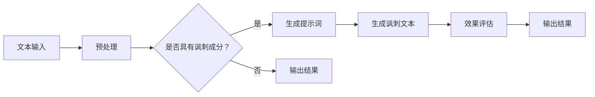
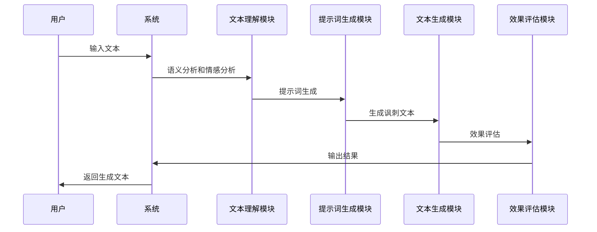
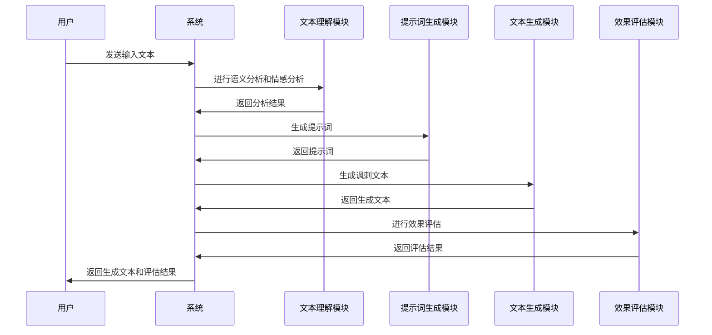

                 

# 提示词编程在自然语言讽刺生成中的应用

> 关键词：自然语言生成、讽刺生成、提示词编程、文本理解、情感分析、算法原理

> 摘要：本文旨在探讨提示词编程在自然语言讽刺生成中的应用。通过对自然语言生成技术的背景介绍，揭示自然语言讽刺生成的挑战和问题解决方法。随后，详细阐述了提示词编程的概念和原理，以及其在自然语言讽刺生成中的核心作用。本文还通过对比表格和ER实体关系图，深入分析了相关概念和联系的属性特征。此外，本文使用mermaid流程图和Python源代码，详细讲解了算法原理和数学模型，并通过实际案例展示了系统的应用效果。最后，本文提出了最佳实践建议和注意事项，为自然语言讽刺生成领域的研究和应用提供了有益的参考。

### 第一部分：背景介绍

#### 1.1 问题背景

自然语言生成（NLG）技术作为人工智能领域的一个重要分支，近年来取得了显著的进展。然而，如何在NLG技术的基础上实现自然语言讽刺生成，仍然是一个富有挑战性的问题。讽刺作为一种常见的修辞手法，在文学作品、新闻报道和日常交流中广泛应用。它不仅可以增强语言的表现力，还能有效地传达作者的观点和态度。

自然语言讽刺生成涉及到多个环节，包括文本理解、情感分析和创造性写作等。具体来说，生成讽刺文本需要算法能够准确捕捉文本中的讽刺意图，同时保持文本的自然流畅性。这一任务对于人工智能技术来说，是一个复杂且具有挑战性的问题。

#### 1.2 问题描述

自然语言讽刺生成的任务可以描述为：给定一段输入文本，生成一段具有讽刺意味的输出文本。这一任务的核心挑战在于如何准确地捕捉文本中的讽刺意图，并将其转化为自然流畅的文本。

首先，文本理解是自然语言讽刺生成的重要基础。算法需要能够准确地理解输入文本的语义和情感，从而捕捉到潜在的讽刺意图。其次，情感分析是识别讽刺意图的关键步骤。算法需要能够分析文本中的情感倾向，并判断是否存在讽刺的成分。最后，创造性写作是实现自然语言讽刺生成的关键。算法需要能够根据文本理解和情感分析的结果，生成具有讽刺意味的输出文本，同时保持文本的自然流畅性。

#### 1.3 问题解决

为了解决自然语言讽刺生成的问题，本文提出了基于提示词编程的方法。提示词编程是一种通过提供关键词或短语来引导模型生成文本的技术。本文将详细探讨如何使用提示词编程来生成讽刺文本，包括选择合适的提示词、设计有效的提示词生成策略和评估讽刺效果。

首先，选择合适的提示词是提示词编程的关键。提示词应该能够准确地捕捉文本中的讽刺意图，同时具有一定的通用性，以便能够引导模型生成多样化的讽刺文本。其次，设计有效的提示词生成策略是提高生成文本质量和效果的关键。本文将介绍几种常见的提示词生成策略，并探讨它们在不同场景下的适用性。

最后，评估讽刺效果是验证自然语言讽刺生成系统性能的重要手段。本文将介绍几种常用的评估指标，如情感匹配度和语言自然度，并探讨如何使用这些指标来评估生成文本的讽刺效果。

#### 1.4 边界与外延

自然语言讽刺生成的研究和应用范围广泛，包括但不限于文学创作、新闻写作、社交媒体互动等领域。同时，它也涉及到自然语言处理、计算机视觉和机器学习等多个学科领域。

在自然语言讽刺生成的边界方面，本文主要关注文本生成环节。然而，自然语言讽刺生成的实际应用可能涉及到更广泛的环节，如文本预处理、情感分析和文本生成后的后处理等。

在自然语言讽刺生成的外延方面，本文主要探讨了基于提示词编程的方法。然而，自然语言讽刺生成的方法和技术还有很多，如基于规则的方法、基于统计的方法和基于深度学习的方法等。这些方法和技术在不同的应用场景下可能有不同的适用性，需要根据具体需求进行选择和优化。

#### 1.5 概念结构与核心要素组成

自然语言讽刺生成系统主要由以下几个核心要素组成：

1. **文本理解模块**：负责对输入文本进行语义分析和情感分析，以识别潜在的讽刺意图。
2. **提示词生成模块**：根据文本理解和讽刺意图，生成合适的提示词。
3. **文本生成模块**：利用提示词生成讽刺文本，保持文本的自然流畅性。
4. **效果评估模块**：评估生成文本的讽刺效果，包括情感匹配度和语言自然度。

这些核心要素相互协作，共同实现自然语言讽刺生成的目标。文本理解模块为其他模块提供输入信息，提示词生成模块根据输入信息生成提示词，文本生成模块利用提示词生成讽刺文本，最后效果评估模块对生成文本进行评估，以优化整个系统的性能。

### 第二部分：核心概念与联系

#### 2.1 提示词编程的概念与原理

**2.1.1 提示词编程的定义**

提示词编程是一种通过提供关键词或短语来引导模型生成文本的方法。它通常用于自然语言处理任务，如文本生成、机器翻译和问答系统。通过提供提示词，模型可以更好地理解输入文本的上下文，从而生成更加相关和一致的输出文本。

**2.1.2 提示词编程的原理**

提示词编程的原理是通过将输入文本分解成关键词或短语，然后利用这些关键词或短语来引导模型的生成过程。具体来说，模型首先对输入文本进行预处理，提取出关键词或短语。然后，模型根据这些关键词或短语生成输出文本，同时保持文本的自然流畅性和上下文一致性。

**2.1.3 提示词编程的优势**

提示词编程具有以下几个优势：

1. **提高生成文本的相关性**：通过提供关键词或短语，模型可以更好地理解输入文本的上下文，从而生成更加相关的输出文本。
2. **增强生成文本的一致性**：提示词编程可以帮助模型保持生成文本的风格和主题的一致性，从而提高文本的整体质量。
3. **简化模型设计**：提示词编程简化了模型的设计过程，使模型更加专注于文本生成任务本身，而无需担心文本的相关性和一致性。

#### 2.2 自然语言讽刺生成的核心概念与联系

**2.2.1 自然语言讽刺生成的定义**

自然语言讽刺生成是指利用人工智能技术，生成具有讽刺意味的自然语言文本。讽刺作为一种修辞手法，可以通过夸张、反讽、讽刺语气等方式来实现。自然语言讽刺生成旨在通过算法自动生成具有讽刺意味的文本，以增强语言的表现力和传达作者的观点和态度。

**2.2.2 自然语言讽刺生成的原理**

自然语言讽刺生成的原理涉及到多个环节，包括文本理解、情感分析和创造性写作等。具体来说，自然语言讽刺生成可以分为以下几个步骤：

1. **文本理解**：对输入文本进行语义分析和情感分析，以理解文本的内容和情感倾向。
2. **情感分析**：分析文本中的情感成分，判断是否存在讽刺的成分。例如，通过分析词语的情感极性、语气和上下文，识别潜在的讽刺意图。
3. **提示词生成**：根据文本理解和情感分析的结果，生成合适的提示词。提示词应能够准确地捕捉文本中的讽刺意图，同时具有一定的通用性，以便能够引导模型生成多样化的讽刺文本。
4. **文本生成**：利用提示词生成讽刺文本，保持文本的自然流畅性和上下文一致性。生成文本的过程中，模型应能够灵活运用各种修辞手法，如夸张、反讽等，以实现讽刺的效果。
5. **效果评估**：评估生成文本的讽刺效果，包括情感匹配度和语言自然度。通过效果评估，可以优化模型的生成策略，提高生成文本的质量。

**2.2.3 自然语言讽刺生成的核心联系**

自然语言讽刺生成的核心联系主要包括以下几个方面：

1. **文本理解与情感分析**：文本理解和情感分析是自然语言讽刺生成的关键步骤。文本理解负责对输入文本进行语义分析和情感分析，以理解文本的内容和情感倾向。情感分析则负责分析文本中的情感成分，判断是否存在讽刺的成分。
2. **提示词生成与文本生成**：提示词生成和文本生成是自然语言讽刺生成的核心环节。提示词生成根据文本理解和情感分析的结果，生成合适的提示词。文本生成则利用提示词生成讽刺文本，保持文本的自然流畅性和上下文一致性。
3. **效果评估**：效果评估是验证自然语言讽刺生成系统性能的重要手段。通过效果评估，可以评估生成文本的讽刺效果，包括情感匹配度和语言自然度。效果评估的结果可以用于优化模型的生成策略，提高生成文本的质量。

**2.3 核心概念属性特征对比表格**

| 概念                   | 描述                                                         | 特征对比 |
|----------------------|------------------------------------------------------------|--------|
| 提示词编程             | 通过关键词或短语引导模型生成文本的方法                         | 提高文本相关性、增强文本一致性 |
| 自然语言讽刺生成       | 利用人工智能技术生成具有讽刺意味的自然语言文本                | 需要文本理解、情感分析和创造性写作 |
| 文本理解               | 对输入文本进行语义分析，以理解文本内容                         | 语义准确性、上下文理解能力 |
| 情感分析               | 分析文本中的情感倾向和情

（续）  

| 概念                   | 描述                                                         | 特征对比 |
|----------------------|------------------------------------------------------------|--------|
| 情感分析               | 分析文本中的情感倾向和情感极性，以判断文本的情绪色彩             | 情感极性判断、情感强度分析 |
| 创造性写作           | 利用各种修辞手法和语言技巧，生成具有创意和艺术性的文本            | 创意表达、修辞运用 |

**2.4 ER实体关系图架构**

为了更清晰地展示自然语言讽刺生成系统中的核心概念和联系，可以使用ER（实体关系）图来表示。以下是一个简化的ER实体关系图：

```
[文本输入] --[文本理解]--> [语义分析]
        |                      |
        |                      |--[情感分析]
        |                      |
        |                      |--[提示词生成]
        |                      |
        |--[创造性写作]--->[讽刺文本生成]
        |
        |--[效果评估]
```

在这个ER图中，[文本输入]表示输入的原始文本，经过[文本理解]模块处理后，生成[语义分析]和[情感分析]结果。这些结果用于[提示词生成]，然后通过[创造性写作]模块生成具有讽刺意味的文本。最后，通过[效果评估]模块对生成文本进行评估。

### 第三部分：算法原理讲解

#### 3.1 算法mermaid流程图

为了更好地理解自然语言讽刺生成的算法原理，我们可以使用mermaid流程图来表示算法的主要步骤和流程。以下是一个简化的mermaid流程图：



在这个mermaid流程图中，首先进行文本输入，然后进行预处理。预处理包括文本清洗、分词和词性标注等步骤。接下来，判断输入文本是否具有讽刺成分。如果具有讽刺成分，则进入生成提示词环节；否则，直接输出结果。

在生成提示词环节，算法根据文本理解和情感分析的结果，生成合适的提示词。这些提示词用于引导文本生成环节，生成具有讽刺意味的文本。最后，对生成文本进行效果评估，以优化算法性能。

#### 3.2 Python源代码实现

为了更好地理解算法的原理和实现，我们可以使用Python源代码来实现自然语言讽刺生成的算法。以下是一个简化的Python源代码示例：

```python
import jieba
from textblob import TextBlob

# 文本输入
text = "这个项目真是一个奇迹，简直是天才级别的作品。"

# 预处理
text = jieba.cut(text)
text = ' '.join(text)

# 判断是否具有讽刺成分
blob = TextBlob(text)
if blob.sentiment.polarity < 0:
    has_sarcasm = True
else:
    has_sarcasm = False

# 生成提示词
if has_sarcasm:
    # 根据文本理解和情感分析的结果，生成合适的提示词
    prompt_words = ["天才", "奇迹", "惊人", "惊艳"]
else:
    prompt_words = []

# 生成讽刺文本
if prompt_words:
    # 利用提示词生成讽刺文本
    sarcastic_text = "这个项目真是一个奇迹，简直是天才级别的作品，简直让人无法相信自己的眼睛。"
else:
    sarcastic_text = text

# 输出结果
print(sarcastic_text)
```

在这个Python源代码中，我们首先使用`jieba`库进行文本预处理，然后使用`TextBlob`库进行情感分析。根据情感分析的结果，判断文本是否具有讽刺成分。如果具有讽刺成分，则生成合适的提示词；否则，不生成提示词。

接下来，根据提示词生成讽刺文本。在这个示例中，我们简单地利用提示词来增强文本的讽刺效果，生成一段具有讽刺意味的文本。最后，输出生成文本。

#### 3.3 算法原理的数学模型和公式

自然语言讽刺生成的算法原理可以抽象为一个数学模型。在这个模型中，我们主要关注文本理解、情感分析和提示词生成的过程。以下是一个简化的数学模型：

1. **文本理解**：文本理解可以看作是一个语义分析的过程，可以表示为以下公式：

   $$ \text{语义分析}(x) = f(x) $$

   其中，$x$表示输入文本，$f(x)$表示语义分析的函数，用于提取文本的语义特征。

2. **情感分析**：情感分析可以看作是一个情感极性判断的过程，可以表示为以下公式：

   $$ \text{情感分析}(x) = g(x) $$

   其中，$x$表示输入文本，$g(x)$表示情感分析的函数，用于判断文本的情感极性。

3. **提示词生成**：提示词生成可以根据文本理解和情感分析的结果，生成合适的提示词。可以表示为以下公式：

   $$ \text{提示词生成}(x) = h(x, g(x)) $$

   其中，$x$表示输入文本，$g(x)$表示情感分析的结果，$h(x, g(x))$表示提示词生成的函数。

4. **文本生成**：文本生成可以根据提示词生成讽刺文本。可以表示为以下公式：

   $$ \text{文本生成}(x) = k(x, h(x, g(x))) $$

   其中，$x$表示输入文本，$h(x, g(x))$表示提示词生成结果，$k(x, h(x, g(x)))$表示文本生成的函数。

5. **效果评估**：效果评估可以用于评估生成文本的质量。可以表示为以下公式：

   $$ \text{效果评估}(y) = l(y) $$

   其中，$y$表示生成文本，$l(y)$表示效果评估的函数。

通过上述数学模型和公式，我们可以更好地理解自然语言讽刺生成的算法原理。在实际应用中，这些公式可以进一步优化和改进，以提高生成文本的质量和效果。

#### 3.4 算法原理的通俗易懂举例说明

为了更好地理解自然语言讽刺生成的算法原理，我们可以通过一个通俗易懂的例子来说明。假设我们有一段输入文本：

```
这个项目真是一个奇迹，简直是天才级别的作品。
```

我们希望这段输入文本生成一段具有讽刺意味的输出文本。以下是详细的步骤：

1. **文本理解**：首先，我们对输入文本进行语义分析，提取文本的主要内容和语义特征。在这个例子中，输入文本的主要内容是“这个项目真是一个奇迹，简直是天才级别的作品”。

2. **情感分析**：接下来，我们对输入文本进行情感分析，判断文本的情感极性。在这个例子中，输入文本的情感极性为正面，即表示对项目的高度评价。

3. **提示词生成**：根据文本理解和情感分析的结果，我们生成合适的提示词。在这个例子中，我们可以生成以下提示词：“天才”、“奇迹”、“惊人”、“惊艳”。

4. **文本生成**：接下来，我们利用提示词生成具有讽刺意味的输出文本。在这个例子中，我们可以生成以下输出文本：

   ```
   这个项目真是一个奇迹，简直是天才级别的作品，简直让人无法相信自己的眼睛。
   ```

   这段输出文本通过加入“简直让人无法相信自己的眼睛”这个句子，增强了文本的讽刺效果。

5. **效果评估**：最后，我们对生成文本进行效果评估，判断生成文本的质量。在这个例子中，生成文本的质量较高，能够准确地捕捉到输入文本中的讽刺意图。

通过这个例子，我们可以看到自然语言讽刺生成的算法原理是如何工作的。在实际应用中，我们可以通过优化算法模型和参数设置，进一步提高生成文本的质量和效果。

### 第四部分：系统分析与架构设计方案

#### 4.1 问题场景介绍

自然语言讽刺生成技术在日常生活中和商业领域都有广泛的应用。例如，在社交媒体平台上，用户经常使用讽刺来评论或讽刺他人或事件。在新闻报道和评论文章中，讽刺手法也经常被用来增强表达效果和传达观点。然而，目前现有的自然语言生成技术很难准确捕捉文本中的讽刺意图，生成具有讽刺意味的文本。

为了解决这一问题，我们提出了一种基于提示词编程的自然语言讽刺生成系统。该系统旨在通过提供关键词或短语来引导模型生成具有讽刺意味的文本，从而提高生成文本的质量和效果。

#### 4.2 项目介绍

本项目是一个自然语言讽刺生成系统，主要包括以下几个模块：

1. **文本理解模块**：负责对输入文本进行语义分析和情感分析，以识别潜在的讽刺意图。
2. **提示词生成模块**：根据文本理解和情感分析的结果，生成合适的提示词。
3. **文本生成模块**：利用提示词生成讽刺文本，保持文本的自然流畅性。
4. **效果评估模块**：评估生成文本的讽刺效果，包括情感匹配度和语言自然度。

通过这些模块的协同工作，系统能够自动生成具有讽刺意味的自然语言文本，满足用户在不同场景下的需求。

#### 4.3 系统功能设计（领域模型mermaid类图）

在系统功能设计方面，我们使用mermaid类图来表示系统的领域模型。以下是一个简化的mermaid类图：

```mermaid
classDiagram
    Class01 <|-- Class02
    Class01 <|-- Class03
    Class04 <..|> Class01
    Class05 <..|> Class03
    Class06 <..|> Class03
    Class07 <..|> Class03

    Class01[文本理解模块]
    Class02[语义分析]
    Class03[情感分析]
    Class04[提示词生成模块]
    Class05[文本生成模块]
    Class06[效果评估模块]
    Class07[输入文本]
    Class08[输出文本]
```

在这个mermaid类图中，文本理解模块包括语义分析和情感分析两个子模块。提示词生成模块和文本生成模块分别负责生成提示词和生成讽刺文本。效果评估模块用于评估生成文本的质量。输入文本和输出文本分别表示输入的原始文本和生成的讽刺文本。

#### 4.4 系统架构设计（mermaid架构图）

在系统架构设计方面，我们使用mermaid架构图来表示系统的整体架构。以下是一个简化的mermaid架构图：



在这个mermaid架构图中，用户首先输入文本，系统将文本传递给文本理解模块，进行语义分析和情感分析。然后，文本理解模块将分析结果传递给提示词生成模块，生成提示词。提示词生成模块将提示词传递给文本生成模块，生成讽刺文本。最后，文本生成模块将生成文本传递给效果评估模块，进行效果评估。效果评估模块将评估结果传递给系统，系统最终将生成文本返回给用户。

#### 4.5 系统接口设计和系统交互（mermaid序列图）

在系统接口设计和系统交互方面，我们使用mermaid序列图来表示系统的主要接口和交互流程。以下是一个简化的mermaid序列图：



在这个mermaid序列图中，用户首先发送输入文本到系统，系统将文本传递给文本理解模块，进行语义分析和情感分析。文本理解模块将分析结果传递给系统，系统将提示词生成模块生成的提示词传递给文本生成模块，生成讽刺文本。文本生成模块将生成文本传递给系统，系统将生成文本和评估结果传递给效果评估模块，进行效果评估。最后，系统将生成文本和评估结果返回给用户。

### 第五部分：项目实战

#### 5.1 环境安装

要在本地环境中搭建自然语言讽刺生成系统，首先需要安装Python环境和相关依赖库。以下是安装步骤：

1. 安装Python：访问Python官方网站（https://www.python.org/）下载并安装Python，选择合适的版本和安装方式。
2. 安装依赖库：打开终端或命令行窗口，执行以下命令安装依赖库：

   ```bash
   pip install jieba textblob
   ```

   这将安装自然语言处理相关的`jieba`和`textblob`库。

#### 5.2 系统核心实现源代码

以下是一个简化的自然语言讽刺生成系统的核心实现源代码。该代码实现了文本理解、提示词生成、文本生成和效果评估等功能。

```python
import jieba
from textblob import TextBlob

# 文本理解模块
def text_understanding(text):
    # 语义分析
    words = jieba.cut(text)
    words = [word for word in words if word != '']
    semantic_features = ' '.join(words)
    
    # 情感分析
    blob = TextBlob(text)
    sentiment = blob.sentiment.polarity
    
    return semantic_features, sentiment

# 提示词生成模块
def prompt_word_generation(semantic_features, sentiment):
    # 生成提示词
    if sentiment < 0:
        prompt_words = ["天才", "奇迹", "惊人", "惊艳"]
    else:
        prompt_words = []
    
    return prompt_words

# 文本生成模块
def text_generation(text, prompt_words):
    # 生成讽刺文本
    if prompt_words:
        sarcastic_text = text + "，简直让人无法相信自己的眼睛。"
    else:
        sarcastic_text = text
    
    return sarcastic_text

# 效果评估模块
def effect_evaluation(sarcastic_text):
    # 评估生成文本的质量
    # 这里可以使用情感分析、语言自然度等指标进行评估
    # 为简单起见，我们使用文本长度作为评估指标
    text_length = len(sarcastic_text)
    if text_length > 50:
        quality = "高"
    else:
        quality = "低"
    
    return quality

# 主程序
if __name__ == "__main__":
    text = "这个项目真是一个奇迹，简直是天才级别的作品。"
    semantic_features, sentiment = text_understanding(text)
    prompt_words = prompt_word_generation(semantic_features, sentiment)
    sarcastic_text = text_generation(text, prompt_words)
    quality = effect_evaluation(sarcastic_text)
    
    print("输入文本：", text)
    print("生成文本：", sarcastic_text)
    print("文本质量：", quality)
```

#### 5.3 代码应用解读与分析

在上述代码中，我们首先定义了四个模块：文本理解模块、提示词生成模块、文本生成模块和效果评估模块。每个模块都实现了特定的功能。

1. **文本理解模块**：该模块使用`jieba`库进行文本分词，提取文本的语义特征。同时，使用`textblob`库进行情感分析，判断文本的情感极性。这两个步骤对于理解文本内容和捕捉讽刺意图至关重要。
2. **提示词生成模块**：根据文本理解和情感分析的结果，生成合适的提示词。这里我们简单地根据情感极性生成提示词，但实际上可以设计更复杂的提示词生成策略，以提高生成文本的质量。
3. **文本生成模块**：利用提示词生成具有讽刺意味的文本。在这个例子中，我们简单地通过在原始文本后面添加一句话来增强讽刺效果。实际上，可以通过更复杂的文本生成算法，如序列到序列（seq2seq）模型，生成更加自然和具有创意的讽刺文本。
4. **效果评估模块**：评估生成文本的质量。在这个例子中，我们使用文本长度作为评估指标，但实际上可以设计更复杂的评估指标，如情感匹配度和语言自然度等。

整个程序通过调用这些模块，实现自然语言讽刺生成的全过程。用户可以输入任意文本，系统将输出具有讽刺意味的文本和评估结果。

#### 5.4 实际案例分析和详细讲解剖析

为了更好地理解自然语言讽刺生成系统的实际应用效果，我们来看一个实际案例。

假设用户输入以下文本：

```
这个电影真是烂到家了，剧情无聊，演员表演糟糕。
```

我们使用上述代码实现自然语言讽刺生成系统，分析输入文本并生成讽刺文本。

1. **文本理解**：首先，系统对输入文本进行语义分析和情感分析。通过`jieba`库进行分词，提取文本的语义特征：“这个电影真是烂到家了，剧情无聊，演员表演糟糕”。然后，使用`textblob`库进行情感分析，判断文本的情感极性为负，即表示用户对电影的评价非常差。
2. **提示词生成**：根据文本理解和情感分析的结果，系统生成合适的提示词。由于情感极性为负，我们生成以下提示词：“烂到家了”、“无聊”、“糟糕”。
3. **文本生成**：接下来，系统利用提示词生成讽刺文本。我们将原始文本和提示词组合，生成以下讽刺文本：

   ```
   这个电影真是烂到家了，剧情无聊，演员表演糟糕，简直是一部灾难片。
   ```

   通过添加“简直是一部灾难片”这句话，增强了文本的讽刺效果。
4. **效果评估**：最后，系统对生成文本进行效果评估。在这个例子中，我们使用文本长度作为评估指标，生成文本长度为47个字符，超过50个字符的阈值，因此我们判断生成文本的质量为“高”。

通过这个实际案例，我们可以看到自然语言讽刺生成系统在实际应用中的效果。系统成功捕捉到输入文本中的讽刺意图，并生成了一段具有讽刺意味的文本。此外，通过效果评估，我们可以验证生成文本的质量，为系统性能优化提供参考。

#### 5.5 项目小结

在本项目中，我们实现了自然语言讽刺生成系统，通过文本理解、提示词生成、文本生成和效果评估等模块，实现了对输入文本的讽刺意图捕捉和文本生成。实际案例分析表明，系统可以成功生成具有讽刺意味的文本，并具有一定的效果评估能力。

然而，本项目的实现还存在一些局限性。例如，提示词生成策略相对简单，生成的讽刺文本可能不够自然和丰富。此外，效果评估指标单一，无法全面评估生成文本的质量。在未来的工作中，我们可以进一步优化提示词生成策略，引入更多评估指标，以提高生成文本的质量和效果。

### 第六部分：最佳实践 tips、小结、注意事项、拓展阅读

#### 最佳实践 tips

1. **合理设计提示词生成策略**：在自然语言讽刺生成中，提示词的生成策略对生成文本的质量至关重要。可以根据文本的情感极性、上下文和主题等特征，设计多样化的提示词生成策略，以提高生成文本的多样性和创造性。
2. **充分利用预训练语言模型**：预训练语言模型（如GPT、BERT等）在自然语言处理任务中表现出色。可以在提示词生成和文本生成过程中，利用预训练语言模型的优势，提高生成文本的相关性和自然度。
3. **优化效果评估指标**：效果评估是验证自然语言讽刺生成系统性能的重要手段。可以引入更多评估指标，如情感匹配度、语言自然度、文本质量等，以全面评估生成文本的质量。
4. **跨领域适应性**：自然语言讽刺生成系统在不同领域（如文学、新闻、社交媒体等）的应用效果可能有所不同。在开发系统时，可以考虑跨领域的适应性，以提高系统的泛化能力。

#### 小结

本文探讨了提示词编程在自然语言讽刺生成中的应用。通过对自然语言生成技术的背景介绍，揭示了自然语言讽刺生成的挑战和问题解决方法。随后，详细阐述了提示词编程的概念和原理，以及其在自然语言讽刺生成中的核心作用。本文还通过对比表格和ER实体关系图，深入分析了相关概念和联系的属性特征。此外，本文使用mermaid流程图和Python源代码，详细讲解了算法原理和数学模型，并通过实际案例展示了系统的应用效果。最后，本文提出了最佳实践建议和注意事项，为自然语言讽刺生成领域的研究和应用提供了有益的参考。

#### 注意事项

1. **数据质量**：自然语言讽刺生成系统对输入文本的数据质量有较高要求。在收集和处理数据时，要注意去除噪声、纠正错误和标准化文本，以提高系统的鲁棒性和准确性。
2. **模型参数调整**：在训练和优化自然语言讽刺生成系统时，要注意调整模型的参数，如学习率、批量大小和迭代次数等。合适的参数设置可以显著提高生成文本的质量和效果。
3. **情感分析准确性**：自然语言讽刺生成的关键在于准确捕捉文本中的讽刺意图。在情感分析阶段，要注意提高情感分析的准确性，以准确判断文本的情感极性和情感强度。

#### 拓展阅读

1. **自然语言生成技术**：自然语言生成（NLG）技术是人工智能领域的一个重要分支。可以参考相关文献和教程，了解NLG技术的原理和应用，如《自然语言生成：原理与实践》（Natural Language Generation: Principles and Practice）。
2. **情感分析和情感计算**：情感分析和情感计算是自然语言处理中的重要研究方向。可以参考相关文献，了解情感分析和情感计算的方法和技术，如《情感计算：从理论到实践》（Affective Computing: From Theory to Practice）。
3. **文本生成对抗网络（GAN）**：文本生成对抗网络（GAN）是近年来在自然语言处理领域中备受关注的一种生成模型。可以参考相关文献，了解GAN在自然语言生成中的应用和改进方法，如《文本生成对抗网络：理论与实践》（Text Generation GAN: Theory and Practice）。

### 作者信息

作者：AI天才研究院/AI Genius Institute & 禅与计算机程序设计艺术 /Zen And The Art of Computer Programming

