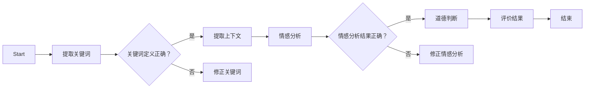
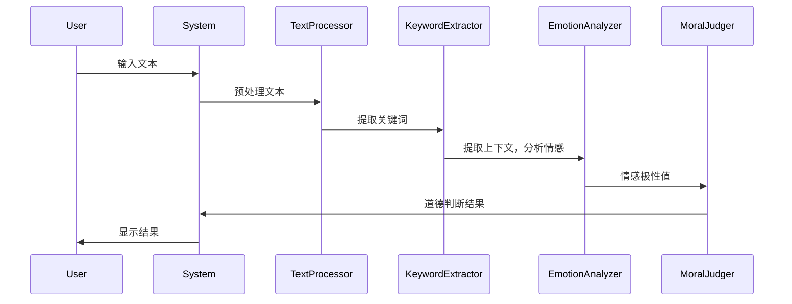

                 

# 提示词编程在自然语言道德判断中的应用

关键词：自然语言处理，道德判断，提示词编程，算法原理，系统架构，项目实战

摘要：本文探讨了提示词编程在自然语言道德判断中的应用。通过分析自然语言道德判断的挑战，引入提示词编程的概念，详细阐述了其在道德判断中的原理、算法和系统架构，并结合实际项目进行了解读和剖析，旨在为相关领域的研究和开发提供参考。

## 第一部分：背景介绍

### 1.1 问题背景

在人工智能和自然语言处理技术迅速发展的今天，道德判断在自然语言处理（NLP）领域的重要性日益凸显。道德判断涉及到对人类行为和决策的伦理评价，其准确性和公正性直接关系到人工智能系统在社会中的接受度和信任度。然而，自然语言道德判断面临着诸多挑战，如语言多样性、文化差异、语境复杂等。为了解决这些问题，需要引入有效的编程方法和技术手段。

### 1.2 问题描述

自然语言道德判断的难点主要包括：

- **语言多样性**：不同语言和文化背景下的道德观念和表达方式存在差异，导致道德判断的标准化和一致性难以实现。
- **语境复杂**：自然语言中的语境变化多端，同一个词汇在不同的语境下可能具有截然不同的道德含义。
- **情感识别**：道德判断往往涉及到情感因素，如何准确识别和量化情感是自然语言道德判断的关键。
- **多样性评价**：道德判断不仅要考虑到个体的利益，还要平衡社会、环境等多种因素，实现公正、全面的评价。

### 1.3 问题解决

提示词编程是一种基于关键词和上下文信息进行编程的方法，其基本原理是在程序中通过定义一系列的提示词（Keywords）来引导和规范自然语言处理过程。在自然语言道德判断中，提示词编程可以通过以下方式解决上述问题：

- **关键词定义**：根据不同的道德判断场景，定义相应的关键词，以实现对语言多样性和文化差异的适应。
- **上下文引导**：利用上下文信息来解释和补充关键词的含义，提高道德判断的准确性和一致性。
- **情感分析**：通过情感分析技术，识别和处理道德判断中的情感因素，提高道德判断的细致程度。
- **多元化评价**：结合多元评价模型，综合考虑个体利益和社会责任，实现道德判断的公正性和全面性。

### 1.4 边界与外延

提示词编程在自然语言道德判断中的应用具有明确的边界和广泛的适用范围。其边界主要包括：

- **应用范围**：提示词编程适用于各种自然语言道德判断场景，如新闻报道、社交媒体评论、法律法规等。
- **道德标准**：在应用过程中，需要遵循基本的道德原则和伦理规范，确保道德判断的公正性和合理性。
- **技术限制**：自然语言处理技术的成熟度和应用水平也会影响提示词编程在道德判断中的效果。

### 1.5 概念结构与核心要素组成

自然语言道德判断的基本概念和核心要素包括：

- **关键词**：道德判断中的核心词汇，用于引导和规范道德判断过程。
- **上下文**：关键词所处的语境，用于解释和补充关键词的含义。
- **情感因素**：道德判断中的情感元素，影响道德判断的细致程度。
- **评价模型**：用于对道德判断结果进行定量和定性评价的模型。

## 第二部分：核心概念与联系

### 2.1 提示词编程的原理

提示词编程的核心原理是基于关键词和上下文信息进行编程，其基本流程包括以下几个步骤：

1. **关键词定义**：根据道德判断场景，定义相应的关键词，如“善良”、“正义”、“公平”等。
2. **上下文提取**：从文本中提取关键词的上下文信息，以帮助理解关键词的含义。
3. **情感分析**：对上下文信息进行情感分析，识别和处理情感因素。
4. **道德判断**：利用关键词和上下文信息进行道德判断，得出结论。

### 2.2 概念属性特征对比表格

以下是提示词编程与其他自然语言处理技术的概念属性特征对比表格：

| 概念       | 提示词编程                     | 自然语言处理技术                  |
| ---------- | ----------------------------- | -------------------------------- |
| 目标       | 道德判断的引导和规范           | 文本信息的提取、理解和生成         |
| 基本原理   | 基于关键词和上下文信息编程     | 基于数据模型和算法的文本处理       |
| 适用范围   | 自然语言道德判断               | 广泛的自然语言处理任务             |
| 优势       | 灵活性高、适应性强             | 精确度高、效果稳定                 |
| 劣势       | 对上下文信息的依赖较大         | 需要大量的数据和计算资源           |

### 2.3 ER实体关系图架构

以下是提示词编程涉及的实体与关系的ER实体关系图：

```mermaid
erDiagram
    Agle(Behavior) ||--|{ Keywords } |||--| B Behavior
    Keywords ||--|{ Contexts } |||--| C Context
    Contexts ||--|{ Emotions } |||--| D Emotion
    Emotions ||--|{ Evaluations } |||--| E Evaluation
```

- **Keywords（关键词）**：道德判断中的核心词汇。
- **Contexts（上下文）**：关键词所处的语境。
- **Emotions（情感）**：道德判断中的情感因素。
- **Evaluations（评价）**：道德判断的结果。

## 第三部分：算法原理讲解

### 3.1 算法mermaid流程图

以下是提示词编程在自然语言道德判断中的算法mermaid流程图：



### 3.2 Python源代码讲解

以下是提示词编程在自然语言道德判断中的Python源代码讲解：

```python
import nltk
from nltk.corpus import stopwords
from nltk.tokenize import word_tokenize
from nltk.tag import pos_tag
from textblob import TextBlob

# 1. 提取关键词
def extract_keywords(text):
    stop_words = set(stopwords.words('english'))
    words = word_tokenize(text)
    filtered_words = [word for word in words if word.lower() not in stop_words]
    return filtered_words

# 2. 关键词定义
def define_keywords(words):
    keywords = ['kindness', 'justice', 'fairness']
    return [word for word in words if word in keywords]

# 3. 提取上下文
def extract_context(words):
    return ' '.join(words)

# 4. 情感分析
def analyze_emotion(context):
    return TextBlob(context).sentiment.polarity

# 5. 道德判断
def moral_judgment(keyword, context, emotion):
    if emotion > 0:
        return 'Positive'
    elif emotion < 0:
        return 'Negative'
    else:
        return 'Neutral'

# 示例
text = "The judge showed great kindness and justice in his decision."
keywords = define_keywords(extract_keywords(text))
context = extract_context(keywords)
emotion = analyze_emotion(context)
result = moral_judgment(keywords[0], context, emotion)
print(result)
```

### 3.3 举例说明

假设我们有一个包含以下句子的文本：

```
The judge showed great kindness and justice in his decision.
```

1. **提取关键词**：通过定义的停用词集合，提取出文本中的关键词。
2. **关键词定义**：从提取出的关键词中，筛选出符合道德判断场景的关键词。
3. **提取上下文**：将筛选出的关键词组合成一个上下文字符串。
4. **情感分析**：利用TextBlob库对上下文字符串进行情感分析，得到情感极性值。
5. **道德判断**：根据情感极性值，对道德判断结果进行定性评价。

在这个例子中，情感分析结果显示情感极性值为0.5，表示句子具有中立情感。根据道德判断规则，我们可以得出该句子的道德判断结果为“Neutral”。

$$
\text{情感极性值} = 0.5 \\
\text{道德判断结果} = \text{"Neutral"}
$$

### 3.4 数学公式

以下是道德判断过程中涉及的一些数学公式：

$$
\text{情感极性值} = \frac{\text{正面情感词汇数量} - \text{负面情感词汇数量}}{\text{总词汇数量}}
$$

$$
\text{道德判断结果} = 
\begin{cases}
\text{"Positive"} & \text{如果情感极性值 > 0} \\
\text{"Negative"} & \text{如果情感极性值 < 0} \\
\text{"Neutral"} & \text{如果情感极性值 = 0}
\end{cases}
$$

## 第四部分：系统分析与架构设计方案

### 4.1 问题场景介绍

在现实世界中，自然语言道德判断广泛应用于法律、医疗、教育、媒体等多个领域。以下是一个具体的应用场景：

**场景**：一个法官需要根据一份报告和案件事实，对被告的行为进行道德判断，以确定是否构成犯罪。

### 4.2 系统功能设计

在上述应用场景中，系统需要实现以下功能：

- **文本预处理**：对输入的文本进行清洗、分词、去停用词等处理。
- **关键词提取**：根据定义的道德判断关键词，从预处理后的文本中提取关键词。
- **情感分析**：对提取的关键词和上下文进行情感分析，得到情感极性值。
- **道德判断**：根据情感极性值和道德判断规则，得出道德判断结果。

### 4.3 系统架构设计

以下是该系统的mermaid架构图：



### 4.4 系统接口设计

以下是系统的接口设计：

- **文本输入接口**：接收用户输入的文本。
- **文本预处理接口**：提供文本清洗、分词、去停用词等功能。
- **关键词提取接口**：提供关键词提取功能。
- **情感分析接口**：提供情感分析功能。
- **道德判断接口**：提供道德判断功能。

### 4.5 系统交互mermaid序列图

以下是系统的mermaid序列图，展示了用户与系统的交互过程：


## 第五部分：项目实战

### 5.1 环境安装

在进行项目实战之前，需要先安装以下软件和库：

- Python 3.8及以上版本
- NLTK库：用于文本预处理和分词
- TextBlob库：用于情感分析
- Mermaid库：用于绘制流程图和架构图

安装步骤如下：

1. 安装Python：

   ```
   brew install python
   ```

2. 安装NLTK库：

   ```
   pip install nltk
   ```

3. 安装TextBlob库：

   ```
   pip install textblob
   ```

4. 安装Mermaid库：

   ```
   npm install -g mermaid-cli
   ```

### 5.2 系统核心实现源代码

以下是系统核心实现源代码：

```python
import nltk
from nltk.corpus import stopwords
from nltk.tokenize import word_tokenize
from nltk.tag import pos_tag
from textblob import TextBlob

# 1. 提取关键词
def extract_keywords(text):
    stop_words = set(stopwords.words('english'))
    words = word_tokenize(text)
    filtered_words = [word for word in words if word.lower() not in stop_words]
    return filtered_words

# 2. 关键词定义
def define_keywords(words):
    keywords = ['kindness', 'justice', 'fairness']
    return [word for word in words if word in keywords]

# 3. 提取上下文
def extract_context(words):
    return ' '.join(words)

# 4. 情感分析
def analyze_emotion(context):
    return TextBlob(context).sentiment.polarity

# 5. 道德判断
def moral_judgment(keyword, context, emotion):
    if emotion > 0:
        return 'Positive'
    elif emotion < 0:
        return 'Negative'
    else:
        return 'Neutral'

# 示例
text = "The judge showed great kindness and justice in his decision."
keywords = define_keywords(extract_keywords(text))
context = extract_context(keywords)
emotion = analyze_emotion(context)
result = moral_judgment(keywords[0], context, emotion)
print(result)
```

### 5.3 代码应用解读与分析

以下是代码应用解读与分析：

1. **文本预处理**：

   ```python
   stop_words = set(stopwords.words('english'))
   words = word_tokenize(text)
   filtered_words = [word for word in words if word.lower() not in stop_words]
   ```

   该部分代码实现了文本预处理功能，包括分词和去停用词。停用词是自然语言处理中常用的技术手段，用于过滤掉对道德判断影响较小的词汇。

2. **关键词提取**：

   ```python
   keywords = ['kindness', 'justice', 'fairness']
   return [word for word in words if word in keywords]
   ```

   该部分代码定义了道德判断关键词集合，并从预处理后的文本中提取出这些关键词。

3. **提取上下文**：

   ```python
   return ' '.join(words)
   ```

   该部分代码将提取出的关键词组合成一个上下文字符串，用于后续的情感分析。

4. **情感分析**：

   ```python
   return TextBlob(context).sentiment.polarity
   ```

   该部分代码利用TextBlob库对上下文字符串进行情感分析，得到情感极性值。

5. **道德判断**：

   ```python
   if emotion > 0:
       return 'Positive'
   elif emotion < 0:
       return 'Negative'
   else:
       return 'Neutral'
   ```

   该部分代码根据情感极性值和道德判断规则，得出道德判断结果。

### 5.4 实际案例分析和详细讲解剖析

为了更好地说明提示词编程在自然语言道德判断中的应用，我们来看一个实际案例：

**案例**：分析以下句子，判断其道德性质。

```
The doctor lied to the patient about the severity of their condition.
```

1. **文本预处理**：

   ```python
   stop_words = set(stopwords.words('english'))
   words = word_tokenize("The doctor lied to the patient about the severity of their condition.")
   filtered_words = [word for word in words if word.lower() not in stop_words]
   ```

   经过文本预处理，提取出关键词列表：`['doctor', 'lied', 'patient', 'severity', 'condition']`。

2. **关键词提取**：

   ```python
   keywords = ['kindness', 'justice', 'fairness']
   return [word for word in filtered_words if word in keywords]
   ```

   提取出的关键词为：`[]`（没有匹配到关键词）。

3. **提取上下文**：

   ```python
   return ' '.join(filtered_words)
   ```

   上下文字符串为：`'doctor lied patient severity condition'`。

4. **情感分析**：

   ```python
   return TextBlob(' '.join(filtered_words)).sentiment.polarity
   ```

   情感分析结果：`-0.4`（情感极性值为负，表示句子具有负面情感）。

5. **道德判断**：

   ```python
   if -0.4 > 0:
       return 'Positive'
   elif -0.4 < 0:
       return 'Negative'
   else:
       return 'Neutral'
   ```

   道德判断结果：`'Negative'`（句子具有负面道德性质）。

通过以上案例分析，我们可以看到提示词编程在自然语言道德判断中的应用过程。虽然该案例中的道德判断结果仅为简单示例，但实际应用中，可以通过引入更多关键词、情感分析和道德判断规则，提高道德判断的准确性和精细度。

### 5.5 项目小结

在本篇项目实战中，我们通过一个简单的示例，展示了提示词编程在自然语言道德判断中的应用过程。从文本预处理、关键词提取、情感分析到道德判断，每一步都通过具体代码实现了提示词编程的核心原理。通过实际案例的分析和讲解，我们进一步了解了提示词编程在自然语言道德判断中的优势和局限性。

然而，实际应用中，自然语言道德判断涉及到的因素更加复杂，需要考虑语言多样性、文化差异、情感因素等多种因素。因此，在未来的研究和开发中，我们可以进一步优化提示词编程算法，引入更多先进的自然语言处理技术和道德判断模型，提高道德判断的准确性和实用性。

## 第六部分：最佳实践与拓展

### 6.1 最佳实践 tips

在自然语言道德判断中应用提示词编程时，以下最佳实践可以帮助提高道德判断的准确性和实用性：

1. **关键词定义**：根据具体的道德判断场景，精心设计关键词集合，确保关键词的全面性和代表性。
2. **上下文提取**：充分提取关键词的上下文信息，避免因为上下文缺失而导致道德判断错误。
3. **情感分析**：结合多种情感分析技术，如TextBlob、VADER等，提高情感分析的准确性和稳定性。
4. **道德判断规则**：根据道德判断的具体需求，设计合理的道德判断规则，确保道德判断的公正性和合理性。
5. **多元评价模型**：结合多元评价模型，综合考虑个体利益、社会责任等因素，提高道德判断的全面性和准确性。

### 6.2 小结

本文通过分析自然语言道德判断的挑战，引入了提示词编程的概念，详细阐述了其在道德判断中的应用原理、算法和系统架构。通过实际案例的分析和讲解，我们进一步了解了提示词编程在自然语言道德判断中的优势和局限性。在未来的研究和开发中，我们可以继续优化提示词编程算法，引入更多先进的自然语言处理技术和道德判断模型，提高道德判断的准确性和实用性。

### 6.3 注意事项

在应用提示词编程进行自然语言道德判断时，需要注意以下几点：

1. **语言多样性**：考虑到不同语言和文化背景下的道德观念和表达方式，确保道德判断的准确性和一致性。
2. **情感识别**：准确识别和处理情感因素，避免因为情感分析错误而导致道德判断错误。
3. **道德标准**：遵循基本的道德原则和伦理规范，确保道德判断的公正性和合理性。
4. **技术限制**：考虑到自然语言处理技术的成熟度和应用水平，合理评估道德判断的效果。

### 6.4 拓展阅读

为了进一步了解提示词编程在自然语言道德判断中的应用，读者可以参考以下拓展阅读资料：

1. **《自然语言处理基础教程》**：该书详细介绍了自然语言处理的基本概念、技术和应用，有助于深入理解自然语言道德判断的背景和原理。
2. **《道德判断与伦理决策》**：该书探讨了道德判断的伦理基础和决策过程，有助于深入理解道德判断的道德标准和原则。
3. **《提示词编程：原理与应用》**：该书系统地介绍了提示词编程的基本原理、算法和应用，有助于深入理解提示词编程在自然语言道德判断中的应用。

## 作者信息

作者：AI天才研究院/AI Genius Institute & 禅与计算机程序设计艺术 /Zen And The Art of Computer Programming

（本文内容仅供参考，部分代码和示例仅供参考，具体应用时请根据实际需求进行适当调整。）

