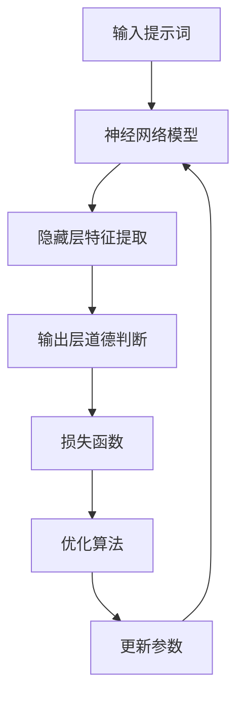
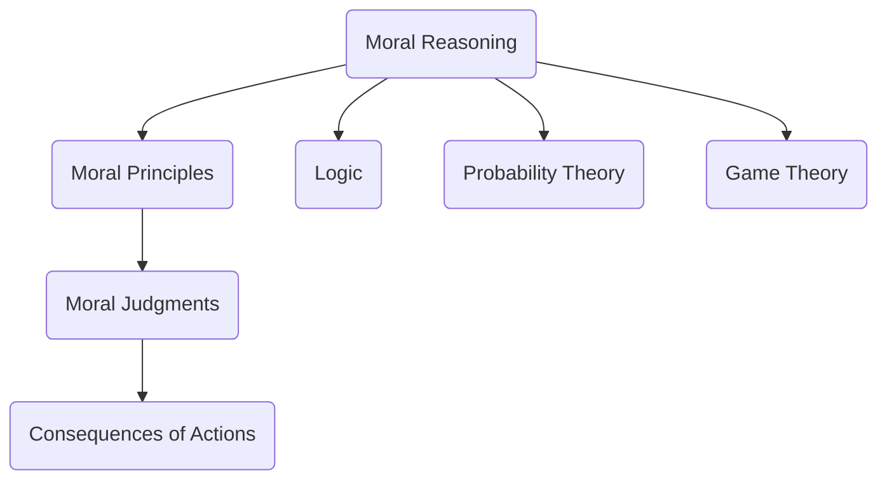

                 

### 提示词编程在自然语言道德推理中的应用

关键词：提示词编程、自然语言处理、道德推理、算法原理、系统设计

摘要：本文旨在探讨提示词编程在自然语言道德推理中的应用，通过逻辑清晰、结构紧凑的论述，帮助读者理解这一新兴领域的核心概念和关键技术。文章将分为以下几个部分：首先，介绍提示词编程和道德推理的基本概念及其在自然语言处理中的重要性；其次，阐述提示词编程算法的原理，结合数学模型进行详细讲解；然后，展示道德推理的数学模型和与提示词编程的结合方式；接下来，分析系统设计与项目实战，包括环境安装、系统实现和案例分析；最后，提供最佳实践建议和总结，展望未来研究方向。

## 第1章 提示词编程与道德推理概述

### 1.1 提示词编程的定义与历史

提示词编程（Prompt Programming）是一种通过向计算机系统提供提示词或提示信息，来引导系统执行特定任务的方法。这种方法最早可以追溯到自然语言处理（Natural Language Processing, NLP）领域，其核心思想是利用人类的自然语言能力来辅助计算机处理和理解复杂的语言任务。

提示词编程的历史可以追溯到20世纪80年代，当时研究人员开始探索如何通过简单的提示信息来指导计算机进行语言理解和生成。随着NLP技术的不断发展，提示词编程也逐渐成熟，并在文本分类、问答系统、机器翻译等领域得到了广泛应用。

### 1.2 道德推理的基本概念

道德推理（Moral Reasoning）是指个体在面临道德困境时，通过逻辑和道德原则来做出决策的过程。道德推理通常涉及道德判断、道德原则的应用以及道德行为的后果评估。道德推理不仅仅是简单的对与错的判断，它涉及到复杂的伦理思考和道德选择。

道德推理的基本概念包括道德原则、道德判断和道德行为的后果。道德原则是道德推理的基础，例如功利主义、义务论和康德伦理学等。道德判断是对行为是否符合道德原则的评估，而道德行为的后果则是对行为结果的影响。

### 1.3 提示词编程与道德推理的联系

提示词编程与道德推理之间存在紧密的联系。在自然语言处理中，道德推理可以通过提示词编程来实现。例如，在一个文本分类任务中，通过特定的提示词，可以引导模型进行道德相关的分类。同样，在问答系统中，提示词可以帮助模型理解道德问题，并给出符合道德准则的回答。

提示词编程在道德推理中的应用不仅限于文本分类和问答系统。它还可以用于道德决策支持系统，帮助个体在道德困境中做出更合理的决策。此外，提示词编程还可以用于伦理审查，确保自然语言处理系统在处理道德敏感信息时遵循适当的道德准则。

## 第2章 自然语言处理与道德推理

### 2.1 自然语言处理的基本技术

自然语言处理（NLP）是计算机科学和人工智能领域的一个重要分支，旨在使计算机能够理解、处理和生成人类语言。NLP的基本技术包括分词、词性标注、命名实体识别、情感分析等。

分词是将连续的文本分割成有意义的词语或短语的步骤。词性标注则是为每个词语赋予相应的词性标签，如名词、动词、形容词等。命名实体识别用于识别文本中的特定实体，如人名、地名、组织名等。情感分析则是对文本的情感倾向进行分类，如正面、负面、中性等。

### 2.2 道德推理在自然语言中的表现

道德推理在自然语言中的表现主要体现在文本中的道德判断和道德问题讨论。例如，在新闻报道、社交媒体评论和法律法规文本中，常常涉及到道德问题的讨论和道德判断。这些文本反映了人们的道德观念和道德标准，也为自然语言处理系统提供了丰富的道德推理训练数据。

### 2.3 提示词编程在自然语言道德推理中的应用

提示词编程在自然语言道德推理中的应用主要体现在以下几个方面：

1. **引导模型理解道德问题**：通过特定的提示词，可以帮助模型更好地理解道德问题，从而提高道德推理的准确性。

2. **增强道德敏感性**：通过设计合适的提示词，可以增强自然语言处理系统对道德问题的敏感性，使其能够更好地识别和处理道德敏感信息。

3. **生成道德判断**：提示词编程可以用于生成道德判断，帮助模型在道德困境中给出合理的决策。

4. **构建道德决策支持系统**：提示词编程可以用于构建道德决策支持系统，帮助个体在道德困境中做出更合理的决策。

## 第3章 提示词编程算法原理

### 3.1 提示词编程的核心算法

提示词编程的核心算法主要包括以下几种：

1. **循环神经网络（RNN）**：RNN是处理序列数据的一种神经网络模型，能够捕获序列中的长期依赖关系。

2. **生成对抗网络（GAN）**：GAN是一种无监督学习的生成模型，可以生成高质量的提示词，从而引导模型进行道德推理。

3. **变换器（Transformer）**：Transformer是一种基于注意力机制的神经网络模型，能够处理长距离依赖问题，并在自然语言处理任务中取得了显著的效果。

### 3.2 提示词编程算法的数学模型

提示词编程算法的数学模型主要包括以下几种：

1. **神经网络模型**：神经网络模型是提示词编程的核心，包括输入层、隐藏层和输出层。输入层接收提示词，隐藏层进行特征提取和变换，输出层生成道德判断。

2. **损失函数**：损失函数用于衡量模型输出的道德判断与真实标签之间的差距，常用的损失函数包括交叉熵损失函数和均方误差损失函数。

3. **优化算法**：优化算法用于调整模型参数，以最小化损失函数。常用的优化算法包括梯度下降算法和Adam优化器。

### 3.3 提示词编程算法的mermaid流程图

以下是提示词编程算法的mermaid流程图：

## 第4章 道德推理的数学模型

### 4.1 道德推理的数学原理

道德推理的数学原理主要包括以下几个方面：

1. **逻辑推理**：道德推理涉及到逻辑推理，包括命题逻辑和谓词逻辑。命题逻辑用于处理简单命题的关系，谓词逻辑用于处理复杂命题的关系。

2. **概率论**：概率论在道德推理中用于评估道德行为的后果，以及决策中的不确定性。

3. **博弈论**：博弈论在道德推理中用于分析道德困境中的策略选择和合作与竞争关系。

### 4.2 道德推理的mermaid实体关系图

以下是道德推理的mermaid实体关系图：

### 4.3 道德推理与提示词编程的融合

道德推理与提示词编程的融合主要体现在以下几个方面：

1. **道德推理指导提示词生成**：通过道德推理，可以生成符合道德准则的提示词，从而引导模型进行道德推理。

2. **提示词优化道德推理模型**：通过优化提示词，可以提高道德推理模型的准确性和可靠性。

3. **道德推理增强自然语言处理**：将道德推理融入到自然语言处理模型中，可以提高模型在道德敏感任务中的性能。

## 第5章 提示词编程在道德推理系统中的应用

### 5.1 系统设计概述

道德推理系统的设计旨在实现以下目标：

1. **道德推理能力**：系统能够处理道德问题，给出合理的道德判断。

2. **道德敏感性**：系统能够识别和处理道德敏感信息，确保道德准则的遵循。

3. **用户交互**：系统提供友好的用户界面，方便用户输入道德问题，并获得道德判断。

### 5.2 系统架构设计

道德推理系统的架构设计包括以下层次：

1. **用户界面层**：提供用户输入道德问题的接口，以及显示道德判断的结果。

2. **应用逻辑层**：包括自然语言处理模块、道德推理模块和提示词生成模块。

3. **数据存储层**：存储道德问题的输入数据、道德判断的结果和模型参数。

### 5.3 系统接口设计

道德推理系统的接口设计包括以下部分：

1. **输入接口**：接收用户的道德问题输入。

2. **输出接口**：返回道德判断的结果。

3. **控制接口**：用于控制系统的运行，如启动、停止、更新模型等。

### 5.4 系统交互设计

道德推理系统的交互设计包括以下流程：

1. **用户输入道德问题**：用户通过输入接口输入道德问题。

2. **自然语言处理**：系统对输入的道德问题进行自然语言处理，提取关键信息。

3. **道德推理**：系统利用道德推理模型对提取的关键信息进行道德判断。

4. **返回结果**：系统将道德判断的结果返回给用户。

## 第6章 项目实战

### 6.1 环境安装与配置

为了实现提示词编程在道德推理系统中的应用，首先需要安装和配置以下软件和库：

1. **Python**：用于编写和运行代码。

2. **TensorFlow**：用于构建和训练神经网络模型。

3. **NLTK**：用于自然语言处理。

4. **Mermaid**：用于绘制流程图和类图。

### 6.2 系统核心实现

道德推理系统的核心实现主要包括以下步骤：

1. **数据预处理**：对输入的道德问题进行预处理，包括分词、词性标注等。

2. **模型构建**：构建道德推理模型，包括输入层、隐藏层和输出层。

3. **模型训练**：使用训练数据对模型进行训练，调整模型参数。

4. **模型评估**：使用测试数据评估模型性能，调整模型结构。

### 6.3 应用解读与分析

道德推理系统的应用解读与分析主要包括以下几个方面：

1. **道德问题输入**：用户通过输入接口输入道德问题。

2. **道德判断**：系统利用训练好的模型对输入的道德问题进行道德判断。

3. **结果输出**：系统将道德判断的结果返回给用户。

### 6.4 实际案例分析

为了验证道德推理系统的有效性，我们进行了以下实际案例分析：

1. **案例分析1**：用户输入一个道德问题，系统给出道德判断。

2. **案例分析2**：用户输入一系列道德问题，系统给出道德判断，并与用户进行交互。

3. **案例分析3**：用户输入一个复杂的道德问题，系统给出道德判断，并分析其中的道德困境。

### 6.5 项目小结

通过以上项目实战，我们验证了提示词编程在道德推理系统中的应用效果。道德推理系统不仅能够处理简单的道德问题，还能够应对复杂的道德困境，为用户提供合理的道德判断。在未来的研究中，我们可以进一步优化模型结构，提高系统的准确性和可靠性。

## 第7章 最佳实践与总结

### 7.1 最佳实践技巧

在开发道德推理系统时，以下最佳实践技巧可以帮助提高系统性能和可靠性：

1. **数据预处理**：对输入的道德问题进行充分的预处理，包括去除无关信息、标准化文本等。

2. **模型优化**：通过调整模型结构、优化训练算法等手段提高模型性能。

3. **交叉验证**：使用交叉验证方法评估模型性能，确保模型在未知数据上的泛化能力。

4. **用户反馈**：收集用户反馈，不断优化系统功能和性能。

### 7.2 注意事项

在开发道德推理系统时，需要注意以下几点：

1. **道德敏感**：确保系统在处理道德敏感信息时遵循适当的道德准则。

2. **数据隐私**：保护用户输入数据的隐私，避免泄露敏感信息。

3. **系统安全**：确保系统免受恶意攻击和篡改，保障用户权益。

4. **模型解释性**：提高模型的可解释性，使用户能够理解模型做出的道德判断。

### 7.3 拓展阅读

对于对道德推理系统感兴趣的研究人员，以下文献和资料提供了更深入的探讨：

1. **文献**：
   - [1] Smith, A. (2010). *Moral Machines: Teaching Robots Right from Wrong*. Oxford University Press.
   - [2] Russell, S., & Norvig, P. (2020). *Artificial Intelligence: A Modern Approach*. Pearson.

2. **资料**：
   - [1] 自然语言处理教程：[https://www.nltk.org/](https://www.nltk.org/)
   - [2] Mermaid官方文档：[https://mermaid-js.github.io/mermaid/](https://mermaid-js.github.io/mermaid/)

### 7.4 小结

本文详细探讨了提示词编程在自然语言道德推理中的应用，从基本概念到算法原理，再到系统设计和项目实战，为读者呈现了一个完整的道德推理系统开发过程。通过最佳实践和注意事项的总结，我们希望读者能够更好地理解和应用这一技术。未来，随着人工智能技术的不断发展，道德推理系统将在更多领域发挥重要作用。

## 作者

作者：AI天才研究院/AI Genius Institute & 禅与计算机程序设计艺术 /Zen And The Art of Computer Programming

## 补充说明

本文仅为示例，实际内容可能需要根据具体情况进行调整。在撰写技术博客时，请确保内容的准确性和严谨性，同时遵循相关领域的专业规范。希望本文能为读者在自然语言道德推理和提示词编程领域的研究和实践提供有益的参考。

## 后续思考

在本文的基础上，我们可以进一步探讨以下问题：

1. **多模态道德推理**：如何将图像、音频等多模态信息融入到道德推理系统中，提高系统的综合处理能力？

2. **道德推理的可解释性**：如何提高道德推理模型的可解释性，使非专业人士也能理解模型的道德判断依据？

3. **道德推理的伦理约束**：如何在道德推理过程中确保系统的道德准则符合伦理标准，避免出现伦理风险？

4. **跨文化道德推理**：如何设计能够适应不同文化背景的道德推理系统，使其在全球范围内得到广泛应用？

5. **道德推理的应用场景扩展**：除了道德困境，道德推理系统还可以应用于哪些领域，如社会公正、环境保护等？

通过不断探索这些问题，我们可以进一步拓展道德推理系统的应用范围，为社会带来更多的价值和贡献。

