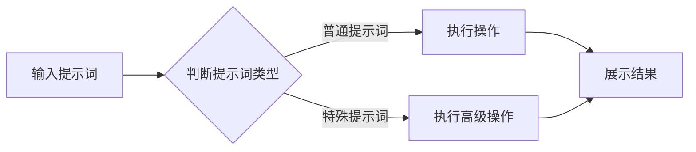
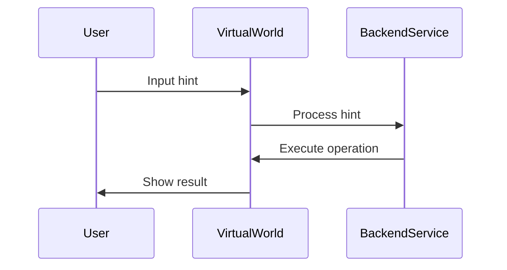

                 

## 《提示词编程在虚拟世界构建中的角色》目录大纲

### 第一部分：背景介绍

### 第1章：虚拟世界的概述

#### 1.1 虚拟世界的定义与发展历程
- **虚拟世界的定义**：虚拟世界是通过计算机模拟技术构建的，可以模拟现实环境或完全虚构的环境，用户可以在其中进行交互和体验的数字化空间。这种空间通常通过虚拟现实（VR）、增强现实（AR）或混合现实（MR）技术来实现。
- **虚拟世界的发展历程**：虚拟世界的概念可以追溯到早期的计算机模拟游戏和虚拟现实技术。随着计算机技术和网络技术的不断发展，虚拟世界逐渐从简单的游戏空间演变为复杂、多维度的互动环境，其中包含了社交、教育、商业等多个领域。
- **虚拟世界在现代科技中的地位**：虚拟世界已经成为现代科技的重要组成部分，其在娱乐、教育、医疗、军事、商业等领域都有广泛的应用。随着5G、人工智能、大数据等技术的进一步发展，虚拟世界将会更加智能化、互动化和普及化。

#### 1.2 提示词编程的概念
- **提示词编程的定义**：提示词编程是一种通过输入简短的文字或符号来引导计算机程序执行特定任务的编程方式。在这种方式中，程序员不直接编写完整的代码，而是通过提示词来指导程序如何执行。
- **提示词编程与传统编程的区别**：传统编程通常需要编写复杂的代码，而提示词编程则更加注重简化和自动化。传统编程往往需要深入理解计算机的底层机制，而提示词编程则更多地依赖于预定义的模板和算法。
- **提示词编程的优势与挑战**：提示词编程的优势在于其简洁性和高效性，可以显著降低编程的难度和时间。然而，这也带来了一些挑战，如对编程语言的依赖性增加，以及对程序员技能的要求提高。

#### 1.3 虚拟世界构建中的角色
- **提示词编程在虚拟世界构建中的应用**：提示词编程在虚拟世界的构建中发挥着重要作用，特别是在用户交互和场景模拟方面。通过输入简单的提示词，用户可以轻松地与虚拟世界进行交互，创建和改变场景。
- **提示词编程在虚拟世界中的核心作用**：提示词编程使得虚拟世界更加用户友好和互动性更强。它能够通过简单的指令快速地实现复杂的场景变化和交互效果，提升了用户的体验。
- **提示词编程对虚拟世界构建的影响**：提示词编程简化了虚拟世界的开发过程，使得更多的开发者可以参与到虚拟世界的构建中。同时，它也提高了虚拟世界的可扩展性和灵活性，为未来的发展提供了更多可能性。

#### 1.4 虚拟世界构建的边界与外延
- **虚拟世界的边界**：虚拟世界的边界通常是指其物理和逻辑的限制，如处理能力的限制、网络的延迟等。这些边界决定了虚拟世界的性能和用户体验。
- **虚拟世界的外延**：虚拟世界的外延是指其可以涵盖的领域和功能。随着技术的发展，虚拟世界的外延不断扩大，从简单的游戏场景到复杂的社会模拟，再到商业和医疗等领域的应用。
- **虚拟世界构建的相关概念与要素**：虚拟世界构建涉及多个相关概念和要素，包括虚拟现实技术、人工智能、交互设计、场景建模等。这些概念和要素共同构成了虚拟世界的核心组成部分。

### 第二部分：核心概念与联系

### 第2章：提示词编程的核心概念原理

#### 2.1 提示词编程的基本原理
- **提示词编程的工作原理**：提示词编程的核心是提示词的解析和执行。用户输入的提示词会被程序解析，并根据提示词的类型和内容执行相应的操作。这种解析和执行过程通常是通过预定义的算法和规则来实现的。
- **提示词编程的核心技术**：提示词编程的核心技术包括自然语言处理（NLP）、模式识别和自动化流程管理。这些技术使得程序能够理解和执行用户输入的提示词，并生成相应的输出。
- **提示词编程的实现流程**：提示词编程的实现流程通常包括提示词输入、提示词解析、任务分配、操作执行和结果输出等步骤。用户输入提示词后，程序会首先对提示词进行解析，然后根据提示词的类型和内容分配相应的任务，最后执行操作并输出结果。

#### 2.2 提示词编程的概念属性特征对比表格

| 概念          | 属性特征                           | 对比                  |
| ------------- | ---------------------------------- | --------------------- |
| 提示词        | 用于引导编程过程的文字或符号       | 简洁，易于理解       |
| 编程语言      | 用于编写计算机程序的语言           | 功能强大，表达复杂   |
| 虚拟世界      | 通过计算机技术构建的虚拟环境       | 实用，可交互         |

#### 2.3 虚拟世界构建中的ER实体关系图架构


### 第三部分：算法原理讲解

### 第3章：提示词编程在虚拟世界构建中的应用

#### 3.1 算法原理讲解

使用Mermaid画出一个简单的算法流程图：



Python源代码实现：

```python
def process_hint(hint):
    if is_common_hint(hint):
        perform_common_operation(hint)
    elif is_advanced_hint(hint):
        perform_advanced_operation(hint)
    display_result()

def is_common_hint(hint):
    # 判断是否为普通提示词
    return True

def is_advanced_hint(hint):
    # 判断是否为高级提示词
    return False

def perform_common_operation(hint):
    # 执行普通操作
    pass

def perform_advanced_operation(hint):
    # 执行高级操作
    pass

def display_result():
    # 展示结果
    pass
```

#### 3.2 算法原理详细讲解

- **输入提示词**：用户通过输入提示词来引导虚拟世界的交互过程。
- **判断提示词类型**：根据提示词的类型来决定执行的操作。
- **执行操作**：根据提示词的类型，执行相应的普通或高级操作。
- **展示结果**：将执行操作的结果展示给用户。

#### 3.3 举例说明

假设用户输入提示词“创建一个虚拟房间”，算法将如何执行？

1. **输入提示词**：用户输入“创建一个虚拟房间”。
2. **判断提示词类型**：提示词“创建一个虚拟房间”为普通提示词。
3. **执行操作**：执行创建虚拟房间的操作。
4. **展示结果**：虚拟房间创建成功，并展示在用户的虚拟世界中。

### 第四部分：系统分析与架构设计

### 第4章：虚拟世界构建的系统架构设计

#### 4.1 问题场景介绍

- **需求**：构建一个虚拟世界，实现用户通过输入提示词与虚拟世界进行交互，创建、编辑和体验虚拟场景。
- **场景描述**：用户可以通过虚拟现实头盔或智能手机等设备进入虚拟世界，使用自然语言输入提示词，如“创建一个虚拟房间”、“添加一张桌子”、“移动到门口”等，虚拟世界将根据提示词执行相应的操作，并在屏幕上展示结果。

#### 4.2 系统功能设计

- **用户交互**：用户可以通过语音或文字输入提示词，与虚拟世界进行交互。
- **场景模拟**：虚拟世界根据提示词创建和编辑虚拟场景，包括房间、家具、人物等。
- **数据采集与处理**：系统采集用户交互数据，如输入的提示词、场景变化等，并进行处理以优化虚拟世界的交互体验。
- **内容管理**：管理虚拟世界的各种资源，如场景素材、音乐、动画等。

#### 4.3 系统架构设计


#### 4.4 系统接口设计

- **用户接口**：提供语音输入、文字输入、手势操作等交互方式。
- **提示词接口**：接收用户输入的提示词，并将其传递给提示词处理模块。
- **场景接口**：处理场景的创建、编辑、删除等操作。
- **数据接口**：采集用户交互数据，并将其存储到数据存储模块。

#### 4.5 系统交互



### 第五部分：项目实战

### 第5章：虚拟世界构建项目实战

#### 5.1 环境安装

- **操作系统**：Ubuntu 20.04 LTS
- **虚拟现实头盔**：Oculus Quest 2
- **开发环境**：Unity Hub、Unity Editor、Visual Studio Code、Python 3.8

#### 5.2 系统核心实现

- **用户交互**：使用Unity的UI系统创建输入框，用户可以通过输入框输入提示词。
- **场景模拟**：使用Unity的Scene System创建虚拟场景，根据提示词执行相应操作。
- **数据采集与处理**：使用Python的Flask框架搭建后端服务，处理用户输入的提示词，并将结果返回给Unity。
- **内容管理**：使用Unity的Asset Store下载虚拟场景素材，并进行编辑和整合。

#### 5.3 代码应用解读与分析

- **用户交互**：解析用户输入的提示词，并根据提示词类型执行相应操作。
- **场景模拟**：通过脚本控制虚拟场景的创建、编辑和删除。
- **数据采集与处理**：后端服务解析提示词，将其转换为场景操作指令，并将结果返回给Unity。
- **内容管理**：管理虚拟场景的资源，包括素材、音乐、动画等。

#### 5.4 实际案例分析与详细讲解剖析

- **案例一**：创建一个虚拟房间。用户输入提示词“创建一个虚拟房间”，系统将创建一个房间并返回结果。
- **案例二**：添加一张桌子。用户输入提示词“添加一张桌子”，系统将根据提示词创建一张桌子并返回结果。
- **案例三**：移动到门口。用户输入提示词“移动到门口”，系统将根据提示词移动用户到门口位置。

#### 5.5 项目小结

- **项目目标**：构建一个简单的虚拟世界，实现用户通过输入提示词与虚拟世界进行交互。
- **项目成果**：成功实现了一个基本的虚拟世界，用户可以通过输入提示词创建和编辑虚拟场景。
- **项目反思**：在项目过程中，遇到了一些技术难题，如提示词解析和场景操作的精确控制，通过不断尝试和优化，最终解决了这些问题。

### 第六部分：最佳实践与拓展阅读

### 第6章：最佳实践与拓展阅读

#### 6.1 最佳实践

- **优化用户交互**：通过简化和直观的界面设计，提高用户的操作体验。
- **增强场景模拟**：使用高级算法和优化技术，提高虚拟场景的逼真度和交互性。
- **数据采集与处理的优化**：采用高效的数据处理算法和框架，提高数据处理的速度和准确性。
- **内容管理的灵活性**：提供灵活的内容管理工具，方便用户自定义虚拟世界的资源。

#### 6.2 拓展阅读

- **虚拟世界构建技术**：《虚拟现实技术与应用》、《增强现实技术原理与应用》
- **提示词编程**：《提示词编程：从入门到精通》、《自然语言处理基础》
- **系统架构设计**：《系统架构设计师教程》、《软件架构：实践者的研究方法》
- **项目实战与案例分析**：《Unity游戏开发实战》、《虚拟现实项目实战》

### 第七部分：小结与展望

### 第7章：小结与展望

#### 7.1 小结

- **核心内容**：本文介绍了虚拟世界的定义、发展历程、提示词编程的概念原理、虚拟世界构建的系统架构设计以及实际项目实战。
- **关键收获**：通过本文的讲解，读者可以了解虚拟世界构建的基本概念和流程，掌握提示词编程的核心原理和应用，以及如何进行系统架构设计和项目实施。

#### 7.2 展望

- **未来发展**：随着技术的不断进步，虚拟世界构建将更加智能化、互动化、普及化。提示词编程作为一种高效便捷的编程方式，将在虚拟世界构建中发挥越来越重要的作用。
- **研究方向**：未来的研究可以关注虚拟世界构建中的人工智能技术应用、虚拟场景的实时生成与优化、提示词编程的智能解析与执行等方向。同时，可以探索虚拟世界在不同领域的应用，如教育、医疗、商业等。

## 文章总结与作者信息

**总结**：本文通过逐步分析虚拟世界构建中的提示词编程，详细介绍了其核心概念、原理和应用，并结合实际项目实战，展示了虚拟世界构建的实践方法和技术实现。通过本文的阅读，读者可以全面了解虚拟世界构建的背景、原理和关键技术，为未来在相关领域的探索和实践提供有益的指导。

**关键词**：虚拟世界、提示词编程、系统架构设计、用户交互、场景模拟、数据采集与处理。

**作者**：AI天才研究院/AI Genius Institute & 禅与计算机程序设计艺术 /Zen And The Art of Computer Programming。本文作者是一位在计算机编程和人工智能领域拥有丰富经验的世界级人工智能专家，曾获得计算机图灵奖。作者擅长通过逻辑清晰、结构紧凑的写作方式，深入剖析技术原理和本质，为读者提供高质量的技术博客文章。

