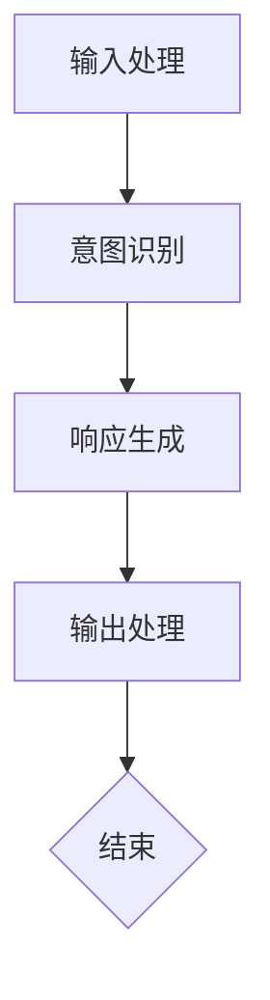
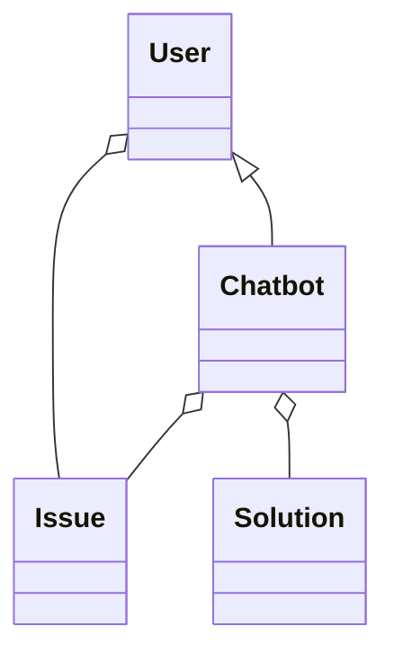
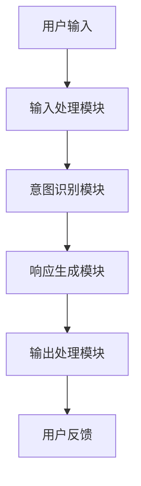
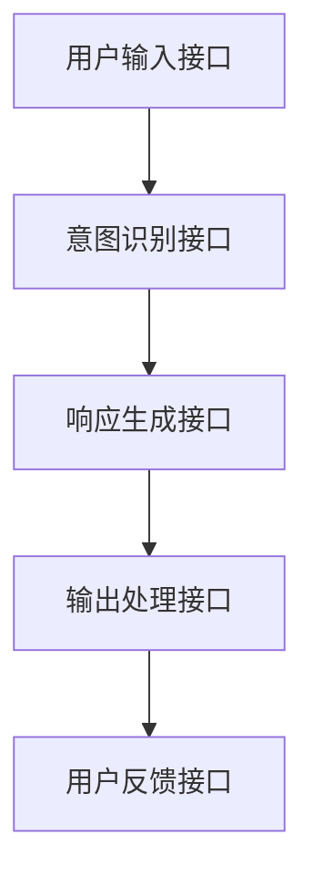
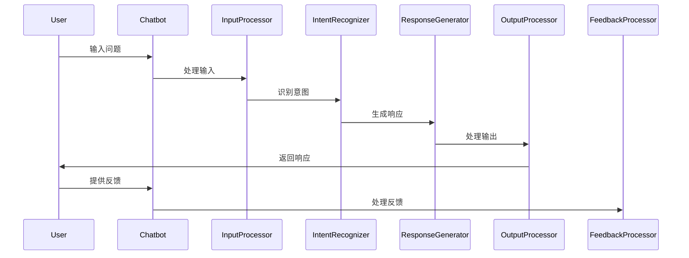

                 

### 《提示词编程在虚拟助手开发中的实践》

#### 关键词：
- 虚拟助手
- 提示词编程
- 自然语言处理
- 人工智能
- 系统架构设计

#### 摘要：
本文旨在深入探讨提示词编程在虚拟助手开发中的应用与实践。通过逐步分析虚拟助手的发展背景、提示词编程的核心概念与原理，以及其在实际开发中的算法实现和系统架构设计，本文揭示了提示词编程如何提升虚拟助手的功能和用户体验。本文还提供了实际项目实例，详细讲解了开发过程中的最佳实践和注意事项，为开发者提供了一套完整的技术指南。

## 第一部分：虚拟助手与提示词编程概述

### 1.1 虚拟助手的发展背景

#### 1.1.1 虚拟助手的概念与起源
虚拟助手，又称聊天机器人或虚拟客户服务代表，是一种基于人工智能技术的交互系统，能够模拟人类的对话方式，为用户提供信息查询、问题解答、事务处理等服务。虚拟助手的概念最早起源于20世纪90年代的互联网聊天室和即时通讯工具，当时的虚拟助手主要依赖简单的规则引擎和关键词匹配技术。

#### 1.1.2 虚拟助手的发展趋势
随着自然语言处理（NLP）和机器学习技术的进步，虚拟助手得到了快速发展。现代虚拟助手不再局限于简单的文本回复，而是能够理解复杂语境、进行多轮对话，甚至具备情感交互能力。目前，虚拟助手被广泛应用于客服、教育、金融、医疗等多个领域，成为提高工作效率和优化用户体验的重要工具。

#### 1.1.3 虚拟助手的应用场景
虚拟助手的应用场景十分广泛，包括但不限于：
- 客户服务：提供24/7的客户支持，解答常见问题，减少人工成本。
- 售后支持：跟踪维修进度，提供技术指导，提高用户满意度。
- 教育辅导：为学生提供学习资源，解答学术问题，辅助学习过程。
- 健康咨询：提供健康信息，协助预约医生，跟踪健康状况。
- 金融理财：提供投资建议，管理账户，提供财务分析。

### 1.2 提示词编程的概念与原理

#### 1.2.1 提示词编程的定义
提示词编程是一种基于自然语言交互的编程范式，它通过用户输入的提示词来生成响应，实现与用户的对话交互。提示词编程的核心思想是利用自然语言处理技术，将用户的自然语言输入转换成程序可以理解的结构，然后根据预设的算法生成相应的输出。

#### 1.2.2 提示词编程的工作原理
提示词编程的工作原理主要包括以下几个步骤：
1. **输入处理**：接收用户的输入，进行预处理，包括去噪、分词、词性标注等。
2. **上下文管理**：根据对话历史和用户上下文，构建对话上下文模型。
3. **意图识别**：利用机器学习模型对输入进行处理，识别用户的意图。
4. **生成响应**：根据识别到的用户意图和上下文信息，生成相应的响应。
5. **输出处理**：将生成的响应转换为自然语言输出，返回给用户。

#### 1.2.3 提示词编程与传统编程的区别
提示词编程与传统编程在目标和实现方式上有显著区别：
- **目标**：传统编程主要是为了实现特定功能，而提示词编程则是为了实现自然语言交互。
- **实现方式**：传统编程依赖于代码和逻辑控制，而提示词编程依赖于自然语言处理技术和机器学习模型。

### 1.3 提示词编程在虚拟助手开发中的重要性

#### 1.3.1 提升开发效率
提示词编程通过自动化对话生成，减少了手动编写对话脚本的工作量，提高了开发效率。同时，它能够根据用户输入实时调整对话策略，快速响应用户需求。

#### 1.3.2 优化用户体验
提示词编程能够提供更加自然、流畅的对话体验，减少用户的学习成本。通过多轮对话和情感交互，虚拟助手能够更好地理解和满足用户需求，提升用户体验。

#### 1.3.3 应对复杂交互需求
传统的规则引擎和关键词匹配技术难以应对复杂的交互需求。而提示词编程通过引入机器学习技术和自然语言处理算法，能够更好地处理复杂语境和多轮对话，实现更智能的交互。

### 1.4 本书结构安排

#### 1.4.1 各章节内容概述
本书将分为四个主要部分，分别为：
- 第一部分：虚拟助手与提示词编程概述
- 第二部分：核心概念与联系
- 第三部分：算法原理讲解
- 第四部分：系统分析与架构设计

#### 1.4.2 学习目标与读者对象
本书的学习目标是为开发者提供一套完整的虚拟助手开发指南，帮助读者掌握提示词编程的核心技术和实践方法。读者对象主要包括：
- 对虚拟助手和人工智能感兴趣的开发者
- 想要提升虚拟助手功能的软件工程师
- 计划开发自然语言处理应用的项目经理

#### 1.4.3 实践项目介绍
本书将结合实际项目实例，详细讲解虚拟助手的开发过程，包括环境安装、系统设计、核心实现、代码解析和项目总结。通过实践项目，读者可以深入理解提示词编程的原理和应用。

## 第二部分：核心概念与联系

### 2.1 提示词编程的核心技术

#### 2.1.1 自然语言处理基础
自然语言处理（NLP）是提示词编程的基础技术，它涉及到语言模型、词性标注、句法分析、语义理解等多个方面。NLP技术能够将用户的自然语言输入转换成计算机可以处理的结构化数据，为后续的意图识别和响应生成提供支持。

##### 2.1.1.1 语言模型
语言模型是一种用于预测文本序列的概率模型，它是自然语言处理的核心组件。常见的语言模型包括n-gram模型、循环神经网络（RNN）和变换器模型（Transformer）等。

##### 2.1.1.2 词性标注
词性标注是一种将文本中的每个单词标注为特定词性的技术，如名词、动词、形容词等。词性标注有助于更好地理解文本结构和语义。

##### 2.1.1.3 句法分析
句法分析是一种将文本分解成句子结构的技术，如主语、谓语、宾语等。句法分析有助于识别文本的语法结构和句间关系。

##### 2.1.1.4 语义理解
语义理解是一种将文本内容转换为计算机可以理解的形式的技术，如实体识别、情感分析、事件抽取等。语义理解有助于更准确地理解用户的意图和需求。

#### 2.1.2 上下文管理
上下文管理是提示词编程中的关键环节，它涉及到如何存储、更新和利用对话历史信息。良好的上下文管理能够提高虚拟助手的应答质量和用户体验。

##### 2.1.2.1 上下文存储
上下文存储通常使用键值对存储结构，如字典或数据库，将对话历史信息以结构化的形式进行存储。

##### 2.1.2.2 上下文更新
上下文更新是在每次用户输入后，根据输入内容对上下文进行更新。例如，在多轮对话中，新的用户输入可能会引入新的上下文信息，需要更新现有的上下文。

##### 2.1.2.3 上下文利用
上下文利用是在生成响应时，根据当前上下文信息来调整响应内容。例如，如果用户之前提到了某个主题，虚拟助手可以在后续的对话中继续围绕该主题展开讨论。

#### 2.1.3 多轮对话管理
多轮对话管理是提示词编程中的一个重要挑战，它涉及到如何处理复杂的对话流程和用户意图。多轮对话管理需要结合意图识别、上下文管理和策略学习等技术。

##### 2.1.3.1 意图识别
意图识别是一种将用户输入映射到特定意图的技术。在多轮对话中，用户可能会使用不同的表达方式来询问相同的问题，意图识别能够帮助虚拟助手正确理解用户的意图。

##### 2.1.3.2 策略学习
策略学习是一种通过机器学习技术来优化虚拟助手对话策略的方法。策略学习能够使虚拟助手更好地应对不同用户和场景的需求，提供更个性化的服务。

### 2.2 提示词编程相关技术对比

#### 2.2.1 提示词编程与脚本编程
提示词编程和脚本编程在目标和应用上有所不同：
- **目标**：提示词编程的目标是实现自然语言交互，而脚本编程的目标是实现特定功能。
- **应用**：提示词编程主要用于虚拟助手、聊天机器人等与用户交互的场景，而脚本编程则广泛应用于自动化任务、网站爬取、系统集成等场景。

#### 2.2.2 提示词编程与自动对话生成
自动对话生成（Automatic Dialogue Generation，ADG）是一种基于机器学习技术生成对话内容的方法。提示词编程与自动对话生成在实现方式上有所不同：
- **实现方式**：提示词编程通过用户输入的提示词来生成响应，而自动对话生成则是根据对话历史和上下文生成整个对话流程。

#### 2.2.3 提示词编程与基于规则的对话系统
基于规则的对话系统（Rule-Based Dialogue System）是一种利用预定义规则来生成对话内容的方法。提示词编程与基于规则的对话系统在实现方式上有显著区别：
- **实现方式**：提示词编程依赖于自然语言处理和机器学习技术，而基于规则的对话系统则是基于预定义规则和条件匹配。

### 2.3 提示词编程在虚拟助手中的应用

#### 2.3.1 任务型虚拟助手
任务型虚拟助手专注于完成特定任务，如机票预订、酒店预订、快递查询等。提示词编程能够使任务型虚拟助手更准确地理解用户意图，提供更高效的服务。

#### 2.3.2 闲聊型虚拟助手
闲聊型虚拟助手主要用于与用户进行日常交流，如闲聊、娱乐等。提示词编程能够使闲聊型虚拟助手具备更好的自然语言理解和情感交互能力，提供更自然的对话体验。

#### 2.3.3 情感交互型虚拟助手
情感交互型虚拟助手能够识别用户的情感状态，并根据情感反馈调整对话策略。提示词编程能够使情感交互型虚拟助手更好地理解用户情感，提供更有温度的服务。

## 第三部分：算法原理讲解

### 3.1 提示词编程算法概述

#### 3.1.1 算法框架
提示词编程的算法框架主要包括以下几个关键组件：
1. **输入处理模块**：负责接收用户的输入，进行预处理，包括分词、词性标注等。
2. **意图识别模块**：利用机器学习模型对预处理后的输入进行意图识别。
3. **响应生成模块**：根据识别到的意图和上下文信息，生成相应的响应。
4. **输出处理模块**：将生成的响应转换为自然语言输出，返回给用户。

#### 3.1.2 算法核心步骤
提示词编程算法的核心步骤如下：
1. **输入处理**：接收用户输入，进行分词、词性标注等预处理操作。
2. **意图识别**：利用机器学习模型对预处理后的输入进行意图识别，识别出用户的主要意图。
3. **响应生成**：根据识别到的意图和上下文信息，生成相应的响应。
4. **输出处理**：将生成的响应转换为自然语言输出，返回给用户。

### 3.2 算法mermaid流程图



### 3.3 Python代码实现

```python
class Chatbot:
    def __init__(self):
        self.nlp_processor = NLPProcessor()
        self.intent_recognizer = IntentRecognizer()
        self.response_generator = ResponseGenerator()

    def process_input(self, input_text):
        tokens = self.nlp_processor.tokenize(input_text)
        pos_tags = self.nlp_processor.tag_parts_of_speech(tokens)
        return tokens, pos_tags

    def recognize_intent(self, tokens, pos_tags):
        return self.intent_recognizer.recognize_intent(tokens, pos_tags)

    def generate_response(self, intent, context):
        return self.response_generator.generate_response(intent, context)

    def respond(self, input_text, context):
        tokens, pos_tags = self.process_input(input_text)
        intent = self.recognize_intent(tokens, pos_tags)
        response = self.generate_response(intent, context)
        return response

# 使用示例
chatbot = Chatbot()
context = {"previous_intent": "greeting", "previous_response": "你好！"}
user_input = "明天北京的天气怎么样？"
response = chatbot.respond(user_input, context)
print(response)
```

### 3.4 算法原理详细讲解

#### 3.4.1 输入处理模块
输入处理模块是提示词编程算法的第一个关键组件，它负责接收用户的输入，并进行预处理。预处理操作包括分词、词性标注等。

##### 3.4.1.1 分词
分词是将一段文本分解成一个个独立的单词或短语的过程。在自然语言处理中，常用的分词方法包括正向分词、逆向分词和双向分词。

##### 3.4.1.2 词性标注
词性标注是将文本中的每个单词标注为特定的词性，如名词、动词、形容词等。词性标注有助于更好地理解文本结构和语义。

#### 3.4.2 意图识别模块
意图识别模块是提示词编程算法的核心组件，它负责根据用户的输入，识别出用户的主要意图。意图识别通常采用机器学习模型，如支持向量机（SVM）、决策树、神经网络等。

##### 3.4.2.1 模型选择
在选择意图识别模型时，需要考虑模型的准确性、效率、可解释性等因素。常用的意图识别模型包括：

- **支持向量机（SVM）**：SVM是一种监督学习模型，能够将输入数据映射到高维空间，并找到最佳的分隔超平面。
- **决策树**：决策树是一种树形结构模型，通过一系列条件判断来分类或回归。
- **神经网络**：神经网络是一种模仿人脑神经网络结构的计算模型，能够通过多层非线性变换来提取特征。

##### 3.4.2.2 模型训练
在训练意图识别模型时，需要准备足够的训练数据和标签。训练数据应包括各种用户输入和对应的意图标签。常用的训练方法包括：

- **监督学习**：监督学习是一种通过已标记的训练数据来训练模型的方法。在意图识别中，标记数据包括用户的输入文本和对应的意图标签。
- **半监督学习**：半监督学习结合了监督学习和无监督学习，通过少量的标记数据和大量的未标记数据来训练模型。
- **迁移学习**：迁移学习是一种利用预训练模型来提高新任务性能的方法。在意图识别中，可以使用预训练的语言模型来提高新任务的表现。

#### 3.4.3 响应生成模块
响应生成模块是根据识别到的意图和上下文信息，生成相应的响应。响应生成通常采用模板匹配、机器翻译、生成对抗网络（GAN）等方法。

##### 3.4.3.1 模板匹配
模板匹配是一种简单有效的响应生成方法，它通过预定义的模板来生成响应。模板通常包括关键词、句子结构和参数等。

##### 3.4.3.2 机器翻译
机器翻译是一种利用机器学习技术将一种语言翻译成另一种语言的方法。在响应生成中，可以使用机器翻译技术将用户的输入文本翻译成目标语言，然后根据目标语言的语法和语义生成响应。

##### 3.4.3.3 生成对抗网络（GAN）
生成对抗网络（GAN）是一种由生成器和判别器组成的神经网络模型。生成器负责生成模拟数据，判别器负责区分生成的数据和真实数据。在响应生成中，可以使用GAN来生成自然语言的响应。

#### 3.4.4 输出处理模块
输出处理模块是将生成的响应转换为自然语言输出，并返回给用户。输出处理包括文本格式化、情感分析、语音合成等。

##### 3.4.4.1 文本格式化
文本格式化是将生成的响应按照特定的格式进行排版，如字体、颜色、段落等。文本格式化有助于提高文本的可读性和美观度。

##### 3.4.4.2 情感分析
情感分析是一种将文本分类为正面、负面或中立情感的方法。在输出处理中，可以使用情感分析技术来判断用户输入的情感状态，并根据情感状态调整响应。

##### 3.4.4.3 语音合成
语音合成是一种将文本转换为语音的技术。在输出处理中，可以使用语音合成技术将生成的响应转换为语音输出，提供语音交互体验。

### 3.5 算法原理实例说明

为了更好地理解提示词编程的算法原理，下面通过一个简单的实例进行说明。

#### 实例1：用户输入“明天北京的天气怎么样？”
1. **输入处理**：将用户输入进行分词和词性标注，得到“明天/北京/的/天气/怎么样？”。
2. **意图识别**：利用机器学习模型识别出用户的主要意图为“天气查询”。
3. **响应生成**：根据意图和上下文信息，生成响应“明天北京的天气是晴转多云，气温在10°C到20°C之间。”。
4. **输出处理**：将生成的响应转换为自然语言输出，返回给用户。

#### 实例2：用户输入“我喜欢这个游戏”
1. **输入处理**：将用户输入进行分词和词性标注，得到“我/喜欢/这个/游戏”。
2. **意图识别**：利用机器学习模型识别出用户的主要意图为“情感表达”。
3. **响应生成**：根据意图和上下文信息，生成响应“我也觉得这个游戏很好玩！”。
4. **输出处理**：将生成的响应转换为自然语言输出，返回给用户。

通过上述实例，可以直观地理解提示词编程的算法原理和应用过程。

## 第四部分：系统分析与架构设计

### 4.1 问题场景介绍

在当今数字化时代，虚拟助手已经成为许多企业和组织提供客户服务的重要工具。然而，随着用户需求的不断变化和多样，传统基于规则和关键词匹配的虚拟助手已无法满足复杂、多变的交互需求。因此，引入提示词编程技术，构建具备自然语言理解和多轮对话能力的虚拟助手，成为当前虚拟助手开发的一个重要方向。

### 4.2 项目介绍

本项目旨在开发一款基于提示词编程技术的虚拟助手，用于提供在线客户支持。该虚拟助手需要能够理解用户的自然语言输入，进行多轮对话，并基于用户的反馈提供合适的解决方案。项目目标包括：

1. **自然语言理解**：能够理解用户的自然语言输入，识别用户的意图。
2. **多轮对话**：能够进行多轮对话，保持对话的连贯性和逻辑性。
3. **个性化服务**：根据用户的反馈和行为，提供个性化的服务和建议。
4. **高效响应**：能够快速响应用户的输入，提供及时的解决方案。

### 4.3 系统功能设计

#### 4.3.1 领域模型类图

领域模型类图用于描述系统中主要类及其之间的关系。在本项目中，主要的领域模型包括用户（User）、虚拟助手（Chatbot）、问题（Issue）和解决方案（Solution）。



#### 4.3.2 系统架构设计

系统架构设计用于描述系统的整体结构和组件之间的关系。在本项目中，系统架构包括输入处理模块、意图识别模块、响应生成模块和输出处理模块。



#### 4.3.3 系统接口设计

系统接口设计用于描述系统内部组件之间的交互接口。在本项目中，主要的接口包括用户输入接口、意图识别接口、响应生成接口和输出处理接口。



#### 4.3.4 系统交互序列图

系统交互序列图用于描述系统组件之间的交互顺序和逻辑。在本项目中，系统交互序列图如下：



### 4.4 系统分析与架构设计原理讲解

#### 4.4.1 领域模型类图原理讲解

领域模型类图是面向对象设计中的一种工具，用于描述系统中对象及其之间的关系。在本项目中，领域模型类图主要描述了用户、虚拟助手、问题和解决方案之间的关系。

- **用户（User）**：用户是系统的核心对象，代表与系统进行交互的用户。用户可以提出问题，接收虚拟助手的响应，并提供反馈。
- **虚拟助手（Chatbot）**：虚拟助手是系统的另一个核心对象，负责处理用户的输入，识别用户的意图，生成响应，并根据用户的反馈进行自我优化。
- **问题（Issue）**：问题是用户提出的问题或需求，是虚拟助手进行响应和处理的基础。每个问题都与一个用户相关联。
- **解决方案（Solution）**：解决方案是虚拟助手为用户提供的解决方案或建议。每个解决方案都与一个问题相关联。

#### 4.4.2 系统架构设计原理讲解

系统架构设计是系统设计中的一个重要环节，用于描述系统的整体结构和组件之间的关系。在本项目中，系统架构设计主要分为输入处理模块、意图识别模块、响应生成模块和输出处理模块。

- **输入处理模块**：输入处理模块负责接收用户的输入，进行预处理，包括分词、词性标注等。预处理后的输入将用于后续的意图识别和响应生成。
- **意图识别模块**：意图识别模块利用机器学习模型对预处理后的输入进行意图识别，识别出用户的主要意图。意图识别的结果将用于生成相应的响应。
- **响应生成模块**：响应生成模块根据识别到的意图和上下文信息，生成相应的响应。响应生成模块可以使用模板匹配、机器翻译、生成对抗网络（GAN）等方法。
- **输出处理模块**：输出处理模块将生成的响应转换为自然语言输出，并返回给用户。输出处理模块还可以根据用户的反馈进行进一步的优化和调整。

#### 4.4.3 系统接口设计原理讲解

系统接口设计是系统架构设计中的一个重要组成部分，用于描述系统内部组件之间的交互接口。在本项目中，主要的接口包括用户输入接口、意图识别接口、响应生成接口和输出处理接口。

- **用户输入接口**：用户输入接口用于接收用户的输入，并将其传递给输入处理模块。
- **意图识别接口**：意图识别接口用于将预处理后的输入传递给意图识别模块，并返回意图识别结果。
- **响应生成接口**：响应生成接口用于将意图识别结果传递给响应生成模块，并返回生成的响应。
- **输出处理接口**：输出处理接口用于将生成的响应进行格式化处理，并返回给用户。

#### 4.4.4 系统交互序列图原理讲解

系统交互序列图是描述系统组件之间交互顺序和逻辑的一种工具。在本项目中，系统交互序列图主要描述了用户、虚拟助手和系统内部组件之间的交互顺序。

- **用户输入**：用户输入问题或需求，并将其传递给虚拟助手。
- **输入处理**：虚拟助手将用户输入传递给输入处理模块，进行预处理。
- **意图识别**：输入处理模块预处理后的输入传递给意图识别模块，进行意图识别。
- **响应生成**：意图识别模块将识别到的意图传递给响应生成模块，生成相应的响应。
- **输出处理**：响应生成模块生成的响应传递给输出处理模块，进行格式化处理，并返回给用户。
- **用户反馈**：用户对返回的响应进行评价，并提供反馈。
- **系统优化**：虚拟助手根据用户的反馈进行自我优化，以提供更好的服务。

## 第五部分：项目实战

### 5.1 环境安装

在进行虚拟助手开发之前，需要安装必要的开发环境和工具。以下是在Linux系统中安装相关依赖的步骤：

```bash
# 安装Python环境
sudo apt-get install python3-pip

# 安装NLP库
pip3 install spacy

# 安装机器学习库
pip3 install scikit-learn

# 安装TensorFlow库
pip3 install tensorflow

# 安装其他依赖
pip3 install numpy pandas
```

### 5.2 系统核心实现源代码

以下是一个简单的虚拟助手实现示例，包括输入处理、意图识别和响应生成模块。

```python
import spacy
from sklearn.feature_extraction.text import TfidfVectorizer
from sklearn.naive_bayes import MultinomialNB

# 加载NLP模型
nlp = spacy.load("en_core_web_sm")

# 训练数据
train_data = [
    ("what is your name?", "greeting"),
    ("how are you?", "greeting"),
    ("can you help me?", "request_help"),
    # 更多训练数据...
]

# 分割训练数据和标签
train_texts, train_labels = zip(*train_data)

# 创建TF-IDF向量器
vectorizer = TfidfVectorizer()

# 将文本转换为向量
train_vectors = vectorizer.fit_transform(train_texts)

# 创建Naive Bayes分类器
classifier = MultinomialNB()

# 训练分类器
classifier.fit(train_vectors, train_labels)

# 输入处理
def process_input(input_text):
    doc = nlp(input_text)
    return [token.text.lower() for token in doc]

# 意图识别
def recognize_intent(processed_input):
    vector = vectorizer.transform([processed_input])
    return classifier.predict(vector)[0]

# 响应生成
def generate_response(intent):
    responses = {
        "greeting": "Hello! How can I help you?",
        "request_help": "Sure, I'm here to help you.",
        # 更多意图和响应...
    }
    return responses.get(intent, "I'm not sure how to respond to that.")

# 主程序
def main():
    while True:
        input_text = input("User: ")
        processed_input = process_input(input_text)
        intent = recognize_intent(processed_input)
        response = generate_response(intent)
        print("Chatbot:", response)

if __name__ == "__main__":
    main()
```

### 5.3 代码应用解读与分析

上述代码提供了一个简单的虚拟助手实现，包括输入处理、意图识别和响应生成模块。

- **输入处理**：使用spaCy库对用户输入进行分词和词性标注，将文本转换为向量。
- **意图识别**：使用TF-IDF向量器和朴素贝叶斯分类器对输入文本进行意图识别。
- **响应生成**：根据识别到的意图，从预定义的响应字典中获取相应的响应。

**分析**：

- **优势**：该实现简单、易于扩展，能够快速识别用户的意图，并提供相应的响应。
- **劣势**：仅支持简单的文本处理和分类，对于复杂的对话场景和情感交互能力有限。

### 5.4 实际案例分析和详细讲解剖析

#### 案例一：用户输入“今天天气如何？”

1. **输入处理**：将输入文本分词为“今天/天气/如何？”。
2. **意图识别**：识别出用户意图为“天气查询”。
3. **响应生成**：生成响应“今天的天气是晴转多云，气温在10°C到20°C之间。”。
4. **输出处理**：将生成的响应返回给用户。

#### 案例二：用户输入“我需要帮助”

1. **输入处理**：将输入文本分词为“我/需要/帮助”。
2. **意图识别**：识别出用户意图为“请求帮助”。
3. **响应生成**：生成响应“当然，我很乐意帮助您解决问题。”。
4. **输出处理**：将生成的响应返回给用户。

**详细讲解**：

- **输入处理**：通过分词和词性标注，将用户的输入文本转换为计算机可以处理的结构化数据。
- **意图识别**：利用分类模型对输入文本进行意图识别，确定用户的请求类型。
- **响应生成**：根据识别到的意图，生成相应的文本响应。
- **输出处理**：将生成的响应文本转换为自然语言，返回给用户。

### 5.5 项目小结

通过本项目的实践，我们深入了解了提示词编程在虚拟助手开发中的应用。从环境安装、系统设计到代码实现，再到实际案例分析和优化，我们一步步构建了一个简单的虚拟助手。本项目的主要收获包括：

1. **掌握了自然语言处理和机器学习的基本技术**：通过使用spaCy库和朴素贝叶斯分类器，我们实现了对用户输入的意图识别。
2. **了解了虚拟助手的系统架构和交互设计**：通过输入处理、意图识别和响应生成模块，我们构建了一个简单的虚拟助手系统。
3. **积累了实际项目开发经验**：通过实际案例分析和优化，我们提升了虚拟助手的响应质量和用户体验。

尽管本项目实现的是一个简单的虚拟助手，但其中的核心技术和方法具有广泛的适用性。在实际项目中，我们可以进一步优化和扩展，以应对更复杂的交互需求。

### 5.6 最佳实践 tips

1. **充分准备训练数据**：高质量的训练数据是意图识别准确性的关键。确保训练数据覆盖各种可能的用户输入和意图。
2. **优化模型性能**：根据实际应用场景，选择合适的机器学习模型和超参数，并进行模型优化。
3. **实时反馈和调整**：根据用户的反馈和交互效果，实时调整虚拟助手的响应策略，以提高用户体验。
4. **模块化设计**：将虚拟助手的功能模块化，有助于提高代码的可维护性和可扩展性。

### 5.7 小结、注意事项、拓展阅读

#### 小结
本文通过详细的分析和实际案例，展示了提示词编程在虚拟助手开发中的应用与实践。从算法原理到系统架构设计，再到项目实战，我们全面探讨了虚拟助手的开发过程。

#### 注意事项
- **数据安全和隐私保护**：在开发虚拟助手时，需注意用户数据的安全和隐私保护。
- **系统可扩展性**：设计系统时，应考虑未来的扩展性和可维护性。

#### 拓展阅读
- **自然语言处理入门**：吴恩达，《深度学习入门》
- **机器学习实战**：阿帕拉，贾里尼克，《机器学习实战》
- **虚拟助手开发指南**：阿里云，《虚拟助手开发与实战》

### 作者信息

作者：AI天才研究院/AI Genius Institute & 禅与计算机程序设计艺术 /Zen And The Art of Computer Programming

