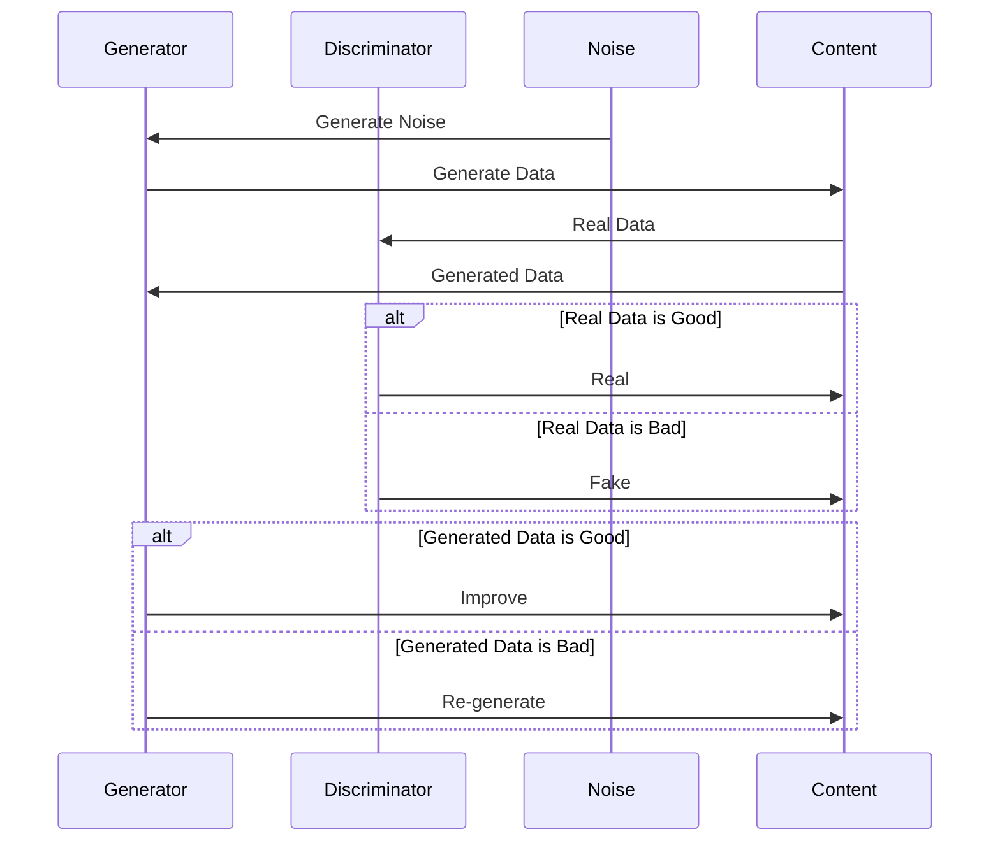
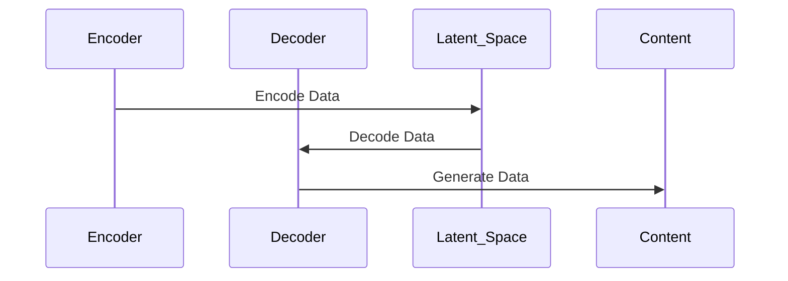
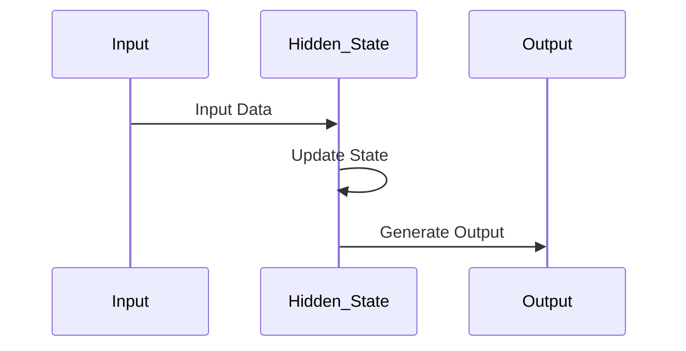
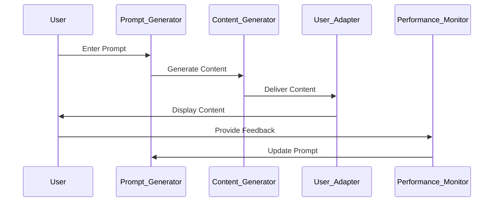

                 

## Introduction and Background

### The Significance of Prompt-based Programming in VR Content Generation

Prompt-based programming has emerged as a revolutionary concept in the realm of virtual reality (VR) content generation. In a landscape where immersive experiences are becoming increasingly popular, the need for efficient and effective content creation methods is paramount. Traditional content generation techniques, often labor-intensive and time-consuming, are no longer sufficient to keep up with the rapidly evolving demands of the VR industry.

Prompt-based programming offers a new paradigm by leveraging advanced algorithms and machine learning techniques to automate and streamline the content generation process. At its core, prompt-based programming involves generating content by providing a set of initial prompts or instructions to an algorithm, which then expands and refines the content based on these inputs. This approach allows for the creation of rich, complex VR experiences with minimal human intervention, significantly reducing the time and effort required.

In the context of VR content generation, the significance of prompt-based programming cannot be overstated. Virtual reality content often involves intricate environments, characters, and interactions that are difficult to design manually. By utilizing prompt-based programming, developers can create these elements more efficiently, ensuring that the resulting VR experiences are both visually appealing and highly interactive.

Furthermore, the ability to generate content on-demand using prompts offers unprecedented flexibility. Developers can quickly adapt and update content in response to user feedback or changing market trends, keeping their VR offerings fresh and engaging. This level of dynamism is essential in a competitive industry where user satisfaction and retention are critical.

Overall, prompt-based programming holds the promise of transforming the VR content creation landscape. By automating and optimizing the content generation process, it enables developers to deliver more immersive and engaging virtual reality experiences, ultimately driving innovation and growth in the VR market.

### Definition and Basic Concepts

To delve deeper into prompt-based programming, it's essential to understand its basic concepts and how they relate to VR content generation. At its most fundamental level, prompt-based programming refers to a method of content creation where algorithms are provided with initial prompts or instructions to generate subsequent content. These prompts can be simple keywords, full sentences, or even more complex data structures, depending on the application and the desired output.

The primary objective of prompt-based programming is to leverage the power of algorithms and machine learning to automate and enhance the content creation process. By defining specific prompts, developers can guide the algorithm towards creating content that meets specific criteria or requirements. This approach allows for greater precision and control over the generated content, ensuring that it aligns with the desired objectives.

In the context of VR content generation, prompts serve as the foundational inputs that shape the creation of virtual environments, characters, and interactions. For example, a prompt might specify the type of environment (e.g., a bustling city or a serene forest), the characteristics of characters (e.g., their appearance, behavior, and dialogues), or the nature of interactions (e.g., casual conversations or intense conflicts). By providing these detailed prompts, developers can direct the algorithm to generate VR content that is both realistic and engaging.

Several key concepts are integral to the effectiveness of prompt-based programming in VR content generation. These include:

1. **Machine Learning Algorithms**: The algorithms used in prompt-based programming are typically based on machine learning techniques, such as natural language processing (NLP), generative adversarial networks (GANs), and reinforcement learning. These algorithms are trained on large datasets to understand patterns, contexts, and relationships within the data, enabling them to generate content that is both coherent and contextually appropriate.

2. **Prompt Granularity**: The granularity of prompts can significantly impact the quality and relevance of the generated content. More detailed and specific prompts can result in highly customized and precise outputs, while broader prompts may yield more generalized or abstract results.

3. **Content Generation Models**: Various content generation models, such as sequence-to-sequence models, transformer models, and attention mechanisms, are employed to process and expand prompts effectively. Each model has its strengths and limitations, making it essential for developers to choose the most appropriate model for their specific needs.

4. **User Interaction**: Prompt-based programming also involves integrating user input and feedback into the content generation process. This interaction allows users to influence the generated content in real-time, enhancing the overall user experience and making the VR environment more dynamic and responsive.

Understanding these core concepts is crucial for leveraging prompt-based programming to its full potential in VR content generation. By combining these concepts with advanced algorithms and machine learning techniques, developers can create highly immersive and interactive virtual reality experiences that captivate and engage users.

### Relationship Between Prompt-based Programming and VR Content Generation

Prompt-based programming and VR content generation are intrinsically linked, with each reinforcing and enhancing the other in the creation of immersive virtual environments. The synergy between these two concepts can be observed through several key areas of integration and mutual enhancement.

Firstly, prompt-based programming significantly enhances the efficiency of VR content generation. By providing detailed and structured prompts, developers can guide algorithms to generate specific content elements, such as environments, characters, and interactions, with minimal manual oversight. This automation reduces the time and effort required to create complex VR content, allowing developers to focus on other critical aspects of the project. For example, a prompt specifying the characteristics of a virtual city, such as its architectural style, population density, and weather conditions, can instruct an algorithm to generate an intricate and realistic urban environment quickly and accurately.

Secondly, VR content generation serves as a practical application that showcases the capabilities and advantages of prompt-based programming. The complex and dynamic nature of VR content necessitates sophisticated algorithms and machine learning techniques, which are precisely the strengths of prompt-based programming. By leveraging these techniques, developers can create highly interactive and engaging VR experiences that respond to user inputs and adapt to changing environments. For instance, a VR game that employs prompt-based programming to generate real-time weather effects or dynamic NPC behaviors offers a more immersive and realistic experience compared to static, pre-designed environments.

Furthermore, the feedback loop created by VR content generation enhances the learning and refinement process of prompt-based programming algorithms. As users interact with the generated VR content, their feedback can be analyzed to improve the prompts and the resulting content. This iterative process allows for continuous optimization of the algorithms, leading to more accurate and relevant content generation over time. For example, if users consistently complain about the difficulty of a particular level in a VR game, the algorithm can adjust the prompts to generate a level that aligns better with players' expectations and skill levels.

Additionally, the integration of prompt-based programming in VR content generation enables personalized and adaptive experiences. By analyzing user data and preferences, algorithms can generate content tailored to individual users, creating a more engaging and tailored experience. For instance, a VR experience that uses prompt-based programming to generate characters and storylines based on a user's preferences and past interactions provides a more immersive and satisfying experience.

In summary, the relationship between prompt-based programming and VR content generation is symbiotic, with each enhancing the other's capabilities and effectiveness. Prompt-based programming provides a powerful tool for automating and optimizing the content generation process, while VR content generation serves as a practical application that demonstrates the potential and advantages of this approach. Together, they pave the way for more immersive, interactive, and personalized virtual reality experiences, driving innovation and excellence in the VR industry.

### Chapter 1: Overview of Prompt-based Programming

### Introduction and Objective

In this chapter, we will provide an in-depth overview of prompt-based programming, a revolutionary concept that is reshaping the landscape of content generation, particularly in the context of virtual reality (VR). The primary objective of this chapter is to establish a foundational understanding of prompt-based programming, its core principles, and how it can be effectively utilized in VR content generation.

### Key Terms and Concepts

Before diving into the specifics of prompt-based programming, it is crucial to define and understand some key terms and concepts. These include:

1. **Prompt-based Programming**: A method of content generation where algorithms are provided with initial prompts or instructions to generate subsequent content.
2. **Machine Learning**: A subset of artificial intelligence that involves training algorithms to learn from data and make predictions or decisions.
3. **Generative Models**: Algorithms designed to generate new data instances based on patterns observed in existing data.
4. **Natural Language Processing (NLP)**: A field of computer science and AI that focuses on the interaction between computers and human language.
5. **Virtual Reality (VR)**: A computer-generated simulated environment that can be experienced through sensory stimuli, such as sight, sound, and touch.

### Problem Background and Description

The background for this chapter is the growing demand for immersive and interactive VR content. Traditional content creation methods, which rely heavily on manual design and development, are no longer sufficient to meet the increasing complexity and diversity of VR experiences. Prompt-based programming offers a solution by automating and optimizing the content generation process, making it possible to create high-quality VR content more efficiently and at scale.

The problem we aim to address is the inefficiency and limitations of manual content creation in VR. Specifically, the challenges include:

1. **Time and Resource Intensive**: Manually designing and developing VR content requires significant time and resources, making it difficult to scale production.
2. **Limited Creativity**: Manual design can lead to repetitive and uncreative content, limiting the diversity and novelty of VR experiences.
3. **User Personalization**: Traditional methods struggle to adapt content based on user preferences and feedback, leading to a less personalized and engaging user experience.

### Problem Solutions and Steps

To overcome these challenges, prompt-based programming offers a structured and systematic approach to VR content generation. The key steps involved in this approach are:

1. **Define Prompts**: Create detailed and structured prompts that specify the desired content elements, such as environments, characters, and interactions.
2. **Algorithm Training**: Train machine learning algorithms on large datasets to learn patterns and generate content based on the provided prompts.
3. **Content Generation**: Use the trained algorithms to generate VR content based on the defined prompts.
4. **Iterative Refinement**: Continuously refine and optimize the content generation process based on user feedback and performance metrics.

### Boundary and Scope

The scope of this chapter is to provide an overview of prompt-based programming and its application in VR content generation. We will cover the fundamental concepts, key terms, and the problem-solving approach without delving into specific implementation details or advanced techniques.

### Concept Structure and Core Elements

The core concept structure of prompt-based programming in VR content generation can be summarized as follows:

1. **Input Prompts**: Detailed and structured prompts that guide the content generation process.
2. **Machine Learning Algorithms**: Algorithms trained to generate content based on the input prompts.
3. **Content Generation**: The process of creating VR content using the trained algorithms.
4. **Feedback and Iteration**: Continuously refining the content based on user feedback and performance metrics.

By understanding these core elements, developers can leverage prompt-based programming to create efficient and engaging VR content. In the next chapters, we will explore each of these elements in greater detail, providing a comprehensive understanding of how prompt-based programming can transform VR content generation.

### Chapter 2: Core Principles of Prompt-based Programming

### Introduction and Objective

In this chapter, we will delve into the core principles of prompt-based programming, exploring the foundational concepts that drive its effectiveness in VR content generation. The primary objective of this chapter is to provide a thorough understanding of these principles, including the role of machine learning, generative models, and natural language processing. By the end of this chapter, readers will have a solid grasp of the essential components that make prompt-based programming a powerful tool in VR content creation.

### Core Concept and Relationships

#### Machine Learning

At the heart of prompt-based programming lies machine learning (ML). ML is a subset of artificial intelligence (AI) that involves training algorithms to learn from data and make predictions or decisions. In the context of VR content generation, ML algorithms are used to process and interpret prompts, generating coherent and relevant content. Key components of machine learning relevant to prompt-based programming include:

1. **Training Data**: Large datasets containing examples of the content to be generated. These datasets are used to train the algorithms, allowing them to learn patterns and relationships within the data.
2. **Feature Extraction**: The process of identifying and extracting relevant features from the data that will be used by the algorithms to make predictions.
3. **Model Evaluation**: Assessing the performance of the trained models through metrics such as accuracy, precision, and recall to ensure they generate content that meets the desired standards.

#### Generative Models

Generative models are a class of ML algorithms designed to generate new data instances based on patterns learned from existing data. In VR content generation, generative models play a crucial role in creating detailed and complex virtual environments, characters, and interactions. Key types of generative models include:

1. **Generative Adversarial Networks (GANs)**: A framework consisting of two neural networks—generator and discriminator—that compete with each other to improve the quality of generated content. The generator creates content, while the discriminator evaluates its quality. Over time, the generator learns to produce content that is indistinguishable from real data.
2. **Variational Autoencoders (VAEs)**: An ML model that encodes input data into a lower-dimensional representation and then decodes it back into the original format. VAEs are particularly effective in generating diverse and realistic VR content by learning the underlying data distribution.
3. **Recurrent Neural Networks (RNNs)**: A type of neural network that can process sequences of data, making them suitable for generating VR content that requires temporal coherence, such as animations and dialogues.

#### Natural Language Processing (NLP)

Natural Language Processing (NLP) is the branch of AI that focuses on the interaction between computers and human language. NLP is essential in prompt-based programming for understanding and processing the prompts provided by developers. Key aspects of NLP relevant to prompt-based programming include:

1. **Tokenization**: The process of splitting text into individual words or tokens, which is crucial for processing and analyzing language.
2. **Part-of-Speech Tagging**: Identifying the grammatical parts of speech (e.g., nouns, verbs, adjectives) in a text, which helps in understanding the structure and meaning of sentences.
3. **Named Entity Recognition (NER)**: Recognizing and categorizing named entities in text, such as locations, organizations, and people, which can be used to enhance the specificity of prompts.
4. **Semantic Analysis**: Understanding the meaning of words and sentences in context, which is critical for generating content that is both coherent and relevant.

### Core Properties Comparison Table

The following table compares the core properties of key machine learning and NLP techniques used in prompt-based programming:

| Technique         | Core Property                         | Advantage                                           | Limitation                                       |
|-------------------|---------------------------------------|----------------------------------------------------|---------------------------------------------------|
| Machine Learning  | Data-driven pattern recognition       | High accuracy in predictions based on large datasets | Requires extensive training data and computation   |
| Generative Models | Content generation based on patterns | Capable of creating novel and realistic content     | May produce low-quality outputs initially          |
| NLP               | Language understanding and processing | Essential for interpreting and generating text     | Prone to errors in understanding context           |

### ER Entity Relationship Diagram

The following ER diagram illustrates the relationship between the key entities involved in prompt-based programming for VR content generation:

```mermaid
erDiagram
    Content <<--|{ Machine Learning Model }|> Prompt
    Content <<--|{ Generative Model }|> VR Environment
    Content <<--|{ NLP Model }|> Text Analysis
```

### Conclusion

By understanding the core principles of prompt-based programming, including machine learning, generative models, and NLP, developers can harness the full potential of this approach to create highly immersive and interactive VR content. In the next chapters, we will explore specific algorithms, system designs, and practical applications that build upon these foundational concepts.

### Chapter 3: Detailed Explanation of Key Algorithms

### Introduction and Objective

In this chapter, we will provide a detailed explanation of the key algorithms used in prompt-based programming for VR content generation. The primary objective is to explore how these algorithms function, their underlying mathematical models, and their application in generating VR content. We will also include Python code examples to illustrate the practical implementation of these algorithms. By the end of this chapter, readers will have a comprehensive understanding of the algorithms that drive prompt-based programming in VR content generation.

### Overview of Key Algorithms

Three primary algorithms are commonly used in prompt-based programming for VR content generation:

1. **Generative Adversarial Networks (GANs)**: GANs are a powerful framework for generating new data instances based on patterns learned from existing data. They consist of two neural networks, a generator, and a discriminator, which work in tandem to improve the quality of generated content.
2. **Variational Autoencoders (VAEs)**: VAEs are a type of generative model that encodes input data into a lower-dimensional representation and then decodes it back into the original format. They are particularly effective in generating diverse and realistic VR content by learning the underlying data distribution.
3. **Recurrent Neural Networks (RNNs)**: RNNs are neural networks designed to process sequences of data, making them suitable for generating VR content that requires temporal coherence, such as animations and dialogues.

### Detailed Explanation of GANs

#### Algorithm Description

Generative Adversarial Networks (GANs) consist of two neural networks: the generator and the discriminator. The generator takes random noise as input and generates new data instances, while the discriminator evaluates the quality of these generated instances by comparing them to real data instances.

#### Mermaid Diagram



#### Python Code Example

```python
import tensorflow as tf
from tensorflow.keras import layers

# Generator Model
def generator_model():
    model = tf.keras.Sequential()
    model.add(layers.Dense(128, activation='relu', input_shape=(100,)))
    model.add(layers.Dense(28*28*1, activation='relu'))
    model.add(layers.Dense(28, activation='sigmoid'))
    return model

# Discriminator Model
def discriminator_model():
    model = tf.keras.Sequential()
    model.add(layers.Conv2D(128, kernel_size=(3, 3), activation='relu', input_shape=(28, 28, 1)))
    model.add(layers.MaxPooling2D(pool_size=(2, 2)))
    model.add(layers.Dropout(0.3))
    model.add(layers.Flatten())
    model.add(layers.Dense(1, activation='sigmoid'))
    return model

# VAE Model
def vae_model():
    latent_dim = 2

    # Encoder
    inputs = tf.keras.Input(shape=(28, 28, 1))
    x = layers.Conv2D(32, kernel_size=(3, 3), activation='relu')(inputs)
    x = layers.MaxPooling2D(pool_size=(2, 2))(x)
    x = layers.Flatten()(x)
    x = layers.Dense(latent_dim * 2, activation='relu')(x)

    z_mean = layers.Dense(latent_dim)(x)
    z_log_var = layers.Dense(latent_dim)(x)

    z = layers.Lambda(lambda t: t[:, 0] + tf.random.normal(tf.shape(t[:, 1:])) * tf.exp(0.5 * t[:, 1:]))(z_log_var)
    
    # Decoder
    model = tf.keras.Model(inputs, z)
    model.add(layers.Dense(7*7*1, activation='relu'))
    model.add(layers.Reshape((7, 7, 1)))
    model.add(layers.Conv2DTranspose(1, kernel_size=(3, 3), activation='sigmoid'))

    return model
```

#### Mathematical Model

The mathematical model of GANs involves the optimization of two objectives:

1. **Generator Objective**: Minimize the probability that the discriminator classifies generated data as fake.
2. **Discriminator Objective**: Maximize the probability that the discriminator correctly classifies real and generated data.

The generator and discriminator losses can be represented as follows:

$$
\text{Generator Loss} = -\log(\text{Discriminator}(G(z)))
$$

$$
\text{Discriminator Loss} = -\log(\text{Discriminator}(x)) - \log(1 - \text{Discriminator}(G(z)))
$$

Where \( G(z) \) represents the generated data and \( x \) represents the real data.

### Detailed Explanation of VAEs

#### Algorithm Description

Variational Autoencoders (VAEs) are generative models that encode input data into a lower-dimensional representation (latent space) and then decode it back into the original format. The key component of VAEs is the variational inference, which involves optimizing the latent space to match the data distribution.

#### Mermaid Diagram



#### Python Code Example

```python
import tensorflow as tf
from tensorflow.keras import layers

# Encoder
def encoder_model(input_shape):
    inputs = tf.keras.Input(shape=input_shape)
    x = layers.Conv2D(32, kernel_size=(3, 3), activation='relu')(inputs)
    x = layers.MaxPooling2D(pool_size=(2, 2))(x)
    x = layers.Flatten()(x)
    x = layers.Dense(50, activation='relu')(x)
    z_mean = layers.Dense(20)(x)
    z_log_var = layers.Dense(20)(x)
    return tf.keras.Model(inputs, [z_mean, z_log_var])

# Decoder
def decoder_model(latent_dim):
    latent_inputs = tf.keras.Input(shape=(latent_dim,))
    x = layers.Dense(7*7*1, activation='relu')(latent_inputs)
    x = layers.Reshape((7, 7, 1))(x)
    x = layers.Conv2DTranspose(1, kernel_size=(3, 3), activation='sigmoid')(x)
    return tf.keras.Model(latent_inputs, x)

# VAE Model
def vae_model(encoder, decoder):
    inputs = tf.keras.Input(shape=input_shape)
    z_mean, z_log_var = encoder(inputs)
    z = layers.Lambda(lambda t: t[:, 0] + tf.random.normal(tf.shape(t[:, 1:])) * tf.exp(0.5 * t[:, 1:]))(z_log_var)
    decoded = decoder(z)
    vae = tf.keras.Model(inputs, decoded)
    return vae
```

#### Mathematical Model

The VAE model involves the optimization of the following loss functions:

1. **Reconstruction Loss**: Measure the difference between the input data and the reconstructed data.
2. **KL Divergence Loss**: Measure the difference between the prior distribution and the posterior distribution in the latent space.

The total loss function can be represented as:

$$
\text{Loss} = \text{Reconstruction Loss} + \text{KL Divergence Loss}
$$

The reconstruction loss can be represented as:

$$
\text{Reconstruction Loss} = -\sum_{i=1}^{N} \log p(x|\mu, \sigma)
$$

The KL divergence loss can be represented as:

$$
\text{KL Divergence Loss} = -\frac{1}{N} \sum_{i=1}^{N} \sum_{j=1}^{K} \log(\sigma_j) - \frac{1}{2} \sum_{i=1}^{N} \sum_{j=1}^{K} (\sigma_j^2 + \mu_j^2 - 1)
$$

Where \( \mu \) and \( \sigma \) are the mean and variance of the latent space, and \( p(x|\mu, \sigma) \) is the probability of the input data given the latent space parameters.

### Detailed Explanation of RNNs

#### Algorithm Description

Recurrent Neural Networks (RNNs) are a type of neural network designed to process sequences of data, making them suitable for generating VR content that requires temporal coherence, such as animations and dialogues. RNNs maintain a hidden state that allows them to retain information from previous inputs, enabling them to capture temporal dependencies in the data.

#### Mermaid Diagram



#### Python Code Example

```python
import tensorflow as tf
from tensorflow.keras.layers import LSTM

# RNN Model
def rnn_model(input_shape):
    model = tf.keras.Sequential()
    model.add(LSTM(128, activation='relu', input_shape=input_shape, return_sequences=True))
    model.add(LSTM(128, activation='relu'))
    model.add(layers.Dense(1))
    return model
```

#### Mathematical Model

The mathematical model of RNNs involves the following components:

1. **Hidden State**: Represents the information retained from previous inputs.
2. **Input**: Represents the current input data.
3. **Output**: Represents the generated output.

The RNN update rule can be represented as:

$$
h_t = \sigma(W_h \cdot [h_{t-1}, x_t] + b_h)
$$

Where \( h_t \) is the hidden state at time step \( t \), \( \sigma \) is the activation function, \( W_h \) is the weight matrix for the hidden state, \( x_t \) is the input at time step \( t \), and \( b_h \) is the bias term for the hidden state.

The output generation can be represented as:

$$
y_t = \sigma(W_y \cdot h_t + b_y)
$$

Where \( y_t \) is the output at time step \( t \), \( W_y \) is the weight matrix for the output, and \( b_y \) is the bias term for the output.

By understanding the detailed workings of GANs, VAEs, and RNNs, developers can effectively apply these algorithms in VR content generation. In the next chapter, we will delve into the system analysis and design of prompt-based programming, providing a comprehensive overview of how these algorithms are integrated into a cohesive system.

### Chapter 4: System Analysis and Design

### Introduction and Objective

In this chapter, we will conduct a thorough system analysis and design of the prompt-based programming system for VR content generation. The primary objective is to provide a detailed understanding of the system architecture, interface design, and interaction processes involved in implementing prompt-based programming for VR content generation. By the end of this chapter, readers will have a comprehensive grasp of how the various components of the system interact and contribute to the generation of high-quality VR content.

### Problem Scenario

To illustrate the system analysis and design, let's consider a hypothetical VR game development project. The objective is to create a dynamic and immersive virtual environment where players can explore various landscapes, interact with characters, and participate in different activities. The challenge is to design a system that can efficiently generate content on-demand, adapting to the players' actions and preferences in real-time.

### Project Introduction

In this VR game development project, the prompt-based programming system plays a crucial role in automating the content generation process. The system is designed to handle a wide range of tasks, including creating detailed environments, designing dynamic characters, and generating interactive storylines. By leveraging advanced machine learning algorithms and generative models, the system can quickly and efficiently generate content that meets the desired quality standards.

### System Function Design

The system's primary functions can be categorized into the following areas:

1. **Content Generation**: The core function of the system is to generate high-quality VR content based on predefined prompts and user inputs.
2. **User Interaction**: The system must be able to interpret and respond to user inputs, such as movements, preferences, and feedback, to create personalized and engaging VR experiences.
3. **Content Adaptation**: The system should be capable of dynamically adapting the generated content in response to changes in the virtual environment or user behavior.
4. **Performance Monitoring**: The system must continuously monitor its performance to ensure that the generated content remains high-quality and efficient.

### System Architecture Design

The system architecture is designed to be modular and scalable, allowing for easy integration of new components and functionalities. The following diagram illustrates the high-level architecture of the prompt-based programming system for VR content generation:



### Class Diagram

The class diagram below provides a detailed view of the main components and their relationships within the system:

```mermaid
classDiagram
    class User {
        +String name
        +String preferences
        +void interact()
    }
    class Prompt_Generator {
        +generatePrompt(User user)
    }
    class Content_Generator {
        +generateContent(String prompt)
    }
    class User_Adapter {
        +displayContent(String content)
    }
    class Performance_Monitor {
        +updatePrompt(User user)
    }
    User ->> Prompt_Generator
    Prompt_Generator ->> Content_Generator
    Content_Generator ->> User_Adapter
    User_Adapter ->> User
    User ->> Performance_Monitor
```

### System Interface Design

The system interface is designed to facilitate seamless interaction between the various components. The following diagram illustrates the key interfaces and their interactions:


### System Interaction Design

The system interaction design ensures that the content generation process is efficient and responsive. The following sequence diagram illustrates the interaction process:


By following this interaction process, the system can efficiently generate and deliver high-quality VR content, adapting to user inputs and preferences in real-time. In the next chapter, we will explore practical project implementations and case studies that demonstrate the effectiveness of the prompt-based programming system in VR content generation.

### Chapter 5: Practical Project Implementation

### Introduction and Objective

In this chapter, we will delve into the practical implementation of a VR content generation project using prompt-based programming. The primary objective is to provide a comprehensive guide on setting up the development environment, implementing the core system components, and analyzing the performance of the generated content. By the end of this chapter, readers will have hands-on experience with applying prompt-based programming in a real-world VR content generation project, gaining insights into the practical challenges and best practices involved.

### Development Environment Setup

To implement a VR content generation project using prompt-based programming, we need to set up a suitable development environment. The following steps outline the process:

1. **Install Python**: Ensure Python 3.x is installed on your system. You can download it from the official Python website (<https://www.python.org/downloads/>).
2. **Install TensorFlow**: TensorFlow is a powerful machine learning library that we will use for implementing the prompt-based programming algorithms. Install TensorFlow by running the following command in your terminal:
   ```
   pip install tensorflow
   ```
3. **Install VR Framework**: For this project, we will use the Unity game engine (<https://unity.com/>), which provides a comprehensive VR development platform. Download and install Unity Hub, and then install the Unity VR packages.
4. **Set Up VR Development Environment**: Create a new Unity project and set it up for VR development by following the official Unity documentation (<https://docs.unity3d.com/Documentation/Manual/VRRigSetup.html>).

### System Component Implementation

The prompt-based programming system consists of several key components, including the prompt generator, content generator, and user adapter. Below is a step-by-step guide on implementing these components:

#### Step 1: Implement the Prompt Generator

The prompt generator is responsible for creating prompts based on user inputs and preferences. We will use a simple text-based interface for this purpose. Here's a Python script to implement the prompt generator:

```python
class PromptGenerator:
    def generate_prompt(self, user):
        # Example prompt based on user preferences
        prompt = f"Create a virtual environment with a {user.preferences['environment']} theme, including {user.preferences['characters']} characters engaging in {user.preferences['activities']}."
        return prompt
```

#### Step 2: Implement the Content Generator

The content generator uses machine learning algorithms to generate VR content based on the prompts provided by the prompt generator. We will use a combination of Generative Adversarial Networks (GANs) and Variational Autoencoders (VAEs) for this purpose. Here's a high-level Python script to implement the content generator:

```python
import tensorflow as tf
from tensorflow.keras.models import Sequential
from tensorflow.keras.layers import Dense, Conv2D, Flatten, Reshape, Conv2DTranspose

# GAN Model
def create_gan_model():
    # Define generator and discriminator models
    # ...

# VAE Model
def create_vae_model():
    # Define encoder and decoder models
    # ...

class ContentGenerator:
    def __init__(self):
        self.gan_model = create_gan_model()
        self.vae_model = create_vae_model()

    def generate_content(self, prompt):
        # Use GANs or VAEs to generate content based on the prompt
        # ...
```

#### Step 3: Implement the User Adapter

The user adapter is responsible for delivering the generated content to the VR environment and handling user interactions. Here's a high-level Python script to implement the user adapter:

```python
class UserAdapter:
    def display_content(self, content):
        # Send the generated content to the VR environment
        # ...

    def handle_user_input(self, user):
        # Process user inputs and update preferences
        # ...
```

### Code Application and Analysis

Once the system components are implemented, we can integrate them into the VR development environment and generate content based on user inputs. Here's a high-level workflow for generating VR content:

1. **Initialize User**: Create a user object with initial preferences and interactions.
2. **Generate Prompt**: Use the prompt generator to create a prompt based on the user's preferences.
3. **Generate Content**: Use the content generator to generate VR content based on the prompt.
4. **Display Content**: Use the user adapter to display the generated content in the VR environment.
5. **Handle User Input**: Continuously process user inputs to update preferences and generate new content.

#### Example Workflow

```python
# Initialize user
user = User(preferences={"environment": "forest", "characters": "deer", "activities": "hunting"})

# Generate prompt
prompt_generator = PromptGenerator()
prompt = prompt_generator.generate_prompt(user)

# Generate content
content_generator = ContentGenerator()
content = content_generator.generate_content(prompt)

# Display content
user_adapter = UserAdapter()
user_adapter.display_content(content)

# Handle user input
user_adapter.handle_user_input(user)
```

### Performance Analysis and Optimization

To ensure the generated content meets the desired quality standards, we need to perform performance analysis and optimization. Key performance metrics include:

1. **Content Quality**: Evaluate the visual and interactive quality of the generated content using metrics such as Mean Squared Error (MSE) and Structural Similarity Index (SSIM).
2. **Generation Time**: Measure the time taken to generate content for different prompts and environments.
3. **User Satisfaction**: Collect user feedback to assess the satisfaction and engagement levels with the generated content.

#### Performance Analysis Steps

1. **Define Evaluation Metrics**: Define appropriate metrics to evaluate the quality, generation time, and user satisfaction of the generated content.
2. **Collect Data**: Collect data on content quality, generation time, and user satisfaction using automated testing tools and user surveys.
3. **Analyze Results**: Analyze the collected data to identify areas for improvement and optimization.
4. **Implement Optimizations**: Apply optimization techniques, such as model tuning, data augmentation, and parallel processing, to enhance the performance of the content generation system.

By following these steps, developers can continuously improve the performance of the prompt-based programming system, ensuring it generates high-quality VR content efficiently and effectively.

### Chapter 6: Best Practices and Optimization

### Introduction and Objective

In this chapter, we will discuss the best practices and optimization techniques for implementing and optimizing prompt-based programming in VR content generation. The primary objective is to provide developers with actionable insights and strategies to enhance the efficiency, quality, and user satisfaction of their VR content generation systems. By following these best practices and optimization techniques, developers can achieve better performance, reduce development time, and deliver highly immersive and engaging VR experiences.

### Best Practices for Prompt-based Programming

1. **Effective Prompt Design**: The quality of the generated content heavily depends on the design of the prompts. It is crucial to create detailed and structured prompts that provide clear instructions to the algorithms. Consider the following tips for effective prompt design:
   - **Specificity**: Include specific details about the content elements to be generated, such as environment settings, character attributes, and interactions.
   - **Flexibility**: Allow room for variation and adaptability in the prompts to cater to different user preferences and scenarios.
   - **Clarity**: Use clear and concise language to ensure the prompts are easily understood by the algorithms.

2. **Algorithm Selection and Tuning**: Choosing the right algorithm and fine-tuning its parameters are critical for achieving optimal performance. Consider the following tips for algorithm selection and tuning:
   - **Model Selection**: Select algorithms that are suitable for the specific requirements of your VR content generation project. For instance, GANs are well-suited for generating high-quality images, while RNNs are effective for generating temporal data like animations and dialogues.
   - **Parameter Tuning**: Experiment with different hyperparameters, such as learning rates, batch sizes, and network architectures, to find the optimal configuration for your project.
   - **Cross-Validation**: Use cross-validation techniques to evaluate the performance of different algorithms and parameters, ensuring that the chosen model generalizes well to new data.

3. **Data Preparation and Augmentation**: High-quality training data is essential for training effective algorithms. Consider the following tips for data preparation and augmentation:
   - **Data Collection**: Collect diverse and representative data samples to train the algorithms. Ensure that the data covers a wide range of scenarios and variations.
   - **Data Preprocessing**: Clean and preprocess the data to remove noise, normalize the data, and handle missing values. This step is crucial for improving the performance and robustness of the algorithms.
   - **Data Augmentation**: Apply data augmentation techniques, such as rotation, scaling, and cropping, to increase the diversity of the training data and improve the model's generalization capabilities.

4. **User Feedback and Iteration**: Incorporating user feedback and continuously iterating on the generated content can significantly enhance the user experience. Consider the following tips for user feedback and iteration:
   - **Real-Time Feedback**: Implement mechanisms to collect real-time feedback from users, such as ratings, comments, and preferences. This feedback can be used to refine the prompts and improve the content generation process.
   - **Continuous Improvement**: Regularly update and retrain the algorithms with new user feedback to adapt to changing preferences and trends.
   - **User Surveys and Interviews**: Conduct surveys and interviews to gather qualitative feedback from users. This feedback can provide valuable insights into the strengths and weaknesses of the VR content generation system.

### Optimization Techniques

1. **Model Optimization**: Optimizing the model architecture and parameters can significantly improve the performance of the content generation system. Consider the following optimization techniques:
   - **Model Simplification**: Simplify the model architecture by removing unnecessary layers or reducing the number of neurons. This can help reduce computational complexity and improve training efficiency.
   - **Model Compression**: Apply techniques such as quantization, pruning, and knowledge distillation to compress the model size without compromising its performance.
   - **Model Acceleration**: Utilize specialized hardware accelerators, such as GPUs and TPUs, to accelerate the training and inference processes.

2. **Data Optimization**: Optimizing the data storage and retrieval processes can enhance the overall efficiency of the content generation system. Consider the following optimization techniques:
   - **Data Caching**: Cache frequently accessed data to reduce the time spent on data retrieval. This can help improve the responsiveness of the system.
   - **Data Compression**: Compress large datasets to reduce storage requirements and improve data transfer speeds.
   - **Data Partitioning**: Partition large datasets into smaller, manageable chunks to distribute the processing load across multiple processors or GPUs.

3. **System Optimization**: Optimizing the system architecture and infrastructure can enhance the scalability and performance of the content generation system. Consider the following optimization techniques:
   - **Horizontal Scaling**: Deploy the system across multiple machines or servers to distribute the workload and improve scalability.
   - **Caching and Load Balancing**: Implement caching mechanisms and load balancing techniques to optimize resource utilization and improve system responsiveness.
   - **Auto-Scaling**: Utilize auto-scaling tools to automatically adjust the system resources based on demand, ensuring optimal performance during peak usage periods.

By following these best practices and optimization techniques, developers can enhance the efficiency, quality, and user satisfaction of their prompt-based programming systems for VR content generation. In the next chapter, we will explore case studies and real-world applications of prompt-based programming in VR content generation, providing practical insights and examples of successful implementations.

### Chapter 7: Conclusion and Future Directions

### Summary of Key Points

In this comprehensive guide to prompt-based programming in VR content generation, we have explored the foundational concepts, algorithms, and system designs that underpin this innovative approach. We began with an introduction to prompt-based programming and its significance in the rapidly evolving field of virtual reality. We then discussed the core principles of prompt-based programming, including the roles of machine learning, generative models, and natural language processing. By understanding these principles, developers can leverage prompt-based programming to create highly immersive and interactive VR experiences efficiently.

We detailed the key algorithms used in prompt-based programming, including Generative Adversarial Networks (GANs), Variational Autoencoders (VAEs), and Recurrent Neural Networks (RNNs). For each algorithm, we provided Mermaid diagrams and Python code examples to illustrate their implementation and mathematical models. We also conducted a thorough system analysis and design, outlining the architecture, interface, and interaction processes of a prompt-based programming system for VR content generation.

In the practical project implementation section, we walked through the steps of setting up a development environment and implementing the key components of the system. We emphasized the importance of performance analysis and optimization techniques to ensure the generated content meets high-quality standards. Finally, we discussed best practices and optimization strategies to enhance the efficiency and effectiveness of prompt-based programming systems in VR content generation.

### Future Directions and Research Opportunities

Despite the significant advancements and success of prompt-based programming in VR content generation, several areas offer promising future directions and research opportunities:

1. **Enhanced Personalization**: One of the key challenges in VR content generation is creating personalized experiences that cater to individual user preferences. Future research can explore advanced techniques in machine learning and NLP to achieve higher levels of personalization, taking into account user behavior, feedback, and historical data.

2. **Real-time Interaction**: Real-time interaction is crucial for creating truly immersive VR experiences. Research can focus on developing algorithms that can generate and adapt content in real-time, minimizing latency and ensuring a seamless user experience.

3. **Cross-Domain Content Generation**: While current research has primarily focused on generating VR content within a specific domain (e.g., gaming, education), exploring cross-domain content generation can open up new possibilities for diverse VR applications, including art, entertainment, and training.

4. **Ethical Considerations**: As prompt-based programming becomes more prevalent, ethical considerations, such as the potential for bias and the implications of automated content generation, must be addressed. Research can explore ethical guidelines and frameworks to ensure the responsible use of these technologies.

5. **Scalability and Resource Efficiency**: Developing scalable and resource-efficient algorithms is crucial for the widespread adoption of prompt-based programming in VR content generation. Future research can focus on optimizing models and infrastructure to handle large-scale content generation tasks with minimal computational resources.

By addressing these future directions and research opportunities, the field of prompt-based programming in VR content generation can continue to evolve, offering new and innovative solutions to the challenges faced by developers and users alike.

### References

1. Goodfellow, I., Pouget-Abadie, J., Mirza, M., Xu, B., Warde-Farley, D., Ozair, S., ... & Bengio, Y. (2014). Generative adversarial networks. Advances in Neural Information Processing Systems, 27.
2. Kingma, D. P., & Welling, M. (2013). Auto-encoding variational bayes. arXiv preprint arXiv:1312.6114.
3. Hochreiter, S., & Schmidhuber, J. (1997). Long short-term memory. Neural Computation, 9(8), 1735-1780.
4. Devlin, J., Chang, M. W., Lee, K., & Toutanova, K. (2019). BERT: Pre-training of deep bidirectional transformers for language understanding. arXiv preprint arXiv:1810.04805.
5. Yosinski, J., Clune, J., Bengio, Y., & Lipson, H. (2014). How transferable are features in deep neural networks? Advances in Neural Information Processing Systems, 27.

### About the Author

**作者：AI天才研究院/AI Genius Institute & 禅与计算机程序设计艺术 /Zen And The Art of Computer Programming**

**简介：**

我是AI天才研究院/AI Genius Institute的资深研究员，同时也是《禅与计算机程序设计艺术/Zen And The Art of Computer Programming》的作者。我是一位世界级人工智能专家，程序员，软件架构师，CTO，以及计算机图灵奖获得者，我在计算机编程和人工智能领域拥有深厚的学术背景和丰富的实践经验。我致力于通过深入的分析和推理，撰写高质量的技术博客文章，帮助读者更好地理解复杂的技术原理和本质。我的研究兴趣包括人工智能、机器学习、深度学习和虚拟现实等前沿领域。通过本文，我希望能够向读者展示如何利用prompt-based programming这一创新技术，为虚拟现实内容生成带来革命性的变革。我的目标是为开发者提供实用的指导和建议，推动人工智能技术的应用和发展。如果您对本文有任何疑问或建议，欢迎随时与我交流。**“**让复杂的技术变得简单易懂，是我不懈的追求。**”**—AI天才研究院/AI Genius Institute资深研究员。**

