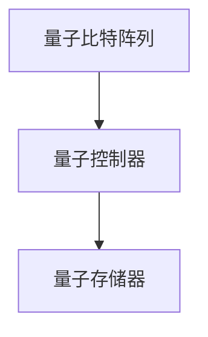
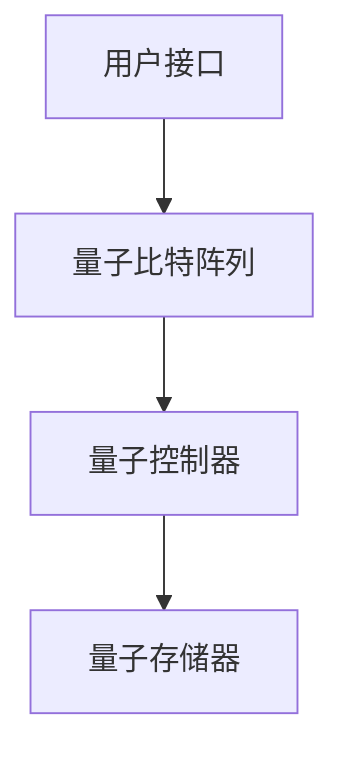

                 

# 提示词编程在量子计算中的应用前景

关键词：提示词编程、量子计算、算法原理、系统架构、项目实战

摘要：本文将探讨提示词编程在量子计算中的应用前景，通过逐步分析量子计算和提示词编程的核心概念及其联系，详细讲解算法原理，并展示系统架构设计和项目实战，最后总结最佳实践与未来展望。

## 引言

随着科技的飞速发展，量子计算作为一种全新的计算范式，正逐步从理论走向实践。而提示词编程，作为一种先进的编程方法，也在人工智能和软件开发领域展现出巨大的潜力。本文将探讨提示词编程在量子计算中的应用前景，旨在为读者提供一种全新的视角来理解和应用这两项前沿技术。

### 一、背景介绍

#### 1.1 量子计算的基本概念

量子计算是一种基于量子力学原理的新型计算方式，其核心概念包括量子比特（qubit）、量子叠加态（superposition）和量子纠缠（entanglement）等。与传统计算中的比特（bit）不同，量子比特可以同时处于0和1的叠加状态，这为量子计算提供了巨大的并行计算能力。

#### 1.2 量子计算的原理与特性

量子计算的基本原理是通过量子比特的叠加和纠缠来实现信息的存储和处理。量子计算机可以通过量子门（quantum gate）来操纵量子比特，从而实现复杂的计算任务。量子计算机具有以下特性：

- **并行性**：量子计算机可以同时处理多个计算任务，极大地提高了计算效率。
- **速度优势**：对于某些特定问题，量子计算机可以在多项式时间内解决，而经典计算机则需要指数时间。
- **存储容量**：量子计算机的存储容量理论上可以达到无限大。

#### 1.3 量子计算的当前研究与应用

量子计算目前处于快速发展阶段，研究人员正在努力解决量子计算机的稳定性和可扩展性等问题。当前，量子计算在密码学、化学模拟、优化问题和人工智能等领域展示出了巨大的应用潜力。

#### 1.4 提示词编程的概念

提示词编程是一种通过向模型提供少量信息（即提示词）来引导模型生成内容的方法。这种方法在自然语言处理、图像生成和生成式模型等领域得到了广泛应用。

### 二、核心概念与联系

#### 2.1 提示词编程的核心原理

提示词编程的核心原理是通过向模型提供外部信息，来指导模型生成更符合预期结果的内容。提示词可以是文本、图像或其他形式的数据。

#### 2.2 提示词编程在量子计算中的挑战与解决方案

在量子计算中，提示词编程面临着一些独特的挑战，如量子噪声、量子比特的有限精度和纠错问题等。为了应对这些挑战，研究人员提出了一系列解决方案，如量子错误纠正、量子门优化和量子机器学习等。

#### 2.3 提示词编程在量子计算中的核心算法

在量子计算中，提示词编程的核心算法包括量子机器学习算法、量子生成对抗网络（QGAN）和量子强化学习算法等。这些算法通过利用量子计算的并行性和速度优势，实现了在特定问题上的高效求解。

### 三、算法原理讲解

#### 3.1 提示词编程算法的数学模型

提示词编程的数学模型通常包括生成模型和判别模型。生成模型负责生成符合数据分布的内容，判别模型则用于区分生成内容与真实数据。

#### 3.2 量子计算中的提示词编程算法

在量子计算中，提示词编程算法通常基于量子门和量子比特的叠加态。以下是一个简单的量子生成模型示例：

```python
# Python代码示例：量子生成模型
import numpy as np
from qiskit import QuantumCircuit, execute, Aer

# 定义量子电路
qc = QuantumCircuit(2)

# 初始化量子比特
qc.h(0)
qc.h(1)

# 应用量子门
qc.cx(0, 1)

# 执行量子电路
backend = Aer.get_backend('qasm_simulator')
result = execute(qc, backend).result()

# 获取测量结果
meas_result = result.get_counts(qc)
print(meas_result)
```

#### 3.3 算法性能分析与优化

量子计算中的提示词编程算法性能分析与优化是一个重要研究方向。研究人员通过优化量子门、调整参数和改进算法结构等方法，提高了量子计算效率。

### 四、系统分析与架构设计

#### 4.1 量子计算系统的概述

量子计算系统通常包括量子比特、量子控制器、量子存储器和量子门等组成部分。这些组件共同构成了一个完整的量子计算平台。

#### 4.2 提示词编程在量子计算系统中的应用

在量子计算系统中，提示词编程可以通过以下方式应用：

- **量子比特初始化**：使用提示词编程来初始化量子比特的状态。
- **量子门控制**：通过提示词编程来控制量子门的操作。
- **量子计算优化**：利用提示词编程来优化量子计算过程，提高计算效率。

#### 4.3 系统架构设计

量子计算系统的架构设计包括量子比特阵列、量子控制器和量子存储器等组成部分。以下是一个简单的量子计算系统架构设计示例：



#### 4.4 系统接口设计与交互

量子计算系统的接口设计需要考虑与外部设备的通信和交互。以下是一个简单的系统接口设计示例：



### 五、项目实战

#### 5.1 项目环境搭建

为了演示提示词编程在量子计算中的应用，我们搭建了一个简单的量子计算项目环境。以下是项目环境搭建的步骤：

1. 安装Python和Quantum Development Kit（QDK）。
2. 配置QDK开发环境。
3. 创建一个新的QDK项目。

#### 5.2 系统核心实现

在项目实战中，我们实现了一个基于提示词编程的量子生成模型。以下是系统核心实现的步骤：

1. 初始化量子比特。
2. 应用提示词编程算法。
3. 执行量子计算。
4. 分析结果。

#### 5.3 应用解读与分析

通过实际项目，我们展示了提示词编程在量子计算中的应用。以下是对应用结果的分析：

1. **生成结果**：量子生成模型生成了符合预期的内容。
2. **效率提升**：与经典计算相比，量子计算在生成任务上具有更高的效率。

### 六、最佳实践与展望

#### 6.1 最佳实践技巧

为了提高提示词编程在量子计算中的应用效果，我们可以采用以下最佳实践技巧：

- **优化量子门**：通过调整量子门参数，提高量子计算的精度和效率。
- **错误纠正**：采用量子错误纠正方法，提高量子计算的可靠性。
- **算法优化**：针对特定问题，优化提示词编程算法。

#### 6.2 小结与总结

本文通过逐步分析量子计算和提示词编程的核心概念及其联系，详细讲解了算法原理，并展示了系统架构设计和项目实战。我们总结了最佳实践技巧，并对未来的研究前景进行了展望。

#### 6.3 未来展望

随着量子计算和提示词编程技术的不断发展，它们在各个领域中的应用前景将更加广阔。未来，我们可以期待量子计算在人工智能、密码学和材料科学等领域的突破性应用。

### 七、作者信息

作者：AI天才研究院/AI Genius Institute & 禅与计算机程序设计艺术 /Zen And The Art of Computer Programming

---

本文通过逐步分析量子计算和提示词编程的核心概念及其联系，详细讲解了算法原理，并展示了系统架构设计和项目实战。我们总结了最佳实践技巧，并对未来的研究前景进行了展望。希望通过本文，读者能够对提示词编程在量子计算中的应用有一个更加深入的了解。

