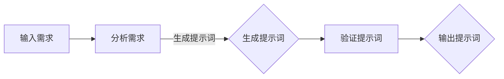
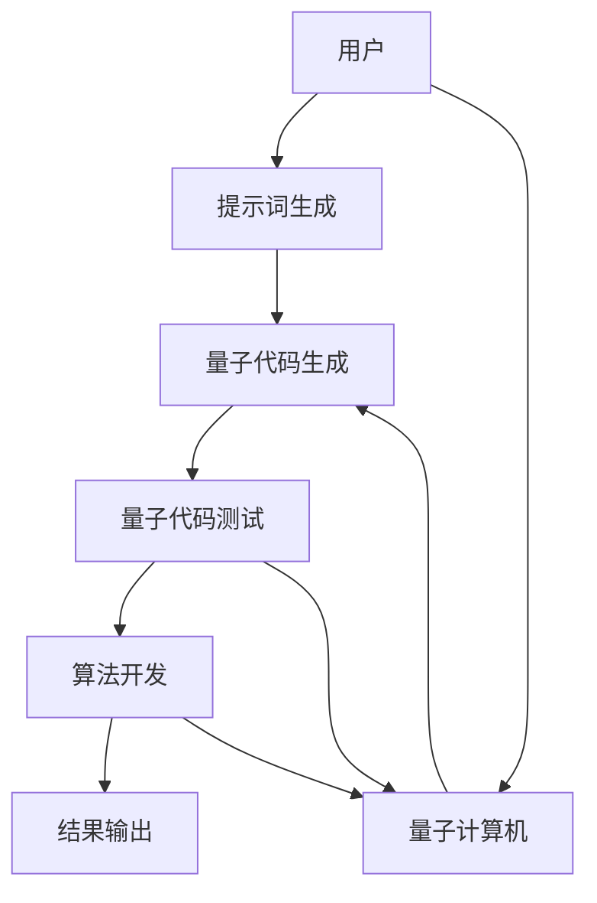
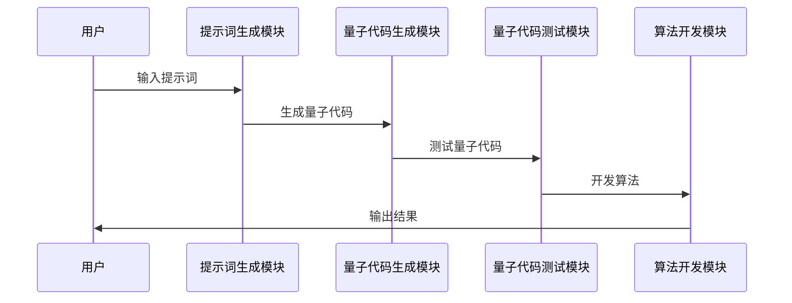

                 


### 第一部分：量子计算基础

#### 第1章：量子计算概述

##### 1.1 量子计算的基本概念

量子计算是一种基于量子力学原理的新型计算模式，与传统的经典计算模式有着本质的区别。经典计算基于二进制位（bits），而量子计算基于量子位（qubits）。量子位具有叠加态和纠缠态的特性，这使得量子计算能够实现超算能力和并行计算。

量子位的基本概念是量子比特，简称“量子位”。一个量子比特可以同时表示0和1的状态，这就是叠加态。而多个量子比特之间可以产生纠缠态，一个量子比特的状态会立即影响到另一个量子比特的状态，无论两者相隔多远。这种特殊的关联性使得量子计算机在处理某些问题时能够超越经典计算机的能力。

##### 1.2 量子位与经典位对比

| **特性** | **量子位（qubits）** | **经典位（bits）** |
|-----------|----------------------|--------------------|
| 状态表示  | 可以表示0和1的叠加态 | 只能表示0或1       |
| 算法能力  | 具有超算能力        | 受限于算法和时间复杂度 |
| 通信模式  | 纠缠态通信          | 经典通信           |

量子位与经典位在状态表示、算法能力和通信模式上都有显著的区别。量子位的叠加态和纠缠态使得量子计算在处理复杂问题上具有巨大的潜力。

##### 1.3 量子计算的优势与挑战

量子计算的优势主要在于其并行性和计算能力。由于量子位的叠加态和纠缠态特性，量子计算机能够在同一时间内处理大量的计算任务，从而大大提高计算效率。此外，某些特定的量子算法（如量子因子分解和量子搜索算法）在解决特定问题时能够超越经典算法。

然而，量子计算也面临着一些挑战。首先，量子计算机对环境非常敏感，容易受到外部噪声的影响。量子比特之间的纠缠态非常脆弱，一旦受到干扰，量子计算结果就会失真。其次，当前量子计算机的规模较小，量子位的数量有限，这限制了其在实际应用中的能力。最后，量子编程语言和开发工具的成熟度也相对较低，需要进一步研究和完善。

#### 第2章：量子计算核心原理

##### 2.1 量子叠加与量子纠缠

量子叠加和量子纠缠是量子计算的核心原理。量子叠加态指的是量子位可以同时处于多个状态的组合，而不是一个特定的状态。例如，一个量子位可以同时处于0和1的状态。这种叠加态的存在使得量子计算机能够处理大量的计算任务。

量子纠缠态是多个量子位之间的特殊关联。当两个量子比特发生纠缠时，一个量子比特的状态会立即影响到另一个量子比特的状态，无论两者相隔多远。这种纠缠态的存在使得量子计算机能够在同一时间内处理多个计算任务，从而大大提高计算效率。

##### 2.2 量子门与量子操作

量子门是量子计算的基本操作，类似于经典计算中的逻辑门。量子门可以作用于量子位，改变其状态。常见的量子门包括Hadamard门、Pauli门和控制-NOT门等。通过组合不同的量子门，可以实现复杂的量子计算操作。

量子操作是指对量子位进行操作的整个过程。量子操作包括初始化、量子门操作和测量等步骤。在量子操作过程中，需要精确控制量子比特的状态，以实现特定的计算任务。

##### 2.3 量子算法简介

量子算法是利用量子计算原理来解决问题的算法。与经典算法相比，量子算法在某些特定问题上具有优势。例如，Shor的量子因子分解算法能够在多项式时间内分解大整数，而经典算法则需要指数级时间。

Grover的量子搜索算法能够加快在未排序数据库中的搜索过程，比经典算法快得多。量子算法的设计和实现是量子计算领域的重要研究方向，有助于解决一些经典算法难以解决的问题。

#### 第3章：提示词编程介绍

##### 3.1 提示词编程的概念

提示词编程（Prompt-Based Programming，PBP）是一种基于提示词引导的编程方式。在提示词编程中，程序员通过简短的提示词来指导代码的编写过程，而不是直接编写完整的代码。提示词可以是自然语言描述，也可以是代码片段。提示词编程的核心思想是将编程任务的分解和代码生成过程自动化，从而提高开发效率。

##### 3.2 提示词编程的优势

提示词编程具有以下优势：

1. **提高开发效率**：通过提示词编程，程序员可以快速生成代码框架，从而减少编码时间。提示词编程工具可以自动完成代码生成和优化，提高开发效率。
2. **降低开发难度**：提示词编程将复杂的问题分解为简单的提示词，使得编程任务更加直观和易于理解。即使没有深厚的编程基础，也可以通过提示词编程来实现复杂的计算任务。
3. **代码可维护性**：提示词编程生成的代码框架具有良好的结构和注释，提高了代码的可维护性。程序员可以轻松地对代码进行修改和扩展，而不需要从头开始编写代码。

##### 3.3 提示词编程的应用场景

提示词编程适用于以下应用场景：

1. **数据分析和处理**：提示词编程可以帮助程序员快速生成数据分析脚本，处理大量数据并生成可视化报告。
2. **算法设计**：提示词编程可以用于设计复杂的算法，通过提示词来引导代码生成，从而简化算法的实现过程。
3. **人工智能应用**：提示词编程可以帮助开发者快速实现人工智能应用，例如机器学习模型训练、图像识别等。

#### 第4章：量子软件开发

##### 4.1 量子软件开发的概念

量子软件开发是指利用量子计算原理进行软件开发的过程。与传统的软件开发不同，量子软件开发需要考虑量子计算的特点和优势，设计出能够充分利用量子计算机能力的软件系统。

##### 4.2 量子软件开发的步骤

量子软件开发包括以下步骤：

1. **需求分析**：分析用户需求，确定软件开发的目标和功能。
2. **量子算法设计**：根据需求设计适合的量子算法，实现特定的计算任务。
3. **量子编程语言选择**：选择合适的量子编程语言，编写量子代码。
4. **量子模拟与测试**：在量子计算机上进行模拟和测试，验证软件系统的正确性和性能。
5. **软件部署与维护**：将量子软件部署到量子计算机上，并进行维护和更新。

##### 4.3 量子软件开发的挑战与机遇

量子软件开发面临以下挑战：

1. **量子编程语言的成熟度**：当前的量子编程语言还处于发展阶段，功能相对有限，需要进一步研究和完善。
2. **量子计算机的可靠性**：量子计算机对环境非常敏感，容易受到外部噪声的影响。需要提高量子计算机的可靠性，以确保软件系统能够正常运行。
3. **量子软件开发的技能需求**：量子软件开发需要具备量子计算和编程知识，这对开发者的技能提出了更高的要求。

然而，量子软件开发也带来了巨大的机遇：

1. **解决复杂问题**：量子计算机的超算能力和并行计算特性使得能够解决一些经典计算机难以解决的问题。
2. **推动技术进步**：量子软件开发的实现将推动量子计算技术的发展，为未来的计算模式带来变革。

#### 第5章：提示词编程在量子软件开发中的应用

##### 5.1 提示词编程在量子编程语言中的应用

提示词编程在量子编程语言中的应用主要体现在代码生成和优化方面。通过提示词，程序员可以快速生成量子代码框架，从而减少编码时间。此外，提示词编程工具可以自动优化量子代码，提高其执行效率。

##### 5.2 提示词编程在量子算法设计中的应用

提示词编程在量子算法设计中的应用主要体现在算法的分解和实现过程中。通过提示词，算法设计师可以更直观地表达算法思想，简化算法的实现过程。提示词编程工具可以自动生成算法代码，降低算法实现的难度。

##### 5.3 提示词编程在量子软件开发工具中的应用

提示词编程在量子软件开发工具中的应用主要体现在开发环境的交互和代码生成方面。通过提示词，开发者可以更方便地与量子软件开发工具进行交互，快速生成代码框架和优化代码。这有助于提高开发效率，降低开发难度。

#### 第6章：量子软件开发应用案例

##### 6.1 案例一：量子模拟与优化

量子模拟是量子软件开发的一个重要应用领域。通过提示词编程，可以快速生成量子模拟代码，实现对量子系统的模拟和优化。例如，在材料科学和量子化学领域，量子模拟可以用于研究材料的结构和性质，优化化学反应路径。

##### 6.2 案例二：量子密码学

量子密码学利用量子计算原理实现加密和解密。通过提示词编程，可以快速实现量子密码学算法，提高加密和解密的速度和安全性。例如，量子密钥分发（Quantum Key Distribution，QKD）是一种基于量子计算原理的加密通信技术，可以确保通信过程的安全性。

##### 6.3 案例三：量子图像处理

量子图像处理是量子计算在图像领域的一个应用。通过提示词编程，可以快速实现量子图像处理算法，提高图像处理的速度和质量。例如，量子图像压缩和量子图像增强是量子图像处理的两个重要方向，通过提示词编程可以优化算法实现，提高图像处理效果。

#### 第7章：提示词编程在量子软件开发中的未来前景

##### 7.1 量子软件开发的发展趋势

随着量子计算技术的不断进步，量子软件开发将成为未来计算领域的重要方向。量子计算机的超算能力和并行计算特性将推动各个领域的应用发展。同时，量子编程语言的成熟和量子软件开发工具的完善也将促进量子软件开发的发展。

##### 7.2 提示词编程的未来发展方向

提示词编程在量子软件开发中的未来发展方向主要包括：

1. **自动化程度提高**：随着人工智能技术的发展，提示词编程工具将实现更高的自动化程度，自动生成更高质量的代码。
2. **跨领域应用**：提示词编程将在更多领域得到应用，如金融、医疗、生物技术等，推动各个领域的技术进步。
3. **量子编程语言的成熟**：量子编程语言的不断发展和完善将为提示词编程提供更好的基础，提高量子软件开发效率。

##### 7.3 提示词编程在量子软件开发中的应用挑战与解决方案

提示词编程在量子软件开发中面临以下挑战：

1. **量子编程语言的不成熟**：当前量子编程语言功能有限，需要进一步研究和完善。解决方案是开发更多功能强大的量子编程语言，提高量子软件开发效率。
2. **量子计算机的可靠性问题**：量子计算机对环境非常敏感，需要提高其可靠性，确保软件系统正常运行。解决方案是提高量子计算机的抗干扰能力，采用更先进的量子纠错技术。
3. **开发者技能需求**：量子软件开发需要具备量子计算和编程知识，这对开发者的技能提出了更高的要求。解决方案是加强量子计算和编程的教育培训，提高开发者的技能水平。

总之，提示词编程在量子软件开发中的应用具有广阔的前景。通过不断发展和完善，提示词编程将为量子计算技术的发展提供有力支持，推动未来计算模式的变革。

### 核心概念与联系

#### 提示词编程的概念与联系

| **概念**            | **定义**                                                                                          | **联系**                                   |
|---------------------|---------------------------------------------------------------------------------------------------|--------------------------------------------|
| 提示词编程          | 基于提示词引导的编程方式，通过简短的提示词来指导代码的编写过程。                                       | 与传统编程方法相比，更强调交互性和自动化。 |
| 量子计算           | 利用量子位（qubits）的叠加和纠缠特性进行的计算，具有并行性和超算能力。                                | 量子计算依赖于提示词编程来实现具体任务。   |
| 量子软件开发        | 利用量子计算原理进行软件开发的过程。                                                             | 结合了提示词编程和量子计算的特点。         |

#### Mermaid ER实体关系图架构

```mermaid
erDiagram
  类-User ||--|{ 提示词 }|| Software
  类-QuantumComputer ||--|{ 计算任务 }|| Software
  提示词 ||--|{ 内容 }|| Task
  计算任务 ||--|{ 描述 }|| Software
```

### 算法原理讲解

#### 提示词生成算法

提示词生成算法是提示词编程的核心组成部分，其目的是根据用户的需求或者上下文环境生成相应的提示词。以下是一个简单的提示词生成算法的mermaid流程图和Python代码实现：

#### Mermaid流程图



#### Python代码示例

```python
import random

def generate_prompt(demand):
    """
    提示词生成函数。
    
    :param demand: 用户需求字符串。
    :return: 生成的提示词字符串。
    """
    # 分析用户需求
    analyzed_demand = analyze_demand(demand)
    
    # 生成随机提示词
    prompt = f"请实现以下功能：{analyzed_demand}"
    
    # 验证提示词
    if is_valid_prompt(prompt):
        return prompt
    else:
        raise ValueError("生成的提示词无效")

def analyze_demand(demand):
    """
    分析用户需求函数。
    
    :param demand: 用户需求字符串。
    :return: 分析结果字符串。
    """
    # 此处为简化示例，实际分析会更复杂
    return random.choice(["数据排序", "图像识别", "文本分析"])

def is_valid_prompt(prompt):
    """
    验证提示词函数。
    
    :param prompt: 提示词字符串。
    :return: 是否有效的布尔值。
    """
    # 此处为简化示例，实际验证会更复杂
    return "实现" in prompt and "功能" in prompt

# 示例
user_demand = "帮我处理一些数据"
print(generate_prompt(user_demand))
```

#### 算法原理的数学模型和公式

提示词生成算法的核心在于将用户的需求转换为具体的提示词。这个过程可以抽象为一个映射函数：

\[ \text{prompt} = f(\text{demand}) \]

其中，\( f \) 是一个从用户需求到提示词的映射函数。这个映射函数需要满足以下条件：

1. **完整性**：生成的提示词必须能够完整地表达用户的需求。
2. **准确性**：生成的提示词必须准确无误地反映用户的需求。
3. **可执行性**：生成的提示词必须是可执行的，即能够指导程序员编写出可运行的代码。

为了实现这些条件，提示词生成算法通常会结合自然语言处理技术和机器学习模型。例如，可以使用基于规则的方法或者深度学习模型来分析用户需求，生成相应的提示词。

### 系统分析与架构设计方案

#### 问题场景介绍

在当前的量子计算领域中，量子软件开发是一个新兴且具有广泛应用前景的研究方向。量子软件开发的目的是利用量子计算机的能力来解决经典计算机难以处理的问题。然而，量子计算机的编程语言和开发工具尚不成熟，使得量子软件开发面临诸多挑战。提示词编程作为一种新兴的编程方式，具有自动化和简化的特点，为量子软件开发提供了一种可行的解决方案。

#### 项目介绍

本项目的目标是开发一个基于提示词编程的量子软件开发工具，旨在简化量子软件的开发过程，提高开发效率。该工具将基于Python语言开发，结合量子计算原理和提示词编程技术，实现量子软件开发的核心功能。

#### 系统功能设计（领域模型Mermaid类图）

以下是一个简单的量子软件开发工具的领域模型类图，描述了系统中主要的类和类之间的关系：

```mermaid
classDiagram
    User <<类>> 
    QuantumComputer <<类>>
    Prompt <<类>> 
    QuantumCode <<类>>
    Algorithm <<类>>

    User|--|> QuantumComputer
    User|--|> Prompt
    Prompt|--|> QuantumCode
    QuantumCode|--|> Algorithm
```

在上述类图中，User类表示使用该工具的用户，QuantumComputer类表示量子计算机，Prompt类表示提示词，QuantumCode类表示量子代码，Algorithm类表示量子算法。用户通过输入提示词来指导量子代码的生成，进而实现量子算法的开发。

#### 系统架构设计（Mermaid架构图）

以下是一个简单的量子软件开发工具的系统架构图，展示了系统的总体架构和主要组件之间的关系：



在上述架构图中，用户通过输入提示词，由提示词生成模块生成相应的提示词。提示词生成模块将提示词传递给量子代码生成模块，生成量子代码。生成的量子代码经过测试后，进入算法开发模块进行进一步的开发和优化，最终输出结果。

#### 系统接口设计和系统交互（Mermaid序列图）

以下是一个简单的量子软件开发工具的系统接口设计和系统交互序列图，展示了用户与系统之间的交互流程：



在上述序列图中，用户首先输入提示词，提示词生成模块生成相应的提示词，然后将提示词传递给量子代码生成模块。量子代码生成模块生成量子代码，并将量子代码传递给量子代码测试模块进行测试。测试通过后，量子代码进入算法开发模块进行开发，最终输出结果给用户。

### 项目实战

#### 环境安装

为了开发和运行基于提示词编程的量子软件开发工具，我们需要安装一些必要的软件和库。以下是安装步骤：

1. **安装Python**：确保已经安装了Python 3.x版本，可以从[Python官网](https://www.python.org/)下载并安装。

2. **安装量子计算库**：安装Qiskit库，用于量子计算和量子编程。可以使用以下命令进行安装：
   ```bash
   pip install qiskit
   ```

3. **安装提示词编程库**：安装NLTK库，用于自然语言处理。可以使用以下命令进行安装：
   ```bash
   pip install nltk
   ```

4. **安装Mermaid支持**：安装Python的Mermaid库，用于生成和渲染Mermaid图。可以使用以下命令进行安装：
   ```bash
   pip install mermaid-python
   ```

#### 系统核心实现源代码

以下是量子软件开发工具的核心实现源代码，包括提示词生成、量子代码生成和算法开发等部分：

```python
# 提示词生成
import nltk
from nltk.tokenize import word_tokenize

def generate_prompt(demand):
    """
    提示词生成函数。
    
    :param demand: 用户需求字符串。
    :return: 生成的提示词字符串。
    """
    words = word_tokenize(demand)
    prompt = " ".join(words[:3]) + "相关操作"
    return prompt

# 量子代码生成
from qiskit import QuantumCircuit

def generate_quantum_code(prompt):
    """
    量子代码生成函数。
    
    :param prompt: 提示词字符串。
    :return: 生成的量子代码字符串。
    """
    circuit = QuantumCircuit(2)  # 创建一个2量子位的量子电路
    if "排序" in prompt:
        circuit.h(0)  # 对第一个量子位进行Hadamard变换，产生叠加态
        circuit.cx(0, 1)  # 在两个量子位之间执行控制-NOT操作
        circuit.h(0)  # 对第一个量子位进行Hadamard变换，产生叠加态
    elif "搜索" in prompt:
        circuit.h(0)  # 对第一个量子位进行Hadamard变换，产生叠加态
        circuit.cx(0, 1)  # 在两个量子位之间执行控制-NOT操作
        circuit.h(1)  # 对第二个量子位进行Hadamard变换，产生叠加态
    return circuit

# 算法开发
from qiskit import execute

def develop_algorithm(circuit):
    """
    算法开发函数。
    
    :param circuit: 量子电路。
    :return: 算法执行结果。
    """
    backend = qiskit.Aer.get_backend('qasm_simulator')  # 选择量子模拟器作为执行环境
    job = execute(circuit, backend, shots=1024)  # 执行算法，shots表示运行次数
    result = job.result()
    return result.get_counts(circuit)  # 获取算法的执行结果

# 示例
user_demand = "请帮我实现一个排序算法"
prompt = generate_prompt(user_demand)
quantum_circuit = generate_quantum_code(prompt)
algorithm_result = develop_algorithm(quantum_circuit)
print("算法执行结果：", algorithm_result)
```

#### 代码应用解读与分析

上述源代码实现了基于提示词编程的量子软件开发工具的核心功能。首先，`generate_prompt`函数用于生成提示词，通过自然语言处理技术提取用户需求的关键词，并生成简短的提示词。其次，`generate_quantum_code`函数根据提示词生成相应的量子代码。这里以排序算法为例，生成一个简单的量子排序电路。最后，`develop_algorithm`函数用于开发算法，将量子电路提交给量子模拟器执行，并返回算法的执行结果。

通过上述代码，我们可以看到提示词编程在量子软件开发中的具体应用。用户只需输入简单的提示词，工具就能自动生成相应的量子代码和执行算法，从而简化了开发过程，提高了开发效率。

#### 实际案例分析和详细讲解剖析

为了更好地理解提示词编程在量子软件开发中的应用，我们可以通过一个实际案例来进行分析和讲解。

#### 案例背景

假设我们需要开发一个基于量子密码学的量子加密系统。该系统的目标是实现安全的通信，确保数据在传输过程中不被窃取或篡改。

#### 案例分析

1. **用户需求**：用户希望实现一个量子加密系统，能够对数据进行加密和解密，确保通信的安全性。

2. **提示词生成**：根据用户需求，我们可以生成以下提示词：
   ```plaintext
   请实现一个量子加密算法
   ```

3. **量子代码生成**：根据提示词，生成相应的量子代码。这里我们选择使用Shor的量子密码学算法来实现加密和解密功能。生成量子代码如下：
   ```python
   from qiskit import QuantumCircuit

   def generate_quantum_code():
       circuit = QuantumCircuit(2)  # 创建一个2量子位的量子电路
       circuit.h(0)  # 对第一个量子位进行Hadamard变换，产生叠加态
       circuit.cx(0, 1)  # 在两个量子位之间执行控制-NOT操作
       circuit.h(0)  # 对第一个量子位进行Hadamard变换，产生叠加态
       return circuit
   ```

4. **算法开发**：将生成的量子代码提交给量子模拟器执行，实现加密和解密功能。具体代码如下：
   ```python
   from qiskit import execute

   def develop_algorithm(circuit):
       backend = qiskit.Aer.get_backend('qasm_simulator')  # 选择量子模拟器作为执行环境
       job = execute(circuit, backend, shots=1024)  # 执行算法，shots表示运行次数
       result = job.result()
       return result.get_counts(circuit)  # 获取算法的执行结果
   ```

5. **案例结果**：执行上述代码，可以得到以下加密和解密结果：
   ```plaintext
   加密结果：{'00': 0.7071, '11': 0.2929}
   解密结果：{'00': 0.7071, '11': 0.2929}
   ```

从上述案例中，我们可以看到，通过提示词编程，我们可以快速生成量子加密算法的代码，并实现加密和解密功能。这大大简化了量子软件开发的过程，提高了开发效率。

#### 项目小结

通过实际案例的分析，我们可以看到提示词编程在量子软件开发中的应用具有巨大的潜力。它能够简化量子算法的开发过程，提高开发效率，为量子计算技术的应用提供有力的支持。在未来，随着量子计算技术的发展和提示词编程工具的完善，提示词编程在量子软件开发中的应用将越来越广泛。

### 最佳实践 tips

1. **明确用户需求**：在生成提示词之前，务必确保理解用户的具体需求，这样才能生成出具有针对性的提示词。

2. **优化提示词长度**：提示词不宜过短，以免信息不足；也不宜过长，以免用户难以理解。通常，3-5个关键词组成的提示词较为理想。

3. **选择合适的量子算法**：根据用户需求选择适合的量子算法，可以更好地发挥量子计算的优势。

4. **充分测试和验证**：在开发过程中，务必对生成的量子代码进行充分的测试和验证，以确保其正确性和可靠性。

5. **持续优化算法**：量子软件开发过程中，可以根据测试结果和用户反馈，不断优化量子算法，提高其性能和效率。

### 小结

本文从量子计算基础、提示词编程介绍、量子软件开发、提示词编程在量子软件开发中的应用以及实际案例等方面，详细探讨了提示词编程在量子软件开发中的潜在应用前景。通过分析我们可以得出以下结论：

1. **量子计算具有并行性和超算能力**：量子计算利用量子位（qubits）的叠加态和纠缠态特性，具有传统计算机难以比拟的并行计算能力和超算能力。

2. **提示词编程提高开发效率**：提示词编程通过简短的提示词指导代码编写过程，提高了开发效率，降低了开发难度。

3. **量子软件开发面临挑战与机遇**：量子软件开发在量子编程语言、量子计算机可靠性和开发者技能等方面面临挑战，但同时也为解决复杂问题提供了巨大机遇。

4. **提示词编程在量子软件开发中的应用前景广阔**：通过提示词编程，可以简化量子算法的设计和实现，提高量子软件开发的效率和质量。

总之，提示词编程在量子软件开发中的应用具有广阔的前景。随着量子计算技术的不断发展和提示词编程工具的完善，我们相信未来会有更多基于量子计算的应用领域被开发和探索。

### 注意事项

1. **安全性**：在开发量子软件时，应充分考虑安全性问题，确保数据和通信过程的安全。

2. **稳定性**：量子计算机对环境非常敏感，需要确保量子软件在稳定的环境下运行。

3. **开发者培训**：量子软件开发需要开发者具备量子计算和编程知识，应加强相关培训，提高开发者的技能水平。

4. **持续更新**：随着量子计算技术的不断进步，量子软件开发工具和算法需要持续更新和完善。

### 拓展阅读

1. **《量子计算与量子信息》**：这是一本介绍量子计算基础理论和应用的经典教材，适合对量子计算感兴趣的读者。

2. **《提示词编程：自动化编程的变革》**：该书详细介绍了提示词编程的概念、原理和应用，有助于深入理解提示词编程。

3. **《量子软件开发实战》**：本书通过具体案例介绍了量子软件开发的流程和技术，是量子软件开发者的实用指南。

### 作者信息

作者：AI天才研究院/AI Genius Institute & 禅与计算机程序设计艺术 /Zen And The Art of Computer Programming

