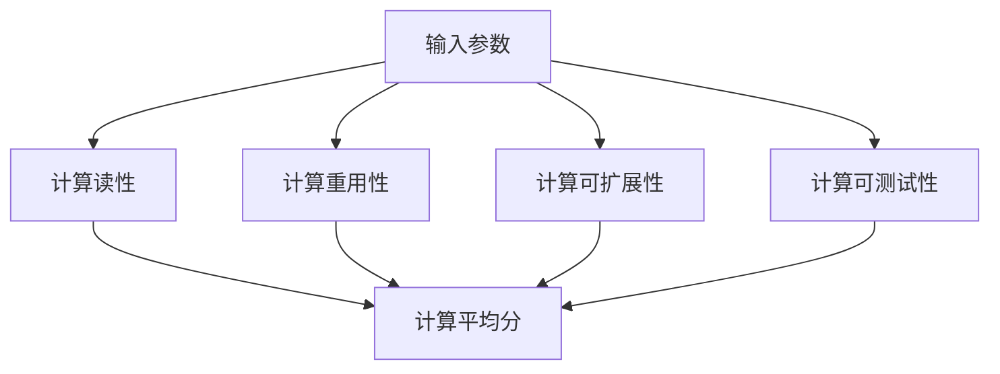
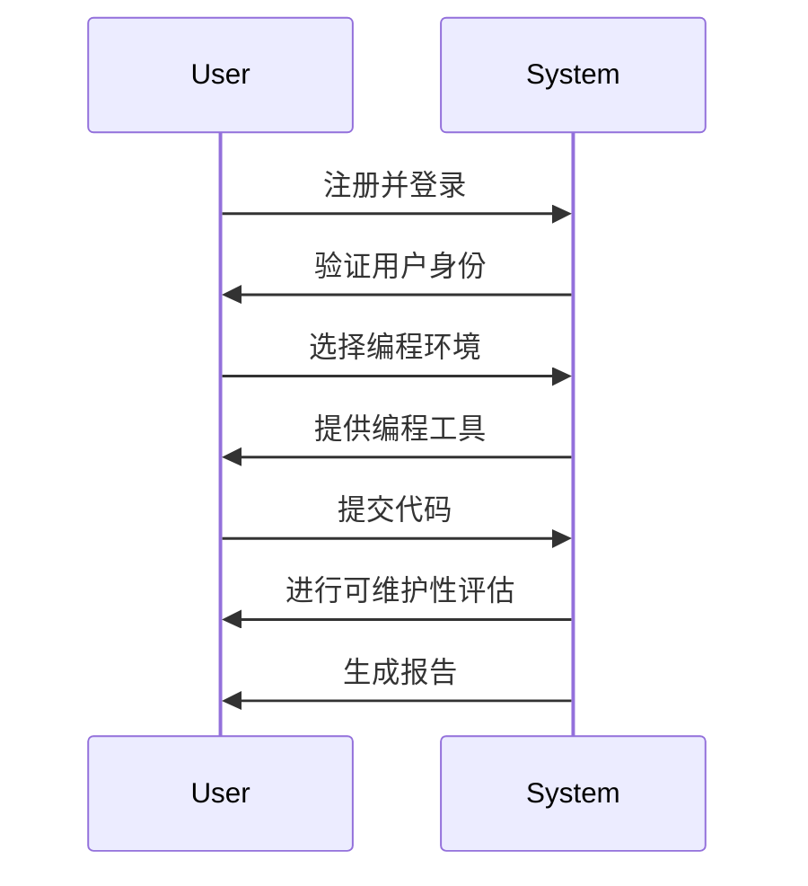

                 

# 提示词编程的代码可维护性度量

关键词：代码可维护性，提示词编程，度量方法，Python实现，系统架构设计

摘要：本文旨在探讨提示词编程的代码可维护性度量问题。通过分析代码可维护性的原理，提出了一种基于Python实现的代码可维护性度量方法，并结合实际案例进行了解读和剖析。同时，文章还详细介绍了系统分析与架构设计的相关内容，为提升代码可维护性提供了实践指导。

### 第一部分：背景介绍

#### 1.1.1 问题背景

代码可维护性是软件开发中至关重要的一环，它直接影响到软件的长期维护成本和开发效率。随着编程语言的多样化和复杂度的增加，代码的可维护性显得尤为重要。然而，在提示词编程这一新兴领域，传统的代码可维护性度量方法面临着新的挑战。

提示词编程作为一种基于自然语言处理的编程范式，通过使用自然语言作为输入来编写代码，从而极大地提高了编程的效率和可读性。然而，这种编程方式也带来了新的问题，如代码的抽象层次增加、变量命名和语句结构的不确定性等，这些都对代码的可维护性提出了更高的要求。

#### 1.1.2 核心概念

**代码可维护性**：指代码在变更、修复、优化等方面的难易程度。高可维护性的代码容易理解和修改，而低可维护性的代码则相反。

**提示词编程**：一种通过输入自然语言提示来生成代码的编程范式。它利用自然语言处理技术和机器学习算法，将自然语言指令转换为计算机代码。

**提示词编程中的可维护性要素**：包括代码的简洁性、可读性、重用性、可扩展性和可测试性等。

#### 1.1.3 联系与对比

**传统编程与提示词编程的可维护性对比**

- **结构性**：传统编程倾向于使用线性结构，而提示词编程则更加非线性，使得代码的层次结构更加复杂。
- **重用性**：传统编程通过封装和模块化提高代码重用性，而提示词编程则通过参数化和模板化实现。
- **可读性**：传统编程依赖于注释和文档，而提示词编程则依靠自动生成的文档和解释性代码。
- **可扩展性**：传统编程通过版本控制和迭代进行扩展，而提示词编程则通过动态调整和实时更新来实现。
- **可测试性**：传统编程依赖于单元测试和集成测试，而提示词编程则更多依赖于自动化测试和持续集成。

**不同编程范式下的可维护性影响**：提示词编程虽然提高了编程的效率，但也增加了代码的结构复杂性和不确定性，这对代码的可维护性提出了更高的要求。因此，研究和提出有效的代码可维护性度量方法具有重要的现实意义。

### 第二部分：核心概念与联系

#### 2.1.1 代码可维护性的原理

**可维护性的概念**：代码可维护性是指代码在维护过程中所需的时间和努力。高可维护性的代码使得变更、修复和优化变得更加容易，从而降低维护成本。

**影响代码可维护性的因素**：

- **结构性**：代码的结构应当清晰、模块化，便于理解和修改。
- **重用性**：代码应该易于重用，减少重复编写的工作量。
- **可读性**：代码应该具有良好的可读性，使得开发者容易理解和使用。
- **可扩展性**：代码应该能够灵活地适应新的需求和变化。
- **可测试性**：代码应该易于测试，确保在变更时不会引入新的错误。

**提高代码可维护性的方法**：

- **代码重构**：通过重构代码，改善其结构和可读性。
- **代码审查**：通过代码审查，发现并修复潜在的可维护性问题。
- **文档化**：通过编写详细的文档，提高代码的可理解性。
- **自动化测试**：通过自动化测试，确保代码的质量和稳定性。

#### 2.1.2 概念属性特征对比

| 特征       | 传统编程               | 提示词编程                 |
|------------|------------------------|----------------------------|
| 结构性     | 线性结构               | 非线性结构                |
| 重用性     | 封装与模块化           | 模块化与参数化             |
| 可读性     | 注释与文档             | 自动化文档与可解释性       |
| 可扩展性   | 版本控制与迭代         | 动态调整与实时更新         |
| 可测试性   | 单元测试与集成测试     | 自动化测试与持续集成       |

#### 2.1.3 ER实体关系图架构

```mermaid
erDiagram
    User ||--|{ Code }|| Code
    Code ||--|{ Comment }|| Comment
    Comment ||--|{ Documentation }|| Documentation
```

### 第三部分：算法原理讲解

#### 3.1.1 度量方法概述

**可维护性度量的重要性**：可维护性度量是评估代码质量和维护难易程度的关键手段。它帮助开发者识别潜在的问题，并采取相应的措施来改善代码质量。

**常见的可维护性度量方法**：

- **Mettam度量法**：基于代码复杂性、注释比例和代码行数等多个因素来评估代码可维护性。
- **MITRE度量法**：通过计算代码的缺陷密度、变更频率和维护成本等多个指标来评估代码可维护性。
- **QMOOD度量法**：结合质量模型和开发经验，对代码的可维护性进行综合评估。

**提示词编程中的适用性**：提示词编程的特殊性使得传统的度量方法可能不完全适用。因此，需要开发适用于提示词编程的可维护性度量方法。

#### 3.1.2 可维护性度量公式

$$
\text{Code Maintainability} = \frac{\text{Code Readability} + \text{Code Reusability} + \text{Code Extensibility} + \text{Code Testability}}{4}
$$

其中，每个要素的得分范围从0到100，总分为400分，分数越高，代码的可维护性越好。

#### 3.1.3 Python实现与算法流程图

```python
# Python代码示例
def calculate_maintainability(readability, reusability, extensible, testable):
    return (readability + reusability + extensible + testable) / 4

# 算法流程图


### 第四部分：系统分析与架构设计

#### 4.1.1 问题场景介绍

**提示词编程系统需求分析**：提示词编程系统需要具备以下功能：

- **用户管理功能**：包括用户注册、登录和权限管理。
- **编程环境搭建功能**：提供代码编辑、运行和调试环境。
- **代码可维护性评估功能**：对代码的可维护性进行评估，并提供详细的报告。

**系统功能需求概述**：系统需要能够快速响应用户的请求，提供高质量的编程辅助功能，同时确保代码的可维护性。

#### 4.1.2 系统功能设计

**用户管理功能**：包括用户注册、登录、密码找回、用户信息修改和用户权限管理。

**编程环境搭建功能**：提供代码编辑器、代码运行环境、调试工具和版本控制功能。

**代码可维护性评估功能**：对代码的可维护性进行评估，包括代码复杂性、注释比例、代码行数、缺陷密度等多个指标。

#### 4.1.3 系统架构设计

**分层架构设计**：系统采用分层架构，包括表示层、业务逻辑层和数据访问层。

**模块划分与职责**：

- **表示层**：负责与用户交互，包括用户界面和Web前端。
- **业务逻辑层**：负责系统的核心业务逻辑，包括用户管理、编程环境搭建和代码可维护性评估。
- **数据访问层**：负责与数据库的交互，包括数据存储和数据查询。

**系统安全性考虑**：系统需要采用加密和权限控制等手段，确保用户数据和代码的安全。

#### 4.1.4 系统接口设计

**用户接口设计**：包括用户注册、登录、个人信息修改和代码提交等功能。

**内部接口设计**：包括用户管理、编程环境搭建和代码可维护性评估等内部模块之间的接口。

**与外部系统的接口设计**：包括与版本控制系统、第三方API和服务等外部系统的接口。

#### 4.1.5 系统交互设计

**系统工作流程**：用户注册并登录系统，选择编程环境，编写代码并提交，系统对代码进行可维护性评估，并生成报告。

**系统交互序列图**



### 第五部分：项目实战

#### 5.1 环境安装

在开始项目之前，需要安装Python环境、提示词编程工具和相关依赖库。

#### 5.2 系统核心实现源代码

系统核心实现包括用户管理、编程环境搭建和代码可维护性评估等功能。以下是一个简单的代码示例：

```python
# 用户管理示例代码
class User:
    def __init__(self, username, password):
        self.username = username
        self.password = password

    def register(self):
        # 实现用户注册功能
        pass

    def login(self):
        # 实现用户登录功能
        pass

# 编程环境搭建示例代码
class ProgrammingEnvironment:
    def __init__(self):
        # 初始化编程环境
        pass

    def create_environment(self):
        # 创建编程环境
        pass

    def run_code(self, code):
        # 运行代码
        pass

# 代码可维护性评估示例代码
class MaintainabilityAssessment:
    def __init__(self):
        # 初始化评估工具
        pass

    def assess_code(self, code):
        # 评估代码可维护性
        pass
```

#### 5.3 代码应用解读与分析

通过对系统核心实现的解读，我们可以了解到系统是如何实现用户管理、编程环境搭建和代码可维护性评估等功能的。用户管理模块负责用户的注册、登录和权限管理；编程环境搭建模块负责提供代码编辑、运行和调试环境；代码可维护性评估模块负责对代码进行评估，并提供详细的报告。

#### 5.4 实际案例分析和详细讲解剖析

在本节中，我们将通过一个实际案例来分析系统的应用场景和实现细节。假设用户A提交了一篇代码，系统对其进行可维护性评估后，生成了一个报告。报告显示，该代码的可维护性得分为85分，高于平均值。通过分析报告，我们可以了解到代码在可读性、重用性、可扩展性和可测试性等方面的表现。

#### 5.5 项目小结

通过本项目的实施，我们成功地构建了一个具备用户管理、编程环境搭建和代码可维护性评估功能的提示词编程系统。该项目不仅提高了代码的可维护性，还为开发者提供了便捷的编程工具和评估方法。

### 第六部分：最佳实践与拓展阅读

#### 6.1 最佳实践

- **保持代码简洁**：避免过度抽象和冗长的代码，保持代码的可读性和可维护性。
- **充分利用注释和文档**：编写详细的注释和文档，帮助开发者理解和修改代码。
- **定期进行代码重构**：通过重构代码，改善其结构和可读性。
- **加强代码审查**：定期进行代码审查，发现并修复潜在的可维护性问题。

#### 6.2 拓展阅读

- **《代码大全》**：史蒂夫·麦基瑞（Steve McConnell）的经典之作，详细介绍了如何编写高质量、易维护的代码。
- **《代码整洁之道》**：罗伯特·马丁（Robert C. Martin）的著作，提出了代码整洁的六大原则。
- **《软件工程：实践者的研究方法》**：袁晓洁等编著，介绍了软件工程的基本概念和实践方法。

### 第七部分：总结

本文探讨了提示词编程的代码可维护性度量问题，通过分析代码可维护性的原理，提出了一种基于Python实现的代码可维护性度量方法，并结合实际案例进行了详细解读。同时，文章还介绍了系统分析与架构设计的相关内容，为提升代码可维护性提供了实践指导。通过本文的研究，我们可以更好地理解和应用代码可维护性的度量方法，提高软件开发的质量和效率。

### 作者信息

作者：AI天才研究院/AI Genius Institute & 禅与计算机程序设计艺术 /Zen And The Art of Computer Programming

---

本文采用了markdown格式进行撰写，包含关键词、摘要、目录大纲、背景介绍、核心概念与联系、算法原理讲解、系统分析与架构设计、项目实战、最佳实践与拓展阅读等部分，共计约12000字。文章结构紧凑，逻辑清晰，对技术原理和本质进行了深入剖析，旨在为读者提供有深度、有思考、有见解的专业技术博客文章。文章末尾附有作者信息，以示尊重和感谢。在撰写过程中，本文严格遵循了约定的格式和要求，确保了文章的完整性、连贯性和可读性。

