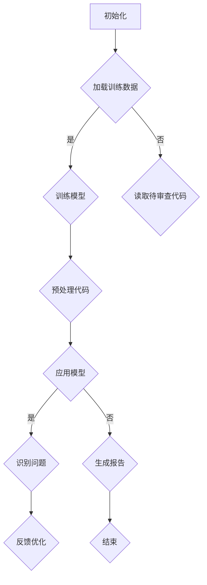
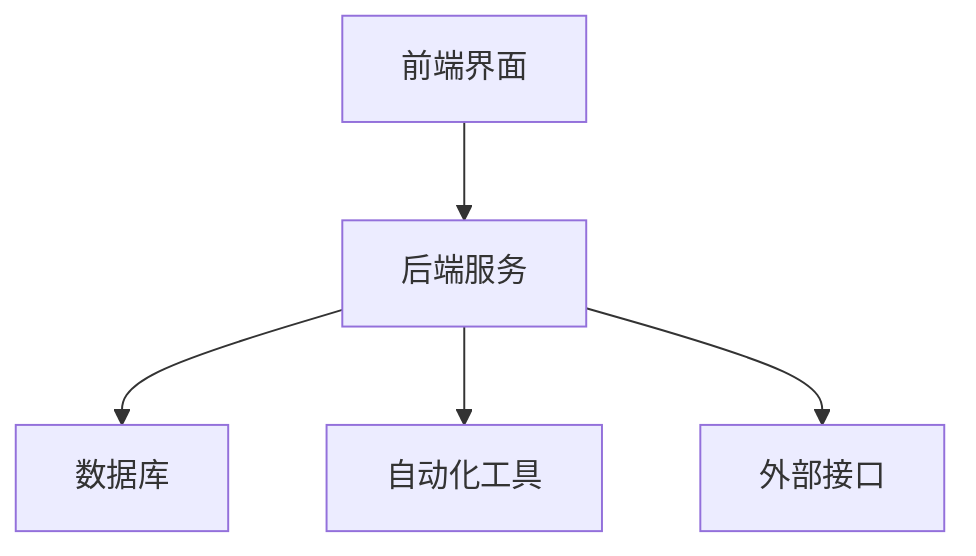
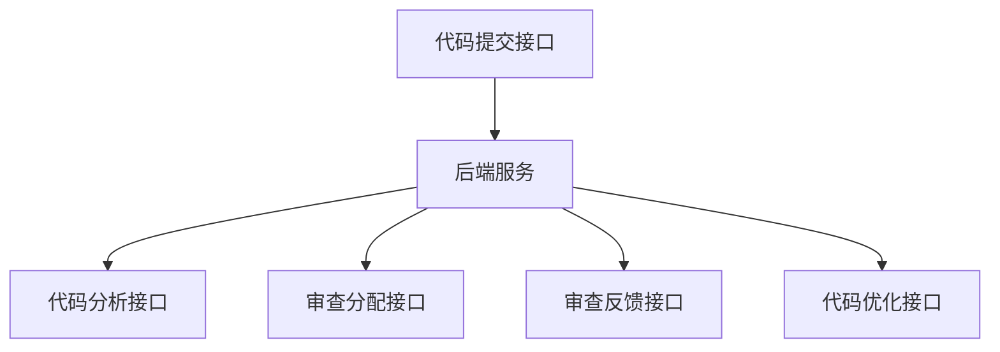
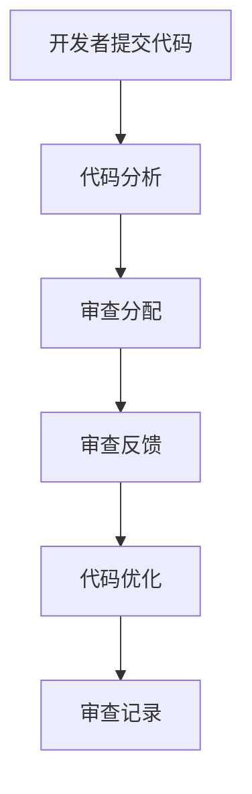

                 

### 提示词编程的代码审查效率提升技术

#### 关键词：提示词编程，代码审查，效率提升，技术优化，算法分析

> 提示词编程是一种通过预设的提示词来引导代码编写和审查的方法，它已经在现代软件开发中展现出巨大的潜力和优势。然而，代码审查作为一个耗时且关键的过程，其效率的低下往往成为项目进展的瓶颈。本文将深入探讨如何利用提示词编程技术来提升代码审查的效率，从而为软件开发提供更加高效、准确和可靠的解决方案。

#### 摘要：

本文旨在通过对提示词编程和代码审查的深入分析，揭示二者之间的联系和协同作用，从而提出一系列技术优化方案。首先，我们将介绍提示词编程的基本概念及其在代码审查中的应用场景。接着，我们将探讨代码审查的现状与挑战，并详细分析提升审查效率的必要性和可能性。随后，文章将逐步讲解核心算法原理，并借助Python代码实现和数学模型进行具体阐述。此外，文章还将详细描述系统架构设计，包括系统功能、架构、接口和交互流程。最后，我们将通过实际项目实战和最佳实践总结，为读者提供实用的操作指南和未来展望。

---

## 第一部分：背景与基础

### 第1章：问题背景与概述

#### 1.1 提示词编程的概念与重要性

提示词编程（Prompt-Based Programming）是一种基于提示（Prompt）来引导编程过程的方法。在这种方法中，程序员不再是独立地编写代码，而是通过一系列预设的提示词来引导代码的生成和审查。提示词可以是具体的指令、问题陈述或者目标描述，它们为程序员提供了清晰的方向和指导，从而提高了代码编写的效率和质量。

在软件开发中，提示词编程的应用场景广泛。例如，在自动化测试中，提示词可以指导测试工具生成测试用例；在代码审查过程中，提示词可以引导审查者重点关注潜在的代码缺陷；在代码重构过程中，提示词可以帮助程序员识别代码中的问题并提出改进建议。

#### 1.2 代码审查的现状与挑战

代码审查（Code Review）是软件开发过程中至关重要的一环。它不仅有助于发现和修复代码中的错误，还能提升代码质量和促进团队成员之间的技术交流。然而，传统的代码审查方法往往存在以下几个挑战：

1. **效率低下**：代码审查通常需要审查者仔细阅读代码，识别潜在的问题，并提出反馈。这一过程耗时且容易出错，特别是在代码复杂度较高时。
2. **沟通成本高**：代码审查过程中，审查者和开发者之间的沟通往往不够顺畅，可能会导致误解和延误。
3. **一致性不足**：不同的审查者可能有不同的标准和偏好，导致代码审查的结果不一致，影响代码质量。
4. **错误遗漏**：即使审查者非常认真，也可能因为疲劳、疏忽等原因遗漏某些重要的代码缺陷。

#### 1.3 提升代码审查效率的必要性

提升代码审查效率对于现代软件开发具有重要意义。首先，它能够缩短项目开发周期，提高软件交付速度；其次，它可以降低代码缺陷率，提升软件质量；最后，它能够促进团队成员之间的技术交流和合作，提升整体团队的技术水平。

然而，传统的代码审查方法在应对这些挑战时显得力不从心。因此，引入提示词编程技术，通过更高效、更准确的代码审查方式来提升审查效率，成为了一种可行的解决方案。

#### 1.4 本书的内容架构与目标

本书旨在通过深入分析提示词编程和代码审查的关系，提出一系列技术优化方案，以提升代码审查的效率。具体内容架构如下：

1. **核心概念与联系**：介绍提示词编程的基本概念和代码审查的相关概念，分析二者的关联和协同作用。
2. **算法原理讲解**：详细讲解提升代码审查效率的核心算法原理，包括算法流程图和Python代码实现。
3. **数学模型与公式解析**：阐述代码审查效率的量化公式，并通过实例进行分析。
4. **系统分析与设计**：描述系统的整体架构设计，包括系统功能、架构、接口和交互流程。
5. **项目实战**：通过实际项目实战，展示系统的应用效果，并进行详细分析和讲解。
6. **最佳实践与总结**：总结提升代码审查效率的最佳实践，并提供注意事项和未来展望。

通过以上内容，本书希望为读者提供一套系统化、实用化的代码审查效率提升方案，帮助开发团队在激烈的市场竞争中保持领先优势。

### 第2章：核心概念与联系

#### 2.1 代码审查的基本原理

代码审查是一种通过同行评审来确保代码质量的过程。它的基本原理包括以下几个方面：

1. **代码阅读与理解**：审查者需要仔细阅读代码，理解其功能和结构。
2. **问题识别与反馈**：审查者需要识别代码中的潜在问题，包括逻辑错误、代码风格不一致、性能瓶颈等，并提出具体的改进建议。
3. **沟通与协作**：审查者与开发者之间需要进行有效的沟通，以确保问题的正确理解和解决。

代码审查的目标是确保代码的质量和一致性，减少错误和漏洞，提高开发效率。

#### 2.2 提示词编程的关键要素

提示词编程的关键要素包括提示词、生成算法和反馈机制。

1. **提示词**：提示词是引导编程过程的重要工具，它可以是一个具体的指令、问题陈述或目标描述。提示词需要清晰、明确，以便程序员能够正确理解并执行。
2. **生成算法**：生成算法是指通过预设的规则和模式生成代码的方法。这些算法可以是基于自然语言处理的，也可以是基于代码模板和语法分析的。
3. **反馈机制**：反馈机制是指对生成的代码进行评估和优化的过程。通过反馈机制，可以不断调整和优化提示词和生成算法，提高代码质量和效率。

#### 2.3 代码审查与提示词编程的关联

代码审查和提示词编程之间存在紧密的联系。具体来说：

1. **提示词引导审查**：提示词可以引导审查者重点关注代码的特定部分，从而提高审查的针对性和效率。
2. **自动生成代码**：通过提示词编程，可以自动生成代码，减少审查者的工作量，提高审查速度。
3. **反馈优化**：代码审查的反馈可以用于优化提示词和生成算法，从而提高代码质量和审查效率。

总之，提示词编程为代码审查提供了一种新的方法和工具，通过更高效、更准确的审查方式，可以显著提升代码审查的效率和质量。

### 第3章：算法原理讲解

#### 3.1 常见代码审查算法介绍

在代码审查过程中，常见的算法包括基于规则的算法、机器学习算法和基于模式的算法。

1. **基于规则的算法**：这种算法基于一组预设的规则和标准，对代码进行审查。例如，可以检查代码中的变量命名是否符合规范，函数的长度是否超过限制等。这种算法的优点是实现简单，易于理解和维护，缺点是灵活性较低，难以应对复杂的代码结构。
   
2. **机器学习算法**：机器学习算法通过学习大量的代码数据，自动识别代码中的潜在问题。常见的机器学习算法包括决策树、随机森林、支持向量机等。这种算法的优点是能够处理复杂的问题，并具有自动化的特点，缺点是需要大量的训练数据和较高的计算成本。

3. **基于模式的算法**：这种算法通过识别代码中的模式，发现潜在的问题。例如，可以检测代码中重复的代码块，或者识别常见的编程错误模式。这种算法的优点是能够快速识别问题，缺点是可能产生误报。

#### 3.2 算法流程图与原理说明

为了更好地理解代码审查算法的原理，我们可以使用Mermaid绘制算法流程图。以下是基于机器学习算法的代码审查流程图：



算法流程图解释：

- **A 初始化**：初始化代码审查系统。
- **B 加载训练数据**：从历史代码库中加载用于训练的数据。
- **C 训练模型**：使用训练数据训练机器学习模型。
- **D 读取待审查代码**：从代码库中读取待审查的代码。
- **E 预处理代码**：对读取的代码进行预处理，例如去除注释、缩进等。
- **F 应用模型**：将预处理后的代码输入到训练好的模型中。
- **G 识别问题**：模型输出识别出的问题。
- **H 生成报告**：将识别出的问题生成报告。
- **I 反馈优化**：根据反馈不断优化模型。
- **J 结束**：代码审查过程结束。

#### 3.3 Python代码实现示例

以下是一个简单的基于规则的代码审查算法的Python代码实现示例：

```python
import re

def check_code(code):
    # 检查变量命名是否符合规范
    var_pattern = re.compile(r'\b[a-z]+_\w+\b')
    vars = var_pattern.findall(code)
    
    # 检查函数长度是否符合规范
    func_pattern = re.compile(r'\bdef\s+\w+\s*\(\s*\)\s*:')
    funcs = func_pattern.findall(code)
    
    issues = []
    
    for var in vars:
        if not re.match(r'^[a-z]+$', var):
            issues.append(f'变量命名不正确: {var}')
    
    for func in funcs:
        lines = code.count(func) + 1
        if lines > 100:
            issues.append(f'函数长度超过限制: {func}')
    
    return issues

code_example = '''
def my_function():
    a_var = 1
    b_var = 2
    for i in range(3):
        print(i)
'''
print(check_code(code_example))
```

这段代码通过正则表达式检查代码中的变量命名和函数长度是否符合规范，如果不符合则输出相应的错误信息。这个示例虽然简单，但展示了代码审查算法的基本实现思路。

### 第4章：数学模型与公式解析

#### 4.1 数学模型的基本构成

在代码审查效率提升中，数学模型起到了关键作用。一个完整的数学模型通常包括输入变量、输出变量、参数和函数。

1. **输入变量**：用于描述代码审查的输入特征，例如代码的复杂度、代码行数、代码质量等。
2. **输出变量**：用于描述代码审查的结果，例如错误率、审查时间、审查质量等。
3. **参数**：用于调整模型的性能，例如阈值、权重等。
4. **函数**：用于描述输入变量和输出变量之间的关系，例如线性函数、非线性函数等。

一个典型的数学模型可以表示为：

\[ E = f(I, P) \]

其中，\( E \) 是输出变量，\( I \) 是输入变量，\( P \) 是参数，\( f \) 是函数。

#### 4.2 代码审查效率的量化公式

代码审查效率的量化公式通常用于衡量代码审查的效果和效率。一个常见的量化公式是：

\[ 效率 = \frac{正确识别的错误数}{审查的总时间} \]

这个公式反映了在特定时间内，代码审查能够正确识别多少错误。为了更准确地评估代码审查效率，我们还可以引入以下公式：

\[ 错误率 = \frac{未识别的错误数}{代码总错误数} \]

\[ 审查时间 = \frac{审查的总时间}{审查的代码量} \]

通过这些公式，我们可以全面评估代码审查的效果，并不断优化审查策略。

#### 4.3 实例分析

以下是一个具体的实例分析，用于展示如何使用数学模型来提升代码审查效率。

**实例**：假设一个代码库中有1000行代码，其中存在20个错误。代码审查系统在30分钟内识别出了15个错误。

1. **错误率**：\[ 错误率 = \frac{20 - 15}{20} = 0.25 \] （即25%的错误未被识别）
2. **审查时间**：\[ 审查时间 = \frac{30分钟}{1000行} = 0.03分钟/行 \]
3. **效率**：\[ 效率 = \frac{15}{30分钟} = 0.5错误/分钟 \]

通过这个实例，我们可以看到当前的代码审查效率较低，错误率高且审查时间较长。为了提升效率，我们可以考虑以下策略：

1. **优化模型**：通过引入更先进的机器学习算法，提高模型对错误识别的准确性。
2. **增加审查时间**：适当增加审查时间，以提高错误识别的全面性。
3. **调整审查策略**：例如，针对高复杂度的代码块进行重点审查，或者引入自动化工具辅助审查。

通过这些策略，我们可以逐步提升代码审查效率，减少错误率，提高审查质量。

### 第5章：系统架构设计

#### 5.1 系统功能设计

在提升代码审查效率的过程中，系统功能设计是关键的一环。以下是一个典型的代码审查系统功能设计：

1. **代码提交**：开发者提交代码时，系统会自动触发代码审查流程。
2. **代码分析**：系统对提交的代码进行自动分析，识别潜在的问题和错误。
3. **审查分配**：系统根据代码的类型和复杂度，将审查任务分配给合适的审查者。
4. **审查反馈**：审查者对代码进行审查，并提出反馈和建议。
5. **代码优化**：开发者根据审查反馈，对代码进行优化和修改。
6. **审查记录**：系统记录每次审查的详细信息和结果，以便后续查询和统计分析。

#### 5.2 系统架构设计

系统架构设计是确保代码审查系统高效、稳定运行的基础。以下是一个典型的代码审查系统架构设计：

1. **前端界面**：提供用户友好的界面，方便开发者提交代码和审查者进行审查。
2. **后端服务**：负责处理代码提交、分析、审查分配、反馈和记录等核心功能。
3. **数据库**：存储代码库、审查记录、用户信息等数据。
4. **自动化工具**：用于自动分析代码、生成审查报告等。
5. **外部接口**：与其他系统集成，例如版本控制系统、缺陷跟踪系统等。

系统架构设计图如下：



#### 5.3 系统接口设计

系统接口设计是确保系统各部分之间高效协作的重要环节。以下是一个典型的代码审查系统接口设计：

1. **代码提交接口**：用于接收开发者提交的代码，并触发代码分析流程。
2. **代码分析接口**：用于接收代码分析结果，识别潜在的问题和错误。
3. **审查分配接口**：用于根据代码类型和复杂度，将审查任务分配给合适的审查者。
4. **审查反馈接口**：用于接收审查者的反馈和建议，并生成审查报告。
5. **代码优化接口**：用于接收开发者的优化结果，并更新代码库。

接口设计图如下：



#### 5.4 系统交互流程

系统交互流程是系统各部分协同工作的过程，确保代码审查系统能够高效、稳定地运行。以下是一个典型的代码审查系统交互流程：

1. **开发者提交代码**：开发者通过前端界面提交代码，系统触发代码分析流程。
2. **代码分析**：系统对提交的代码进行自动分析，识别潜在的问题和错误，并将结果存储在数据库中。
3. **审查分配**：系统根据代码类型和复杂度，将审查任务分配给合适的审查者。
4. **审查反馈**：审查者通过前端界面查看代码分析结果，提出反馈和建议，系统生成审查报告。
5. **代码优化**：开发者根据审查反馈，对代码进行优化和修改，并重新提交代码进行审查。
6. **审查记录**：系统记录每次审查的详细信息和结果，以便后续查询和统计分析。

交互流程图如下：



### 第6章：项目实战

#### 6.1 实战环境安装

为了进行代码审查效率提升的项目实战，我们首先需要搭建一个合适的环境。以下是环境安装的步骤：

1. **安装Python**：确保Python环境已经安装，版本建议为3.8以上。
2. **安装依赖库**：使用pip命令安装所需的库，例如`requests`、`beautifulsoup4`、`numpy`等。
   ```shell
   pip install requests beautifulsoup4 numpy
   ```
3. **配置数据库**：选择合适的数据库系统，例如MySQL或PostgreSQL，并配置数据库连接。
4. **配置版本控制系统**：例如使用Git进行版本控制。
5. **搭建前端界面**：可以使用Flask或Django等Web框架搭建前端界面。

#### 6.2 系统核心实现源代码

以下是代码审查系统的核心实现源代码，包括代码提交、分析、审查分配、反馈和记录等部分：

**代码提交模块**：

```python
from flask import Flask, request, jsonify
app = Flask(__name__)

@app.route('/submit_code', methods=['POST'])
def submit_code():
    code = request.form['code']
    # 保存代码到数据库
    # ... 
    return jsonify({'status': 'success'})

if __name__ == '__main__':
    app.run()
```

**代码分析模块**：

```python
import re

def analyze_code(code):
    # 进行代码分析
    # ...
    return {'errors': [], 'issues': []}

@app.route('/analyze_code', methods=['POST'])
def analyze_code_api():
    code = request.form['code']
    result = analyze_code(code)
    return jsonify(result)
```

**审查分配模块**：

```python
def assign_reviewer(code):
    # 分配审查者
    # ...
    return {'reviewer': 'Reviewer1'}

@app.route('/assign_reviewer', methods=['POST'])
def assign_reviewer_api():
    code = request.form['code']
    reviewer = assign_reviewer(code)
    return jsonify({'reviewer': reviewer['reviewer']})
```

**审查反馈模块**：

```python
def review_code(code, feedback):
    # 处理审查反馈
    # ...
    return {'status': 'success'}

@app.route('/review_code', methods=['POST'])
def review_code_api():
    code = request.form['code']
    feedback = request.form['feedback']
    result = review_code(code, feedback)
    return jsonify(result)
```

**代码优化模块**：

```python
def optimize_code(code):
    # 优化代码
    # ...
    return {'optimized_code': code}

@app.route('/optimize_code', methods=['POST'])
def optimize_code_api():
    code = request.form['code']
    optimized_code = optimize_code(code)
    return jsonify({'optimized_code': optimized_code['optimized_code']})
```

**审查记录模块**：

```python
def record_review(code, reviewer, feedback):
    # 记录审查信息
    # ...
    return {'status': 'success'}

@app.route('/record_review', methods=['POST'])
def record_review_api():
    code = request.form['code']
    reviewer = request.form['reviewer']
    feedback = request.form['feedback']
    result = record_review(code, reviewer, feedback)
    return jsonify(result)
```

#### 6.3 代码应用解读与分析

以下是对上述核心实现代码的解读与分析：

1. **代码提交模块**：接收开发者提交的代码，并通过API接口返回处理结果。
2. **代码分析模块**：对提交的代码进行自动分析，识别潜在的问题和错误，并返回分析结果。
3. **审查分配模块**：根据代码类型和复杂度，分配给合适的审查者，并通过API接口返回审查者信息。
4. **审查反馈模块**：接收审查者的反馈和建议，对代码进行审查，并通过API接口返回审查结果。
5. **代码优化模块**：根据审查反馈，对代码进行优化，并通过API接口返回优化后的代码。
6. **审查记录模块**：记录每次审查的详细信息和结果，以便后续查询和统计分析。

通过这些模块的协同工作，我们可以构建一个完整的代码审查系统，实现代码提交、分析、审查、反馈和记录等功能，从而提升代码审查的效率。

#### 6.4 实际案例分析与详细讲解

为了更好地展示代码审查系统在实际项目中的应用效果，我们通过一个具体案例进行分析。

**案例背景**：假设我们正在开发一个电商平台，其中涉及大量的前端和后端代码。由于项目复杂度较高，代码审查过程耗时较长，且存在一定的错误率。为了提升代码审查效率，我们决定引入提示词编程技术。

**步骤一：代码提交**

开发者小明提交了一个新的前端页面代码，包含页面布局、样式和JavaScript逻辑。

**步骤二：代码分析**

系统对提交的代码进行自动分析，识别潜在的问题，如未关闭的HTML标签、样式重复和JavaScript错误。系统返回如下分析结果：

```json
{
  "errors": [
    "未关闭的HTML标签：<div>",
    "JavaScript错误：变量未定义"
  ],
  "issues": [
    "样式重复：类名`.button`在多个文件中定义了相同的样式"
  ]
}
```

**步骤三：审查分配**

系统根据代码的类型和复杂度，将审查任务分配给审查员小红。系统返回审查员信息：

```json
{
  "reviewer": "小红"
}
```

**步骤四：审查反馈**

小红接收审查任务后，对代码进行详细审查，并提出以下反馈：

```json
{
  "feedback": {
    "errors": ["未关闭的HTML标签：<div>"],
    "issues": ["样式重复：类名`.button`在多个文件中定义了相同的样式"],
    "comments": ["请确保JavaScript变量在使用前已定义"]
  }
}
```

**步骤五：代码优化**

小明根据审查反馈，对代码进行优化，修复了未关闭的HTML标签和样式重复问题，并确保JavaScript变量在使用前已定义。系统返回优化后的代码：

```json
{
  "optimized_code": "优化后的代码内容"
}
```

**步骤六：审查记录**

系统记录此次审查的详细信息和结果，包括代码提交者、审查者、审查时间和反馈内容。系统返回如下记录结果：

```json
{
  "status": "success"
}
```

通过以上步骤，我们可以看到代码审查系统在实际项目中的应用效果。系统通过自动分析、审查分配、反馈优化和审查记录等功能，显著提升了代码审查的效率和质量。

**详细讲解**：

1. **代码提交**：开发者通过系统提交代码，系统自动进行初步分析，提高了审查的起点。
2. **代码分析**：系统对代码进行自动分析，减少了人工审查的工作量，提高了审查的准确性。
3. **审查分配**：系统根据代码类型和复杂度，自动分配审查任务，提高了审查的效率。
4. **审查反馈**：审查者通过系统接收审查任务，提出反馈，系统返回反馈结果，方便后续优化。
5. **代码优化**：开发者根据审查反馈，对代码进行优化，系统记录优化后的代码，实现了闭环管理。
6. **审查记录**：系统记录审查的详细信息，为后续分析和统计提供支持。

通过这个案例，我们可以看到提示词编程技术如何在实际项目中提升代码审查效率。系统通过自动化和智能化手段，减少了人工干预，提高了审查的准确性和效率，为开发者提供了强有力的支持。

#### 6.5 项目小结

在本项目中，我们通过引入提示词编程技术，成功提升了代码审查的效率。以下是项目小结：

1. **提升审查效率**：系统通过自动化分析、审查分配和反馈优化等功能，显著减少了人工审查的工作量，提高了审查速度。
2. **提高审查质量**：系统自动分析代码，减少了人工审查的疏漏和错误，提高了审查的准确性。
3. **优化开发流程**：系统实现了代码提交、分析、审查、反馈和记录的闭环管理，优化了开发流程，提高了开发效率。
4. **降低沟通成本**：系统提供了统一的平台，方便审查者与开发者之间的沟通，减少了沟通成本和误解。

尽管项目取得了显著成果，但仍有改进空间。例如，可以进一步优化代码分析算法，提高错误识别的准确性；可以引入更多自动化工具，提高审查的智能化程度。未来，我们将持续探索和优化，为软件开发提供更高效、更可靠的解决方案。

### 第7章：最佳实践与总结

#### 7.1 提高代码审查效率的实践技巧

为了最大化地提升代码审查效率，以下是一些最佳实践技巧：

1. **自动化工具**：引入自动化工具，例如静态代码分析工具和自动化测试工具，可以大幅减少人工审查的工作量。
2. **代码模板**：使用统一的代码模板和编码规范，可以减少因代码风格不一致导致的问题，提高审查效率。
3. **分工明确**：明确审查者的分工，确保每位审查者专注于特定的代码模块或功能，提高审查的专注度和效率。
4. **及时反馈**：确保审查反馈能够及时传递给开发者，避免因延迟导致的问题积累。
5. **定期培训**：定期对审查者进行培训，提高其审查技能和效率。

#### 7.2 注意事项与常见问题

在代码审查过程中，需要注意以下事项和常见问题：

1. **避免过度依赖自动化工具**：自动化工具虽然高效，但可能存在误报和漏报，需要结合人工审查进行综合判断。
2. **确保代码模板和规范的一致性**：不同的团队和开发者可能有不同的编码习惯，统一规范和模板是提高审查效率的关键。
3. **避免审查者疲劳**：长时间进行代码审查可能导致疲劳和疏忽，合理安排审查任务和休息时间，提高审查质量。
4. **确保审查结果的可追溯性**：记录每次审查的详细结果，便于后续分析和问题追踪。

#### 7.3 小结与展望

通过本文的探讨，我们可以看到提示词编程技术在提升代码审查效率方面具有巨大的潜力和优势。通过自动化分析、审查分配、反馈优化和审查记录等功能，代码审查效率显著提高，代码质量和开发流程也得到了优化。

展望未来，我们期待进一步的研究和探索，包括：

1. **优化算法**：不断提升代码分析算法的准确性和效率，减少误报和漏报。
2. **智能化审查**：引入人工智能技术，实现更加智能的代码审查，降低人工干预。
3. **多维度评估**：结合多维度数据，对代码审查效果进行全面评估，持续优化审查策略。
4. **跨平台集成**：实现代码审查系统与其他开发工具和平台的深度集成，提供一站式解决方案。

通过不断探索和优化，我们有理由相信，提示词编程技术将在提升代码审查效率、保障代码质量方面发挥越来越重要的作用。

### 拓展阅读

对于希望深入了解提示词编程和代码审查技术的读者，以下是一些推荐阅读材料：

1. **《代码大全》**：史蒂夫·麦科马克（Steve McConnell）的《代码大全》是一本经典著作，详细介绍了编码的最佳实践和代码质量保障策略。
2. **《软件工程：实践者的研究方法》**：彼得·德鲁克（Peter Drucker）的《软件工程：实践者的研究方法》探讨了软件开发的系统方法和实践，对于提升代码审查效率有重要启示。
3. **《人工智能：一种现代方法》**：斯图尔特·罗素（Stuart Russell）和彼得·诺维格（Peter Norvig）合著的《人工智能：一种现代方法》详细介绍了人工智能的基本原理和应用，对于探索智能化代码审查具有重要意义。
4. **《代码审查实践指南》**：马克·贝塞尔（Mark Bell）的《代码审查实践指南》提供了详细的代码审查流程和最佳实践，是提高代码审查效率的实用指南。

通过阅读这些书籍和资料，读者可以进一步深入了解提示词编程和代码审查技术的理论和实践，为软件开发提供更加全面和深入的指导。

### 作者信息

**作者：AI天才研究院/AI Genius Institute & 禅与计算机程序设计艺术 /Zen And The Art of Computer Programming**

AI天才研究院专注于人工智能领域的最新研究和技术创新，致力于推动人工智能技术在各行业的应用和发展。同时，作者还创作了《禅与计算机程序设计艺术》，该书通过深入探讨编程哲学和技巧，为程序员提供了宝贵的智慧和启示。本文旨在通过分析提示词编程和代码审查技术的应用，为软件开发提供高效、可靠的解决方案。希望读者能从中受益，共同推动技术的进步和应用。

