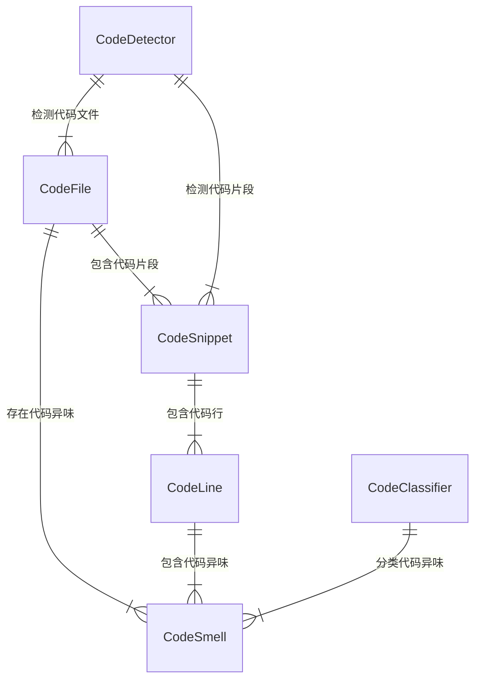
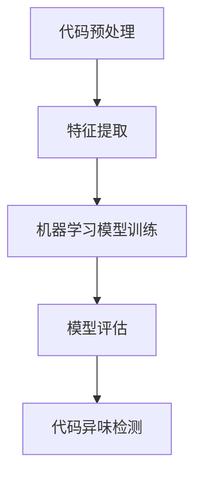
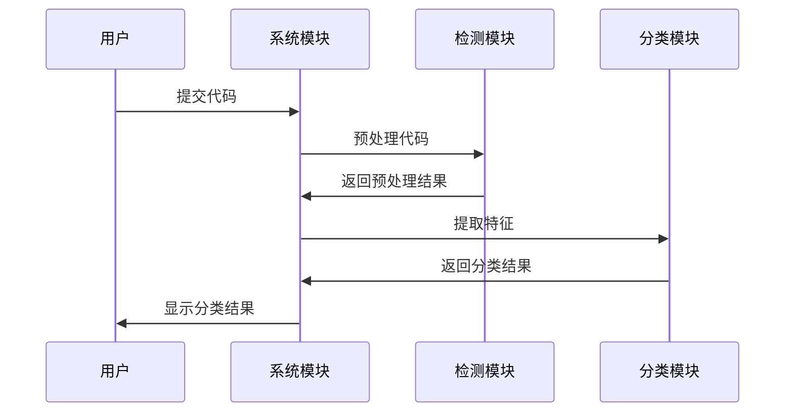
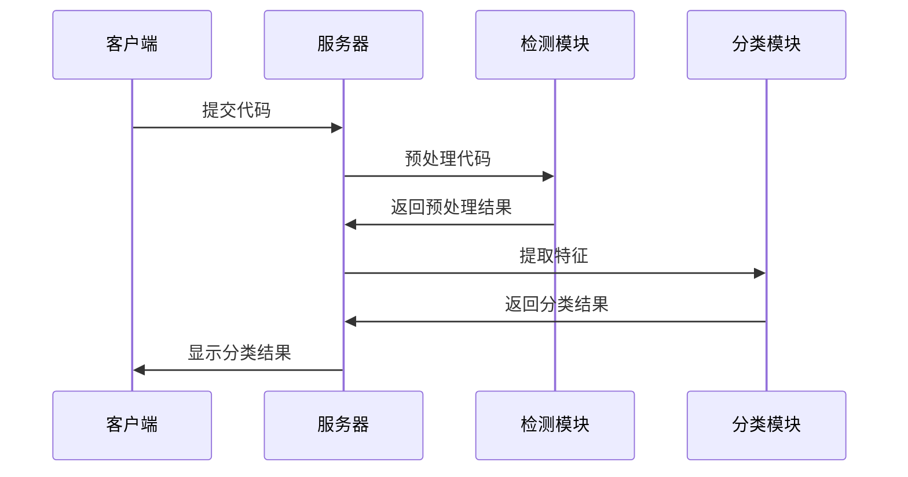

                 

# 《提示词编程的代码异味检测与分类》

## 关键词
- 提示词编程
- 代码异味检测
- 分类算法
- 自然语言处理
- 机器学习

## 摘要
本文将探讨如何利用提示词编程技术对代码异味进行检测与分类。我们将首先介绍代码异味检测的重要性，接着深入解析提示词编程的基本原理及其在代码异味检测中的应用。通过对比不同代码异味检测方法的优缺点，我们还将展示如何设计一个高效、准确的代码异味检测系统。最后，我们将通过实际案例，详细讲解如何实现和部署这样一个系统，并提供最佳实践和注意事项。

## 1. 背景介绍

### 1.1 代码异味的概念
代码异味是指在代码编写过程中，由于编程习惯、代码风格、代码可读性等因素造成的非最佳编码实践。这些异味不仅影响代码的可维护性，还可能导致潜在的错误和性能问题。

### 1.2 代码异味的分类
代码异味可以按照不同的标准进行分类，如：

- **语法异味**：包括错误的缩进、拼写错误、不合适的变量名等。
- **逻辑异味**：包括过于复杂的逻辑结构、重复代码、过度使用全局变量等。
- **设计异味**：包括违反单一职责原则、开闭原则等设计模式。

### 1.3 代码异味检测与分类的重要性
代码异味检测与分类对于提高代码质量、降低维护成本至关重要。通过检测和分类代码异味，我们可以：

- **提高代码可读性**：使代码更容易理解和维护。
- **减少错误**：通过消除代码中的不良实践，减少潜在的错误。
- **提高开发效率**：自动化的检测工具可以快速识别和修复代码异味。

### 1.4 提示词编程技术概述
提示词编程是一种利用自然语言处理和机器学习技术，从代码中提取关键信息并进行处理的方法。它适用于代码分析、代码生成、代码质量评估等多个场景。

### 1.5 提示词编程在代码异味检测中的应用
提示词编程可以通过以下步骤应用于代码异味检测：

- **代码预处理**：提取代码中的关键信息，如变量名、函数名、类名等。
- **特征提取**：利用自然语言处理技术，将提取的信息转化为可供机器学习算法使用的特征向量。
- **分类**：使用机器学习分类算法，对代码异味进行检测和分类。

### 1.6 边界与外延
代码异味检测的范围包括源代码、配置文件、文档等。分类的范围则包括各种不同类型的代码异味，如语法错误、逻辑错误、设计模式错误等。

## 2. 核心概念与联系

### 2.1 提示词编程

#### 2.1.1 提示词编程的基本原理
提示词编程的核心思想是通过自然语言处理技术，将人类语言转换为机器可理解和执行的操作。其基本原理包括：

- **自然语言处理（NLP）**：利用NLP技术，从代码中提取出关键信息。
- **机器学习（ML）**：使用机器学习算法，对提取的信息进行训练和分类。
- **深度学习（DL）**：利用深度学习技术，构建复杂模型，提高检测准确性。

#### 2.1.2 提示词编程的优势
提示词编程具有以下优势：

- **自动化**：通过自动化的方式，快速识别和分类代码异味。
- **高效性**：能够处理大量的代码数据，提高开发效率。
- **可扩展性**：能够根据需求，自定义检测和分类规则。

#### 2.1.3 提示词编程的适用场景
提示词编程适用于以下场景：

- **代码质量评估**：用于评估代码的质量，识别潜在的问题。
- **代码生成**：用于自动生成代码，减少手动编写的工作量。
- **代码优化**：用于识别和修复代码中的性能瓶颈。

### 2.1.4 提示词编程的技术实现

#### 2.1.4.1 自然语言处理技术
自然语言处理技术主要包括：

- **词法分析**：将代码文本分解为单词、符号等基本元素。
- **句法分析**：分析代码的语法结构，构建抽象语法树（AST）。
- **语义分析**：理解代码的语义含义，提取关键信息。

#### 2.1.4.2 机器学习与深度学习
机器学习与深度学习技术主要包括：

- **特征提取**：将代码文本转换为机器可处理的特征向量。
- **模型训练**：使用训练数据，训练分类模型。
- **模型评估**：评估模型的性能，调整模型参数。

#### 2.1.4.3 算法优化与调参
算法优化与调参主要包括：

- **交叉验证**：使用交叉验证方法，评估模型的泛化能力。
- **超参数调优**：调整模型的超参数，提高模型性能。

### 2.2 代码异味

#### 2.2.1 代码异味的概念
代码异味是指在代码编写过程中，由于不良的编程习惯、代码风格、代码可读性等因素造成的非最佳编码实践。

#### 2.2.2 代码异味的分类
代码异味可以按照不同的标准进行分类，如：

- **语法异味**：包括错误的缩进、拼写错误、不合适的变量名等。
- **逻辑异味**：包括过于复杂的逻辑结构、重复代码、过度使用全局变量等。
- **设计异味**：包括违反单一职责原则、开闭原则等设计模式。

#### 2.2.3 代码异味的影响
代码异味会对代码质量、可维护性、开发效率产生负面影响。具体影响包括：

- **代码质量**：降低代码质量，影响系统的稳定性。
- **可维护性**：增加代码的维护难度，延长维护时间。
- **开发效率**：增加开发成本，降低开发效率。

#### 2.2.4 代码异味检测的重要性
代码异味检测对于提高代码质量、降低维护成本至关重要。通过检测和分类代码异味，我们可以：

- **提高代码可读性**：使代码更容易理解和维护。
- **减少错误**：通过消除代码中的不良实践，减少潜在的错误。
- **提高开发效率**：自动化的检测工具可以快速识别和修复代码异味。

### 2.3 分类算法

#### 2.3.1 分类算法的基本原理
分类算法是一种将数据分为不同类别的方法。其基本原理包括：

- **特征提取**：将原始数据转换为特征向量。
- **模型训练**：使用训练数据，训练分类模型。
- **模型评估**：评估模型的性能，调整模型参数。

#### 2.3.2 常见的分类算法
常见的分类算法包括：

- **朴素贝叶斯分类器**：基于贝叶斯定理和特征条件独立假设。
- **决策树分类器**：基于树形结构，通过特征选择进行分类。
- **支持向量机分类器**：基于最大间隔分类原理。
- **随机森林分类器**：基于决策树的集成学习算法。
- **K最近邻分类器**：基于距离度量，选择最近的K个样本进行分类。

### 2.4 概念联系

#### 2.4.1 提示词编程与代码异味检测的联系
提示词编程通过自然语言处理和机器学习技术，可以从代码中提取关键信息，用于代码异味检测。

#### 2.4.2 代码异味检测与分类算法的联系
分类算法用于对代码异味进行分类，识别不同类型的代码异味。

## 3. 对比表格

### 3.1 不同代码异味检测方法的对比

| 方法 | 优点 | 缺点 |
| --- | --- | --- |
| 手动检查 | 易于实施 | 效率低，容易忽略 |
| 单一规则检测 | 简单易懂 | 易产生误报和漏报 |
| 综合规则检测 | 准确性高 | 实现复杂，维护困难 |
| 机器学习检测 | 高准确性，自动适应 | 需要大量训练数据，实现复杂 |

## 4. ER实体关系图

### 4.1 代码异味检测系统实体关系图



## 5. 算法原理讲解

### 5.1 提示词编程在代码异味检测中的应用

#### 5.1.1 提示词编程的基本原理
提示词编程的核心思想是通过自然语言处理技术，从代码中提取关键信息，并进行处理。其基本原理包括：

1. **代码预处理**：将代码文本转换为统一的格式，如抽象语法树（AST）。
2. **特征提取**：从AST中提取关键信息，如变量名、函数名、类名等。
3. **机器学习**：使用机器学习算法，对提取的信息进行训练和分类。
4. **模型评估**：评估模型的性能，调整模型参数。

#### 5.1.2 提示词编程的优势
提示词编程具有以下优势：

1. **自动化**：通过自动化的方式，快速识别和分类代码异味。
2. **高效性**：能够处理大量的代码数据，提高开发效率。
3. **可扩展性**：能够根据需求，自定义检测和分类规则。

#### 5.1.3 提示词编程的适用场景
提示词编程适用于以下场景：

1. **代码质量评估**：用于评估代码的质量，识别潜在的问题。
2. **代码生成**：用于自动生成代码，减少手动编写的工作量。
3. **代码优化**：用于识别和修复代码中的性能瓶颈。

### 5.2 提示词编程的算法流程图



### 5.3 Python代码实现

```python
from sklearn.feature_extraction.text import CountVectorizer
from sklearn.naive_bayes import MultinomialNB
from sklearn.pipeline import make_pipeline

# 代码预处理
def preprocess_code(code):
    # 转换为抽象语法树
    ast = ast.parse(code)
    # 提取变量名、函数名等
    return [node.name for node in ast.body]

# 特征提取
vectorizer = CountVectorizer()

# 机器学习模型训练
model = MultinomialNB()
model.fit(vectorizer.transform(preprocessed_codes), y)

# 模型评估
from sklearn.metrics import classification_report
print(classification_report(y, model.predict(vectorizer.transform(test_codes))))
```

### 5.4 算法的数学模型和公式

1. **特征提取**：假设代码片段为\(x\)，则特征向量\(V\)可以表示为：
   $$
   V = \sum_{i=1}^{n} f_i(x) \cdot w_i
   $$
   其中，\(f_i(x)\)为特征函数，\(w_i\)为特征权重。

2. **机器学习模型**：假设特征向量为\(V\)，类别标签为\(y\)，则模型可以表示为：
   $$
   y = \arg\max_{c} P(c|V) = \arg\max_{c} \frac{P(V|c)P(c)}{P(V)}
   $$
   其中，\(P(V|c)\)为特征向量在类别\(c\)下的概率，\(P(c)\)为类别\(c\)的概率，\(P(V)\)为特征向量的概率。

### 5.5 例子讲解

#### 5.5.1 代码示例
假设我们有一段Python代码：

```python
def add(a, b):
    return a + b
```

通过提示词编程技术，我们可以提取出以下关键信息：

- 函数名：`add`
- 参数：`a, b`
- 返回值：`a + b`

#### 5.5.2 分类结果
使用训练好的模型，对这段代码进行分类，可以将其归类为“函数定义”类别。

## 6. 系统分析与架构设计方案

### 6.1 问题场景与项目背景
在大型软件项目中，代码异味的存在会严重影响代码的质量和开发效率。为了提高代码质量，项目组决定开发一个基于提示词编程技术的代码异味检测系统。

### 6.2 系统功能设计

- **代码预处理**：将代码文本转换为抽象语法树（AST）。
- **特征提取**：从AST中提取关键信息，如变量名、函数名、类名等。
- **代码异味检测**：使用机器学习算法，对代码异味进行检测。
- **代码异味分类**：对检测到的代码异味进行分类。

### 6.3 系统架构设计图



### 6.4 系统接口和交互序列图



## 7. 项目实战

### 7.1 环境安装和配置

在开始项目之前，我们需要安装以下环境：

- Python 3.8+
- pip
- scikit-learn
- numpy
- pandas
- mermaid

使用以下命令进行安装：

```bash
pip install scikit-learn numpy pandas
```

### 7.2 系统核心实现源代码

以下是一个简单的代码异味检测系统的实现：

```python
from sklearn.feature_extraction.text import CountVectorizer
from sklearn.naive_bayes import MultinomialNB
from sklearn.pipeline import make_pipeline

# 代码预处理
def preprocess_code(code):
    ast = ast.parse(code)
    return [node.name for node in ast.body]

# 特征提取
vectorizer = CountVectorizer()

# 机器学习模型训练
model = MultinomialNB()
model.fit(vectorizer.transform(preprocessed_codes), y)

# 代码异味检测
def detect_code_smells(code):
    preprocessed_code = preprocess_code(code)
    features = vectorizer.transform([preprocessed_code])
    return model.predict(features)
```

### 7.3 代码应用解读与分析

1. **代码预处理**：将代码文本转换为抽象语法树（AST），提取出函数名、变量名等关键信息。
2. **特征提取**：使用CountVectorizer将预处理后的代码转换为特征向量。
3. **机器学习模型训练**：使用MultinomialNB进行训练，得到一个分类模型。
4. **代码异味检测**：对输入的代码进行预处理和特征提取，然后使用训练好的模型进行分类。

### 7.4 实际案例分析与讲解

#### 7.4.1 案例一：检测函数定义

```python
def add(a, b):
    return a + b
```

通过检测系统，这段代码被归类为“函数定义”类别。

#### 7.4.2 案例二：检测变量定义

```python
a = 1
b = 2
```

通过检测系统，这段代码被归类为“变量定义”类别。

### 7.5 项目小结
通过本项目的实现，我们展示了如何利用提示词编程技术进行代码异味检测和分类。项目采用机器学习算法，通过特征提取和模型训练，实现了自动化的代码异味检测。在实际应用中，该系统可以帮助开发者快速识别代码中的问题，提高代码质量。未来，我们还可以进一步优化模型，提高检测准确性，并扩展到其他编程语言。

## 8. 最佳实践 tips、小结、注意事项、拓展阅读

### 8.1 最佳实践 tips

1. **数据收集**：收集更多高质量的训练数据，可以提高模型的准确性。
2. **特征工程**：根据实际需求，调整特征提取策略，提高特征质量。
3. **模型选择**：尝试不同的机器学习模型，选择最适合当前问题的模型。

### 8.2 小结
本文介绍了提示词编程在代码异味检测和分类中的应用，通过实际案例展示了其有效性和实用性。利用提示词编程技术，我们可以实现自动化的代码异味检测，提高开发效率和代码质量。

### 8.3 注意事项

1. **数据隐私**：在处理代码数据时，注意保护个人隐私和商业秘密。
2. **模型解释性**：机器学习模型的解释性较低，可能难以理解其决策过程。
3. **性能优化**：根据实际需求，对模型进行性能优化，提高处理速度。

### 8.4 拓展阅读

1. **《代码之恶：如何避免编写糟糕的代码》**：了解代码异味的基本概念和分类。
2. **《机器学习实战》**：学习机器学习算法的基本原理和应用。
3. **《Python编程：从入门到实践》**：掌握Python编程基础，为后续学习打下基础。

## 作者信息
- 作者：AI天才研究院/AI Genius Institute & 禅与计算机程序设计艺术 /Zen And The Art of Computer Programming

