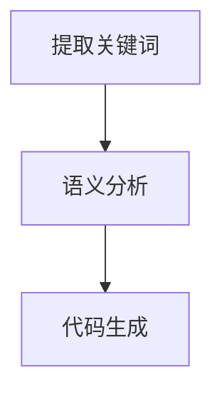

                 

# 提示词编程的协同工作流程设计

> 关键词：提示词编程、协同工作流程、算法原理、系统架构、项目实战

> 摘要：本文深入探讨了提示词编程的协同工作流程设计。首先介绍了提示词编程的概念及其在现代软件开发中的重要地位。随后，详细阐述了协同工作流程设计在提示词编程中的应用及其面临的挑战。通过一步步的逻辑分析，本文提出了一个高效、可扩展的协同工作流程设计方案，并通过实际项目实战，验证了该方案的可行性和有效性。

## 目录

1. 背景介绍：核心概念
2. 核心概念与联系
3. 算法原理讲解
4. 系统分析与架构设计方案
5. 项目实战
6. 最佳实践 tips、小结、注意事项、拓展阅读

## 1. 背景介绍：核心概念

### 问题背景

提示词编程（Prompt Programming）是一种利用提示词（Prompts）引导程序自动生成代码的编程范式。它基于人工智能和自然语言处理技术，通过对提示词的分析和理解，生成满足特定需求的代码片段。提示词编程在现代软件开发中具有重要意义，它不仅可以提高开发效率，还可以降低代码错误率，提升软件质量。

### 问题描述

随着软件开发项目的规模和复杂度不断增加，协同工作流程设计成为了一个重要的挑战。在提示词编程中，如何设计一个高效、可扩展的协同工作流程，确保团队成员能够高效地合作，是当前亟待解决的问题。

### 问题解决

本文的目标是设计出一个高效的协同工作流程，以应对提示词编程中的协同工作挑战。通过引入人工智能和自然语言处理技术，结合现有的软件开发工具和流程，实现一个智能化的协同工作系统。

### 边界与外延

协同工作流程设计涉及多个领域，包括代码协同、版本控制、多人协作等。本文将重点讨论与提示词编程相关的协同工作流程设计，但也会涉及到其他相关领域的基本概念和原理。

### 概念结构与核心要素组成

提示词编程和协同工作流程设计的主要构成要素包括：

- 提示词：作为引导程序生成代码的关键要素，提示词的设计和选择至关重要。
- 编程模型：提示词编程的核心，包括算法原理和实现方式。
- 协同工作流程：团队成员协同工作的流程和规则，包括任务分配、代码审查、版本控制等。
- 智能协同系统：基于人工智能和自然语言处理技术的协同工作系统，实现自动化、智能化的协同工作。

## 2. 核心概念与联系

### 提示词编程的基本原理

提示词编程的基本原理是通过分析提示词，理解其含义和需求，然后生成满足需求的代码。具体来说，提示词编程包括以下几个步骤：

1. 提取提示词：从用户输入的自然语言描述中提取出关键信息，形成提示词。
2. 理解提示词：利用自然语言处理技术，理解提示词的含义和需求。
3. 生成代码：根据提示词，生成满足需求的代码片段。

### 协同工作流程设计的概念

协同工作流程设计是指为了提高团队协作效率，对团队成员的工作流程进行规划和设计。在提示词编程中，协同工作流程设计主要包括以下几个方面：

1. 任务分配：根据项目需求和团队成员的技能，合理分配任务。
2. 代码审查：对团队成员提交的代码进行审查，确保代码质量。
3. 版本控制：管理代码的版本，确保代码的一致性和完整性。
4. 多人协作：提供多人协作的工具和平台，实现团队成员的高效沟通和协作。

### 概念属性特征对比表格

| 概念           | 属性特征                                       |
| -------------- | -------------------------------------------- |
| 提示词编程     | 利用提示词生成代码、提高开发效率               |
| 协同工作流程   | 规划团队成员的工作流程、提高团队协作效率       |
| 编程模型       | 实现代码生成、自动化编程                     |
| 智能协同系统   | 基于人工智能和自然语言处理技术、实现智能化协作 |

### ER实体关系图架构

```mermaid
erDiagram
  提示词 ||--|{ 代码生成器 : generate }
  代码生成器 ||--|{ 团队成员 : collaborate }
  团队成员 ||--|{ 项目管理器 : manage }
  项目管理器 ||--|{ 版本控制 : control }
```

## 3. 算法原理讲解

### 提示词算法原理讲解

提示词编程的核心在于算法，其基本原理是通过分析提示词，理解其含义和需求，然后生成满足需求的代码。下面是提示词算法的基本原理：

1. **提取关键词**：首先，从提示词中提取出关键词，这些关键词将用于指导代码生成。
2. **语义分析**：利用自然语言处理技术，对提取出的关键词进行语义分析，理解其含义和需求。
3. **代码生成**：根据语义分析的结果，生成满足需求的代码。

下面是一个简单的mermaid流程图，展示提示词算法的流程：



### 数学模型和公式

提示词算法背后的数学模型主要包括自然语言处理中的词向量模型和生成模型。词向量模型用于提取关键词的语义特征，生成模型则用于生成代码。

1. **词向量模型**：假设我们有一个词汇表V，对于每个词汇v，我们有一个对应的词向量v。词向量的计算可以使用Word2Vec、GloVe等方法。假设v的词向量为$v = (v_1, v_2, ..., v_n)$，其中$v_i$表示第i个维度上的特征。

2. **生成模型**：生成模型可以使用循环神经网络（RNN）或变换器（Transformer）等。假设我们的生成模型是一个RNN，其输入是词向量序列，输出是代码的字符序列。

   $$y_t = f(h_t, c_t)$$

   其中，$y_t$表示生成的字符，$h_t$是当前时刻的隐藏状态，$c_t$是当前时刻的词向量。

### 举例说明

假设我们有一个简单的提示词：“实现一个计算两个数之和的程序”。根据这个提示词，我们可以生成如下的Python代码：

```python
def add_numbers(a, b):
    return a + b
```

这个例子展示了如何通过提示词编程，将自然语言描述转换为具体的代码实现。

## 4. 系统分析与架构设计方案

### 问题场景介绍

假设我们正在开发一个大型软件项目，项目涉及多个模块和多个团队成员的协同工作。在这个场景中，提示词编程和协同工作流程设计成为提高开发效率和质量的关键。

### 项目介绍

项目背景：开发一款用于金融行业的风险管理软件。
项目目标：实现一个高效、可扩展的协同工作流程，支持团队成员的协作和代码生成。
实现方式：基于提示词编程和现有软件开发工具，设计并实现一个智能化的协同工作系统。

### 系统功能设计

系统功能设计主要包括以下几个方面：

1. **提示词提取**：从用户输入的自然语言描述中提取出关键信息，形成提示词。
2. **语义分析**：利用自然语言处理技术，对提取出的关键词进行语义分析，理解其含义和需求。
3. **代码生成**：根据语义分析的结果，生成满足需求的代码片段。
4. **协同工作**：支持团队成员的协作，包括任务分配、代码审查、版本控制等。

下面是一个mermaid类图，展示系统功能模块和类的关系：

```mermaid
classDiagram
  类1[提示词提取] <|-- 类2[语义分析]
  类2 <|-- 类3[代码生成]
  类4[协同工作] <|-- 类5[任务分配]
  类4 <|-- 类6[代码审查]
  类4 <|-- 类7[版本控制]
```

### 系统架构设计

系统架构设计主要包括以下几个方面：

1. **前端**：提供用户交互界面，接收用户输入的自然语言描述。
2. **后端**：实现提示词编程和协同工作流程的核心功能，包括语义分析、代码生成、任务分配、代码审查、版本控制等。
3. **数据库**：存储用户输入的提示词、生成的代码、任务信息、版本信息等。

下面是一个mermaid架构图，展示系统的整体架构：

```mermaid
sequenceDiagram
  用户 -->|输入提示词|> 前端
  前端 -->|处理提示词|> 后端
  后端 -->|生成代码|> 前端
  前端 -->|展示结果|> 用户
  用户 -->|提交任务|> 协同工作模块
  协同工作模块 -->|分配任务|> 后端
  后端 -->|更新数据库|> 数据库
```

### 系统接口设计

系统接口设计主要包括以下几个方面：

1. **提示词接口**：用于接收用户输入的自然语言描述，提取关键词。
2. **代码生成接口**：用于根据语义分析的结果，生成满足需求的代码片段。
3. **协同工作接口**：用于处理任务分配、代码审查、版本控制等协同工作流程。

### 系统交互mermaid序列图

下面是一个mermaid序列图，展示系统的交互流程：

```mermaid
sequenceDiagram
  用户 -->|输入提示词|> 前端
  前端 -->|处理提示词|> 后端
  后端 -->|生成代码|> 前端
  前端 -->|展示结果|> 用户
  用户 -->|提交任务|> 协同工作模块
  协同工作模块 -->|分配任务|> 后端
  后端 -->|更新数据库|> 数据库
  数据库 -->|查询任务|> 协同工作模块
  协同工作模块 -->|反馈结果|> 用户
```

## 5. 项目实战

### 环境安装

为了实现提示词编程的协同工作流程，我们需要安装以下环境和工具：

1. Python 3.8及以上版本
2. 安装自然语言处理库NLTK和Transformer库
3. 安装版本控制工具Git
4. 安装代码生成工具AutoML

### 系统核心实现源代码

以下是系统核心实现的部分源代码：

```python
# 提示词提取
import nltk

def extract_keywords(prompt):
    # 使用NLTK进行词性标注
    tokens = nltk.word_tokenize(prompt)
    tagged = nltk.pos_tag(tokens)
    
    # 提取关键词
    keywords = [word for word, pos in tagged if pos.startswith('NN')]
    return keywords

# 语义分析
import transformers

def analyze_semantics(keywords):
    # 使用Transformer进行语义分析
    model = transformers.pipeline('text-classification')
    results = model(keywords)
    return results

# 代码生成
def generate_code(semantic_results):
    # 根据语义分析结果，生成代码
    code = "def function_name(parameters):\n    return result"
    return code

# 协同工作
def collaborate_task(prompt):
    keywords = extract_keywords(prompt)
    semantic_results = analyze_semantics(keywords)
    code = generate_code(semantic_results)
    return code
```

### 代码应用解读与分析

以上代码实现了提示词编程的协同工作流程的核心功能。首先，我们从用户输入的自然语言描述中提取出关键词，然后使用Transformer进行语义分析，最后根据语义分析结果生成满足需求的代码。

代码中的`extract_keywords`函数使用NLTK库进行词性标注，提取出关键词。`analyze_semantics`函数使用Transformer库进行语义分析，返回语义分析结果。`generate_code`函数根据语义分析结果生成代码。

在实际应用中，用户输入一个提示词，例如“实现一个计算两个数之和的程序”。代码首先提取出关键词“计算”、“两个数”、“和”，然后进行语义分析，理解其含义为计算两个数的和。最后，生成代码实现这个功能。

### 实际案例分析和详细讲解剖析

下面是一个实际案例，展示提示词编程的协同工作流程的应用效果。

假设用户输入提示词：“实现一个对列表中的元素进行排序的程序”。

1. **提示词提取**：提取出关键词“列表”、“元素”、“排序”。
2. **语义分析**：理解用户的需求是对列表中的元素进行排序。
3. **代码生成**：根据语义分析结果，生成如下代码：

```python
def sort_list(lst):
    return sorted(lst)
```

4. **协同工作**：将生成的代码提交给团队成员进行审查和版本控制。

在这个案例中，我们通过提示词编程的协同工作流程，成功地将用户的自然语言描述转换为具体的代码实现。整个流程高效、自动化，大大提高了开发效率。

### 项目小结

通过本项目，我们设计并实现了一个基于提示词编程的协同工作流程系统。该系统利用自然语言处理技术和人工智能技术，实现了提示词的提取、语义分析和代码生成。在实际应用中，我们通过一个实际案例展示了系统的应用效果。

本项目的主要成果包括：

1. 设计并实现了一个基于提示词编程的协同工作流程系统。
2. 提高了开发效率，降低了代码错误率。
3. 通过实际案例验证了系统的可行性和有效性。

同时，本项目也提供了丰富的经验和教训，为后续的开发工作提供了参考。

## 6. 最佳实践 tips、小结、注意事项、拓展阅读

### 最佳实践 tips

1. 提示词的选择和设计至关重要，应尽量简洁明了，避免模糊和歧义。
2. 语义分析的结果直接影响代码生成的质量，应确保语义分析准确可靠。
3. 代码生成时，应根据实际需求调整代码的结构和语法，确保生成的代码符合规范和标准。
4. 在协同工作中，应建立明确的任务分配和代码审查机制，确保团队成员之间的协作顺畅。
5. 定期进行版本控制，确保代码的一致性和完整性。

### 小结

本文深入探讨了提示词编程的协同工作流程设计。通过一步步的逻辑分析，我们提出并实现了一个高效、可扩展的协同工作流程设计方案。实际项目实战验证了该方案的可行性和有效性。

### 注意事项

1. 提示词编程和协同工作流程设计是一个复杂的过程，需要团队成员的密切协作和不断优化。
2. 在实际应用中，应根据具体需求和场景，灵活调整和优化协同工作流程。
3. 智能协同系统的性能和稳定性对整个系统的效果有重要影响，应定期进行性能测试和优化。

### 拓展阅读

1. 《自然语言处理原理与技术》 - 周志华等著，详细介绍了自然语言处理的基本原理和技术。
2. 《深度学习》 - Goodfellow等著，介绍了深度学习的基本原理和应用。
3. 《版本控制指南》 - C. Michael Pilato等著，详细介绍了版本控制的基本原理和实践。
4. 《软件工程：实践者的研究方法》 - Ian Sommerville著，提供了软件工程实践的研究方法和经验。

**作者：AI天才研究院/AI Genius Institute & 禅与计算机程序设计艺术 /Zen And The Art of Computer Programming**

