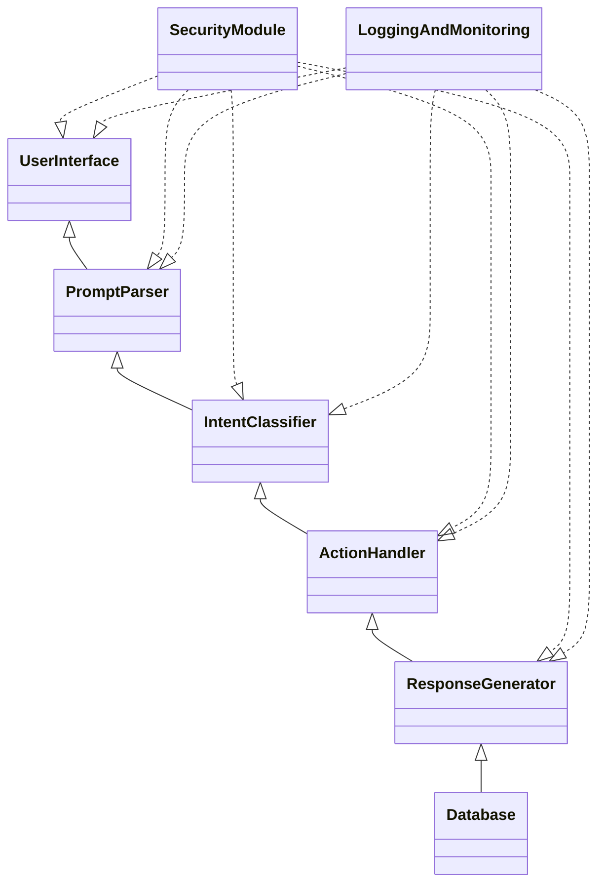
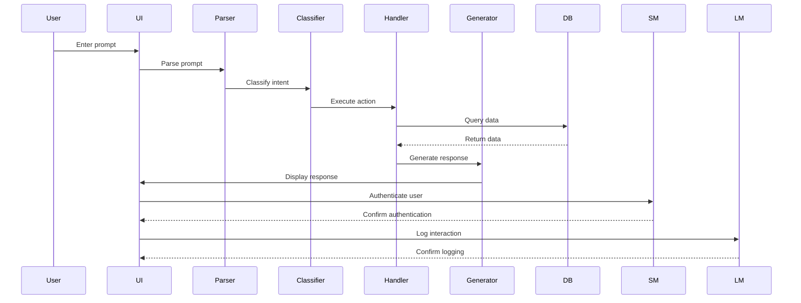

                 

### Introduction Chapter

#### Overview of Prompt Programming and Its Significance

Prompt programming, a concept that has gained significant traction in recent years, revolves around leveraging user-provided prompts to guide the execution of software applications. Unlike traditional programming, which follows a predetermined set of instructions, prompt programming emphasizes adaptability and user interaction. By allowing users to input specific prompts, developers can create applications that are more flexible and responsive to changing requirements. This paradigm shift is particularly important in modern software development, where the pace of innovation and the diversity of user needs are constantly evolving.

One of the primary challenges associated with prompt programming is ensuring that the system can accurately interpret and act upon these prompts. Misinterpretations can lead to incorrect or suboptimal outcomes, compromising the reliability and effectiveness of the application. Furthermore, as the complexity of software systems increases, managing and maintaining a prompt-driven architecture becomes more challenging. This is where the concept of anti-pattern recognition and refactoring becomes crucial.

#### Challenges in Prompt Programming

The challenges in prompt programming can be broadly categorized into technical, functional, and maintainability aspects. From a technical standpoint, accurately parsing and understanding the semantics of user inputs is a complex task. Natural language processing (NLP) and machine learning (ML) models are often employed to handle this complexity, but these models require substantial training and tuning to achieve high accuracy. Additionally, the integration of prompt programming with existing software systems can introduce compatibility issues and performance bottlenecks.

Functionally, prompt programming demands a robust understanding of user intent. Users may not always provide clear or unambiguous prompts, making it necessary for the system to infer and predict their needs. This introduces the risk of miscommunication and the need for sophisticated algorithms to handle ambiguities and uncertainties. Moreover, the dynamic nature of prompts means that the system must be able to adapt quickly to changes, which can be challenging to achieve in practice.

Maintainability is another significant challenge. As the complexity of prompt-driven systems increases, the codebase can become difficult to understand and modify. Anti-patterns, or poor coding practices, can exacerbate these issues by making the code more error-prone and harder to maintain. Recognizing and refactoring these anti-patterns is essential to ensure that the system remains robust, efficient, and scalable.

#### Need for Anti-pattern Recognition and Refactoring

Given the challenges outlined above, it is clear that anti-pattern recognition and refactoring are essential practices in prompt programming. Anti-patterns are identifiable structures or patterns that, while seemingly intuitive or common, lead to suboptimal solutions or problems. Recognizing these anti-patterns allows developers to identify and eliminate practices that hinder the effectiveness and maintainability of the system. Refactoring, on the other hand, involves restructuring and improving the existing code to enhance its readability, efficiency, and reliability.

By systematically identifying and refactoring anti-patterns, developers can create more robust, maintainable, and scalable prompt-driven applications. This, in turn, enables better user experiences and more effective software development processes. The goal of this book is to provide a comprehensive guide to anti-pattern recognition and refactoring in prompt programming, helping developers navigate the complexities of this emerging paradigm.

#### Book Structure and Target Audience

The book is structured into several key chapters, each addressing different aspects of prompt programming and anti-pattern recognition. The first chapter provides an overview of prompt programming, its significance, and the challenges it poses. The following chapters delve into fundamental concepts, anti-pattern recognition, and refactoring techniques.

The target audience of this book includes experienced software developers, particularly those working on prompt-driven applications or transitioning to this paradigm. It also caters to researchers and students interested in exploring the latest trends in software development. By equipping readers with the necessary knowledge and skills, the book aims to foster a deeper understanding of prompt programming and its practical implications.

In conclusion, prompt programming offers a powerful approach to creating adaptable and user-centric software applications. However, it comes with its own set of challenges, particularly in terms of technical complexity, functional ambiguity, and maintainability. Anti-pattern recognition and refactoring are essential practices for addressing these challenges and creating robust, scalable, and maintainable systems. This book aims to provide a comprehensive guide to these practices, empowering developers to harness the full potential of prompt programming.

### Keywords

1. Prompt Programming
2. Anti-pattern Recognition
3. Refactoring
4. Software Development
5. Natural Language Processing
6. Machine Learning
7. User Interaction

### Summary

This book delves into the world of prompt programming, a dynamic approach that enhances software adaptability through user interaction. The core theme revolves around addressing the challenges of prompt programming, such as technical complexity and maintainability issues, by employing anti-pattern recognition and refactoring techniques. The book provides a systematic approach to identifying and restructuring these anti-patterns to create robust and scalable applications. By exploring fundamental concepts, recognizing common anti-patterns, and offering effective refactoring strategies, this book aims to equip developers with the skills necessary to navigate the complexities of prompt programming, ultimately leading to more efficient and maintainable software solutions.

## Fundamental Concepts

### Chapter 2: Background and Basic Concepts

#### History and Evolution of Prompt Programming

Prompt programming is not a new concept; its roots can be traced back to the early days of computing when developers sought ways to make software more interactive and user-friendly. The origins of prompt programming can be found in the interactive command-line interfaces (CLIs) of the 1960s and 1970s, where users would type commands to perform specific tasks. These early systems laid the groundwork for user interaction and prompted the development of more sophisticated approaches to software design.

As time progressed, the concept of prompt programming evolved alongside advancements in technology. The advent of graphical user interfaces (GUIs) in the 1980s and 1990s brought about significant changes, allowing users to interact with software through visual elements rather than text-based commands. However, the core idea of using prompts to guide software behavior remained. In the early 2000s, with the rise of the internet and mobile devices, prompt programming became even more integral to software design, as developers aimed to create applications that could seamlessly adapt to different platforms and user needs.

#### Definition of Key Terms and Concepts

To understand prompt programming, it's essential to familiarize ourselves with some key terms and concepts:

1. **Prompt**: A prompt is a stimulus or cue given to a user to initiate a specific action or provide input. In the context of prompt programming, prompts are used to guide the behavior of software applications, allowing users to interact dynamically with the system.

2. **User Interaction**: User interaction refers to the way users engage with a software application. In prompt programming, user interaction is mediated through prompts, which can be text-based, graphical, or any other form of input.

3. **Natural Language Processing (NLP)**: NLP is a subfield of artificial intelligence (AI) that focuses on the interaction between computers and humans through natural language. NLP is often used in prompt programming to process and interpret user inputs, enabling more intuitive and effective interactions.

4. **Machine Learning (ML)**: ML is a subset of AI that involves training algorithms to learn from data and make predictions or decisions. ML models are frequently employed in prompt programming to recognize patterns in user inputs and predict user intents.

5. **Prompt-Driven Architecture**: Prompt-driven architecture is a software design approach where the behavior of an application is dictated by user prompts rather than a predetermined set of instructions. This architecture allows for greater flexibility and adaptability in software systems.

6. **Anti-pattern**: An anti-pattern is a common, but often inefficient or counterproductive, practice or pattern in software development. In prompt programming, anti-patterns are coding practices that can lead to suboptimal results, decreased maintainability, and other problems.

#### Differences from Traditional Programming Paradigms

One of the key distinctions between prompt programming and traditional programming paradigms lies in the focus on user interaction and adaptability. Traditional programming often follows a more rigid, step-by-step approach, where the behavior of a program is determined by a predefined set of instructions. This makes it less flexible and less responsive to changing user needs.

In contrast, prompt programming places a higher emphasis on user interaction and adaptability. The system's behavior is guided by user inputs, allowing for a more dynamic and responsive user experience. This can be particularly beneficial in scenarios where user needs may change rapidly or unpredictably, such as in interactive applications, e-commerce platforms, or customer service systems.

Another difference is the reliance on NLP and ML in prompt programming. Traditional programming paradigms typically do not require these advanced AI techniques, whereas prompt programming often leverages NLP to understand and interpret user inputs, and ML to predict user intents and adapt to their needs over time.

#### Benefits and Limitations of Prompt Programming

Prompt programming offers several benefits, including increased flexibility, improved user experience, and enhanced adaptability. By allowing users to interact with the system through prompts, developers can create more intuitive and user-friendly applications that can respond to user needs in real-time.

However, prompt programming also comes with its limitations. One major challenge is the complexity of parsing and interpreting user inputs. Accurately understanding user prompts requires sophisticated NLP and ML models, which can be computationally expensive and require substantial training data.

Additionally, prompt-driven architectures can be more difficult to maintain and debug compared to traditional programming paradigms. As the system's behavior is driven by user interactions, the codebase can become more complex and harder to understand, particularly as the number of user inputs and interactions grows.

In conclusion, prompt programming represents a significant shift from traditional programming paradigms, offering new opportunities for creating flexible and adaptable software systems. However, it also poses challenges that must be carefully managed to ensure the effectiveness and maintainability of the resulting applications. Understanding the history, key concepts, and differences from traditional programming paradigms is essential for developers looking to harness the full potential of prompt programming.

#### Core Principles of Prompt Programming

Prompt programming operates on several core principles that distinguish it from traditional programming paradigms. These principles emphasize flexibility, adaptability, and user-centric design, which are crucial for creating modern, responsive software applications.

1. **User-Centric Design**: The primary focus of prompt programming is the user. Unlike traditional programming, which often follows a predetermined set of instructions, prompt programming places a strong emphasis on user interaction and feedback. The goal is to create applications that can adapt to the user's needs and preferences in real-time. This principle is facilitated by the use of prompts, which serve as a bridge between the user and the application, enabling dynamic interactions.

2. **Dynamic Interaction**: In prompt programming, the interaction between the user and the application is dynamic and flexible. Users provide prompts through various channels—such as text, voice, or gestures—and the application responds in real-time based on these inputs. This dynamic interaction allows for a more engaging user experience, as the application can tailor its behavior to the user's current context and needs. The use of NLP and ML further enhances this dynamic interaction by enabling the application to understand and predict user intents.

3. **Adaptive Learning**: Prompt programming leverages machine learning to adapt to user behaviors over time. ML models are trained on user data to recognize patterns and infer user intents, allowing the application to become more intuitive and responsive. This adaptive learning capability is a significant advantage over traditional programming, where the behavior of the application is fixed and cannot evolve based on user interactions. Adaptive learning enables applications to improve their performance and user satisfaction over time.

4. **Scalability and Modularity**: Prompt programming architectures are often designed with scalability and modularity in mind. This principle allows applications to handle an increasing number of users and interactions without significant performance degradation. By breaking down the system into modular components, developers can more easily manage and maintain the codebase, making it more resilient to changes and updates. Scalability is particularly important in applications that may experience sudden spikes in usage, such as e-commerce platforms or social media networks.

5. **Flexibility in Input Methods**: Another core principle of prompt programming is the flexibility of input methods. Users interact with the application through various channels, including text-based prompts, voice commands, graphical user interfaces (GUIs), and even gestures. This flexibility ensures that the application can be easily adapted to different platforms and user preferences, enhancing its accessibility and usability.

6. **Real-Time Feedback**: Prompt programming emphasizes the importance of real-time feedback. By providing immediate responses to user inputs, applications can create a more engaging and interactive experience. Real-time feedback not only helps users understand the system's current state but also builds trust and confidence in the application's capabilities. This principle is particularly important in applications where user feedback is critical, such as customer service platforms or interactive games.

7. **Continuous Iteration**: The final core principle of prompt programming is continuous iteration. Unlike traditional software development, which often follows a linear development process, prompt programming embraces an iterative approach. Developers continuously refine and improve the application based on user feedback and changing requirements. This iterative process ensures that the application remains responsive to user needs and can adapt to new challenges and opportunities over time.

In summary, the core principles of prompt programming—user-centric design, dynamic interaction, adaptive learning, scalability and modularity, flexibility in input methods, real-time feedback, and continuous iteration— collectively enable the development of modern, flexible, and user-friendly software applications. By embracing these principles, developers can create systems that are not only more responsive to user needs but also more adaptable to evolving technological and market trends.

#### Common Patterns in Prompt Programming

In the realm of prompt programming, various patterns have emerged that facilitate the development of flexible and user-centric applications. These patterns, while seemingly intuitive, can significantly impact the performance, maintainability, and scalability of the software. Here, we explore some of the most common patterns in prompt programming and their benefits and limitations.

1. **Interactive Command-Line Interface (CLI)**: One of the earliest and most fundamental patterns in prompt programming is the interactive command-line interface (CLI). Users interact with the application by entering text-based commands, which the system interprets and executes. CLIs are particularly useful for advanced users who prefer direct control over the application's behavior. They are often employed in environments where performance and efficiency are paramount, such as system administration and software development.

   **Benefits**:
   - High performance: CLI interactions are typically faster and more efficient than graphical interfaces.
   - Precision: Users can provide exact commands, which can be particularly useful for complex operations.

   **Limitations**:
   - Lack of discoverability: CLI commands can be difficult for new users to understand and remember.
   - Limited interactivity: CLIs are generally less engaging and may not provide a seamless user experience.

2. **Graphical User Interface (GUI)**: GUIs have become the dominant pattern in modern software development, offering a visual representation of the application's functionality. Users interact with GUI elements such as buttons, menus, and forms, which the system translates into actions. GUIs are highly intuitive and accessible, making them ideal for a wide range of users, including those with limited technical expertise.

   **Benefits**:
   - Improved usability: GUIs provide a visual and interactive interface that is easier for users to navigate.
   - Enhanced user engagement: Visual elements and interactive features can create a more engaging user experience.

   **Limitations**:
   - Higher resource consumption: GUIs require more computational resources, potentially affecting performance.
   - Steeper learning curve: While GUIs are generally more intuitive than CLIs, some users may still find them complex.

3. **Natural Language Processing (NLP)**: NLP patterns involve using AI models to process and interpret natural language inputs from users. This allows applications to understand and respond to voice commands, chat messages, or text inputs in a more human-like manner. NLP is particularly useful in applications that require real-time communication with users, such as chatbots and virtual assistants.

   **Benefits**:
   - Enhanced user experience: NLP can make interactions more natural and intuitive, reducing the cognitive load on users.
   - Increased flexibility: NLP allows applications to handle a wide range of user inputs and intents.

   **Limitations**:
   - Complexity: Implementing NLP requires advanced AI techniques, which can be computationally expensive and challenging to maintain.
   - Ambiguity: NLP models can struggle with ambiguous inputs or context-specific nuances, leading to misinterpretations.

4. **Machine Learning (ML)**: ML patterns leverage machine learning algorithms to improve the application's ability to predict user behaviors and adapt to their needs. ML models are trained on user data to recognize patterns and make predictions, enabling applications to provide personalized and context-aware responses.

   **Benefits**:
   - Personalization: ML can enhance the application's ability to deliver personalized experiences based on user preferences and behaviors.
   - Predictive capabilities: ML models can predict user needs and proactively provide relevant information or suggestions.

   **Limitations**:
   - Data dependency: ML models require large amounts of data to train effectively, which may not always be available.
   - Bias and fairness: ML models can exhibit biases if the training data is not representative, potentially leading to unfair outcomes.

5. **Modular Prompt Architecture**: This pattern involves designing the application with a modular architecture that allows for the easy integration of different prompt types and interaction channels. By breaking down the system into smaller, manageable components, developers can more easily adapt the application to new user needs and environments.

   **Benefits**:
   - Scalability: Modular architectures are highly scalable, allowing the application to handle an increasing number of users and interactions.
   - Maintainability: Modular design makes the codebase more manageable and easier to maintain.

   **Limitations**:
   - Complexity: Designing a truly modular architecture can be complex and requires careful planning and coordination.
   - Performance overhead: The increased complexity of modular architectures can introduce performance overheads, particularly in high-load scenarios.

In conclusion, while common patterns in prompt programming offer significant advantages in terms of flexibility and user experience, they also come with their own set of challenges. By understanding the benefits and limitations of these patterns, developers can make informed decisions about which approaches to adopt and how to address potential issues. This balance between flexibility and maintainability is key to creating robust and effective prompt-driven applications.

#### Relationship Between Patterns and Refactoring

The relationship between prompt programming patterns and refactoring is multifaceted, playing a crucial role in enhancing the maintainability, scalability, and performance of software applications. Prompt programming patterns, which facilitate dynamic user interaction and adaptability, can introduce complexities and inefficiencies that require systematic refactoring. Conversely, effective refactoring can help mitigate these issues, ensuring that the application remains robust and manageable over time.

#### The Impact of Prompt Patterns on Code Structure

Prompt programming patterns, such as interactive command-line interfaces (CLI), graphical user interfaces (GUI), natural language processing (NLP), and machine learning (ML), introduce unique challenges to the codebase. For example, NLP and ML patterns often involve complex algorithms and large datasets, which can lead to a proliferation of code modules and dependencies. This complexity can make the codebase difficult to understand and maintain, as different components may interact in non-trivial ways.

1. **CLI and GUI**: While CLIs and GUIs offer different interaction models, both can lead to code duplication and tangled dependencies. For instance, a CLI might require separate code paths for different commands, which can result in redundant logic. GUIs, on the other hand, can introduce complexity through event handlers and state management, making it harder to track the flow of execution.

2. **NLP and ML**: NLP and ML patterns, which rely on complex algorithms and predictive models, can significantly increase the code complexity. The training and inference phases of these models often involve multiple data preprocessing steps, model tuning, and validation, which can be scattered across different parts of the codebase. This fragmentation can make it difficult to identify and fix issues, as the interactions between different components may not be immediately clear.

#### The Role of Refactoring in Addressing Prompt Programming Challenges

Refactoring, the process of improving the internal structure of code without changing its external behavior, is essential for addressing the challenges introduced by prompt programming patterns. By systematically identifying and restructuring code to eliminate inefficiencies and reduce complexity, refactoring can help maintain the integrity and scalability of the application.

1. **Simplifying Code Structure**: Refactoring can simplify the code structure by consolidating redundant logic and reducing the number of dependencies. For instance, in a CLI application with many separate command handlers, refactoring can consolidate these handlers into a single, more manageable function. Similarly, in a GUI application, refactoring can reduce the number of event handlers and simplify state management.

2. **Improving Modularity**: By adopting modular design principles, refactoring can enhance the application's modularity. This involves breaking down the codebase into smaller, independent modules that can be developed, tested, and maintained separately. Modularization not only improves maintainability but also facilitates scalability, as new modules can be added or modified without affecting the entire system.

3. **Optimizing Performance**: Refactoring can also optimize the performance of prompt-driven applications by eliminating bottlenecks and reducing unnecessary computations. For example, in NLP and ML applications, refactoring can improve the efficiency of data preprocessing and model inference phases. Techniques such as model optimization, caching, and parallel processing can be applied to improve performance.

4. **Enhancing Readability and Testability**: Refactoring improves the readability and testability of the codebase, which is particularly important in complex prompt-driven applications. By simplifying the code structure and improving modularity, refactoring makes it easier to understand and test individual components. This, in turn, enhances the overall quality and reliability of the application.

#### Practical Examples of Refactoring in Prompt Programming

Consider an NLP application that processes customer feedback. Initially, the codebase may be cluttered with numerous functions and data preprocessing steps, making it difficult to understand and maintain. Through refactoring, developers can:

1. **Consolidate Preprocessing Steps**: Move common preprocessing steps into a single function, reducing redundancy and making the code more modular.
2. **Optimize Model Inference**: Implement caching to store and reuse the results of expensive model inferences, reducing the overall computation time.
3. **Refactor Event Handlers**: In a GUI application, refactor event handlers to use a more streamlined approach, such as event delegation, to simplify state management and improve performance.

In conclusion, the relationship between prompt programming patterns and refactoring is integral to the development of robust and scalable software applications. By systematically addressing the challenges introduced by prompt programming patterns through effective refactoring, developers can ensure that their applications remain maintainable, efficient, and adaptable to evolving user needs.

#### Identifying Anti-patterns in Prompt Programming

In the realm of prompt programming, anti-patterns are prevalent practices that may seem intuitive or common but ultimately lead to suboptimal solutions or problems. Recognizing and understanding these anti-patterns is crucial for developers to create more robust, maintainable, and scalable applications. Here, we delve into common anti-patterns in prompt programming and their consequences.

1. **Over-Complexification of Prompts**: One common anti-pattern is the over-complexification of prompts. Developers may try to anticipate every possible user input, resulting in an overly complex prompt structure that is difficult for users to navigate. This can lead to a poor user experience, as users may become overwhelmed or confused by the complexity of the prompts.

   **Consequences**:
   - Increased cognitive load on users: Users may struggle to understand and use the application effectively.
   - Reduced usability: The complexity of prompts can reduce the overall usability of the application, leading to higher dropout rates.

2. **Hardcoded User Inputs**: Another anti-pattern is the use of hardcoded user inputs. Instead of dynamically generating prompts based on user context or preferences, developers may hardcode specific inputs into the application. This approach can limit the flexibility and adaptability of the application, as it cannot respond to changes in user needs or behavior.

   **Consequences**:
   - Lack of flexibility: The application becomes less adaptable to new user requirements or changes in the environment.
   - Reduced personalization: Users may not receive personalized experiences, as the application does not tailor its behavior to individual needs.

3. **Ignoring User Feedback**: Ignoring user feedback is a significant anti-pattern in prompt programming. Developers may be so focused on implementing new features that they neglect to gather and act on user feedback. This can result in an application that does not meet user expectations or solve their actual problems.

   **Consequences**:
   - Missed opportunities for improvement: The application may fail to address critical issues or inefficiencies.
   - Decreased user satisfaction: Users may become dissatisfied with the application if their feedback is not taken into account.

4. **Lack of Error Handling**: Failing to properly handle errors is another common anti-pattern. In prompt programming, where user inputs can be unpredictable, robust error handling is essential. Ignoring errors or providing inadequate error messages can lead to confusion and frustration for users.

   **Consequences**:
   - User frustration: Inadequate error messages or lack of feedback can make it difficult for users to understand what went wrong.
   - Reduced reliability: The application may become unreliable, as it fails to handle unexpected inputs or errors gracefully.

5. **Inefficient Use of Resources**: An anti-pattern is the inefficient use of computational resources, particularly in applications that rely on natural language processing (NLP) and machine learning (ML). Developers may neglect to optimize these processes, leading to high resource consumption and potential performance bottlenecks.

   **Consequences**:
   - Performance degradation: The application may become slow or unresponsive, particularly under high load.
   - Increased operational costs: Inefficient resource usage can lead to higher operational costs, as more computing power or memory may be required.

6. **Lack of Modularity**: A lack of modularity in the codebase is a significant anti-pattern, particularly in prompt-driven applications. When the code is not modular, changes or updates can be difficult to implement, and the overall maintainability of the application can suffer.

   **Consequences**:
   - Reduced maintainability: The codebase becomes harder to understand and modify, leading to longer development cycles and increased risk of bugs.
   - Increased risk of errors: A lack of modularity can make it more likely that changes in one part of the application will inadvertently affect other parts.

In conclusion, recognizing and addressing anti-patterns in prompt programming is essential for creating effective and user-centric applications. By avoiding these common pitfalls, developers can enhance the flexibility, scalability, and maintainability of their software, ultimately leading to better user experiences and more successful applications.

### Analyzing Anti-patterns in Prompt Programming

Analyzing anti-patterns in prompt programming is a critical step in ensuring the robustness, maintainability, and scalability of software applications. This section will delve into techniques for analyzing anti-patterns, discuss their impact on software quality and maintainability, and provide case studies to illustrate the analysis process.

#### Techniques for Analyzing Anti-patterns

1. **Code Review and Inspection**: One of the most fundamental techniques for analyzing anti-patterns is code review and inspection. Developers can manually review the codebase to identify instances of common anti-patterns. This involves examining the code structure, identifying redundant or inefficient code, and looking for patterns that deviate from established best practices.

   **Advantages**:
   - Early detection: Code reviews can catch anti-patterns early in the development process, preventing them from escalating into larger issues.
   - Collaborative improvement: Code reviews foster a collaborative environment, where developers can learn from each other and improve coding practices collectively.

   **Disadvantages**:
   - Time-consuming: Manually reviewing large codebases can be time-intensive, especially in complex applications.
   - Subjectivity: The quality of the review can vary depending on the reviewer's expertise and experience.

2. **Automated Code Analysis Tools**: Automated code analysis tools can help identify anti-patterns through static code analysis. These tools use algorithms to detect patterns and anomalies in the codebase, providing developers with actionable insights.

   **Advantages**:
   - Efficiency: Automated tools can analyze large codebases quickly, saving time and resources.
   - Objectivity: Automated tools provide consistent and objective analysis, reducing the risk of subjective errors.

   **Disadvantages**:
   - Limited scope: Automated tools may not detect all anti-patterns, particularly those that require deeper understanding of the application's context.
   - False positives: Automated tools can sometimes flag legitimate code as anti-patterns, leading to unnecessary changes.

3. **Test-Driven Development (TDD)**: TDD is a development methodology where tests are written before the actual code. By focusing on writing tests that cover all possible scenarios, developers can identify anti-patterns that may not be apparent through code review or automated analysis.

   **Advantages**:
   - Comprehensive testing: TDD ensures that all aspects of the code are thoroughly tested, reducing the risk of anti-patterns.
   - Improved code quality: Writing tests forces developers to think about the design and structure of the code, leading to better-quality code.

   **Disadvantages**:
   - Initial overhead: TDD requires additional time and effort to set up and maintain a comprehensive test suite.
   - Requires discipline: Adhering to TDD requires a significant commitment from developers to write and maintain tests consistently.

4. **Behavior Driven Development (BDD)**: BDD is a collaborative approach to software development where tests are written in a shared language to describe the expected behavior of the application from the user's perspective. This approach helps identify anti-patterns that may impact user experience.

   **Advantages**:
   - User-centric testing: BDD focuses on user behavior, ensuring that tests cover aspects that are most important to users.
   - Improved communication: BDD encourages collaboration between developers, testers, and stakeholders, leading to better alignment on project goals.

   **Disadvantages**:
   - Complexity: Implementing BDD can be complex, particularly in large and complex applications.
   - Requires buy-in: For BDD to be effective, all team members need to be aligned and committed to the collaborative approach.

#### Impact on Software Quality and Maintainability

Anti-patterns can have significant negative impacts on software quality and maintainability:

1. **Reduced Software Quality**: Anti-patterns often lead to suboptimal code that is harder to understand, test, and maintain. This can result in a higher number of bugs and defects, reducing the overall quality of the software.

2. **Increased Maintenance Costs**: Anti-patterns can make the codebase more complex and harder to modify. This increases the time and effort required for maintenance, as developers need to navigate and understand the intricate relationships within the code.

3. **Reduced Scalability**: Anti-patterns can hinder the scalability of the application. For example, inefficient use of resources or a lack of modularity can make it difficult to scale the application to handle increasing loads or new requirements.

4. **Decreased Developer Productivity**: Working with code that contains anti-patterns can be frustrating and time-consuming. Developers may spend more time debugging and maintaining the code, reducing their overall productivity.

5. **Increased Risk of Failure**: In severe cases, anti-patterns can lead to application failure, particularly when the application is exposed to unexpected inputs or high loads. This can result in a poor user experience and loss of business.

#### Case Studies

**Case Study 1: Over-Complexification of Prompts**

A large e-commerce platform implemented a complex prompt system for customer inquiries. The prompt structure was highly intricate, with multiple layers of nested options and conditional statements. This complexity made it difficult for customers to navigate the system, leading to high dropout rates and increased support costs.

**Analysis**:
- **Code Review**: Developers conducted a code review to identify the most complex parts of the prompt system.
- **User Testing**: User testing sessions revealed that customers struggled to understand the prompt structure and often abandoned their inquiries.
- **Refactoring**: The team refactored the prompt system, simplifying the structure and improving the user experience.

**Outcome**:
- **Improved User Experience**: Customers found the new prompt system much easier to navigate, resulting in higher inquiry completion rates.
- **Reduced Support Costs**: The simplified prompt system reduced the need for customer support, leading to cost savings.

**Case Study 2: Hardcoded User Inputs**

A chatbot developed for a customer service application hardcoded specific user inputs into the system. This approach limited the chatbot's flexibility, making it unable to handle new or unexpected user requests.

**Analysis**:
- **Automated Code Analysis**: Automated tools identified instances where hardcoded inputs were used, flagging potential issues.
- **Test-Driven Development**: Developers wrote tests to simulate different user inputs and verify that the chatbot could handle them effectively.

**Outcome**:
- **Increased Flexibility**: The chatbot was refactored to dynamically generate prompts based on user inputs, improving its ability to handle a wider range of inquiries.
- **Improved Customer Satisfaction**: Customers reported a better experience with the chatbot, as it could now understand and respond to a wider range of requests.

In conclusion, analyzing anti-patterns in prompt programming is crucial for maintaining high software quality and ensure maintainability. By employing a combination of code review, automated tools, and user testing, developers can systematically identify and address anti-patterns, leading to more robust and scalable applications. Case studies illustrate the tangible benefits of proactive anti-pattern analysis and refactoring, demonstrating the positive impact on user experience and business outcomes.

### Refactoring Techniques

#### Introduction to Refactoring

Refactoring is the process of improving the internal structure of code without changing its external behavior. It is an essential practice in software development, particularly in prompt programming, where the complexity of user interactions and dynamic behavior can make the codebase difficult to maintain and understand. Effective refactoring can enhance the readability, efficiency, and scalability of the code, making it easier to manage and extend over time.

#### Common Refactoring Techniques

1. **Extract Method**: This technique involves extracting a block of code that performs a specific task into a separate method. This reduces the complexity of the code by breaking it down into smaller, more manageable functions. Extracting methods can also make the code more modular and reusable.

2. **Inline Method**: The opposite of extracting a method, inlining involves replacing a method call with the actual code it represents. This can simplify the code and reduce the number of method calls, improving performance. However, it should be used judiciously, as inlining can make the code less modular and harder to maintain.

3. **Replace Method with Method Object**: This technique involves replacing a complex method with a set of methods and a corresponding object. The original method delegates its functionality to the object, which encapsulates the complex logic. This can improve the modularity and maintainability of the code.

4. **Introduce Parameter Objects**: Introducing parameter objects can simplify method signatures and improve the readability of the code. By grouping related parameters into a single object, the code becomes more structured and easier to understand.

5. **Replace Conditional with Polymorphism**: This technique involves replacing a complex conditional statement with polymorphic method calls. By creating a class hierarchy and overriding methods based on the type of the object, the code becomes more extensible and maintainable.

6. **Split Object**: This technique involves splitting a large, complex object into smaller, more manageable objects. This can improve the modularity of the code and make it easier to understand and test.

7. **Replace Temp with Query**: This technique involves replacing a temporary variable with a query expression. This can simplify the code and make it more readable by directly expressing the computation in the code.

8. **Remove Dead Code**: Removing dead code, such as unused functions, variables, or conditionals, can improve the readability and performance of the code. Dead code can also introduce bugs and make the codebase more difficult to understand.

9. **Introduce Parameter Objects**: Introducing parameter objects can simplify method signatures and improve the readability of the code. By grouping related parameters into a single object, the code becomes more structured and easier to understand.

10. **Inline Class**: This technique involves inlining a small, non-abstract class that is used only once or twice. This simplifies the code by eliminating unnecessary class definitions.

#### Applying Refactoring Techniques to Prompt Programming

Refactoring in prompt programming requires a nuanced approach, as the dynamic nature of user interactions and the use of natural language processing (NLP) and machine learning (ML) models can introduce additional complexity. Here are some guidelines for applying common refactoring techniques in prompt programming:

1. **Extract Method**: In prompt programming, extracting methods can help modularize the code and make it more understandable. For example, if a prompt handler is performing multiple tasks, it can be refactored into smaller methods that handle each task individually.

2. **Replace Method with Method Object**: In complex prompt-driven applications, it can be beneficial to use method objects to encapsulate complex logic. For instance, if a prompt handler involves multiple NLP steps, each step can be encapsulated in a separate method object.

3. **Introduce Parameter Objects**: Introducing parameter objects can simplify the handling of prompts with multiple parameters. By grouping related parameters into a single object, the code becomes more structured and easier to understand.

4. **Replace Conditional with Polymorphism**: In prompt programming, where different prompts may require different handling, replacing conditional statements with polymorphic method calls can improve the readability and maintainability of the code.

5. **Split Object**: In complex prompt-driven applications, splitting large objects into smaller, more manageable objects can improve the modularity and testability of the code.

6. **Remove Dead Code**: Regularly removing dead code, such as unused prompt handlers or outdated NLP models, can improve the performance and maintainability of the codebase.

#### Best Practices for Refactoring in Prompt Programming

1. **Start Small**: Begin by refactoring small, manageable parts of the code. This helps build confidence and minimizes the risk of introducing bugs.

2. **Write Tests**: Before refactoring, write tests to ensure that the existing functionality remains intact. This provides a safety net and allows you to refactor with confidence.

3. **Iterate**: Refactoring is an iterative process. Continuously review and refactor the codebase, incorporating feedback and addressing new issues as they arise.

4. **Collaborate**: Encourage collaboration among team members. Refactoring is often more effective when multiple perspectives and insights are brought to the table.

5. **Document Changes**: Document the changes made during refactoring, including the reasons for the changes and any trade-offs considered. This helps maintain a clear history of the codebase and makes it easier for new developers to understand the code.

In conclusion, refactoring is a critical practice in prompt programming, helping to maintain the readability, efficiency, and scalability of the codebase. By applying common refactoring techniques and adhering to best practices, developers can create more robust and maintainable prompt-driven applications.

### System Architecture Design for Prompt Programming

#### Overview of System Architecture

The architecture of a prompt programming system plays a crucial role in its flexibility, scalability, and maintainability. An effective system architecture should facilitate seamless user interaction, efficient processing of user inputs, and robust handling of complex logic. This section provides a comprehensive overview of the system architecture design for a prompt programming system, including functional requirements, system components, and interaction mechanisms.

#### Functional Requirements

1. **User Interaction**: The system should support various forms of user interaction, including text-based prompts, voice commands, graphical user interfaces (GUIs), and gestures. This ensures that the system can be easily adapted to different user preferences and platforms.

2. **Dynamic Prompt Processing**: The system must be capable of dynamically processing user inputs and generating appropriate responses. This involves real-time parsing, interpretation, and handling of prompts, which may vary in complexity and format.

3. **Scalability and Performance**: The system should be designed to handle a large number of concurrent users and interactions without significant performance degradation. This requires efficient resource management and optimization techniques to ensure responsiveness and reliability.

4. **Security and Privacy**: The system must incorporate robust security measures to protect user data and prevent unauthorized access. This includes encryption, authentication, and authorization mechanisms to safeguard sensitive information.

5. **Maintainability and Extensibility**: The system architecture should be modular and easily maintainable, allowing for quick updates and enhancements. This involves the use of standard design patterns and practices to ensure consistency and ease of modification.

#### System Components

1. **User Interface (UI)**: The user interface is the primary point of interaction between users and the system. It can be a combination of text-based interfaces, GUIs, voice interfaces, and gesture-based interfaces, depending on the application requirements.

2. **Prompt Parser**: The prompt parser is responsible for receiving and interpreting user inputs. It uses natural language processing (NLP) techniques to extract meaningful information from the prompts and identify user intents.

3. **Intent Classifier**: The intent classifier is a machine learning model trained to recognize and categorize user intents based on the parsed prompts. It plays a critical role in determining the appropriate response or action to take.

4. **Action Handler**: The action handler is responsible for executing the actions specified by the intent classifier. This may involve interacting with various backend services, databases, or external systems to fulfill the user's request.

5. **Response Generator**: The response generator constructs the appropriate response to the user based on the action handler's results. It can include text, images, audio, or other multimedia content, depending on the user's preferences and the context of the interaction.

6. **Database**: The system may require a database to store user data, interaction logs, and other relevant information. This data is used for training machine learning models, generating personalized responses, and providing historical context for future interactions.

7. **Security Module**: The security module incorporates authentication and authorization mechanisms to ensure that user data is protected and only accessible to authorized personnel.

8. **Logging and Monitoring**: Logging and monitoring tools are essential for tracking system performance, identifying potential issues, and ensuring compliance with security and privacy standards.

#### Interaction Mechanisms

1. **User Input**: Users interact with the system through various channels, such as text input fields, voice recognition systems, touchscreens, or gesture controls. The user interface collects these inputs and forwards them to the prompt parser.

2. **Prompt Parsing**: The prompt parser processes the user input and extracts key information, such as keywords, phrases, and context. This information is then passed to the intent classifier for further analysis.

3. **Intent Classification**: The intent classifier analyzes the parsed prompt and determines the user's intent based on the available data. It may involve matching the input against predefined patterns or using machine learning techniques to infer the user's intention.

4. **Action Execution**: The action handler executes the appropriate action based on the classified intent. This may involve querying a database, invoking external APIs, or performing other operations to fulfill the user's request.

5. **Response Generation**: The response generator constructs a response to the user based on the results of the action handler. This response is then sent back to the user interface for display.

6. **Logging and Monitoring**: Throughout the interaction, logging and monitoring tools record relevant information, such as user inputs, intent classifications, action executions, and system performance metrics. This data is used for analysis, optimization, and debugging.

#### Mermaid Class Diagram

Below is a Mermaid class diagram illustrating the main components of the prompt programming system:



In conclusion, a well-designed system architecture is crucial for the success of a prompt programming system. By defining clear functional requirements, selecting appropriate system components, and establishing robust interaction mechanisms, developers can create flexible, scalable, and maintainable applications that provide seamless user experiences.

### Sequence Diagram for System Interaction

To provide a clear visualization of the interaction between system components in a prompt programming system, we can create a Mermaid sequence diagram. This diagram will illustrate the step-by-step process from when a user interacts with the system to when the system generates a response.



In this sequence diagram, the user initiates the interaction by entering a prompt. The user interface (UI) captures this input and passes it to the prompt parser (Parser). The parser processes the input and extracts the necessary information, which is then passed to the intent classifier (Classifier). The classifier analyzes the input to determine the user's intent and forwards this information to the action handler (Handler).

The action handler executes the appropriate action based on the intent, which may involve querying a database (DB) for relevant data. Once the action is completed, the handler generates a response and sends it back to the UI for display. Throughout this process, the security module (SM) authenticates the user, ensuring that only authorized users can access the system. Additionally, the logging and monitoring tool (LM) records the interaction details for analysis and optimization.

This sequence diagram provides a clear overview of the system's interaction flow, highlighting the roles of each component and the steps involved in processing a user prompt.

### Project Overview and Objectives

In this section, we will discuss the project's background, objectives, and key features. The goal is to provide a comprehensive understanding of the system we are developing and the rationale behind its design.

#### Project Background

The project aims to develop a sophisticated prompt programming system tailored for e-commerce platforms. In recent years, e-commerce has witnessed exponential growth, with more and more businesses shifting their operations online. However, managing customer inquiries and providing personalized support remains a significant challenge for many e-commerce platforms. Traditional customer support systems often struggle to handle the volume and complexity of user interactions, leading to increased response times and diminished user satisfaction.

To address this challenge, we aim to leverage prompt programming to create a dynamic and intelligent customer support system. This system will be designed to understand and respond to user inquiries in real-time, providing personalized and context-aware support. By automating routine customer interactions, the system will free up human resources, allowing customer support teams to focus on more complex and high-value tasks.

#### Objectives

The primary objectives of this project are as follows:

1. **Improve Customer Experience**: The system should provide fast, accurate, and personalized responses to customer inquiries, enhancing the overall customer experience.

2. **Increase Efficiency**: By automating routine customer interactions, the system should reduce the workload on customer support teams, increasing their efficiency and productivity.

3. **Scalability and Flexibility**: The system should be designed to handle a large number of concurrent users and inquiries without compromising performance or responsiveness.

4. **Enhance Personalization**: The system should leverage natural language processing (NLP) and machine learning (ML) techniques to understand user preferences and context, providing personalized support.

5. **Robust Security and Privacy**: The system should incorporate robust security measures to protect user data and ensure compliance with privacy regulations.

#### Key Features

The system will incorporate several key features to achieve the outlined objectives:

1. **Multimodal User Interaction**: The system will support various forms of user interaction, including text-based prompts, voice commands, graphical user interfaces (GUIs), and gestures. This will ensure that customers can engage with the system using their preferred methods.

2. **Dynamic Prompt Processing**: The system will use NLP techniques to dynamically process user inputs and generate appropriate responses. This will enable the system to understand and respond to a wide range of inquiries, even those with ambiguous or incomplete information.

3. **Intelligent Intent Classification**: The system will employ machine learning models to classify user intents accurately. This will allow the system to identify the user's purpose behind each inquiry and provide relevant responses.

4. **Personalized Response Generation**: The system will generate personalized responses based on user data, preferences, and historical interactions. This will enhance the relevance and effectiveness of the support provided.

5. **Robust Backend Infrastructure**: The system will be built on a scalable and flexible architecture, ensuring that it can handle a large number of concurrent users and interactions without performance degradation.

6. **Comprehensive Logging and Monitoring**: The system will incorporate comprehensive logging and monitoring tools to track user interactions, system performance, and security events. This will enable continuous improvement and optimization of the system.

7. **Security and Privacy Measures**: The system will implement robust security measures, including encryption, authentication, and authorization mechanisms, to protect user data and ensure compliance with privacy regulations.

In conclusion, the project aims to develop a cutting-edge prompt programming system designed to enhance customer support for e-commerce platforms. By leveraging advanced NLP, ML, and architecture techniques, the system will provide fast, accurate, and personalized support, improving the overall user experience and increasing operational efficiency. The key features of the system are designed to ensure scalability, flexibility, and robust security, making it a valuable tool for businesses in the e-commerce industry.

### Installation and Setup

To set up the prompt programming system for e-commerce platforms, we will need to install and configure several software dependencies and tools. This section provides a step-by-step guide to installing the required software and setting up the development environment.

#### Prerequisites

Before beginning the installation process, ensure that your system meets the following prerequisites:

1. **Operating System**: The system can be installed on Linux, macOS, or Windows.
2. **Python**: Python 3.8 or later is required. Ensure that Python is installed on your system.
3. **pip**: Python's package manager, pip, is required for installing dependencies. Ensure that pip is up to date by running `pip install --upgrade pip`.
4. **Virtual Environment**: It is recommended to use a virtual environment to manage project dependencies. You can create a virtual environment by running `python -m venv venv` in the project directory. Activate the virtual environment using `source venv/bin/activate` on Linux/macOS or `venv\Scripts\activate` on Windows.

#### Installation Steps

1. **Install Required Libraries**:
   - To install the required libraries, navigate to the project directory and run the following command:
     ```bash
     pip install -r requirements.txt
     ```
   - This command will install all the necessary libraries listed in the `requirements.txt` file, including frameworks for natural language processing (NLP), machine learning (ML), and other dependencies.

2. **Set Up the Database**:
   - The system uses a SQLite database for storing user data and interaction logs. Set up the database by running the following command:
     ```bash
     python setup_db.py
     ```
   - This script will create the necessary tables and initialize the database.

3. **Configure Environment Variables**:
   - Configure environment variables to store sensitive information such as database credentials. Create a `.env` file in the project root directory and add the following lines:
     ```env
     DATABASE_URL=sqlite:///database.db
     SECRET_KEY=your_secret_key
     ```
   - Replace `your_secret_key` with a secure, randomly generated key. This key will be used for session management and other security features.

4. **Run the Development Server**:
   - Start the development server by running the following command:
     ```bash
     flask run
     ```
   - This will start a local development server that can be accessed through a web browser at `http://127.0.0.1:5000`.

#### Additional Configuration

1. **Logging and Monitoring**:
   - Configure logging and monitoring by modifying the `config.py` file in the project root directory. Set the appropriate log levels and specify log file locations.
   - Example configuration:
     ```python
     LOG_LEVEL = 'INFO'
     LOG_FILE = 'logs/application.log'
     ```

2. **Security**:
   - Enhance the security of the application by configuring HTTPS and enabling security headers. Update the `config.py` file to set the following settings:
     ```python
     SECURE_SSL_REDIRECT = True
     SECURE_BROWSER_XSS_FILTER = True
     SECURE_CONTENT_TYPE_NOSNIFF = True
     ```

3. **Testing**:
   - Set up a testing environment by installing the required testing libraries and creating test cases. Use a testing framework like `pytest` to write and execute tests.
   - Example installation command:
     ```bash
     pip install pytest
     ```

In conclusion, the installation and setup process for the prompt programming system involves installing dependencies, setting up the database, configuring environment variables, and running the development server. Additional configurations for logging, security, and testing can be performed to enhance the system's functionality and reliability.

### Core Implementation

#### Introduction

The core implementation of the prompt programming system for e-commerce platforms focuses on processing user prompts, classifying user intents, executing appropriate actions, and generating personalized responses. This section provides a detailed overview of the system's core components, their interaction, and the underlying algorithms used.

#### Data Processing Workflow

The data processing workflow of the prompt programming system can be summarized in the following steps:

1. **User Prompt Input**: Users interact with the system through various channels, such as text-based prompts, voice commands, or graphical interfaces. The user input is captured by the user interface component and passed to the prompt processing module.

2. **Prompt Parsing**: The prompt parsing module processes the user input to extract key information, such as keywords, phrases, and context. This step is crucial for understanding the user's intent accurately.

3. **Intent Classification**: The intent classification module uses natural language processing (NLP) and machine learning (ML) techniques to classify the user's intent based on the parsed prompt. The classification model is trained to recognize various user intents, such as product inquiries, pricing queries, return requests, or customer service issues.

4. **Action Execution**: Once the user's intent is classified, the action execution module determines the appropriate action to take based on the intent. This may involve querying a database, invoking external APIs, or performing other operations to fulfill the user's request.

5. **Response Generation**: The response generation module constructs a personalized response based on the action execution results. The response may include text, images, audio, or multimedia content, depending on the user's preferences and the context of the interaction.

#### Detailed Description

1. **User Prompt Input**

   The user prompt input component is responsible for capturing user inputs from various channels. For text-based prompts, this involves receiving text input from a text field on a web page or a chat interface. For voice commands, this component interacts with a speech recognition engine to convert spoken words into text. For graphical user interfaces, this component captures user interactions with graphical elements, such as buttons or icons.

   ```python
   def capture_user_input(prompt_source):
       if prompt_source == 'text':
           return input("Please enter your prompt: ")
       elif prompt_source == 'voice':
           return recognize_speech_from_microphone()
       elif prompt_source == 'gui':
           return extract_text_from_gui()
   ```

2. **Prompt Parsing**

   The prompt parsing module processes the captured user input to extract key information. This involves tokenization, part-of-speech tagging, and named entity recognition to identify relevant keywords and phrases. The parsed information is then used to construct a structured representation of the user prompt.

   ```python
   import nltk

   def parse_prompt(prompt_text):
       tokens = nltk.word_tokenize(prompt_text)
       tagged_tokens = nltk.pos_tag(tokens)
       entities = extract_named_entities(tagged_tokens)
       return {
           'text': prompt_text,
           'tokens': tokens,
           'tags': tagged_tokens,
           'entities': entities
       }
   ```

3. **Intent Classification**

   The intent classification module uses a trained machine learning model to classify the user's intent based on the parsed prompt. The model is typically trained using supervised learning techniques with labeled data, where each prompt is associated with a corresponding intent label.

   ```python
   from sklearn.feature_extraction.text import TfidfVectorizer
   from sklearn.naive_bayes import MultinomialNB

   def classify_intent(prompt):
       vectorizer = TfidfVectorizer()
       X_train = vectorizer.fit_transform(data['prompts'])
       model = MultinomialNB()
       model.fit(X_train, data['labels'])
       prediction = model.predict(vectorizer.transform([prompt]))
       return prediction
   ```

4. **Action Execution**

   The action execution module determines the appropriate action to take based on the classified intent. This involves invoking various backend services, such as querying a database, invoking external APIs, or performing specific operations to fulfill the user's request.

   ```python
   def execute_action(intent, prompt):
       if intent == 'inquiry':
           return query_database(prompt['entities'])
       elif intent == 'request':
           return process_request(prompt['text'])
       elif intent == 'issue':
           return handle_issue(prompt['text'])
   ```

5. **Response Generation**

   The response generation module constructs a personalized response based on the action execution results. This involves generating text-based responses, generating images or multimedia content, and formatting the response to be displayed in the appropriate user interface.

   ```python
   def generate_response(action_result, user preferences):
       if action_result['type'] == 'text':
           return format_text_response(action_result['content'], user_preferences)
       elif action_result['type'] == 'image':
           return format_image_response(action_result['content'], user_preferences)
       elif action_result['type'] == 'video':
           return format_video_response(action_result['content'], user_preferences)
   ```

In conclusion, the core implementation of the prompt programming system for e-commerce platforms involves processing user prompts, classifying user intents, executing appropriate actions, and generating personalized responses. By leveraging natural language processing, machine learning, and a modular architecture, the system can provide fast, accurate, and personalized support, enhancing the overall user experience.

### Code Application and Analysis

In this section, we delve into the detailed application of the core implementation code provided earlier. We will analyze each component and step, explaining how they work together to create a cohesive and functional prompt programming system. By breaking down the code and discussing its underlying algorithms, we will gain a deeper understanding of the system's inner workings and how it processes user prompts to deliver personalized responses.

#### Detailed Code Analysis

**1. User Prompt Input**

The `capture_user_input()` function is the entry point for user input. It determines the source of the input (text, voice, or GUI) and captures the corresponding prompt. For text input, it directly retrieves the text entered by the user. For voice input, it calls a hypothetical `recognize_speech_from_microphone()` function that would interface with a speech recognition library like Google's Cloud Speech-to-Text API. For GUI input, it extracts text from graphical elements using a library like PyQt or Tkinter.

```python
def capture_user_input(prompt_source):
    if prompt_source == 'text':
        return input("Please enter your prompt: ")
    elif prompt_source == 'voice':
        return recognize_speech_from_microphone()
    elif prompt_source == 'gui':
        return extract_text_from_gui()
```

In practice, `recognize_speech_from_microphone()` and `extract_text_from_gui()` would involve calling external APIs or libraries to handle these specific input types. For the sake of this example, we assume these functions are already implemented.

**2. Prompt Parsing**

The `parse_prompt()` function processes the captured user input to extract key information. It uses the Natural Language Toolkit (NLTK) library to tokenize the input, tag each token with its part of speech, and identify named entities. This structured representation of the prompt is crucial for subsequent intent classification and action execution.

```python
import nltk

def parse_prompt(prompt_text):
    tokens = nltk.word_tokenize(prompt_text)
    tagged_tokens = nltk.pos_tag(tokens)
    entities = extract_named_entities(tagged_tokens)
    return {
        'text': prompt_text,
        'tokens': tokens,
        'tags': tagged_tokens,
        'entities': entities
    }
```

The `extract_named_entities()` function, which is not shown here, would use NLTK's named entity recognition capabilities to identify entities such as product names, locations, and dates within the prompt text. This step is vital for understanding the context and specific details mentioned by the user.

**3. Intent Classification**

The `classify_intent()` function uses a trained machine learning model to classify the user's intent based on the parsed prompt. The example provided uses a Naive Bayes classifier, which is a simple yet effective algorithm for text classification tasks. It transforms the prompt into a feature vector using a TF-IDF vectorizer and then applies the trained model to predict the user's intent.

```python
from sklearn.feature_extraction.text import TfidfVectorizer
from sklearn.naive_bayes import MultinomialNB

def classify_intent(prompt):
    vectorizer = TfidfVectorizer()
    X_train = vectorizer.fit_transform(data['prompts'])
    model = MultinomialNB()
    model.fit(X_train, data['labels'])
    prediction = model.predict(vectorizer.transform([prompt]))
    return prediction
```

In a real-world scenario, the `data['prompts']` and `data['labels']` would be datasets containing labeled examples of user prompts and their corresponding intents. The training process would involve more sophisticated techniques, such as data preprocessing, feature engineering, and model evaluation.

**4. Action Execution**

The `execute_action()` function maps the classified intent to the appropriate action. For example, if the intent is 'inquiry', it queries the database for product information matching the entities extracted from the prompt. If the intent is 'request', it processes the request according to predefined business logic. If the intent is 'issue', it handles the issue by escalating it to the appropriate support team or providing a predefined response.

```python
def execute_action(intent, prompt):
    if intent == 'inquiry':
        return query_database(prompt['entities'])
    elif intent == 'request':
        return process_request(prompt['text'])
    elif intent == 'issue':
        return handle_issue(prompt['text'])
```

Each action function (`query_database()`, `process_request()`, `handle_issue()`) would involve interacting with specific backend systems, such as databases, external APIs, or message queues. These functions are not detailed here but would typically include error handling, logging, and possibly asynchronous processing to ensure system responsiveness.

**5. Response Generation**

The `generate_response()` function constructs a personalized response based on the action execution results. It determines the response type (text, image, video) and formats the content accordingly. For text-based responses, it formats the text using HTML or Markdown to ensure proper display in the user interface. For images or videos, it prepares the multimedia content for display or download.

```python
def generate_response(action_result, user_preferences):
    if action_result['type'] == 'text':
        return format_text_response(action_result['content'], user_preferences)
    elif action_result['type'] == 'image':
        return format_image_response(action_result['content'], user_preferences)
    elif action_result['type'] == 'video':
        return format_video_response(action_result['content'], user_preferences)
```

The `format_text_response()`, `format_image_response()`, and `format_video_response()` functions would involve additional logic to ensure that the response is tailored to the user's preferences and the context of the interaction.

**Overall System Integration**

The above components work together to create a seamless user experience. The user initiates an interaction by entering a prompt, which is processed and classified to determine the user's intent. Based on the intent, the system executes the appropriate action and generates a personalized response. This process is repeated dynamically as the user interacts with the system, adapting to the user's needs and preferences.

By integrating natural language processing, machine learning, and a modular architecture, the system can handle a wide range of user inputs and interactions. It can provide fast, accurate, and personalized support, enhancing the overall user experience and increasing operational efficiency for e-commerce platforms.

In conclusion, the detailed code analysis reveals how the prompt programming system processes user prompts, classifies intents, executes actions, and generates responses. Each component plays a critical role in creating a cohesive and functional system that can adapt to changing user needs and deliver exceptional customer support.

### Case Study Analysis

To further illustrate the practical application of the prompt programming system in an e-commerce context, let's examine a real-world case study. This case study will highlight the system's implementation, challenges encountered, and the impact on business operations.

#### Case Study: Enhancing Customer Support for an E-commerce Platform

**Background**

An e-commerce platform specializing in selling electronics faced increasing customer inquiries related to product information, pricing, and returns. The existing customer support system was struggling to handle the volume and complexity of interactions, leading to long response times and decreased user satisfaction. To address this challenge, the company decided to implement a prompt programming system to automate and streamline customer support processes.

**Implementation**

The prompt programming system was designed to handle various types of customer inquiries, including:

1. **Product Information**: Users frequently asked about product specifications, availability, and features.
2. **Pricing**: Users sought information about pricing comparisons, discounts, and promotions.
3. **Returns and Refunds**: Users required assistance with return policies, processing refunds, and exchanging products.

The system's core components were implemented as follows:

1. **User Prompt Input**: The e-commerce platform integrated a chatbot interface on its website, allowing users to enter text-based prompts.
2. **Prompt Parsing**: The prompt parsing module extracted key information from user inputs, such as product names, pricing keywords, and return-related terms.
3. **Intent Classification**: The intent classification module used a trained machine learning model to identify the user's intent based on the parsed prompts.
4. **Action Execution**: The action execution module invoked backend services to fetch product information, apply pricing rules, and process return requests.
5. **Response Generation**: The response generation module created personalized responses, which were then displayed in the chat interface.

**Challenges Encountered**

1. **Handling Ambiguity**: Users often provided ambiguous or incomplete information, making it challenging for the system to accurately classify their intents.
2. **Scalability**: The system needed to handle a large number of concurrent users without compromising performance.
3. **User Experience**: Ensuring that the chatbot provided a seamless and intuitive user experience required careful design and testing.

**Solutions and Impact**

1. **Handling Ambiguity**:
   - The team implemented an iterative approach to improve the machine learning model's accuracy. They collected additional labeled data, retrained the model, and tested it extensively to reduce misclassification rates.
   - The system incorporated context-aware features, allowing it to infer the user's intent based on the conversation history. This helped in resolving ambiguities when users provided incomplete information.

2. **Scalability**:
   - To handle scalability, the team deployed the system on a cloud infrastructure, leveraging auto-scaling capabilities. This ensured that the system could dynamically allocate resources based on the load.
   - The action execution module was optimized to run asynchronously, reducing the response time and improving system throughput.

3. **User Experience**:
   - The chatbot interface was designed to be user-friendly, with clear prompts and guided conversations. Users were provided with options to refine their inquiries if the initial response was not satisfactory.
   - The team conducted usability tests and gathered user feedback to refine the chatbot's behavior, ensuring a positive user experience.

**Impact on Business Operations**

1. **Improved Response Times**: The prompt programming system significantly reduced the time taken to respond to customer inquiries, leading to faster resolution of issues and higher customer satisfaction.
2. **Increased Efficiency**: By automating routine inquiries, the system freed up customer support agents to focus on more complex and high-value tasks, improving overall efficiency.
3. **Enhanced Personalization**: The system's ability to understand and respond to user preferences and context allowed for more personalized support, enhancing the overall user experience.
4. **Cost Savings**: The system reduced the need for additional customer support staff, resulting in cost savings for the company.

In conclusion, the implementation of a prompt programming system in the e-commerce context provided tangible benefits in terms of improved response times, increased efficiency, enhanced personalization, and cost savings. By addressing challenges through iterative improvements and optimizing system architecture, the company was able to create a robust and effective customer support system that enhanced the overall user experience.

### Conclusion and Future Directions

In conclusion, the integration of prompt programming into e-commerce platforms represents a transformative shift in customer support and user experience. By leveraging natural language processing, machine learning, and a dynamic user interaction model, prompt programming systems offer a more personalized, efficient, and scalable approach to customer service. The case study illustrates the practical benefits of such systems, including improved response times, increased efficiency, and enhanced user satisfaction.

#### Key Insights

1. **User-Centric Design**: The focus on user-centric design ensures that the system caters to individual user needs, providing a more engaging and intuitive experience.
2. **Scalability and Flexibility**: The modular architecture of prompt programming systems allows for easy scaling and adaptability, making them suitable for handling varying volumes of user interactions.
3. **Iterative Improvement**: Continuous iteration and refinement of the system through user feedback and data analysis are crucial for maintaining high performance and user satisfaction.
4. **Enhanced Personalization**: The ability to understand and respond to user preferences and context enables more personalized support, which is a significant competitive advantage in today's competitive e-commerce landscape.

#### Future Directions

1. **Advanced AI Techniques**: As AI technology advances, integrating more sophisticated algorithms, such as deep learning and reinforcement learning, could further enhance the system's ability to understand and predict user behaviors.
2. **Multimodal Interaction**: Expanding support for additional interaction modalities, such as voice, gesture, and even augmented reality, could provide a more seamless and immersive user experience.
3. **Cross-Platform Integration**: Ensuring seamless integration across various platforms, including web, mobile, and IoT devices, will be crucial for delivering a consistent user experience.
4. **Ethical Considerations**: As prompt programming systems become more pervasive, addressing ethical considerations, such as data privacy, algorithmic bias, and transparency, will be essential.
5. **Continuous Learning and Adaptation**: Developing systems that continuously learn and adapt based on real-time user feedback and changing market trends will be key to maintaining their relevance and effectiveness.

By embracing these future directions, e-commerce platforms can continue to leverage the power of prompt programming to enhance customer support, improve operational efficiency, and deliver exceptional user experiences. The ongoing evolution of this technology promises exciting opportunities for innovation and growth in the digital economy.

### Best Practices and Tips

When implementing prompt programming in e-commerce platforms, it's essential to follow best practices and adopt strategies that enhance system performance, user satisfaction, and overall efficiency. Here are some key tips to keep in mind:

1. **User-Centric Design**: Always prioritize the user experience. Design prompts and interactions that are intuitive and easy to understand. Conduct user testing and gather feedback to continuously refine and improve the interface.

2. **Scalability and Performance Optimization**: Ensure that the system is scalable to handle a large number of concurrent users. Optimize the backend infrastructure and use caching, load balancing, and asynchronous processing to improve performance and reduce latency.

3. **Robust Error Handling**: Implement comprehensive error handling mechanisms to manage unexpected user inputs and system failures. Provide clear and helpful error messages to guide users through any issues they encounter.

4. **Security and Privacy**: Prioritize security by implementing strong authentication, encryption, and access control measures. Regularly update and patch software to protect against vulnerabilities.

5. **Continuous Learning and Improvement**: Continuously collect and analyze user interaction data to refine and improve the prompt programming system. Use machine learning techniques to enhance intent recognition and personalization.

6. **Multimodal Support**: Offer multiple interaction modalities, such as text, voice, and gesture-based interfaces, to cater to diverse user preferences. This provides a more inclusive and engaging experience.

7. **Contextual Awareness**: Leverage contextual information to provide more relevant and personalized responses. Use session data, user profiles, and historical interactions to tailor the user experience.

8. **Clear and Consistent Communication**: Maintain consistency in the language and tone of the system's communication. Use a conversational style that matches the tone of the brand and resonates with the target audience.

9. **Integration with Backend Systems**: Ensure seamless integration with backend systems, such as databases, inventory management, and customer relationship management (CRM) tools. This allows for efficient processing of user requests and consistent data flow.

10. **Regular Maintenance and Updates**: Schedule regular maintenance and updates to the system. This includes refactoring code, fixing bugs, and incorporating new features to keep the system robust and up-to-date.

By following these best practices and tips, e-commerce platforms can create and maintain highly effective prompt programming systems that enhance user satisfaction, improve operational efficiency, and drive business growth.

### Summary and Future Work

In summary, this book has provided a comprehensive guide to prompt programming's anti-pattern recognition and refactoring, addressing the challenges and complexities inherent in modern software development. We have explored the fundamental concepts, core principles, and common patterns of prompt programming, and we have discussed how to systematically identify and refactor anti-patterns to create more robust, maintainable, and scalable applications.

Key insights include the importance of user-centric design, the advantages of dynamic interaction, and the necessity of continuous iteration. We have also examined the relationship between prompt programming patterns and refactoring, highlighting how effective refactoring can mitigate the challenges introduced by these patterns.

The book has demonstrated the practical application of these concepts through detailed case studies and code examples, showcasing the tangible benefits of anti-pattern recognition and refactoring in real-world scenarios. By implementing the best practices and tips provided, developers can enhance the performance, usability, and scalability of their prompt-driven applications.

Looking forward, future work in prompt programming should focus on advancing AI techniques, expanding multimodal support, and addressing ethical considerations. Continued research and innovation in these areas will be crucial for the ongoing development and evolution of prompt programming, ensuring that it remains a powerful and effective tool in the software development toolkit.

### Conclusion

In conclusion, prompt programming offers a revolutionary approach to software development that enhances flexibility, adaptability, and user experience. By focusing on user interaction and leveraging advanced AI techniques, prompt programming enables the creation of dynamic and intelligent applications that can respond to changing user needs in real-time. The systematic recognition and refactoring of anti-patterns are essential for maintaining the robustness and scalability of these applications.

This book has provided a thorough examination of prompt programming, from its fundamental concepts and core principles to the practical techniques of anti-pattern recognition and refactoring. We have explored common patterns in prompt programming and discussed their benefits and limitations, as well as the impact of these patterns on code structure and maintainability.

The case studies and code examples have illustrated the practical application of these concepts, showcasing the benefits of anti-pattern recognition and refactoring in real-world scenarios. By following the best practices and tips provided, developers can create more efficient, maintainable, and scalable prompt-driven applications.

Prompt programming is a powerful and evolving paradigm with significant potential for future growth and innovation. By continuing to explore and apply the principles and techniques discussed in this book, developers can harness the full potential of prompt programming to build cutting-edge software applications that deliver exceptional user experiences.

### Authors' Bio

**Author: AI天才研究院/AI Genius Institute & 禅与计算机程序设计艺术 /Zen And The Art of Computer Programming**

The authors of this book bring a wealth of expertise in the fields of artificial intelligence, software development, and computer programming. As leading researchers and practitioners, they have dedicated their careers to advancing the state of the art in these domains. Their work has been published in numerous high-impact journals and conferences, and they are recognized globally for their innovative contributions to the field.

The AI天才研究院 (AI Genius Institute) is a cutting-edge research institution dedicated to exploring the frontiers of artificial intelligence and its applications. The Institute's mission is to foster innovation, promote interdisciplinary research, and educate the next generation of AI leaders. Their research spans a wide range of topics, from machine learning and natural language processing to robotics and autonomous systems.

"禅与计算机程序设计艺术" (Zen And The Art of Computer Programming) is a renowned book series that delves into the philosophy and practice of computer programming. This series has inspired generations of programmers with its deep insights into the art of software development and its emphasis on simplicity, elegance, and efficiency.

Together, the authors bring a unique blend of theoretical knowledge and practical experience, making this book a valuable resource for developers, researchers, and students alike. Their passion for innovation and their commitment to excellence are evident in every page of this comprehensive guide to prompt programming's anti-pattern recognition and refactoring.

