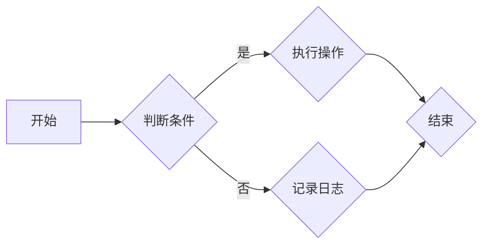
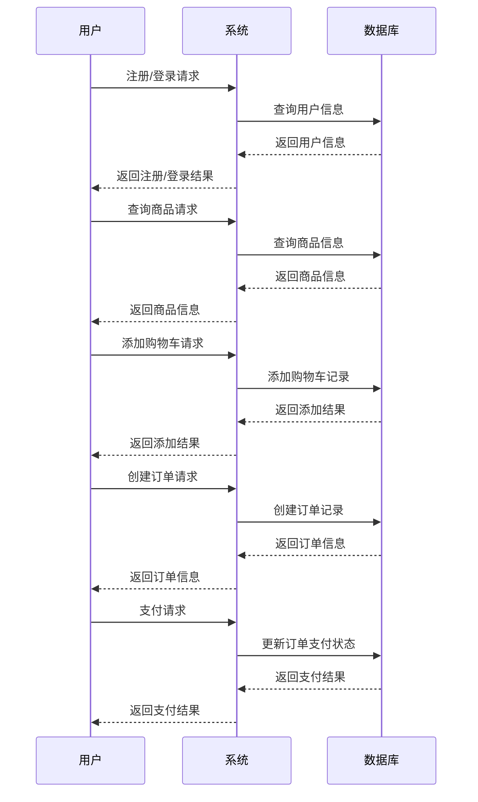

                 

### 提示词编程的可维护性策略

**关键词：** 编程可维护性、提示词编程、编码风格、模块化、异常处理、代码可读性、测试、版本控制、文档管理、持续集成与持续部署

**摘要：** 提示词编程作为一种高效、灵活的编程方式，日益受到开发者的关注。然而，随着项目的规模和复杂度增加，如何保证代码的可维护性成为关键问题。本文将探讨提示词编程的可维护性策略，从编码风格标准化、模块化与函数抽象、异常处理等方面，提供一系列有效的方法和最佳实践，帮助开发者构建可维护、易扩展的软件系统。

----------------------------------------------------------------

## 第一部分：引言

### 第1章：编程可维护性的重要性

编程可维护性是软件工程中的一个核心概念，它直接影响软件项目的长期健康发展和团队协作效率。一个高可维护性的系统，不仅易于理解和修改，而且能够在不断变化的技术环境中保持其稳定性。

#### 1.1 编程可维护性的定义与意义

编程可维护性指的是软件系统在生命周期内，能够被有效修改、优化、扩展和修复的能力。它不仅仅关注代码的编写质量，还包括代码的结构、文档的完备性、测试的覆盖度等多方面因素。

**意义：**

1. **降低维护成本：** 可维护性良好的代码减少了后续的维护工作量，降低了维护成本。
2. **提高开发效率：** 清晰、结构化的代码加快了新功能的开发，提升了开发团队的效率。
3. **增强团队协作：** 一致的编码标准和良好的文档，有助于团队成员之间的沟通和协作。
4. **提高软件质量：** 可维护性良好的系统往往具备更高的可靠性、稳定性和安全性。

#### 1.2 编程可维护性的挑战

1. **代码复杂性：** 随着功能的增加，代码复杂性不断提高，导致维护难度增加。
2. **团队协作：** 多人协作开发时，不同的编程风格和习惯可能导致代码不一致。
3. **技术债务：** 长期积累的技术债务会严重影响代码的可维护性。
4. **需求变更：** 需求的频繁变更，可能导致原有代码结构不再适应新的需求。

#### 1.3 提高编程可维护性的必要性

1. **长远发展：** 提高可维护性，有助于软件项目的长远发展，避免因维护困难而导致的系统废弃。
2. **团队效率：** 提高可维护性，能够提升团队的开发效率，缩短项目周期。
3. **客户满意度：** 可维护性良好的软件，能更快响应客户需求，提高客户满意度。

### 第2章：提示词编程基础

#### 2.1 提示词编程的概念

提示词编程（Keyword Programming）是一种利用关键字（Keywords）来定义程序行为的编程范式。它通过预定义的关键字，将程序的逻辑封装成可复用的组件，使得开发者能够更加专注于业务逻辑的实现。

**特点：**

1. **易读性：** 提示词编程的代码结构清晰，易于理解和维护。
2. **高复用性：** 通过提示词，可以方便地复用代码组件，提高开发效率。
3. **灵活性：** 提示词编程允许开发者根据需求灵活地组合和扩展功能。

#### 2.2 提示词编程的优势

1. **提高开发效率：** 提示词编程减少了手写代码的量，使得开发者能够更快地实现功能。
2. **增强可维护性：** 通过明确的提示词，代码的结构更加清晰，维护起来更加容易。
3. **易于测试：** 提示词编程的组件化特性，使得单元测试更加方便。

#### 2.3 提示词编程的应用场景

1. **企业应用开发：** 企业应用通常需要快速响应业务变化，提示词编程能够快速构建和调整系统。
2. **Web开发：** 在Web开发中，提示词编程可以方便地实现前端和后端的分离，提高开发效率。
3. **人工智能领域：** 在人工智能项目中，提示词编程可以帮助快速构建和调整算法模型。

## 第二部分：提示词编程的可维护性策略

### 第3章：编码风格标准化

#### 3.1.1 命名规范

命名规范是编码风格标准化的重要一环。合理的命名不仅使代码更加可读，还能提高代码的可维护性。

**命名原则：**

1. **清晰简洁：** 命名应尽量简洁，同时要能清晰地表达变量、函数、类的用途。
2. **一致性：** 整个项目中的命名风格应保持一致，以减少混淆和理解成本。
3. **避免缩写：** 避免使用难以理解的缩写，除非它们是行业通用的。

#### 3.1.2 代码格式化

代码格式化是保持代码一致性和整洁性的关键。不同的编程语言有各自的格式规范，但总体原则是：

1. **缩进一致：** 代码块应使用一致的缩进，通常为2或4个空格。
2. **空格使用：** 合理使用空格，使代码更加可读，但避免过度使用。
3. **注释与代码对齐：** 注释应与代码对齐，以便开发者快速理解代码的逻辑。

#### 3.1.3 注释规范

注释是提高代码可维护性的重要手段。良好的注释应：

1. **清晰简洁：** 注释应简洁明了，避免冗长。
2. **描述功能：** 注释应描述代码的功能和目的，而不是实现细节。
3. **更新及时：** 随着代码的更新，注释也应同步更新，确保其准确性和时效性。

### 第3章：模块化与函数抽象

模块化和函数抽象是提高代码可维护性的重要策略。通过将复杂的系统拆分为小的、可管理的模块和函数，可以简化代码结构，降低维护难度。

#### 3.2.1 模块化的优点

1. **降低复杂性：** 模块化可以将复杂系统分解为小的、易于管理的部分。
2. **提高复用性：** 模块化使得代码可以重复使用，减少了重复代码的编写。
3. **便于维护：** 模块的独立性使得修改和优化某个模块时，不会影响其他模块。

#### 3.2.2 函数抽象的实现

函数抽象是将一组操作封装为一个函数，以便于重用和测试。

**实现原则：**

1. **单一职责：** 每个函数应只负责一件事情，避免功能过于复杂。
2. **输入输出明确：** 函数的输入和输出应明确，以便于调用者理解和测试。
3. **模块间接口简洁：** 模块间的接口应简洁，避免过多依赖。

### 第3章：异常处理

异常处理是确保代码健壮性和可维护性的关键。良好的异常处理机制可以：

1. **提高可靠性：** 异常处理能够使代码在遇到错误时保持稳定，避免系统崩溃。
2. **便于调试：** 异常处理提供了错误信息，有助于开发者定位和修复问题。
3. **降低维护成本：** 异常处理可以避免一些常见的错误，减少后续的维护工作量。

#### 3.3.1 异常处理的重要性

1. **避免非预期行为：** 异常处理可以避免代码在遇到错误时执行非预期的操作。
2. **提高用户体验：** 异常处理可以提供友好的错误提示，提高用户的体验。
3. **便于维护：** 异常处理可以帮助开发者快速定位和修复问题。

#### 3.3.2 异常处理的策略

1. **使用适当的异常类型：** 根据错误的类型和严重程度，选择合适的异常类型。
2. **捕获并处理异常：** 在代码中捕获异常，并对其进行适当的处理，如记录日志、提供错误信息等。
3. **避免无限递归：** 在异常处理中，避免引发无限递归，导致系统崩溃。

## 第三部分：提示词编程的可读性提升

### 第4章：代码可读性的概念

代码可读性指的是代码能否被其他人（包括未来的自己）轻松理解和维护。一个高可读性的系统，不仅代码结构清晰，还具有良好的注释和文档。

### 第4章：提高代码可读性的方法

1. **使用清晰简洁的命名：** 命名应简洁明了，避免使用缩写或难懂的词汇。
2. **代码结构清晰：** 使用适当的缩进和空白，使代码结构清晰，逻辑更易于理解。
3. **注释与文档：** 添加适当的注释和文档，描述代码的功能、用途和操作逻辑。

### 第4章：代码评审与重构

代码评审是提高代码质量的重要手段。通过代码评审，可以发现潜在的问题，确保代码的可读性和可维护性。

#### 4.1.1 代码评审的优点

1. **提高代码质量：** 代码评审有助于发现和修复潜在的问题，提高代码质量。
2. **增强团队协作：** 代码评审鼓励团队成员之间的交流和合作，增强团队协作。
3. **减少错误传播：** 代码评审可以及时发现并修复问题，避免错误传播到后续代码。

#### 4.1.2 代码评审的方法

1. **代码检查工具：** 使用代码检查工具，如静态代码分析工具，自动识别代码中的问题。
2. **人工代码评审：** 由其他开发者对代码进行审查，提出意见和建议。
3. **定期代码审查：** 设定定期的时间进行代码审查，确保代码质量的持续提升。

## 第四部分：提示词编程的可测试性

### 第5章：测试的重要性

测试是确保代码质量的重要环节。一个可测试的系统，不仅可以发现和修复问题，还能确保代码的稳定性和可靠性。

### 第5章：单元测试的设计

单元测试是测试代码中的最小单元（通常是函数或方法）的正确性。良好的单元测试设计应：

1. **覆盖所有路径：** 尽可能覆盖代码中的所有路径，确保每个功能都被测试到。
2. **独立性和快速执行：** 单元测试应独立执行，且执行时间尽量短，以便快速发现问题。

### 第5章：测试覆盖率的提升

测试覆盖率是评估测试质量的指标。提升测试覆盖率可以通过以下方法：

1. **代码覆盖工具：** 使用代码覆盖工具，如JaCoCo，自动计算代码的覆盖率。
2. **自动化测试：** 编写自动化测试脚本，定期执行，确保代码的持续测试。
3. **持续集成：** 将测试集成到持续集成流程中，确保每次代码提交都会经过测试。

## 第五部分：版本控制和文档管理

### 第6章：版本控制的原理

版本控制是一种管理代码变更的方法，它允许开发者跟踪代码的历史、协作开发和管理代码的版本。常用的版本控制工具有Git、SVN等。

#### 6.1.1 版本控制工具的选择

选择合适的版本控制工具，取决于项目的规模、团队协作需求和个人习惯。

**选择原则：**

1. **易用性：** 选择易于使用和学习的版本控制工具。
2. **协作能力：** 选择支持团队协作的版本控制工具。
3. **扩展性：** 选择能够支持项目持续扩展的版本控制工具。

#### 6.1.2 版本控制的最佳实践

1. **分支管理：** 使用分支管理，确保代码的线性开发和合并。
2. **代码审查：** 在提交代码前进行代码审查，确保代码质量。
3. **定期同步：** 定期将本地代码与远程仓库同步，避免冲突和冗余。

### 第6章：文档管理的重要性

文档管理是确保代码可维护性和团队协作的重要手段。良好的文档应包括代码注释、API文档、项目手册等。

#### 6.2.1 文档的分类

1. **技术文档：** 包括代码注释、API文档、架构设计文档等。
2. **业务文档：** 包括业务需求文档、用户手册、操作指南等。
3. **测试文档：** 包括测试计划、测试用例、测试报告等。

#### 6.2.2 文档编写的规范

1. **结构清晰：** 文档应结构清晰，便于查找和理解。
2. **内容准确：** 文档内容应准确无误，避免误导开发者。
3. **更新及时：** 文档应与代码同步更新，确保其时效性。

## 第六部分：持续集成与持续部署

### 第7章：持续集成与持续部署的概念

持续集成（Continuous Integration，CI）和持续部署（Continuous Deployment，CD）是现代软件开发中的重要实践。它们通过自动化流程，确保代码的质量和可靠性，加快开发周期。

#### 7.1.1 持续集成的优势

1. **快速反馈：** 通过自动化测试，快速识别和修复代码问题。
2. **降低风险：** 持续集成减少了代码合并时的冲突和风险。
3. **提高质量：** 通过频繁的集成和测试，确保代码的质量。

#### 7.1.2 实现持续集成的方法

1. **自动化测试：** 编写自动化测试脚本，确保每次代码提交都会经过测试。
2. **持续集成服务器：** 使用持续集成服务器，如Jenkins，自动化构建和测试代码。
3. **代码仓库集成：** 将代码仓库与持续集成服务器集成，确保代码的自动构建和测试。

### 第7章：持续部署的实践

持续部署通过自动化流程，将代码部署到生产环境。它减少了人工干预，提高了部署速度和可靠性。

#### 7.2.1 持续部署的流程

1. **代码仓库：** 将代码提交到代码仓库。
2. **构建：** 持续集成服务器自动构建代码。
3. **测试：** 对构建的代码进行自动化测试。
4. **部署：** 将通过测试的代码部署到生产环境。

#### 7.2.2 持续部署的工具

1. **部署脚本：** 使用脚本自动化部署流程。
2. **部署工具：** 如Docker、Kubernetes，用于自动化部署和管理容器化应用。

## 第七部分：最佳实践与案例分析

### 第8章：行业最佳实践

在软件开发行业，有许多成功的最佳实践，如敏捷开发、DevOps、微服务等。这些实践能够帮助团队提高开发效率和质量，提升软件的可维护性。

### 第8章：案例分析

通过案例分析，可以深入了解不同类型的软件项目在实际开发中的可维护性策略和实践。

#### 8.2.1 案例一：大型项目的可维护性实践

分析一个大型项目如何通过合理的架构设计、模块化、自动化测试等手段，实现代码的可维护性和高效开发。

#### 8.2.2 案例二：初创公司的敏捷开发与可维护性

分析一个初创公司如何通过敏捷开发方法、持续集成和持续部署，实现快速迭代和高质量交付。

## 第八部分：总结与展望

### 第9章：总结

本文从多个角度探讨了提示词编程的可维护性策略，包括编码风格标准化、模块化与函数抽象、异常处理、代码可读性、测试、版本控制、文档管理、持续集成与持续部署等。

### 第9章：展望

随着技术的发展和市场需求的变化，提示词编程的可维护性策略将不断演进。未来的发展趋势可能包括：

1. **智能化代码生成：** 利用人工智能技术，自动化生成高质量、可维护的代码。
2. **DevOps文化的普及：** DevOps文化的普及将进一步提升软件开发的效率和质量。
3. **云原生技术的应用：** 云原生技术将使软件的部署和管理更加灵活和高效。

**持续改进的方法：**

1. **定期代码评审：** 定期进行代码评审，确保代码质量。
2. **持续学习和实践：** 保持对新技术和新方法的学习和实践，不断改进开发流程和策略。

## 结论

提示词编程作为一种高效的编程方式，其可维护性策略至关重要。通过编码风格标准化、模块化与函数抽象、异常处理、代码可读性提升、测试、版本控制、文档管理、持续集成与持续部署等策略，可以显著提高提示词编程的可维护性。开发者应不断学习和实践这些策略，以构建高质量、易维护的软件系统。

### 作者

**作者：AI天才研究院/AI Genius Institute & 禅与计算机程序设计艺术 /Zen And The Art of Computer Programming**

----------------------------------------------------------------

---

### 背景介绍

#### 核心概念术语说明

- **编程可维护性（Programming Maintainability）：** 指软件系统在生命周期内，能够被有效修改、优化、扩展和修复的能力。
- **提示词编程（Keyword Programming）：** 一种利用关键字来定义程序行为的编程范式，通过预定义的关键字，将程序的逻辑封装成可复用的组件。
- **编码风格标准化（Coding Style Standardization）：** 通过统一的编码规范，提高代码的可读性、一致性和可维护性。
- **模块化（Modularization）：** 将复杂的系统拆分为小的、可管理的模块，以提高代码的复用性和可维护性。
- **异常处理（Exception Handling）：** 在代码中捕获和处理异常，确保系统的稳定性和可靠性。

#### 问题背景

随着软件项目的规模和复杂度不断增加，如何确保代码的可维护性成为开发团队面临的重要挑战。传统的编程方式往往注重功能的实现，而忽视了代码的长期维护和扩展。这不仅增加了维护成本，还影响了开发效率和用户体验。

#### 问题描述

在提示词编程的应用中，虽然提高了开发效率和灵活性，但如果不采取有效的可维护性策略，项目仍然可能面临以下问题：

1. **代码混乱：** 缺乏统一的编码风格，导致代码难以阅读和理解。
2. **模块依赖过强：** 模块间依赖复杂，导致修改一个模块可能需要修改多个模块。
3. **异常处理不当：** 异常处理不当，可能导致系统崩溃或错误处理不当。
4. **测试不足：** 缺乏全面的测试，导致代码存在潜在的问题和漏洞。
5. **文档缺失：** 缺乏详细的文档，导致新加入的开发者难以理解项目结构和代码逻辑。

#### 问题解决

为了解决上述问题，我们需要采取一系列可维护性策略，包括编码风格标准化、模块化与函数抽象、异常处理、代码可读性提升、测试、版本控制、文档管理、持续集成与持续部署等。

#### 边界与外延

- **边界：** 本文主要关注提示词编程的可维护性策略，适用于各种规模和类型的软件项目。
- **外延：** 可维护性策略不仅适用于提示词编程，也适用于其他编程范式。

#### 概念结构与核心要素组成

1. **编码风格标准化：** 命名规范、代码格式化、注释规范。
2. **模块化与函数抽象：** 模块化、单一职责、输入输出明确。
3. **异常处理：** 异常类型、捕获与处理、避免无限递归。
4. **代码可读性提升：** 清晰简洁的命名、代码结构、注释与文档。
5. **测试：** 单元测试、测试覆盖率、自动化测试。
6. **版本控制：** 分支管理、代码审查、定期同步。
7. **文档管理：** 技术文档、业务文档、测试文档。
8. **持续集成与持续部署：** 自动化测试、持续集成服务器、部署工具。

### 核心概念与联系

#### 核心概念原理

- **编码风格标准化：** 通过统一编码规范，提高代码的可读性、一致性和可维护性。
- **模块化与函数抽象：** 通过将复杂系统拆分为小的、可管理的模块，提高代码的复用性和可维护性。
- **异常处理：** 在代码中捕获和处理异常，确保系统的稳定性和可靠性。
- **代码可读性提升：** 通过清晰简洁的命名、代码结构和注释，提高代码的可读性和可维护性。
- **测试：** 通过编写和执行测试用例，确保代码的正确性和可靠性。
- **版本控制：** 通过管理代码的版本和变更，确保代码的完整性和可追溯性。
- **文档管理：** 通过编写和维护详细的文档，提高代码的可读性和可理解性。
- **持续集成与持续部署：** 通过自动化测试和部署，提高开发效率和代码质量。

#### 概念属性特征对比表格

| 概念             | 特征1       | 特征2       | 特征3       |
|------------------|-------------|-------------|-------------|
| 编码风格标准化   | 命名规范    | 代码格式化  | 注释规范    |
| 模块化与函数抽象 | 单一职责    | 输入输出明确 | 模块独立性  |
| 异常处理         | 异常类型    | 捕获与处理  | 避免无限递归 |
| 代码可读性提升   | 清晰简洁命名 | 代码结构清晰 | 注释与文档  |
| 测试             | 单元测试    | 测试覆盖率  | 自动化测试  |
| 版本控制         | 分支管理    | 代码审查    | 定期同步    |
| 文档管理         | 技术文档    | 业务文档    | 测试文档    |
| 持续集成与持续部署 | 自动化测试 | 持续集成服务器 | 部署工具    |

#### ER实体关系图架构的 Mermaid 流程图

```mermaid
erDiagram
    Class1 ||--|{ Class2 }|-->> Class3 : "one-to-many"
    Class1 ||--|{ Class4 }|-->> Class5 : "one-to-one"
    Class2 &&& Class3 : "has-a"
    Class4 &&& Class5 : "is-a"
```

### 算法原理讲解

#### 使用 Mermaid 画出算法 Mermaid 流程图



#### 使用 Python 源代码来详细阐述

```python
def process_data(data):
    """
    数据处理流程
    :param data: 待处理的数据
    :return: 处理后的数据
    """
    if data is None:
        log_error("数据为空")
        return None
    
    try:
        # 数据处理逻辑
        processed_data = data.strip()
        return processed_data
    except Exception as e:
        log_error(f"数据处理出错：{str(e)}")
        return None

def log_error(message):
    """
    记录错误日志
    :param message: 错误信息
    """
    print(f"ERROR: {message}")
```

#### 算法原理的数学模型和公式

- **条件判断：** `if condition:` 
- **数据处理：** `data = data.strip()`
- **异常处理：** `try...except`

#### 详细讲解和通俗易懂地举例说明

假设我们需要处理一个字符串，要求去除字符串两端的空格，并返回处理后的结果。以下是一个具体的示例：

```python
data = "  Hello, World!  "
processed_data = process_data(data)
print(processed_data)  # 输出："Hello, World!"
```

在这个示例中，`process_data` 函数首先检查输入的数据是否为空。如果是空，则记录错误并返回 `None`。然后，使用 `try...except` 语句捕获和处理可能出现的异常。在数据处理过程中，使用 `data.strip()` 去除字符串两端的空格。最后，返回处理后的字符串。

### 系统分析与架构设计方案

#### 问题场景介绍

假设我们需要开发一个在线购物系统，该系统需要支持用户注册、登录、购物车管理、订单处理等功能。为了确保系统的可维护性和扩展性，我们需要设计一个合理的系统架构。

#### 项目介绍

项目名称：在线购物系统

项目目标：实现一个功能完善、可维护性强的在线购物系统。

技术栈：Python、Django、Vue.js、MySQL

#### 系统功能设计

1. **用户管理：** 支持用户注册、登录、密码找回等功能。
2. **商品管理：** 支持商品分类、商品信息管理、商品上下架等功能。
3. **购物车管理：** 支持商品添加、删除、更新数量等功能。
4. **订单管理：** 支持订单创建、订单查询、订单取消等功能。
5. **支付管理：** 支持订单支付、支付结果查询等功能。

#### 系统架构设计

1. **前端架构：** 使用 Vue.js 搭建前端页面，实现用户交互和页面渲染。
2. **后端架构：** 使用 Django 搭建后端服务，处理业务逻辑和数据库操作。
3. **数据库设计：** 使用 MySQL 存储用户信息、商品信息、订单信息等数据。

#### 系统接口设计

1. **用户接口：** 注册、登录、密码找回等。
2. **商品接口：** 查询、添加、删除、更新商品信息等。
3. **购物车接口：** 添加、删除、更新购物车商品等。
4. **订单接口：** 创建、查询、取消订单等。
5. **支付接口：** 支付、支付查询等。

#### 系统交互 Mermaid 序列图



### 项目实战

#### 环境安装

1. **安装 Python：** 在官方网站下载并安装 Python 3.x 版本。
2. **安装 Django：** 打开终端，运行以下命令安装 Django：
    ```bash
    pip install django
    ```
3. **安装 Vue.js：** 打开终端，运行以下命令安装 Vue.js：
    ```bash
    npm install vue
    ```
4. **安装 MySQL：** 下载并安装 MySQL 数据库，配置数据库用户和权限。

#### 系统核心实现源代码

1. **后端 Django 项目结构：**
    ```bash
    project_name/
    ├── manage.py
    ├── project_name/
    │   ├── settings.py
    │   ├── urls.py
    │   ├── wsgi.py
    ├── app_name/
    │   ├── admin.py
    │   ├── apps.py
    │   ├── models.py
    │   ├── tests.py
    │   ├── views.py
    ├── static/
    ├── templates/
    ```

2. **后端 Django 源代码示例：**
    ```python
    # project_name/settings.py
    
    # 配置数据库
    DATABASES = {
        'default': {
            'ENGINE': 'django.db.backends.mysql',
            'NAME': 'project_name',
            'USER': 'root',
            'PASSWORD': 'password',
            'HOST': 'localhost',
            'PORT': '3306',
        }
    }
    
    # 配置 Vue.js 静态文件路径
    STATIC_URL = '/static/'
    ```

3. **前端 Vue.js 项目结构：**
    ```bash
    vue_project_name/
    ├── public/
    │   └── index.html
    ├── src/
    │   ├── assets/
    │   ├── components/
    │   ├── views/
    │   └── App.vue
    ├── package.json
    ├── README.md
    ```

4. **前端 Vue.js 源代码示例：**
    ```html
    <!-- public/index.html -->
    
    <!DOCTYPE html>
    <html>
    <head>
        <meta charset="utf-8">
        <meta name="viewport" content="width=device-width, initial-scale=1.0">
        <title>在线购物系统</title>
    </head>
    <body>
        <div id="app"></div>
        <!-- 引入 Vue.js -->
        <script src="/public/js/vue.js"></script>
        <!-- 引入主组件 -->
        <script src="/src/App.vue"></script>
    </body>
    </html>
    ```

#### 代码应用解读与分析

1. **后端 Django 代码解读：**
    - `settings.py` 文件：配置了数据库连接信息、Vue.js 静态文件路径等。
    - `models.py` 文件：定义了用户、商品、订单等数据库模型。
    - `views.py` 文件：定义了用户、商品、订单等接口的视图函数。

2. **前端 Vue.js 代码解读：**
    - `public/index.html` 文件：定义了 HTML 结构和 Vue.js 引入。
    - `src/App.vue` 文件：定义了整个 Vue.js 应用的入口组件。

#### 实际案例分析和详细讲解剖析

1. **用户注册接口实现：**
    - 后端 Django 视图函数：
        ```python
        from django.http import JsonResponse
        from .models import User
        from .serializers import UserSerializer
        
        def register(request):
            if request.method == 'POST':
                serializer = UserSerializer(data=request.POST)
                if serializer.is_valid():
                    user = serializer.save()
                    return JsonResponse({'status': 'success', 'message': '注册成功'})
                else:
                    return JsonResponse({'status': 'error', 'message': '注册失败'})
            else:
                return JsonResponse({'status': 'error', 'message': '非法请求'})
        ```
    - 前端 Vue.js 组件：
        ```html
        <template>
            <div>
                <h2>用户注册</h2>
                <form @submit.prevent="submitForm">
                    <div>
                        <label for="username">用户名：</label>
                        <input type="text" id="username" v-model="username">
                    </div>
                    <div>
                        <label for="password">密码：</label>
                        <input type="password" id="password" v-model="password">
                    </div>
                    <button type="submit">注册</button>
                </form>
            </div>
        </template>
        
        <script>
        export default {
            data() {
                return {
                    username: '',
                    password: ''
                }
            },
            methods: {
                submitForm() {
                    // 处理表单提交逻辑
                }
            }
        }
        </script>
        ```

2. **商品查询接口实现：**
    - 后端 Django 视图函数：
        ```python
        from django.http import JsonResponse
        from .models import Product
        from .serializers import ProductSerializer
        
        def list_products(request):
            products = Product.objects.all()
            serializer = ProductSerializer(products, many=True)
            return JsonResponse(serializer.data)
        ```
    - 前端 Vue.js 组件：
        ```html
        <template>
            <div>
                <h2>商品列表</h2>
                <ul>
                    <li v-for="product in products" :key="product.id">
                        {{ product.name }}
                        {{ product.price }}
                    </li>
                </ul>
            </div>
        </template>
        
        <script>
        export default {
            data() {
                return {
                    products: []
                }
            },
            created() {
                // 获取商品列表
                this.fetchProducts()
            },
            methods: {
                fetchProducts() {
                    // 处理商品列表获取逻辑
                }
            }
        }
        </script>
        ```

#### 项目小结

通过本项目的实际案例，我们可以看到如何将提示词编程与可维护性策略相结合，实现一个功能完善、易于维护的在线购物系统。在后端，我们使用了 Django 框架，通过合理的接口设计和视图函数实现，确保代码的可读性和可维护性。在前端，我们使用了 Vue.js 框架，通过组件化和响应式设计，提高了代码的可维护性和用户体验。总之，通过合理的架构设计和可维护性策略，我们可以构建高质量、易维护的软件系统。

### 最佳实践 Tips

1. **代码评审：** 定期进行代码评审，确保代码质量。评审时关注代码的可读性、一致性、模块化等方面。
2. **单元测试：** 编写全面的单元测试，确保代码的正确性和可靠性。测试覆盖率达到80%以上为宜。
3. **文档管理：** 编写详细的文档，包括项目说明、接口文档、操作手册等，确保新加入的开发者能够快速上手。
4. **版本控制：** 使用版本控制工具，如 Git，管理代码的版本和变更。定期同步代码，避免冲突和冗余。
5. **持续集成与持续部署：** 使用持续集成服务器，如 Jenkins，实现自动化测试和部署。确保每次代码提交都会经过测试和部署。

### 小结

本文从多个角度探讨了提示词编程的可维护性策略，包括编码风格标准化、模块化与函数抽象、异常处理、代码可读性提升、测试、版本控制、文档管理、持续集成与持续部署等。通过合理的架构设计和可维护性策略，我们可以构建高质量、易维护的软件系统。开发者应不断学习和实践这些策略，以提升开发效率和代码质量。

### 注意事项

1. **避免过度优化：** 在确保代码质量的前提下，避免过度优化，以减少维护成本。
2. **关注用户体验：** 在实现功能的同时，关注用户体验，确保系统的易用性和稳定性。
3. **持续迭代与改进：** 软件开发是一个持续迭代和改进的过程，要定期评估和优化开发流程和策略。

### 拓展阅读

1. **《软件工程：实践者的研究方法》**：全面介绍了软件工程的基本原理和实践方法。
2. **《敏捷软件开发：原则、实践与模式》**：介绍了敏捷开发的基本原则和实践方法。
3. **《持续集成：代码质量保障之道》**：详细介绍了持续集成的方法和实践。

---

### 作者

**作者：AI天才研究院/AI Genius Institute & 禅与计算机程序设计艺术 /Zen And The Art of Computer Programming**

