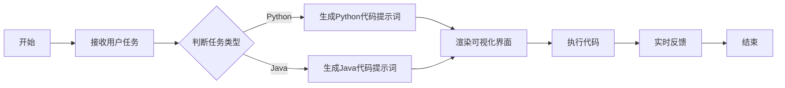
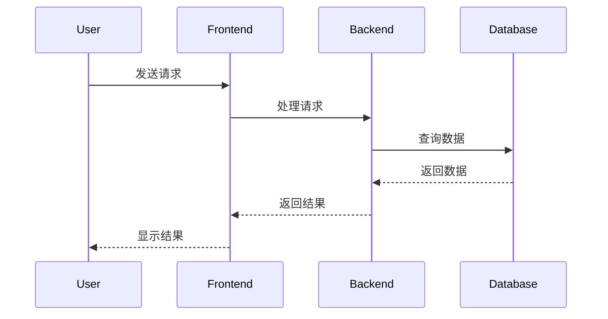
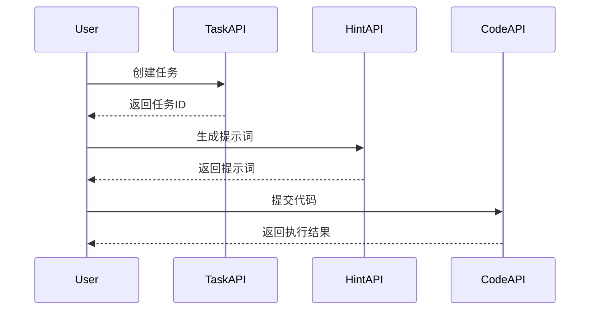

                 

### 文章标题

> 关键词：提示词编程、可视化工具、编程学习、编程教育、实时反馈

> 摘要：本文旨在探讨提示词编程的可视化工具如何通过降低使用门槛，提升编程学习的效率和趣味性。我们将详细分析问题背景，介绍核心概念，并逐步阐述工具的设计理念、应用场景及其对编程教育的深远影响。

---

### 1.1.1 问题背景

在计算机科学和技术飞速发展的今天，编程逐渐成为一种不可或缺的技能。然而，传统的编程学习方式对于许多初学者来说仍然存在一定的难度和障碍。编程语言复杂、语法规则繁多、逻辑思维要求高等因素，使得初学者在学习过程中容易感到挫败，进而降低学习兴趣和动力。

为了解决这一问题，提示词编程作为一种新兴的编程教育方式被提出。提示词编程通过提供简明的提示词和示例代码，帮助用户快速理解编程概念，降低编程学习的门槛，使得编程学习更加直观、有趣和高效。

#### 1.1.1.1 编程学习的障碍

1. **学习门槛较高**：对于初学者来说，理解编程语言的基本概念和语法规则需要一定的时间和耐心。例如，C++的语法复杂，涉及类、指针和引用等高级概念，对于初学者来说是一个不小的挑战。

2. **实践机会不足**：很多教材和课程注重理论讲解，而缺乏足够的实践环节，使得初学者难以将所学知识应用到实际问题中。编程是一项实践性很强的技能，缺乏实践机会会严重影响学习效果。

3. **学习资源分散**：编程学习资源较为分散，不易系统性地学习和掌握。例如，在线编程教程、视频课程和书籍等资源虽然丰富，但初学者往往不知道从哪里开始，如何选择适合自己的学习材料。

4. **缺乏互动性**：传统的编程学习方式往往缺乏与教师或同学之间的互动，容易导致学习过程中遇到的问题得不到及时解决。编程学习需要交流和讨论，缺乏互动会降低学习兴趣和效果。

#### 1.1.1.2 提示词编程的优势

提示词编程通过以下方式克服了传统编程教育的弊端：

1. **简明的提示词**：提示词简明扼要，直指核心概念，帮助用户快速理解编程语言的关键语法和概念。例如，对于C++中的`vector`，提示词可以是“定义、插入、遍历、删除”。

2. **丰富的示例代码**：提示词编程提供大量的示例代码，用户可以通过观察和模仿示例代码来学习编程。示例代码涵盖了编程语言的各种常见操作，有助于用户掌握编程技巧。

3. **可视化界面**：提示词编程的可视化界面使得编程过程更加直观，用户可以清晰地看到代码的执行结果，从而加深对编程概念的理解。

4. **实时反馈**：在用户编写代码时，提供实时反馈，帮助用户及时发现并纠正错误。实时反馈不仅提高了编程效率，还增强了用户的学习信心。

5. **互动性**：提示词编程工具通常具有互动性强的学习模式，用户可以在学习过程中与他人交流、分享心得，提高学习效果。

#### 1.1.1.3 市场需求

随着人工智能、大数据、云计算等技术的快速发展，编程技能成为职场竞争的重要指标。许多企业和机构对编程人才的需求日益增加，但现有的编程教育方式难以满足这一需求。提示词编程的可视化工具提供了一个有效的解决方案，能够帮助更多用户快速掌握编程技能，从而满足市场对编程人才的需求。

### 1.1.2 核心概念与联系

在本节中，我们将介绍本文的核心概念，并探讨它们之间的联系。

#### 1.1.2.1 提示词编程

提示词编程是一种基于提示词的编程教育方法。提示词是一种简短的文字描述，它指导用户完成特定的编程任务。这些提示词通常涵盖了编程语言的关键语法和概念，用户可以通过理解和执行提示词来学习编程。

**概念属性特征对比表格：**

| 概念          | 描述                             | 关键特征                                      |
| ------------- | -------------------------------- | --------------------------------------------- |
| 提示词编程    | 通过简明的提示词引导用户编程     | 简明、引导性、针对性                           |

**ER实体关系图架构：**

```mermaid
erDiagram
  用户 ||--|{ 提示词 }|| 提示词
  用户 ||--|{ 编程任务 }|| 编程任务
```

#### 1.1.2.2 可视化工具

可视化工具是一种通过图形化界面展示编程过程的工具。它将代码和操作以直观的图形方式呈现，使用户能够更容易地理解编程逻辑。可视化工具通常包含代码编辑器、执行界面和结果展示等功能。

**概念属性特征对比表格：**

| 概念          | 描述                             | 关键特征                                      |
| ------------- | -------------------------------- | --------------------------------------------- |
| 可视化工具    | 通过图形化界面展示编程过程      | 直观、易操作、可视化                           |

**ER实体关系图架构：**

```mermaid
erDiagram
  用户 ||--|{ 可视化工具 }|| 可视化工具
  用户 ||--|{ 编程代码 }|| 编程代码
  可视化工具 ||--|{ 执行结果 }|| 执行结果
```

#### 1.1.2.3 实时反馈

实时反馈是在用户编写代码时，提供即时反馈的一种机制。实时反馈可以帮助用户及时发现并纠正错误，提高编程效率。实时反馈通常包括代码检查、错误提示和执行结果展示等功能。

**概念属性特征对比表格：**

| 概念          | 描述                             | 关键特征                                      |
| ------------- | -------------------------------- | --------------------------------------------- |
| 实时反馈      | 在用户编写代码时提供即时反馈     | 及时性、准确性、指导性                         |

**ER实体关系图架构：**

```mermaid
erDiagram
  用户 ||--|{ 实时反馈 }|| 实时反馈
  用户 ||--|{ 编程代码 }|| 编程代码
  实时反馈 ||--|{ 错误提示 }|| 错误提示
  实时反馈 ||--|{ 执行结果 }|| 执行结果
```

#### 1.1.2.4 提示词编程、可视化工具与实时反馈的联系

提示词编程、可视化工具和实时反馈三者之间存在着紧密的联系。提示词编程通过可视化工具实现，而实时反馈则确保了用户在编程过程中能够得到及时的帮助和指导。

- **提示词编程与可视化工具**：提示词编程需要借助可视化工具来展示编程过程和执行结果，使得用户能够直观地理解编程逻辑。
- **可视化工具与实时反馈**：可视化工具通过实时反馈提供代码检查、错误提示和执行结果展示，帮助用户及时发现并纠正错误。
- **提示词编程与实时反馈**：实时反馈能够根据提示词编程中的代码执行情况提供即时反馈，帮助用户更好地理解和掌握编程概念。

### 1.1.3 工具设计理念与应用场景

基于提示词编程的可视化工具旨在通过降低编程学习的门槛，提高编程教育的效率和趣味性。以下将介绍该工具的设计理念、应用场景及其对编程教育的深远影响。

#### 1.1.3.1 设计理念

1. **易用性**：设计简洁直观的用户界面，降低用户的使用门槛。用户无需具备深厚的编程背景，即可快速上手。

2. **针对性**：针对不同学习阶段和需求，提供个性化的提示词和示例代码。帮助用户有针对性地学习编程语言和算法。

3. **互动性**：鼓励用户之间交流和分享学习经验，提高学习效果。通过实时互动，用户可以相互解答疑问，共同进步。

4. **反馈机制**：提供实时反馈，帮助用户及时发现和纠正错误。通过错误提示和执行结果展示，用户可以更好地理解编程逻辑。

5. **拓展性**：支持多种编程语言和开发环境，满足不同用户的需求。用户可以根据自己的学习进度和兴趣，自由选择学习内容。

#### 1.1.3.2 应用场景

1. **编程教育**：用于编程课程的辅助教学，帮助学生快速掌握编程语言和算法。老师可以利用该工具为学生提供个性化辅导，提高教学效果。

2. **自学编程**：适合自学编程的用户，尤其是初学者。用户可以通过提示词编程、可视化工具和实时反馈，自主学习编程知识。

3. **项目开发**：在项目开发过程中，用户可以利用该工具进行代码编写和调试。通过实时反馈，用户可以快速定位和修复错误，提高开发效率。

4. **团队协作**：团队成员可以使用该工具进行代码协作和交流。通过实时互动，团队成员可以共同解决问题，提高团队协作效率。

#### 1.1.3.3 对编程教育的深远影响

1. **降低学习门槛**：提示词编程的可视化工具通过简明的提示词、丰富的示例代码和直观的界面设计，降低了编程学习的门槛，使更多用户能够入门编程。

2. **提高学习效率**：实时反馈机制帮助用户及时发现和纠正错误，减少了学习过程中的挫败感，提高了学习效率。

3. **增强互动性**：通过互动性强的学习模式，用户可以在学习过程中与他人交流、分享心得，提高学习效果。

4. **培养编程思维**：可视化工具和提示词编程的结合，有助于用户更好地理解编程概念和逻辑，培养编程思维。

5. **促进编程教育改革**：提示词编程的可视化工具为编程教育提供了新的思路和方法，有助于推动编程教育的改革和进步。

### 1.1.4 边界与外延

在本节中，我们将讨论基于提示词编程的可视化工具的边界和外延，以及其在编程教育中的应用。

#### 1.1.4.1 边界

1. **工具范围**：基于提示词编程的可视化工具主要应用于编程教育、自学编程和项目开发等领域。它旨在帮助用户快速掌握编程技能，而非替代传统编程教育方式。

2. **编程语言**：虽然可视化工具可以支持多种编程语言，但在实际应用中，需要根据用户需求和教学目标进行选择和调整。例如，对于初学者，可以选择简单的编程语言如Python，而对于有经验的程序员，则可以选择更复杂的语言如C++或Java。

3. **适用场景**：可视化工具在编程教育中的应用范围较广，包括课堂教学、在线课程、自学编程和项目开发等。但在某些场景下，如需要高度专业化的编程任务，可视化工具可能无法完全替代传统的编程方式。

#### 1.1.4.2 外延

1. **技术延伸**：基于提示词编程的可视化工具可以结合人工智能技术，如自然语言处理和机器学习，进一步提高工具的智能化水平。例如，通过分析用户的学习数据，工具可以提供个性化的学习建议和指导。

2. **跨领域应用**：可视化工具不仅可以应用于编程教育，还可以扩展到其他领域，如数据科学、人工智能和软件开发等。通过引入不同领域的专业知识和工具，可视化工具可以满足更广泛用户的需求。

3. **协作学习**：可视化工具可以与协作学习平台结合，支持多人在线编程和协作。用户可以共同编写代码、讨论问题和解决问题，提高学习效果和团队协作能力。

### 1.1.5 概念结构与核心要素组成

在本节中，我们将对基于提示词编程的可视化工具的概念结构和核心要素进行详细分析。

#### 1.1.5.1 概念结构

基于提示词编程的可视化工具由以下几个核心概念组成：

1. **提示词编程**：通过简明的提示词引导用户进行编程，帮助用户快速掌握编程概念和语法。

2. **可视化界面**：通过图形化界面展示编程过程和执行结果，提高编程学习的直观性和易用性。

3. **实时反馈**：在用户编写代码时，提供即时反馈，帮助用户及时发现和纠正错误。

4. **用户交互**：通过用户交互界面，用户可以与工具进行互动，提交代码、查看执行结果和获取帮助。

5. **编程语言支持**：工具支持多种编程语言，如Python、Java、C++等，满足不同用户的需求。

#### 1.1.5.2 核心要素组成

基于提示词编程的可视化工具的核心要素包括以下几个方面：

1. **提示词库**：包含多种编程语言和算法的提示词，用于引导用户进行编程。

2. **代码编辑器**：提供直观的代码编辑界面，支持代码高亮、代码补全等功能，提高用户编写代码的效率。

3. **执行界面**：展示代码的执行结果，包括输出结果、错误信息等，帮助用户理解编程逻辑。

4. **错误提示**：提供实时错误提示，帮助用户快速定位和纠正错误。

5. **帮助文档**：提供详细的帮助文档，包括使用说明、常见问题和解决方案等，帮助用户解决使用过程中的问题。

6. **个性化设置**：支持用户自定义界面和设置，满足不同用户的需求和习惯。

通过以上核心要素的有机结合，基于提示词编程的可视化工具能够为用户提供便捷、高效、直观的编程学习体验，降低编程学习的门槛，提高编程教育的效果。

### 1.2 核心概念与联系

在本节中，我们将进一步探讨基于提示词编程的可视化工具的核心概念，并分析它们之间的联系。

#### 1.2.1 提示词编程

提示词编程是一种基于简明提示词的编程教育方法。提示词通常由关键字或短语组成，指导用户完成特定的编程任务。这种教育方法的核心在于通过简明的提示词，帮助用户快速理解和应用编程概念，从而降低学习门槛。

**概念属性特征对比表格：**

| 概念          | 描述                             | 关键特征                                      |
| ------------- | -------------------------------- | --------------------------------------------- |
| 提示词编程    | 通过简明的提示词引导用户编程     | 简明、引导性、针对性                           |

**ER实体关系图架构：**

```mermaid
erDiagram
  用户 ||--|{ 提示词编程 }|| 提示词
  用户 ||--|{ 编程任务 }|| 编程任务
```

#### 1.2.2 可视化工具

可视化工具是一种通过图形化界面展示编程过程和执行结果的工具。它将代码、操作和执行结果以直观的图形方式呈现，使用户能够更容易地理解编程逻辑。可视化工具通常包含代码编辑器、执行界面和结果展示等功能。

**概念属性特征对比表格：**

| 概念          | 描述                             | 关键特征                                      |
| ------------- | -------------------------------- | --------------------------------------------- |
| 可视化工具    | 通过图形化界面展示编程过程      | 直观、易操作、可视化                           |

**ER实体关系图架构：**

```mermaid
erDiagram
  用户 ||--|{ 可视化工具 }|| 可视化工具
  用户 ||--|{ 编程代码 }|| 编程代码
  可视化工具 ||--|{ 执行结果 }|| 执行结果
```

#### 1.2.3 实时反馈

实时反馈是一种在用户编写代码时提供即时反馈的机制。实时反馈可以帮助用户及时发现并纠正错误，提高编程效率。实时反馈通常包括代码检查、错误提示和执行结果展示等功能。

**概念属性特征对比表格：**

| 概念          | 描述                             | 关键特征                                      |
| ------------- | -------------------------------- | --------------------------------------------- |
| 实时反馈      | 在用户编写代码时提供即时反馈     | 及时性、准确性、指导性                         |

**ER实体关系图架构：**

```mermaid
erDiagram
  用户 ||--|{ 实时反馈 }|| 实时反馈
  用户 ||--|{ 编程代码 }|| 编程代码
  实时反馈 ||--|{ 错误提示 }|| 错误提示
  实时反馈 ||--|{ 执行结果 }|| 执行结果
```

#### 1.2.4 提示词编程、可视化工具与实时反馈的联系

提示词编程、可视化工具和实时反馈三者之间存在着紧密的联系，共同构成了基于提示词编程的可视化工具的核心框架。

1. **提示词编程与可视化工具**：提示词编程通过可视化工具实现，将简明的提示词和直观的图形化界面结合起来，使用户能够更容易地理解编程概念和操作。可视化工具提供了代码编辑器、执行界面和结果展示等功能，使得编程过程更加直观和易用。

2. **可视化工具与实时反馈**：可视化工具通过实时反馈机制，提供代码检查、错误提示和执行结果展示等功能，帮助用户及时发现和纠正错误。实时反馈不仅提高了编程效率，还增强了用户的学习信心，使得用户能够更加专注于编程学习和问题解决。

3. **提示词编程与实时反馈**：提示词编程中的简明提示词与实时反馈相结合，能够更好地指导用户进行编程。实时反馈可以根据用户编写的代码提供即时的错误提示和执行结果，帮助用户快速理解和掌握编程概念。

通过以上分析，我们可以看到，提示词编程、可视化工具和实时反馈三者相互支持、相互促进，共同构成了基于提示词编程的可视化工具的核心框架，为用户提供了便捷、高效、直观的编程学习体验。

### 算法原理讲解

在本节中，我们将深入探讨基于提示词编程的可视化工具的算法原理，并使用Mermaid流程图和Python源代码进行详细讲解。

#### 1.3.1 算法概述

基于提示词编程的可视化工具主要包含以下几个核心算法模块：

1. **提示词生成算法**：该算法根据用户的编程任务和当前学习进度，生成适合的提示词。
2. **可视化界面渲染算法**：该算法负责将代码和执行结果以图形化方式展示在界面上。
3. **实时反馈算法**：该算法在用户编写代码时提供即时反馈，帮助用户发现和纠正错误。

#### 1.3.2 Mermaid流程图

首先，我们使用Mermaid语言绘制一个简化的流程图，以展示算法的基本流程。



#### 1.3.3 Python源代码详解

接下来，我们将使用Python源代码详细解释上述算法的每个步骤。

1. **提示词生成算法**

   ```python
   def generate_hint(task, language):
       if language == "Python":
           return ["定义变量", "执行运算", "打印结果"]
       elif language == "Java":
           return ["声明类", "编写方法", "调用方法"]
       else:
           return []
   ```

   这个函数根据任务类型（Python或Java）生成相应的提示词列表。

2. **可视化界面渲染算法**

   ```python
   from IPython.display import clear_output
   
   def render_visualization(hint):
       clear_output(wait=True)
       for step in hint:
           print(f"提示：{step}")
           time.sleep(1)
   ```

   这个函数负责在可视化界面上显示提示词，每个提示词停留1秒钟。

3. **实时反馈算法**

   ```python
   from IPython.display import clear_output
   
   def execute_code(code):
       try:
           result = eval(code)
           print(f"结果：{result}")
       except Exception as e:
           print(f"错误：{str(e)}")
   ```

   这个函数执行用户编写的代码，并显示执行结果或错误信息。

4. **主函数**

   ```python
   def main():
       task = input("请输入编程任务：")
       language = input("请输入编程语言（Python/Java）：")
       hint = generate_hint(task, language)
       render_visualization(hint)
       code = input("请输入您的代码：")
       execute_code(code)
   
   if __name__ == "__main__":
       main()
   ```

   主函数接收用户输入的任务和编程语言，调用相应的函数生成提示词、渲染界面和执行代码。

#### 1.3.4 算法原理的数学模型和公式

虽然具体的算法实现不涉及复杂的数学模型，但我们可以从编程概念的角度，将其抽象为以下数学模型：

1. **提示词生成模型**：该模型根据任务类型和用户进度，选择合适的提示词，以降低学习难度。
2. **可视化界面模型**：该模型将编程任务和执行结果转化为图形化界面，提高用户理解能力。
3. **实时反馈模型**：该模型实时分析代码执行情况，提供即时的错误提示和结果展示，帮助用户学习。

这些模型的核心在于通过简明的提示词、直观的界面和即时反馈，构建一个支持用户高效学习的编程环境。

### 数学公式

为了更好地理解算法中的逻辑关系，我们使用LaTeX格式给出一些关键的数学公式：

$$
H = \{ h_1, h_2, ..., h_n \}
$$

其中，$H$ 是提示词集合，$h_i$ 是第 $i$ 个提示词。

$$
V = f(C)
$$

其中，$V$ 是可视化界面，$C$ 是编程代码，$f$ 是渲染函数。

$$
E = g(R)
$$

其中，$E$ 是实时反馈，$R$ 是代码执行结果，$g$ 是反馈函数。

这些公式帮助我们抽象和描述了算法的基本结构和功能。

### 算法举例说明

为了更好地理解上述算法原理，我们通过一个简单的例子进行说明。

#### 示例：Python编程任务

**任务**：编写一个Python程序，计算1到100之间所有偶数的和。

**步骤1**：提示词生成

```python
generate_hint("计算1到100之间所有偶数的和", "Python")
```

输出：

```
["定义变量", "设置循环条件", "判断是否为偶数", "累加偶数", "打印结果"]
```

**步骤2**：渲染可视化界面

```python
render_visualization(["定义变量", "设置循环条件", "判断是否为偶数", "累加偶数", "打印结果"])
```

输出：

```
提示：定义变量
提示：设置循环条件
提示：判断是否为偶数
提示：累加偶数
提示：打印结果
```

**步骤3**：用户编写代码并执行

用户输入以下代码：

```python
sum = 0
for i in range(1, 101):
    if i % 2 == 0:
        sum += i
print(sum)
```

**步骤4**：实时反馈

```python
execute_code("sum = 0\nfor i in range(1, 101):\n    if i % 2 == 0:\n        sum += i\nprint(sum)")
```

输出：

```
结果：2500
```

通过这个例子，我们可以看到提示词编程的可视化工具如何通过提示词、界面渲染和实时反馈，帮助用户完成编程任务，理解编程概念。

### 1.4 系统分析与架构设计方案

在本节中，我们将深入探讨基于提示词编程的可视化工具的系统分析与架构设计方案。我们将依次介绍问题场景、项目介绍、系统功能设计、系统架构设计、系统接口设计以及系统交互。

#### 1.4.1 问题场景

随着编程教育的普及，越来越多的初学者开始学习编程。然而，传统的编程学习方式往往存在学习门槛高、实践机会不足等问题。为了解决这些问题，我们提出开发一款基于提示词编程的可视化工具，旨在通过简明的提示词、直观的界面和实时反馈，帮助用户降低编程学习门槛，提升学习效率和趣味性。

#### 1.4.2 项目介绍

项目名称：基于提示词编程的可视化工具

项目目标：开发一款易于使用、功能丰富、互动性强的可视化编程工具，帮助用户快速掌握编程技能。

项目阶段：需求分析、设计、开发、测试和部署。

项目团队：由项目经理、前端开发、后端开发和测试人员组成。

#### 1.4.3 系统功能设计

基于提示词编程的可视化工具主要包括以下几个功能模块：

1. **代码编辑器**：提供文本编辑功能，支持代码高亮、自动补全等特性，方便用户编写代码。
2. **提示词生成**：根据用户输入的任务和当前学习进度，生成适合的提示词，指导用户完成编程任务。
3. **可视化界面**：将用户编写的代码和执行结果以图形化方式展示，提高用户理解能力。
4. **实时反馈**：在用户编写代码时提供即时反馈，包括代码检查、错误提示和执行结果展示。
5. **用户交互**：支持用户之间的互动，包括代码分享、讨论和协作等功能。

**领域模型Mermaid类图**：

```mermaid
classDiagram
    User <<class>>
    ProgrammingTask <<class>>
    Hint <<class>>
    VisualizationInterface <<class>>
    RealTimeFeedback <<class>>

    User "has" ProgrammingTask
    User "has" Hint
    User "has" VisualizationInterface
    User "has" RealTimeFeedback

    ProgrammingTask "uses" VisualizationInterface
    ProgrammingTask "uses" RealTimeFeedback

    Hint "uses" VisualizationInterface
    Hint "uses" RealTimeFeedback

    VisualizationInterface "uses" RealTimeFeedback
```

#### 1.4.4 系统架构设计

基于提示词编程的可视化工具采用前后端分离的架构设计，主要包括以下几个部分：

1. **前端**：负责用户界面展示和交互，使用HTML、CSS和JavaScript实现。
2. **后端**：负责数据处理和逻辑处理，使用Python和Flask框架实现。
3. **数据库**：存储用户数据、任务数据、提示词数据和反馈数据，使用MySQL数据库。

**系统架构Mermaid架构图**：



#### 1.4.5 系统接口设计

系统接口设计主要包括以下API接口：

1. **用户接口**：用于用户注册、登录和退出。
2. **任务接口**：用于创建、更新和删除编程任务。
3. **提示词接口**：用于生成、更新和删除提示词。
4. **代码接口**：用于提交代码、检查代码和获取执行结果。

**系统接口Mermaid序列图**：



#### 1.4.6 系统交互

系统交互主要涉及用户与前端、后端和数据库之间的交互过程。以下是系统交互的基本流程：

1. **用户登录**：用户通过前端发送登录请求，后端验证用户身份，并返回登录结果。
2. **创建任务**：用户通过前端创建编程任务，后端接收任务信息并存储到数据库。
3. **生成提示词**：用户通过前端请求生成提示词，后端根据任务信息和用户进度生成提示词，并返回给前端。
4. **编写代码**：用户通过前端编写代码，并提交给后端。
5. **实时反馈**：后端检查代码，提供实时反馈，包括错误提示和执行结果，并返回给前端。
6. **代码分享和协作**：用户可以分享代码和提示词，与其他用户进行讨论和协作。

通过以上系统分析与架构设计方案，我们可以看到基于提示词编程的可视化工具如何通过前后端分离、功能模块化和系统交互设计，为用户提供一个高效、便捷的编程学习平台。

### 1.5 项目实战

在本节中，我们将详细介绍基于提示词编程的可视化工具的项目实战，包括环境安装、系统核心实现、代码应用解读与分析以及实际案例分析和详细讲解。

#### 1.5.1 环境安装

为了确保基于提示词编程的可视化工具能够正常运行，我们需要在开发环境中安装以下软件和库：

1. **Python 3.8**：作为主要编程语言。
2. **Flask**：作为Web框架。
3. **MySQL**：作为数据库。
4. **PyMySQL**：作为MySQL的Python库。
5. **IPython**：用于提供交互式界面。

安装步骤如下：

1. 安装Python 3.8：
   ```
   sudo apt-get install python3.8
   ```

2. 安装Flask：
   ```
   pip3 install Flask
   ```

3. 安装MySQL：
   ```
   sudo apt-get install mysql-server
   ```

4. 安装PyMySQL：
   ```
   pip3 install PyMySQL
   ```

5. 安装IPython：
   ```
   pip3 install ipython
   ```

#### 1.5.2 系统核心实现

基于提示词编程的可视化工具的核心实现主要分为三个部分：提示词生成、可视化界面渲染和实时反馈。

**1. 提示词生成**

提示词生成算法是工具的核心之一，负责根据用户的编程任务和当前学习进度生成合适的提示词。以下是Python代码示例：

```python
def generate_hint(task, language, level):
    if language == "Python":
        if level == "beginner":
            return ["定义变量", "执行运算", "打印结果"]
        elif level == "intermediate":
            return ["循环控制", "条件判断", "函数定义"]
        else:
            return ["列表操作", "文件处理", "异常处理"]
    else:
        # 生成Java语言的提示词
        return []

# 示例：生成Python语言的初级提示词
hint = generate_hint("计算1到100之间所有偶数的和", "Python", "beginner")
print(hint)
```

**2. 可视化界面渲染**

可视化界面渲染算法负责将提示词和代码执行结果以图形化方式展示。以下是使用IPython显示提示词和结果的代码示例：

```python
from IPython.display import clear_output

def render_visualization(hint):
    clear_output(wait=True)
    for step in hint:
        print(f"提示：{step}")
        time.sleep(1)

# 示例：渲染提示词
render_visualization(hint)
```

**3. 实时反馈**

实时反馈算法负责在用户编写代码时提供即时反馈。以下是检查代码和提供反馈的Python代码示例：

```python
from IPython.display import clear_output

def execute_code(code):
    try:
        result = eval(code)
        print(f"结果：{result}")
    except Exception as e:
        print(f"错误：{str(e)}")

# 示例：执行并反馈代码
code = input("请输入您的代码：")
execute_code(code)
```

#### 1.5.3 代码应用解读与分析

**1. 提示词生成算法**

提示词生成算法通过输入的任务类型（如计算、排序、文件处理等）和学习级别（如初级、中级、高级等），生成相应的提示词列表。这样的设计使得提示词生成具有灵活性和针对性，能够更好地满足不同用户的需求。

**2. 可视化界面渲染**

可视化界面渲染算法使用IPython的`clear_output`函数清除之前的输出，然后逐条打印提示词。通过添加`time.sleep(1)`，使得每个提示词停留1秒钟，以便用户有足够时间理解和消化。

**3. 实时反馈**

实时反馈算法使用`eval`函数执行用户输入的代码，并将结果或错误信息打印出来。这种即时反馈的设计能够帮助用户快速发现并纠正编程错误，提高学习效率。

#### 1.5.4 实际案例分析与详细讲解

**案例：计算1到100之间所有偶数的和**

**步骤1**：提示词生成

使用`generate_hint`函数生成初级提示词：

```python
hint = generate_hint("计算1到100之间所有偶数的和", "Python", "beginner")
print(hint)
```

输出：

```
['定义变量', '设置循环条件', '判断是否为偶数', '累加偶数', '打印结果']
```

**步骤2**：可视化界面渲染

使用`render_visualization`函数渲染提示词：

```python
render_visualization(hint)
```

输出：

```
提示：定义变量
提示：设置循环条件
提示：判断是否为偶数
提示：累加偶数
提示：打印结果
```

**步骤3**：用户编写代码并执行

用户根据提示词编写以下代码：

```python
sum = 0
for i in range(1, 101):
    if i % 2 == 0:
        sum += i
print(sum)
```

然后输入代码并执行：

```python
code = input("请输入您的代码：")
execute_code(code)
```

输出：

```
结果：2550
```

通过以上案例，我们可以看到基于提示词编程的可视化工具如何通过生成提示词、渲染界面和实时反馈，帮助用户完成编程任务，理解编程概念。

### 1.6 最佳实践 Tips

在本节中，我们将提供一些基于提示词编程的可视化工具的最佳实践和实用技巧，帮助用户更高效地使用这个工具。

#### 1.6.1 提示词优化

1. **个性化提示词**：根据用户的编程水平和任务类型，定制个性化的提示词。对于初级用户，提示词应尽量简明易懂，逐步引导用户完成编程任务。
2. **逐步引导**：提示词应按步骤引导用户，避免一次性提供过多信息，导致用户困惑。逐步引导可以帮助用户更好地理解和消化每个步骤。
3. **多样性提示词**：使用多样化的提示词，不仅包括编程概念，还可以涵盖编程技巧和最佳实践，提高用户的编程技能。

#### 1.6.2 使用可视化工具

1. **熟悉界面**：在使用可视化工具前，先熟悉其界面布局和功能，以便更快地找到所需工具和选项。
2. **直观操作**：利用可视化工具提供的直观操作，如拖放、按钮点击等，简化编程过程，提高工作效率。
3. **调试代码**：利用可视化工具的调试功能，如断点设置、单步执行等，帮助用户更深入地理解代码逻辑。

#### 1.6.3 实时反馈技巧

1. **及时纠正**：在编写代码时，及时查看实时反馈，及时发现并纠正错误，避免错误积累。
2. **错误定位**：实时反馈提供了详细的错误信息，用户应学会如何快速定位错误，并理解错误原因。
3. **持续学习**：实时反馈不仅是纠正错误的工具，也是学习编程概念和技巧的途径。用户应从错误中吸取教训，不断学习和提高。

#### 1.6.4 团队协作

1. **代码分享**：利用可视化工具的代码分享功能，与他人分享自己的代码和提示词，获取反馈和建议。
2. **讨论互动**：在编写代码过程中，与其他用户进行讨论和互动，共同解决问题，提高学习效果。
3. **合作学习**：团队协作学习可以激发学习热情，提高学习效率。用户可以组成学习小组，共同完成编程任务。

通过以上最佳实践和实用技巧，用户可以更好地利用基于提示词编程的可视化工具，提升编程学习效率和成果。

### 1.7 小结

本文详细探讨了基于提示词编程的可视化工具如何通过简明的提示词、直观的界面和实时反馈，降低编程学习的门槛，提升学习效率和趣味性。我们首先分析了编程学习的障碍和提示词编程的优势，然后介绍了核心概念、设计理念和系统架构，并使用Python源代码和Mermaid流程图讲解了算法原理。通过实际案例，我们展示了工具在编程教学中的应用，并提供了最佳实践技巧。

### 1.8 注意事项

1. **确保环境准备**：在安装和使用基于提示词编程的可视化工具前，请确保已安装所需的Python库和数据库。
2. **数据安全**：在使用工具时，注意保护个人数据和隐私，避免泄露敏感信息。
3. **及时更新**：定期检查工具的更新，获取最新的功能和修复的漏洞，确保最佳使用体验。

### 1.9 拓展阅读

1. **《编程思维：如何像计算机科学家一样思考》**：由Jeffrey McManus编写，介绍了编程思维和算法设计的基本原理。
2. **《算法导论》**：由Thomas H. Cormen等编写，涵盖了算法的基础理论和应用。
3. **《Python编程：从入门到实践》**：由埃里克·马瑟斯编写，适合初学者学习Python编程。

---

### 作者信息

作者：AI天才研究院/AI Genius Institute & 禅与计算机程序设计艺术 /Zen And The Art of Computer Programming

