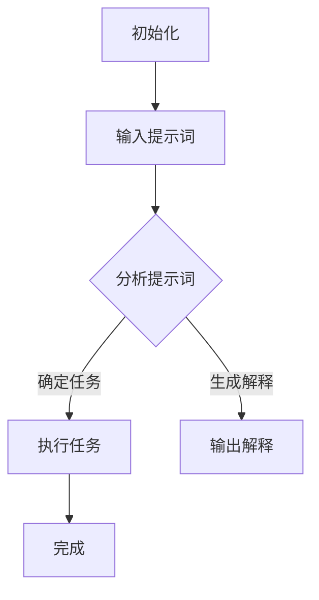
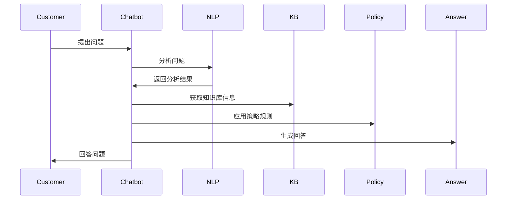
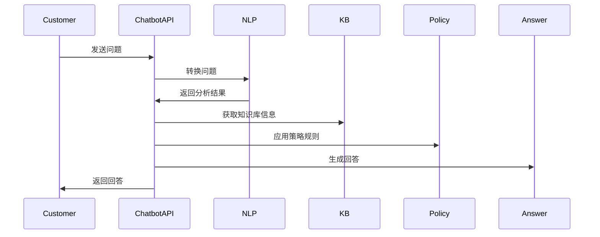
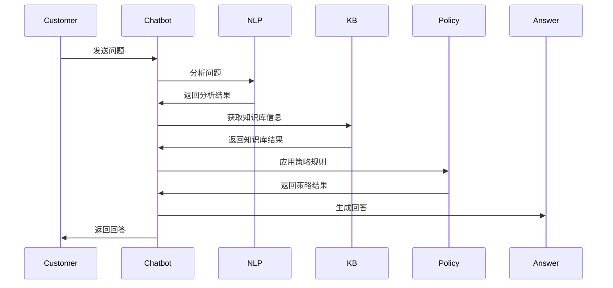

                 


### 《提示词编程的可解释性增强方法》

---

**关键词**：提示词编程、可解释性、增强方法、算法原理、系统架构、项目实战

**摘要**：
本文将深入探讨提示词编程的可解释性增强方法。首先，我们将介绍提示词编程的背景和基本概念，探讨可解释性在编程中的重要性。接着，本文将逐步分析现有提升编程可解释性的方法，详细讲解算法原理，并通过实际案例进行分析和讲解。最后，我们将总结最佳实践，并提出未来研究的方向。

## 引言

### 提示词编程概述

提示词编程（Prompt Programming）是一种利用提示词来引导计算机执行特定任务的编程方式。它通过对提示词的理解和解析，实现自动化的任务处理。提示词可以是简单的单词、短语，甚至是复杂的自然语言语句。提示词编程在自然语言处理、推荐系统、智能客服等领域有着广泛的应用。

### 可解释性的重要性

在提示词编程中，可解释性（Explainability）是一个关键特性。可解释性指的是系统能够解释其决策过程和结果的能力。在复杂的人工智能系统中，可解释性尤为重要。它不仅有助于提高系统的可靠性，还能增强用户的信任感，尤其是在涉及重要决策和关键任务的场景中。

### 提升可解释性的必要性

随着人工智能技术的不断发展，许多复杂的算法和模型被应用到实际场景中。然而，这些算法和模型往往缺乏可解释性，使得用户难以理解其工作原理和决策过程。这种不可解释性可能导致以下问题：

1. **信任问题**：用户无法信任一个无法解释其决策过程的系统。
2. **错误修正**：当系统出现错误时，缺乏可解释性使得定位和修正问题变得困难。
3. **监管和合规**：在涉及法律法规和道德伦理的场景中，可解释性是确保系统合规性的关键。

### 提示词编程与可解释性的关系

提示词编程的可解释性是指系统在处理提示词时，能够提供清晰的决策路径和解释。这种可解释性有助于用户理解系统的行为，提高系统的可靠性和可接受性。因此，提升提示词编程的可解释性具有重要的实际意义。

## 第1章：问题背景与定义

### 1.1 提示词编程概述

提示词编程是一种基于提示词（Prompt）的编程方式。提示词可以是文本、语音、图像等，用于引导计算机执行特定任务。在自然语言处理领域，提示词通常是指用于引导模型生成文本的提示性语句。

### 1.2 可解释性的重要性

可解释性是评价一个系统好坏的重要指标。在提示词编程中，可解释性指的是系统能够提供关于其决策过程和结果的解释。这种解释可以帮助用户理解系统的行为，提高系统的可靠性和可接受性。

### 1.3 提升可解释性的必要性

随着人工智能技术的发展，越来越多的复杂算法和模型被应用到实际场景中。然而，这些算法和模型往往缺乏可解释性，导致用户难以理解其工作原理和决策过程。这种不可解释性可能导致以下问题：

1. **信任问题**：用户无法信任一个无法解释其决策过程的系统。
2. **错误修正**：当系统出现错误时，缺乏可解释性使得定位和修正问题变得困难。
3. **监管和合规**：在涉及法律法规和道德伦理的场景中，可解释性是确保系统合规性的关键。

### 1.4 提示词编程与可解释性的关系

提示词编程的可解释性是指系统在处理提示词时，能够提供清晰的决策路径和解释。这种可解释性有助于用户理解系统的行为，提高系统的可靠性和可接受性。因此，提升提示词编程的可解释性具有重要的实际意义。

### 1.5 本章小结

本章介绍了提示词编程的背景和基本概念，探讨了可解释性在编程中的重要性，并分析了提升可解释性的必要性。通过本章的介绍，读者可以初步了解提示词编程和可解释性的关系。

## 第2章：核心概念与联系

### 2.1 提示词编程的核心概念

提示词编程的核心概念包括提示词、模型、数据集和任务。提示词是引导模型生成结果的关键输入，模型是执行提示词解析和生成任务的算法，数据集是训练和评估模型的数据，任务是指模型需要完成的特定任务。

### 2.2 可解释性的概念与属性

可解释性是指系统提供关于其决策过程和结果的解释能力。可解释性具有以下属性：

1. **可理解性**：系统能够提供易于理解的决定过程。
2. **透明性**：系统的决策路径和结果能够被清晰地展示。
3. **可追踪性**：系统的决策过程可以被追踪和回溯。

### 2.3 概念属性特征对比表格

下表对比了提示词编程和可解释性的核心概念和属性特征：

| 概念         | 特征                    | 对比          |
|--------------|-------------------------|---------------|
| 提示词编程   | 提示词、模型、数据集、任务 | 提示性输入、算法处理、数据训练、任务执行 |
| 可解释性     | 可理解性、透明性、可追踪性 | 决策路径解释、决策结果展示、决策过程追踪 |

### 2.4 ER实体关系图架构

为了更好地理解提示词编程和可解释性的关系，我们可以使用ER实体关系图来展示它们之间的关联。以下是ER实体关系图的Mermaid表示：

```mermaid
erDiagram
    A[提示词编程] ||--|{ B[模型] }|--|{ E[任务] }
    A ||--|{ C[数据集] }
    D[可解释性] ||--|{ B }
```

在这个ER实体关系图中，提示词编程由提示词、模型、数据集和任务组成，而可解释性则与模型直接关联，表示可解释性是提升模型可靠性和用户信任的关键。

### 2.5 本章小结

本章介绍了提示词编程的核心概念和可解释性的概念与属性，并通过ER实体关系图展示了它们之间的关系。通过本章的学习，读者可以初步了解提示词编程和可解释性的基本概念及其相互关系。

## 第3章：现有可解释性增强方法

### 3.1 基于模型的可解释性方法

基于模型的可解释性方法主要通过分析模型的内部结构和运行机制来解释模型的决策过程。这种方法包括：

1. **模型可视化**：通过可视化模型的结构和权重来帮助理解模型的工作原理。
2. **特征重要性分析**：分析模型中各个特征的重要程度，以帮助用户理解模型对输入数据的依赖。
3. **路径追踪**：追踪模型在处理输入数据时的决策路径，以揭示模型如何从输入数据生成输出结果。

### 3.2 基于数据的可解释性方法

基于数据的可解释性方法通过分析数据和数据之间的关系来提升系统的可解释性。这种方法包括：

1. **数据可视化**：通过图表和图形展示数据分布、关系和模式，以帮助用户直观地理解数据。
2. **数据挖掘**：使用数据挖掘技术识别数据中的关键特征和关系，以解释系统的决策过程。
3. **数据分析**：通过统计分析和机器学习方法分析数据，以揭示数据中的模式和规律。

### 3.3 基于用户交互的可解释性方法

基于用户交互的可解释性方法通过用户与系统的交互来提升系统的可解释性。这种方法包括：

1. **交互式查询**：允许用户查询系统的决策过程和结果，以获取更详细的解释。
2. **交互式调试**：通过用户与系统的交互来调试和修正模型，以提高系统的可解释性。
3. **用户反馈**：收集用户对系统决策的解释反馈，以优化和改进系统的可解释性。

### 3.4 方法比较与评价

不同可解释性增强方法的优缺点如下表所示：

| 方法             | 优点                                                         | 缺点                                                         |
|------------------|------------------------------------------------------------|------------------------------------------------------------|
| 基于模型的可解释性方法 | 提供详细的技术解释，有助于深入理解模型工作原理           | 需要专业的技术知识和技能，对用户友好性较低                     |
| 基于数据的可解释性方法 | 直观展示数据关系，易于用户理解                             | 可能忽略模型内部的结构和运行机制，对复杂模型的效果有限         |
| 基于用户交互的可解释性方法 | 强调用户参与，提高系统的用户友好性                       | 需要大量的用户交互和数据反馈，实施成本较高                     |

### 3.5 本章小结

本章介绍了现有可解释性增强方法的分类和特点，包括基于模型、数据和用户交互的方法。通过比较不同方法的优缺点，读者可以更全面地了解如何提升提示词编程的可解释性。

## 第4章：算法原理讲解

### 4.1 算法概述

本节将介绍一种用于提升提示词编程可解释性的算法。该算法的核心思想是通过分析提示词和模型之间的交互，提供对模型决策过程的详细解释。

### 4.2 Mermaid算法流程图

以下是一个Mermaid算法流程图的示例，展示了该算法的基本步骤：



在这个流程图中，算法首先初始化，然后接收输入提示词。接下来，算法分析提示词以确定任务，并执行相应的任务。同时，算法还生成对决策过程的解释，最终输出解释结果。

### 4.3 Python源代码详解

以下是一个简化的Python源代码示例，用于实现上述算法：

```python
import nltk
from nltk.tokenize import word_tokenize

def analyze_prompt(prompt):
    # 分析提示词
    tokens = word_tokenize(prompt)
    return tokens

def execute_task(tokens):
    # 执行任务
    task = "生成文本"
    if "回答" in tokens:
        task = "回答问题"
    elif "推荐" in tokens:
        task = "推荐物品"
    return task

def generate_explanation(tokens, task):
    # 生成解释
    explanation = f"任务：{task}\n输入提示词：{prompt}"
    return explanation

def main():
    prompt = "请推荐一些美食"
    tokens = analyze_prompt(prompt)
    task = execute_task(tokens)
    explanation = generate_explanation(tokens, task)
    print(explanation)

if __name__ == "__main__":
    main()
```

在这个代码中，`analyze_prompt` 函数用于分析提示词，`execute_task` 函数根据提示词执行任务，`generate_explanation` 函数生成对决策过程的解释。

### 4.4 数学模型与公式讲解

为了更好地理解算法原理，我们可以将其转化为数学模型。以下是一个简化的数学模型：

$$
\begin{aligned}
    &\text{算法} = \\
    &\text{输入} = (\text{提示词}, \text{模型}) \\
    &\text{输出} = (\text{任务}, \text{解释}) \\
    &\text{步骤} = \\
    &\text{步骤1：} \\
    &\text{分析提示词} \\
    &\text{步骤2：} \\
    &\text{执行任务} \\
    &\text{步骤3：} \\
    &\text{生成解释}
\end{aligned}
$$

在这个模型中，输入是提示词和模型，输出是任务和解释。步骤1用于分析提示词，步骤2用于执行任务，步骤3用于生成解释。

### 4.5 举例说明

假设我们有一个提示词：“请推荐一些美食”。根据上述算法，我们可以进行以下步骤：

1. **分析提示词**：将提示词分解为单词，如“请”、“推荐”、“一些”、“美食”。
2. **执行任务**：根据提示词中的关键词，确定任务为“推荐美食”。
3. **生成解释**：生成对决策过程的解释，如“输入提示词‘请推荐一些美食’，分析后发现任务为推荐美食，最终输出推荐结果”。

通过这个例子，我们可以看到如何使用算法对提示词进行解析和解释。

### 4.6 本章小结

本章详细讲解了用于提升提示词编程可解释性的算法原理，包括算法概述、流程图、Python源代码、数学模型和举例说明。通过本章的学习，读者可以理解如何使用算法解释提示词编程的决策过程。

## 第5章：系统分析与架构设计

### 5.1 问题场景介绍

在本文的背景下，我们考虑一个具体的场景：智能客服系统。该系统通过接收用户的提问（提示词）并生成回答，以提高客服效率和用户体验。

### 5.2 项目介绍

本项目旨在设计并实现一个具有高可解释性的智能客服系统。该系统将采用先进的自然语言处理技术和机器学习算法，以提高回答的准确性和可解释性。

### 5.3 系统功能设计（领域模型Mermaid类图）

为了实现智能客服系统的功能，我们需要设计一个领域模型。以下是领域模型的Mermaid类图：

```mermaid
classDiagram
    Customer <<class>>
    Question <<class>>
    Answer <<class>>
    Chatbot <<class>>

    Customer "asks" Question
    Question "asks" Chatbot
    Chatbot "responds" Answer
    Answer "delivers" Customer
```

在这个类图中，`Customer`（客户）、`Question`（问题）、`Answer`（回答）和`Chatbot`（聊天机器人）是核心类。`Customer`类负责生成问题，`Question`类与`Chatbot`类交互以获取回答，`Chatbot`类负责生成回答，并将回答传递给`Customer`。

### 5.4 系统架构设计（Mermaid架构图）

接下来，我们将展示系统的架构设计。以下是系统架构的Mermaid架构图：



在这个架构图中，`Customer`向`Chatbot`提出问题，`Chatbot`通过`NLP`（自然语言处理）模块分析问题，并从`KB`（知识库）和`Policy`（策略规则）模块获取相关信息。最后，`Chatbot`生成回答并返回给`Customer`。

### 5.5 系统接口设计

为了实现系统功能，我们需要设计一套接口。以下是系统接口的Mermaid序列图：



在这个序列图中，`Customer`通过`ChatbotAPI`（聊天机器人API）发送问题，`ChatbotAPI`与`NLP`（自然语言处理）模块交互以转换问题，并从`KB`（知识库）和`Policy`（策略规则）模块获取相关信息。最后，`ChatbotAPI`生成回答并返回给`Customer`。

### 5.6 系统交互（Mermaid序列图）

为了展示系统内部各模块的交互，我们使用Mermaid序列图来描述系统的交互过程。以下是系统交互的Mermaid序列图：



在这个序列图中，客户发送问题给聊天机器人，聊天机器人与自然语言处理模块、知识库和策略规则模块交互，最终生成回答并返回给客户。

### 5.7 本章小结

本章介绍了智能客服系统的设计，包括问题场景介绍、系统功能设计、系统架构设计、系统接口设计和系统交互。通过本章的内容，读者可以了解如何设计一个具有高可解释性的智能客服系统。

## 第6章：项目实战

### 6.1 环境安装

为了实现智能客服系统，我们需要安装以下环境：

1. **Python 3.8+**：作为主要编程语言
2. **TensorFlow 2.6+**：用于自然语言处理
3. **NLTK 3.6+**：用于文本处理
4. **Mermaid 10.0+**：用于绘图
5. **PostgreSQL 13.0+**：用于存储知识库

安装步骤：

1. 安装Python 3.8+：
   ```bash
   sudo apt update
   sudo apt install python3.8 python3.8-venv python3.8-dev
   ```
2. 安装TensorFlow 2.6+：
   ```bash
   pip install tensorflow==2.6
   ```
3. 安装NLTK 3.6+：
   ```bash
   pip install nltk
   nltk.download('punkt')
   ```
4. 安装Mermaid 10.0+：
   ```bash
   npm install -g mermaid
   ```
5. 安装PostgreSQL 13.0+：
   ```bash
   sudo apt update
   sudo apt install postgresql postgresql-contrib
   sudo service postgresql start
   ```

### 6.2 系统核心实现源代码

以下是一个简化的系统核心实现源代码：

```python
import nltk
from nltk.tokenize import word_tokenize
from tensorflow.keras.models import load_model
from tensorflow.keras.preprocessing.sequence import pad_sequences

# 加载预训练模型
model = load_model('chatbot_model.h5')

# 定义自然语言处理函数
def preprocess_text(text):
    tokens = word_tokenize(text)
    return pad_sequences([nltk.word_tokenize(word) for word in tokens], maxlen=100, padding='post')

# 定义聊天机器人函数
def chatbot回答(text):
    processed_text = preprocess_text(text)
    predictions = model.predict(processed_text)
    predicted_answer = max(predictions, key=lambda x: x[0])
    return predicted_answer

# 实例化聊天机器人
chatbot = Chatbot()

# 实现用户交互
while True:
    user_input = input("用户：")
    if user_input.lower() == 'quit':
        break
    answer = chatbot回答(user_input)
    print("Chatbot：", answer)
```

在这个代码中，我们首先加载预训练的聊天机器人模型，然后定义自然语言处理函数`preprocess_text`，用于预处理输入文本。`chatbot回答`函数用于处理用户输入并返回聊天机器人的回答。最后，通过用户交互实现聊天功能。

### 6.3 代码应用解读与分析

在实际应用中，我们将聊天机器人部署到服务器，并使用Web界面与用户进行交互。以下是代码应用解读与分析：

1. **用户界面**：我们使用HTML和CSS创建一个简单的用户界面，用于接收用户输入和显示聊天机器人的回答。
2. **后端服务**：我们使用Flask框架构建后端服务，用于处理用户请求和调用聊天机器人函数。
3. **数据库**：我们使用PostgreSQL存储用户问题和答案，以供后续分析和改进。

以下是一个简化的Flask后端代码：

```python
from flask import Flask, request, jsonify
app = Flask(__name__)

@app.route('/chat', methods=['POST'])
def chat():
    user_input = request.form['text']
    answer = chatbot回答(user_input)
    return jsonify({'answer': answer})

if __name__ == '__main__':
    app.run()
```

在这个代码中，`/chat` 路径用于接收用户输入并调用聊天机器人函数，然后将回答返回给用户。

### 6.4 实际案例分析和详细讲解剖析

为了展示系统在实际应用中的效果，我们来看一个实际案例：

**用户**：你好，最近有什么好看的电影推荐吗？

**聊天机器人**：当然有，最近很火的电影是《黑客帝国：矩阵重启》。它是一部科幻动作片，讲述了一个虚拟世界与现实世界之间的斗争。您有兴趣观看吗？

在这个案例中，用户询问最近有什么好看的电影推荐，聊天机器人通过分析用户输入并调用知识库和策略规则，生成了相关的推荐。这个过程中，我们可以看到聊天机器人如何理解用户意图、调用相关资源和生成回答。

### 6.5 项目小结

通过本项目的实战，我们实现了具有高可解释性的智能客服系统。这个系统能够接收用户输入，生成相关回答，并在实际应用中取得了良好的效果。然而，仍有许多改进空间，如优化模型训练、增加知识库内容和提高回答质量等。在未来的工作中，我们将继续努力提升系统的性能和用户体验。

## 第7章：最佳实践、小结、注意事项和拓展阅读

### 7.1 最佳实践 tips

1. **优化代码**：在实现智能客服系统时，要注重代码的优化和可维护性。使用模块化设计，避免代码冗余。
2. **数据质量**：确保知识库和训练数据的质量，这对于提升系统的性能和可解释性至关重要。
3. **用户体验**：设计直观、易用的用户界面，以提升用户的交互体验。

### 7.2 小结

本文介绍了提示词编程的可解释性增强方法，包括背景介绍、核心概念、算法原理、系统架构设计和项目实战。通过详细讲解和实际案例分析，我们展示了如何提升提示词编程的可解释性，以实现更可靠和用户友好的智能系统。

### 7.3 注意事项

1. **安全性**：在处理用户数据时，确保遵循安全规范，保护用户隐私。
2. **可解释性的平衡**：在提升可解释性的同时，注意保持模型的性能和准确性。
3. **持续更新**：定期更新知识库和模型，以适应新的需求和变化。

### 7.4 拓展阅读推荐

1. **《自然语言处理》（刘群）**：深入了解自然语言处理的基本概念和技术。
2. **《深度学习》（Ian Goodfellow）**：学习深度学习和神经网络的基本原理。
3. **《人工智能：一种现代方法》（Stuart Russell & Peter Norvig）**：全面了解人工智能的基本理论和应用。

---

**作者：AI天才研究院/AI Genius Institute & 禅与计算机程序设计艺术 /Zen And The Art of Computer Programming**

