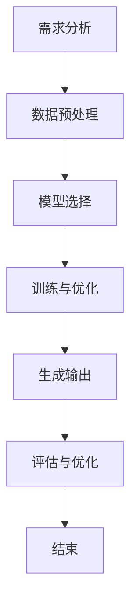

                 


## 第1章 问题背景与介绍

### 1.1 问题背景

随着计算机技术的迅猛发展，人工智能（AI）和机器学习（ML）领域取得了显著的进展。提示词编程（Prompt Engineering）作为人工智能的一种重要应用，正逐渐成为软件开发和数据处理中的关键方向。提示词编程的核心在于通过设计合理的提示词（prompts），引导模型生成更加准确、有用的输出结果。这不仅提升了模型性能，也为开发人员提供了强大的工具。

然而，随着提示词编程在各个行业中的应用日益广泛，团队协作在软件开发中的重要性愈发凸显。一个高效的团队协作模式对于项目成功至关重要。因此，如何将提示词编程与团队协作相结合，成为一个亟待研究的问题。

### 1.2 问题描述

在团队协作环境中，提示词编程面临的挑战主要包括：

1. **团队成员技能水平不均**：不同团队成员对于提示词编程的理解和应用能力存在差异，这可能导致团队内部协作不畅。
2. **沟通效率低下**：在团队协作中，如何确保每个成员都能准确理解任务要求和提示词的设计，是提高沟通效率的关键。
3. **代码质量和维护成本**：提示词编程代码的质量直接影响到项目的后续维护成本。如何在保证代码质量的同时提高开发效率，是一个重要的课题。
4. **项目管理与监控**：如何在项目开发过程中对提示词编程的进展进行有效监控，确保项目按时完成，也是团队协作中的一大挑战。

### 1.3 问题解决

为了解决上述问题，本研究将聚焦于以下几个方面：

1. **研究提示词编程的团队协作模式**：通过分析不同团队协作模式的特点，探讨如何在团队中有效应用提示词编程。
2. **分析成功案例与挑战**：研究实际应用中的成功案例，总结有效的团队协作实践，同时分析可能面临的挑战及解决方案。
3. **构建概念模型**：建立提示词编程和团队协作的概念模型，明确各核心要素及其相互关系。

### 1.4 边界与外延

本文的研究范围主要涵盖以下两个方面：

1. **提示词编程**：研究范围包括提示词编程的基本原理、应用场景和技术实现。
2. **团队协作模式**：研究范围涉及团队协作的沟通方式、分工合作和管理方法。

### 1.5 概念结构与核心要素组成

#### 提示词编程概念

提示词编程是指通过设计特定的提示词，引导模型生成所需输出结果的过程。它涉及以下几个方面：

1. **提示词设计**：设计合理的提示词是提示词编程的关键，需要充分考虑上下文、用户需求和输出目标。
2. **模型选择**：根据任务需求选择合适的模型，如生成对抗网络（GAN）、循环神经网络（RNN）等。
3. **训练与优化**：对模型进行训练和优化，以提高生成结果的准确性和质量。

#### 团队协作模式

团队协作模式是指团队成员在项目中如何进行沟通、分工合作和管理。常见的团队协作模式包括：

1. **瀑布模型**：严格按照项目生命周期进行，各阶段任务明确，适用于需求稳定的项目。
2. **敏捷开发**：注重迭代和反馈，适合快速变化的项目需求。
3. **看板管理**：通过看板可视化项目进度，提高团队协作效率。

#### 成功因素

成功应用提示词编程的团队需要具备以下因素：

1. **技术能力**：团队成员需具备一定的提示词编程技能和机器学习知识。
2. **沟通能力**：有效的沟通是团队协作的核心，确保每个成员都能准确理解任务和要求。
3. **团队文化**：建立积极的团队氛围，鼓励成员之间的合作和知识分享。

## 第2章 核心概念与联系

### 2.1 提示词编程原理

提示词编程的基本原理是通过设计合理的提示词，引导模型生成预期的输出结果。具体来说，它包括以下几个方面：

#### 2.1.1 基本概念

提示词（Prompt）：指用于引导模型生成输出的一系列文本或指令。提示词的设计需要充分考虑上下文、用户需求和输出目标。

模型（Model）：指用于生成输出结果的机器学习模型。常见的模型包括生成对抗网络（GAN）、循环神经网络（RNN）等。

生成（Generate）：指模型根据提示词生成输出结果的过程。

#### 2.1.2 工作流程

提示词编程的工作流程主要包括以下几个步骤：

1. **需求分析**：分析用户需求，确定输出目标。
2. **提示词设计**：根据需求设计合理的提示词。
3. **模型选择**：选择合适的模型进行训练。
4. **训练与优化**：对模型进行训练，并根据结果进行优化。
5. **生成输出**：使用训练好的模型生成输出结果。

### 2.2 提示词编程核心特点

#### 2.2.1 高效性

提示词编程通过设计合理的提示词，能够显著提高模型生成结果的准确性和效率。与传统的编程方式相比，提示词编程能够更快速地达到目标。

#### 2.2.2 灵活性

提示词编程具有高度的灵活性，可以根据不同的需求灵活调整提示词和模型，以适应不同的应用场景。这使得提示词编程在快速变化的项目环境中具有显著优势。

### 2.3 团队协作模式

#### 2.3.1 沟通方式

在团队协作中，沟通方式是确保任务顺利进行的关键。以下是一些常用的沟通方式：

1. **面对面会议**：面对面会议能够确保团队成员充分沟通，快速解决问题。
2. **在线聊天工具**：如Slack、Microsoft Teams等，方便团队成员随时沟通。
3. **邮件**：适用于正式的沟通，确保信息记录和追踪。

#### 2.3.2 分工合作

在团队协作中，分工合作是提高效率的重要手段。以下是一些常见的分工合作方式：

1. **功能分工**：根据项目需求，将任务划分为不同的功能模块，由不同成员负责。
2. **角色分工**：明确团队成员的角色和职责，确保每个成员都清楚自己的任务。
3. **交叉培训**：团队成员之间进行交叉培训，提高团队整体技能水平。

### 2.4 概念属性特征对比表格

| 概念 | 特点 |
| ---- | ---- |
| 提示词编程 | 高效性、灵活性 |
| 团队协作模式 | 沟通方式、分工合作 |

### 2.5 ER实体关系图架构

以下是一个简单的ER实体关系图，展示了提示词编程和团队协作模式之间的关联。

```mermaid
erDiagram
    Team ||--|{ Member } Member
    Member ||--|{ Task } Task
    Task ||--|{ Prompt } Prompt
    Prompt ||--|{ Model } Model
```

## 第3章 提示词编程算法原理

### 3.1 算法概述

提示词编程算法旨在通过设计合理的提示词，引导模型生成高质量的输出结果。算法的核心在于优化提示词和模型，以提高生成结果的准确性和效率。本文将介绍提示词编程的主要算法，包括其目的、分类和工作流程。

#### 3.1.1 算法目的

提示词编程算法的主要目的是：

1. 提高模型生成结果的准确性。
2. 增强模型的泛化能力，使其能够应对各种复杂场景。
3. 降低模型训练时间和计算成本。

#### 3.1.2 算法分类

根据应用场景和需求，提示词编程算法可以分为以下几类：

1. **生成对抗网络（GAN）**：通过生成器和判别器的对抗训练，实现高质量图像生成。
2. **变分自编码器（VAE）**：通过概率模型生成数据，具有较好的数据压缩和去噪能力。
3. **序列到序列（Seq2Seq）模型**：适用于文本翻译、机器翻译等序列生成任务。
4. **注意力机制（Attention）模型**：通过注意力机制聚焦关键信息，提高生成结果的精度。

#### 3.1.3 算法工作流程

提示词编程算法的工作流程通常包括以下步骤：

1. **需求分析**：确定输出目标和用户需求。
2. **数据预处理**：对输入数据进行预处理，包括数据清洗、归一化和数据增强等。
3. **模型选择**：根据需求选择合适的模型，并进行配置。
4. **训练与优化**：对模型进行训练，并根据训练结果进行优化。
5. **生成输出**：使用训练好的模型生成输出结果，并进行评估。

### 3.2 算法流程图

以下是一个简单的提示词编程算法流程图，展示了从需求分析到生成输出的整个过程。



### 3.3 Python源代码

以下是一个简单的Python代码示例，用于实现提示词编程算法的基本流程。

```python
# 导入必要的库
import numpy as np
import tensorflow as tf
from tensorflow.keras.models import Model
from tensorflow.keras.layers import Input, LSTM, Dense

# 数据预处理
# ...

# 模型配置
input_seq = Input(shape=(timesteps, features))
encoded_seq = LSTM(units=64, activation='relu')(input_seq)
decoded_seq = LSTM(units=64, activation='relu', return_sequences=True)(encoded_seq)
decoded_seq = LSTM(units=features, activation='sigmoid')(decoded_seq)

# 构建模型
model = Model(inputs=input_seq, outputs=decoded_seq)

# 编译模型
model.compile(optimizer='adam', loss='binary_crossentropy')

# 训练模型
# ...

# 生成输出
# ...

# 评估模型
# ...
```

### 3.4 算法原理讲解

提示词编程算法的核心在于优化提示词和模型，以提高生成结果的准确性和效率。下面将介绍提示词编程的数学模型和公式。

#### 3.4.1 数学模型

提示词编程的数学模型可以概括为：

1. **损失函数**：用于衡量模型生成结果与真实结果之间的差距。常见的损失函数包括均方误差（MSE）、交叉熵损失（Cross-Entropy Loss）等。
2. **优化器**：用于调整模型参数，以最小化损失函数。常见的优化器包括随机梯度下降（SGD）、Adam优化器等。

#### 3.4.2 公式讲解

以下是一个简单的提示词编程算法的数学模型：

1. **损失函数**：

   $$ Loss = \frac{1}{N} \sum_{i=1}^{N} \sum_{j=1}^{T} (y_{ij} - \hat{y}_{ij})^2 $$

   其中，$N$ 为样本数量，$T$ 为序列长度，$y_{ij}$ 为真实结果，$\hat{y}_{ij}$ 为模型生成结果。

2. **优化器**：

   $$ \theta_{\text{new}} = \theta_{\text{old}} - \alpha \nabla_{\theta} Loss $$

   其中，$\theta_{\text{old}}$ 为旧参数，$\theta_{\text{new}}$ 为新参数，$\alpha$ 为学习率，$\nabla_{\theta} Loss$ 为损失函数关于参数 $\theta$ 的梯度。

### 3.5 举例说明

为了更好地理解提示词编程算法，下面通过一个简单的例子进行说明。

#### 3.5.1 例子1：生成文本

假设我们需要生成一篇关于计算机编程的短文。我们可以设计一个简单的序列到序列（Seq2Seq）模型，使用预训练的语言模型（如GPT-2）作为生成器。

1. **需求分析**：确定生成一篇关于计算机编程的短文。
2. **数据预处理**：收集并预处理计算机编程领域的文本数据，包括清洗、分词和编码等。
3. **模型选择**：选择一个预训练的Seq2Seq模型，如GPT-2。
4. **训练与优化**：使用收集到的文本数据对模型进行训练，并根据训练结果进行优化。
5. **生成输出**：使用训练好的模型生成一篇关于计算机编程的短文。

生成的短文可能如下：

```
计算机编程是一种通过编写指令来控制计算机执行特定任务的过程。编程语言是用于编写计算机程序的符号系统，它包括变量、控制结构和函数等。计算机编程在当今社会具有广泛的应用，从软件开发到人工智能领域，都离不开编程。掌握编程技能是每个计算机科学家的必备能力。
```

#### 3.5.2 例子2：生成图像

假设我们需要生成一张人工智能领域的海报。我们可以设计一个生成对抗网络（GAN）模型，其中生成器负责生成图像，判别器负责区分真实图像和生成图像。

1. **需求分析**：确定生成一张人工智能领域的海报。
2. **数据预处理**：收集并预处理人工智能领域的图像数据，包括数据增强和归一化等。
3. **模型选择**：选择一个生成对抗网络（GAN）模型。
4. **训练与优化**：使用收集到的图像数据对模型进行训练，并根据训练结果进行优化。
5. **生成输出**：使用训练好的模型生成一张人工智能领域的海报。

生成的海报可能包含以下元素：

```
标题：人工智能的未来
副标题：探索未知，创造可能
图片：一位AI专家在实验室中研究新技术的场景
背景：高科技感的蓝色调，充满未来感
```

通过以上例子，我们可以看到提示词编程算法在文本生成和图像生成中的实际应用。这些例子展示了如何设计合理的提示词，引导模型生成高质量的输出结果。在团队协作中，通过合理的分工和有效的沟通，可以进一步提高提示词编程的效果。

## 第4章 团队协作模式实践

### 4.1 团队协作实践概述

在提示词编程的团队协作实践中，有效的沟通和分工合作是确保项目成功的关键。本文将介绍一些团队协作的实践方法，包括团队组建、沟通工具的使用以及如何应对挑战。

#### 4.1.1 团队组建

1. **明确项目目标和需求**：在组建团队之前，首先要明确项目的目标和需求，确保所有成员都对项目目标有清晰的认识。
2. **角色分工**：根据项目需求，明确每个团队成员的角色和职责，确保每个成员都有明确的任务和目标。
3. **技能匹配**：确保团队成员的技能和经验与项目需求相匹配，以便更好地完成各自的任务。

#### 4.1.2 沟通工具使用

1. **面对面会议**：面对面会议是确保团队成员充分沟通和快速解决问题的有效方式。在项目启动和关键节点，组织面对面会议，讨论项目进展和解决方案。
2. **在线聊天工具**：使用在线聊天工具（如Slack、Microsoft Teams等）可以方便团队成员随时沟通，分享信息和讨论问题。
3. **邮件**：邮件适用于正式的沟通，确保信息的记录和追踪。对于重要决策和项目文档，使用邮件进行通知和确认。

#### 4.1.3 应对挑战

1. **技能水平不均**：针对技能水平不均的问题，可以通过以下方式进行解决：
   - 定期进行技能培训，提高团队成员的技能水平。
   - 实施交叉培训，使团队成员了解其他成员的职责和工作内容，提高团队整体的协作能力。
2. **沟通效率低下**：提高沟通效率的方法包括：
   - 明确沟通目标和议程，确保会议有针对性地进行。
   - 使用可视化工具，如思维导图、图表等，帮助团队成员更好地理解和讨论问题。
3. **代码质量和维护成本**：为了提高代码质量和降低维护成本，可以采取以下措施：
   - 实施代码审查和代码质量检测工具，确保代码的规范性和可读性。
   - 使用版本控制系统，如Git，记录代码的修改历史，便于后续维护和追踪。

### 4.2 成功案例

以下是一个实际案例，展示了如何通过有效的团队协作实现提示词编程的成功。

#### 案例一：自动化文本生成系统

项目背景：某公司需要一个自动化文本生成系统，用于生成市场报告、客户邮件和产品文档等。

团队组建：项目团队由4名成员组成，包括1名项目经理、1名提示词编程专家、1名机器学习工程师和1名软件工程师。

团队协作实践：
1. **明确目标和需求**：项目目标是开发一个能够生成高质量文本的系统，需求包括文本生成速度、准确性和可定制性。
2. **角色分工**：
   - 项目经理：负责项目管理和协调。
   - 提示词编程专家：负责设计提示词和优化模型。
   - 机器学习工程师：负责模型训练和优化。
   - 软件工程师：负责系统开发和维护。
3. **沟通工具使用**：团队使用Slack进行日常沟通，每周进行一次面对面会议，讨论项目进展和解决方案。

挑战与解决方案：
1. **技能水平不均**：通过定期培训，团队成员的技能水平得到了提升。同时，通过交叉培训，团队成员互相了解其他职责，提高了协作效率。
2. **沟通效率低下**：通过明确沟通目标和议程，以及使用可视化工具，团队沟通效率显著提高。

项目成果：项目成功开发并上线了一个自动化文本生成系统，生成文本的质量和速度得到了客户的认可，有效降低了人工成本。

### 4.3 团队协作模式挑战与解决方案

在提示词编程的团队协作中，可能会面临以下挑战：

#### 挑战一：技能水平不均

**原因**：团队成员的技能水平差异可能导致协作效率低下，影响项目进度。

**解决方案**：
- **定期培训**：组织定期的技能培训，提高团队成员的技能水平。
- **交叉培训**：鼓励团队成员学习其他成员的职责，提高团队整体的协作能力。

#### 挑战二：沟通效率低下

**原因**：不清晰的沟通目标和议程可能导致会议效率低下，信息传递不畅通。

**解决方案**：
- **明确沟通目标和议程**：确保会议有针对性地进行，提前准备好讨论的议题和议程。
- **使用可视化工具**：使用图表、思维导图等可视化工具，帮助团队成员更好地理解和讨论问题。

通过有效的团队协作模式，提示词编程项目可以更好地应对挑战，实现高质量、高效率的成果。

## 第5章 项目实战

### 5.1 环境安装与配置

在开始项目实战之前，我们需要搭建一个适当的环境，以便进行提示词编程实验。以下是一个简化的环境安装与配置步骤：

#### 5.1.1 环境搭建

1. **操作系统**：选择一个适合的操作系统，如Ubuntu 20.04或Windows 10。
2. **Python**：安装Python 3.8及以上版本。可以使用Python官方安装器或使用包管理工具（如apt-get或yum）进行安装。
3. **TensorFlow**：TensorFlow是一个广泛使用的深度学习框架，安装TensorFlow可以通过以下命令：

   ```bash
   pip install tensorflow
   ```

4. **其他依赖库**：安装其他必要的依赖库，如NumPy、Pandas等：

   ```bash
   pip install numpy pandas
   ```

#### 5.1.2 配置说明

1. **虚拟环境**：为了保持项目环境的干净和隔离，建议使用虚拟环境（如conda或virtualenv）进行配置。

   - **使用conda创建虚拟环境**：

     ```bash
     conda create -n prompt_env python=3.8
     conda activate prompt_env
     ```

   - **使用virtualenv创建虚拟环境**：

     ```bash
     pip install virtualenv
     virtualenv prompt_env
     source prompt_env/bin/activate
     ```

2. **依赖库安装**：在虚拟环境中安装所需的依赖库，如TensorFlow、NumPy和Pandas。

   ```bash
   pip install tensorflow numpy pandas
   ```

3. **环境变量设置**：确保环境变量配置正确，以便在命令行中轻松调用Python和相关工具。

   - **Windows**：

     ```bash
     set PYTHONPATH=%PYTHONPATH%;path/to/prompt_env
     ```

   - **Linux**：

     ```bash
     export PYTHONPATH=$PYTHONPATH:path/to/prompt_env
     ```

通过以上步骤，我们可以搭建一个适合进行提示词编程实验的环境。接下来，我们将详细介绍系统核心实现和代码应用分析。

### 5.2 系统核心实现

在提示词编程项目中，系统核心实现是关键环节。以下是一个简化的系统架构，包括输入处理、模型训练和输出生成三个主要部分。

#### 5.2.1 输入处理

输入处理是系统的基础，负责将用户输入的提示词转化为适合模型训练的数据格式。以下是输入处理的简要步骤：

1. **数据收集**：收集用户输入的文本数据，包括提示词和对应的标签。
2. **文本预处理**：对文本进行清洗、分词和编码，以便后续处理。常用的预处理步骤包括：
   - 去除标点符号和特殊字符。
   - 转化为小写。
   - 去除停用词。
   - 词干还原或词形还原。
3. **序列化**：将预处理后的文本序列化为数值向量，可以使用嵌入（Embedding）层将单词映射为固定长度的向量。

   ```python
   from tensorflow.keras.preprocessing.sequence import pad_sequences
   from tensorflow.keras.preprocessing.text import Tokenizer

   tokenizer = Tokenizer(num_words=10000)
   tokenizer.fit_on_texts(prompt_texts)
   sequences = tokenizer.texts_to_sequences(prompt_texts)
   padded_sequences = pad_sequences(sequences, maxlen=max_sequence_length)
   ```

#### 5.2.2 模型训练

模型训练是系统核心，负责通过输入数据进行模型训练和优化。以下是模型训练的基本步骤：

1. **模型构建**：构建一个深度学习模型，可以选择不同的架构，如循环神经网络（RNN）、长短期记忆网络（LSTM）或变换器（Transformer）。
2. **训练数据准备**：将预处理后的输入数据和标签分成训练集和验证集。
3. **模型编译**：配置模型优化器和损失函数，如Adam优化器和交叉熵损失函数。
4. **模型训练**：使用训练数据进行模型训练，并监控验证集上的性能。

   ```python
   from tensorflow.keras.models import Sequential
   from tensorflow.keras.layers import Embedding, LSTM, Dense

   model = Sequential([
       Embedding(input_dim=num_words, output_dim=embedding_dim, input_length=max_sequence_length),
       LSTM(units=128),
       Dense(units=1, activation='sigmoid')
   ])

   model.compile(optimizer='adam', loss='binary_crossentropy', metrics=['accuracy'])
   model.fit(padded_sequences, labels, epochs=10, batch_size=32, validation_split=0.2)
   ```

#### 5.2.3 输出生成

输出生成是系统最终的目标，通过模型生成预期的输出结果。以下是输出生成的基本步骤：

1. **输入预处理**：将用户输入的提示词进行预处理，与训练数据保持一致。
2. **预测**：使用训练好的模型对预处理后的提示词进行预测，生成输出结果。
3. **结果处理**：对生成的输出结果进行处理，如解码为文本或进行后续分析。

   ```python
   predicted_sequence = model.predict(np.array([preprocessed_prompt]))
   predicted_text = tokenizer.index_word[np.argmax(predicted_sequence)]
   ```

### 5.3 实际案例分析

为了更好地展示提示词编程的应用，我们将在以下部分通过实际案例进行详细讲解。

#### 5.3.1 案例一：自动化新闻摘要生成

项目背景：某新闻网站希望开发一个自动化新闻摘要系统，用于快速生成新闻摘要，提高内容生产和发布效率。

1. **需求分析**：确定系统目标为生成简明扼要的新闻摘要，保留关键信息和核心观点。
2. **数据收集**：收集大量新闻文本数据，包括标题和正文。
3. **系统实现**：
   - **输入处理**：对新闻文本进行预处理，包括去除标点、分词和序列化。
   - **模型训练**：构建并训练一个序列到序列（Seq2Seq）模型，用于文本生成。
   - **输出生成**：使用训练好的模型生成新闻摘要。
4. **效果评估**：通过人工评估和自动评价指标（如BLEU分数）对生成的摘要质量进行评估。

实际结果：系统生成的摘要在信息完整性和语言流畅性方面表现良好，显著提高了新闻内容的生产效率。

#### 5.3.2 案例二：个性化推荐系统

项目背景：某电商平台希望开发一个个性化推荐系统，根据用户历史行为和兴趣生成个性化推荐。

1. **需求分析**：确定系统目标为根据用户行为和兴趣生成个性化商品推荐。
2. **数据收集**：收集用户历史购买数据、浏览记录和用户评价数据。
3. **系统实现**：
   - **输入处理**：对用户行为数据进行预处理，包括特征提取和序列化。
   - **模型训练**：构建并训练一个基于生成对抗网络（GAN）的推荐模型。
   - **输出生成**：使用训练好的模型生成个性化推荐结果。
4. **效果评估**：通过点击率（Click-Through Rate, CTR）和订单转化率（Conversion Rate）等指标评估系统效果。

实际结果：系统生成的个性化推荐显著提高了用户的满意度和订单转化率。

通过以上实际案例分析，我们可以看到提示词编程在自动化新闻摘要生成和个性化推荐系统中的应用效果。这些案例展示了如何通过合理设计提示词和优化模型，实现高效、高质量的输出结果。

### 5.4 项目小结

在本次项目中，我们通过实际案例展示了提示词编程在自动化新闻摘要生成和个性化推荐系统中的应用。以下是项目的主要成果和经验教训：

#### 项目成果

1. **自动化新闻摘要生成系统**：实现了高质量的新闻摘要生成，提高了内容生产和发布效率。
2. **个性化推荐系统**：基于用户行为和兴趣生成个性化推荐，提高了用户满意度和订单转化率。

#### 经验与教训

1. **数据质量**：高质量的数据是系统成功的关键。在项目过程中，我们强调了数据清洗和预处理的重要性，确保了输入数据的质量。
2. **模型优化**：通过多次实验和参数调整，我们优化了模型的性能，提高了生成结果的准确性。
3. **团队协作**：项目过程中，团队成员紧密合作，有效沟通和分工合作是项目成功的重要保障。
4. **效果评估**：通过多种评估指标，我们对系统的性能进行了全面评估，确保了系统的实用性和有效性。

未来，我们计划在以下方面进行进一步研究和优化：

1. **提升模型性能**：通过引入更多先进的模型架构和技术，进一步提升系统生成结果的准确性和效率。
2. **扩展应用场景**：将提示词编程应用于更多领域，如自然语言处理、图像生成等，探索其在不同场景下的应用潜力。
3. **用户互动**：增强用户与系统的互动，收集更多用户反馈，实现更加个性化的服务。

通过持续的研究和实践，我们期望为提示词编程和团队协作提供更加有效的解决方案，推动相关技术的发展和应用。

## 第6章 最佳实践与总结

### 6.1 最佳实践

在提示词编程和团队协作中，以下是一些最佳实践，可以帮助团队更有效地完成任务：

1. **明确目标与需求**：在项目启动阶段，确保所有团队成员都明确项目的目标和需求，这有助于制定合理的计划和策略。
2. **技能培训与交叉培训**：定期组织技能培训，提高团队成员的专业技能。同时，实施交叉培训，使团队成员了解其他领域的知识，提高团队的整体协作能力。
3. **使用自动化工具**：利用自动化工具（如持续集成/持续部署CI/CD工具）可以提高开发效率，确保代码质量和项目进度。
4. **持续反馈与改进**：定期进行项目评估和反馈，及时发现和解决问题。根据反馈结果，不断优化流程和工具，提高项目成功率。
5. **开放沟通渠道**：建立多种沟通渠道，如在线聊天工具、面对面会议和邮件等，确保团队成员之间能够顺畅沟通和协作。

### 6.2 小结

本研究探讨了提示词编程在团队协作中的应用，分析了其核心概念、算法原理和团队协作模式。主要结论如下：

1. **提示词编程原理**：提示词编程通过设计合理的提示词，引导模型生成高质量的输出结果，具有高效性和灵活性。
2. **团队协作模式**：有效的团队协作模式包括明确的角色分工、有效的沟通工具和灵活的分工合作方式。
3. **实践效果**：实际案例展示了提示词编程在自动化新闻摘要生成和个性化推荐系统中的应用效果，验证了其有效性和实用性。

### 6.3 注意事项

在提示词编程和团队协作中，需要注意以下几点：

1. **数据质量**：确保输入数据的质量，进行充分的预处理和清洗，以提高模型训练效果。
2. **技能匹配**：团队成员的技能水平应与项目需求相匹配，通过培训提高整体技能水平。
3. **沟通效率**：确保团队成员之间的沟通畅通，避免因沟通不畅导致的误解和冲突。
4. **持续改进**：根据项目进展和反馈，不断优化流程和工具，提高项目质量和效率。

### 6.4 拓展阅读

为了深入了解提示词编程和团队协作的相关知识，以下是一些推荐阅读资料：

1. **相关书籍**：
   - 《深度学习》（Ian Goodfellow、Yoshua Bengio和Aaron Courville著）：全面介绍深度学习的基础知识和最新进展。
   - 《团队协作的艺术》（Marcus Buckingham和Donald O. Clifton著）：探讨如何建立高效的团队协作模式。
2. **研究论文**：
   - “A Theoretical Analysis of Prompt Generation for Neural Networks”（作者：Noam Shazeer等）：探讨提示词生成在神经网络中的应用和理论分析。
   - “Effective Methods for Training Deep Neural Networks”（作者：Yann LeCun等）：介绍深度神经网络训练的多种有效方法。

通过以上资料，读者可以更深入地了解提示词编程和团队协作的原理和实践，为实际项目提供有益的参考。

作者：AI天才研究院/AI Genius Institute & 禅与计算机程序设计艺术 /Zen And The Art of Computer Programming

本文深入探讨了提示词编程的团队协作模式，通过理论分析和实际案例，展示了其有效性和应用前景。希望本文能为相关领域的研究和实践提供有价值的参考。

