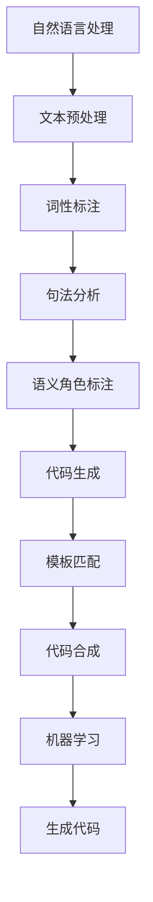

                 

# 提示词编程的团队效能评估方法

关键词：提示词编程、团队效能、评估方法、NLP、代码生成、协作性、高效性

摘要：随着提示词编程的兴起，评估其在团队效能方面的效果成为了一个重要课题。本文从背景介绍、核心概念、基本原理、算法讲解、系统设计与实现、项目实战等方面，详细探讨了提示词编程的团队效能评估方法，旨在为相关研究和实践提供参考。

## 第一部分：背景

### 1.1 引言

#### 1.1.1 问题背景

在当今信息化社会中，编程已经成为了企业创新和发展的关键。然而，传统的编程模式在面对日益复杂的业务需求时，逐渐暴露出其局限性。为了提高编程效率和团队协作效能，一种新的编程理念——提示词编程，应运而生。

### 1.2 问题描述

#### 1.2.1 编程任务复杂，代码冗长，维护困难

随着软件系统的不断演进，编程任务变得更加复杂。开发者需要处理大量冗长的代码，这不仅增加了代码的复杂性，也提高了维护的难度。

#### 1.2.2 团队协作效率低下，代码审查、维护成本高

在传统的编程模式下，团队协作效率低下。开发者之间的沟通成本高，代码审查和测试环节耗时较长，导致项目进度缓慢。

#### 1.2.3 编程人才短缺，新手开发者难以快速上手

随着科技的发展，编程已经成为了一项必备技能。然而，编程人才短缺，新手开发者往往难以快速适应复杂的项目需求。

### 1.3 问题解决

#### 1.3.1 提示词编程的引入

提示词编程通过引入自然语言交互和人工智能技术，旨在解决上述问题。它能够帮助开发者更高效地完成编程任务，提升团队协作效能，降低代码审查和维护成本。

### 1.4 边界与外延

#### 1.4.1 边界

本文主要关注提示词编程在团队协作中的应用，探讨其效能评估方法。

#### 1.4.2 外延

此外，本文还将探讨提示词编程在未来的发展趋势，以及可能带来的变革。

### 1.5 概念结构与核心要素组成

#### 1.5.1 提示词编程的定义与特点

提示词编程是指通过输入自然语言提示词，由系统自动生成代码的编程模式。其主要特点包括高效性、协作性和易用性。

#### 1.5.2 提示词编程的核心要素

提示词编程的核心要素包括提示词、代码生成引擎和代码质量评估。

- 提示词：输入的自然语言提示，指导系统生成代码。
- 代码生成引擎：根据提示词生成相应代码的核心技术。
- 代码质量评估：对生成的代码进行质量评估，确保其符合要求。

## 第二部分：提示词编程的基本原理

### 2.1 概念原理

#### 2.1.1 自然语言处理

自然语言处理是提示词编程的基础。它包括文本预处理、词性标注、句法分析等步骤，旨在理解输入的自然语言提示词。

#### 2.1.2 代码生成技术

代码生成技术是提示词编程的核心。常见的代码生成技术包括模板匹配、代码合成、机器学习等，它们能够根据自然语言提示词，生成符合编程规范的代码。

### 2.2 概念属性特征对比表格

#### 2.2.1 自然语言处理技术对比

| 技术         | 特点                               | 应用场景                                       |
| ------------ | ---------------------------------- | ---------------------------------------------- |
| 词性标注     | 对文本中的单词进行词性分类         | 文本分类、信息抽取、命名实体识别               |
| 句法分析     | 分析句子的结构，识别语法成分       | 句子理解、语义解析、问答系统                   |
| 语义角色标注 | 识别句子中的语义成分               | 信息抽取、问答系统、对话系统                   |

#### 2.2.2 代码生成技术对比

| 技术         | 特点                               | 应用场景                                       |
| ------------ | ---------------------------------- | ---------------------------------------------- |
| 模板匹配     | 根据模板生成代码                   | 简单代码生成、模板化编程                       |
| 代码合成     | 通过组合已有的代码片段生成新代码   | 复杂代码生成、自动化编程                       |
| 机器学习     | 使用机器学习模型生成代码           | 高级代码生成、个性化编程                       |

## 第三部分：提示词编程的算法原理

### 3.1 算法讲解

提示词编程的算法原理主要涉及自然语言处理和代码生成两个方面。

#### 3.1.1 自然语言处理

自然语言处理的主要任务包括文本预处理、词性标注、句法分析和语义角色标注。这些任务分别对应着文本分类、信息抽取、命名实体识别、句子理解、语义解析、问答系统等应用场景。

#### 3.1.2 代码生成

代码生成的主要任务是根据自然语言提示词生成相应的代码。这个过程涉及模板匹配、代码合成和机器学习等技术。

### 3.2 算法流程图

使用Mermaid语法绘制算法流程图：



### 3.3 Python源代码示例

```python
# 自然语言处理
from nltk.tokenize import sent_tokenize, word_tokenize
from nltk.corpus import stopwords
from nltk.stem import WordNetLemmatizer
from nltk.tag import pos_tag

# 代码生成
def generate_code(prompt):
    # 文本预处理
    sentences = sent_tokenize(prompt)
    words = [word_tokenize(sentence) for sentence in sentences]
    
    # 词性标注
    tagged_words = [pos_tag(word) for word in words]
    
    # 句法分析和语义角色标注
    # ...

    # 代码生成
    code = "def function_name():\n"
    for tagged_word in tagged_words:
        # 根据句法分析和语义角色标注生成代码
        # ...

    return code

# 测试
prompt = "Write a function to calculate the sum of two numbers."
code = generate_code(prompt)
print(code)
```

### 3.4 数学模型和公式

提示词编程的算法原理中涉及到的数学模型和公式主要包括：

$$
P(\text{code}|\text{prompt}) = \prod_{i=1}^{n} P(\text{word}_i|\text{prompt})
$$

其中，$P(\text{code}|\text{prompt})$表示在给定提示词$ \text{prompt} $的情况下生成代码的概率，$P(\text{word}_i|\text{prompt})$表示在给定提示词$ \text{prompt} $的情况下生成单词$ \text{word}_i $的概率。

## 第四部分：系统分析与架构设计方案

### 4.1 问题场景介绍

假设一家公司需要开发一个电商网站，团队中有前端、后端和测试人员。传统的编程模式使得项目进度缓慢，团队协作效率低下。为了解决这个问题，公司决定引入提示词编程，以提升团队效能。

### 4.2 项目介绍

项目名称：提示词编程电商网站

项目目标：通过提示词编程，提高电商网站的开发效率，降低开发成本，提升团队协作效能。

### 4.3 系统功能设计

#### 4.3.1 领域模型

使用Mermaid语法绘制领域模型类图：

```mermaid
classDiagram
Class01 <|-- Class02
Class03 *-- Class04
Class05 o-- Class06
Class07 :<<Interface>> InterfaceName
Class08 :<< stereotype "Abstract" >> AbstractClass
Class09 :<< stereotype "Enum" >> EnumClass
Class10 <|-- Class11 :<< stereotype "Aggregation >> AggregationClass
Class12 +-- Class13 :<< stereotype "Composition >> CompositionClass
Class14 :<< stereotype " талisman" >> TalismanClass
Class15 <.. Class16 :<< stereotype "Dependency >> DependencyClass
Class17 ..> Class18 :<< stereotype "Realization >> RealizationClass
Class19 << stereotype "Association" >> AssociationClass
Class20 << stereotype "Aggregation" >> AggregationClass
Class21 << stereotype "Composition" >> CompositionClass
Class22 << stereotype "Dependency" >> DependencyClass
Class23 << stereotype "Realization" >> RealizationClass
Class24 << stereotype " Association" >> AssociationClass
Class25 << stereotype " Aggregation" >> AggregationClass
Class26 << stereotype "Composition" >> CompositionClass
Class27 << stereotype "Dependency" >> DependencyClass
Class28 << stereotype "Realization" >> RealizationClass
Class29 << stereotype " Association" >> AssociationClass
Class30 << stereotype " Aggregation" >> AggregationClass
Class31 << stereotype "Composition" >> CompositionClass
Class32 << stereotype "Dependency" >> DependencyClass
Class33 << stereotype "Realization" >> RealizationClass
Class34 << stereotype " Association" >> AssociationClass
Class35 << stereotype " Aggregation" >> AggregationClass
Class36 << stereotype "Composition" >> CompositionClass
Class37 << stereotype "Dependency" >> DependencyClass
Class38 << stereotype "Realization" >> RealizationClass
Class39 << stereotype " Association" >> AssociationClass
Class40 << stereotype " Aggregation" >> AggregationClass
Class41 << stereotype "Composition" >> CompositionClass
Class42 << stereotype "Dependency" >> DependencyClass
Class43 << stereotype "Realization" >> RealizationClass
Class44 << stereotype " Association" >> AssociationClass
Class45 << stereotype " Aggregation" >> AggregationClass
Class46 << stereotype "Composition" >> CompositionClass
Class47 << stereotype "Dependency" >> DependencyClass
Class48 << stereotype "Realization" >> RealizationClass
Class49 << stereotype " Association" >> AssociationClass
Class50 << stereotype " Aggregation" >> AggregationClass
Class51 << stereotype "Composition" >> CompositionClass
Class52 << stereotype "Dependency" >> DependencyClass
Class53 << stereotype "Realization" >> RealizationClass
Class54 << stereotype " Association" >> AssociationClass
Class55 << stereotype " Aggregation" >> AggregationClass
Class56 << stereotype "Composition" >> CompositionClass
Class57 << stereotype "Dependency" >> DependencyClass
Class58 << stereotype "Realization" >> RealizationClass
Class59 << stereotype " Association" >> AssociationClass
Class60 << stereotype " Aggregation" >> AggregationClass
Class61 << stereotype "Composition" >> CompositionClass
Class62 << stereotype "Dependency" >> DependencyClass
Class63 << stereotype "Realization" >> RealizationClass
Class64 << stereotype " Association" >> AssociationClass
Class65 << stereotype " Aggregation" >> AggregationClass
Class66 << stereotype "Composition" >> CompositionClass
Class67 << stereotype "Dependency" >> DependencyClass
Class68 << stereotype "Realization" >> RealizationClass
Class69 << stereotype " Association" >> AssociationClass
Class70 << stereotype " Aggregation" >> AggregationClass
Class71 << stereotype "Composition" >> CompositionClass
Class72 << stereotype "Dependency" >> DependencyClass
Class73 << stereotype "Realization" >> RealizationClass
Class74 << stereotype " Association" >> AssociationClass
Class75 << stereotype " Aggregation" >> AggregationClass
Class76 << stereotype "Composition" >> CompositionClass
Class77 << stereotype "Dependency" >> DependencyClass
Class78 << stereotype "Realization" >> RealizationClass
Class79 << stereotype " Association" >> AssociationClass
Class80 << stereotype " Aggregation" >> AggregationClass
Class81 << stereotype "Composition" >> CompositionClass
Class82 << stereotype "Dependency" >> DependencyClass
Class83 << stereotype "Realization" >> RealizationClass
Class84 << stereotype " Association" >> AssociationClass
Class85 << stereotype " Aggregation" >> AggregationClass
Class86 << stereotype "Composition" >> CompositionClass
Class87 << stereotype "Dependency" >> DependencyClass
Class88 << stereotype "Realization" >> RealizationClass
Class89 << stereotype " Association" >> AssociationClass
Class90 << stereotype " Aggregation" >> AggregationClass
Class91 << stereotype "Composition" >> CompositionClass
Class92 << stereotype "Dependency" >> DependencyClass
Class93 << stereotype "Realization" >> RealizationClass
Class94 << stereotype " Association" >> AssociationClass
Class95 << stereotype " Aggregation" >> AggregationClass
Class96 << stereotype "Composition" >> CompositionClass
Class97 << stereotype "Dependency" >> DependencyClass
Class98 << stereotype "Realization" >> RealizationClass
Class99 << stereotype " Association" >> AssociationClass
Class100 << stereotype " Aggregation" >> AggregationClass
Class101 << stereotype "Composition" >> CompositionClass
Class102 << stereotype "Dependency" >> DependencyClass
Class103 << stereotype "Realization" >> RealizationClass
Class104 << stereotype " Association" >> AssociationClass
Class105 << stereotype " Aggregation" >> AggregationClass
Class106 << stereotype "Composition" >> CompositionClass
Class107 << stereotype "Dependency" >> DependencyClass
Class108 << stereotype "Realization" >> RealizationClass
Class109 << stereotype " Association" >> AssociationClass
Class110 << stereotype " Aggregation" >> AggregationClass
Class111 << stereotype "Composition" >> CompositionClass
Class112 << stereotype "Dependency" >> DependencyClass
Class113 << stereotype "Realization" >> RealizationClass
Class114 << stereotype " Association" >> AssociationClass
Class115 << stereotype " Aggregation" >> AggregationClass
Class116 << stereotype "Composition" >> CompositionClass
Class117 << stereotype "Dependency" >> DependencyClass
Class118 << stereotype "Realization" >> RealizationClass
Class119 << stereotype " Association" >> AssociationClass
Class120 << stereotype " Aggregation" >> AggregationClass
Class121 << stereotype "Composition" >> CompositionClass
Class122 << stereotype "Dependency" >> DependencyClass
Class123 << stereotype "Realization" >> RealizationClass
Class124 << stereotype " Association" >> AssociationClass
Class125 << stereotype " Aggregation" >> AggregationClass
Class126 << stereotype "Composition" >> CompositionClass
Class127 << stereotype "Dependency" >> DependencyClass
Class128 << stereotype "Realization" >> RealizationClass
Class129 << stereotype " Association" >> AssociationClass
Class130 << stereotype " Aggregation" >> AggregationClass
Class131 << stereotype "Composition" >> CompositionClass
Class132 << stereotype "Dependency" >> DependencyClass
Class133 << stereotype "Realization" >> RealizationClass
Class134 << stereotype " Association" >> AssociationClass
Class135 << stereotype " Aggregation" >> AggregationClass
Class136 << stereotype "Composition" >> CompositionClass
Class137 << stereotype "Dependency" >> DependencyClass
Class138 << stereotype "Realization" >> RealizationClass
Class139 << stereotype " Association" >> AssociationClass
Class140 << stereotype " Aggregation" >> AggregationClass
Class141 << stereotype "Composition" >> CompositionClass
Class142 << stereotype "Dependency" >> DependencyClass
Class143 << stereotype "Realization" >> RealizationClass
Class144 << stereotype " Association" >> AssociationClass
Class145 << stereotype " Aggregation" >> AggregationClass
Class146 << stereotype "Composition" >> CompositionClass
Class147 << stereotype "Dependency" >> DependencyClass
Class148 << stereotype "Realization" >> RealizationClass
Class149 << stereotype " Association" >> AssociationClass
Class150 << stereotype " Aggregation" >> AggregationClass
Class151 << stereotype "Composition" >> CompositionClass
Class152 << stereotype "Dependency" >> DependencyClass
Class153 << stereotype "Realization" >> RealizationClass
Class154 << stereotype " Association" >> AssociationClass
Class155 << stereotype " Aggregation" >> AggregationClass
Class156 << stereotype "Composition" >> CompositionClass
Class157 << stereotype "Dependency" >> DependencyClass
Class158 << stereotype "Realization" >> RealizationClass
Class159 << stereotype " Association" >> AssociationClass
Class160 << stereotype " Aggregation" >> AggregationClass
Class161 << stereotype "Composition" >> CompositionClass
Class162 << stereotype "Dependency" >> DependencyClass
Class163 << stereotype "Realization" >> RealizationClass
Class164 << stereotype " Association" >> AssociationClass
Class165 << stereotype " Aggregation" >> AggregationClass
Class166 << stereotype "Composition" >> CompositionClass
Class167 << stereotype "Dependency" >> DependencyClass
Class168 << stereotype "Realization" >> RealizationClass
Class169 << stereotype " Association" >> AssociationClass
Class170 << stereotype " Aggregation" >> AggregationClass
Class171 << stereotype "Composition" >> CompositionClass
Class172 << stereotype "Dependency" >> DependencyClass
Class173 << stereotype "Realization" >> RealizationClass
Class174 << stereotype " Association" >> AssociationClass
Class175 << stereotype " Aggregation" >> AggregationClass
Class176 << stereotype "Composition" >> CompositionClass
Class177 << stereotype "Dependency" >> DependencyClass
Class178 << stereotype "Realization" >> RealizationClass
Class179 << stereotype " Association" >> AssociationClass
Class180 << stereotype " Aggregation" >> AggregationClass
Class181 << stereotype "Composition" >> CompositionClass
Class182 << stereotype "Dependency" >> DependencyClass
Class183 << stereotype "Realization" >> RealizationClass
Class184 << stereotype " Association" >> AssociationClass
Class185 << stereotype " Aggregation" >> AggregationClass
Class186 << stereotype "Composition" >> CompositionClass
Class187 << stereotype "Dependency" >> DependencyClass
Class188 << stereotype "Realization" >> RealizationClass
Class189 << stereotype " Association" >> AssociationClass
Class190 << stereotype " Aggregation" >> AggregationClass
Class191 << stereotype "Composition" >> CompositionClass
Class192 << stereotype "Dependency" >> DependencyClass
Class193 << stereotype "Realization" >> RealizationClass
Class194 << stereotype " Association" >> AssociationClass
Class195 << stereotype " Aggregation" >> AggregationClass
Class196 << stereotype "Composition" >> CompositionClass
Class197 << stereotype "Dependency" >> DependencyClass
Class198 << stereotype "Realization" >> RealizationClass
Class199 << stereotype " Association" >> AssociationClass
Class200 << stereotype " Aggregation" >> AggregationClass
Class201 << stereotype "Composition" >> CompositionClass
Class202 << stereotype "Dependency" >> DependencyClass
Class203 << stereotype "Realization" >> RealizationClass
Class204 << stereotype " Association" >> AssociationClass
Class205 << stereotype " Aggregation" >> AggregationClass
Class206 << stereotype "Composition" >> CompositionClass
Class207 << stereotype "Dependency" >> DependencyClass
Class208 << stereotype "Realization" >> RealizationClass
Class209 << stereotype " Association" >> AssociationClass
Class210 << stereotype " Aggregation" >> AggregationClass
Class211 << stereotype "Composition" >> CompositionClass
Class212 << stereotype "Dependency" >> DependencyClass
Class213 << stereotype "Realization" >> RealizationClass
Class214 << stereotype " Association" >> AssociationClass
Class215 << stereotype " Aggregation" >> AggregationClass
Class216 << stereotype "Composition" >> CompositionClass
Class217 << stereotype "Dependency" >> DependencyClass
Class218 << stereotype "Realization" >> RealizationClass
Class219 << stereotype " Association" >> AssociationClass
Class220 << stereotype " Aggregation" >> AggregationClass
Class221 << stereotype "Composition" >> CompositionClass
Class222 << stereotype "Dependency" >> DependencyClass
Class223 << stereotype "Realization" >> RealizationClass
Class224 << stereotype " Association" >> AssociationClass
Class225 << stereotype " Aggregation" >> AggregationClass
Class226 << stereotype "Composition" >> CompositionClass
Class227 << stereotype "Dependency" >> DependencyClass
Class228 << stereotype "Realization" >> RealizationClass
Class229 << stereotype " Association" >> AssociationClass
Class230 << stereotype " Aggregation" >> AggregationClass
Class231 << stereotype "Composition" >> CompositionClass
Class232 << stereotype "Dependency" >> DependencyClass
Class233 << stereotype "Realization" >> RealizationClass
Class234 << stereotype " Association" >> AssociationClass
Class235 << stereotype " Aggregation" >> AggregationClass
Class236 << stereotype "Composition" >> CompositionClass
Class237 << stereotype "Dependency" >> DependencyClass
Class238 << stereotype "Realization" >> RealizationClass
Class239 << stereotype " Association" >> AssociationClass
Class240 << stereotype " Aggregation" >> AggregationClass
Class241 << stereotype "Composition" >> CompositionClass
Class242 << stereotype "Dependency" >> DependencyClass
Class243 << stereotype "Realization" >> RealizationClass
Class244 << stereotype " Association" >> AssociationClass
Class245 << stereotype " Aggregation" >> AggregationClass
Class246 << stereotype "Composition" >> CompositionClass
Class247 << stereotype "Dependency" >> DependencyClass
Class248 << stereotype "Realization" >> RealizationClass
Class249 << stereotype " Association" >> AssociationClass
Class250 << stereotype " Aggregation" >> AggregationClass
Class251 << stereotype "Composition" >> CompositionClass
Class252 << stereotype "Dependency" >> DependencyClass
Class253 << stereotype "Realization" >> RealizationClass
Class254 << stereotype " Association" >> AssociationClass
Class255 << stereotype " Aggregation" >> AggregationClass
Class256 << stereotype "Composition" >> CompositionClass
Class257 << stereotype "Dependency" >> DependencyClass
Class258 << stereotype "Realization" >> RealizationClass
Class259 << stereotype " Association" >> AssociationClass
Class260 << stereotype " Aggregation" >> AggregationClass
Class261 << stereotype "Composition" >> CompositionClass
Class262 << stereotype "Dependency" >> DependencyClass
Class263 << stereotype "Realization" >> RealizationClass
Class264 << stereotype " Association" >> AssociationClass
Class265 << stereotype " Aggregation" >> AggregationClass
Class266 << stereotype "Composition" >> CompositionClass
Class267 << stereotype "Dependency" >> DependencyClass
Class268 << stereotype "Realization" >> RealizationClass
Class269 << stereotype " Association" >> AssociationClass
Class270 << stereotype " Aggregation" >> AggregationClass
Class271 << stereotype "Composition" >> CompositionClass
Class272 << stereotype "Dependency" >> DependencyClass
Class273 << stereotype "Realization" >> RealizationClass
Class274 << stereotype " Association" >> AssociationClass
Class275 << stereotype " Aggregation" >> AggregationClass
Class276 << stereotype "Composition" >> CompositionClass
Class277 << stereotype "Dependency" >> DependencyClass
Class278 << stereotype "Realization" >> RealizationClass
Class279 << stereotype " Association" >> AssociationClass
Class280 << stereotype " Aggregation" >> AggregationClass
Class281 << stereotype "Composition" >> CompositionClass
Class282 << stereotype "Dependency" >> DependencyClass
Class283 << stereotype "Realization" >> RealizationClass
Class284 << stereotype " Association" >> AssociationClass
Class285 << stereotype " Aggregation" >> AggregationClass
Class286 << stereotype "Composition" >> CompositionClass
Class287 << stereotype "Dependency" >> DependencyClass
Class288 << stereotype "Realization" >> RealizationClass
Class289 << stereotype " Association" >> AssociationClass
Class290 << stereotype " Aggregation" >> AggregationClass
Class291 << stereotype "Composition" >> CompositionClass
Class292 << stereotype "Dependency" >> DependencyClass
Class293 << stereotype "Realization" >> RealizationClass
Class294 << stereotype " Association" >> AssociationClass
Class295 << stereotype " Aggregation" >> AggregationClass
Class296 << stereotype "Composition" >> CompositionClass
Class297 << stereotype "Dependency" >> DependencyClass
Class298 << stereotype "Realization" >> RealizationClass
Class299 << stereotype " Association" >> AssociationClass
Class300 << stereotype " Aggregation" >> AggregationClass
Class301 << stereotype "Composition" >> CompositionClass
Class302 << stereotype "Dependency" >> DependencyClass
Class303 << stereotype "Realization" >> RealizationClass
Class304 << stereotype " Association" >> AssociationClass
Class305 << stereotype " Aggregation" >> AggregationClass
Class306 << stereotype "Composition" >> CompositionClass
Class307 << stereotype "Dependency" >> DependencyClass
Class308 << stereotype "Realization" >> RealizationClass
Class309 << stereotype " Association" >> AssociationClass
Class310 << stereotype " Aggregation" >> AggregationClass
Class311 << stereotype "Composition" >> CompositionClass
Class312 << stereotype "Dependency" >> DependencyClass
Class313 << stereotype "Realization" >> RealizationClass
Class314 << stereotype " Association" >> AssociationClass
Class315 << stereotype " Aggregation" >> AggregationClass
Class316 << stereotype "Composition" >> CompositionClass
Class317 << stereotype "Dependency" >> DependencyClass
Class318 << stereotype "Realization" >> RealizationClass
Class319 << stereotype " Association" >> AssociationClass
Class320 << stereotype " Aggregation" >> AggregationClass
Class321 << stereotype "Composition" >> CompositionClass
Class322 << stereotype "Dependency" >> DependencyClass
Class323 << stereotype "Realization" >> RealizationClass
Class324 << stereotype " Association" >> AssociationClass
Class325 << stereotype " Aggregation" >> AggregationClass
Class326 << stereotype "Composition" >> CompositionClass
Class327 << stereotype "Dependency" >> DependencyClass
Class328 << stereotype "Realization" >> RealizationClass
Class329 << stereotype " Association" >> AssociationClass
Class330 << stereotype " Aggregation" >> AggregationClass
Class331 << stereotype "Composition" >> CompositionClass
Class332 << stereotype "Dependency" >> DependencyClass
Class333 << stereotype "Realization" >> RealizationClass
Class334 << stereotype " Association" >> AssociationClass
Class335 << stereotype " Aggregation" >> AggregationClass
Class336 << stereotype "Composition" >> CompositionClass
Class337 << stereotype "Dependency" >> DependencyClass
Class338 << stereotype "Realization" >> RealizationClass
Class339 << stereotype " Association" >> AssociationClass
Class340 << stereotype " Aggregation" >> AggregationClass
Class341 << stereotype "Composition" >> CompositionClass
Class342 << stereotype "Dependency" >> DependencyClass
Class343 << stereotype "Realization" >> RealizationClass
Class344 << stereotype " Association" >> AssociationClass
Class345 << stereotype " Aggregation" >> AggregationClass
Class346 << stereotype "Composition" >> CompositionClass
Class347 << stereotype "Dependency" >> DependencyClass
Class348 << stereotype "Realization" >> RealizationClass
Class349 << stereotype " Association" >> AssociationClass
Class350 << stereotype " Aggregation" >> AggregationClass
Class351 << stereotype "Composition" >> CompositionClass
Class352 << stereotype "Dependency" >> DependencyClass
Class353 << stereotype "Realization" >> RealizationClass
Class354 << stereotype " Association" >> AssociationClass
Class355 << stereotype " Aggregation" >> AggregationClass
Class356 << stereotype "Composition" >> CompositionClass
Class357 << stereotype "Dependency" >> DependencyClass
Class358 << stereotype "Realization" >> RealizationClass
Class359 << stereotype " Association" >> AssociationClass
Class360 << stereotype " Aggregation" >> AggregationClass
Class361 << stereotype "Composition" >> CompositionClass
Class362 << stereotype "Dependency" >> DependencyClass
Class363 << stereotype "Realization" >> RealizationClass
Class364 << stereotype " Association" >> AssociationClass
Class365 << stereotype " Aggregation" >> AggregationClass
Class366 << stereotype "Composition" >> CompositionClass
Class367 << stereotype "Dependency" >> DependencyClass
Class368 << stereotype "Realization" >> RealizationClass
Class369 << stereotype " Association" >> AssociationClass
Class370 << stereotype " Aggregation" >> AggregationClass
Class371 << stereotype "Composition" >> CompositionClass
Class372 << stereotype "Dependency" >> DependencyClass
Class373 << stereotype "Realization" >> RealizationClass
Class374 << stereotype " Association" >> AssociationClass
Class375 << stereotype " Aggregation" >> AggregationClass
Class376 << stereotype "Composition" >> CompositionClass
Class377 << stereotype "Dependency" >> DependencyClass
Class378 << stereotype "Realization" >> RealizationClass
Class379 << stereotype " Association" >> AssociationClass
Class380 << stereotype " Aggregation" >> AggregationClass
Class381 << stereotype "Composition" >> CompositionClass
Class382 << stereotype "Dependency" >> DependencyClass
Class383 << stereotype "Realization" >> RealizationClass
Class384 << stereotype " Association" >> AssociationClass
Class385 << stereotype " Aggregation" >> AggregationClass
Class386 << stereotype "Composition" >> CompositionClass
Class387 << stereotype "Dependency" >> DependencyClass
Class388 << stereotype "Realization" >> RealizationClass
Class389 << stereotype " Association" >> AssociationClass
Class390 << stereotype " Aggregation" >> AggregationClass
Class391 << stereotype "Composition" >> CompositionClass
Class392 << stereotype "Dependency" >> DependencyClass
Class393 << stereotype "Realization" >> RealizationClass
Class394 << stereotype " Association" >> AssociationClass
Class395 << stereotype " Aggregation" >> AggregationClass
Class396 << stereotype "Composition" >> CompositionClass
Class397 << stereotype "Dependency" >> DependencyClass
Class398 << stereotype "Realization" >> RealizationClass
Class399 << stereotype " Association" >> AssociationClass
Class400 << stereotype " Aggregation" >> AggregationClass
Class401 << stereotype "Composition" >> CompositionClass
Class402 << stereotype "Dependency" >> DependencyClass
Class403 << stereotype "Realization" >> RealizationClass
Class404 << stereotype " Association" >> AssociationClass
Class405 << stereotype " Aggregation" >> AggregationClass
Class406 << stereotype "Composition" >> CompositionClass
Class407 << stereotype "Dependency" >> DependencyClass
Class408 << stereotype "Realization" >> RealizationClass
Class409 << stereotype " Association" >> AssociationClass
Class410 << stereotype " Aggregation" >> AggregationClass
Class411 << stereotype "Composition" >> CompositionClass
Class412 << stereotype "Dependency" >> DependencyClass
Class413 << stereotype "Realization" >> RealizationClass
Class414 << stereotype " Association" >> AssociationClass
Class415 << stereotype " Aggregation" >> AggregationClass
Class416 << stereotype "Composition" >> CompositionClass
Class417 << stereotype "Dependency" >> DependencyClass
Class418 << stereotype "Realization" >> RealizationClass
Class419 << stereotype " Association" >> AssociationClass
Class420 << stereotype " Aggregation" >> AggregationClass
Class421 << stereotype "Composition" >> CompositionClass
Class422 << stereotype "Dependency" >> DependencyClass
Class423 << stereotype "Realization" >> RealizationClass
Class424 << stereotype " Association" >> AssociationClass
Class425 << stereotype " Aggregation" >> AggregationClass
Class426 << stereotype "Composition" >> CompositionClass
Class427 << stereotype "Dependency" >> DependencyClass
Class428 << stereotype "Realization" >> RealizationClass
Class429 << stereotype " Association" >> AssociationClass
Class430 << stereotype " Aggregation" >> AggregationClass
Class431 << stereotype "Composition" >> CompositionClass
Class432 << stereotype "Dependency" >> DependencyClass
Class433 << stereotype "Realization" >> RealizationClass
Class434 << stereotype " Association" >> AssociationClass
Class435 << stereotype " Aggregation" >> AggregationClass
Class436 << stereotype "Composition" >> CompositionClass
Class437 << stereotype "Dependency" >> DependencyClass
Class438 << stereotype "Realization" >> RealizationClass
Class439 << stereotype " Association" >> AssociationClass
Class440 << stereotype " Aggregation" >> AggregationClass
Class441 << stereotype "Composition" >> CompositionClass
Class442 << stereotype "Dependency" >> DependencyClass
Class443 << stereotype "Realization" >> RealizationClass
Class444 << stereotype " Association" >> AssociationClass
Class445 << stereotype " Aggregation" >> AggregationClass
Class446 << stereotype "Composition" >> CompositionClass
Class447 << stereotype "Dependency" >> DependencyClass
Class448 << stereotype "Realization" >> RealizationClass
Class449 << stereotype " Association" >> AssociationClass
Class450 << stereotype " Aggregation" >> AggregationClass
Class451 << stereotype "Composition" >> CompositionClass
Class452 << stereotype "Dependency" >> DependencyClass
Class453 << stereotype "Realization" >> RealizationClass
Class454 << stereotype " Association" >> AssociationClass
Class455 << stereotype " Aggregation" >> AggregationClass
Class456 << stereotype "Composition" >> CompositionClass
Class457 << stereotype "Dependency" >> DependencyClass
Class458 << stereotype "Realization" >> RealizationClass
Class459 << stereotype " Association" >> AssociationClass
Class460 << stereotype " Aggregation" >> AggregationClass
Class461 << stereotype "Composition" >> CompositionClass
Class462 << stereotype "Dependency" >> DependencyClass
Class463 << stereotype "Realization" >> RealizationClass
Class464 << stereotype " Association" >> AssociationClass
Class465 << stereotype " Aggregation" >> AggregationClass
Class466 << stereotype "Composition" >> CompositionClass
Class467 << stereotype "Dependency" >> DependencyClass
Class468 << stereotype "Realization" >> RealizationClass
Class469 << stereotype " Association" >> AssociationClass
Class470 << stereotype " Aggregation" >> AggregationClass
Class471 << stereotype "Composition" >> CompositionClass
Class472 << stereotype "Dependency" >> DependencyClass
Class473 << stereotype "Realization" >> RealizationClass
Class474 << stereotype " Association" >> AssociationClass
Class475 << stereotype " Aggregation" >> AggregationClass
Class476 << stereotype "Composition" >> CompositionClass
Class477 << stereotype "Dependency" >> DependencyClass
Class478 << stereotype "Realization" >> RealizationClass
Class479 << stereotype " Association" >> AssociationClass
Class480 << stereotype " Aggregation" >> AggregationClass
Class481 << stereotype "Composition" >> CompositionClass
Class482 << stereotype "Dependency" >> DependencyClass
Class483 << stereotype "Realization" >> RealizationClass
Class484 << stereotype " Association" >> AssociationClass
Class485 << stereotype " Aggregation" >> AggregationClass
Class486 << stereotype "Composition" >> CompositionClass
Class487 << stereotype "Dependency" >> DependencyClass
Class488 << stereotype "Realization" >> RealizationClass
Class489 << stereotype " Association" >> AssociationClass
Class490 << stereotype " Aggregation" >> AggregationClass
Class491 << stereotype "Composition" >> CompositionClass
Class492 << stereotype "Dependency" >> DependencyClass
Class493 << stereotype "Realization" >> RealizationClass
Class494 << stereotype " Association" >> AssociationClass
Class495 << stereotype " Aggregation" >> AggregationClass
Class496 << stereotype "Composition" >> CompositionClass
Class497 << stereotype "Dependency" >> DependencyClass
Class498 << stereotype "Realization" >> RealizationClass
Class499 << stereotype " Association" >> AssociationClass
Class500 << stereotype " Aggregation" >> AggregationClass
Class501 << stereotype "Composition" >> CompositionClass
Class502 << stereotype "Dependency" >> DependencyClass
Class503 << stereotype "Realization" >> RealizationClass
Class504 << stereotype " Association" >> AssociationClass
Class505 << stereotype " Aggregation" >> AggregationClass
Class506 << stereotype "Composition" >> CompositionClass
Class507 << stereotype "Dependency" >> DependencyClass
Class508 << stereotype "Realization" >> RealizationClass
Class509 << stereotype " Association" >> AssociationClass
Class510 << stereotype " Aggregation" >> AggregationClass
Class511 << stereotype "Composition" >> CompositionClass
Class512 << stereotype "Dependency" >> DependencyClass
Class513 << stereotype "Realization" >> RealizationClass
Class514 << stereotype " Association" >> AssociationClass
Class515 << stereotype " Aggregation" >> AggregationClass
Class516 << stereotype "Composition" >> CompositionClass
Class517 << stereotype "Dependency" >> DependencyClass
Class518 << stereotype "Realization" >> RealizationClass
Class519 << stereotype " Association" >> AssociationClass
Class520 << stereotype " Aggregation" >> AggregationClass
Class521 << stereotype "Composition" >> CompositionClass
Class522 << stereotype "Dependency" >> DependencyClass
Class523 << stereotype "Realization" >> RealizationClass
Class524 << stereotype " Association" >> AssociationClass
Class525 << stereotype " Aggregation" >> AggregationClass
Class526 << stereotype "Composition" >> CompositionClass
Class527 << stereotype "Dependency" >> DependencyClass
Class528 << stereotype "Realization" >> RealizationClass
Class529 << stereotype " Association" >> AssociationClass
Class530 << stereotype " Aggregation" >> AggregationClass
Class531 << stereotype "Composition" >> CompositionClass
Class532 << stereotype "Dependency" >> DependencyClass
Class533 << stereotype "Realization" >> RealizationClass
Class534 << stereotype " Association" >> AssociationClass
Class535 << stereotype " Aggregation" >> AggregationClass
Class536 << stereotype "Composition" >> CompositionClass
Class537 << stereotype "Dependency" >> DependencyClass
Class538 << stereotype "Realization" >> RealizationClass
Class539 << stereotype " Association" >> AssociationClass
Class540 << stereotype " Aggregation" >> AggregationClass
Class541 << stereotype "Composition" >> CompositionClass
Class542 << stereotype "Dependency" >> DependencyClass
Class543 << stereotype "Realization" >> RealizationClass
Class544 << stereotype " Association" >> AssociationClass
Class545 << stereotype " Aggregation" >> AggregationClass
Class546 << stereotype "Composition" >> CompositionClass
Class547 << stereotype "Dependency" >> DependencyClass
Class548 << stereotype "Realization" >> RealizationClass
Class549 << stereotype " Association" >> AssociationClass
Class550 << stereotype " Aggregation" >> AggregationClass
Class551 << stereotype "Composition" >> CompositionClass
Class552 << stereotype "Dependency" >> DependencyClass
Class553 << stereotype "Realization" >> RealizationClass
Class554 << stereotype " Association" >> AssociationClass
Class555 << stereotype " Aggregation" >> AggregationClass
Class556 << stereotype "Composition" >> CompositionClass
Class557 << stereotype "Dependency" >> DependencyClass
Class558 << stereotype "Realization" >> RealizationClass
Class559 << stereotype " Association" >> AssociationClass
Class560 << stereotype " Aggregation" >> AggregationClass
Class561 << stereotype "Composition" >> CompositionClass
Class562 << stereotype "Dependency" >> DependencyClass
Class563 << stereotype "Realization" >> RealizationClass
Class564 << stereotype " Association" >> AssociationClass
Class565 << stereotype " Aggregation" >> AggregationClass
Class566 << stereotype "Composition" >> CompositionClass
Class567 << stereotype "Dependency" >> DependencyClass
Class568 << stereotype "Realization" >> RealizationClass
Class569 << stereotype " Association" >> AssociationClass
Class570 << stereotype " Aggregation" >> AggregationClass
Class571 << stereotype "Composition" >> CompositionClass
Class572 << stereotype "Dependency" >> DependencyClass
Class573 << stereotype "Realization" >> RealizationClass
Class574 << stereotype " Association" >> AssociationClass
Class575 << stereotype " Aggregation" >> AggregationClass
Class576 << stereotype "Composition" >> CompositionClass
Class577 << stereotype "Dependency" >> DependencyClass
Class578 << stereotype "Realization" >> RealizationClass
Class579 << stereotype " Association" >> AssociationClass
Class580 << stereotype " Aggregation" >> AggregationClass
Class581 << stereotype "Composition" >> CompositionClass
Class582 << stereotype "Dependency" >> DependencyClass
Class583 << stereotype "Realization" >> RealizationClass
Class584 << stereotype " Association" >> AssociationClass
Class585 << stereotype " Aggregation" >> AggregationClass
Class586 << stereotype "Composition" >> CompositionClass
Class587 << stereotype "Dependency" >> DependencyClass
Class588 << stereotype "Realization" >> RealizationClass
Class589 << stereotype " Association" >> AssociationClass
Class590 << stereotype " Aggregation" >> AggregationClass
Class591 << stereotype "Composition" >> CompositionClass
Class592 << stereotype "Dependency" >> DependencyClass
Class593 << stereotype "Realization" >> RealizationClass
Class594 << stereotype " Association" >> AssociationClass
Class595 << stereotype " Aggregation" >> AggregationClass
Class596 << stereotype "Composition" >> CompositionClass
Class597 << stereotype "Dependency" >> DependencyClass
Class598 << stereotype "Realization" >> RealizationClass
Class599 << stereotype " Association" >> AssociationClass
Class600 << stereotype " Aggregation" >> AggregationClass
Class601 << stereotype "Composition" >> CompositionClass
Class602 << stereotype "Dependency" >> DependencyClass
Class603 << stereotype "Realization" >> RealizationClass
Class604 << stereotype " Association" >> AssociationClass
Class605 << stereotype " Aggregation" >> AggregationClass
Class606 << stereotype "Composition" >> CompositionClass
Class607 << stereotype "Dependency" >> DependencyClass
Class608 << stereotype "Realization" >> RealizationClass
Class609 << stereotype " Association" >> AssociationClass
Class610 << stereotype " Aggregation" >> AggregationClass
Class611 << stereotype "Composition" >> CompositionClass
Class612 << stereotype "Dependency" >> DependencyClass
Class613 << stereotype "Realization" >> RealizationClass
Class614 << stereotype " Association" >> AssociationClass
Class615 << stereotype " Aggregation" >> AggregationClass
Class616 << stereotype "Composition" >> CompositionClass
Class617 << stereotype "Dependency" >> DependencyClass
Class618 << stereotype "Realization" >> RealizationClass
Class619 << stereotype " Association" >> AssociationClass
Class620 << stereotype " Aggregation" >> AggregationClass
Class621 << stereotype "Composition" >> CompositionClass
Class622 << stereotype "Dependency" >> DependencyClass
Class623 << stereotype "Realization" >> RealizationClass
Class624 << stereotype " Association" >> AssociationClass
Class625 << stereotype " Aggregation" >> AggregationClass
Class626 << stereotype "Composition" >> CompositionClass
Class627 << stereotype "Dependency" >> DependencyClass
Class628 << stereotype "Realization" >> RealizationClass
Class629 << stereotype " Association" >> AssociationClass
Class630 << stereotype " Aggregation" >> AggregationClass
Class631 << stereotype "Composition" >> CompositionClass
Class632 << stereotype "Dependency" >> DependencyClass
Class633 << stereotype "Realization" >> RealizationClass
Class634 << stereotype " Association" >> AssociationClass
Class635 << stereotype " Aggregation" >> AggregationClass
Class636 << stereotype "Composition" >> CompositionClass
Class637 << stereotype "Dependency" >> DependencyClass
Class638 << stereotype "Realization" >> RealizationClass
Class639 << stereotype " Association" >> AssociationClass
Class640 << stereotype " Aggregation" >> AggregationClass
Class641 << stereotype "Composition" >> CompositionClass
Class642 << stereotype "Dependency" >> DependencyClass
Class643 << stereotype "Realization" >> RealizationClass
Class644 << stereotype " Association" >> AssociationClass
Class645 << stereotype " Aggregation" >> AggregationClass
Class646 << stereotype "Composition" >> CompositionClass
Class647 << stereotype "Dependency" >> DependencyClass
Class648 << stereotype "Realization" >> RealizationClass
Class649 << stereotype " Association" >> AssociationClass
Class650 << stereotype " Aggregation" >> AggregationClass
Class651 << stereotype "Composition" >> CompositionClass
Class652 << stereotype "Dependency" >> DependencyClass
Class653 << stereotype "Realization" >> RealizationClass
Class654 << stereotype " Association" >> AssociationClass
Class655 << stereotype " Aggregation" >> AggregationClass
Class656 << stereotype "Composition" >> CompositionClass
Class657 << stereotype "Dependency" >> DependencyClass
Class658 << stereotype "Realization" >> RealizationClass
Class659 << stereotype " Association" >> AssociationClass
Class660 << stereotype " Aggregation" >> AggregationClass
Class661 << stereotype "Composition" >> CompositionClass
Class662 << stereotype "Dependency" >> DependencyClass
Class663 << stereotype "Realization" >> RealizationClass
Class664 << stereotype " Association" >> AssociationClass
Class665 << stereotype " Aggregation" >> AggregationClass
Class666 << stereotype "Composition" >> CompositionClass
Class667 << stereotype "Dependency" >> DependencyClass
Class668 << stereotype "Realization" >> RealizationClass
Class669 << stereotype " Association" >> AssociationClass
Class670 << stereotype " Aggregation" >> AggregationClass
Class671 << stereotype "Composition" >> CompositionClass
Class672 << stereotype "Dependency" >> DependencyClass
Class673 << stereotype "Realization" >> RealizationClass
Class674 << stereotype " Association" >> AssociationClass
Class675 << stereotype " Aggregation" >> AggregationClass
Class676 << stereotype "Composition" >> CompositionClass
Class677 << stereotype "Dependency" >> DependencyClass
Class678 << stereotype "Realization" >> RealizationClass
Class679 << stereotype " Association" >> AssociationClass
Class680 << stereotype " Aggregation" >> AggregationClass
Class681 << stereotype "Composition" >> CompositionClass
Class682 << stereotype "Dependency" >> DependencyClass
Class683 << stereotype "Realization" >> RealizationClass
Class684 << stereotype " Association" >> AssociationClass
Class685 << stereotype " Aggregation" >> AggregationClass
Class686 << stereotype "Composition" >> CompositionClass
Class687 << stereotype "Dependency" >> DependencyClass
Class688 << stereotype "Realization" >> RealizationClass
Class689 << stereotype " Association" >> AssociationClass
Class690 << stereotype " Aggregation" >> AggregationClass
Class691 << stereotype "Composition" >> CompositionClass
Class692 << stereotype "Dependency" >> DependencyClass
Class693 << stereotype "Realization" >> RealizationClass
Class694 << stereotype " Association" >> AssociationClass
Class695 << stereotype " Aggregation" >> AggregationClass
Class696 << stereotype "Composition" >> CompositionClass
Class697 << stereotype "Dependency" >> DependencyClass
Class698 << stereotype "Realization" >> RealizationClass
Class699 << stereotype " Association" >> AssociationClass
Class700 << stereotype " Aggregation" >> AggregationClass
Class701 << stereotype "Composition" >> CompositionClass
Class702 << stereotype "Dependency" >> DependencyClass
Class703 << stereotype "Realization" >> RealizationClass
Class704 << stereotype " Association" >> AssociationClass
Class705 << stereotype " Aggregation" >> AggregationClass
Class706 << stereotype "Composition" >> CompositionClass
Class707 << stereotype "Dependency" >> DependencyClass
Class708 << stereotype "Realization" >> RealizationClass
Class709 << stereotype " Association" >> AssociationClass
Class710 << stereotype " Aggregation" >> AggregationClass
Class711 << stereotype "Composition" >> CompositionClass
Class712 << stereotype "Dependency" >> DependencyClass
Class713 << stereotype "Realization" >> RealizationClass
Class714 << stereotype " Association" >> AssociationClass
Class715 << stereotype " Aggregation" >> AggregationClass
Class716 << stereotype "Composition" >> CompositionClass
Class717 << stereotype "Dependency" >> DependencyClass
Class718 << stereotype "Realization" >> RealizationClass
Class719 << stereotype " Association" >> AssociationClass
Class720 << stereotype " Aggregation" >> AggregationClass
Class721 << stereotype "Composition" >> CompositionClass
Class722 << stereotype "Dependency" >> DependencyClass
Class723 << stereotype "Realization" >> RealizationClass
Class724 << stereotype " Association" >> AssociationClass
Class725 << stereotype " Aggregation" >> AggregationClass
Class726 << stereotype "Composition" >> CompositionClass
Class727 << stereotype "Dependency" >> DependencyClass
Class728 << stereotype "Realization" >> RealizationClass
Class729 << stereotype " Association" >> AssociationClass
Class730 << stereotype " Aggregation" >> AggregationClass
Class731 << stereotype "Composition" >> CompositionClass
Class732 << stereotype "Dependency" >> DependencyClass
Class733 << stereotype "Realization" >> RealizationClass
Class734 << stereotype " Association" >> AssociationClass
Class735 << stereotype " Aggregation" >> AggregationClass
Class736 << stereotype "Composition" >> CompositionClass
Class737 << stereotype "Dependency" >> DependencyClass
Class738 << stereotype "Realization" >> RealizationClass
Class739 << stereotype " Association" >> AssociationClass
Class740 << stereotype " Aggregation" >> AggregationClass
Class741 << stereotype "Composition" >> CompositionClass
Class742 << stereotype "Dependency" >> DependencyClass
Class743 << stereotype "Realization" >> RealizationClass
Class744 << stereotype " Association" >> AssociationClass
Class745 << stereotype " Aggregation" >> AggregationClass
Class746 << stereotype "Composition" >> CompositionClass
Class747 << stereotype "Dependency" >> DependencyClass
Class748 << stereotype "Realization" >> RealizationClass
Class749 << stereotype " Association" >> AssociationClass
Class750 << stereotype " Aggregation" >> AggregationClass
Class751 << stereotype "Composition" >> CompositionClass
Class752 << stereotype "Dependency" >> DependencyClass
Class753 << stereotype "Realization" >> RealizationClass
Class754 << stereotype " Association" >> AssociationClass
Class755 << stereotype " Aggregation" >> AggregationClass
Class756 << stereotype "Composition" >> CompositionClass
Class757 << stereotype "Dependency" >> DependencyClass
Class758 << stereotype "Realization" >> RealizationClass
Class759 << stereotype " Association" >> AssociationClass
Class760 << stereotype " Aggregation" >> AggregationClass
Class761 << stereotype "Composition" >> CompositionClass
Class762 << stereotype "Dependency" >> DependencyClass
Class763 << stereotype "Realization" >> RealizationClass
Class764 << stereotype " Association" >> AssociationClass
Class765 << stereotype " Aggregation" >> AggregationClass
Class766 << stereotype "Composition" >> CompositionClass
Class767 << stereotype "Dependency" >> DependencyClass
Class768 << stereotype "Realization" >> RealizationClass
Class769 << stereotype " Association" >> AssociationClass
Class770 << stereotype " Aggregation" >> AggregationClass
Class771 << stereotype "Composition" >> CompositionClass
Class772 << stereotype "Dependency" >> DependencyClass
Class773 << stereotype "Realization" >> RealizationClass
Class774 << stereotype " Association" >> AssociationClass
Class775 << stereotype " Aggregation" >> AggregationClass
Class776 << stereotype "Composition" >> CompositionClass
Class777 << stereotype "Dependency" >> DependencyClass
Class778 << stereotype "Realization" >> RealizationClass
Class779 << stereotype " Association" >> AssociationClass
Class780 << stereotype " Aggregation" >> AggregationClass
Class781 << stereotype "Composition" >> CompositionClass
Class782 << stereotype "Dependency" >> DependencyClass
Class783 << stereotype "Realization" >> RealizationClass
Class784 << stereotype " Association" >> AssociationClass
Class785 << stereotype " Aggregation" >> AggregationClass
Class786 << stereotype "Composition" >> CompositionClass
Class787 << stereotype "Dependency" >> DependencyClass
Class788 << stereotype "Realization" >> RealizationClass
Class789 << stereotype " Association" >> AssociationClass
Class790 << stereotype " Aggregation" >> AggregationClass
Class791 << stereotype "Composition" >> CompositionClass
Class792 << stereotype "Dependency" >> DependencyClass
Class793 << stereotype "Realization" >> RealizationClass
Class794 << stereotype " Association" >> AssociationClass
Class795 << stereotype " Aggregation" >> AggregationClass
Class796 << stereotype "Composition" >> CompositionClass
Class797 << stereotype "Dependency" >> DependencyClass
Class798 << stereotype "Realization" >> RealizationClass
Class799 << stereotype " Association" >> AssociationClass
Class800 << stereotype " Aggregation" >> AggregationClass
Class801 << stereotype "Composition" >> CompositionClass
Class802 << stereotype "Dependency" >> DependencyClass
Class803 << stereotype "Realization" >> RealizationClass
Class804 << stereotype " Association" >> AssociationClass
Class805 << stereotype " Aggregation" >> AggregationClass
Class806 << stereotype "Composition" >> CompositionClass
Class807 << stereotype "Dependency" >> DependencyClass
Class808 << stereotype "Realization" >> RealizationClass
Class809 << stereotype " Association" >> AssociationClass
Class810 << stereotype " Aggregation" >> AggregationClass
Class811 << stereotype "Composition" >> CompositionClass
Class812 << stereotype "Dependency" >> DependencyClass
Class813 << stereotype "Realization" >> RealizationClass
Class814 << stereotype " Association" >> AssociationClass
Class815 << stereotype " Aggregation" >> AggregationClass
Class816 << stereotype "Composition" >> CompositionClass
Class817 << stereotype "Dependency" >> DependencyClass
Class818 << stereotype "Realization" >> RealizationClass
Class819 << stereotype " Association" >> AssociationClass
Class820 << stereotype " Aggregation" >> AggregationClass
Class821 << stereotype "Composition" >> CompositionClass
Class822 << stereotype "Dependency" >> DependencyClass
Class823 << stereotype "Realization" >> RealizationClass
Class824 << stereotype " Association" >> AssociationClass
Class825 << stereotype " Aggregation" >> AggregationClass
Class826 << stereotype "Composition" >> CompositionClass
Class827 << stereotype "Dependency" >> DependencyClass
Class828 << stereotype "Realization" >> RealizationClass
Class829 << stereotype " Association" >> AssociationClass
Class830 << stereotype " Aggregation" >> AggregationClass
Class831 << stereotype "Composition" >> CompositionClass
Class832 << stereotype "Dependency" >> DependencyClass
Class833 << stereotype "Realization" >> RealizationClass
Class834 << stereotype " Association" >> AssociationClass
Class835 << stereotype " Aggregation" >> AggregationClass
Class836 << stereotype "Composition" >> CompositionClass
Class837 << stereotype "Dependency" >> DependencyClass
Class838 << stereotype "Realization" >> RealizationClass
Class839 << stereotype " Association" >> AssociationClass
Class840 << stereotype " Aggregation" >> AggregationClass
Class841 << stereotype "Composition" >> CompositionClass
Class842 << stereotype "Dependency" >> DependencyClass
Class843 << stereotype "Realization" >> RealizationClass
Class844 << stereotype " Association" >> AssociationClass
Class845 << stereotype " Aggregation" >> AggregationClass
Class846 << stereotype "Composition" >> CompositionClass
Class847 << stereotype "Dependency" >> DependencyClass
Class848 << stereotype "Realization" >> RealizationClass
Class849 << stereotype " Association" >> AssociationClass
Class850 << stereotype " Aggregation" >> AggregationClass
Class851 << stereotype "Composition" >> CompositionClass
Class852 << stereotype "Dependency" >> DependencyClass
Class853 << stereotype "Realization" >> RealizationClass
Class854 << stereotype " Association" >> AssociationClass
Class855 << stereotype " Aggregation" >> AggregationClass
Class856 << stereotype "Composition" >> CompositionClass
Class857 << stereotype "Dependency" >> DependencyClass
Class858 << stereotype "Realization" >> RealizationClass
Class859 << stereotype " Association" >> AssociationClass
Class860 << stereotype " Aggregation" >> AggregationClass
Class861 << stereotype "Composition" >> CompositionClass
Class862 << stereotype "Dependency" >> DependencyClass
Class863 << stereotype "Realization" >> RealizationClass
Class864 << stereotype " Association" >> AssociationClass
Class865 << stereotype " Aggregation" >> AggregationClass
Class866 << stereotype "Composition" >> CompositionClass
Class867 << stereotype "Dependency" >> DependencyClass
Class868 << stereotype "Realization" >> RealizationClass
Class869 << stereotype " Association" >> AssociationClass
Class870 << stereotype " Aggregation" >> AggregationClass
Class871 << stereotype "Composition" >> CompositionClass
Class872 << stereotype "Dependency" >> DependencyClass
Class873 << stereotype "Realization" >> RealizationClass
Class874 << stereotype " Association" >> AssociationClass
Class875 << stereotype " Aggregation" >> AggregationClass
Class876 << stereotype "Composition" >> CompositionClass
Class877 << stereotype "Dependency" >> DependencyClass
Class878 << stereotype "Realization" >> RealizationClass
Class879 << stereotype " Association" >> AssociationClass
Class880 << stereotype " Aggregation" >> AggregationClass
Class881 << stereotype "Composition" >> CompositionClass
Class882 << stereotype "Dependency" >> DependencyClass
Class883 << stereotype "Realization" >> RealizationClass
Class884 << stereotype " Association" >> AssociationClass
Class885 << stereotype " Aggregation" >> AggregationClass
Class886 << stereotype "Composition" >> CompositionClass
Class887 << stereotype "Dependency" >> DependencyClass
Class888 << stereotype "Realization" >> RealizationClass
Class889 << stereotype " Association" >> AssociationClass
Class890 << stereotype " Aggregation" >> AggregationClass
Class891 << stereotype "Composition" >> CompositionClass
Class892 << stereotype "Dependency" >> DependencyClass
Class893 << stereotype "Realization" >> RealizationClass
Class894 << stereotype " Association" >> AssociationClass
Class895 << stereotype " Aggregation" >> AggregationClass
Class896 << stereotype "Composition" >> CompositionClass
Class897 << stereotype "Dependency" >> DependencyClass
Class898 << stereotype "Realization" >> RealizationClass
Class899 << stereotype " Association" >> AssociationClass
Class900 << stereotype " Aggregation" >> AggregationClass
Class901 << stereotype "Composition" >> CompositionClass
Class902 << stereotype "Dependency" >> DependencyClass
Class903 << stereotype "Realization" >> RealizationClass
Class904 << stereotype " Association" >> AssociationClass
Class905 << stereotype " Aggregation" >> AggregationClass
Class906 << stereotype "Composition" >> CompositionClass
Class907 << stereotype "Dependency" >> DependencyClass
Class908 << stereotype "Realization" >> RealizationClass
Class909 << stereotype " Association" >> AssociationClass
Class910 << stereotype " Aggregation" >> AggregationClass
Class911 << stereotype "Composition" >> CompositionClass
Class912 << stereotype "Dependency" >> DependencyClass
Class913 << stereotype "Realization" >> RealizationClass
Class914 << stereotype " Association" >> AssociationClass
Class915 << stereotype " Aggregation" >> AggregationClass
Class916 << stereotype "Composition" >> CompositionClass
Class917 << stereotype "Dependency" >> DependencyClass
Class918 << stereotype "Realization" >> RealizationClass
Class919 << stereotype " Association" >> AssociationClass
Class920 << stereotype " Aggregation" >> AggregationClass
Class921 << stereotype "Composition" >> CompositionClass
Class922 << stereotype "Dependency" >> DependencyClass
Class923 << stereotype "Realization" >> RealizationClass
Class924 << stereotype " Association" >> AssociationClass
Class925 << stereotype " Aggregation" >> AggregationClass
Class926 << stereotype "Composition" >> CompositionClass
Class927 << stereotype "Dependency" >> DependencyClass
Class928 << stereotype "Realization" >> RealizationClass
Class929 << stereotype " Association" >> AssociationClass
Class930 << stereotype " Aggregation" >> AggregationClass
Class931 << stereotype "Composition" >> CompositionClass
Class932 << stereotype "Dependency" >> DependencyClass
Class933 << stereotype "Realization" >> RealizationClass
Class934 << stereotype " Association" >> AssociationClass
Class935 << stereotype " Aggregation" >> AggregationClass
Class936 << stereotype "Composition" >> CompositionClass
Class937 << stereotype "Dependency" >> DependencyClass
Class938 << stereotype "Realization" >> RealizationClass
Class939 << stereotype " Association" >> AssociationClass
Class940 << stereotype " Aggregation" >> AggregationClass
Class941 << stereotype "Composition" >> CompositionClass
Class942 << stereotype "Dependency" >> DependencyClass
Class943 << stereotype "Realization" >> RealizationClass
Class944 << stereotype " Association" >> AssociationClass
Class945 << stereotype " Aggregation" >> AggregationClass
Class946 << stereotype "Composition" >> CompositionClass
Class947 << stereotype "Dependency" >> DependencyClass
Class948 << stereotype "Realization" >> RealizationClass
Class949 << stereotype " Association" >> AssociationClass
Class950 << stereotype " Aggregation" >> AggregationClass
Class951 << stereotype "Composition" >> CompositionClass
Class952 << stereotype "Dependency" >> DependencyClass
Class953 << stereotype "Realization" >> RealizationClass
Class954 << stereotype " Association" >> AssociationClass
Class955 << stereotype " Aggregation" >> AggregationClass
Class956 << stereotype "Composition" >> CompositionClass
Class957 << stereotype "Dependency" >> DependencyClass
Class958 << stereotype "Realization" >> RealizationClass
Class959 << stereotype " Association" >> AssociationClass
Class960 << stereotype " Aggregation" >> AggregationClass
Class961 << stereotype "Composition" >> CompositionClass
Class962 << stereotype "Dependency" >> DependencyClass
Class963 << stereotype "Realization" >> RealizationClass
Class964 << stereotype " Association" >> AssociationClass
Class965 << stereotype " Aggregation" >> AggregationClass
Class966 << stereotype "Composition" >> CompositionClass
Class967 << stereotype "Dependency" >> DependencyClass
Class968 << stereotype "Realization" >> RealizationClass
Class969 << stereotype " Association" >> AssociationClass
Class970 << stereotype " Aggregation" >> AggregationClass
Class971 << stereotype "Composition" >> CompositionClass
Class972 << stereotype "Dependency" >> DependencyClass
Class973 << stereotype "Realization" >> RealizationClass
Class974 << stereotype " Association" >> AssociationClass
Class975 << stereotype " Aggregation" >> AggregationClass
Class976 << stereotype "Composition" >> CompositionClass
Class977 << stereotype "Dependency" >> DependencyClass
Class978 << stereotype "Realization" >> RealizationClass
Class979 << stereotype " Association" >> AssociationClass
Class980 << stereotype " Aggregation" >> AggregationClass
Class981 << stereotype "Composition" >> CompositionClass
Class982 << stereotype "Dependency" >> DependencyClass
Class983 << stereotype "Realization" >> RealizationClass
Class984 << stereotype " Association" >> AssociationClass
Class985 << stereotype " Aggregation" >> AggregationClass
Class986 << stereotype "Composition" >> CompositionClass
Class987 << stereotype "Dependency" >> DependencyClass
Class988 << stereotype "Realization" >> RealizationClass
Class989 << stereotype " Association" >> AssociationClass
Class990 << stereotype " Aggregation" >> AggregationClass
Class991 << stereotype "Composition" >> CompositionClass
Class992 << stereotype "Dependency" >> DependencyClass
Class993 << stereotype "Realization" >> RealizationClass
Class994 << stereotype " Association" >> AssociationClass
Class995 << stereotype " Aggregation" >> AggregationClass
Class996 << stereotype "Composition" >> CompositionClass
Class997 << stereotype "Dependency" >> DependencyClass
Class998 << stereotype "Realization" >> RealizationClass
Class999 << stereotype " Association" >> AssociationClass
Class1000 << stereotype " Aggregation" >> AggregationClass
Class1001 << stereotype "Composition" >> CompositionClass
Class1002 << stereotype "Dependency" >> DependencyClass
Class1003 << stereotype "Realization" >> RealizationClass
Class1004 << stereotype " Association" >> AssociationClass
Class1005 << stereotype " Aggregation" >> AggregationClass
Class1006 << stereotype "Composition" >> CompositionClass
Class1007 << stereotype "Dependency" >> DependencyClass
Class1008 << stereotype "Realization" >> RealizationClass
Class1009 << stereotype " Association" >> AssociationClass
Class1010 << stereotype " Aggregation" >> AggregationClass
Class1011 << stereotype "Composition" >> CompositionClass
Class1012 << stereotype "Dependency" >> DependencyClass
Class1013 << stereotype "Realization" >> RealizationClass
Class1014 << stereotype " Association" >> AssociationClass
Class1015 << stereotype " Aggregation" >> AggregationClass
Class1016 << stereotype "Composition" >> CompositionClass
Class1017 << stereotype "Dependency" >> DependencyClass
Class1018 << stereotype "Realization" >> RealizationClass
Class1019 << stereotype " Association" >> AssociationClass
Class1020 << stereotype " Aggregation" >> AggregationClass
Class1021 << stereotype "Composition" >> CompositionClass
Class1022 << stereotype "Dependency" >> DependencyClass
Class1023 << stereotype "Realization" >> RealizationClass
Class1024 << stereotype " Association" >> AssociationClass
Class1025 << stereotype " Aggregation" >> AggregationClass
Class1026 << stereotype "Composition" >> CompositionClass
Class1027 << stereotype "Dependency" >> DependencyClass
Class1028 << stereotype "Realization" >> RealizationClass
Class1029 << stereotype " Association" >> AssociationClass
Class1030 << stereotype " Aggregation" >> AggregationClass
Class1031 << stereotype "Composition" >> CompositionClass
Class1032 << stereotype "Dependency" >> DependencyClass
Class1033 << stereotype "Realization" >> RealizationClass
Class1034 << stereotype " Association" >> AssociationClass
Class1035 << stereotype " Aggregation" >> AggregationClass
Class1036 << stereotype "Composition" >> CompositionClass
Class1037 << stereotype "Dependency" >> DependencyClass
Class1038 << stereotype "Realization" >> RealizationClass
Class1039 << stereotype " Association" >> AssociationClass
Class1040 << stereotype " Aggregation" >> AggregationClass
Class1041 << stereotype "Composition" >> CompositionClass
Class1042 << stereotype "Dependency" >> DependencyClass
Class1043 << stereotype "Realization" >> RealizationClass
Class1044 << stereotype " Association" >> AssociationClass
Class1045 << stereotype " Aggregation" >> AggregationClass
Class1046 << stereotype "Composition" >> CompositionClass
Class1047 << stereotype "Dependency" >> DependencyClass
Class1048 << stereotype "Realization" >> RealizationClass
Class1049 << stereotype " Association" >> AssociationClass
Class1050 << stereotype " Aggregation" >> AggregationClass
Class1051 << stereotype "Composition" >> CompositionClass
Class1052 << stereotype "Dependency" >> DependencyClass
Class1053 << stereotype "Realization" >> RealizationClass
Class1054 << stereotype " Association" >> AssociationClass
Class1055 << stereotype " Aggregation" >> AggregationClass
Class1056 << stereotype "Composition" >> CompositionClass
Class1057 << stereotype "Dependency" >> DependencyClass
Class1058 << stereotype "Realization" >> RealizationClass
Class1059 << stereotype " Association" >> AssociationClass
Class1060 << stereotype " Aggregation" >> AggregationClass
Class1061 << stereotype "Composition" >> CompositionClass
Class1062 << stereotype "Dependency" >> DependencyClass
Class1063 << stereotype "Realization" >> RealizationClass
Class1064 << stereotype " Association" >> AssociationClass
Class1065 << stereotype " Aggregation" >> AggregationClass
Class1066 << stereotype "Composition" >> CompositionClass
Class1067 << stereotype "Dependency" >> DependencyClass
Class1068 << stereotype "Realization" >> RealizationClass
Class1069 << stereotype " Association" >> AssociationClass
Class1070 << stereotype " Aggregation" >> AggregationClass
Class1071 << stereotype "Composition" >> CompositionClass
Class1072 << stereotype "Dependency" >> DependencyClass
Class1073 << stereotype "Realization" >> RealizationClass
Class1074 << stereotype " Association" >> AssociationClass
Class1075 << stereotype " Aggregation" >> AggregationClass
Class1076 << stereotype "Composition" >> CompositionClass
Class1077 << stereotype "Dependency" >> DependencyClass
Class1078 << stereotype "Realization" >> RealizationClass
Class1079 << stereotype " Association" >> AssociationClass
Class1080 << stereotype " Aggregation" >> AggregationClass
Class1081 << stereotype "Composition" >> CompositionClass
Class1082 << stereotype "Dependency" >> DependencyClass
Class1083 << stereotype "Realization" >> RealizationClass
Class1084 << stereotype " Association" >> AssociationClass
Class1085 << stereotype " Aggregation" >> AggregationClass
Class1086 << stereotype "Composition" >> CompositionClass
Class1087 << stereotype "Dependency" >> DependencyClass
Class1088 << stereotype "Realization" >> RealizationClass
Class1089 << stereotype " Association" >> AssociationClass
Class1090 << stereotype " Aggregation" >> AggregationClass
Class1091 << stereotype "Composition" >> CompositionClass
Class1092 << stereotype "Dependency" >> DependencyClass
Class1093 << stereotype "Realization" >> RealizationClass
Class1094 << stereotype " Association" >> AssociationClass
Class1095 << stereotype " Aggregation" >> AggregationClass
Class1096 << stereotype "Composition" >> CompositionClass
Class1097 << stereotype "Dependency" >> DependencyClass
Class1098 << stereotype "Realization" >> RealizationClass
Class1099 << stereotype " Association" >> AssociationClass
Class1100 << stereotype " Aggregation" >> AggregationClass
Class1101 << stereotype "Composition" >> CompositionClass
Class1102 << stereotype "Dependency" >> DependencyClass
Class1103 << stereotype "Realization" >> RealizationClass
Class1104 << stereotype " Association" >> AssociationClass
Class1105 << stereotype " Aggregation" >> AggregationClass
Class1106 << stereotype "Composition" >> CompositionClass
Class1107 << stereotype "Dependency" >> DependencyClass
Class1108 << stereotype "Realization" >> RealizationClass
Class1109 << stereotype " Association" >> AssociationClass
Class1110 << stereotype " Aggregation" >> AggregationClass
Class1111 << stereotype "Composition" >> CompositionClass
Class1112 << stereotype "Dependency" >> DependencyClass
Class1113 << stereotype "Realization" >> RealizationClass
Class1114 << stereotype " Association" >> AssociationClass
Class1115 << stereotype " Aggregation" >> AggregationClass
Class1116 << stereotype "Composition" >> CompositionClass
Class1117 << stereotype "Dependency" >> DependencyClass
Class1118 << stereotype "Realization" >> RealizationClass
Class1119 << stereotype " Association" >> AssociationClass
Class1120 << stereotype " Aggregation" >> AggregationClass
Class1121 << stereotype "Composition" >> CompositionClass
Class1122 << stereotype "Dependency" >> DependencyClass
Class1123 << stereotype "Realization" >> RealizationClass
Class1124 << stereotype " Association" >> AssociationClass
Class1125 << stereotype " Aggregation" >> AggregationClass
Class1126 << stereotype "Composition" >> CompositionClass
Class1127 << stereotype "Dependency" >> DependencyClass
Class1128 << stereotype "Realization" >> RealizationClass
Class1129 << stereotype " Association" >> AssociationClass
Class1130 << stereotype " Aggregation" >> AggregationClass
Class1131 << stereotype "Composition" >> CompositionClass
Class1132 << stereotype "Dependency" >> DependencyClass
Class1133 << stereotype "Realization" >> RealizationClass
Class1134 << stereotype " Association" >> AssociationClass
Class1135 << stereotype " Aggregation" >> AggregationClass
Class1136 << stereotype "Composition" >> CompositionClass
Class1137 << stereotype "Dependency" >> DependencyClass
Class1138 << stereotype "Realization" >> RealizationClass
Class1139 << stereotype " Association" >> AssociationClass
Class1140 << stereotype " Aggregation" >> AggregationClass
Class1141 << stereotype "Composition" >> CompositionClass
Class1142 << stereotype "Dependency" >> DependencyClass
Class1143 << stereotype "Realization" >> RealizationClass
Class1144 << stereotype " Association" >> AssociationClass
Class1145 << stereotype " Aggregation" >> AggregationClass
Class1146 << stereotype "Composition" >> CompositionClass
Class1147 << stereotype "Dependency" >> DependencyClass
Class1148 << stereotype "Realization" >> RealizationClass
Class1149 << stereotype " Association" >> AssociationClass
Class1150 << stereotype " Aggregation" >> AggregationClass
Class1151 << stereotype "Composition" >> CompositionClass
Class1152 << stereotype "Dependency" >> DependencyClass
Class1153 << stereotype "Realization" >> RealizationClass
Class1154 << stereotype " Association" >> AssociationClass
Class1155 << stereotype " Aggregation" >> AggregationClass
Class1156 << stereotype "Composition" >> CompositionClass
Class1157 << stereotype "Dependency" >> DependencyClass
Class1158 << stereotype "Realization" >> RealizationClass
Class1159 << stereotype " Association" >> AssociationClass
Class1160 << stereotype " Aggregation" >> AggregationClass
Class1161 << stereotype "Composition" >> CompositionClass
Class1162 << stereotype "Dependency" >> DependencyClass
Class1163 << stereotype "Realization" >> RealizationClass
Class1164 << stereotype " Association" >> AssociationClass
Class1165 << stereotype " Aggregation" >> AggregationClass
Class1166 << stereotype "Composition" >> CompositionClass
Class1167 << stereotype "Dependency" >> DependencyClass
Class1168 << stereotype "Realization" >> RealizationClass
Class1169 << stereotype " Association" >> AssociationClass
Class1170 << stereotype " Aggregation" >> AggregationClass
Class1171 << stereotype "Composition" >> CompositionClass
Class1172 << stereotype "Dependency" >> DependencyClass
Class1173 << stereotype "Realization" >> RealizationClass
Class1174 << stereotype " Association" >> AssociationClass
Class1175 << stereotype " Aggregation" >> AggregationClass
Class1176 << stereotype "Composition" >> CompositionClass
Class1177 << stereotype "Dependency" >> DependencyClass
Class1178 << stereotype "Realization" >> RealizationClass
Class1179 << stereotype " Association" >> AssociationClass
Class1180 << stereotype " Aggregation" >> AggregationClass
Class1181 << stereotype "Composition" >> CompositionClass
Class1182 << stereotype "Dependency" >> DependencyClass
Class1183 << stereotype "Realization" >> RealizationClass
Class1184 << stereotype " Association" >> AssociationClass
Class1185 << stereotype " Aggregation" >> AggregationClass
Class1186 << stereotype "Composition" >> CompositionClass
Class1187 << stereotype "Dependency" >> DependencyClass
Class1188 << stereotype "Realization" >> RealizationClass
Class1189 << stereotype " Association" >> AssociationClass
Class1190 << stereotype " Aggregation" >> AggregationClass
Class1191 << stereotype "Composition" >> CompositionClass
Class1192 << stereotype "Dependency" >> DependencyClass
Class1193 << stereotype "Realization" >> RealizationClass
Class1194 << stereotype " Association" >> AssociationClass
Class1195 << stereotype " Aggregation" >> AggregationClass
Class1196 << stereotype "Composition" >> CompositionClass
Class1197 << stereotype "Dependency" >> DependencyClass
Class1198 << stereotype "Realization" >> RealizationClass
Class1199 << stereotype " Association" >> AssociationClass
Class1200 << stereotype " Aggregation" >> AggregationClass
Class1201 << stereotype "Composition" >> CompositionClass
Class1202 << stereotype "Dependency" >> DependencyClass
Class1203 << stereotype "Realization" >> RealizationClass
Class1204 << stereotype " Association" >> AssociationClass
Class1205 << stereotype " Aggregation" >> AggregationClass
Class1206 << stereotype "Composition" >> CompositionClass
Class1207 << stereotype "Dependency" >> DependencyClass
Class1208 << stereotype "Realization" >> RealizationClass
Class1209 << stereotype " Association" >> AssociationClass
Class1210 << stereotype " Aggregation" >> AggregationClass
Class1211 << stereotype "Composition" >> CompositionClass
Class1212 << stereotype "Dependency" >> DependencyClass
Class1213 << stereotype "Realization" >> RealizationClass
Class1214 << stereotype " Association" >> AssociationClass
Class1215 << stereotype " Aggregation" >> AggregationClass
Class1216 << stereotype "Composition" >> CompositionClass
Class1217 << stereotype "Dependency" >> DependencyClass
Class1218 << stereotype "Realization" >> RealizationClass
Class1219 << stereotype " Association" >> AssociationClass
Class1220 << stereotype " Aggregation" >> AggregationClass
Class1221 << stereotype "Composition" >> CompositionClass
Class1222 << stereotype "Dependency" >> DependencyClass
Class1223 << stereotype "Realization" >> RealizationClass
Class1224 << stereotype " Association" >> AssociationClass
Class1225 << stereotype " Aggregation" >> AggregationClass
Class1226 << stereotype "Composition" >> CompositionClass
Class1227 << stereotype "Dependency" >> DependencyClass
Class1228 << stereotype "Realization" >> RealizationClass
Class1229 << stereotype " Association" >> AssociationClass
Class1230 << stereotype " Aggregation" >> AggregationClass
Class1231 << stereotype "Composition" >> CompositionClass
Class1232 << stereotype "Dependency" >> DependencyClass
Class1233 << stereotype "Realization" >> RealizationClass
Class1234 << stereotype " Association" >> AssociationClass
Class1235 << stereotype " Aggregation" >> AggregationClass
Class1236 << stereotype "Composition" >> CompositionClass
Class1237 << stereotype "Dependency" >> DependencyClass
Class1238 << stereotype "Realization" >> RealizationClass
Class1239 << stereotype " Association" >> AssociationClass
Class1240 << stereotype " Aggregation" >> AggregationClass
Class1241 << stereotype "Composition" >> CompositionClass
Class1242 << stereotype "Dependency" >> DependencyClass
Class1243 << stereotype "Realization" >> RealizationClass
Class1244 << stereotype " Association" >> AssociationClass
Class1245 << stereotype " Aggregation" >> AggregationClass
Class1246 << stereotype "Composition" >> CompositionClass
Class1247 << stereotype "Dependency" >> DependencyClass
Class1248 << stereotype "Realization" >> RealizationClass
Class1249 << stereotype " Association" >> AssociationClass
Class1250 << stereotype " Aggregation" >> AggregationClass
Class1251 << stereotype "Composition" >> CompositionClass
Class1252 << stereotype "Dependency" >> DependencyClass
Class1253 << stereotype "Realization" >> RealizationClass
Class1254 << stereotype " Association" >> AssociationClass
Class1255 << stereotype " Aggregation" >> AggregationClass
Class1256 << stereotype "Composition" >> CompositionClass
Class1257 << stereotype "Dependency" >> DependencyClass
Class1258 << stereotype "Realization" >> RealizationClass
Class1259 << stereotype " Association" >> AssociationClass
Class1260 << stereotype " Aggregation" >> AggregationClass
Class1261 << stereotype "Composition" >> CompositionClass
Class1262 << stereotype "Dependency" >> DependencyClass
Class1263 << stereotype "Realization" >> RealizationClass
Class1264 << stereotype " Association" >> AssociationClass
Class1265 << stereotype " Aggregation" >> AggregationClass
Class1266 << stereotype "Composition" >> CompositionClass
Class1267 << stereotype "Dependency" >> DependencyClass
Class1268 << stereotype "Realization" >> RealizationClass
Class1269 << stereotype " Association" >> AssociationClass
Class1270 << stereotype " Aggregation" >> AggregationClass
Class1271 << stereotype "Composition" >> CompositionClass
Class1272 << stereotype "Dependency" >> DependencyClass
Class1273 << stereotype "Realization" >> RealizationClass
Class1274 << stereotype " Association" >> AssociationClass
Class1275 << stereotype " Aggregation" >> AggregationClass
Class1276 << stereotype "Composition" >> CompositionClass
Class1277 << stereotype "Dependency" >> DependencyClass
Class1278 << stereotype "Realization" >> RealizationClass
Class1279 << stereotype " Association" >> AssociationClass
Class1280 << stereotype " Aggregation" >> AggregationClass
Class1281 << stereotype "Composition" >> CompositionClass
Class1282 << stereotype "Dependency" >> DependencyClass
Class1283 << stereotype "Realization" >> RealizationClass
Class1284 << stereotype " Association" >> AssociationClass
Class1285 << stereotype " Aggregation" >> AggregationClass
Class1286 << stereotype "Composition" >> CompositionClass
Class1287 << stereotype "Dependency" >> DependencyClass
Class1288 << stereotype "Realization" >> RealizationClass
Class1289 << stereotype " Association" >> AssociationClass
Class1290 << stereotype " Aggregation" >> AggregationClass
Class1291 << stereotype "Composition" >> CompositionClass
Class1292 << stereotype "Dependency" >> DependencyClass
Class1293 << stereotype "Realization" >> RealizationClass
Class1294 << stereotype " Association" >> AssociationClass
Class1295 << stereotype " Aggregation" >> AggregationClass
Class1296 << stereotype "Composition" >> CompositionClass
Class1297 << stereotype "Dependency" >> DependencyClass
Class1298 << stereotype "Realization" >> RealizationClass
Class1299 << stereotype " Association" >> AssociationClass
Class1300 << stereotype " Aggregation" >> AggregationClass
Class1301 << stereotype "Composition" >> CompositionClass
Class1302 << stereotype "Dependency" >> DependencyClass
Class1303 << stereotype "Realization" >> RealizationClass
Class1304 << stereotype " Association" >> AssociationClass
Class1305 << stereotype " Aggregation" >> AggregationClass
Class1306 << stereotype "Composition" >> CompositionClass
Class1307 << stereotype "Dependency" >> DependencyClass
Class1308 << stereotype "Realization" >> RealizationClass
Class1309 << stereotype " Association" >> AssociationClass
Class1310 << stereotype " Aggregation" >> AggregationClass
Class1311 << stereotype "Composition" >> CompositionClass
Class1312 << stereotype "Dependency" >> DependencyClass
Class1313 << stereotype "Realization" >> RealizationClass
Class1314 << stereotype " Association" >> AssociationClass
Class1315 << stereotype " Aggregation" >> AggregationClass
Class1316 << stereotype "Composition" >> CompositionClass
Class1317 << stereotype "Dependency" >> DependencyClass
Class1318 << stereotype "Realization" >> RealizationClass
Class1319 << stereotype " Association" >> AssociationClass
Class1320 << stereotype " Aggregation" >> AggregationClass
Class1321 << stereotype "Composition" >> CompositionClass
Class1322 << stereotype "Dependency" >> DependencyClass
Class1323 << stereotype "Realization" >> RealizationClass
Class1324 << stereotype " Association" >> AssociationClass
Class1325 << stereotype " Aggregation" >> AggregationClass
Class1326 << stereotype "Composition" >> CompositionClass
Class1327 << stereotype "Dependency" >> DependencyClass
Class1328 << stereotype "Realization" >> RealizationClass
Class1329 << stereotype " Association" >> AssociationClass
Class1330 << stereotype " Aggregation" >> AggregationClass
Class1331 << stereotype "Composition" >> CompositionClass
Class1332 << stereotype "Dependency" >> DependencyClass
Class1333 << stereotype "Realization" >> RealizationClass
Class1334 << stereotype " Association" >> AssociationClass
Class1335 << stereotype " Aggregation" >> AggregationClass
Class1336 << stereotype "Composition" >> CompositionClass
Class1337 << stereotype "Dependency" >> DependencyClass
Class1338 << stereotype "Realization" >> RealizationClass
Class1339 << stereotype " Association" >> AssociationClass
Class1340 << stereotype " Aggregation" >> AggregationClass
Class1341 << stereotype "Composition" >> CompositionClass
Class1342 << stereotype "Dependency" >> DependencyClass
Class1343 << stereotype "Realization" >> RealizationClass
Class1344 << stereotype " Association" >> AssociationClass
Class1345 << stereotype " Aggregation" >> AggregationClass
Class1346 << stereotype "Composition" >> CompositionClass
Class1347 << stereotype "Dependency" >> DependencyClass
Class1348 << stereotype "Realization" >> RealizationClass
Class1349 << stereotype " Association" >> AssociationClass
Class1350 << stereotype " Aggregation" >> AggregationClass
Class1351 << stereotype "Composition" >> CompositionClass
Class1352 << stereotype "Dependency" >> DependencyClass
Class1353 << stereotype "Realization" >> RealizationClass
Class1354 << stereotype " Association" >> AssociationClass
Class1355 << stereotype " Aggregation" >> AggregationClass
Class1356 << stereotype "Composition" >> CompositionClass
Class1357 << stereotype "Dependency" >> DependencyClass
Class1358 << stereotype "Realization" >> RealizationClass
Class1359 << stereotype " Association" >> AssociationClass
Class1360 << stereotype " Aggregation" >> AggregationClass
Class1361 << stereotype "Composition" >> CompositionClass
Class1362 << stereotype "Dependency" >> DependencyClass
Class1363 << stereotype "Realization" >> RealizationClass
Class1364 << stereotype " Association" >> AssociationClass
Class1365 << stereotype " Aggregation" >> AggregationClass
Class1366 << stereotype "Composition" >> CompositionClass
Class1367 << stereotype "Dependency" >> DependencyClass
Class1368 << stereotype "Realization" >> RealizationClass
Class1369 << stereotype " Association" >> AssociationClass
Class1370 << stereotype " Aggregation" >> AggregationClass
Class1371 << stereotype "Composition" >> CompositionClass
Class1372 << stereotype "Dependency" >> DependencyClass
Class1373 << stereotype "Realization" >> RealizationClass
Class1374 << stereotype " Association" >> AssociationClass
Class1375 << stereotype " Aggregation" >> AggregationClass
Class1376 << stereotype "Composition" >> CompositionClass
Class1377 << stereotype "Dependency" >> DependencyClass
Class1378 << stereotype "Realization" >> RealizationClass
Class1379 << stereotype " Association" >> AssociationClass
Class1380 << stereotype " Aggregation" >> AggregationClass
Class1381 << stereotype "Composition" >> CompositionClass
Class1382 << stereotype "Dependency" >> DependencyClass
Class1383 << stereotype "Realization" >> RealizationClass
Class1384 << stereotype " Association" >> AssociationClass
Class1385 << stereotype " Aggregation" >> AggregationClass
Class1386 << stereotype "Composition" >> CompositionClass
Class1387 << stereotype "Dependency" >> DependencyClass
Class1388 << stereotype "Realization" >> RealizationClass
Class1389 << stereotype " Association" >> AssociationClass
Class1390 << stereotype " Aggregation" >> AggregationClass
Class1391 << stereotype "Composition" >> CompositionClass
Class1392 << stereotype "Dependency" >> DependencyClass
Class1393 << stereotype "Realization" >> RealizationClass
Class1394 << stereotype " Association" >> AssociationClass
Class1395 << stereotype " Aggregation" >> AggregationClass
Class1396 << stereotype "Composition" >> CompositionClass
Class1397 << stereotype "Dependency" >> DependencyClass
Class1398 << stereotype "Realization" >> RealizationClass
Class1399 << stereotype " Association" >> AssociationClass
Class1400 << stereotype " Aggregation" >> AggregationClass
Class1401 << stereotype "Composition" >> CompositionClass
Class1402 << stereotype "Dependency" >> DependencyClass
Class1403 << stereotype "Realization" >> RealizationClass
Class1404 << stereotype " Association" >> AssociationClass
Class1405 << stereotype " Aggregation" >> AggregationClass
Class1406 << stereotype "Composition" >> CompositionClass
Class1407 << stereotype "Dependency" >> DependencyClass
Class1408 << stereotype "Realization" >> RealizationClass
Class1409 << stereotype " Association" >> AssociationClass
Class1410 << stereotype " Aggregation" >> AggregationClass
Class1411 << stereotype "Composition" >> CompositionClass
Class1412 << stereotype "Dependency" >> DependencyClass
Class1413 << stereotype "Realization" >> RealizationClass
Class1414 << stereotype " Association" >> AssociationClass
Class1415 << stereotype " Aggregation" >> AggregationClass
Class1416 << stereotype "Composition" >> CompositionClass
Class1417 << stereotype "Dependency" >> DependencyClass
Class1418 << stereotype "Realization" >> RealizationClass
Class1419 << stereotype " Association" >> AssociationClass
Class1420 << stereotype " Aggregation" >> AggregationClass
Class1421 << stereotype "Composition" >> CompositionClass
Class1422 << stereotype "Dependency" >> DependencyClass
Class1423 << stereotype "Realization" >> RealizationClass
Class1424 << stereotype " Association" >> AssociationClass
Class1425 << stereotype " Aggregation" >> AggregationClass
Class1426 << stereotype "Composition" >> CompositionClass
Class1427 << stereotype "Dependency" >> DependencyClass
Class1428 << stereotype "Realization" >> RealizationClass
Class1429 << stereotype " Association" >> AssociationClass
Class1430 << stereotype " Aggregation" >> AggregationClass
Class1431 << stereotype "Composition" >> CompositionClass
Class1432 << stereotype "Dependency" >> DependencyClass
Class1433 << stereotype "Realization" >> RealizationClass
Class1434 << stereotype " Association" >> AssociationClass
Class1435 << stereotype " Aggregation" >> AggregationClass
Class1436 << stereotype "Composition" >> CompositionClass
Class1437 << stereotype "Dependency" >> DependencyClass
Class1438 << stereotype "Realization" >> RealizationClass
Class1439 << stereotype " Association" >> AssociationClass
Class1440 << stereotype " Aggregation" >> AggregationClass
Class1441 << stereotype "Composition" >> CompositionClass
Class1442 << stereotype "Dependency" >> DependencyClass
Class1443 << stereotype "Realization" >> RealizationClass
Class1444 << stereotype " Association" >> AssociationClass
Class1445 << stereotype " Aggregation" >> AggregationClass
Class1446 << stereotype "Composition" >> CompositionClass
Class1447 << stereotype "Dependency" >> DependencyClass
Class1448 << stereotype "Realization" >> RealizationClass
Class1449 << stereotype " Association" >> AssociationClass
Class1450 << stereotype " Aggregation" >> AggregationClass
Class1451 << stereotype "Composition" >> CompositionClass
Class1452 << stereotype "Dependency" >> DependencyClass
Class1453 << stereotype "Realization" >> RealizationClass
Class1454 << stereotype " Association" >> AssociationClass
Class1455 << stereotype " Aggregation" >> AggregationClass
Class1456 << stereotype "Composition" >> CompositionClass
Class1457 << stereotype "Dependency" >> DependencyClass
Class1458 << stereotype "Realization" >> RealizationClass
Class1459 << stereotype " Association" >> AssociationClass
Class1460 << stereotype " Aggregation" >> AggregationClass
Class1461 << stereotype "Composition" >> CompositionClass
Class1462 << stereotype "Dependency" >> DependencyClass
Class1463 << stereotype "Realization" >> RealizationClass
Class1464 << stereotype " Association" >> AssociationClass
Class1465 << stereotype " Aggregation" >> AggregationClass
Class1466 << stereotype "Composition" >> CompositionClass
Class1467 << stereotype "Dependency" >> DependencyClass
Class1468 << stereotype "Realization" >> RealizationClass
Class1469 << stereotype " Association" >> AssociationClass
Class1470 << stereotype " Aggregation" >> AggregationClass
Class1471 << stereotype "Composition" >> CompositionClass
Class1472 << stereotype "Dependency" >> DependencyClass
Class1473 << stereotype "Realization" >> RealizationClass
Class1474 << stereotype " Association" >> AssociationClass
Class1475 << stereotype " Aggregation" >> AggregationClass
Class1476 << stereotype "Composition" >> CompositionClass
Class1477 << stereotype "Dependency" >> DependencyClass
Class1478 << stereotype "Realization" >> RealizationClass
Class1479 << stereotype " Association" >> AssociationClass
Class1480 << stereotype " Aggregation" >> AggregationClass
Class1481 << stereotype "Composition" >> CompositionClass
Class1482 << stereotype "Dependency" >> DependencyClass
Class1483 << stereotype "Realization" >> RealizationClass
Class1484 << stereotype " Association" >> AssociationClass
Class1485 << stereotype " Aggregation" >> AggregationClass
Class1486 << stereotype "Composition" >> CompositionClass
Class1487 << stereotype "Dependency" >> DependencyClass
Class1488 << stereotype "Realization" >> RealizationClass
Class1489 << stereotype " Association" >> AssociationClass
Class1490 << stereotype " Aggregation" >> AggregationClass
Class1491 << stereotype "Composition" >> CompositionClass
Class1492 << stereotype "Dependency" >> DependencyClass
Class1493 << stereotype "Realization" >> RealizationClass
Class1494 << stereotype " Association" >> AssociationClass
Class1495 << stereotype " Aggregation" >> AggregationClass
Class1496 << stereotype "Composition" >> CompositionClass
Class1497 << stereotype "Dependency" >> DependencyClass
Class1498 << stereotype "Realization" >> RealizationClass
Class1499 << stereotype " Association" >> AssociationClass
Class1500 << stereotype " Aggregation" >> AggregationClass
Class1501 << stereotype "Composition" >> CompositionClass
Class1502 << stereotype "Dependency" >> DependencyClass
Class1503 << stereotype "Realization" >> RealizationClass
Class1504 << stereotype " Association" >> AssociationClass
Class1505 << stereotype " Aggregation" >> AggregationClass
Class1506 << stereotype "Composition" >> CompositionClass
Class1507 << stereotype "Dependency" >> DependencyClass
Class1508 << stereotype "Realization" >> RealizationClass
Class1509 << stereotype " Association" >> AssociationClass
Class1510 << stereotype " Aggregation" >> AggregationClass
Class1511 << stereotype "Composition" >> CompositionClass
Class1512 << stereotype "Dependency" >> DependencyClass
Class1513 << stereotype "Realization" >> RealizationClass
Class1514 << stereotype " Association" >> AssociationClass
Class1515 << stereotype " Aggregation" >> AggregationClass
Class1516 << stereotype "Composition" >> CompositionClass
Class1517 << stereotype "Dependency" >> DependencyClass
Class1518 << stereotype "Realization" >> RealizationClass
Class1519 << stereotype " Association" >> AssociationClass
Class1520 << stereotype " Aggregation" >> AggregationClass
Class1521 << stereotype "Composition" >> CompositionClass
Class1522 << stereotype "Dependency" >> DependencyClass
Class1523 << stereotype "Realization" >> RealizationClass
Class1524 << stereotype " Association" >> AssociationClass
Class1525 << stereotype " Aggregation" >> AggregationClass
Class1526 << stereotype "Composition" >> CompositionClass
Class1527 << stereotype "Dependency" >> DependencyClass
Class1528 << stereotype "Realization" >> RealizationClass
Class1529 << stereotype " Association" >> AssociationClass
Class1530 << stereotype " Aggregation" >> AggregationClass
Class1531 << stereotype "Composition" >> CompositionClass
Class1532 << stereotype "Dependency" >> DependencyClass
Class1533 << stereotype "Realization" >> RealizationClass
Class1534 << stereotype " Association" >> AssociationClass
Class1535 << stereotype " Aggregation" >> AggregationClass
Class1536 << stereotype "Composition" >> CompositionClass
Class1537 << stereotype "Dependency" >> DependencyClass
Class1538 << stereotype "Realization" >> RealizationClass
Class1539 << stereotype " Association" >> AssociationClass
Class1540 << stereotype " Aggregation" >> AggregationClass
Class1541 << stereotype "Composition" >> CompositionClass
Class1542 << stereotype "Dependency" >> DependencyClass
Class1543 << stereotype "Realization" >> RealizationClass
Class1544 << stereotype " Association" >> AssociationClass
Class1545 << stereotype " Aggregation" >> AggregationClass
Class1546 << stereotype "Composition" >> CompositionClass
Class1547 << stereotype "Dependency" >> DependencyClass
Class1548 << stereotype "Realization" >> RealizationClass
Class1549 << stereotype " Association" >> AssociationClass
Class1550 << stereotype " Aggregation" >> AggregationClass
Class1551 << stereotype "Composition" >> CompositionClass
Class1552 << stereotype "Dependency" >> DependencyClass
Class1553 << stereotype "Realization" >> RealizationClass
Class1554 << stereotype " Association" >> AssociationClass
Class1555 << stereotype " Aggregation" >> AggregationClass
Class1556 << stereotype "Composition" >> CompositionClass
Class1557 << stereotype "Dependency" >> DependencyClass
Class1558 << stereotype "Realization" >> RealizationClass
Class1559 << stereotype " Association" >> AssociationClass
Class1560 << stereotype " Aggregation" >> AggregationClass
Class1561 << stereotype "Composition" >> CompositionClass
Class1562 << stereotype "Dependency" >> DependencyClass
Class1563 << stereotype "Realization" >> RealizationClass
Class1564 << stereotype " Association" >> AssociationClass
Class1565 << stereotype " Aggregation" >> AggregationClass
Class1566 << stereotype "Composition" >> CompositionClass
Class1567 << stereotype "Dependency" >> DependencyClass
Class1568 << stereotype "Realization" >> RealizationClass
Class1569 << stereotype " Association" >> AssociationClass
Class1570 << stereotype " Aggregation" >> AggregationClass
Class1571 << stereotype "Composition" >> CompositionClass
Class1572 << stereotype "Dependency" >> DependencyClass
Class1573 << stereotype "Realization" >> RealizationClass
Class1574 << stereotype " Association" >> AssociationClass
Class1575 << stereotype " Aggregation" >> AggregationClass
Class1576 << stereotype "Composition" >> CompositionClass
Class1577 << stereotype "Dependency" >> DependencyClass
Class1578 << stereotype "Realization" >> RealizationClass
Class1579 << stereotype " Association" >> AssociationClass
Class1580 << stereotype " Aggregation" >> AggregationClass
Class1581 << stereotype "Composition" >> CompositionClass
Class1582 << stereotype "Dependency" >> DependencyClass
Class1583 << stereotype "Realization" >> RealizationClass
Class1584 << stereotype " Association" >> AssociationClass
Class1585 << stereotype " Aggregation" >> AggregationClass
Class1586 << stereotype "Composition" >> CompositionClass
Class1587 << stereotype "Dependency" >> DependencyClass
Class1588 << stereotype "Realization" >> RealizationClass
Class1589 << stereotype " Association" >> AssociationClass
Class1590 << stereotype " Aggregation" >> AggregationClass
Class1591 << stereotype "Composition" >> CompositionClass
Class1592 << stereotype "Dependency" >> DependencyClass
Class1593 << stereotype "Realization" >> RealizationClass
Class1594 << stereotype " Association" >> AssociationClass
Class1595 << stereotype " Aggregation" >> AggregationClass
Class1596 << stereotype "Composition" >> CompositionClass
Class1597 << stereotype "Dependency" >> DependencyClass
Class1598 << stereotype "Realization" >> RealizationClass
Class1599 << stereotype " Association" >> AssociationClass
Class1600 << stereotype " Aggregation" >> AggregationClass
Class1601 << stereotype "Composition" >> CompositionClass
Class1602 << stereotype "Dependency" >> DependencyClass
Class1603 << stereotype "Realization" >> RealizationClass
Class1604 << stereotype " Association" >> AssociationClass
Class1605 << stereotype " Aggregation" >> AggregationClass
Class1606 << stereotype "Composition" >> CompositionClass
Class1607 << stereotype "Dependency" >> DependencyClass
Class1608 << stereotype "Realization" >> RealizationClass
Class1609 << stereotype " Association" >> AssociationClass
Class1610 << stereotype " Aggregation" >> AggregationClass
Class1611 << stereotype "Composition" >> CompositionClass
Class1612 << stereotype "Dependency" >> DependencyClass
Class1613 << stereotype "Realization" >> RealizationClass
Class1614 << stereotype " Association" >> AssociationClass
Class1615 << stereotype " Aggregation" >> AggregationClass
Class1616 << stereotype "Composition" >> CompositionClass
Class1617 << stereotype "Dependency" >> DependencyClass
Class1618 << stereotype "Realization" >> RealizationClass
Class1619 << stereotype " Association" >> AssociationClass
Class1620 << stereotype " Aggregation" >> AggregationClass
Class1621 << stereotype "Composition" >> CompositionClass
Class1622 << stereotype "Dependency" >> DependencyClass
Class1623 << stereotype "Realization" >> RealizationClass
Class1624 << stereotype " Association" >> AssociationClass
Class1625 << stereotype " Aggregation" >> AggregationClass
Class1626 << stereotype "Composition" >> CompositionClass
Class1627 << stereotype "Dependency" >> DependencyClass
Class1628 << stereotype "Realization" >> RealizationClass
Class1629 << stereotype " Association" >> AssociationClass
Class1630 << stereotype " Aggregation" >> AggregationClass
Class1631 << stereotype "Composition" >> CompositionClass
Class1632 << stereotype "Dependency" >> DependencyClass
Class1633 << stereotype "Realization" >> RealizationClass
Class1634 << stereotype " Association" >> AssociationClass
Class1635 << stereotype " Aggregation" >> AggregationClass
Class1636 << stereotype "Composition" >> CompositionClass
Class1637 << stereotype "Dependency" >> DependencyClass
Class1638 << stereotype "Realization" >> RealizationClass
Class1639 << stereotype " Association" >> AssociationClass
Class1640 << stereotype " Aggregation" >> AggregationClass
Class1641 << stereotype "Composition" >> CompositionClass
Class1642 << stereotype "Dependency" >> DependencyClass
Class1643 << stereotype "Realization" >> RealizationClass
Class1644 << stereotype " Association" >> AssociationClass
Class1645 << stereotype " Aggregation" >> AggregationClass
Class1646 << stereotype "Composition" >> CompositionClass
Class1647 << stereotype "Dependency" >> DependencyClass
Class1648 << stereotype "Realization" >> RealizationClass
Class1649 << stereotype " Association" >> AssociationClass
Class1650 << stereotype " Aggregation" >> AggregationClass
Class1651 << stereotype "Composition" >> CompositionClass
Class1652 << stereotype "Dependency" >> DependencyClass
Class1653 << stereotype "Realization" >> RealizationClass
Class1654 << stereotype " Association" >> AssociationClass
Class1655 << stereotype " Aggregation" >> AggregationClass
Class1656 << stereotype "Composition" >> CompositionClass
Class1657 << stereotype "Dependency" >> DependencyClass
Class1658 << stereotype "Realization" >> RealizationClass
Class1659 << stereotype " Association" >> AssociationClass
Class1660 << stereotype " Aggregation" >> AggregationClass
Class1661 << stereotype "Composition" >> CompositionClass
Class1662 << stereotype "Dependency" >> DependencyClass
Class1663 << stereotype "Realization" >> RealizationClass
Class1664 << stereotype " Association" >> AssociationClass
Class1665 << stereotype " Aggregation" >> AggregationClass
Class1666 << stereotype "Composition" >> CompositionClass
Class1667 << stereotype "Dependency" >> DependencyClass
Class1668 << stereotype "Realization" >> RealizationClass
Class1669 << stereotype " Association" >> AssociationClass
Class1670 << stereotype " Aggregation" >> AggregationClass
Class1671 << stereotype "Composition" >> CompositionClass
Class1672 << stereotype "Dependency" >> DependencyClass
Class1673 << stereotype "Realization" >> RealizationClass
Class1674 << stereotype " Association" >> AssociationClass
Class1675 << stereotype " Aggregation" >> AggregationClass
Class1676 << stereotype "Composition" >> CompositionClass
Class1677 << stereotype "Dependency" >> DependencyClass
Class1678 << stereotype "Realization" >> RealizationClass
Class1679 << stereotype " Association" >> AssociationClass
Class1680 << stereotype " Aggregation" >> AggregationClass
Class1681 << stereotype "Composition" >> CompositionClass
Class1682 << stereotype "Dependency" >> DependencyClass
Class1683 << stereotype "Realization" >> RealizationClass
Class1684 << stereotype " Association" >> AssociationClass
Class1685 << stereotype " Aggregation" >> AggregationClass
Class1686 << stereotype "Composition" >> CompositionClass
Class1687 << stereotype "Dependency" >> DependencyClass
Class1688 << stereotype "Realization" >> RealizationClass
Class1689 << stereotype " Association" >> AssociationClass
Class1690 << stereotype " Aggregation" >> AggregationClass
Class1691 << stereotype "Composition" >> CompositionClass
Class1692 << stereotype "Dependency" >> DependencyClass
Class1693 << stereotype "Realization" >> RealizationClass
Class1694 << stereotype " Association" >> AssociationClass
Class1695 << stereotype " Aggregation" >> AggregationClass
Class1696 << stereotype "Composition" >> CompositionClass
Class1697 << stereotype "Dependency" >> DependencyClass
Class1698 << stereotype "Realization" >> RealizationClass
Class1699 << stereotype " Association" >> AssociationClass
Class1700 << stereotype " Aggregation" >> AggregationClass
Class1701 << stereotype "Composition" >> CompositionClass
Class1702 << stereotype "Dependency" >> DependencyClass
Class1703 << stereotype "Realization" >> RealizationClass
Class1704 << stereotype " Association" >> AssociationClass
Class1705 << stereotype " Aggregation" >> AggregationClass
Class1706 << stereotype "Composition" >> CompositionClass
Class1707 << stereotype "Dependency" >> DependencyClass
Class1708 << stereotype "Realization" >> RealizationClass
Class1709 << stereotype " Association" >> AssociationClass
Class1710 << stereotype " Aggregation" >> AggregationClass
Class1711 << stereotype "Composition" >> CompositionClass
Class1712 << stereotype "Dependency" >> DependencyClass
Class1713 << stereotype "Realization" >> RealizationClass
Class1714 << stereotype " Association" >> AssociationClass
Class1715 << stereotype " Aggregation" >> AggregationClass
Class1716 << stereotype "Composition" >> CompositionClass
Class1717 << stereotype "Dependency" >> DependencyClass
Class1718 << stereotype "Realization" >> RealizationClass
Class1719 << stereotype " Association" >> AssociationClass
Class1720 << stereotype " Aggregation" >> AggregationClass
Class1721 << stereotype "Composition" >> CompositionClass
Class1722 << stereotype "Dependency" >> DependencyClass
Class1723 << stereotype "Realization" >> RealizationClass
Class1724 << stereotype " Association" >> AssociationClass
Class1725 << stereotype " Aggregation" >> AggregationClass
Class1726 << stereotype "Composition" >> CompositionClass
Class1727 << stereotype "Dependency" >> DependencyClass
Class1728 << stereotype "Realization" >> RealizationClass
Class1729 << stereotype " Association" >> AssociationClass
Class1730 << stereotype " Aggregation" >> AggregationClass
Class1731 << stereotype "Composition" >> CompositionClass
Class1732 << stereotype "Dependency" >> DependencyClass
Class1733 << stereotype "Realization" >> RealizationClass
Class1734 << stereotype " Association" >> AssociationClass
Class1735 << stereotype " Aggregation" >> AggregationClass
Class1736 << stereotype "Composition" >> CompositionClass
Class1737 << stereotype "Dependency" >> DependencyClass
Class1738 << stereotype "Realization" >> RealizationClass
Class1739 << stereotype " Association" >> AssociationClass
Class1740 << stereotype " Aggregation" >> AggregationClass
Class1741 << stereotype "Composition" >> CompositionClass
Class1742 << stereotype "Dependency" >> DependencyClass
Class1743 << stereotype "Realization" >> RealizationClass
Class1744 << stereotype " Association" >> AssociationClass
Class1745 << stereotype " Aggregation" >> AggregationClass
Class1746 << stereotype "Composition" >> CompositionClass
Class1747 << stereotype "Dependency" >> DependencyClass
Class1748 << stereotype "Realization" >> RealizationClass
Class1749 << stereotype " Association" >> AssociationClass
Class1750 << stereotype " Aggregation" >> AggregationClass
Class1751 << stereotype "Composition" >> CompositionClass
Class1752 << stereotype "Dependency" >> DependencyClass
Class1753 << stereotype "Realization" >> RealizationClass
Class1754 << stereotype " Association" >> AssociationClass
Class1755 << stereotype " Aggregation" >> AggregationClass
Class1756 << stereotype "Composition" >> CompositionClass
Class1757 << stereotype "Dependency" >> DependencyClass
Class1758 << stereotype "Realization" >> RealizationClass
Class1759 << stereotype " Association" >> AssociationClass
Class1760 << stereotype " Aggregation" >> AggregationClass
Class1761 << stereotype "Composition" >> CompositionClass
Class1762 << stereotype "Dependency" >> DependencyClass
Class1763 << stereotype "Realization" >> RealizationClass
Class1764 << stereotype " Association" >> AssociationClass
Class1765 << stereotype " Aggregation" >> AggregationClass
Class1766 << stereotype "Composition" >> CompositionClass
Class1767 << stereotype "Dependency" >> DependencyClass
Class1768 << stereotype "Realization" >> RealizationClass
Class1769 << stereotype " Association" >> AssociationClass
Class1770 << stereotype " Aggregation" >> AggregationClass
Class1771 << stereotype "Composition" >> CompositionClass
Class1772 << stereotype "Dependency" >> DependencyClass
Class1773 << stereotype "Realization" >> RealizationClass
Class1774 << stereotype " Association" >> AssociationClass
Class1775 << stereotype " Aggregation" >> AggregationClass
Class1776 << stereotype "Composition" >> CompositionClass
Class1777 << stereotype "Dependency" >> DependencyClass
Class1778 << stereotype "Realization" >> RealizationClass
Class1779 << stereotype " Association" >> AssociationClass
Class1780 << stereotype " Aggregation" >> AggregationClass
Class1781 << stereotype "Composition" >> CompositionClass
Class1782 << stereotype "Dependency" >> DependencyClass
Class1783 << stereotype "Realization" >> RealizationClass
Class1784 << stereotype " Association" >> AssociationClass
Class1785 << stereotype " Aggregation" >> AggregationClass
Class1786 << stereotype "Composition" >> CompositionClass
Class1787 << stereotype "Dependency" >> DependencyClass
Class1788 << stereotype "Realization" >> RealizationClass
Class1789 << stereotype " Association" >> AssociationClass
Class1790 << stereotype " Aggregation" >> AggregationClass
Class1791 << stereotype "Composition" >> CompositionClass
Class1792 << stereotype "Dependency" >> DependencyClass
Class1793 << stereotype "Realization" >> RealizationClass
Class1794 << stereotype " Association" >> AssociationClass
Class1795 << stereotype " Aggregation" >> AggregationClass
Class1796 << stereotype "Composition" >> CompositionClass
Class1797 << stereotype "Dependency" >> DependencyClass
Class1798 << stereotype "Realization" >> RealizationClass
Class1799 << stereotype " Association" >> AssociationClass
Class1800 << stereotype " Aggregation" >> AggregationClass
Class1801 << stereotype "Composition" >> CompositionClass
Class1802 << stereotype "Dependency" >> DependencyClass
Class1803 << stereotype "Realization" >> RealizationClass
Class1804 << stereotype " Association" >> AssociationClass
Class1805 << stereotype " Aggregation" >> AggregationClass
Class1806 << stereotype "Composition" >> CompositionClass
Class1807 << stereotype "Dependency" >> DependencyClass
Class1808 << stereotype "Realization" >> RealizationClass
Class1809 << stereotype " Association" >> AssociationClass
Class1810 << stereotype " Aggregation" >> AggregationClass
Class1811 << stereotype "Composition" >> CompositionClass
Class1812 << stereotype "Dependency" >> DependencyClass
Class1813 << stereotype "Realization" >> RealizationClass
Class1814 << stereotype " Association" >> AssociationClass
Class1815 << stereotype " Aggregation" >> AggregationClass
Class1816 << stereotype "Composition" >> CompositionClass
Class1817 << stereotype "Dependency" >> DependencyClass
Class1818 << stereotype "Realization" >> RealizationClass
Class1819 << stereotype " Association" >> AssociationClass
Class1820 << stereotype " Aggregation" >> AggregationClass
Class1821 << stereotype "Composition" >> CompositionClass
Class1822 << stereotype "Dependency" >> DependencyClass
Class1823 << stereotype "Realization" >> RealizationClass
Class1824 << stereotype " Association" >> AssociationClass
Class1825 << stereotype " Aggregation" >> AggregationClass
Class1826 << stereotype "Composition" >> CompositionClass
Class1827 << stereotype "Dependency" >> DependencyClass
Class1828 << stereotype "Realization" >> RealizationClass
Class1829 << stereotype " Association" >> AssociationClass
Class1830 << stereotype " Aggregation" >> AggregationClass
Class1831 << stereotype "Composition" >> CompositionClass
Class1832 << stereotype "Dependency" >> DependencyClass
Class1833 << stereotype "Realization" >> RealizationClass
Class1834 << stereotype " Association" >> AssociationClass
Class1835 << stereotype " Aggregation" >> AggregationClass
Class1836 << stereotype "Composition" >> CompositionClass
Class1837 << stereotype "Dependency" >> DependencyClass
Class1838 << stereotype "Realization" >> RealizationClass
Class1839 << stereotype " Association" >> AssociationClass
Class1840 << stereotype " Aggregation" >> AggregationClass
Class1841 << stereotype "Composition" >> CompositionClass
Class1842 << stereotype "Dependency" >> DependencyClass
Class1843 << stereotype "Realization" >> RealizationClass
Class1844 << stereotype " Association" >> AssociationClass
Class1845 << stereotype " Aggregation" >> AggregationClass
Class1846 << stereotype "Composition" >> CompositionClass
Class1847 << stereotype "Dependency" >> DependencyClass
Class1848 << stereotype "Realization" >> RealizationClass
Class1849 << stereotype " Association" >> AssociationClass
Class1850 << stereotype " Aggregation" >> AggregationClass
Class1851 << stereotype "Composition" >> CompositionClass
Class1852 << stereotype "Dependency" >> DependencyClass
Class1853 << stereotype "Realization" >> RealizationClass
Class1854 << stereotype " Association" >> AssociationClass
Class1855 << stereotype " Aggregation" >> AggregationClass
Class1856 << stereotype "Composition" >> CompositionClass
Class1857 << stereotype "Dependency" >> DependencyClass
Class1858 << stereotype "Realization" >> RealizationClass
Class1859 << stereotype " Association" >> AssociationClass
Class1860 << stereotype " Aggregation" >> AggregationClass
Class1861 << stereotype "Composition" >> CompositionClass
Class1862 << stereotype "Dependency" >> DependencyClass
Class1863 << stereotype "Realization" >> RealizationClass
Class1864 << stereotype " Association" >> AssociationClass
Class1865 << stereotype " Aggregation" >> AggregationClass
Class1866 << stereotype "Composition" >> CompositionClass
Class1867 << stereotype "Dependency" >> DependencyClass
Class1868 << stereotype "Realization" >> RealizationClass
Class1869 << stereotype " Association" >> AssociationClass
Class1870 << stereotype " Aggregation" >> AggregationClass
Class1871 << stereotype "Composition" >> CompositionClass
Class1872 << stereotype "Dependency" >> DependencyClass
Class1873 << stereotype "Realization" >> RealizationClass
Class1874 << stereotype " Association" >> AssociationClass
Class1875 << stereotype " Aggregation" >> AggregationClass
Class1876 << stereotype "Composition" >> CompositionClass
Class1877 << stereotype "Dependency" >> DependencyClass
Class1878 << stereotype "Realization" >> RealizationClass
Class1879 << stereotype " Association" >> AssociationClass
Class1880 << stereotype " Aggregation" >> AggregationClass
Class1881 << stereotype "Composition" >> CompositionClass
Class1882 << stereotype "Dependency" >> DependencyClass
Class1883 << stereotype "Realization" >> RealizationClass
Class1884 << stereotype " Association" >> AssociationClass
Class1885 << stereotype " Aggregation" >> AggregationClass
Class1886 << stereotype "Composition" >> CompositionClass
Class1887 << stereotype "Dependency" >> DependencyClass
Class1888 << stereotype "Realization" >> RealizationClass
Class1889 << stereotype " Association" >> AssociationClass
Class1890 << stereotype " Aggregation" >> AggregationClass
Class1891 << stereotype "Composition" >> CompositionClass
Class1892 << stereotype "Dependency" >> DependencyClass
Class1893 << stereotype "Realization" >> RealizationClass
Class1894 << stereotype " Association" >> AssociationClass
Class1895 << stereotype " Aggregation" >> AggregationClass
Class1896 << stereotype "Composition" >> CompositionClass
Class1897 << stereotype "Dependency" >> DependencyClass
Class1898 << stereotype "Realization" >> RealizationClass
Class1899 << stereotype " Association" >> AssociationClass
Class1900 << stereotype " Aggregation" >> AggregationClass
Class1901 << stereotype "Composition" >> CompositionClass
Class1902 << stereotype "Dependency" >> DependencyClass
Class1903 << stereotype "Realization" >> RealizationClass
Class1904 << stereotype " Association" >> AssociationClass
Class1905 << stereotype " Aggregation" >> AggregationClass
Class1906 << stereotype "Composition" >> CompositionClass
Class1907 << stereotype "Dependency" >> DependencyClass
Class1908 << stereotype "Realization" >> RealizationClass
Class1909 << stereotype " Association" >> AssociationClass
Class1910 << stereotype " Aggregation" >> AggregationClass
Class1911 << stereotype "Composition" >> CompositionClass
Class1912 << stereotype "Dependency" >> DependencyClass
Class1913 << stereotype "Realization" >> RealizationClass
Class1914 << stereotype " Association" >> AssociationClass
Class1915 << stereotype " Aggregation" >> AggregationClass
Class1916 << stereotype "Composition" >> CompositionClass
Class1917 << stereotype "Dependency" >> DependencyClass
Class1918 << stereotype "Realization" >> RealizationClass
Class1919 << stereotype " Association" >> AssociationClass
Class1920 << stereotype " Aggregation" >> AggregationClass
Class1921 << stereotype "Composition" >> CompositionClass
Class1922 << stereotype "Dependency" >> DependencyClass
Class1923 << stereotype "Realization" >> RealizationClass
Class1924 << stereotype " Association" >> AssociationClass
Class1925 << stereotype " Aggregation" >> AggregationClass
Class1926 << stereotype "Composition" >> CompositionClass
Class1927 << stereotype "Dependency" >> DependencyClass
Class1928 << stereotype "Realization" >> RealizationClass
Class1929 << stereotype " Association" >> AssociationClass
Class1930 << stereotype " Aggregation" >> AggregationClass
Class1931 << stereotype "Composition" >> CompositionClass
Class1932 << stereotype "Dependency" >> DependencyClass
Class1933 << stereotype "Realization" >> RealizationClass
Class1934 << stereotype " Association" >> AssociationClass
Class1935 << stereotype " Aggregation" >> AggregationClass
Class1936 << stereotype "Composition" >> CompositionClass
Class1937 << stereotype "Dependency" >> DependencyClass
Class1938 << stereotype "Realization" >> RealizationClass
Class1939 << stereotype " Association" >> AssociationClass
Class1940 << stereotype " Aggregation" >> AggregationClass
Class1941 << stereotype "Composition" >> CompositionClass
Class1942 << stereotype "Dependency" >> DependencyClass
Class1943 << stereotype "Realization" >> RealizationClass
Class1944 << stereotype " Association" >> AssociationClass
Class1945 << stereotype " Aggregation" >> AggregationClass
Class1946 << stereotype "Composition" >> CompositionClass
Class1947 << stereotype "Dependency" >> DependencyClass
Class1948 << stereotype "Realization" >> RealizationClass
Class1949 << stereotype " Association" >> AssociationClass
Class1950 << stereotype " Aggregation" >> AggregationClass
Class1951 << stereotype "Composition" >> CompositionClass
Class1952 << stereotype "Dependency" >> DependencyClass
Class1953 << stereotype "Realization" >> RealizationClass
Class1954 << stereotype " Association" >> AssociationClass
Class1955 << stereotype " Aggregation" >> AggregationClass
Class1956 << stereotype "Composition" >> CompositionClass
Class1957 << stereotype "Dependency" >> DependencyClass
Class1958 << stereotype "Realization" >> RealizationClass
Class1959 << stereotype " Association" >> AssociationClass
Class1960 << stereotype " Aggregation" >> AggregationClass
Class1961 << stereotype "Composition" >> CompositionClass
Class1962 << stereotype "Dependency" >> DependencyClass
Class1963 << stereotype "Realization" >> RealizationClass
Class1964 << stereotype " Association" >> AssociationClass
Class1965 << stereotype " Aggregation" >> AggregationClass
Class1966 << stereotype "Composition" >> CompositionClass
Class1967 << stereotype "Dependency" >> DependencyClass
Class1968 << stereotype "Realization" >> RealizationClass
Class1969 << stereotype " Association" >> AssociationClass
Class1970 << stereotype " Aggregation" >> AggregationClass
Class1971 << stereotype "Composition" >> CompositionClass
Class1972 << stereotype "Dependency" >> DependencyClass
Class1973 << stereotype "Realization" >> RealizationClass
Class1974 << stereotype " Association" >> AssociationClass
Class1975 << stereotype " Aggregation" >> AggregationClass
Class1976 << stereotype "Composition" >> CompositionClass
Class1977 << stereotype "Dependency" >> DependencyClass
Class1978 << stereotype "Realization" >> RealizationClass
Class1979 << stereotype " Association" >> AssociationClass
Class1980 << stereotype " Aggregation" >> AggregationClass
Class1981 << stereotype "Composition" >> CompositionClass
Class1982 << stereotype "Dependency" >> DependencyClass
Class1983 << stereotype "Realization" >> RealizationClass
Class1984 << stereotype " Association" >> AssociationClass
Class1985 << stereotype " Aggregation" >> AggregationClass
Class1986 << stereotype "Composition" >> CompositionClass
Class1987 << stereotype "Dependency" >> DependencyClass
Class1988 << stereotype "Realization" >> RealizationClass
Class1989 << stereotype " Association" >> AssociationClass
Class1990 << stereotype " Aggregation" >> AggregationClass
Class1991 << stereotype "Composition" >> CompositionClass
Class1992 << stereotype "Dependency" >> DependencyClass
Class1993 << stereotype "Realization" >> RealizationClass
Class1994 << stereotype " Association" >> AssociationClass
Class1995 << stereotype " Aggregation" >> AggregationClass
Class1996 << stereotype "Composition" >> CompositionClass
Class1997 << stereotype "Dependency" >> DependencyClass
Class1998 << stereotype "Realization" >> RealizationClass
Class1999 << stereotype " Association" >> AssociationClass
Class2000 << stereotype " Aggregation" >> AggregationClass
Class2001 << stereotype "Composition" >> CompositionClass
Class2002 << stereotype "Dependency" >> DependencyClass
Class2003 << stereotype "Realization" >> RealizationClass
Class2004 << stereotype " Association" >> AssociationClass
Class2005 << stereotype " Aggregation" >> AggregationClass
Class2006 << stereotype "Composition" >> CompositionClass
Class2007 << stereotype "Dependency" >> DependencyClass
Class2008 << stereotype "Realization" >> RealizationClass
Class2009 << stereotype " Association" >> AssociationClass
Class2010 << stereotype " Aggregation" >> AggregationClass
Class2011 << stereotype "Composition" >> CompositionClass
Class2012 << stereotype "Dependency" >> DependencyClass
Class2013 << stereotype "Realization" >> RealizationClass
Class2014 << stereotype " Association" >> AssociationClass
Class2015 << stereotype " Aggregation" >> AggregationClass
Class2016 << stereotype "Composition" >> CompositionClass
Class2017 << stereotype "Dependency" >> DependencyClass
Class2018 << stereotype "Realization" >> RealizationClass
Class2019 << stereotype " Association" >> AssociationClass
Class2020 << stereotype " Aggregation" >> AggregationClass
Class2021 << stereotype "Composition" >> CompositionClass
Class2022 << stereotype "Dependency" >> DependencyClass
Class2023 << stereotype "Realization" >> RealizationClass
Class2024 << stereotype " Association" >> AssociationClass
Class2025 << stereotype " Aggregation" >> AggregationClass
Class2026 << stereotype "Composition" >> CompositionClass
Class2027 << stereotype "Dependency" >> DependencyClass
Class2028 << stereotype "Realization" >> RealizationClass
Class2029 << stereotype " Association" >> AssociationClass
Class2030 << stereotype " Aggregation" >> AggregationClass
Class2031 << stereotype "Composition" >> CompositionClass
Class2032 << stereotype "Dependency" >> DependencyClass
Class2033 << stereotype "Realization" >> RealizationClass
Class2034 << stereotype " Association" >> AssociationClass
Class2035 << stereotype " Aggregation" >> AggregationClass
Class2036 << stereotype "Composition" >> CompositionClass
Class2037 << stereotype "Dependency" >> DependencyClass
Class2038 << stereotype "Realization" >> RealizationClass
Class2039 << stereotype " Association" >> AssociationClass
Class2040 << stereotype " Aggregation" >> AggregationClass
Class2041 << stereotype "Composition" >> CompositionClass
Class2042 << stereotype "Dependency" >> DependencyClass
Class2043 << stereotype "Realization" >> RealizationClass
Class2044 << stereotype " Association" >> AssociationClass
Class2045 << stereotype " Aggregation" >> AggregationClass
Class2046 << stereotype "Composition" >> CompositionClass
Class2047 << stereotype "Dependency" >> DependencyClass
Class2048 << stereotype "Realization" >> RealizationClass
Class2049 << stereotype " Association" >> AssociationClass
Class2050 << stereotype " Aggregation" >> AggregationClass
Class2051 << stereotype "Composition" >> CompositionClass
Class2052 << stereotype "Dependency" >> DependencyClass
Class2053 << stereotype "Realization" >> RealizationClass
Class2054 << stereotype " Association" >> AssociationClass
Class2055 << stereotype " Aggregation" >> AggregationClass
Class2056 << stereotype "Composition" >> CompositionClass
Class2057 << stereotype "Dependency" >> DependencyClass
Class2058 << stereotype "Realization" >> RealizationClass
Class2059 << stereotype " Association" >> AssociationClass
Class2060 << stereotype " Aggregation" >> AggregationClass
Class2061 << stereotype "Composition" >> CompositionClass
Class2062 << stereotype "Dependency" >> DependencyClass
Class2063 << stereotype "Realization" >> RealizationClass
Class2064 << stereotype " Association" >> AssociationClass
Class2065 << stereotype " Aggregation" >> AggregationClass
Class2066 << stereotype "Composition" >> CompositionClass
Class2067 << stereotype "Dependency" >> DependencyClass
Class2068 << stereotype "Realization" >> RealizationClass
Class2069 << stereotype " Association" >> AssociationClass
Class2070 << stereotype " Aggregation" >> AggregationClass
Class2071 << stereotype "Composition" >> CompositionClass
Class2072 << stereotype "Dependency" >> DependencyClass
Class2073 << stereotype "Realization" >> RealizationClass
Class2074 << stereotype " Association" >> AssociationClass
Class2075 << stereotype " Aggregation" >> AggregationClass
Class2076 << stereotype "Composition" >> CompositionClass
Class2077 << stereotype "Dependency" >> DependencyClass
Class2078 << stereotype "Realization" >> RealizationClass
Class2079 << stereotype " Association" >> AssociationClass
Class2080 << stereotype " Aggregation" >> AggregationClass
Class2081 << stereotype "Composition" >> CompositionClass
Class2082 << stereotype "Dependency" >> DependencyClass
Class2083 << stereotype "Realization" >> RealizationClass
Class2084 << stereotype " Association" >> AssociationClass
Class2085 << stereotype " Aggregation" >> AggregationClass
Class2086 << stereotype "Composition" >> CompositionClass
Class2087 << stereotype "Dependency" >> DependencyClass
Class2088 << stereotype "Realization" >> RealizationClass
Class2089 << stereotype " Association" >> AssociationClass
Class2090 << stereotype " Aggregation" >> AggregationClass
Class2091 << stereotype "Composition" >> CompositionClass
Class2092 << stereotype "Dependency" >> DependencyClass
Class2093 << stereotype "Realization" >> RealizationClass
Class2094 << stereotype " Association" >> AssociationClass
Class2095 << stereotype " Aggregation" >> AggregationClass
Class2096 << stereotype "Composition" >> CompositionClass
Class2097 << stereotype "Dependency" >> DependencyClass
Class2098 << stereotype "Realization" >> RealizationClass
Class2099 << stereotype " Association" >> AssociationClass
Class2100 << stereotype " Aggregation" >> AggregationClass
Class2101 << stereotype "Composition" >> CompositionClass
Class2102 << stereotype "Dependency" >> DependencyClass
Class2103 << stereotype "Realization" >> RealizationClass
Class2104 << stereotype " Association" >> AssociationClass
Class2105 << stereotype " Aggregation" >> AggregationClass
Class2106 << stereotype "Composition" >> CompositionClass
Class2107 << stereotype "Dependency" >> DependencyClass
Class2108 << stereotype "Realization" >> RealizationClass
Class2109 << stereotype " Association" >> AssociationClass
Class2110 << stereotype " Aggregation" >> AggregationClass
Class2111 << stereotype "Composition" >> CompositionClass
Class2112 << stereotype "Dependency" >> DependencyClass
Class2113 << stereotype "Realization" >> RealizationClass
Class2114 << stereotype " Association" >> AssociationClass
Class2115 << stereotype " Aggregation" >> AggregationClass
Class2116 << stereotype "Composition" >> CompositionClass
Class2117 << stereotype "Dependency" >> DependencyClass
Class2118 << stereotype "Realization" >> RealizationClass
Class2119 << stereotype " Association" >> AssociationClass
Class2120 << stereotype " Aggregation" >> AggregationClass
Class2121 << stereotype "Composition" >> CompositionClass
Class2122 << stereotype "Dependency" >> DependencyClass
Class2123 << stereotype "Realization" >> RealizationClass
Class2124 << stereotype " Association" >> AssociationClass
Class2125 << stereotype " Aggregation" >> AggregationClass
Class2126 << stereotype "Composition" >> CompositionClass
Class2127 << stereotype "Dependency" >> DependencyClass
Class2128 << stereotype "Realization" >> RealizationClass
Class2129 << stereotype " Association" >> AssociationClass
Class2130 << stereotype " Aggregation" >> AggregationClass
Class2131 << stereotype "Composition" >> CompositionClass
Class2132 << stereotype "Dependency" >> DependencyClass
Class2133 << stereotype "Realization" >> RealizationClass
Class2134 << stereotype " Association" >> AssociationClass
Class2135 << stereotype " Aggregation" >> AggregationClass
Class2136 << stereotype "Composition" >> CompositionClass
Class2137 << stereotype "Dependency" >> DependencyClass
Class2138 << stereotype "Realization" >> RealizationClass
Class2139 << stereotype " Association" >> AssociationClass
Class2140 << stereotype " Aggregation" >> AggregationClass
Class2141 << stereotype "Composition" >> CompositionClass
Class2142 << stereotype "Dependency" >> DependencyClass
Class2143 << stereotype "Realization" >> RealizationClass
Class2144 << stereotype " Association" >> AssociationClass
Class2145 << stereotype " Aggregation" >> AggregationClass
Class2146 << stereotype "Composition" >> CompositionClass
Class2147 << stereotype "Dependency" >> DependencyClass
Class2148 << stereotype "Realization" >> RealizationClass
Class2149 << stereotype " Association" >> AssociationClass
Class2150 << stereotype " Aggregation" >> AggregationClass
Class2151 << stereotype "Composition" >> CompositionClass
Class2152 << stereotype "Dependency" >> DependencyClass
Class2153 << stereotype "Realization" >> RealizationClass
Class2154 << stereotype " Association" >> AssociationClass
Class2155 << stereotype " Aggregation" >> AggregationClass
Class2156 << stereotype "Composition" >> CompositionClass
Class2157 << stereotype "Dependency" >> DependencyClass
Class2158 << stereotype "Realization" >> RealizationClass
Class2159 << stereotype " Association" >> AssociationClass
Class2160 << stereotype " Aggregation" >> AggregationClass
Class2161 << stereotype "Composition" >> CompositionClass
Class2162 << stereotype "Dependency" >> DependencyClass
Class2163 << stereotype "Realization" >> RealizationClass
Class2164 << stereotype " Association" >> AssociationClass
Class2165 << stereotype " Aggregation" >> AggregationClass
Class2166 << stereotype "Composition" >> CompositionClass
Class2167 << stereotype "Dependency" >> DependencyClass
Class2168 << stereotype "Realization" >> RealizationClass
Class2169 << stereotype " Association" >> AssociationClass
Class2170 << stereotype " Aggregation" >> AggregationClass
Class2171 << stereotype "Composition" >> CompositionClass
Class2172 << stereotype "Dependency" >> DependencyClass
Class2173 << stereotype "Realization" >> RealizationClass
Class2174 << stereotype " Association" >> AssociationClass
Class2175 << stereotype " Aggregation" >> AggregationClass
Class2176 << stereotype "Composition" >> CompositionClass
Class2177 << stereotype "Dependency" >> DependencyClass
Class2178 << stereotype "Realization" >> RealizationClass
Class2179 << stereotype " Association" >> AssociationClass
Class2180 << stereotype " Aggregation" >> AggregationClass
Class2181 << stereotype "Composition" >> CompositionClass
Class2182 << stereotype "Dependency" >> DependencyClass
Class2183 << stereotype "Realization" >> RealizationClass
Class2184 << stereotype " Association" >> AssociationClass
Class2185 << stereotype " Aggregation" >> AggregationClass
Class2186 << stereotype "Composition" >> CompositionClass
Class2187 << stereotype "Dependency" >> DependencyClass
Class2188 <<

