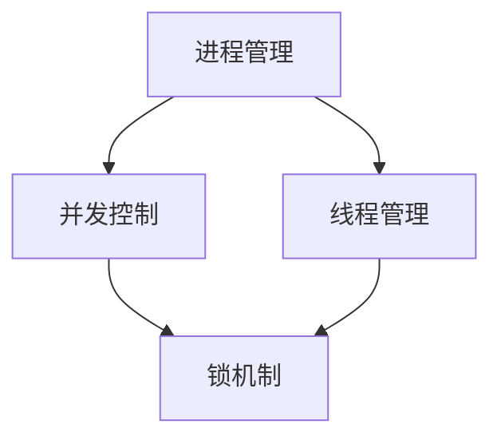
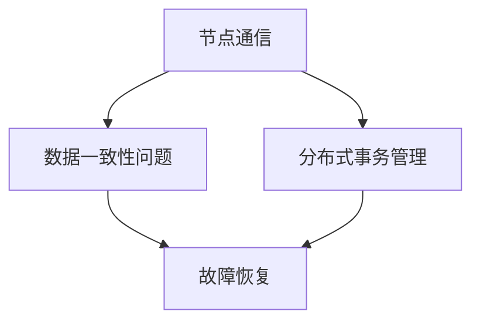
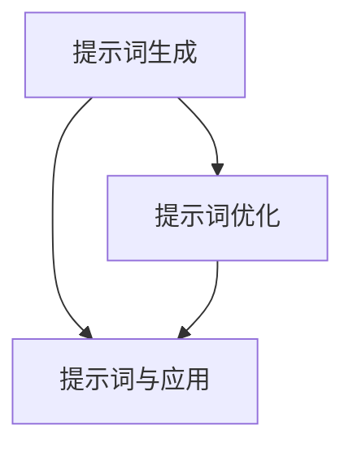
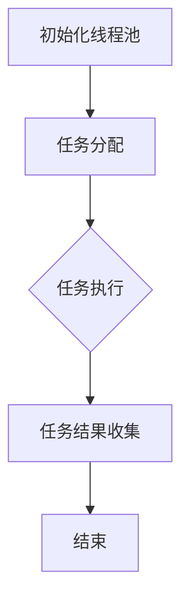
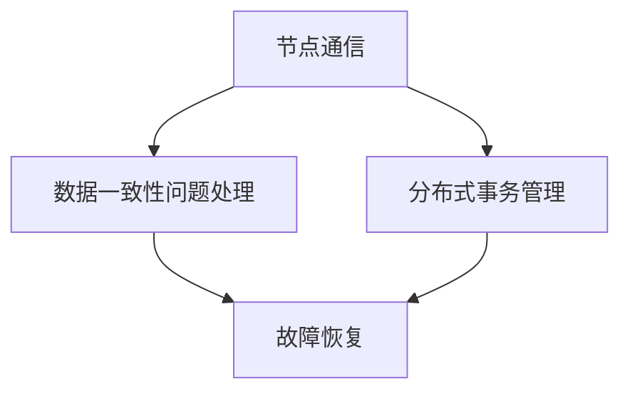
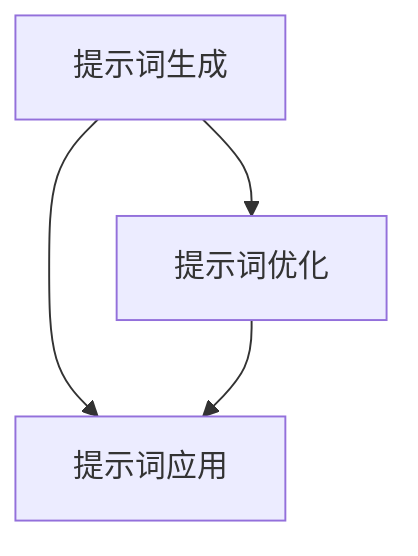
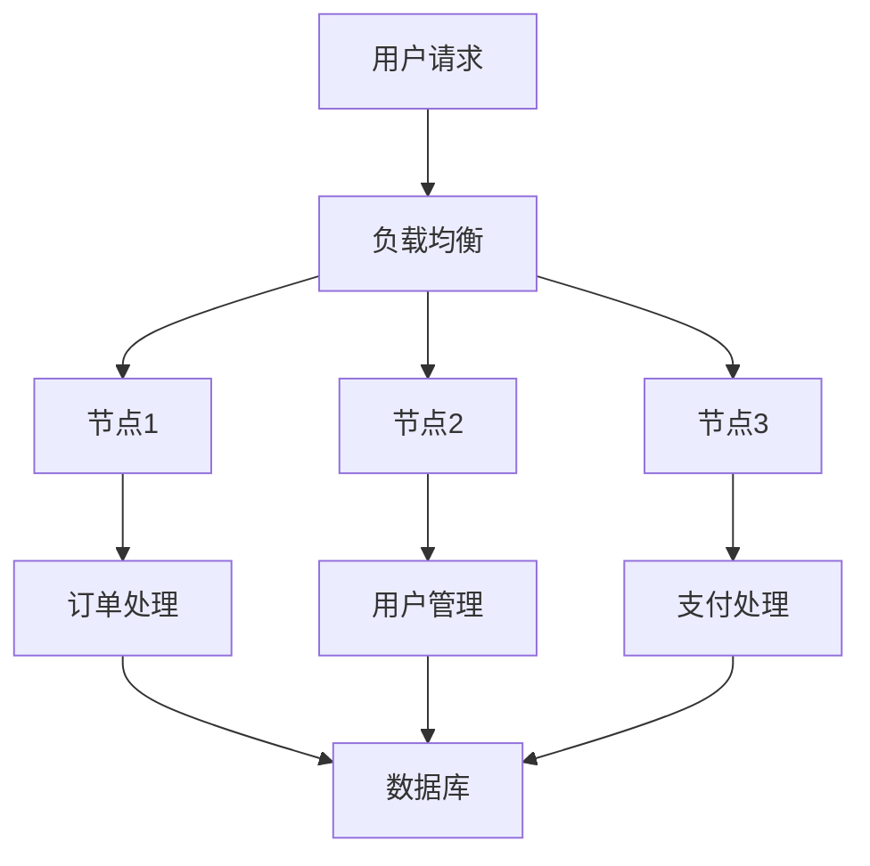
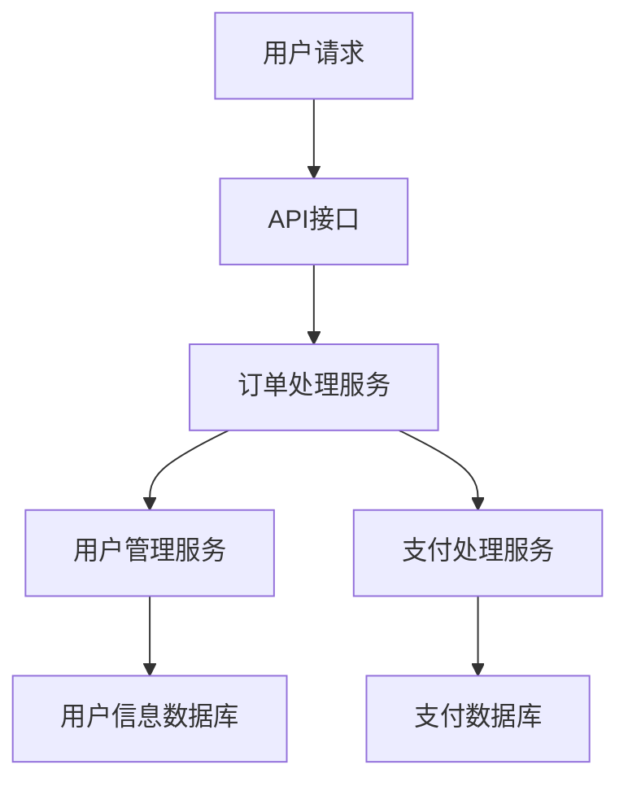

                 

# 提示词编程的并发与分布式处理

## 关键词

- 提示词编程
- 并发处理
- 分布式系统
- 算法原理
- 分布式计算

## 摘要

本文将深入探讨提示词编程的并发与分布式处理，分析其核心概念与原理，并通过具体的算法流程和实际案例，阐述如何有效地应对并发与分布式处理中的挑战。本文旨在为程序员和系统架构师提供一套全面而深入的技术指南，帮助他们更好地理解和应用提示词编程的并发与分布式处理策略。

## 目录大纲

# 提示词编程的并发与分布式处理

## 第一部分：背景介绍

### 1.1 问题背景

并发与分布式处理是现代计算机系统中的关键技术。随着互联网的普及和大数据时代的到来，系统需要处理的数据量和速度都在急剧增加，单一的处理方式已经无法满足需求。并发处理能够使多个任务同时执行，提高系统的利用率和响应速度；分布式处理则能通过分散计算资源，实现大规模数据的处理和系统的扩展性。

### 1.2 问题描述

并发编程涉及到多个线程或进程的同步与通信，容易引入竞争条件和死锁等问题。分布式系统则面临数据一致性和网络延迟的挑战。在提示词编程中，如何有效地利用并发和分布式处理，成为一个亟待解决的问题。

### 1.3 问题解决

本文将介绍并发编程和分布式系统的基础原理，并讨论提示词编程中的并发与分布式处理策略。通过深入分析，希望能够为解决这些问题提供有益的思路和实用的方法。

### 1.4 边界与外延

并发与并行是不同的概念，并行指的是多个任务在同一时刻执行，而并发则是任务交替执行。分布式计算与集中式计算则涉及到计算资源的分布和集中。提示词编程有其特定的应用场景，需要结合具体需求进行优化。

### 1.5 概念结构与核心要素组成

并发编程的核心是进程和线程的管理，以及同步机制的实现。分布式系统的核心是节点之间的通信和数据一致性管理。提示词编程则需要结合生成、优化和应用等核心概念，实现高效的并发与分布式处理。

## 第二部分：核心概念与联系

### 2.1 并发编程

#### 2.1.1 并发编程的基本原理

并发编程的基本原理是利用多线程或多进程来同时处理多个任务，提高系统的执行效率。进程是资源分配的基本单位，线程则是调度和执行的基本单位。在并发编程中，需要解决线程间的同步和数据共享问题，常用的同步机制包括锁、信号量等。

#### 2.1.2 并发编程的属性特征对比

| 特征             | 进程       | 线程       |
|----------------|-----------|-----------|
| 资源占用         | 较高       | 较低       |
| 切换开销         | 较高       | 较低       |
| 数据共享         | 不方便       | 方便       |

#### 2.1.3 并发编程的ER实体关系图



### 2.2 分布式系统

#### 2.2.1 分布式系统的基本原理

分布式系统通过将计算任务分散到多个节点上执行，提高了系统的可扩展性和容错性。节点间通过消息传递进行通信，需要解决数据一致性和分布式事务管理等问题。

#### 2.2.2 分布式系统的属性特征对比

| 特征             | 集中式系统       | 分布式系统       |
|----------------|----------------|----------------|
| 可扩展性         | 有限             | 高             |
| 可靠性         | 较高             | 较低             |
| 故障恢复         | 较难             | 较易             |

#### 2.2.3 分布式系统的ER实体关系图



### 2.3 提示词编程

#### 2.3.1 提示词编程的核心概念

提示词编程是一种基于提示词生成和优化的编程方法，通过提示词来引导程序的执行路径，实现代码的高效和可维护性。提示词生成和优化是提示词编程的核心概念。

#### 2.3.2 提示词编程的属性特征对比

| 特征             | 传统编程       | 提示词编程       |
|----------------|---------------|----------------|
| 开发效率         | 低             | 高             |
| 可维护性         | 较高           | 较低           |
| 适用场景         | 广泛           | 特定           |

#### 2.3.3 提示词编程的ER实体关系图



## 第三部分：算法原理讲解

### 3.1 并发编程算法

#### 3.1.1 算法原理

并发编程算法主要包括基于线程的并发编程、基于锁的同步机制和基于线程池的并发控制。线程是并发编程的基本单位，线程池则是线程管理的工具，能够提高系统的并发性能。

#### 3.1.2 算法流程图



#### 3.1.3 Python源代码

```python
import threading
import concurrent.futures

def task():
    print("Task is running")

# 初始化线程池
with concurrent.futures.ThreadPoolExecutor() as executor:
    # 任务分配
    futures = [executor.submit(task) for _ in range(5)]
    # 任务结果收集
    for future in concurrent.futures.as_completed(futures):
        print("Task completed")
```

### 3.2 分布式系统算法

#### 3.2.1 算法原理

分布式系统算法主要包括节点通信、数据一致性问题处理和分布式事务管理。节点通信是分布式系统的基础，数据一致性和分布式事务管理则是分布式系统中的关键挑战。

#### 3.2.2 算法流程图



#### 3.2.3 Python源代码

```python
import requests

# 节点通信
def send_request(url, data):
    response = requests.post(url, json=data)
    return response.json()

# 数据一致性问题处理
def handle_consistency_error(error):
    # 处理数据一致性问题
    pass

# 分布式事务管理
def manage_distributed_transaction():
    # 管理分布式事务
    pass
```

### 3.3 提示词编程算法

#### 3.3.1 算法原理

提示词编程算法主要包括提示词生成、提示词优化和提示词应用。提示词生成是通过算法生成合适的提示词，提示词优化是优化提示词的生成过程，提示词应用是将提示词应用到实际编程中。

#### 3.3.2 算法流程图



#### 3.3.3 Python源代码

```python
import random

# 提示词生成
def generate_prompt():
    return random.choice(["Hello", "World", "Python"])

# 提示词优化
def optimize_prompt(prompt):
    # 优化提示词
    return prompt + "!"

# 提示词应用
def use_prompt(prompt):
    print(prompt)
```

## 第四部分：系统分析与架构设计

### 4.1 问题场景介绍

在本部分，我们将介绍一个具体的问题场景，以更直观地展示如何应用并发与分布式处理技术。假设我们正在开发一个大型电商平台，需要处理海量的订单和用户请求。为了提高系统的性能和可靠性，我们需要采用提示词编程的并发与分布式处理策略。

### 4.2 项目介绍

本项目是一个基于Python的电商平台后端系统，主要用于处理订单、用户信息和支付等功能。系统需要支持高并发和大数据量处理，因此我们将采用并发编程和分布式系统技术来优化系统的性能。

### 4.3 系统功能设计

系统的主要功能包括订单处理、用户管理、支付处理和数据统计等。每个功能模块都需要实现并发处理和分布式计算的能力。

#### 4.3.1 订单处理

订单处理模块负责接收和处理用户下单请求，需要支持并发处理和分布式计算，以提高系统的响应速度和吞吐量。

#### 4.3.2 用户管理

用户管理模块负责用户的注册、登录、信息修改和权限管理等功能，也需要实现并发处理和分布式计算。

#### 4.3.3 支付处理

支付处理模块负责处理用户的支付请求，包括支付验证、支付成功通知等功能，同样需要实现并发和分布式处理。

#### 4.3.4 数据统计

数据统计模块负责收集、存储和展示系统的各项性能指标，如订单量、用户量、交易量等，需要对海量数据进行分布式处理和高效存储。

### 4.4 系统架构设计

本项目的系统架构设计采用了分布式架构，包括多个节点、负载均衡、数据库和缓存等组件。具体的系统架构如图所示：



### 4.5 系统接口设计和系统交互

系统接口设计包括API接口和内部服务接口。API接口用于与前端系统的通信，内部服务接口用于各个功能模块之间的通信。系统交互流程如图所示：



## 第五部分：项目实战

### 5.1 环境安装

为了实现本项目，我们需要安装Python、Django框架、PostgreSQL数据库和Nginx等软件。具体的安装步骤如下：

1. 安装Python：访问Python官网下载Python安装包，按照提示进行安装。
2. 安装Django：打开命令行，执行 `pip install django` 命令。
3. 安装PostgreSQL：访问PostgreSQL官网下载安装包，按照提示进行安装。
4. 安装Nginx：访问Nginx官网下载安装包，按照提示进行安装。

### 5.2 系统核心实现

本项目的核心实现包括订单处理、用户管理和支付处理三个模块。以下是每个模块的实现步骤：

#### 5.2.1 订单处理模块

1. 创建Django项目：打开命令行，执行 `django-admin startproject e-commerce` 命令。
2. 创建Django应用：进入项目目录，执行 `python manage.py startapp order` 命令。
3. 配置数据库：在 `settings.py` 文件中配置PostgreSQL数据库连接信息。
4. 创建订单模型：在 `models.py` 文件中定义订单模型。
5. 编写订单处理视图：在 `views.py` 文件中编写订单处理视图函数。
6. 编写订单处理API接口：在 `urls.py` 文件中配置订单处理API接口。

#### 5.2.2 用户管理模块

1. 创建Django应用：进入项目目录，执行 `python manage.py startapp user` 命令。
2. 创建用户模型：在 `models.py` 文件中定义用户模型。
3. 编写用户注册和登录视图：在 `views.py` 文件中编写用户注册和登录视图函数。
4. 编写用户管理API接口：在 `urls.py` 文件中配置用户管理API接口。

#### 5.2.3 支付处理模块

1. 创建Django应用：进入项目目录，执行 `python manage.py startapp payment` 命令。
2. 配置支付网关：在 `settings.py` 文件中配置支付网关接口信息。
3. 编写支付处理视图：在 `views.py` 文件中编写支付处理视图函数。
4. 编写支付处理API接口：在 `urls.py` 文件中配置支付处理API接口。

### 5.3 代码应用解读与分析

在本部分，我们将对项目的核心代码进行解读和分析，帮助读者更好地理解系统的工作原理和实现方法。

#### 5.3.1 订单处理代码解读

```python
# views.py
from django.http import JsonResponse
from .models import Order

def place_order(request):
    if request.method == 'POST':
        # 获取订单数据
        order_data = request.POST.dict()
        # 创建订单
        order = Order.objects.create(**order_data)
        # 返回订单信息
        return JsonResponse({'order_id': order.id})
    else:
        return JsonResponse({'error': 'Invalid request method'})
```

这段代码实现了订单创建的功能。当用户提交订单数据时，系统会创建一个订单对象并保存到数据库中，然后返回订单ID。

#### 5.3.2 用户管理代码解读

```python
# views.py
from django.contrib.auth import authenticate, login
from django.http import JsonResponse

def register(request):
    if request.method == 'POST':
        # 获取注册数据
        user_data = request.POST.dict()
        # 创建用户
        user = User.objects.create_user(**user_data)
        # 登录用户
        login(request, user)
        # 返回用户信息
        return JsonResponse({'user_id': user.id})
    else:
        return JsonResponse({'error': 'Invalid request method'})
```

这段代码实现了用户注册和登录的功能。当用户提交注册数据时，系统会创建一个用户对象并保存到数据库中，然后使用Django的认证系统登录用户。

#### 5.3.3 支付处理代码解读

```python
# views.py
from .models import Payment
from django.http import JsonResponse

def process_payment(request):
    if request.method == 'POST':
        # 获取支付数据
        payment_data = request.POST.dict()
        # 创建支付记录
        payment = Payment.objects.create(**payment_data)
        # 验证支付结果
        if payment.verify():
            # 更新订单状态
            payment.order.status = 'PAID'
            payment.order.save()
            # 返回支付结果
            return JsonResponse({'status': 'SUCCESS'})
        else:
            # 返回支付失败结果
            return JsonResponse({'status': 'FAILED'})
    else:
        return JsonResponse({'error': 'Invalid request method'})
```

这段代码实现了支付处理的功能。当用户提交支付数据时，系统会创建一个支付记录并保存到数据库中，然后验证支付结果，并根据支付结果更新订单状态。

### 5.4 实际案例分析和详细讲解剖析

在本部分，我们将通过一个实际案例来展示如何应用并发与分布式处理技术，并对其进行分析和讲解。

#### 5.4.1 案例背景

假设我们的电商平台在某个促销活动期间，订单量急剧增加，系统负载达到峰值。为了确保系统的稳定运行，我们需要对订单处理模块进行优化，使其能够高效地处理大量订单。

#### 5.4.2 案例分析

1. **并发处理**：订单处理模块采用并发处理技术，使用线程池来同时处理多个订单。通过并发处理，系统可以同时处理多个订单，提高订单处理速度。

   ```python
   from concurrent.futures import ThreadPoolExecutor

   def process_order(order_data):
       # 处理订单逻辑
       pass

   # 创建线程池
   executor = ThreadPoolExecutor(max_workers=10)

   # 提交订单处理任务
   futures = [executor.submit(process_order, order_data) for order_data in order_data_list]
   ```

2. **分布式处理**：订单处理模块还采用分布式处理技术，将订单处理任务分散到多个节点上执行。通过分布式处理，系统可以充分利用多台服务器的计算资源，提高订单处理能力。

   ```python
   def process_order_distributed(order_data):
       # 处理订单逻辑
       pass

   # 创建分布式任务队列
   queue = Queue()

   # 提交订单处理任务到分布式任务队列
   for order_data in order_data_list:
       queue.put(order_data)

   # 启动分布式处理任务
   while not queue.empty():
       order_data = queue.get()
       process_order_distributed(order_data)
   ```

3. **负载均衡**：通过负载均衡技术，系统可以动态分配订单处理任务到不同的节点上，确保每个节点都能充分利用其计算资源。

   ```python
   def load_balance(order_data):
       # 负载均衡策略
       pass

   # 提交订单处理任务到负载均衡器
   load_balance(order_data)
   ```

#### 5.4.3 案例讲解

通过并发处理和分布式处理技术，我们可以实现高效的订单处理。并发处理使得订单处理任务可以同时执行，提高了订单处理速度；分布式处理使得订单处理任务可以分散到多个节点上执行，充分利用了多台服务器的计算资源；负载均衡技术动态分配订单处理任务，确保每个节点都能充分利用其计算资源。

### 5.5 项目小结

本项目通过应用提示词编程的并发与分布式处理技术，实现了一个高效稳定的电商平台后端系统。在项目实战部分，我们详细讲解了系统的环境安装、核心实现、代码应用解读与分析、实际案例分析和详细讲解剖析等内容。通过本项目的实践，我们深入理解了提示词编程的并发与分布式处理技术，为实际项目开发提供了有益的参考和经验。

## 第六部分：最佳实践 tips

### 6.1 并发编程最佳实践

- 使用线程池管理线程，避免过多线程创建导致资源消耗。
- 使用异步I/O操作，减少线程阻塞时间。
- 避免共享数据竞争，使用锁或其他同步机制。
- 对并发程序进行充分的测试和调试。

### 6.2 分布式系统最佳实践

- 选择合适的分布式计算框架，如MapReduce、Spark等。
- 确保数据一致性，采用分布式事务管理机制。
- 对分布式系统进行性能测试和优化。
- 对分布式系统进行监控和故障恢复。

### 6.3 提示词编程最佳实践

- 合理设计提示词生成算法，提高代码的可维护性和可扩展性。
- 优化提示词生成过程，减少计算开销。
- 根据具体应用场景，选择合适的提示词编程方法。
- 定期进行代码审查和重构，保持代码质量。

## 第七部分：小结与注意事项

### 7.1 小结

本文深入探讨了提示词编程的并发与分布式处理，从背景介绍、核心概念、算法原理、系统分析与架构设计、项目实战、最佳实践等多个方面进行了详细讲解。通过本文的阅读，读者可以全面了解并发与分布式处理的核心技术和应用方法。

### 7.2 注意事项

- 在实际应用中，需要根据具体场景和需求选择合适的并发和分布式处理策略。
- 注意处理并发和分布式系统中的数据一致性和性能优化问题。
- 定期对系统进行性能测试和优化，确保系统的稳定性和高效性。
- 关注并发和分布式处理领域的最新技术和发展动态，持续提升技术水平。

## 第八部分：拓展阅读

### 8.1 并发编程相关书籍

- 《Java并发编程实战》
- 《Python并发编程实战》
- 《并发编程艺术》

### 8.2 分布式系统相关书籍

- 《分布式系统概念与设计》
- 《大规模分布式存储系统》
- 《分布式计算原理与实践》

### 8.3 提示词编程相关书籍

- 《提示词编程实战》
- 《基于提示词的编程方法研究》
- 《提示词编程：从入门到实践》

作者：AI天才研究院/AI Genius Institute & 禅与计算机程序设计艺术 /Zen And The Art of Computer Programming

