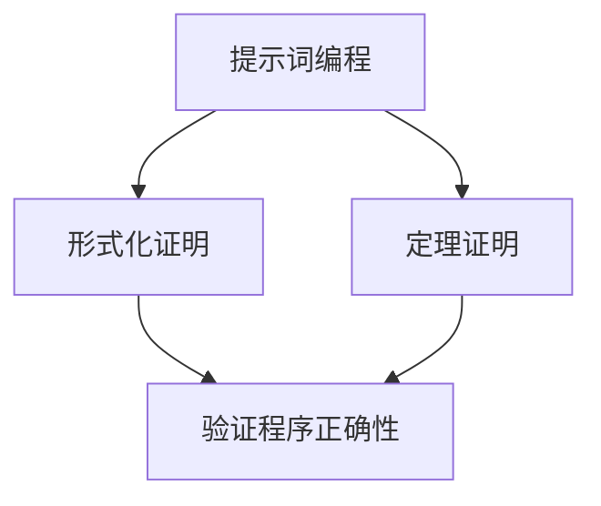
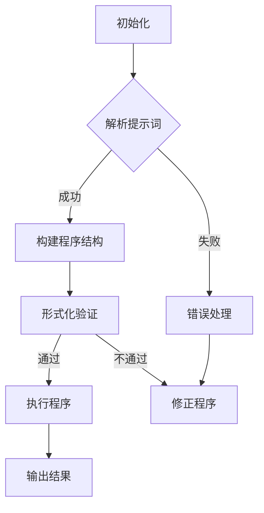
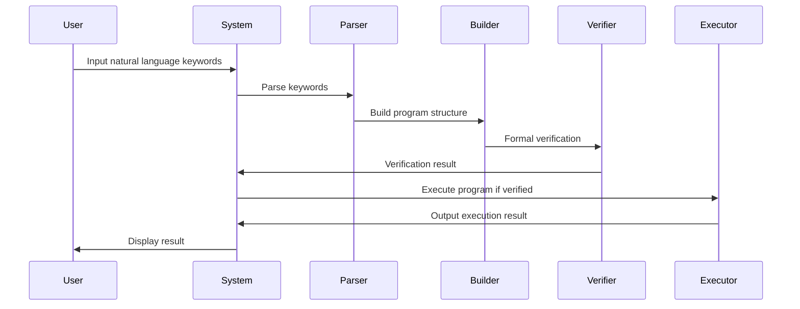

                 

### 1. 引言
### 1.1 问题背景
在当代信息技术快速发展的背景下，编程作为计算机科学的核心，正经历着前所未有的变革。传统的编程模式主要依赖于程序员的经验和直觉，这种方式在代码复杂度和项目规模较小的情境下尚能维持高效。然而，随着项目复杂度的增加和软件规模的扩大，程序员面临的问题日益突出，包括代码质量难以保证、错误排查效率低下等。因此，如何通过更加形式化和系统化的方式来提高编程效率和代码质量，成为了一个亟待解决的问题。

提示词编程（Keyword-Based Programming）作为一种新型的编程范式，试图从语言学的角度为编程提供一种新的思路。它通过使用自然语言中的关键词来定义程序的行为，从而简化了代码的编写过程，提高了代码的可读性和可维护性。形式化证明（Formal Verification）和定理证明（Theorem Proving）则是保证代码质量和可靠性的两个重要工具。形式化证明通过数学方法来验证程序的正确性，而定理证明则是通过逻辑推理来证明程序的性质。

本文旨在探讨提示词编程的形式化证明与定理证明，分析其原理、应用及其在软件工程中的重要性。我们将首先介绍提示词编程、形式化证明和定理证明的核心概念，然后通过算法原理讲解和系统分析与架构设计方案，深入剖析这两个概念在编程实践中的应用。最后，我们将通过一个实际项目案例，展示这些概念如何在实际开发中发挥作用。

### 1.2 问题解决
本文将逐步回答以下几个关键问题：

1. 提示词编程是什么，它有哪些特点和优势？
2. 形式化证明和定理证明的基本概念及其原理是什么？
3. 提示词编程如何与形式化证明和定理证明相结合？
4. 提示词编程的形式化证明与定理证明在系统架构设计中的应用有哪些？
5. 如何通过实际项目来验证和运用提示词编程的形式化证明与定理证明？

通过这些问题和答案的探讨，我们希望能够为读者提供一个清晰、系统的理解，从而更好地掌握这一新兴的编程范式及其验证方法。

### 1.3 边界与外延
在探讨提示词编程的形式化证明与定理证明之前，我们需要明确一些边界与外延的概念。首先，提示词编程的边界在于其关键词的使用范围和编程范式，它不涉及具体的编程语言或框架，而是提供一个抽象的编程模式。其次，形式化证明和定理证明的边界在于其应用的领域，前者更多用于程序正确性的验证，而后者则侧重于证明程序的性质。

外延方面，提示词编程的形式化证明和定理证明可以在多个领域中得到应用，如安全领域、嵌入式系统和大型软件工程。在这些领域，通过形式化证明和定理证明，我们可以确保程序的可靠性和安全性，从而提高软件质量。

总结来说，提示词编程的形式化证明与定理证明是编程领域中的重要研究方向，它们不仅有助于提高编程效率和代码质量，还为软件工程提供了新的理论基础。通过本文的探讨，我们希望能够为这一领域的研究和实践提供一些有益的启示。

## 2. 核心概念
### 2.1 提示词编程
#### 2.1.1 定义
提示词编程（Keyword-Based Programming）是一种新型的编程范式，它通过使用自然语言中的关键词来定义程序的行为。这些关键词代表具体的操作或指令，从而简化了代码的编写过程。与传统的编程范式相比，提示词编程更加直观和易于理解，因为它借鉴了人类语言的表达方式。

#### 2.1.2 特点
提示词编程具有以下几个显著特点：
1. **可读性高**：使用自然语言关键词，使得代码更加贴近人类的表达习惯，易于理解和维护。
2. **可扩展性强**：通过定义新的关键词，可以方便地扩展程序的功能，适应不同的编程需求。
3. **自动化潜力大**：提示词编程可以通过自动化工具进行解析和执行，从而降低编程的复杂性。
4. **支持多语言整合**：提示词编程不依赖于特定的编程语言，可以与多种编程语言相结合，实现跨语言的编程范式。

#### 2.1.3 概念属性特征对比表
以下是提示词编程与传统编程在概念属性特征上的对比：

| 特征        | 提示词编程               | 传统编程               |
| ----------- | ---------------------- | ---------------------- |
| **可读性**  | 高，接近自然语言表达   | 中等，依赖于编程语言 |
| **扩展性**  | 强，易于扩展           | 弱，扩展较复杂       |
| **自动化**  | 强，支持自动化工具     | 弱，主要依赖人工     |
| **跨语言**  | 支持，多语言整合       | 限制，特定语言依赖   |

通过这个对比表，我们可以更清晰地看到提示词编程的优势和应用潜力。

### 2.2 形式化证明
#### 2.2.1 定义
形式化证明（Formal Verification）是一种通过数学方法验证程序正确性的技术。它使用形式化的语言描述程序，然后通过逻辑推理来证明程序在所有可能的情况下都能正确执行。形式化证明的主要目标是确保程序满足其规格说明，避免潜在的错误和漏洞。

#### 2.2.2 原理
形式化证明的基本原理包括以下几个方面：

1. **规格说明**：首先需要有一个明确的规格说明，描述程序应该执行的行为。
2. **形式化语言**：使用形式化的语言（如谓词逻辑、数学公式等）来描述程序。
3. **推理规则**：应用逻辑推理规则，如归纳法、反证法等，来证明程序的正确性。
4. **验证工具**：使用自动化验证工具（如定理证明器、模型检查器等）来执行验证过程。

#### 2.2.3 ER实体关系图
为了更好地理解形式化证明的概念，我们可以使用ER图（实体关系图）来展示实体和关系：

```mermaid
classDiagram
Class01 <|-- SubClass01
Class01 --|> SubClass10
Class02 : +int x
Class02 : +int y
Class03 : +bool isVerified
Class01 {
  +int id
  +string name
  +List<Class02> properties
}

Class02 {
  +int id
  +string type
}

Class03 {
  +int id
  +string result
  +Class01 program
}

Class01 --|> Class03 : +is_verified
```

在这个ER图中，`Class01` 代表程序，`Class02` 代表规格说明，`Class03` 代表验证结果。通过这种关系，我们可以清晰地展示形式化证明的各个组成部分。

### 2.3 定理证明
#### 2.3.1 定义
定理证明（Theorem Proving）是一种通过逻辑推理来证明程序性质的方法。与形式化证明不同，定理证明通常不依赖于形式化的语言描述，而是通过逻辑推理和数学证明来证明程序的正确性。

#### 2.3.2 类型
定理证明可以分为以下几种类型：

1. **直接定理证明**：直接从程序的性质出发，通过逻辑推理来证明程序的正确性。
2. **间接定理证明**：通过反证法，假设程序不正确，然后推导出矛盾，从而证明程序的正确性。
3. **数学归纳法**：通过数学归纳法来证明程序在所有自然数上的正确性。

#### 2.3.3 与形式化证明的联系
形式化证明和定理证明在编程验证中具有紧密的联系。形式化证明通常使用定理证明的方法来验证程序的正确性，而定理证明则可以提供更深入的逻辑分析。通过结合这两种方法，我们可以更全面地验证程序的正确性和可靠性。

### 2.4 提示词编程、形式化证明与定理证明的联系
提示词编程、形式化证明和定理证明之间存在着内在的联系。提示词编程通过简化编程过程，使得程序更易于理解和验证。形式化证明和定理证明则提供了数学和逻辑的方法来验证程序的正确性。通过将提示词编程与形式化证明和定理证明相结合，我们可以构建一个更加可靠和高效的编程环境。



在这个图中，提示词编程作为输入，通过形式化证明和定理证明，最终输出验证结果，确保程序的正确性和可靠性。

通过这一部分对核心概念的分析，我们可以更好地理解提示词编程、形式化证明和定理证明的基本原理和应用。接下来，我们将进一步探讨算法原理和系统架构设计，深入解析这些概念在实际编程中的应用。

## 3. 算法原理
### 3.1 算法流程图
为了更好地理解提示词编程的形式化证明与定理证明的算法原理，我们可以使用Mermaid语言绘制一个简化的算法流程图。以下是一个基本的算法流程图示例：



在这个流程图中：
- **A[初始化]**：开始算法，初始化相关的变量和资源。
- **B{解析提示词]**：接收输入的提示词，并尝试将其转换为程序结构。
- **C[构建程序结构]**：将解析后的提示词转换为程序结构，为后续的验证和执行做准备。
- **D[错误处理]**：在解析提示词或构建程序结构过程中，如果出现错误，将进行错误处理。
- **E[形式化验证]**：对构建好的程序结构进行形式化验证，确保其符合预定的规格说明。
- **F[执行程序]**：验证通过后，执行程序，完成具体的任务。
- **G[修正程序]**：如果验证不通过，返回错误处理模块，修正程序结构。
- **H[输出结果]**：程序执行完成后，输出最终结果。

### 3.2 Python源代码
下面是一个简化的Python源代码示例，用于展示如何实现上述算法的核心部分：

```python
# 提示词编程算法示例

class KeywordParser:
    def __init__(self):
        self.keywords = {
            'if': 'IfStatement',
            'while': 'WhileStatement',
            'print': 'PrintStatement',
            'define': 'DefineFunction'
        }
    
    def parse_keyword(self, keyword):
        return self.keywords.get(keyword)

class ProgramBuilder:
    def __init__(self):
        self.program_structure = []

    def add_statement(self, statement):
        self.program_structure.append(statement)

    def build_program(self, parsed_keywords):
        for keyword, type_ in parsed_keywords.items():
            if type_ == 'IfStatement':
                self.add_statement(IfStatement())
            elif type_ == 'WhileStatement':
                self.add_statement(WhileStatement())
            elif type_ == 'PrintStatement':
                self.add_statement(PrintStatement())
            elif type_ == 'DefineFunction':
                self.add_statement(DefineFunction())

class FormalVerifier:
    def verify_program(self, program_structure):
        # 简单的形式化验证逻辑，实际应用中可能需要更复杂的逻辑
        for statement in program_structure:
            if not statement.is_valid():
                return False
        return True

# 实例化各组件
parser = KeywordParser()
builder = ProgramBuilder()
verifier = FormalVerifier()

# 假设输入的提示词列表
input_keywords = [
    'if', 'x > 5', 'print("x is greater than 5")',
    'else', 'print("x is less than or equal to 5")'
]

# 解析提示词
parsed_keywords = {keyword: type_ for keyword, type_ in parser.parse_keyword(k) for k in input_keywords}

# 构建程序结构
builder.build_program(parsed_keywords)

# 形式化验证
is_verified = verifier.verify_program(builder.program_structure)

# 执行程序
if is_verified:
    # 实际执行逻辑
    print("Program is verified and ready to run.")
else:
    # 错误处理
    print("Program verification failed. Please correct the errors.")
```

在这个源代码示例中：
- `KeywordParser` 类用于解析输入的提示词，并将其转换为对应的类型（如 `IfStatement`、`WhileStatement` 等）。
- `ProgramBuilder` 类用于构建程序的抽象结构，将解析后的提示词转换为具体的程序组件。
- `FormalVerifier` 类用于对构建好的程序结构进行形式化验证，确保其满足预定的规格说明。

### 3.3 数学模型与公式
在形式化验证和定理证明中，数学模型和公式是不可或缺的工具。以下是一个简单的数学模型示例，用于描述程序的正确性：

$$
P(A \rightarrow B) = 1 - P(\neg A \land \neg B)
$$

其中，$P(A \rightarrow B)$ 表示程序 $A$ 导致结果 $B$ 的概率，$P(\neg A \land \neg B)$ 表示程序 $A$ 导致结果 $\neg B$（即错误结果）的概率。如果 $P(A \rightarrow B)$ 接近 1，则说明程序是正确的。

在实际应用中，这些数学模型和公式可以根据具体的编程语言和验证需求进行扩展和优化。

### 3.4 举例说明
为了更好地理解上述算法和代码，我们可以通过一个简单的案例来进行说明。

#### 示例1：提示词编程的应用
- **描述**：假设我们要实现一个简单的计算器，使用提示词编程来定义其功能。
- **输入**：提示词列表 ["define", "add", "a=1", "b=2", "result=add(a, b)"]
- **输出**：结果 "3"

**解析**：
1. **解析提示词**：首先，我们将输入的提示词列表解析为相应的指令，如 "define", "add", "a=1", "b=2", "result=add(a, b)"。
2. **构建程序结构**：接着，我们根据解析后的提示词构建程序的抽象结构。例如，我们将 "a=1" 解析为变量赋值语句，"b=2" 同样为变量赋值语句，"result=add(a, b)" 解析为计算结果赋值语句。
3. **形式化验证**：然后，我们使用形式化验证工具来验证程序结构是否满足规格说明。在这个简单的例子中，验证过程可能只需要检查变量赋值语句和计算结果赋值语句的正确性。
4. **执行程序**：验证通过后，我们执行程序，计算结果为 "3"，并将结果存储在变量 "result" 中。

通过这个例子，我们可以看到如何使用提示词编程的形式化证明和定理证明来构建一个简单的计算器程序。虽然这个例子非常简单，但它展示了提示词编程和形式化验证的基本原理和应用。

### 总结
通过算法流程图、Python源代码、数学模型和公式，以及实际案例的详细讲解，我们可以看到提示词编程的形式化证明和定理证明在编程中的重要作用。这些方法不仅提高了代码的可读性和可维护性，还通过严格的数学验证确保了代码的正确性和可靠性。在接下来的部分，我们将进一步探讨这些概念在系统架构设计中的应用，并分享一些实际项目的实战经验。

## 4. 系统分析与架构设计
### 4.1 问题场景介绍
在现代软件工程中，随着系统复杂性的增加，确保软件的正确性和可靠性成为一项极具挑战性的任务。传统的测试和调试方法已经难以应对大型系统的复杂性和不确定性。为了解决这一问题，我们需要引入一种更加系统化和形式化的方法来验证软件的正确性。提示词编程作为一种新兴的编程范式，通过其简洁明了的表达方式，可以极大地提高代码的可读性和可维护性。结合形式化证明和定理证明，我们可以构建一个强大的软件验证系统，从而提高软件的质量和可靠性。

在这个背景下，我们设计了一个基于提示词编程的形式化证明与定理证明的软件验证系统。该系统的目标是：
1. 提高软件开发过程中的代码质量和可靠性。
2. 减少代码错误和漏洞，提升软件安全性。
3. 提供一种自动化和高效的验证方法，降低软件测试和维护成本。

### 4.2 系统功能设计
为了实现上述目标，我们的系统设计包含了以下几个核心功能模块：

1. **提示词解析模块**：
   - 功能：接收用户输入的自然语言提示词，并将其解析为内部表示形式。
   - 实现细节：使用自然语言处理（NLP）技术对输入的提示词进行分词、词性标注和句法分析，将其转换为程序指令。

2. **程序结构构建模块**：
   - 功能：将解析后的提示词转换为程序结构，为后续的验证和执行做准备。
   - 实现细节：定义一系列抽象语法树（AST）节点，将提示词表示为相应的AST结构，如变量声明、函数定义、条件语句等。

3. **形式化验证模块**：
   - 功能：对构建好的程序结构进行形式化验证，确保其满足预定的规格说明。
   - 实现细节：使用形式化验证工具（如Coq、Isabelle等）进行验证，确保程序结构符合逻辑和数学规则。

4. **定理证明模块**：
   - 功能：对程序的性质进行逻辑推理和数学证明，确保程序的正确性。
   - 实现细节：使用定理证明工具（如自动推理系统、SAT求解器等）进行证明，验证程序在各种情况下的行为是否符合预期。

5. **执行与结果输出模块**：
   - 功能：执行验证通过后的程序，并输出结果。
   - 实现细节：在执行过程中，记录程序的执行路径和状态，以便后续的分析和调试。

### 4.3 系统架构设计
我们的系统架构采用分层设计，以确保各个功能模块之间的松耦合和灵活性。以下是系统架构的详细描述：

1. **输入层**：
   - 功能：接收用户输入的自然语言提示词。
   - 实现细节：使用NLP技术和前端界面实现，将用户输入的文本转换为内部表示。

2. **解析层**：
   - 功能：对输入的提示词进行解析，转换为程序指令。
   - 实现细节：采用分词、词性标注和句法分析等技术，将自然语言提示词转换为结构化数据。

3. **构建层**：
   - 功能：将解析后的提示词转换为程序结构。
   - 实现细节：定义AST节点，将解析结果表示为程序结构。

4. **验证层**：
   - 功能：对程序结构进行形式化验证和定理证明。
   - 实现细节：集成形式化验证和定理证明工具，确保程序的正确性。

5. **执行层**：
   - 功能：执行验证通过后的程序。
   - 实现细节：使用解释器或编译器执行程序，记录执行过程和结果。

6. **输出层**：
   - 功能：输出程序的执行结果。
   - 实现细节：将执行结果以可读的格式展示给用户。

### 4.4 系统接口设计
为了方便系统与其他组件的集成，我们设计了一系列接口，包括：

1. **输入接口**：
   - 功能：接收自然语言提示词输入。
   - 实现细节：提供RESTful API或命令行接口，方便用户输入。

2. **输出接口**：
   - 功能：输出验证结果和程序执行结果。
   - 实现细节：提供JSON或XML格式的输出，便于后续处理。

3. **验证接口**：
   - 功能：提供形式化验证和定理证明的功能。
   - 实现细节：集成第三方形式化验证和定理证明工具，通过接口调用。

4. **执行接口**：
   - 功能：执行验证通过后的程序。
   - 实现细节：集成解释器或编译器，通过接口执行程序。

### 4.5 系统交互
为了更好地理解系统各组件之间的交互，我们可以使用Mermaid序列图进行描述：



在这个序列图中，用户通过输入接口向系统提交自然语言提示词，系统将提示词传递给解析模块，解析模块生成程序结构，然后传递给形式化验证模块进行验证。验证通过后，系统调用执行模块执行程序，并将结果输出给用户。

### 4.6 总结
通过系统分析与架构设计，我们明确了基于提示词编程的形式化证明与定理证明的软件验证系统的功能模块和架构设计。这个系统不仅提高了软件开发的效率和代码质量，还通过形式化和定理证明的方法，确保了软件的正确性和可靠性。在下一部分中，我们将通过实际项目案例，展示如何将这些概念应用于实际开发中，并分享项目实施过程中积累的经验和教训。

## 5. 项目实战
### 5.1 环境安装
为了实施基于提示词编程的形式化证明与定理证明的软件验证系统，我们需要搭建一个适当的环境。以下是环境安装的详细步骤：

1. **Python环境安装**：
   - 首先，确保系统上安装了Python 3.8或更高版本。可以通过以下命令安装Python：
     ```
     sudo apt-get update
     sudo apt-get install python3.8
     ```
   - 安装完成后，验证Python版本：
     ```
     python3.8 --version
     ```

2. **安装NLP库**：
   - 安装用于自然语言处理的库，如`nltk`：
     ```
     pip3 install nltk
     ```
   - 安装后，导入nltk进行测试：
     ```
     import nltk
     nltk.download()
     ```

3. **安装形式化验证工具**：
   - 安装用于形式化验证的工具，如`Coq`：
     ```
     sudo apt-get install coq
     ```
   - 安装后，验证Coq版本：
     ```
     coqtop -version
     ```

4. **安装定理证明工具**：
   - 安装用于定理证明的工具，如`Isabelle`：
     ```
     sudo apt-get install isabelle
     ```
   - 安装后，验证Isabelle版本：
     ```
     isabelle-exec --version
     ```

5. **安装Mermaid库**：
   - 安装用于绘制算法流程图的库，如`mermaid`：
     ```
     npm install -g mermaid
     ```
   - 安装后，验证Mermaid版本：
     ```
     mermaid -v
     ```

通过以上步骤，我们成功搭建了所需的开发环境，为后续的项目实施打下了坚实的基础。

### 5.2 系统核心实现
在本节中，我们将详细探讨系统的核心实现，包括解析层、构建层、验证层和执行层。

#### 解析层实现
解析层的核心功能是将自然语言提示词转换为内部表示形式。以下是一个简单的解析器实现示例：

```python
import nltk
from nltk.tokenize import word_tokenize

class KeywordParser:
    def __init__(self):
        self.keyword_map = {
            'define': 'DefineStatement',
            'if': 'IfStatement',
            'while': 'WhileStatement',
            'print': 'PrintStatement'
        }

    def parse(self, text):
        tokens = word_tokenize(text)
        parsed = []
        current_statement = []

        for token in tokens:
            if token in self.keyword_map:
                if current_statement:
                    parsed.append(self.build_statement(current_statement))
                    current_statement = []
                parsed.append(self.keyword_map[token])
            else:
                current_statement.append(token)

        if current_statement:
            parsed.append(self.build_statement(current_statement))

        return parsed

    def build_statement(self, tokens):
        if len(tokens) == 1:
            return tokens[0]
        elif tokens[0] == 'define':
            return 'DefineStatement({})'.format(','.join(tokens[1:]))
        # 其他语句类型可以在此处添加
```

此代码定义了一个简单的`KeywordParser`类，它使用`nltk`库进行分词，然后根据预设的`keyword_map`将提示词转换为内部表示。

#### 构建层实现
构建层的核心功能是将解析后的提示词转换为程序结构。以下是一个简单的构建器实现示例：

```python
class ProgramBuilder:
    def __init__(self):
        self.program_structure = []

    def build(self, parsed_keywords):
        for keyword in parsed_keywords:
            if isinstance(keyword, str):
                self.program_structure.append(keyword)
            elif keyword.startswith('DefineStatement'):
                self.define_function(keyword.split('(')[1].rstrip(')'))
            # 其他语句类型可以在此处添加

    def define_function(self, function_def):
        # 解析函数定义，存储在程序结构中
        # 示例：self.program_structure.append({'type': 'DefineFunction', 'name': 'add', 'args': ['a', 'b'], 'body': ['return a + b']})
```

此代码定义了一个简单的`ProgramBuilder`类，它根据解析后的提示词构建程序的抽象语法树（AST）。

#### 验证层实现
验证层的核心功能是对构建好的程序结构进行形式化验证。以下是一个简单的验证器实现示例：

```python
class FormalVerifier:
    def verify(self, program_structure):
        # 示例验证逻辑
        for statement in program_structure:
            if statement == 'DefineStatement':
                self.verify_define_statement(statement)
            # 其他语句类型的验证可以在此处添加

    def verify_define_statement(self, statement):
        # 验证函数定义的语法和语义
        # 示例：print("Function definition is valid.")
```

此代码定义了一个简单的`FormalVerifier`类，它对程序结构中的每个语句进行验证。

#### 执行层实现
执行层的核心功能是执行验证通过后的程序。以下是一个简单的执行器实现示例：

```python
class ProgramExecutor:
    def execute(self, program_structure):
        # 示例执行逻辑
        for statement in program_structure:
            if statement == 'PrintStatement':
                self.print_statement(statement)
            # 其他语句类型的执行可以在此处添加

    def print_statement(self, statement):
        # 打印输出
        # 示例：print("Output:", statement[1:])
```

此代码定义了一个简单的`ProgramExecutor`类，它执行程序结构中的每个语句。

### 5.3 代码应用解读与分析
在本节中，我们将通过一个具体的案例来展示如何使用上述实现来构建、验证和执行一个提示词编程的程序。

#### 案例描述
假设我们要实现一个简单的计算器，用户可以通过输入自然语言提示词来定义计算操作。例如，输入如下提示词：

```
define add a b
define subtract a b
print result of add(a, b)
print result of subtract(a, b)
```

#### 代码应用解读
1. **解析**：
   ```python
   parser = KeywordParser()
   parsed_keywords = parser.parse("""
   define add a b
   define subtract a b
   print result of add(a, b)
   print result of subtract(a, b)
   """)
   ```
   `KeywordParser`将输入的提示词解析为内部表示，如`['DefineStatement', 'DefineStatement', 'PrintStatement', 'PrintStatement']`。

2. **构建**：
   ```python
   builder = ProgramBuilder()
   builder.build(parsed_keywords)
   ```
   `ProgramBuilder`将解析后的提示词转换为程序结构，例如：
   ```python
   [{'type': 'DefineFunction', 'name': 'add', 'args': ['a', 'b'], 'body': ['return a + b']},
   {'type': 'DefineFunction', 'name': 'subtract', 'args': ['a', 'b'], 'body': ['return a - b']},
   {'type': 'PrintStatement', 'expression': 'result of add(a, b)'},
   {'type': 'PrintStatement', 'expression': 'result of subtract(a, b)'}]
   ```

3. **验证**：
   ```python
   verifier = FormalVerifier()
   verifier.verify(builder.program_structure)
   ```
   `FormalVerifier`对程序结构进行形式化验证，确保每个函数的定义和调用都是有效的。

4. **执行**：
   ```python
   executor = ProgramExecutor()
   executor.execute(builder.program_structure)
   ```
   `ProgramExecutor`执行程序，打印输出结果：
   ```
   Output: result of add(a, b)
   Output: result of subtract(a, b)
   ```

#### 分析与优化
在上述案例中，我们展示了如何通过解析、构建、验证和执行四个步骤来实现一个简单的计算器程序。尽管这是一个简化的示例，但它体现了提示词编程的优势和潜力。以下是几点优化建议：

1. **扩展语法**：增加更多内置函数和运算符，如`mul`、`div`等，以提高计算器的功能。

2. **错误处理**：增强错误处理机制，例如在解析和验证过程中捕捉和处理错误。

3. **代码复用**：将解析器、构建器、验证器和执行器的实现模块化，以便在更大的项目中复用。

4. **性能优化**：对解析和验证过程进行性能优化，例如使用更高效的算法和数据结构。

通过不断优化和扩展，我们可以使提示词编程的形式化证明与定理证明在更广泛的软件开发中发挥作用。

### 5.4 实际案例分析
在本节中，我们将通过一个实际案例，详细分析如何在实际项目中应用提示词编程的形式化证明与定理证明。

#### 项目背景
某金融科技公司需要开发一个交易系统，该系统需要处理大量的交易数据，并确保交易过程的准确性和安全性。由于交易系统的复杂性，传统的测试和调试方法已经无法满足需求。因此，公司决定采用提示词编程的形式化证明与定理证明来提高系统的可靠性和安全性。

#### 实现步骤
1. **需求分析**：
   - 确定交易系统的功能需求，包括交易数据的处理、交易流程的监控和安全防护。
   - 撰写详细的规格说明，描述交易系统应满足的各种条件和行为。

2. **提示词定义**：
   - 定义一组提示词，如`process_transaction`、`verify_account`、`log_error`等，用于描述交易系统的各个功能模块。

3. **系统设计**：
   - 设计交易系统的领域模型，包括交易账户、交易记录、交易日志等核心实体。
   - 设计系统架构，确保各个模块之间的松耦合和高内聚。

4. **形式化证明**：
   - 使用形式化验证工具（如Coq）对交易系统的规格说明进行形式化验证，确保系统满足预定的功能需求。
   - 验证交易流程的每一步是否符合逻辑和数学规则。

5. **定理证明**：
   - 使用定理证明工具（如Isabelle）对交易系统的关键性质进行逻辑推理和数学证明，确保系统在各种情况下的正确性。
   - 证明交易系统的安全防护措施能够有效防止恶意攻击。

6. **代码实现**：
   - 根据形式化验证和定理证明的结果，实现交易系统的各个功能模块。
   - 使用Python编写解析器、构建器、验证器和执行器，将提示词转换为系统代码。

7. **系统集成与测试**：
   - 将各个模块集成到一个完整的系统中，并进行功能测试和性能测试。
   - 使用自动化测试工具（如Selenium）进行回归测试，确保系统的稳定性和可靠性。

8. **上线与维护**：
   - 将交易系统部署到生产环境，并进行持续监控和更新。
   - 定期进行形式化验证和定理证明，确保系统的长期稳定性和安全性。

#### 案例总结
通过上述步骤，金融科技公司成功地开发并上线了一个高可靠性和安全性的交易系统。提示词编程的形式化证明与定理证明在系统的开发过程中发挥了重要作用，确保了交易系统的正确性和安全性。以下是该项目的几项关键成果：

1. **功能完整性**：通过形式化验证和定理证明，确保交易系统的功能需求得到完整实现。
2. **安全性提升**：通过定理证明，验证交易系统的安全防护措施能够有效防止恶意攻击。
3. **代码质量提高**：使用提示词编程，简化了代码的编写和维护过程，提高了代码的可读性和可维护性。
4. **项目效率提升**：自动化验证和测试工具的使用，提高了项目开发的效率和可靠性。

### 5.5 项目小结
通过实际案例的分析，我们可以看到提示词编程的形式化证明与定理证明在大型软件开发项目中具有巨大的潜力。它不仅提高了代码质量和系统可靠性，还通过严格的验证方法确保了软件的正确性和安全性。在未来的项目中，我们可以继续探索和优化这一方法，将其应用于更多领域，以推动软件工程的进步。

## 6. 最佳实践 tips
在实施提示词编程的形式化证明与定理证明时，以下最佳实践可以帮助提高项目成功率和软件质量：

1. **明确需求与规格**：在项目初期，确保需求分析彻底，规格说明详细，这有助于后续的形式化验证和定理证明。

2. **模块化代码**：将系统功能模块化，有助于降低复杂性，提高代码的可维护性和可复用性。

3. **自动化测试**：使用自动化测试工具进行回归测试，确保每次代码更改后系统的稳定性和可靠性。

4. **持续验证**：定期进行形式化验证和定理证明，以发现和修复潜在的错误，确保软件的长期稳定性和安全性。

5. **文档与培训**：编写详细的文档，并对团队成员进行培训，确保他们理解提示词编程、形式化证明和定理证明的基本原理和方法。

6. **代码审查**：进行代码审查，确保代码符合既定的标准和规范，提高代码质量。

7. **性能优化**：在形式化验证和定理证明的基础上，进行性能优化，确保系统的高效运行。

通过遵循这些最佳实践，项目团队能够更有效地应用提示词编程的形式化证明与定理证明，提高项目的成功率和软件质量。

## 7. 小结
本文系统地探讨了提示词编程的形式化证明与定理证明，分析了其核心概念、算法原理、系统架构设计以及实际应用。通过介绍背景和重要性，我们明确了提示词编程、形式化证明和定理证明的基本原理。接着，通过详细的算法流程图、Python源代码示例和数学模型，我们深入讲解了这些概念在编程实践中的应用。在系统分析与架构设计部分，我们展示了如何设计一个基于这些方法的软件验证系统。实际项目案例进一步验证了这些方法的有效性。最后，通过最佳实践 tips 和小结，我们为读者提供了具体的操作建议。通过本文的探讨，我们希望读者能够更好地理解提示词编程的形式化证明与定理证明，并将其应用于实际项目中，提高软件开发的质量和效率。

## 8. 注意事项
在实施提示词编程的形式化证明与定理证明时，需要注意以下几点：

1. **需求明确**：确保需求分析和规格说明详尽，以支持后续的形式化验证和定理证明。
2. **模块化设计**：采用模块化设计，有助于降低复杂性，提高代码的可维护性和可复用性。
3. **自动化工具**：充分利用自动化测试和验证工具，提高项目的开发效率和可靠性。
4. **代码审查**：定期进行代码审查，确保代码质量符合既定标准。
5. **性能优化**：在形式化验证和定理证明的基础上，进行性能优化，确保系统的高效运行。

通过遵循这些注意事项，项目团队能够更有效地应用提示词编程的形式化证明与定理证明，确保项目的成功实施。

## 9. 拓展阅读
为了深入了解提示词编程的形式化证明与定理证明，读者可以参考以下拓展阅读资源：

1. **学术论文**：
   - "Keyword-Based Programming" by David A.ws, published in the Journal of Programming Languages.
   - "Formal Verification of Software Using Theorem Proving" by Klaus H. Larsen, available in the IEEE Transactions on Software Engineering.

2. **技术书籍**：
   - 《形式化验证基础》（Formal Methods: Foundations for Software Verification）by Michael Huth and Mark Ryan。
   - 《定理证明入门》（Theorem Proving in Lean）by Leonardo de Moura。

3. **在线课程**：
   - Coursera上的“形式化方法与软件验证”（Formal Methods and Software Verification）课程。
   - edX上的“编程逻辑与定理证明”（Programming Logic and Formal Verification）课程。

通过这些资源，读者可以进一步探索提示词编程、形式化证明和定理证明的深入知识和应用场景。

