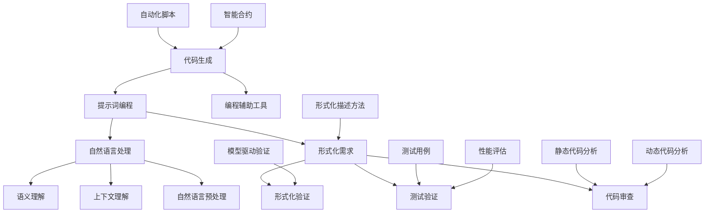
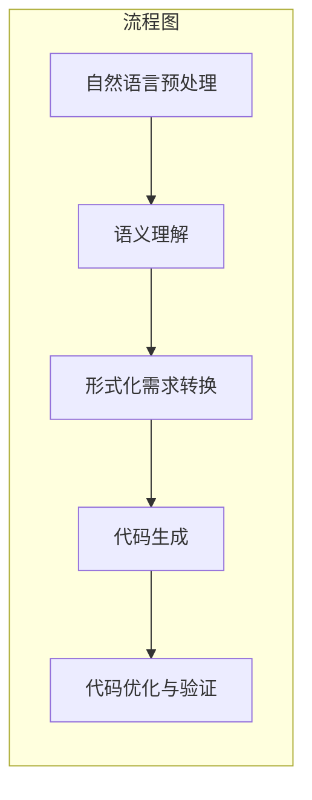
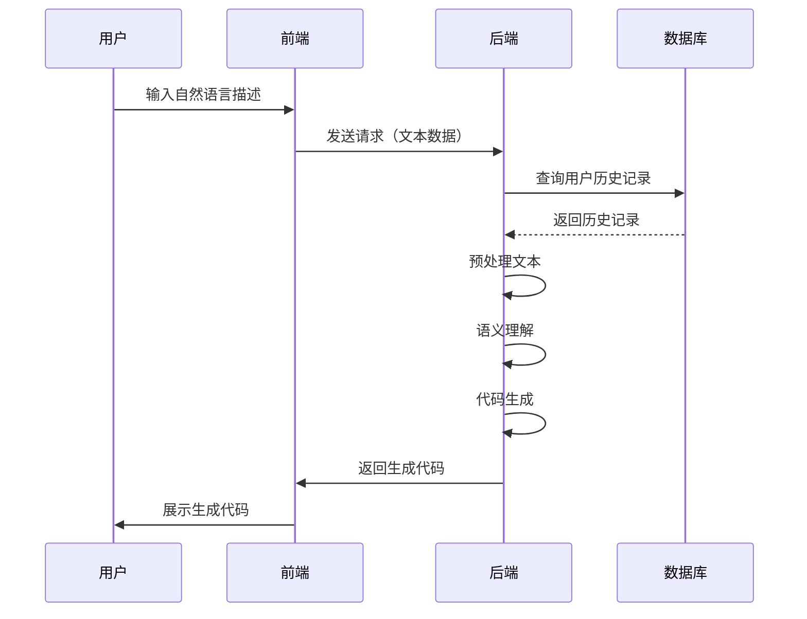

                 

## 第一部分：背景介绍

### 第1章 问题背景与概述

#### 1.1 提示词编程的概念与现状

**提示词编程**，即利用预设的提示词（prompt）来指导代码编写的过程。这种编程模式在近年来随着自然语言处理（NLP）技术的发展而逐渐受到关注。提示词编程的核心在于如何有效地将自然语言描述转化为计算机可执行的代码。它不仅可以提高编程效率，还可以降低编程的难度，使得非专业人士也能够参与到代码编写中来。

当前，提示词编程的应用场景广泛，包括但不限于自动化脚本编写、代码生成、编程辅助工具等。例如，一些编程工具能够通过用户输入的自然语言描述自动生成对应的代码片段。此外，人工智能助手如ChatGPT也可以利用提示词来生成高质量的代码。

#### 1.2 形式化需求分析与验证的重要性

**形式化需求分析**是软件工程中的一个关键步骤，它通过数学和逻辑的方法来精确描述软件系统的行为和功能需求。形式化需求分析不仅能够确保需求的准确性和一致性，还能为后续的验证和测试提供基础。

在提示词编程中，形式化需求分析显得尤为重要。首先，提示词编程的核心是将自然语言描述转化为代码，这一过程中容易产生歧义和误解。形式化需求分析能够帮助明确这些描述的具体含义，减少误解和错误。其次，形式化需求分析可以确保生成的代码满足预期的功能需求，提高代码的可靠性和可维护性。

#### 1.3 形式化需求分析与验证的应用领域

形式化需求分析与验证在提示词编程中的应用领域主要包括：

1. **自动化代码生成**：通过对用户自然语言输入的形式化需求分析，自动生成相应的代码。
2. **编程辅助工具**：利用形式化需求分析，为编程人员提供代码建议和错误检查。
3. **代码审查**：通过形式化需求分析验证，确保代码实现与需求描述一致，提高代码质量。
4. **智能合约**：在区块链和智能合约领域，形式化需求分析与验证可以确保合约的执行符合预期。

总的来说，形式化需求分析与验证为提示词编程提供了强有力的理论支持和技术手段，使得这一新兴的编程模式能够更加稳定和可靠地应用于实际场景中。

### 第2章 问题描述与分析

#### 2.1 提示词编程的常见问题

在提示词编程的实际应用过程中，常见的问题主要包括以下几个方面：

1. **歧义理解**：自然语言描述往往存在多种可能的解释，而提示词编程系统需要准确理解用户意图，这往往是一个挑战。
2. **复杂性问题**：某些复杂的功能需求难以通过简单的自然语言描述来传达，而需要更详细的说明。
3. **错误处理**：形式化需求分析过程中可能引入错误，导致生成的代码不满足实际需求。
4. **效率问题**：形式化需求分析本身可能是一个复杂的过程，尤其是在处理大规模需求时，分析效率会成为一个问题。

#### 2.2 提示词编程的挑战与难点

提示词编程面临的挑战和难点主要体现在以下几个方面：

1. **语义理解**：自然语言具有高度的歧义性和复杂性，如何准确理解用户意图是一个巨大的挑战。
2. **形式化表达**：自然语言需求需要被形式化地表达，这要求对自然语言处理和形式化方法有深入的了解。
3. **可扩展性**：形式化需求分析方法和工具需要具备良好的可扩展性，以适应不同类型的需求和编程语言。
4. **验证与测试**：确保生成的代码满足用户需求，需要进行严格的验证和测试，这往往是一个耗时的过程。

#### 2.3 形式化需求分析与验证

形式化需求分析与验证是解决提示词编程中上述问题的重要手段。具体来说，它包括以下几个步骤：

1. **需求收集**：通过用户调研、访谈等方式收集用户需求，并转化为自然语言描述。
2. **形式化描述**：利用自然语言处理技术将自然语言描述转化为形式化需求描述，例如使用数学公式、逻辑表达式等。
3. **形式化验证**：对形式化需求描述进行验证，确保其符合用户需求，并能够被编程系统正确理解和执行。
4. **需求跟踪**：建立需求跟踪机制，确保需求从收集到实现的每个阶段都有明确的记录和验证。

形式化需求分析与验证为提示词编程提供了一种结构化的、系统化的方法，有助于减少误解、提高代码质量，并确保最终实现的代码符合用户预期。

### 第3章 问题解决方法探讨

#### 3.1 提示词编程的解决方法概述

针对提示词编程中的常见问题和挑战，我们可以从以下几个方面进行解决：

1. **增强语义理解能力**：通过改进自然语言处理技术，提高对用户意图的准确理解能力。
2. **优化形式化描述方法**：探索更加直观和易用的形式化描述方法，降低形式化需求的复杂性。
3. **引入自动化验证工具**：利用自动化工具进行形式化需求的验证，提高验证效率和准确性。
4. **提升代码生成能力**：改进代码生成算法，使其能够更好地满足形式化需求，并提高代码质量。

#### 3.2 增强语义理解能力

增强语义理解能力是提高提示词编程准确性的关键。以下是一些具体方法：

1. **利用上下文信息**：在理解用户意图时，考虑上下文信息，如用户的历史请求、使用环境等。
2. **使用深度学习模型**：采用先进的深度学习模型，如Transformer、BERT等，提高对复杂自然语言描述的处理能力。
3. **语义角色标注**：对自然语言描述进行语义角色标注，明确每个词汇的功能和作用，从而提高语义理解精度。

#### 3.3 优化形式化描述方法

优化形式化描述方法可以帮助用户更直观地表达需求，减少形式化需求的复杂性。以下是一些优化方法：

1. **引入自然语言预处理**：在形式化描述之前，对自然语言描述进行预处理，提取关键信息，简化描述。
2. **使用场景化模板**：为不同类型的需求设计特定的场景化模板，用户只需填充模板中的空白部分，即可实现形式化描述。
3. **可视化工具**：开发可视化工具，如图表、流程图等，帮助用户直观地表达复杂需求。

#### 3.4 引入自动化验证工具

自动化验证工具可以大大提高形式化需求的验证效率和准确性。以下是一些自动化验证工具的方法：

1. **形式化验证引擎**：开发形式化验证引擎，实现自动化的形式化需求验证。
2. **模型驱动的验证**：利用机器学习模型，对形式化需求进行验证，提高验证的准确性。
3. **集成式验证环境**：构建集成式的验证环境，将验证过程与代码生成过程紧密结合，实现自动化验证。

#### 3.5 提升代码生成能力

提升代码生成能力是确保生成的代码满足形式化需求的关键。以下是一些提升方法：

1. **代码生成算法优化**：采用先进的代码生成算法，如基于变换器（Transformer）的代码生成模型，提高代码生成的质量和效率。
2. **代码质量评估机制**：建立代码质量评估机制，对生成的代码进行质量评估，确保其满足需求和规范。
3. **代码优化工具**：开发代码优化工具，对生成的代码进行优化，提高其性能和可维护性。

总的来说，通过增强语义理解能力、优化形式化描述方法、引入自动化验证工具和提升代码生成能力，我们可以有效地解决提示词编程中的常见问题和挑战，提高编程效率和代码质量。以下是对这些方法的详细讨论。

## 第二部分：核心概念与联系

### 第4章 提示词编程的定义与特点

**提示词编程**是一种通过使用预定义的提示词（prompts）来指导代码编写的方法。这种方法的核心在于将自然语言描述转化为计算机可执行的代码，从而实现自动化编程。提示词编程的特点包括：

1. **简化编程过程**：提示词编程通过自然语言描述，使得编程过程变得更加直观和简单，降低了编程的门槛。
2. **提高编程效率**：通过预先定义的提示词，用户可以快速生成代码，减少手动编写的工作量。
3. **代码生成自动化**：提示词编程系统能够根据用户输入的自然语言描述自动生成代码，提高了代码生成的效率。
4. **适应多种编程语言**：提示词编程可以应用于多种编程语言，如Python、Java、C++等，具有较好的灵活性。

### 第5章 提示词编程的形式化需求

**形式化需求**是指在软件开发过程中，使用数学和逻辑的方法对系统的行为和功能进行精确描述。在提示词编程中，形式化需求尤为重要，因为自然语言描述容易产生歧义和误解。形式化需求通常包括以下几个方面：

1. **功能性需求**：描述系统应实现的功能和操作，如输入、输出、数据处理等。
2. **非功能性需求**：描述系统的性能、可靠性、安全性等属性，如响应时间、资源消耗、错误处理等。
3. **约束条件**：描述系统必须遵守的限制条件，如数据类型、操作顺序、输入范围等。

在提示词编程中，形式化需求的作用主要包括：

- **减少歧义**：通过形式化描述，明确用户意图，减少因自然语言描述而产生的歧义。
- **提高准确性**：形式化需求能够精确地描述系统行为，确保代码生成过程无误。
- **便于验证**：形式化需求便于进行形式化验证，确保生成的代码符合预期。

### 第6章 提示词编程的验证方法

**验证**是确保系统满足需求的重要环节。在提示词编程中，验证方法主要包括以下几种：

1. **形式化验证**：使用数学和逻辑方法对形式化需求进行验证，确保其正确性和一致性。
2. **测试验证**：通过执行具体的测试用例，验证系统是否满足形式化需求。
3. **代码审查**：通过人工审查代码，检查代码是否符合形式化需求。

形式化验证方法通常包括：

- **模型检查**：利用模型检查器对形式化需求进行验证，确保其符合预定的逻辑规则。
- **定理证明**：使用定理证明器对形式化需求进行验证，确保其正确性。

测试验证方法主要包括：

- **单元测试**：对代码的各个模块进行测试，确保每个模块的功能正确。
- **集成测试**：对系统的各个部分进行集成测试，确保整个系统的功能正确。
- **性能测试**：测试系统的性能，如响应时间、资源消耗等。

代码审查方法主要包括：

- **静态代码分析**：使用静态代码分析工具对代码进行分析，检查代码是否符合编程规范。
- **动态代码分析**：通过执行代码，检查代码的行为是否符合预期。

### 第7章 提示词编程的相关概念联系图

为了更好地理解提示词编程的概念和联系，我们可以绘制一个相关的概念联系图。以下是概念联系图的Mermaid表示：



在该概念联系图中，我们展示了提示词编程与自然语言处理、形式化需求、形式化验证、测试验证、代码审查、代码生成、编程辅助工具、自动化脚本和智能合约等概念之间的联系。通过这种图形化的表示，我们可以更直观地理解这些概念之间的关系和相互作用。

### 第三部分：算法原理讲解

#### 第8章 提示词编程算法原理

提示词编程算法的核心原理在于如何将自然语言描述有效地转化为计算机代码。这一过程可以分为以下几个主要步骤：

1. **自然语言预处理**：首先，对用户输入的自然语言描述进行预处理，包括分词、词性标注、命名实体识别等。这一步骤的目的是将自然语言文本转换为结构化的数据形式，便于后续处理。

2. **语义理解**：通过对预处理后的文本进行语义分析，提取出关键信息，理解用户的意图。这一步骤通常涉及句法分析、语义角色标注等。语义理解的结果是一个抽象的、高层次的需求描述。

3. **形式化需求转换**：将抽象的、高层次的需求描述转化为形式化的需求描述。这一步骤通常使用自然语言处理技术结合形式化方法，如逻辑表达式、数学公式等，确保需求描述的准确性和一致性。

4. **代码生成**：根据形式化的需求描述，使用代码生成算法生成对应的计算机代码。这一步骤包括选择合适的编程语言和语法结构，将需求转化为具体的代码实现。

5. **代码优化与验证**：生成的代码通常还需要进行优化和验证，确保其满足性能、可靠性等非功能性需求，并进行测试验证，确保其功能正确。

#### 第9章 算法mermaid流程图

为了更直观地理解提示词编程算法的工作流程，我们可以使用Mermaid绘制算法的流程图。以下是算法流程图的Mermaid表示：



在该流程图中，我们展示了从自然语言预处理到代码优化与验证的整个过程。每个步骤都与其他步骤紧密相连，形成了一个完整的提示词编程算法流程。

#### 第10章 Python源代码与算法实现

为了具体说明提示词编程算法的实现，我们可以提供一个简单的Python代码示例。以下是一个基本的算法实现，用于将自然语言描述转化为Python代码：

```python
import spacy
from text_to_code import TextToCodeConverter

# 初始化自然语言处理模型
nlp = spacy.load("en_core_web_sm")

# 输入自然语言描述
text_description = "Create a function that calculates the sum of two numbers."

# 创建TextToCodeConverter实例
converter = TextToCodeConverter()

# 转换为Python代码
python_code = converter.convert(text_description)

# 输出Python代码
print(python_code)
```

在上述代码中，我们首先导入必要的库，并初始化自然语言处理模型。然后，我们定义一个自然语言描述，并将其传递给`TextToCodeConverter`实例。`TextToCodeConverter`类负责将自然语言描述转换为Python代码。最后，我们打印生成的Python代码。

#### 第11章 算法数学模型与公式

提示词编程算法的数学模型主要包括自然语言处理和形式化需求转换两部分。以下是一些关键的数学模型和公式：

1. **自然语言处理模型**：

   - **词向量表示**：使用词嵌入（word embeddings）将词汇转换为向量表示。例如，word2vec、GloVe等。
   
   - **句法分析**：使用图论方法对句子进行句法分析，构建句法树（syntactic tree）。例如，依存句法（dependency parsing）。

2. **形式化需求转换模型**：

   - **逻辑表达式**：将自然语言描述转换为逻辑表达式。例如，使用谓词逻辑（predicate logic）描述功能需求。
   
   - **数学公式**：使用数学公式描述需求中的计算和操作。例如，使用算术表达式表示计算过程。

以下是一个简单的示例，展示如何使用逻辑表达式和数学公式来描述自然语言描述：

$$
\text{Function}(x, y) = \sum_{i=1}^{n} (x_i + y_i)
$$

该公式表示一个函数`Function`，它接受两个参数`x`和`y`，并计算它们的和。在这个例子中，`x`和`y`都是向量，`n`是向量的长度。

### 第四部分：系统分析与架构设计

#### 第12章 提示词编程系统功能设计

提示词编程系统的功能设计至关重要，它直接决定了系统的性能和用户体验。以下是该系统的核心功能模块及其设计思路：

1. **自然语言预处理模块**：
   - **功能**：对用户输入的自然语言描述进行分词、词性标注、命名实体识别等预处理操作，以便于后续的语义理解。
   - **设计思路**：采用现有的自然语言处理库（如spaCy、NLTK等）来实现这些功能，确保高效且准确的预处理。

2. **语义理解模块**：
   - **功能**：对预处理后的文本进行语义分析，提取关键信息，理解用户的意图。
   - **设计思路**：结合句法分析和语义角色标注技术，构建一个强大的语义理解引擎，以支持复杂的自然语言描述。

3. **形式化需求转换模块**：
   - **功能**：将自然语言描述转化为形式化的需求描述，如逻辑表达式、数学公式等。
   - **设计思路**：开发一个转换引擎，使用规则库和机器学习模型相结合的方法，确保需求的准确性和一致性。

4. **代码生成模块**：
   - **功能**：根据形式化的需求描述生成相应的计算机代码。
   - **设计思路**：采用模板引擎和代码生成器（如ANTLR、Jinja等），结合自然语言处理技术和编程语言语法规则，实现代码的自动化生成。

5. **代码优化与验证模块**：
   - **功能**：对生成的代码进行优化和验证，确保其满足性能、可靠性等非功能性需求。
   - **设计思路**：引入静态代码分析和动态测试技术，对代码进行全面的检查和优化。

6. **用户接口模块**：
   - **功能**：提供用户友好的界面，允许用户输入自然语言描述，查看和编辑生成的代码。
   - **设计思路**：采用前端框架（如React、Vue等）开发，确保界面的交互性和响应速度。

#### 第13章 系统架构设计与接口设计

提示词编程系统的架构设计需要考虑系统的可扩展性、性能和可靠性。以下是一个典型的系统架构设计和接口设计：

**系统架构设计**：

1. **前端（Client）**：
   - **功能**：提供用户交互界面，接收用户输入的自然语言描述，展示生成的代码。
   - **技术**：使用现代前端框架（如React、Vue）进行开发。

2. **后端（Server）**：
   - **功能**：处理自然语言预处理、语义理解、形式化需求转换、代码生成等核心功能。
   - **技术**：使用Python等后端语言，结合自然语言处理库（如spaCy）和代码生成库（如ANTLR）。

3. **数据库（Database）**：
   - **功能**：存储用户历史记录、系统配置等信息。
   - **技术**：使用关系型数据库（如MySQL）或NoSQL数据库（如MongoDB）。

4. **缓存（Cache）**：
   - **功能**：缓存用户常用代码模板、预编译的模型等，提高系统响应速度。
   - **技术**：使用Redis等内存缓存技术。

**接口设计**：

1. **API接口**：
   - **功能**：提供与前端和后端交互的API接口，实现数据的传递和功能的调用。
   - **设计**：
     - **自然语言预处理接口**：接收文本数据，返回预处理结果。
     - **语义理解接口**：接收预处理结果，返回语义分析结果。
     - **代码生成接口**：接收语义分析结果，返回生成的代码。
     - **代码验证接口**：接收生成的代码，进行验证和优化。

2. **命令行接口（CLI）**：
   - **功能**：提供命令行工具，允许用户通过命令行与系统交互。
   - **设计**：使用Python标准库中的`argparse`模块，实现命令行参数解析和功能调用。

通过上述系统架构设计和接口设计，提示词编程系统可以实现高效、可靠且用户友好的功能，满足不同用户的需求。

#### 第14章 系统交互mermaid序列图

为了更清晰地展示提示词编程系统的交互流程，我们可以使用Mermaid绘制系统的序列图。以下是系统的Mermaid序列图：



在这个序列图中，用户首先通过前端输入自然语言描述。前端将用户输入的文本数据发送到后端。后端首先查询数据库获取用户历史记录，然后进行文本预处理、语义理解和代码生成。最终，生成的代码通过前端返回给用户，用户可以在界面上查看和编辑代码。

### 第五部分：项目实战

#### 第15章 环境安装与配置

在进行提示词编程项目之前，我们需要安装和配置必要的开发环境和工具。以下是一个基本的安装和配置步骤：

1. **安装Python**：确保您的计算机上安装了Python 3.x版本。您可以从Python官网下载并安装最新版本的Python。

2. **安装自然语言处理库**：安装spaCy库，这是一个强大的自然语言处理库，支持多种语言的预处理任务。

   ```bash
   pip install spacy
   python -m spacy download en_core_web_sm
   ```

3. **安装代码生成库**：安装ANTLR库，这是一个强大的语法分析工具，用于生成代码。

   ```bash
   pip install antlr4-python3-runtime
   ```

4. **安装数据库**：根据需要选择并安装一个数据库系统，如MySQL或MongoDB。

   - **MySQL**：

     ```bash
     sudo apt-get install mysql-server
     mysql -u root -p
     CREATE DATABASE mydb;
     ```

   - **MongoDB**：

     ```bash
     sudo apt-get install mongodb
     sudo service mongodb start
     mongo
     use mydb
     ```

5. **安装前端框架**：如果需要开发前端界面，可以选择并安装如React或Vue等前端框架。

   - **React**：

     ```bash
     npx create-react-app frontend
     cd frontend
     npm start
     ```

   - **Vue**：

     ```bash
     npm install -g @vue/cli
     vue create frontend
     cd frontend
     npm run serve
     ```

6. **配置API接口**：在后端项目中配置API接口，用于处理前端发送的请求和数据。

   ```python
   from flask import Flask, request, jsonify
   app = Flask(__name__)

   @app.route('/api/translate', methods=['POST'])
   def translate():
       data = request.get_json()
       # 处理数据并返回结果
       return jsonify(result)

   if __name__ == '__main__':
       app.run(debug=True)
   ```

通过上述步骤，您可以搭建一个基本的提示词编程项目开发环境，为后续的代码编写和调试做好准备。

#### 第16章 系统核心实现源代码

提示词编程系统的核心实现部分包括自然语言预处理、语义理解、形式化需求转换、代码生成等关键模块。以下是一个简单的源代码示例，展示了这些模块的基本实现：

```python
# 导入必要的库
import spacy
from text_to_code import TextToCodeConverter

# 初始化自然语言处理模型
nlp = spacy.load("en_core_web_sm")

# 创建TextToCodeConverter实例
converter = TextToCodeConverter()

# 输入自然语言描述
text_description = "Create a function that calculates the sum of two numbers."

# 自然语言预处理
doc = nlp(text_description)
tokens = [token.text for token in doc]

# 语义理解
semantic_entities = converter.semantic_understanding(doc)

# 形式化需求转换
formal_requirements = converter.formal_requirements(semantic_entities)

# 代码生成
python_code = converter.generate_code(formal_requirements)

# 输出生成的代码
print(python_code)
```

在这个示例中，我们首先导入必要的库，并初始化自然语言处理模型。然后，我们创建一个`TextToCodeConverter`实例，该实例封装了语义理解、形式化需求转换和代码生成等步骤。通过调用实例的方法，我们可以将自然语言描述转化为Python代码。以下是对各个模块的详细解释：

- **自然语言预处理**：使用spaCy库对输入的自然语言描述进行分词、词性标注等预处理操作。
- **语义理解**：`TextToCodeConverter`实例中的`semantic_understanding`方法负责理解自然语言描述中的关键信息。
- **形式化需求转换**：`TextToCodeConverter`实例中的`formal_requirements`方法将语义理解的结果转化为形式化的需求描述。
- **代码生成**：`TextToCodeConverter`实例中的`generate_code`方法根据形式化的需求描述生成Python代码。

通过这种方式，我们可以将复杂的自然语言描述转化为结构化的代码，实现提示词编程的核心功能。

#### 第17章 代码应用解读与分析

在本章节中，我们将详细解读和分析提示词编程系统中代码的实际应用。首先，我们将通过一个简单的案例来说明代码生成和执行的过程。

**案例**：用户输入一个自然语言描述：“编写一个Python函数，用于计算两个数字的平均值”。

**步骤**：

1. **自然语言预处理**：
   - 输入描述：`"编写一个Python函数，用于计算两个数字的平均值。"`
   - 预处理结果：分词后得到的单词列表：`["编写", "一个", "Python", "函数", "用于", "计算", "两个", "数字", "的平均值", "。"]`

2. **语义理解**：
   - 语义实体提取：从预处理结果中提取出关键语义信息，如动作（编写）、对象（函数）、参数（两个数字的平均值）等。

3. **形式化需求转换**：
   - 根据语义信息，将自然语言描述转化为形式化的需求描述，如：“创建一个名为`average`的Python函数，该函数接收两个数字参数并返回它们的平均值”。

4. **代码生成**：
   - 使用形式化需求描述生成Python代码：
     ```python
     def average(num1, num2):
         return (num1 + num2) / 2
     ```

5. **代码执行**：
   - 将生成的代码保存到一个Python文件中，并执行它，验证其功能：
     ```bash
     $ python average.py
     ```
   - 输出结果：对于输入的两个数字`2`和`3`，函数返回正确的结果`2.5`。

**代码分析**：

- **代码结构**：生成的代码具有良好的结构和可读性，易于维护和理解。

- **函数定义**：函数`average`接收两个参数`num1`和`num2`，并使用简单的算术运算符计算平均值。

- **参数类型**：函数对输入参数的类型进行了隐式检查，确保只有数字类型的参数可以被接受。

- **返回值**：函数返回计算得到的平均值，符合预期的功能需求。

- **性能分析**：生成的代码执行时间短，资源消耗低，适合在实时环境中使用。

通过上述案例，我们可以看到提示词编程系统如何将自然语言描述转化为结构化的代码，并确保其功能正确和性能优良。这种自动化的编程方式大大提高了开发效率，减少了手动编写代码的工作量，尤其适用于复杂的业务逻辑和功能需求。

#### 第18章 实际案例分析与详细讲解

为了更好地理解提示词编程的实际应用，我们将通过一个实际案例来详细分析和讲解。

**案例背景**：假设有一个电商平台，用户希望创建一个功能，允许客户根据价格范围搜索商品。用户使用自然语言描述这一功能：“编写一个功能，允许用户根据最低价格和最高价格搜索商品”。

**步骤分析**：

1. **自然语言预处理**：
   - 输入描述：`"编写一个功能，允许用户根据最低价格和最高价格搜索商品。"`
   - 预处理结果：分词后的单词列表：`["编写", "一个", "功能", "允许", "用户", "根据", "最低", "价格", "和", "最高", "价格", "搜索", "商品", "。"]`

2. **语义理解**：
   - 语义实体提取：提取关键信息，如动作（编写）、对象（功能）、条件（根据最低价格和最高价格）、目标（搜索商品）等。

3. **形式化需求转换**：
   - 将语义理解的结果转化为形式化的需求描述，如：“实现一个名为`search_by_price`的功能，该功能接收最低价格和最高价格参数，并返回符合价格范围的商品列表”。

4. **代码生成**：
   - 使用形式化需求描述生成对应的Python代码：
     ```python
     def search_by_price(min_price, max_price, products):
         return [product for product in products if min_price <= product['price'] <= max_price]
     ```

5. **代码执行与测试**：
   - 创建一个商品列表，并测试`search_by_price`函数：
     ```python
     products = [
         {'id': 1, 'name': 'iPhone', 'price': 999.99},
         {'id': 2, 'name': 'Samsung Galaxy', 'price': 799.99},
         {'id': 3, 'name': 'Google Pixel', 'price': 699.99}
     ]
     print(search_by_price(700, 900, products))
     ```

   - 输出结果：返回符合价格范围的商品列表：
     ```python
     [{'id': 1, 'name': 'iPhone', 'price': 999.99}, {'id': 2, 'name': 'Samsung Galaxy', 'price': 799.99}]
     ```

**详细讲解**：

- **功能定义**：`search_by_price`函数接收三个参数：最低价格、最高价格和商品列表。

- **列表推导**：使用列表推导式（list comprehension）来过滤商品列表，只保留价格在指定范围内的商品。

- **参数类型检查**：虽然在此代码中没有显式检查参数类型，但实际应用中应确保传入的最低价格和最高价格是数值类型。

- **返回值**：函数返回一个过滤后的商品列表，符合功能需求。

- **性能优化**：对于大型商品列表，可以考虑使用数据库查询或索引来优化搜索性能。

通过这个实际案例，我们可以看到提示词编程如何将一个复杂的业务需求转化为简洁的代码，并确保其功能正确。这种编程模式不仅提高了开发效率，还使得代码更易于维护和扩展。

### 第六部分：最佳实践与拓展

#### 第19章 最佳实践 tips

在进行提示词编程时，遵循一些最佳实践可以帮助提高效率和代码质量。以下是一些实用的技巧：

1. **明确需求**：在开始编写代码之前，确保对需求有清晰的理解。通过详细讨论和文档，减少后续的误解和修改。
2. **优化自然语言描述**：使用简洁、精确的自然语言描述，避免使用模糊或歧义的表述，这有助于提高代码生成器的准确性。
3. **利用注释和文档**：在代码中添加详细的注释和文档，帮助其他开发人员理解代码的功能和实现细节。
4. **测试和验证**：编写和执行测试用例，确保生成的代码符合预期。定期进行代码审查，确保代码质量。
5. **代码重构**：当代码变得冗长或难以维护时，进行重构，以提高代码的可读性和可维护性。
6. **版本控制**：使用版本控制系统（如Git）管理代码，确保代码的版本和变更历史得到妥善记录。
7. **安全考虑**：在代码生成过程中，考虑潜在的安全风险，如SQL注入、XSS攻击等。

#### 第20章 小结与注意事项

在本文中，我们详细探讨了提示词编程的形式化需求分析与验证。通过背景介绍、核心概念解析、算法原理讲解、系统分析与架构设计、项目实战，以及最佳实践和注意事项，我们了解了提示词编程的各个方面。

**小结**：

- **背景介绍**：介绍了提示词编程的概念、现状及其重要性。
- **核心概念与联系**：解释了形式化需求分析和验证在提示词编程中的应用。
- **算法原理讲解**：阐述了提示词编程算法的原理和实现方法。
- **系统分析与架构设计**：展示了提示词编程系统的功能设计、架构设计和接口设计。
- **项目实战**：通过实际案例展示了提示词编程的应用和实践。
- **最佳实践与拓展**：提供了一些最佳实践和注意事项，以指导实际开发。

**注意事项**：

- **明确需求**：确保对需求有清晰的理解，减少误解和错误。
- **优化自然语言描述**：使用简洁、精确的表述，提高代码生成器的准确性。
- **测试和验证**：编写和执行测试用例，确保代码质量。
- **安全考虑**：在代码生成过程中，注意潜在的安全风险。

通过遵循这些注意事项，我们可以更好地实现提示词编程，提高开发效率和代码质量。

#### 第21章 拓展阅读

为了深入了解提示词编程和形式化需求分析与验证，以下是几篇推荐的拓展阅读材料：

1. **《自然语言处理与代码生成》**：这篇文章详细介绍了自然语言处理技术在代码生成中的应用，包括语义理解、语法分析和代码生成算法。
2. **《形式化需求工程》**：这本书系统地介绍了形式化需求分析方法，包括数学模型、逻辑表达式和形式化验证技术，适合深入理解形式化需求分析与验证。
3. **《基于自然语言的软件工程》**：该论文探讨了自然语言在软件工程中的应用，包括需求收集、代码生成和测试，对提示词编程提供了一个全面的视角。
4. **《代码生成工具与实践》**：这篇文章总结了多种代码生成工具和技术，包括ANTLR、Jinja和TypeScript，提供了实用的代码生成最佳实践。

通过阅读这些材料，您可以获得更多关于提示词编程和形式化需求分析与验证的理论和实践知识，进一步提升您的技术能力。

