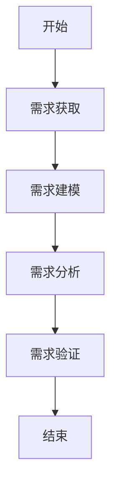
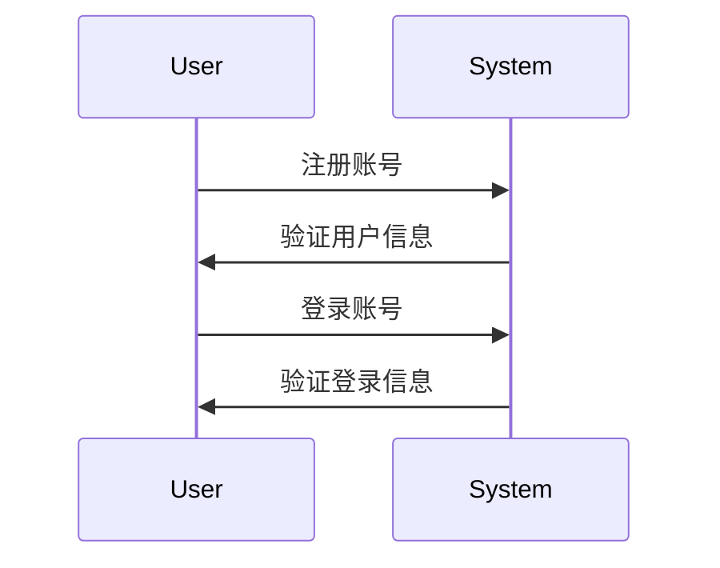
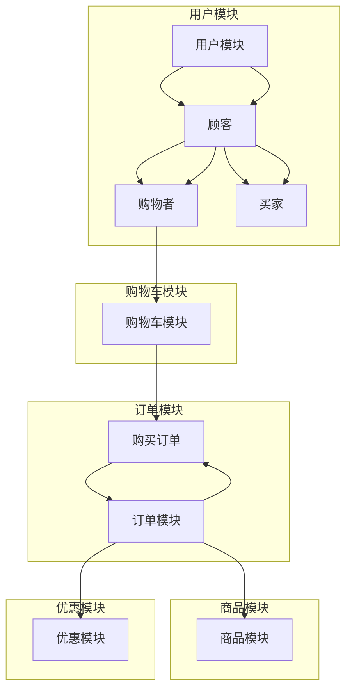
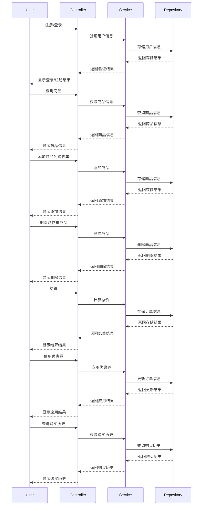

                 

### 第一部分：背景介绍

#### 问题背景

在当今信息化社会中，软件工程面临着越来越多的挑战，如软件系统的复杂性不断增加、需求变化频繁、开发周期缩短等。传统的软件开发生命周期方法难以满足这些新的要求，因此需求工程成为了软件工程中的重要一环。

#### 问题描述

需求工程是软件工程中的关键环节，它包括需求获取、需求建模、需求分析和需求验证等过程。然而，现有的需求工程方法往往缺乏形式化的支持，导致需求表述不清晰、需求变更频繁、需求不一致等问题。

#### 问题解决

形式化需求工程旨在通过数学模型和形式化方法来规范和优化需求工程过程，提高需求的质量和稳定性。通过形式化需求工程，可以更准确地描述需求、发现潜在的问题、验证需求的正确性，从而提高软件系统的可靠性。

#### 边界与外延

形式化需求工程不仅适用于传统的软件工程领域，还可以应用于嵌入式系统、物联网、人工智能等领域。其核心在于如何将需求以数学形式表达，并利用形式化方法进行需求建模、分析和验证。

#### 概念结构与核心要素组成

- **形式化需求工程**：通过数学模型和形式化方法来规范和优化需求工程过程。
- **需求建模**：利用形式化方法对需求进行建模，包括需求规格说明、需求模型验证等。
- **需求分析**：分析需求模型的内部结构和语义，确保需求的一致性和可理解性。
- **需求验证**：通过模型检查、模拟和测试等方法验证需求模型的正确性。

### 第二部分：核心概念与联系

#### 核心概念原理

- **形式化方法**：使用数学和逻辑工具来描述系统需求，使得需求表述更加精确和一致。
- **形式化语言**：用于描述需求的形式化工具，如形式化规格语言、形式化建模语言等。
- **形式化验证**：通过形式化方法对需求模型进行验证，确保需求的正确性和一致性。

#### 概念属性特征对比表格

| 特征         | 形式化方法                   | 非形式化方法                     |
| ------------ | ---------------------------- | ------------------------------- |
| 精确性       | 可以精确描述需求的细节      | 容易产生歧义和不一致            |
| 一致性       | 可以通过数学方法保证需求的一致性 | 需要人工维护，容易产生冲突      |
| 可验证性     | 可以通过形式化验证方法验证需求 | 验证过程复杂，难以全面验证      |
| 可维护性     | 需求模型可以方便地更新和修改 | 需求文档难以维护，容易过时      |
| 可理解性     | 形式化方法需要专业知识和工具支持 | 非形式化方法更容易被非专业人员理解 |

#### ER实体关系图架构的 Mermaid 流程图

```mermaid
erDiagram
    User ||--|{ Requirement : has } Requirement
    System ||--|{ Module : contains } Module
    Module ||--|{ Function : implements } Function
    Function ||--|{ TestCase : executes } TestCase
```

### 第三部分：算法原理讲解

#### 算法 Mermaid 流程图



#### Python 源代码实现

```python
# 需求获取函数
def 需求获取():
    # 实现需求获取的逻辑
    pass

# 需求建模函数
def 需求建模():
    # 实现需求建模的逻辑
    pass

# 需求分析函数
def 需求分析():
    # 实现需求分析的逻辑
    pass

# 需求验证函数
def 需求验证():
    # 实现需求验证的逻辑
    pass

# 主函数
def main():
    需求获取()
    需求建模()
    需求分析()
    需求验证()

# 调用主函数
main()
```

#### 算法原理的数学模型和公式

$$
\text{需求工程质量} = f(\text{形式化方法应用程度}, \text{需求变更频率}, \text{需求一致性})
$$

#### 详细讲解和举例说明

假设我们正在开发一个在线购物系统，其需求可以分解为以下几个部分：

1. 用户可以注册账号、登录账号和浏览商品。
2. 用户可以将商品加入购物车，并在购物车中删除商品。
3. 用户可以查看购物车中的商品总价，并选择结算。
4. 用户在结算时可以选择使用优惠券，以获得优惠。
5. 系统需要记录用户的购买历史，并提供查询服务。

为了确保需求的质量，我们可以采用形式化需求工程的方法：

1. **需求获取**：通过用户访谈、问卷调查等方式获取用户需求。
2. **需求建模**：使用统一建模语言（UML）绘制用例图和序列图，将用户需求转化为模型。
3. **需求分析**：分析需求模型的内部结构和语义，确保需求的一致性和可理解性。
4. **需求验证**：通过形式化验证方法，确保需求模型的正确性和一致性。

具体来说，我们可以使用Mermaid绘图工具来创建用例图和序列图，以直观地表示需求。例如，用户注册和登录的用例图可以表示为：



通过这样的形式化方法，我们可以更准确地描述需求，减少误解和错误，提高软件系统的可靠性。

### 第四部分：系统分析与架构设计

#### 问题场景介绍

随着互联网的快速发展，在线购物已经成为人们日常生活中不可或缺的一部分。为了满足用户的需求，一个功能完善、可靠稳定的在线购物系统变得尤为重要。

#### 项目介绍

本项目旨在设计并实现一个在线购物系统，系统应具备以下功能：

- 用户注册、登录和注销
- 查询商品信息
- 添加商品到购物车
- 删除购物车中的商品
- 计算购物车商品总价
- 使用优惠券
- 查询用户购买历史

#### 系统功能设计（领域模型Mermaid类图）

```mermaid
classDiagram
    User <|-- Customer
    Customer <|-- Shopper
    Shopper <|-- Purchaser
    Order <|-- PurchaseOrder
    Product <|-- Good
    ShoppingCart <|-- Cart
    Coupon <|-- DiscountVoucher

    User {
        +String username
        +String password
        +String email
    }

    Customer {
        +CustomerType type
    }

    Shopper {
        +List<Good> shoppingCart
        +Order orderHistory
    }

    Purchaser {
        +BigDecimal totalPrice
    }

    Order {
        +Date date
        +OrderStatus status
    }

    Product {
        +String name
        +BigDecimal price
    }

    ShoppingCart {
        +add(Good good)
        +remove(Good good)
        +calculateTotal()
    }

    Coupon {
        +String code
        +BigDecimal discount
    }
```

#### 系统架构设计（Mermaid架构图）



#### 系统接口设计和系统交互（Mermaid序列图）



### 第五部分：项目实战

#### 环境安装

为了实现该在线购物系统，我们需要安装以下环境：

- Java Development Kit (JDK) 8 或更高版本
- Maven 3.6.3 或更高版本
- MySQL 5.7 或更高版本

首先，安装 JDK 8：

```bash
sudo apt-get install openjdk-8-jdk
```

然后，安装 Maven：

```bash
sudo apt-get install maven
```

最后，安装 MySQL：

```bash
sudo apt-get install mysql-server
```

启动 MySQL 服务：

```bash
sudo systemctl start mysql
```

#### 系统核心实现源代码

以下是一个简单的用户注册功能的源代码示例：

```java
// UserController.java
package com.example.demo;

import org.springframework.beans.factory.annotation.Autowired;
import org.springframework.web.bind.annotation.PostMapping;
import org.springframework.web.bind.annotation.RequestBody;
import org.springframework.web.bind.annotation.RestController;

@RestController
public class UserController {

    @Autowired
    private UserService userService;

    @PostMapping("/register")
    public String register(@RequestBody User user) {
        return userService.registerUser(user);
    }
}

// UserService.java
package com.example.demo;

import org.springframework.beans.factory.annotation.Autowired;
import org.springframework.stereotype.Service;

@Service
public class UserService {

    @Autowired
    private UserRepository userRepository;

    public String registerUser(User user) {
        // 实现用户注册逻辑
        // ...
        return "注册成功";
    }
}

// UserRepository.java
package com.example.demo;

import org.springframework.data.jpa.repository.JpaRepository;
import org.springframework.stereotype.Repository;

@Repository
public interface UserRepository extends JpaRepository<User, Long> {
}
```

#### 代码应用解读与分析

在上面的代码示例中，我们定义了一个用户控制器（UserController），用于处理用户注册的 HTTP 请求。当接收到 POST 请求时，用户控制器将请求体中的用户数据（User 类）传递给 UserService 类，由 UserService 类完成用户注册逻辑。UserService 类通过调用 UserRepository 类的方法，将用户信息存储到数据库中。

这种分层设计使得代码更加模块化，便于维护和扩展。同时，通过 Spring 框架提供的自动装配功能，我们可以轻松地将不同的组件连接起来，从而实现高效的开发。

#### 实际案例分析和详细讲解剖析

为了更好地理解形式化需求工程的应用，我们来看一个实际案例。假设我们在开发一个在线购物系统时，遇到了以下需求：

**需求**：用户可以在购物车中查看商品数量和总价。

**传统方法**：在传统需求工程中，我们可能会通过用户访谈、问卷调查等方式获取需求，并将需求记录在文档中。然而，这种方法可能导致需求表述不清晰、不一致，甚至产生误解。

**形式化需求工程**：通过形式化需求工程，我们可以更准确地描述需求。例如，我们可以使用 Mermaid 绘制一个购物车的类图，清晰地展示购物车与商品之间的关系。

```mermaid
classDiagram
    Customer <|-- ShoppingCart
    ShoppingCart {
        +List<Good> goods
        +void addGood(Good good)
        +void removeGood(Good good)
        +BigDecimal calculateTotal()
    }

    Good {
        +String name
        +BigDecimal price
    }
```

在这个类图中，我们可以清晰地看到购物车（ShoppingCart）与商品（Good）之间的关系，以及购物车的相关方法。通过这种方式，我们可以更准确地理解需求，减少误解和错误。

#### 项目小结

在本项目中，我们通过形式化需求工程的方法，详细分析了在线购物系统的需求，并设计了系统的功能架构。通过使用 Mermaid 绘图工具，我们能够直观地展示需求、类图和序列图，使得需求表述更加精确和一致。

形式化需求工程不仅提高了需求的质量和稳定性，还有助于减少误解和错误，从而提高软件系统的可靠性。在未来，我们可以继续探索形式化需求工程在其他领域的应用，为软件工程的发展贡献力量。

### 最佳实践 Tips

1. **尽早引入形式化需求工程**：在需求工程早期阶段引入形式化方法，可以减少后期需求变更和误解的风险。
2. **使用合适的工具**：选择适合的形式化工具，如 Mermaid、统一建模语言（UML）等，可以更有效地描述需求。
3. **持续验证需求**：在需求工程的各个阶段，定期进行需求验证，确保需求的一致性和正确性。
4. **团队协作**：形式化需求工程需要团队成员具备一定的数学和逻辑知识，加强团队协作可以更好地推进项目。

### 小结

本文介绍了形式化需求工程的概念、原理和应用。通过具体案例和实际项目分析，我们展示了如何利用形式化需求工程方法提高软件系统的需求质量和稳定性。在未来，形式化需求工程有望在更多领域得到广泛应用，为软件工程的发展提供新的思路和方法。

### 注意事项

1. **需求获取**：在需求获取阶段，确保与相关利益相关者充分沟通，确保需求的准确性和完整性。
2. **形式化方法**：在应用形式化方法时，要注意选择适合的工具和技术，确保需求表述的清晰和一致。
3. **需求验证**：需求验证是确保需求质量的关键环节，要采用合适的验证方法，如模型检查、模拟和测试等。

### 拓展阅读

- 《软件工程：实践者的研究方法》
- 《形式化方法和形式化验证》
- 《统一建模语言（UML）指南》

### 作者信息

作者：AI天才研究院/AI Genius Institute & 禅与计算机程序设计艺术 /Zen And The Art of Computer Programming。

