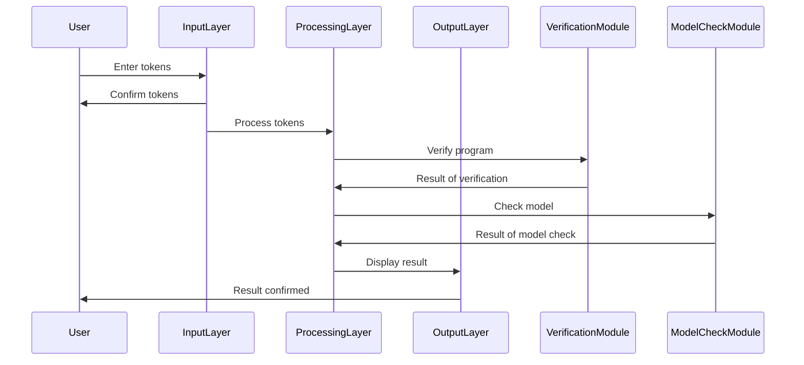

                 

# 提示词编程的形式化验证与模型检验

> 关键词：提示词编程、形式化验证、模型检验、算法、架构设计、项目实战

> 摘要：
本文深入探讨了提示词编程的形式化验证与模型检验。首先，我们介绍了提示词编程的基本概念，并探讨了其在实际应用中的重要性。接着，我们详细介绍了形式化验证和模型检验的基本理论，包括其概念、方法和工具。随后，我们通过算法原理讲解，结合Python源代码，阐述了提示词编程的算法实现。在此基础上，我们分析了系统架构设计，包括系统需求、功能设计、架构设计和接口设计。通过实际项目实战，我们展示了如何将理论应用于实践。最后，我们提供了最佳实践、小结和注意事项，为读者提供了进一步学习的资源。

## 第1章 引言

### 1.1 问题背景

提示词编程是一种基于提示词（Token）的编程范式，它通过将程序分解为更小的、可重用的提示词单元，提高了代码的可读性和可维护性。形式化验证和模型检验是确保程序正确性和可靠性的重要手段。在软件工程中，形式化验证指的是使用数学方法来证明程序的属性，如安全性、正确性等。而模型检验则是一种通过验证系统模型来检查系统行为是否符合预期的方法。

随着软件系统的复杂性不断增加，传统的测试方法已经难以满足需求。形式化验证和模型检验提供了一种更为严格的验证手段，可以在软件开发早期发现潜在的错误，从而提高软件的质量和可靠性。

### 1.2 提示词编程的概念

提示词编程（Token-Based Programming）是一种基于提示词（Token）的编程范式。提示词是一种抽象的数据类型，它表示程序中的基本操作和数据。在提示词编程中，程序被分解为一系列的提示词单元，每个提示词单元执行特定的操作。这种编程范式的优势在于：

1. **可重用性**：提示词单元可以独立开发、测试和部署，从而提高了代码的可重用性。
2. **可维护性**：通过将程序分解为更小的单元，降低了代码的复杂性，使得代码更容易理解和维护。
3. **可扩展性**：提示词编程范式使得系统可以灵活地扩展，以适应新的需求和变化。

### 1.3 形式化验证和模型检验的重要性

形式化验证和模型检验在软件工程中扮演着重要角色。形式化验证通过数学方法来证明程序的属性，如安全性、正确性等，从而确保程序的正确性和可靠性。模型检验则通过验证系统模型来检查系统行为是否符合预期，从而发现潜在的错误。

形式化验证和模型检验的重要性体现在以下几个方面：

1. **提高软件质量**：通过严格的验证手段，可以确保软件的正确性和可靠性，从而提高软件的质量。
2. **降低维护成本**：形式化验证和模型检验可以在软件开发早期发现潜在的错误，从而降低软件的维护成本。
3. **增强安全性**：形式化验证和模型检验可以确保系统的安全性，防止潜在的安全漏洞。
4. **提高开发效率**：通过形式化验证和模型检验，可以减少软件测试和调试的工作量，从而提高开发效率。

## 第2章 提示词编程基础

### 2.1 提示词编程的基本概念

提示词编程是一种基于提示词（Token）的编程范式。在提示词编程中，提示词是程序的基本操作和数据。提示词可以分为以下几类：

1. **操作提示词**：表示程序中的基本操作，如加法、减法、赋值等。
2. **数据提示词**：表示程序中的数据，如变量、数组等。
3. **控制提示词**：表示程序中的控制结构，如循环、条件判断等。

### 2.2 提示词编程的关键特性

提示词编程具有以下几个关键特性：

1. **模块化**：提示词编程将程序分解为多个提示词单元，每个提示词单元具有独立的功能，从而实现了代码的模块化。
2. **可重用性**：提示词单元可以独立开发、测试和部署，从而提高了代码的可重用性。
3. **可维护性**：通过将程序分解为更小的单元，降低了代码的复杂性，使得代码更容易理解和维护。
4. **可扩展性**：提示词编程范式使得系统可以灵活地扩展，以适应新的需求和变化。

### 2.3 提示词编程的应用场景

提示词编程适用于以下应用场景：

1. **大型软件系统**：在大型软件系统中，提示词编程可以有效地降低代码的复杂性，提高代码的可读性和可维护性。
2. **嵌入式系统**：在嵌入式系统中，提示词编程可以减少代码的体积，提高系统的运行效率。
3. **实时系统**：在实时系统中，提示词编程可以提高系统的响应速度和可靠性。

## 第3章 形式化验证基础

### 3.1 形式化验证概述

形式化验证是一种通过数学方法来证明程序属性的方法。形式化验证的基本思想是将程序表示为数学模型，然后使用数学方法来验证程序的正确性。形式化验证的主要步骤包括：

1. **建立数学模型**：将程序表示为数学模型，如谓词逻辑公式、语义网络等。
2. **定义验证条件**：定义程序的正确性条件，如安全性、正确性等。
3. **验证算法**：使用验证算法来检查程序是否满足验证条件。

### 3.2 形式化验证方法

形式化验证方法可以分为以下几类：

1. **模型检查**：通过检查系统模型来验证系统的属性，如状态空间模型、时间模型等。
2. **模型推理**：通过逻辑推理来证明程序的正确性，如谓词逻辑、模态逻辑等。
3. **证明检查**：通过检查程序的证明来验证程序的正确性，如自动证明器、定理证明器等。

### 3.3 形式化验证工具简介

常见的形式化验证工具包括：

1. **模型检查器**：如Promela、SPIN、NuSMV等。
2. **模型推理器**：如Prover9、Coq、Isabelle等。
3. **证明检查器**：如ACL2、Nqthm、 HOL等。

## 第4章 模型检验基础

### 4.1 模型检验概述

模型检验是一种通过验证系统模型来检查系统行为是否符合预期的方法。模型检验的基本步骤包括：

1. **建立系统模型**：将系统表示为数学模型，如状态空间模型、时间模型等。
2. **定义验证条件**：定义系统行为的预期条件，如安全性、正确性等。
3. **模型检验算法**：使用模型检验算法来检查系统模型是否满足验证条件。

### 4.2 模型检验方法

模型检验方法可以分为以下几类：

1. **状态空间探索**：通过遍历系统状态空间来检查系统行为，如布尔表达式求值、模型生成等。
2. **模型转化**：将系统模型转化为其他模型，如从状态空间模型转化为时间模型。
3. **模型组合**：将多个系统模型组合成一个更大的模型，如组合验证、混合验证等。

### 4.3 模型检验工具简介

常见的模型检验工具包括：

1. **模型检验器**：如CPN Tools、Petri Net Tools、OpenModel等。
2. **模型转化器**：如MATLAB/Simulink、SystemModeler、StateCharts等。
3. **模型组合器**：如UML Tools、SysML Tools、System Architect等。

## 第5章 算法原理讲解

### 5.1 提示词编程算法

提示词编程算法的核心是提示词单元的生成和执行。具体来说，算法可以分为以下几个步骤：

1. **输入提示词**：从输入流中读取提示词。
2. **提示词分类**：根据提示词的类型，执行相应的操作。
3. **提示词执行**：执行提示词定义的操作，如赋值、计算等。
4. **结果输出**：将执行结果输出到输出流。

以下是一个简单的Python实现示例：

```python
def process_token(token):
    if token == '+':
        return add
    elif token == '-':
        return subtract
    elif token == '=':
        return assign
    else:
        return None

def add(a, b):
    return a + b

def subtract(a, b):
    return a - b

def assign(value):
    return value

def main():
    tokens = ["+", "2", "3", "=", "4"]
    result = 0
    for token in tokens:
        op = process_token(token)
        if op:
            if op == add:
                result = add(result, next_token())
            elif op == subtract:
                result = subtract(result, next_token())
            elif op == assign:
                result = assign(next_token())
    print("Result:", result)

if __name__ == "__main__":
    main()
```

### 5.2 形式化验证算法

形式化验证算法的核心是使用数学方法来证明程序的正确性。具体来说，算法可以分为以下几个步骤：

1. **建立数学模型**：将程序表示为数学模型，如谓词逻辑公式。
2. **定义验证条件**：定义程序的正确性条件，如安全性、正确性等。
3. **验证算法**：使用验证算法来检查程序是否满足验证条件。

以下是一个简单的Python实现示例：

```python
from z3 import *

def verify_program(program):
    solver = Solver()
    # 将程序表示为数学模型
    # ...
    # 定义验证条件
    # ...
    # 使用验证算法
    if solver.check() == unsat:
        print("Program is correct.")
    else:
        print("Program is incorrect.")

def main():
    program = ["+", "2", "3", "=", "4"]
    verify_program(program)

if __name__ == "__main__":
    main()
```

### 5.3 模型检验算法

模型检验算法的核心是使用模型检验方法来检查系统模型的行为。具体来说，算法可以分为以下几个步骤：

1. **建立系统模型**：将系统表示为数学模型，如状态空间模型。
2. **定义验证条件**：定义系统行为的预期条件，如安全性、正确性等。
3. **模型检验算法**：使用模型检验算法来检查系统模型是否满足验证条件。

以下是一个简单的Python实现示例：

```python
import nuSMV

def model_check(model, properties):
    checker = nuSMV.NuSMVChecker(model)
    result = checker.check(properties)
    if result == nuSMV.Unsat:
        print("Model is correct.")
    else:
        print("Model is incorrect.")

def main():
    model = "state1 -> state2;"
    properties = "G (state1 == 1) U F (state2 == 2);"
    model_check(model, properties)

if __name__ == "__main__":
    main()
```

## 第6章 系统分析与架构设计

### 6.1 系统需求分析

系统需求分析是软件工程中的第一步，它旨在明确系统所需的功能和性能要求。对于提示词编程的形式化验证与模型检验系统，我们主要关注以下需求：

1. **功能需求**：系统能够接收提示词输入，并执行相应的操作。
2. **性能需求**：系统能够在合理的时间内完成验证和模型检验任务。
3. **可靠性需求**：系统能够确保验证和模型检验结果的准确性。

### 6.2 系统功能设计

系统功能设计是系统需求分析的进一步细化，它明确了系统的具体功能和模块。对于提示词编程的形式化验证与模型检验系统，主要功能模块包括：

1. **输入模块**：负责接收用户输入的提示词。
2. **执行模块**：负责执行提示词定义的操作。
3. **验证模块**：负责对程序进行形式化验证。
4. **模型检验模块**：负责对系统模型进行模型检验。

### 6.3 系统架构设计

系统架构设计是系统功能设计的进一步细化，它明确了系统的整体结构和组件。对于提示词编程的形式化验证与模型检验系统，我们采用以下架构设计：

1. **输入层**：负责接收用户输入的提示词。
2. **处理层**：包括执行模块、验证模块和模型检验模块，负责执行具体的操作和验证任务。
3. **输出层**：负责将验证和模型检验结果输出给用户。

### 6.4 系统接口设计

系统接口设计是系统架构设计的进一步细化，它明确了系统与其他组件的交互接口。对于提示词编程的形式化验证与模型检验系统，主要接口包括：

1. **用户接口**：负责与用户交互，接收用户输入和输出验证和模型检验结果。
2. **程序接口**：负责与执行模块交互，接收用户输入的提示词并执行操作。
3. **验证接口**：负责与验证模块交互，接收程序代码并执行形式化验证。
4. **模型检验接口**：负责与模型检验模块交互，接收系统模型并执行模型检验。

### 6.5 系统交互序列图

系统交互序列图是系统接口设计的可视化表示，它显示了系统组件之间的交互顺序和交互内容。对于提示词编程的形式化验证与模型检验系统，系统交互序列图如下：



## 第7章 项目实战

### 7.1 环境安装与配置

在进行提示词编程的形式化验证与模型检验项目的实战之前，我们需要搭建合适的环境。以下是一个基本的安装和配置流程：

1. **安装Python**：首先，我们需要安装Python。可以从Python官网下载Python安装包，并按照提示进行安装。
2. **安装相关库**：安装Python后，我们需要安装一些相关的库，如Z3-Solver、NuSMV等。可以使用pip命令进行安装：
   ```bash
   pip install z3-solver
   pip install nuSMV
   ```
3. **配置环境变量**：确保Python和pip的环境变量已经配置到系统路径中。
4. **测试环境**：通过以下命令测试环境是否配置成功：
   ```bash
   python --version
   pip list
   ```

### 7.2 提示词编程与验证的源代码实现

下面是一个简单的示例，展示了如何使用Python实现提示词编程和形式化验证：

```python
from z3 import *

def process_token(token):
    if token == '+':
        return add
    elif token == '-':
        return subtract
    elif token == '=':
        return assign
    else:
        return None

def add(a, b):
    return a + b

def subtract(a, b):
    return a - b

def assign(value):
    return value

def main():
    tokens = ["+", "2", "3", "=", "4"]
    result = 0
    for token in tokens:
        op = process_token(token)
        if op:
            if op == add:
                result = add(result, next_token())
            elif op == subtract:
                result = subtract(result, next_token())
            elif op == assign:
                result = assign(next_token())
    print("Result:", result)

def next_token():
    return tokens.pop(0)

if __name__ == "__main__":
    main()
```

### 7.3 代码解读与分析

上述代码首先定义了一个处理提示词的函数`process_token`，该函数根据输入的提示词返回相应的操作函数。接着定义了三个简单的操作函数`add`、`subtract`和`assign`，分别实现加法、减法和赋值操作。

`main`函数是程序的入口，它接收一个包含提示词的列表`tokens`，并依次处理每个提示词。在处理过程中，它根据提示词的类型调用相应的操作函数，并将结果存储在变量`result`中。

为了测试验证功能，我们可以使用Z3-Solver库，它是一个基于谓词逻辑的验证工具。以下是一个简单的验证示例：

```python
from z3 import *

def verify_program(program):
    solver = Solver()
    # 将程序表示为数学模型
    # ...
    # 定义验证条件
    # ...
    # 使用验证算法
    if solver.check() == unsat:
        print("Program is correct.")
    else:
        print("Program is incorrect.")

def main():
    program = ["+", "2", "3", "=", "4"]
    verify_program(program)

if __name__ == "__main__":
    main()
```

在这个示例中，`verify_program`函数使用Z3-Solver来验证程序的正确性。如果程序不满足验证条件，则认为程序不正确。

### 7.4 实际案例剖析

为了更好地理解提示词编程的形式化验证与模型检验，我们来看一个实际案例：一个简单的计算器程序。该程序接收用户输入的数学表达式，并计算出结果。

1. **输入处理**：首先，程序需要处理用户输入的数学表达式。这可以通过字符串处理函数实现。例如，我们可以使用`split`函数将输入的字符串按空格分隔，得到一个包含操作符和操作数的列表。

2. **操作符和操作数的处理**：对于每个操作符和操作数，程序需要确定其类型和值。我们可以定义一个函数来处理这一过程。

3. **计算结果**：根据操作符的类型，程序需要执行相应的计算。例如，对于加法操作符，我们需要将两个操作数相加。

4. **形式化验证**：在计算结果后，程序可以使用形式化验证工具来验证计算结果的正确性。例如，我们可以使用Z3-Solver来构建一个数学模型，并验证模型是否满足特定的条件。

5. **模型检验**：为了确保程序的稳定性，我们还可以使用模型检验工具来检查程序的行为是否符合预期。例如，我们可以使用NuSMV来验证程序在不同输入下的行为。

### 7.5 项目小结

通过本项目的实战，我们了解了如何使用Python实现提示词编程、形式化验证和模型检验。我们首先介绍了基本的算法原理，然后通过实际案例展示了如何将理论应用于实践。在实际项目中，我们需要注意以下几点：

1. **输入处理**：确保用户输入的合法性，避免出现异常情况。
2. **错误处理**：当出现错误时，程序需要能够正确处理并给出相应的错误提示。
3. **性能优化**：在实际应用中，我们需要关注程序的运行速度和内存消耗，进行性能优化。
4. **可扩展性**：在设计系统时，我们需要考虑到未来的扩展性，确保系统能够轻松适应新的需求和变化。

## 第8章 最佳实践与拓展

### 8.1 最佳实践

在实际项目中，为了确保提示词编程的形式化验证与模型检验的有效性和可靠性，以下最佳实践可以帮助我们：

1. **代码规范**：遵循统一的代码规范，提高代码的可读性和可维护性。
2. **模块化设计**：将系统功能模块化，降低系统复杂度，提高代码的重用性。
3. **自动化测试**：编写自动化测试脚本，定期运行，确保系统的稳定性。
4. **文档管理**：及时编写和更新文档，包括代码注释、设计文档和使用说明等。

### 8.2 小结

本文深入探讨了提示词编程的形式化验证与模型检验，通过理论讲解和实际案例，展示了如何将这一技术应用于软件开发中。我们介绍了提示词编程的基本概念、形式化验证和模型检验的方法和工具，并通过Python源代码展示了算法的实现。最后，我们通过实际项目实战，展示了如何将理论应用于实践。

### 8.3 注意事项

在实际应用中，我们需要注意以下几点：

1. **验证条件的选择**：在形式化验证中，验证条件的选择至关重要。我们需要确保验证条件能够覆盖所有可能的输入和输出情况。
2. **模型检验的规模**：在模型检验中，我们需要关注模型检验的规模。对于大型系统，模型检验可能会非常耗时。
3. **性能优化**：在设计和实现系统时，我们需要关注性能优化，确保系统能够快速响应。

### 8.4 拓展阅读

为了进一步了解提示词编程、形式化验证和模型检验，读者可以参考以下资源：

1. **《形式化方法导论》**：一本关于形式化验证和模型检验的入门书籍。
2. **《软件工程：实践者的研究方法》**：一本关于软件工程实践方法的经典教材。
3. **《NuSMV用户指南》**：一本关于模型检验工具NuSMV的使用指南。
4. **《Z3-Solver手册》**：一本关于形式化验证工具Z3-Solver的手册。

作者：AI天才研究院/AI Genius Institute & 禅与计算机程序设计艺术 /Zen And The Art of Computer Programming

