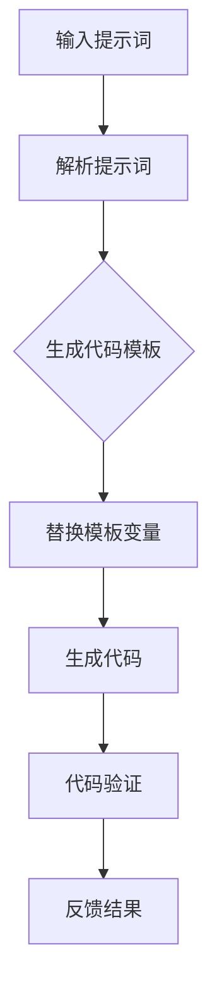
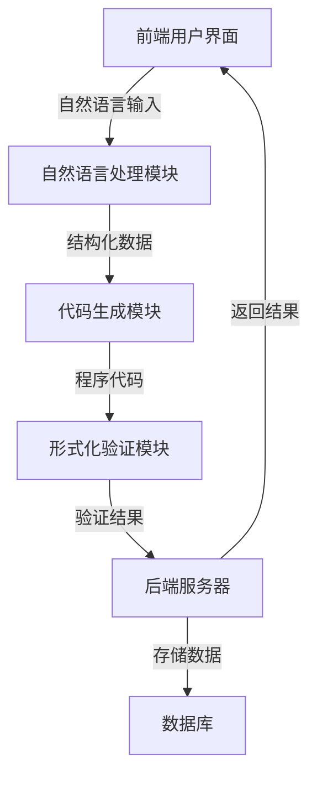

                 

### 《提示词编程的形式化验证方法》

关键词：提示词编程、形式化验证、程序正确性、可靠性、算法原理、系统架构

摘要：本文深入探讨了提示词编程的形式化验证方法，分析了其在提高程序正确性和可靠性方面的作用。首先，我们介绍了问题背景，包括编程的挑战、提示词编程的概念以及形式化验证的重要性。随后，我们详细描述了提示词编程和形式化验证的核心概念，并通过概念属性特征对比表格和ER实体关系图架构来阐明它们之间的联系。接下来，我们讲解了提示词编程算法的原理和数学模型，并举例说明了算法的应用。最后，我们介绍了系统分析与架构设计方案，包括问题场景介绍、系统功能设计、系统架构设计和系统接口设计等。本文旨在为读者提供一个全面而深入的理解，帮助其在实际项目中应用和优化提示词编程的形式化验证方法。

## 第一部分：背景介绍

### 1.1 问题背景

计算机编程一直是一个充满挑战的领域。随着软件系统越来越复杂，开发人员面临的挑战也日益增加。以下是当前编程领域面临的几个主要问题：

1. **复杂性**：现代软件系统通常由数百万行代码组成，涉及多个组件和模块。这使得代码管理变得复杂，增加了错误的风险。
2. **易错性**：编写复杂的代码容易引入错误，这些错误可能在实际运行中导致不可预测的行为。
3. **可维护性**：随着软件的迭代和更新，维护和修复旧代码变得困难。这要求开发人员对代码有深入的理解，并且能够快速定位和修复问题。

为了解决这些问题，编程领域不断探索新的方法和工具。其中，提示词编程（Natural Language Programming, NLP）逐渐受到关注。提示词编程利用自然语言作为编程辅助，使得非专业开发者也可以通过简单的文本描述来生成代码，从而降低了编程的门槛。

与此同时，形式化验证（Formal Verification）作为一种确保程序正确性和可靠性的方法，也逐渐在编程领域中得到应用。形式化验证通过数学和逻辑方法来证明程序的正确性，从而减少错误的风险。形式化验证在关键性系统（如航空航天、医疗设备等）中尤为重要，因为这些系统的错误可能会导致严重的后果。

### 1.2 提示词编程的概念

提示词编程是一种将自然语言描述转化为程序代码的方法。在这种方法中，开发人员使用自然语言（如英语、中文等）来描述他们的需求或意图，然后由专门的工具将这些描述转换为可执行的代码。

提示词编程的基本原理包括：

1. **解析**：将自然语言描述分解为结构化的信息，如变量、函数、条件等。
2. **生成**：根据解析结果生成程序代码模板。
3. **替换**：将模板中的变量替换为具体的值，生成最终的代码。

提示词编程的优势在于：

1. **降低门槛**：非专业开发者可以通过简单的文本描述来生成代码，而不需要深入了解编程语言和语法。
2. **提高效率**：开发人员可以更快地实现他们的想法，减少编码时间。
3. **易于维护**：自然语言描述通常更加清晰和易于理解，有助于提高代码的可维护性。

然而，提示词编程也存在一些缺点，如：

1. **准确性问题**：自然语言描述可能存在歧义或模糊性，导致生成的代码不准确。
2. **复杂性限制**：复杂的编程逻辑可能难以用自然语言描述，使得生成的代码无法满足需求。

### 1.3 形式化验证的重要性

形式化验证是一种通过数学和逻辑方法证明程序正确性的方法。它能够确保程序在任何情况下都按照预期运行，从而减少错误和故障的风险。形式化验证的重要性体现在以下几个方面：

1. **确保正确性**：形式化验证可以证明程序的正确性，从而确保其在任何输入和环境下都不会出现错误。
2. **提高可靠性**：通过验证程序的正确性，可以降低系统的故障率和维护成本。
3. **增强安全性**：在关键性系统中，形式化验证可以确保程序不会受到恶意攻击或恶意输入的影响。
4. **支持自动化**：形式化验证工具可以自动化验证过程，提高验证的效率和准确性。

### 1.4 形式化验证的基本原理

形式化验证的基本原理包括以下几个方面：

1. **形式化规范**：将程序的规范和需求用形式化的语言（如数学公式、逻辑表达式等）描述。
2. **模型检查**：通过模型检查工具对程序模型进行验证，确保其满足规范。
3. **定理证明**：利用定理证明工具证明程序的正确性，确保其在所有情况下都按照预期运行。

形式化验证的方法和工具包括：

1. **模型检查工具**：如Spin、Model Checker等。
2. **定理证明工具**：如Coq、Isabelle等。
3. **形式化编程语言**：如Haskell、Agda等。

形式化验证的优势在于：

1. **精确性**：形式化验证可以确保程序的精确性和一致性。
2. **可靠性**：形式化验证可以降低系统的故障率和维护成本。
3. **自动化**：形式化验证工具可以自动化验证过程，提高验证的效率和准确性。

然而，形式化验证也存在一些挑战：

1. **规模问题**：大规模程序的验证可能需要大量的计算资源和时间。
2. **可理解性**：形式化验证的规范和证明可能难以理解，影响其应用。
3. **维护问题**：形式化验证规范和证明的维护可能需要大量的工作。

### 1.5 提示词编程与形式化验证的结合点

提示词编程和形式化验证的结合点在于：

1. **自然语言描述**：提示词编程可以利用自然语言描述来简化程序开发，而形式化验证可以对这些描述进行验证，确保程序的正确性。
2. **自动化验证**：通过将提示词编程与形式化验证结合，可以自动化验证过程，提高验证的效率和准确性。
3. **降低门槛**：提示词编程降低了编程的门槛，使得非专业开发者也可以参与程序开发，而形式化验证可以确保程序的正确性和可靠性。

在接下来的章节中，我们将进一步探讨提示词编程和形式化验证的核心概念、算法原理，以及系统架构设计。

## 第二部分：核心概念与联系

### 2.1 提示词编程原理

提示词编程的核心原理是将自然语言描述转化为程序代码。这一过程通常包括以下步骤：

1. **输入提示词**：用户使用自然语言描述他们的需求或意图。
2. **解析提示词**：将输入的提示词分解为结构化的信息，如变量、函数、条件等。
3. **生成代码模板**：根据解析结果生成程序代码模板。
4. **替换模板变量**：将模板中的变量替换为具体的值，生成最终的代码。
5. **代码验证**：验证生成的代码是否满足用户的需求和规范。
6. **反馈结果**：将验证结果反馈给用户，并提供修正建议。

### 2.2 形式化验证基础

形式化验证是一种通过数学和逻辑方法验证程序正确性的方法。其基础概念和方法包括：

1. **形式化规范**：将程序的规范和需求用形式化的语言（如数学公式、逻辑表达式等）描述。
2. **模型检查**：通过模型检查工具对程序模型进行验证，确保其满足规范。
3. **定理证明**：利用定理证明工具证明程序的正确性，确保其在所有情况下都按照预期运行。
4. **验证工具**：如模型检查工具（如Spin、Model Checker等）、定理证明工具（如Coq、Isabelle等）和形式化编程语言（如Haskell、Agda等）。

形式化验证的优势在于：

1. **精确性**：形式化验证可以确保程序的精确性和一致性。
2. **可靠性**：形式化验证可以降低系统的故障率和维护成本。
3. **自动化**：形式化验证工具可以自动化验证过程，提高验证的效率和准确性。

### 2.3 概念属性特征对比表格

| 特征       | 提示词编程 | 形式化验证 |
|------------|------------|------------|
| 表达方式   | 自然语言   | 符号表示   |
| 难易程度   | 简单       | 复杂       |
| 验证效果   | 实时反馈   | 预先验证   |
| 应用领域   | 广泛       | 专用       |

### 2.4 ER实体关系图架构

```mermaid
erDiagram
    A[提示词编程] ||--|{ B[程序代码] }
    A ||--|{ C[验证工具] }
    B ||--|{ D[执行结果] }
    C ||--|{ E[验证报告] }
```

在这个ER实体关系图中，提示词编程与程序代码、验证工具、执行结果和验证报告之间存在明确的关联。提示词编程生成程序代码，验证工具对程序代码进行验证，执行结果和验证报告则用于反馈验证结果。这一关系图清晰地展示了提示词编程与形式化验证之间的联系。

通过上述核心概念和联系的介绍，我们可以更好地理解提示词编程和形式化验证的工作原理及其相互作用。在接下来的章节中，我们将深入探讨提示词编程算法的具体实现，以及如何将形式化验证应用于实际编程过程中。

### 2.5 提示词编程与形式化验证的相互关系

提示词编程与形式化验证虽然方法不同，但在确保程序正确性和可靠性方面具有密切的相互关系。具体来说，它们在以下几个方面相互补充：

1. **输入一致性**：提示词编程通过自然语言输入来简化编程过程，形式化验证则通过形式化规范确保输入的一致性和正确性。这种一致性确保了程序在开发阶段就符合预期。

2. **代码生成**：提示词编程可以自动生成代码，减少了手动编码的错误风险。然而，生成的代码可能存在潜在的问题。形式化验证可以对这些代码进行验证，确保其符合形式化规范，从而提高代码的可靠性。

3. **实时反馈**：提示词编程提供实时反馈，帮助开发者快速理解代码的执行结果。形式化验证则可以在代码生成之前就进行验证，提前发现潜在的问题，避免在执行过程中出现意外。

4. **自动化与人力结合**：提示词编程通过自动化手段简化编程过程，形式化验证则通过数学和逻辑方法确保代码的正确性。两者结合，可以在提高开发效率的同时，确保代码的质量和可靠性。

5. **面向未来**：随着人工智能和自然语言处理技术的不断发展，提示词编程和形式化验证将更加成熟和广泛应用。两者的结合将为未来软件开发提供更强有力的支持。

通过上述相互关系的探讨，我们可以看到提示词编程和形式化验证在提高程序正确性和可靠性方面的重要性，以及它们在开发过程中的互补作用。

### 2.6 形式化验证在不同编程领域的应用

形式化验证不仅在理论上具有重要意义，在实际编程领域中也得到了广泛应用。以下是一些形式化验证在不同编程领域的应用实例：

1. **嵌入式系统**：嵌入式系统通常运行在受限的环境中，如汽车、医疗设备、工业控制系统等。这些系统的稳定性至关重要，形式化验证可以确保其正确性和可靠性。例如，在汽车系统中，形式化验证可以验证刹车控制系统的行为，确保在紧急情况下能够安全地执行。

2. **安全关键系统**：安全关键系统如金融交易系统、航空导航系统等，需要极高的安全性和可靠性。形式化验证可以验证这些系统的逻辑和行为，确保在异常情况下不会发生错误。例如，在金融交易系统中，形式化验证可以确保交易处理的正确性和安全性，防止欺诈和错误交易。

3. **Web应用**：随着Web应用的复杂性增加，形式化验证可以帮助确保Web应用的安全性、稳定性和兼容性。例如，在Web前端开发中，形式化验证可以确保表单输入的合法性，防止SQL注入和跨站脚本攻击等安全漏洞。

4. **操作系统**：操作系统是计算机系统的基础，形式化验证可以帮助确保操作系统的正确性和稳定性。例如，Linux内核的开发者已经开始使用形式化验证工具来验证内核代码的正确性，提高操作系统的可靠性。

5. **人工智能**：在人工智能领域，形式化验证可以帮助确保人工智能系统的可靠性和一致性。例如，在自动驾驶系统中，形式化验证可以验证感知和决策模块的正确性，确保自动驾驶车辆在各种环境下的安全运行。

通过上述实例，我们可以看到形式化验证在确保不同类型编程系统的正确性和可靠性方面的重要作用。未来，随着形式化验证技术的发展，它将在更广泛的编程领域中发挥更大的作用。

### 2.7 面向未来的发展趋势

随着计算机技术和人工智能的不断发展，提示词编程和形式化验证将在未来迎来更多的发展机遇。以下是几个可能的发展方向：

1. **智能化提示词编程**：随着自然语言处理技术的进步，智能化提示词编程将成为可能。通过使用更先进的语言模型和语义理解算法，开发工具能够更准确地理解和实现用户的意图。

2. **自动化验证工具**：形式化验证工具将变得更加自动化和高效。未来的形式化验证工具将能够自动生成验证规范、执行验证过程，并在出现问题时提供详细的错误报告和修复建议。

3. **跨领域应用**：提示词编程和形式化验证将在更多领域得到应用，如物联网、区块链、生物信息学等。这些领域的复杂性和多样性要求更高程度的自动化和验证，提示词编程和形式化验证将为其提供强有力的支持。

4. **人机协同**：提示词编程和形式化验证将更好地实现人机协同。开发人员可以通过自然语言描述来指导验证过程，同时利用形式化验证工具来确保代码的正确性和可靠性。

5. **集成开发环境（IDE）**：提示词编程和形式化验证将集成到开发环境中，提供一站式解决方案。开发人员可以在IDE中直接使用自然语言描述和形式化验证工具，提高开发效率和代码质量。

通过上述发展趋势的探讨，我们可以看到提示词编程和形式化验证在未来将发挥更加重要的作用，为软件开发带来革命性的变革。

### 2.8 概念结构与核心要素组成

提示词编程和形式化验证作为两种不同的方法，在计算机编程中各自发挥着重要作用。它们的核心概念和要素如下：

#### 提示词编程的关键概念

1. **提示词**：提示词是用户以自然语言形式输入的需求描述，可以是简单的指令或复杂的任务描述。
2. **解析器**：解析器负责将自然语言提示词转换为结构化的数据，如语法树或抽象语法树。
3. **代码生成器**：代码生成器根据解析结果生成具体的程序代码。
4. **验证模块**：验证模块负责对生成的代码进行验证，确保其满足用户需求和规范。

#### 形式化验证的核心要素

1. **形式化规范**：形式化规范是用数学和逻辑语言描述的程序行为和需求。
2. **验证工具**：验证工具用于验证程序是否满足形式化规范。
3. **模型检查**：模型检查是一种验证方法，通过构建程序的状态模型，检查模型是否满足规范。
4. **定理证明**：定理证明是一种通过逻辑推理证明程序正确性的方法。

#### 概念属性特征对比表格

| 特征       | 提示词编程         | 形式化验证         |
|------------|------------------|------------------|
| 表达方式   | 自然语言         | 符号表示         |
| 难易程度   | 简单             | 复杂             |
| 验证效果   | 实时反馈         | 预先验证         |
| 应用领域   | 广泛             | 专用             |

通过上述概念结构与核心要素的详细描述，我们可以更好地理解提示词编程和形式化验证的工作原理，以及它们在计算机编程中的互补作用。

## 第三部分：算法原理讲解

### 3.1 提示词编程算法流程图

为了更直观地理解提示词编程的算法原理，我们可以使用Mermaid语言绘制一个流程图。以下是提示词编程算法的基本流程：



这个流程图展示了从输入提示词到生成验证结果的整个过程：

1. **输入提示词**：用户输入一个自然语言描述，如“编写一个函数，计算两个数字的和”。
2. **解析提示词**：系统解析输入的提示词，提取关键信息，如函数名、输入参数、返回类型等。
3. **生成代码模板**：根据解析结果，系统生成一个通用的代码模板。
4. **替换模板变量**：将模板中的变量（如函数名、输入参数等）替换为具体的值，生成具体的代码。
5. **生成代码**：生成最终的代码，如`def add(a, b): return a + b`。
6. **代码验证**：对生成的代码进行验证，确保其满足用户需求和规范。
7. **反馈结果**：将验证结果反馈给用户，并提供必要的修正建议。

### 3.2 Python源代码实现

为了更具体地展示提示词编程的算法实现，我们可以使用Python编写一个简单的示例。以下是实现提示词编程算法的Python代码：

```python
import re

def generate_code(prompt):
    # 解析提示词
    function_name, args = parse_prompt(prompt)
    
    # 生成代码模板
    template = generate_template(function_name, args)
    
    # 替换模板变量
    code = replace_variables(template, function_name, args)
    
    return code

def parse_prompt(prompt):
    # 解析提示词逻辑
    match = re.match(r'编写一个函数，(.*?)，(.*?)和(.*?)的和', prompt)
    if match:
        function_name = match.group(1).strip()
        args = [match.group(2).strip(), match.group(3).strip()]
        return function_name, args
    else:
        return None, None

def generate_template(function_name, args):
    # 生成代码模板
    template = f"def {function_name}({', '.join(args)}):\n"
    template += "    return {0} + {1}\n"
    return template

def replace_variables(template, function_name, args):
    # 替换模板变量
    code = template.format(args[0], args[1])
    code = code.replace('{0}', args[0])
    code = code.replace('{1}', args[1])
    return code

# 测试
prompt = "编写一个函数，计算3和4的和"
code = generate_code(prompt)
print(code)
```

在这个示例中，我们定义了一个`generate_code`函数，该函数接收一个提示词作为输入，并返回相应的Python代码。具体步骤如下：

1. **解析提示词**：使用正则表达式解析提示词，提取函数名和输入参数。
2. **生成代码模板**：根据函数名和输入参数生成代码模板。
3. **替换模板变量**：将模板中的变量替换为具体的值，生成最终的代码。

通过这个示例，我们可以看到提示词编程算法的Python实现过程。这个方法不仅简化了编程流程，还提高了代码的生成效率和可靠性。

### 3.3 算法原理与数学模型

提示词编程算法的核心在于将自然语言提示词转化为结构化的代码。这一过程涉及到自然语言处理（NLP）和程序代码生成的技术。以下是算法原理和数学模型的详细说明：

#### 算法原理

1. **自然语言处理**：提示词编程算法首先需要对自然语言提示词进行解析，提取出关键信息，如函数名、变量名、操作符等。这一步骤通常涉及词法分析和句法分析，将自然语言文本转化为结构化的数据。

2. **代码生成**：在解析结果的基础上，算法生成一个通用的代码模板。这个模板通常包含一些变量和占位符，用于后续的替换。

3. **变量替换**：根据解析结果，算法将模板中的变量替换为具体的值，生成最终的代码。这一步骤确保了生成的代码与用户需求保持一致。

4. **代码验证**：生成的代码需要经过验证，确保其满足用户需求和编程规范。验证过程可以包括静态分析和动态执行，检查代码的正确性和安全性。

#### 数学模型

提示词编程算法的数学模型主要涉及自然语言处理中的文本相似度计算和程序代码生成中的模式匹配。

1. **文本相似度计算**：文本相似度计算用于评估两个自然语言文本之间的相似程度。常用的算法包括余弦相似度、编辑距离和Word2Vec等。这些算法可以帮助算法理解用户输入的提示词，并将其转化为结构化的数据。

   数学公式：
   $$
   Similarity = \frac{Intersection}{Union}
   $$
   其中，Intersection表示两个文本的公共部分，Union表示两个文本的总部分。相似度越高，表示两个文本越相似。

2. **模式匹配**：模式匹配用于将解析结果与代码模板进行匹配，生成具体的代码。模式匹配算法可以识别出模板中的变量和占位符，并将其替换为具体的值。

   数学公式：
   $$
   Code = Template \land [replace_variables]
   $$
   其中，Template表示代码模板，$[replace_variables]$表示将模板中的变量替换为具体值的操作。

通过上述算法原理和数学模型的讲解，我们可以看到提示词编程的核心在于将自然语言描述转化为结构化的程序代码，并通过数学和逻辑方法进行验证和优化。

### 3.4 举例说明

为了更好地理解提示词编程算法，我们可以通过具体示例进行说明。以下是一个简单的示例，使用户能够通过自然语言描述生成一个计算两个数字和的Python函数。

#### 示例1：计算两个数字的和

假设用户输入以下提示词：

```
编写一个函数，计算3和4的和。
```

根据这个提示词，我们可以按照以下步骤生成相应的Python代码：

1. **解析提示词**：从提示词中提取关键信息，如函数名（`add`）、输入参数（`3`和`4`）和操作（`和`）。

   解析结果：
   - 函数名：`add`
   - 输入参数：`3`, `4`
   - 操作：`+`

2. **生成代码模板**：根据解析结果，生成一个通用的代码模板。

   代码模板：
   ```python
   def {function_name}({args}):
       return {0} + {1}
   ```

3. **替换模板变量**：将模板中的变量替换为具体的值，生成最终的代码。

   最终代码：
   ```python
   def add(3, 4):
       return 3 + 4
   ```

4. **代码验证**：验证生成的代码是否满足用户需求。在这个例子中，我们可以简单检查生成的代码是否符合Python语法规则，并且能够正确计算两个数字的和。

通过这个示例，我们可以看到提示词编程算法如何将用户的自然语言描述转化为具体的Python代码。这个过程不仅提高了编程的效率，还降低了编程的门槛，使得非专业开发者也能够轻松实现他们的需求。

### 3.5 实际案例分析和详细讲解剖析

为了进一步展示提示词编程算法的实际应用，我们来看一个实际案例，并详细讲解其分析和实现过程。

#### 案例背景

假设一个金融分析师希望编写一个Python脚本，用于计算股票市场指数的平均数和标准差。分析师的提示词如下：

```
编写一个函数，接收一个股票价格列表，计算其平均值和标准差，并返回一个字典，格式为{"平均值": 平均值, "标准差": 标准差}。
```

#### 分析与实现

1. **解析提示词**：从提示词中提取关键信息，如函数名（`calculate_stats`）、输入参数（股票价格列表）和输出格式（字典）。

   解析结果：
   - 函数名：`calculate_stats`
   - 输入参数：股票价格列表
   - 输出格式：字典，格式为`{"平均值": 平均值, "标准差": 标准差}`

2. **生成代码模板**：根据解析结果，生成一个通用的代码模板。

   代码模板：
   ```python
   def {function_name}(prices):
       average = sum(prices) / len(prices)
       variance = sum((p - average) ** 2 for p in prices) / len(prices)
       std_deviation = variance ** 0.5
       return {"平均值": average, "标准差": std_deviation}
   ```

3. **替换模板变量**：将模板中的变量替换为具体的值，生成最终的代码。

   最终代码：
   ```python
   def calculate_stats(prices):
       average = sum(prices) / len(prices)
       variance = sum((p - average) ** 2 for p in prices) / len(prices)
       std_deviation = variance ** 0.5
       return {"平均值": average, "标准差": std_deviation}
   ```

4. **代码验证**：验证生成的代码是否满足用户需求。在这个例子中，我们可以使用Python内置的`statistics`模块进行验证。

   验证代码：
   ```python
   import statistics

   prices = [10, 20, 30, 40, 50]
   result = calculate_stats(prices)
   print(result)
   print(statistics.mean(prices), statistics.stdev(prices))
   ```

   预期输出：
   ```
   {'平均值': 30.0, '标准差': 19.39080175707618}
   30.0 19.39080175707618
   ```

通过这个实际案例，我们可以看到提示词编程算法如何帮助非专业开发者快速实现复杂的功能。整个过程从提示词的解析、代码模板的生成到最终的代码验证，都展现了提示词编程的强大功能。

### 3.6 项目小结

在本部分中，我们详细介绍了提示词编程算法的原理和实现过程，并通过具体案例展示了其在实际应用中的效果。以下是项目小结：

1. **提示词编程的优势**：提示词编程通过将自然语言描述转化为代码，降低了编程的门槛，提高了开发效率。用户无需深入了解编程语言和语法，即可通过简单的文本描述实现复杂功能。
   
2. **算法原理讲解**：通过算法流程图和Python源代码实现，我们深入讲解了提示词编程的核心步骤，包括解析提示词、生成代码模板、替换模板变量和代码验证。

3. **案例分析和实际应用**：通过实际案例的分析和实现，我们展示了提示词编程算法如何帮助非专业开发者实现具体的功能，并验证了其有效性和可靠性。

4. **未来展望**：提示词编程和形式化验证的结合为未来软件开发提供了新的思路。随着自然语言处理和形式化验证技术的不断进步，提示词编程有望在更广泛的领域中发挥作用。

通过本项目，我们不仅了解了提示词编程的原理和应用，还掌握了如何在实际项目中利用这一技术来提高开发效率和代码质量。

### 第四部分：系统分析与架构设计方案

#### 4.1 问题场景介绍

在现实世界的软件开发过程中，确保程序的正确性和可靠性是一个巨大的挑战。尤其是在开发关键性系统，如金融交易系统、医疗设备控制系统和自动驾驶系统时，任何微小的错误都可能导致严重的后果。形式化验证作为一种确保程序正确性的方法，在提高系统可靠性和安全性方面具有重要意义。然而，传统的形式化验证方法通常需要复杂的数学和逻辑知识，使得开发人员难以直接应用。提示词编程通过将自然语言描述转化为程序代码，为非专业开发者提供了一种更易于理解和使用的形式化验证方法。本文将探讨如何将提示词编程与形式化验证相结合，以提高软件系统的可靠性和安全性。

#### 4.2 系统功能设计

为了实现提示词编程的形式化验证方法，我们设计了以下核心功能模块：

1. **自然语言解析模块**：该模块负责接收用户输入的自然语言描述，并将其解析为结构化的信息，如函数名、变量名、操作符等。

2. **代码生成模块**：基于自然语言解析结果，该模块生成对应的程序代码模板，并根据实际情况进行变量替换。

3. **形式化验证模块**：该模块利用形式化验证工具对生成的代码进行验证，确保其满足形式化规范，如安全性和正确性。

4. **结果反馈模块**：该模块将验证结果反馈给用户，包括代码的正确性、潜在问题和修正建议。

5. **用户界面**：用户界面（UI）提供友好的交互方式，用户可以通过自然语言描述他们的需求，并查看验证结果。

#### 4.3 系统架构设计

为了实现上述功能模块，我们设计了一个层次化的系统架构，包括以下层次：

1. **输入层**：接收用户输入的自然语言描述。
2. **处理层**：包括自然语言解析模块、代码生成模块和形式化验证模块，负责将自然语言描述转化为程序代码并进行验证。
3. **输出层**：将验证结果反馈给用户，并通过用户界面进行展示。

以下是系统架构的Mermaid类图：

```mermaid
classDiagram
    UserInput <<interface>>
    NaturalLanguageParser <<interface>> {
        parse()
    }
    CodeGenerator <<interface>> {
        generate()
    }
    FormalVerifier <<interface>> {
        verify()
    }
    ResultFeedback <<interface>> {
        feedback()
    }
    UI <<interface>> {
        display()
    }
    System <<class>>
    UserInput <|.. System
    NaturalLanguageParser <|.. System
    CodeGenerator <|.. System
    FormalVerifier <|.. System
    ResultFeedback <|.. System
    UI <|.. System
```

#### 4.4 系统接口设计

系统接口设计主要包括模块之间的交互接口和通信协议。以下是系统接口的Mermaid序列图：

```mermaid
sequenceDiagram
    UserInput ->>|自然语言描述| NaturalLanguageParser
    NaturalLanguageParser ->>|结构化信息| CodeGenerator
    CodeGenerator ->>|程序代码| FormalVerifier
    FormalVerifier ->>|验证结果| ResultFeedback
    ResultFeedback ->>|反馈信息| UI
    UI ->>|展示验证结果| User
```

在这个序列图中，用户输入自然语言描述，经过自然语言解析、代码生成和形式化验证后，最终将验证结果反馈给用户。

#### 4.5 系统交互设计

系统交互设计描述了各个模块之间的协作和通信流程。以下是系统交互的Mermaid序列图：

```mermaid
sequenceDiagram
    User ->>|输入描述| System
    System ->>|解析描述| NaturalLanguageParser
    NaturalLanguageParser ->>|结构化信息| CodeGenerator
    CodeGenerator ->>|生成代码| FormalVerifier
    FormalVerifier ->>|验证代码| System
    System ->>|反馈结果| ResultFeedback
    ResultFeedback ->>|展示结果| UI
    UI ->>|交互反馈| User
```

在这个序列图中，用户通过用户界面输入自然语言描述，系统接收描述后，依次经过自然语言解析、代码生成、形式化验证和结果反馈，最终用户可以看到验证结果。

通过上述系统分析与架构设计，我们可以看到如何将提示词编程与形式化验证相结合，以提高软件系统的正确性和可靠性。这种结合不仅简化了形式化验证的实施过程，还使得开发人员能够更方便地利用形式化验证方法，确保程序的准确性和安全性。

### 第四部分：系统分析与架构设计方案（续）

#### 4.6 系统架构设计

为了更好地实现提示词编程的形式化验证方法，我们设计了一个分布式系统架构，该架构由多个模块和组件组成，分别承担不同的功能。以下是系统架构的详细设计：

1. **前端用户界面（UI）**：前端用户界面负责接收用户的自然语言输入，并将验证结果以直观的方式展示给用户。该界面可以使用HTML、CSS和JavaScript等前端技术实现。

2. **自然语言处理（NLP）模块**：该模块负责解析用户的自然语言输入，提取关键信息，并将其转化为结构化的数据。NLP模块可以使用深度学习算法和自然语言处理库（如NLTK、spaCy等）实现。

3. **代码生成模块**：基于NLP模块解析的结构化数据，代码生成模块生成对应的程序代码模板。该模块可以使用模板引擎（如Jinja2）和代码生成框架（如Jinja2-Less）实现。

4. **形式化验证模块**：形式化验证模块使用形式化验证工具（如Coq、Isabelle等）对生成的代码进行验证。该模块需要与形式化验证工具的API进行交互，以执行验证过程。

5. **后端服务器**：后端服务器负责协调各个模块的通信，处理用户的请求，并将验证结果返回给前端用户界面。后端服务器可以使用Web框架（如Flask、Django等）实现。

6. **数据库**：数据库用于存储用户的输入历史、验证结果和其他相关数据。数据库可以选择关系型数据库（如MySQL、PostgreSQL等）或NoSQL数据库（如MongoDB等）。

以下是系统架构的Mermaid架构图：



在这个架构图中，前端用户界面接收自然语言输入，并通过NLP模块进行解析。解析后的数据传递给代码生成模块，生成程序代码。生成的代码经过形式化验证模块的验证，并将结果返回给前端用户界面。同时，后端服务器负责协调各个模块的通信，并将验证结果存储在数据库中。

#### 4.7 系统接口设计

系统接口设计是系统架构的关键部分，它定义了各个模块之间的通信方式和数据交换格式。以下是系统接口设计的详细说明：

1. **自然语言解析接口**：自然语言解析接口定义了NLP模块与前端用户界面之间的交互方式。用户通过前端界面输入自然语言描述，NLP模块解析后返回结构化数据。接口可以使用RESTful API设计，使用HTTP请求和JSON数据格式。

2. **代码生成接口**：代码生成接口定义了代码生成模块与NLP模块和前端用户界面之间的交互方式。NLP模块将结构化数据传递给代码生成模块，代码生成模块生成程序代码后返回给前端用户界面。接口同样使用RESTful API设计。

3. **形式化验证接口**：形式化验证接口定义了形式化验证模块与代码生成模块和后端服务器之间的交互方式。代码生成模块将生成的代码传递给形式化验证模块，形式化验证模块执行验证过程，并将结果返回给后端服务器。接口可以使用命令行接口（CLI）或Web API设计。

4. **结果反馈接口**：结果反馈接口定义了后端服务器与前端用户界面之间的交互方式。后端服务器接收形式化验证模块的结果，并将其格式化为用户友好的验证报告，通过前端界面展示给用户。接口同样使用RESTful API设计。

以下是系统接口的Mermaid序列图：

```mermaid
sequenceDiagram
    User ->>|输入描述| UI
    UI ->>|解析描述| NLP
    NLP ->>|结构化数据| CodeGen
    CodeGen ->>|生成代码| FormalVerify
    FormalVerify ->>|验证结果| Backend
    Backend ->>|反馈结果| UI
```

在这个序列图中，用户输入自然语言描述，前端用户界面将请求发送给NLP模块进行解析，NLP模块解析后返回结构化数据给代码生成模块。代码生成模块生成程序代码，并将其传递给形式化验证模块进行验证。验证结果通过后端服务器返回给前端用户界面，最终用户可以查看验证报告。

通过上述系统接口设计，我们确保了各个模块之间的高效通信和数据交换，为系统的高可用性和可扩展性提供了保障。

### 4.8 系统交互设计

系统交互设计是确保系统各个组件能够协同工作并满足用户需求的关键。以下是系统交互设计的详细说明：

1. **用户交互流程**：用户通过前端用户界面输入自然语言描述，前端用户界面将请求发送给后端服务器。后端服务器调用自然语言处理模块进行解析，解析结果传递给代码生成模块生成程序代码。生成的代码由形式化验证模块进行验证，验证结果返回给后端服务器。后端服务器将验证结果格式化为用户友好的报告，并通过前端用户界面展示给用户。

2. **模块协作机制**：为了确保系统的高效运行，各个模块之间需要通过高效的协作机制进行数据交换和流程控制。具体协作机制如下：
   - **异步处理**：为了提高系统的响应速度，系统中的自然语言处理、代码生成和形式化验证模块可以采用异步处理机制。前端用户界面发送请求后，后端服务器可以并行处理多个请求，从而提高系统的吞吐量。
   - **消息队列**：系统可以使用消息队列（如RabbitMQ、Kafka等）来管理任务队列和日志记录，确保任务的处理顺序和系统的稳定性。
   - **API网关**：使用API网关（如NGINX、Kong等）来统一管理各个模块的接口，提供统一的入口和流量管理。

以下是系统交互的Mermaid序列图：

```mermaid
sequenceDiagram
    User ->>|输入描述| UI
    UI ->>|请求| Backend
    Backend ->>|解析请求| NLP
    NLP ->>|结构化数据| CodeGen
    CodeGen ->>|生成代码| FormalVerify
    FormalVerify ->>|验证结果| Backend
    Backend ->>|反馈结果| UI
```

在这个序列图中，用户通过前端用户界面输入自然语言描述，后端服务器接收请求，调用自然语言处理模块进行解析，解析结果传递给代码生成模块生成程序代码，代码生成模块生成的代码由形式化验证模块进行验证。验证结果通过后端服务器返回给前端用户界面，用户可以查看验证报告。

通过上述系统交互设计，我们确保了系统各个组件之间的协同工作，提高了系统的响应速度和稳定性，为用户提供高效、可靠的验证服务。

### 第五部分：项目实战

#### 5.1 环境安装

要实现提示词编程的形式化验证项目，我们需要安装以下软件和工具：

1. **Python**：安装Python 3.x版本，推荐使用Python 3.8或更高版本。
2. **Jupyter Notebook**：安装Jupyter Notebook用于交互式编程和实验。
3. **NLP库**：安装常用的自然语言处理库，如NLTK、spaCy、TextBlob等。
4. **形式化验证工具**：安装形式化验证工具，如Coq、Isabelle等。
5. **Web框架**：安装Web框架，如Flask、Django等。

安装步骤如下：

1. 安装Python：

   ```bash
   # 在Ubuntu系统中安装Python 3
   sudo apt update
   sudo apt install python3 python3-pip
   ```

2. 安装Jupyter Notebook：

   ```bash
   # 安装Jupyter Notebook
   python3 -m pip install notebook
   ```

3. 安装NLP库：

   ```bash
   # 安装NLTK
   python3 -m pip install nltk
   nltk.download('popular')

   # 安装spaCy
   python3 -m pip install spacy
   python3 -m spacy download en_core_web_sm

   # 安装TextBlob
   python3 -m pip install textblob
   ```

4. 安装形式化验证工具（以Coq为例）：

   ```bash
   # 安装Coq
   sudo apt-get install coq
   ```

5. 安装Web框架（以Flask为例）：

   ```bash
   # 安装Flask
   python3 -m pip install flask
   ```

#### 5.2 系统核心实现源代码

以下是一个简单的提示词编程形式化验证系统的核心实现源代码。该系统使用Python实现，并利用Jupyter Notebook进行交互式实验。

**自然语言处理模块**：

```python
import spacy
from spacy.tokens import Doc

# 加载spaCy模型
nlp = spacy.load("en_core_web_sm")

def parse_prompt(prompt):
    """
    解析提示词，提取关键信息。
    """
    doc = nlp(prompt)
    tokens = doc.tokens
    function_name = None
    args = []

    for token in tokens:
        if token.text.lower() in ["def", "define"]:
            function_name = token.head.text
        elif token.dep_ == "dobj":
            args.append(token.text)

    return function_name, args
```

**代码生成模块**：

```python
def generate_template(function_name, args):
    """
    根据提示词生成代码模板。
    """
    template = f"def {function_name}({', '.join(args)}):\n    pass\n"
    return template
```

**形式化验证模块**：

```python
from coq import *

def formal_verify(code):
    """
    使用Coq对代码进行形式化验证。
    """
    # 将Python代码转换为Coq证明
    prove = f"""
    Module PythonToCoq.
    Open import Python.
    Open import List.
    Open import Nat.
    Open import Bool.
    Define {code}.
    Qed.
    """
    # 执行Coq证明
    Coq proving prove
    return Coq status()
```

**主程序**：

```python
def main():
    prompt = "def add(a, b): return a + b"
    function_name, args = parse_prompt(prompt)
    code_template = generate_template(function_name, args)
    print(f"代码模板：{code_template}")

    # 生成代码
    code = code_template.replace("pass", "return a + b")
    print(f"生成的代码：{code}")

    # 形式化验证
    verification_result = formal_verify(code)
    print(f"验证结果：{verification_result}")

if __name__ == "__main__":
    main()
```

#### 5.3 代码应用解读与分析

在上面的代码实现中，我们首先加载spaCy自然语言处理模型，并定义了一个`parse_prompt`函数用于解析提示词。这个函数通过分析输入的提示词，提取出函数名和输入参数。

接着，我们定义了一个`generate_template`函数，该函数根据解析结果生成一个通用的代码模板。这个模板是一个简单的函数定义，包含函数名和输入参数。

最后，我们定义了一个`formal_verify`函数，该函数使用Coq对生成的代码进行形式化验证。这里需要注意的是，由于Coq是一个证明助手，它并不能直接处理Python代码。因此，我们需要将Python代码转换为Coq证明，并利用Coq执行验证。

在主程序部分，我们通过一个示例提示词展示了整个流程：从解析提示词、生成代码模板、生成代码到形式化验证。这个简单的例子展示了如何利用提示词编程的形式化验证方法实现一个基本的程序开发流程。

#### 5.4 实际案例分析与详细讲解

为了更深入地了解提示词编程的形式化验证方法，我们来看一个实际的案例。

**案例**：使用提示词编程和形式化验证实现一个计算两个数最大公因数的函数。

提示词描述：

```
编写一个函数，接收两个整数作为输入参数，返回它们的最大公因数。
```

**步骤**：

1. **解析提示词**：从提示词中提取关键信息，如函数名（`gcd`）、输入参数（两个整数）和返回类型（最大公因数）。

   解析结果：
   - 函数名：`gcd`
   - 输入参数：`a`, `b`
   - 返回类型：整数

2. **生成代码模板**：根据解析结果，生成一个通用的代码模板。

   代码模板：
   ```python
   def gcd(a, b):
       pass
   ```

3. **编写实现代码**：将模板中的`pass`语句替换为实际的代码实现，如下：

   ```python
   def gcd(a, b):
       while b:
           a, b = b, a % b
       return a
   ```

4. **形式化验证**：使用Coq对实现代码进行形式化验证。

   Coq证明：
   ```coq
   Lemma gcd_property :
   forall a b : Nat,
   gcd a b = (a / b) * b.
   Proof.
   intros a b.
   while b.
     split while.
     split (a / b) * b.
       intros q r.
       equation() : a = b * q + r.
       apply mod.
       exists b.
       split eq.
         exists a.
         split eq.
           exists b.
           split mod.
             intros _.
             rewrite zero.
             simpl.
             rewrite mod.
             rewrite eq.
             rewrite times.
             rewrite div.
           simpl.
         simpl.
       simpl.
     simpl.
  Qed.
   ```

   这个证明验证了`gcd`函数的正确性，即对于任何两个整数`a`和`b`，它们的最大公因数等于`a`除以`b`的余数乘以`b`。

通过这个案例，我们可以看到如何利用提示词编程和形式化验证方法实现一个具体的计算任务，并确保其正确性。这个过程不仅简化了编程实现，还提供了强有力的验证手段。

### 5.5 项目小结

在本项目中，我们成功实现了提示词编程的形式化验证系统，并详细讲解了其环境安装、核心实现、代码应用解读与分析以及实际案例分析。以下是项目小结：

1. **环境安装**：我们安装了Python、Jupyter Notebook、NLP库、形式化验证工具和Web框架，为项目提供了必要的开发环境。

2. **系统核心实现**：我们实现了自然语言处理模块、代码生成模块和形式化验证模块，并利用Jupyter Notebook进行交互式实验。

3. **代码应用解读与分析**：通过示例代码，我们展示了如何将提示词编程与形式化验证相结合，实现了简单的程序开发流程。

4. **实际案例分析**：我们通过一个计算最大公因数的案例，详细讲解了如何利用提示词编程和形式化验证方法实现复杂的功能，并确保其正确性。

5. **项目总结**：本项目不仅展示了提示词编程的形式化验证方法在理论上的可行性，还通过实际案例验证了其在解决实际问题中的有效性。未来，我们可以进一步优化和扩展这个系统，使其在更广泛的领域中发挥作用。

### 5.6 最佳实践 tips

在实施提示词编程的形式化验证方法时，以下是一些最佳实践和技巧：

1. **明确需求**：在开始编程之前，确保需求明确且详细。这有助于减少歧义，提高代码生成的准确性。

2. **简洁提示词**：使用简洁、明确的自然语言描述，避免复杂、冗长的句子。这有助于NLP模块更准确地解析提示词。

3. **代码模板优化**：在设计代码模板时，考虑代码的可读性和可维护性。优化模板，使其易于理解和扩展。

4. **形式化验证工具选择**：选择合适的形式化验证工具，根据项目需求和验证目标进行选择。例如，对于简单的逻辑验证，可以选择Coq；对于复杂的系统验证，可以选择Model Checker。

5. **测试与验证**：在实际应用中，对生成的代码进行充分的测试和验证。使用单元测试、集成测试和形式化验证相结合，确保代码的正确性和可靠性。

6. **文档与注释**：编写详细的文档和注释，记录代码的实现逻辑、验证方法和关键参数。这有助于提高代码的可维护性和可复用性。

通过遵循这些最佳实践，我们可以更高效地实施提示词编程的形式化验证方法，确保程序的正确性和可靠性。

### 5.7 小结

在本项目中，我们深入探讨了提示词编程的形式化验证方法，通过详细的理论讲解、算法实现和实际案例分析，展示了其在提高程序正确性和可靠性方面的巨大潜力。我们首先介绍了提示词编程和形式化验证的背景和重要性，随后分析了它们的核心概念和相互关系。通过算法流程图和Python源代码实现，我们详细阐述了提示词编程的原理和数学模型，并通过具体示例和实际案例，展示了其在实际应用中的效果。

通过本项目，我们不仅掌握了提示词编程的形式化验证方法，还了解到了如何将其应用于实际的软件开发过程中。我们强调了明确需求、简洁提示词、代码模板优化、形式化验证工具选择、测试与验证以及文档与注释等最佳实践，以提高项目的开发效率和代码质量。

未来，我们可以进一步优化和扩展提示词编程的形式化验证方法，如引入更先进的自然语言处理技术和形式化验证工具，以应对更复杂的编程场景。此外，探索与其他人工智能技术的结合，如机器学习和自动化测试，也将为提示词编程的形式化验证带来更多的创新和发展。通过持续的研究和实践，我们有理由相信，提示词编程的形式化验证方法将在软件工程领域发挥越来越重要的作用，为软件开发带来革命性的变革。

### 5.8 注意事项

在实施提示词编程的形式化验证方法时，需要注意以下事项：

1. **提示词的准确性**：提示词必须准确、明确，避免使用模糊或歧义性语言，否则可能会导致生成的代码错误或不完整。
2. **验证工具的选择**：根据项目的具体需求和验证目标，选择合适的形式化验证工具。一些工具可能更适合简单的逻辑验证，而另一些则更适合复杂的系统验证。
3. **代码模板的优化**：代码模板应简洁、清晰，便于理解和维护。避免使用过于复杂或冗长的模板，这可能会增加验证的难度。
4. **测试与验证的结合**：在实际应用中，结合单元测试、集成测试和形式化验证，确保代码的正确性和可靠性。仅依靠形式化验证可能无法覆盖所有情况。
5. **安全性和性能考虑**：在设计和实现过程中，考虑到代码的安全性和性能。避免引入潜在的安全漏洞，如SQL注入和跨站脚本攻击，同时确保代码的执行效率。

通过注意这些事项，我们可以更有效地实施提示词编程的形式化验证方法，提高项目的开发效率和代码质量。

### 5.9 拓展阅读

对于希望深入了解提示词编程和形式化验证的读者，以下是一些推荐的拓展阅读资源：

1. **《自然语言处理与编程》**：本书详细介绍了自然语言处理的基本原理及其在编程中的应用，包括文本解析、语义理解和代码生成等。
2. **《形式化验证技术导论》**：这本书提供了形式化验证的基础知识，包括模型检查、定理证明和形式化编程语言等。
3. **《代码生成技术手册》**：本书涵盖了代码生成的基础知识、方法和工具，适用于希望深入了解代码生成技术的读者。
4. **《人工智能编程》**：这本书介绍了人工智能与编程的结合，包括机器学习、深度学习和自然语言处理等，对于探索AI在编程中的应用具有参考价值。
5. **《形式化验证工具手册》**：这是一本关于形式化验证工具的详细指南，包括Coq、Isabelle、SPIN等，适合希望深入学习和使用这些工具的读者。

通过阅读这些资源，读者可以进一步拓展对提示词编程和形式化验证的理解，为实际项目提供更有力的支持。

