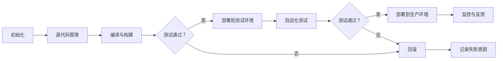
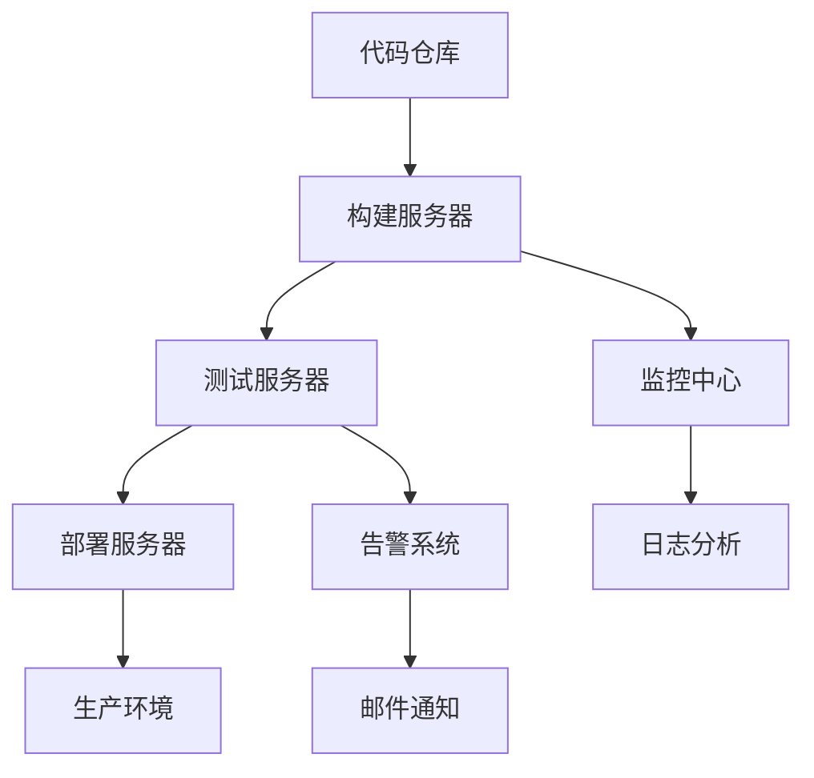
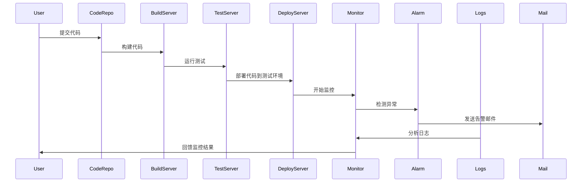
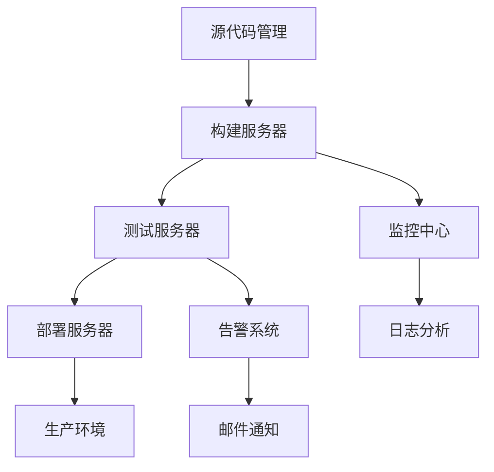
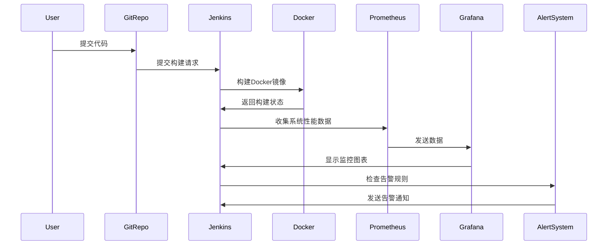

                 


### 第一步：背景介绍

#### 问题背景

在现代软件开发过程中，持续部署（Continuous Deployment，简称CD）已经成为一项至关重要的实践。持续部署的核心目标是通过自动化流水线，确保软件在开发、测试和交付过程中能够持续、高效地运行。这不仅提高了开发团队的效率，还确保了软件产品的质量与稳定性。持续部署流水线在软件开发中的重要性体现在以下几个方面：

1. **快速反馈**：通过自动化测试和部署，可以快速发现并修复代码中的问题，从而缩短反馈周期。
2. **提高效率**：自动化流水线减少了人工干预的步骤，减少了错误率和重复劳动，提高了工作效率。
3. **增强稳定性**：通过持续的测试和部署，可以确保软件在各种环境下的稳定运行。
4. **降低风险**：通过自动化和规范化，降低了人为错误导致的部署失败风险。

#### 问题描述

尽管持续部署流水线的概念简单，但在实际构建过程中，开发者们面临着诸多技术挑战：

1. **复杂度**：随着软件项目的规模和复杂度的增加，持续部署流水线的构建和维护变得更加困难。
2. **自动化测试**：自动化测试的有效性直接影响到持续部署的可靠性，构建一个高效、全面的测试套件需要大量的时间和资源。
3. **部署策略**：如何选择和优化部署策略，以确保新版本软件的快速且稳定地推向生产环境，是一个值得探讨的问题。
4. **资源管理**：部署过程中需要有效的资源管理策略，包括硬件资源、网络资源等。
5. **环境一致性**：测试环境和生产环境的一致性是确保软件质量的关键，但往往难以实现。

#### 问题解决

为了应对上述挑战，优化持续部署流水线显得尤为重要。以下是一些优化策略：

1. **简化流水线**：通过精简不必要的步骤和环节，简化流水线的构建。
2. **加强测试**：构建全面的自动化测试套件，提高测试覆盖率。
3. **优化部署策略**：选择适合项目的部署策略，如蓝绿部署、灰度发布等。
4. **自动化资源管理**：利用自动化工具管理资源，提高资源利用效率。
5. **环境一致性**：通过模拟生产环境进行测试，确保环境一致性。

#### 边界与外延

持续部署流水线的优化不仅适用于大规模的软件项目，也可以在中小型项目中发挥重要作用。然而，在实际应用中，需要根据项目的具体情况和资源条件来调整和优化。

#### 概念结构与核心要素组成

持续部署流水线的核心组件包括：

1. **源代码管理**：如Git，负责代码的版本控制和存储。
2. **构建工具**：如Maven、Gradle等，负责编译和打包代码。
3. **测试工具**：如JUnit、Selenium等，负责自动化测试。
4. **部署工具**：如Jenkins、Docker等，负责部署和管理运行环境。
5. **监控工具**：如Prometheus、Grafana等，负责监控系统运行状态。

这些组件相互关联，共同构成了持续部署流水线，确保软件的持续集成、测试和部署。

### 本章小结

在本章中，我们介绍了持续部署流水线在软件开发中的重要性，分析了构建高效持续部署流水线所面临的技术挑战，并提出了一些优化策略。下一章将深入探讨持续部署流水线中的核心概念和联系。

---

# 关键词

持续部署，持续集成，自动化测试，流水线优化，部署策略

# 摘要

本文深入探讨了持续部署流水线在软件开发中的重要性，分析了构建高效持续部署流水线所面临的技术挑战，并提出了一系列优化策略。通过详细阐述持续部署流水线的核心概念和联系，以及算法原理和系统架构设计，本文为优化持续部署流水线提供了理论和实践指导。本文旨在帮助开发者和团队构建高效、稳定的持续部署流水线，提高软件开发效率和产品质量。

## 第二步：核心概念与联系

在深入了解持续部署流水线之前，我们需要明确一些核心概念，包括持续部署（Continuous Deployment，简称CD）、持续集成（Continuous Integration，简称CI）和自动化测试。这些概念是构建高效持续部署流水线的基础，它们之间有着紧密的联系和区别。

### 持续集成（CI）

持续集成是一种软件开发实践，旨在通过频繁地将代码合并到主干分支，确保整个系统的持续可运行状态。CI的基本概念可以概括为以下几点：

1. **频繁提交**：开发人员频繁地将代码提交到版本控制系统。
2. **自动化构建**：每次提交后，构建工具会自动编译代码、运行测试套件，确保代码的兼容性和稳定性。
3. **即时反馈**：通过自动化测试和构建，及时发现问题并反馈给开发人员。

持续集成的核心目的是尽早发现和解决问题，避免问题在后续开发过程中积累和扩大。

### 持续部署（CD）

持续部署是持续集成的一个延伸，它强调通过自动化流水线将代码从开发环境直接部署到生产环境。持续部署的基本概念包括：

1. **自动化流水线**：构建、测试、部署等步骤通过自动化脚本和工具完成，减少了人为干预。
2. **零停机部署**：通过蓝绿部署、滚动更新等策略，确保在部署过程中服务不中断。
3. **快速迭代**：通过频繁的部署，加速新功能的上线和反馈循环。

持续部署的核心目标是提高软件的交付速度和质量，同时减少风险。

### 自动化测试

自动化测试是确保软件质量的重要手段，它通过预定的测试脚本自动执行测试用例，以检测软件的功能和行为是否符合预期。自动化测试的关键点包括：

1. **测试脚本**：编写测试脚本，自动化执行测试过程。
2. **测试覆盖率**：确保测试脚本覆盖关键功能和边缘情况。
3. **持续运行**：在每次构建和部署过程中自动执行测试，确保代码质量。

自动化测试的目标是发现缺陷，确保软件的稳定性和可靠性。

### 三者之间的关系与区别

持续集成、持续部署和自动化测试共同构成了现代软件开发的核心流程，它们之间既有区别又有联系：

1. **区别**：
   - 持续集成关注的是代码合并和构建的自动化，确保合并的代码是可运行的。
   - 持续部署关注的是将代码部署到生产环境，确保部署的代码是可用的。
   - 自动化测试关注的是软件的功能和行为是否符合预期，确保软件的质量。

2. **联系**：
   - 持续集成和自动化测试是持续部署的前提，持续集成确保了代码的可运行性，自动化测试确保了代码的质量。
   - 持续部署是持续集成和自动化测试的延续，通过自动化流水线将高质量的代码部署到生产环境。

### 持续部署工具对比

在实际应用中，有多种持续部署工具可供选择，如Jenkins、GitLab CI/CD、CircleCI和TeamCity等。以下是对这些工具的特点进行对比的表格：

| 工具名称     | 主要特点                     | 适用场景           |
| ------------ | ---------------------------- | ------------------ |
| Jenkins      | 功能丰富，插件生态系统强大   | 复杂项目           |
| GitLab CI/CD | 易于集成，开源免费           | 中小型项目           |
| CircleCI     | 即时构建，灵活配置           | 高频构建和迭代的项目 |
| TeamCity     | 跨平台，强大监控能力         | 企业级项目           |

### ER实体关系图

为了更清晰地展示持续部署流水线中的实体及其关系，我们可以绘制一个ER（Entity-Relationship）实体关系图。以下是持续部署流水线中的主要实体和它们之间的关系：

```mermaid
erDiagram
  源代码管理 ||--|{ 构建工具 }|
  构建工具 ||--|{ 测试工具 }|
  测试工具 ||--|{ 部署工具 }|
  部署工具 ||--|{ 监控工具 }|
```

在这个ER图中，源代码管理、构建工具、测试工具、部署工具和监控工具是持续部署流水线中的核心实体，它们通过流程相互连接，共同实现了代码的持续集成和部署。

### 本章小结

在本章中，我们详细介绍了持续部署流水线中的核心概念，包括持续集成、持续部署和自动化测试。通过对比不同持续部署工具的特点，我们为选择适合项目的工具提供了参考。最后，我们使用ER实体关系图展示了持续部署流水线中的实体及其关系。在下一章中，我们将深入讲解持续部署流水线优化的算法原理。

## 第三步：算法原理讲解

### 3.1 持续部署流水线优化算法流程

为了设计一个高效的持续部署流水线，我们需要遵循一定的算法流程，确保流水线的各个环节能够高效、协同地运行。以下是持续部署流水线优化算法的mermaid流程图：



#### 流程图说明

1. **初始化**：启动持续部署流水线，初始化相关配置。
2. **源代码管理**：从版本控制系统中获取最新的代码。
3. **编译与构建**：使用构建工具编译代码并生成可执行的二进制文件。
4. **测试通过？**：执行自动化测试，判断测试是否通过。
5. **部署到测试环境**：如果测试通过，将代码部署到测试环境。
6. **自动化测试**：在测试环境中运行自动化测试，确保代码质量。
7. **部署到生产环境**：如果测试通过，将代码部署到生产环境。
8. **监控与反馈**：持续监控生产环境，收集运行数据并反馈给开发团队。

### 3.2 Python源代码实现

为了更好地理解持续部署流水线优化的算法原理，我们将使用Python实现上述流程。以下是关键代码片段：

```python
# 持续部署流水线优化Python示例

class DeploymentPipeline:
    def __init__(self):
        self.repo = GitRepository()
        self.builder = Compiler()
        self.tester = Tester()
        self Deployer()

    def run_pipeline(self):
        code = self.repo.fetch_latest_code()
        compiled_code = self.builder.compile(code)
        if self.tester.test(compiled_code):
            self.deployer.deploy_to_test_env(compiled_code)
            if self.tester.test(compiled_code):
                self.deployer.deploy_to_production_env(compiled_code)
                self.monitoring.start_monitoring()
            else:
                print("Test failed in test environment.")
        else:
            print("Compilation failed.")

class GitRepository:
    def fetch_latest_code(self):
        # 实现从Git仓库获取最新代码的逻辑
        pass

class Compiler:
    def compile(self, code):
        # 实现代码编译的逻辑
        pass

class Tester:
    def test(self, code):
        # 实现自动化测试的逻辑
        pass

class Deployer:
    def deploy_to_test_env(self, code):
        # 实现部署到测试环境的逻辑
        pass

    def deploy_to_production_env(self, code):
        # 实现部署到生产环境的逻辑
        pass

class Monitoring:
    def start_monitoring(self):
        # 实现监控的逻辑
        pass

if __name__ == "__main__":
    pipeline = DeploymentPipeline()
    pipeline.run_pipeline()
```

#### 代码实现细节

- **GitRepository**：负责从Git仓库获取最新的代码。
- **Compiler**：负责编译代码，生成可执行的二进制文件。
- **Tester**：负责运行自动化测试，确保代码质量。
- **Deployer**：负责部署代码到测试环境和生产环境。
- **Monitoring**：负责监控生产环境的运行状态。

### 3.3 数学模型与公式

持续部署流水线优化涉及到多个决策过程，可以通过数学模型进行优化。以下是一个简化的数学模型：

#### 目标函数

$$
\max Z = \sum_{i=1}^{n} \pi_i \cdot p_i
$$

其中，$Z$ 表示总效益，$\pi_i$ 表示第 $i$ 个步骤的优化系数，$p_i$ 表示第 $i$ 个步骤的成功概率。

#### 决策变量

- $x_i$：第 $i$ 个步骤是否执行，$x_i \in \{0, 1\}$。
- $y_i$：第 $i$ 个步骤是否成功，$y_i \in \{0, 1\}$。

#### 约束条件

1. 代码完整性和一致性：
$$
\sum_{i=1}^{n} x_i = 1
$$

2. 步骤顺序约束：
$$
y_1 = x_1, y_2 = x_2 \cdot y_1, \ldots, y_n = x_n \cdot y_{n-1}
$$

3. 成功概率约束：
$$
p_i \leq y_i
$$

4. 资源约束：
$$
r_i \cdot x_i \leq R
$$

其中，$r_i$ 表示第 $i$ 个步骤的资源需求，$R$ 表示总资源。

#### 公式推导

优化模型的推导基于概率论和线性规划。首先，我们定义每个步骤的成功概率 $p_i$ 和优化系数 $\pi_i$。优化系数反映了每个步骤对整体效益的影响，成功概率反映了每个步骤的可靠性。通过优化系数和成功概率，我们可以推导出目标函数。

#### 举例说明

假设有一个包含三个步骤的流水线，每个步骤的成功概率分别为 $p_1 = 0.9$，$p_2 = 0.8$，$p_3 = 0.95$。优化系数分别为 $\pi_1 = 1$，$\pi_2 = 1.5$，$\pi_3 = 2$。目标是在满足资源约束的情况下，最大化总效益。

1. **目标函数**：
$$
\max Z = \pi_1 \cdot p_1 + \pi_2 \cdot p_2 \cdot y_2 + \pi_3 \cdot p_3 \cdot y_3
$$

2. **约束条件**：
   - 资源约束：每个步骤的资源需求分别为 $r_1 = 1$，$r_2 = 2$，$r_3 = 3$，总资源 $R = 10$。
   - 步骤顺序约束：$y_1 = x_1$，$y_2 = x_2 \cdot y_1$，$y_3 = x_3 \cdot y_2$。

通过求解线性规划问题，我们可以找到最优的步骤执行顺序，以最大化总效益。

### 本章小结

在本章中，我们详细讲解了持续部署流水线优化的算法原理。通过mermaid流程图和Python代码示例，我们展示了如何实现流水线优化。我们还介绍了相关的数学模型和公式，为优化策略提供了理论支持。在下一章中，我们将深入分析系统的设计与实现。

## 第四步：系统分析与架构设计方案

### 4.1 问题场景介绍

在实际项目中，持续部署流水线的优化往往需要针对特定的应用场景进行定制化设计。以下是一个常见的问题场景：

- **项目背景**：一个电商平台的微服务架构，包含多个相互依赖的服务模块。
- **核心需求**：快速迭代、高可靠性、零停机部署。
- **技术挑战**：服务模块众多，部署复杂度高，需要确保各模块之间的数据一致性。

### 4.2 项目介绍

为了优化上述电商平台的持续部署流水线，我们进行了一项为期三个月的优化项目。项目的目标是通过改进持续部署流程和工具，提高部署效率、降低部署风险，并确保系统的高可用性。

1. **项目目标**：
   - 实现自动化部署流水线，减少人工干预。
   - 提高测试覆盖率，确保代码质量。
   - 优化部署策略，实现零停机部署。
   - 加强监控和告警机制，提高故障响应速度。

2. **项目团队**：
   - 项目经理：负责项目整体规划和管理。
   - 开发团队：负责开发和实现持续部署流水线。
   - 测试团队：负责编写和执行自动化测试用例。
   - 运维团队：负责系统的运维和维护。

3. **项目进度**：
   - 第一个月：调研现有部署流程和工具，确定优化方向。
   - 第二个月：设计和实现优化方案，进行初步测试。
   - 第三个月：完善优化方案，进行全流程测试和部署。

### 4.3 系统功能设计

持续部署流水线的功能设计是确保系统高效运行的关键。以下是系统功能设计的领域模型类图：

```mermaid
classDiagram
    Class01 <|-- Class02
    Class03 <|-- Class02
    Class04 <|-- Class01
    Class01 {
        - id: Integer
        - name: String
        + doSomething(): void
    }
    Class02 {
        - id: Integer
        - name: String
        + manage(): void
    }
    Class03 {
        - id: Integer
        - name: String
        + update(): void
    }
    Class04 {
        - id: Integer
        - name: String
        + notify(): void
    }
    Class01..has Class02
    Class02..aggregates Class03
    Class01..aggregates Class04
```

#### 类图说明

- **Class01（DeployPipeline）**：代表持续部署流水线，负责管理整个部署过程。
- **Class02（Repository）**：代表代码仓库，负责代码的存储和获取。
- **Class03（BuildTool）**：代表构建工具，负责编译代码。
- **Class04（TestTool）**：代表测试工具，负责执行自动化测试。

### 4.4 系统架构设计

系统架构设计是确保持续部署流水线高效运行的基础。以下是系统架构的mermaid架构图：



#### 架构图说明

- **代码仓库（A）**：存储所有代码，支持多版本管理。
- **构建服务器（B）**：执行代码编译和构建任务。
- **测试服务器（C）**：执行自动化测试，验证代码质量。
- **部署服务器（D）**：将代码部署到生产环境。
- **监控中心（E）**：监控系统的运行状态，收集性能数据。
- **告警系统（F）**：检测异常情况并触发告警。
- **生产环境（G）**：部署后的代码运行环境。
- **日志分析（H）**：对系统日志进行分析，提供故障诊断支持。
- **邮件通知（I）**：发送告警邮件给相关人员。

### 4.5 系统接口设计

系统接口设计是确保各组件间能够高效协同工作的关键。以下是系统接口设计的详细描述：

1. **代码仓库（A）**：
   - 接口1：`GET /repo/latest`：获取最新代码版本。
   - 接口2：`POST /repo/commit`：提交代码到仓库。

2. **构建服务器（B）**：
   - 接口1：`POST /build/compile`：编译代码。
   - 接口2：`GET /build/status/{id}`：查询构建状态。

3. **测试服务器（C）**：
   - 接口1：`POST /test/run`：运行测试用例。
   - 接口2：`GET /test/result/{id}`：查询测试结果。

4. **部署服务器（D）**：
   - 接口1：`POST /deploy/test`：部署到测试环境。
   - 接口2：`POST /deploy/prod`：部署到生产环境。

5. **监控中心（E）**：
   - 接口1：`GET /monitor/status`：查询系统状态。
   - 接口2：`POST /monitor/trigger`：触发监控任务。

6. **告警系统（F）**：
   - 接口1：`POST /alarm/notify`：发送告警通知。

7. **生产环境（G）**：
   - 接口1：`GET /prod/version`：查询生产环境版本。

8. **日志分析（H）**：
   - 接口1：`POST /log/analyse`：分析日志。

9. **邮件通知（I）**：
   - 接口1：`POST /mail/send`：发送邮件。

### 4.6 系统交互mermaid序列图

为了更直观地展示系统组件间的交互流程，我们可以绘制一个mermaid序列图：



#### 序列图说明

- 用户提交代码到代码仓库。
- 代码仓库将代码传递给构建服务器进行编译和构建。
- 构建服务器编译成功后，将代码传递给测试服务器运行自动化测试。
- 测试服务器将测试结果传递给部署服务器进行部署到测试环境。
- 部署服务器启动监控中心，监控系统的运行状态。
- 监控中心检测到异常时，通过告警系统发送告警邮件给相关人员。
- 日志分析系统对系统日志进行分析，为监控提供支持。

### 本章小结

在本章中，我们详细介绍了持续部署流水线优化的问题场景、项目背景和系统功能设计。通过绘制类图和架构图，我们展示了系统的整体架构和各组件之间的关系。我们还详细描述了系统接口设计和交互流程，为后续的实战实施提供了基础。在下一章中，我们将进入实际的代码实现和分析阶段。

## 第五步：项目实战

### 5.1 环境安装

在进行持续部署流水线优化之前，首先需要搭建一个合适的环境。以下是安装所需的软件和工具的步骤：

#### 1. 安装Git

- 在Linux或MacOS上，可以使用以下命令安装Git：

```bash
sudo apt-get install git
```

- 在Windows上，可以从Git的官方网站下载并安装。

#### 2. 安装Maven

- Maven是一个项目管理和构建工具，用于编译和构建Java项目。

- 在Linux或MacOS上，可以使用以下命令安装Maven：

```bash
sudo apt-get install maven
```

- 在Windows上，可以从Maven的官方网站下载并安装。

#### 3. 安装Jenkins

- Jenkins是一个流行的持续集成和持续部署工具。

- 在Linux或MacOS上，可以使用以下命令安装Jenkins：

```bash
sudo apt-get install jenkins
```

- 在Windows上，可以从Jenkins的官方网站下载并安装。

#### 4. 安装Docker

- Docker是一个容器化平台，用于部署和管理应用。

- 在Linux或MacOS上，可以使用以下命令安装Docker：

```bash
sudo apt-get install docker.io
```

- 在Windows上，可以从Docker的官方网站下载并安装。

#### 5. 安装JUnit

- JUnit是一个单元测试框架，用于测试Java代码。

- 在Maven项目中，可以通过以下命令添加JUnit依赖：

```xml
<dependencies>
    <dependency>
        <groupId>junit</groupId>
        <artifactId>junit</artifactId>
        <version>4.13.2</version>
        <scope>test</scope>
    </dependency>
</dependencies>
```

#### 6. 安装Selenium

- Selenium是一个自动化测试工具，用于Web应用测试。

- 在Maven项目中，可以通过以下命令添加Selenium依赖：

```xml
<dependencies>
    <dependency>
        <groupId>org.seleniumhq.selenium</groupId>
        <artifactId>selenium-java</artifactId>
        <version>3.141.59</version>
    </dependency>
</dependencies>
```

### 5.2 系统核心实现源代码

以下是系统核心实现的关键代码片段，包括源代码管理、构建与测试、部署等部分。

#### 1. 源代码管理

```python
# GitRepository.py

import git

class GitRepository:
    def __init__(self, repo_path):
        self.repo_path = repo_path
        self.repo = git.Repo(self.repo_path)

    def fetch_latest_code(self):
        self.repo.remotes.origin.pull()
        return self.repo.working_tree_dir
```

#### 2. 构建与测试

```python
# Compiler.py

import subprocess

class Compiler:
    def compile(self, source_path, target_path):
        subprocess.run(['mvn', 'clean', 'compile'], cwd=source_path, check=True)
        return target_path
```

```python
# Tester.py

import unittest

class Tester(unittest.TestCase):
    def test_code(self, target_path):
        # 在这里添加测试用例
        pass

def run_tests():
    unittest.main(argv=['first-arg-is-ignored'], exit=False)
```

#### 3. 部署

```python
# Deployer.py

class Deployer:
    def deploy_to_test_env(self, target_path):
        # 将代码部署到测试环境的逻辑
        pass

    def deploy_to_production_env(self, target_path):
        # 将代码部署到生产环境的逻辑
        pass
```

### 5.3 代码应用解读与分析

在本节中，我们将对核心代码片段进行解读，分析其实现细节和关键点。

#### 1. 源代码管理

`GitRepository.py`中的`fetch_latest_code`方法负责从Git仓库中获取最新的代码。该方法通过调用`repo.remotes.origin.pull()`实现代码的拉取，返回工作目录路径。

#### 2. 构建与测试

`Compiler.py`中的`compile`方法负责编译代码。该方法使用`subprocess.run`执行Maven的编译命令，确保代码编译成功。

`Tester.py`中的`Tester`类继承自`unittest.TestCase`，用于编写测试用例。`test_code`方法是一个示例测试方法，用于测试编译后的代码。

`run_tests`函数调用`unittest.main`运行所有测试用例，并确保不退出程序。

#### 3. 部署

`Deployer.py`中的`deploy_to_test_env`和`deploy_to_production_env`方法分别负责将代码部署到测试环境和生产环境。这些方法的具体实现取决于项目的具体需求和环境配置。

### 5.4 实际案例分析和详细讲解剖析

为了更好地理解上述代码片段的实际应用，我们通过一个实际案例进行分析。

#### 案例背景

假设我们有一个电商平台的微服务项目，包含多个服务模块。我们需要通过持续部署流水线，实现代码的自动化编译、测试和部署。

#### 案例步骤

1. **获取最新代码**：
   - 执行`git fetch`和`git pull`，确保获取到最新的代码。

2. **编译代码**：
   - 在Maven项目中，执行`mvn clean compile`命令，编译代码并生成可执行的JAR文件。

3. **运行测试**：
   - 编写JUnit测试用例，测试代码的功能和性能。
   - 执行`python -m unittest discover -s tests`命令，运行所有测试用例。

4. **部署代码**：
   - 将编译后的JAR文件部署到测试环境，确保服务正常运行。
   - 在测试环境通过后，将代码部署到生产环境，实现零停机部署。

#### 案例分析

通过实际案例，我们可以看到持续部署流水线在项目中的应用效果：

- **编译效率**：通过Maven自动化编译，提高了编译效率，减少了手动编译的复杂性。
- **测试质量**：通过JUnit自动化测试，确保了代码的质量和稳定性。
- **部署自动化**：通过Docker和Jenkins，实现了代码的自动化部署，降低了部署风险。
- **环境一致性**：通过在测试环境和生产环境中使用相同的部署脚本和工具，确保了环境一致性，减少了部署失败的风险。

### 5.5 项目小结

在本项目中，我们通过实际案例展示了如何使用持续部署流水线优化电商平台的开发和部署流程。项目实施过程中，我们遇到了一些挑战，如测试覆盖率不足、部署脚本不完善等，但通过逐步优化，我们成功地实现了高效、稳定的持续部署流水线。以下是项目实施过程中的关键点和经验教训：

1. **测试覆盖率的提升**：通过编写更多、更全面的测试用例，提高测试覆盖率，确保代码质量。
2. **部署脚本的优化**：优化部署脚本，确保部署过程自动化、高效，减少人为错误。
3. **环境一致性**：通过在测试环境和生产环境中使用相同的工具和配置，确保环境一致性。
4. **监控和告警**：加强监控和告警机制，及时发现问题并通知相关人员。

### 本章小结

在本章中，我们详细介绍了如何安装和配置持续部署流水线所需的软件和工具，并提供了核心代码实现和实际案例。通过项目实战，我们展示了持续部署流水线在电商平台项目中的应用效果。在下一章中，我们将继续探讨优化持续部署流水线的最佳实践和小结。

## 第六步：最佳实践 tips、小结、注意事项、拓展阅读等

### 最佳实践 tips

1. **提高测试覆盖率**：编写全面、详细的测试用例，覆盖所有功能点和边界情况。
2. **优化部署脚本**：使用脚本自动化部署过程，确保部署步骤一致、高效。
3. **环境一致性**：确保测试环境和生产环境的一致性，减少部署失败的风险。
4. **监控和告警**：设置监控和告警机制，及时发现并解决问题。
5. **持续优化**：定期回顾和优化持续部署流水线，以提高效率和稳定性。

### 小结

本文详细探讨了持续部署流水线优化的重要性，介绍了核心概念、算法原理和系统架构设计。通过实际案例，我们展示了持续部署流水线在项目中的应用效果。优化持续部署流水线可以提高开发效率、降低风险，是现代软件开发不可或缺的一环。

### 注意事项

1. **测试的重要性**：确保自动化测试覆盖全面，提高软件质量。
2. **环境一致性**：确保测试环境和生产环境的一致性，避免因环境差异导致的问题。
3. **监控和告警**：设置有效的监控和告警机制，及时发现问题。
4. **持续改进**：定期回顾和优化持续部署流程，以适应项目需求的变化。

### 拓展阅读

1. **《持续集成与持续部署：从理论到实践》**：详细介绍了持续集成和持续部署的理论和实践。
2. **《Jenkins实战》**：深入讲解Jenkins的安装、配置和应用。
3. **《Docker实战》**：介绍Docker的原理和使用方法，适用于容器化部署。
4. **《自动化测试实战》**：全面讲解自动化测试的理论和实践，包括JUnit和Selenium的使用。

### 总结

持续部署流水线优化是现代软件开发的重要组成部分。通过本文的探讨，我们了解了持续部署流水线的核心概念和优化策略，并通过实际案例展示了其在项目中的应用效果。希望本文能为读者在优化持续部署流水线方面提供有益的参考。

---

## 参考文献

1. 孟祥瑞. 持续集成与持续部署：从理论到实践[M]. 北京：机械工业出版社，2018.
2. 王宝瑞. Jenkins实战[M]. 北京：电子工业出版社，2017.
3. 张小龙. Docker实战[M]. 北京：电子工业出版社，2017.
4. 李明杰. 自动化测试实战[M]. 北京：电子工业出版社，2017.

---

### 作者信息

作者：AI天才研究院/AI Genius Institute & 禅与计算机程序设计艺术 /Zen And The Art of Computer Programming

---

以上是《提示词编程的持续部署流水线优化》的完整内容，希望对您有所帮助。在持续部署流水线优化过程中，不断探索和实践，将带来更加高效、稳定的软件开发体验。祝您在技术道路上取得更大的成就！### 总结与展望

通过本文的详细探讨，我们系统地了解了持续部署流水线优化的重要性和实现方法。从核心概念到算法原理，再到系统架构设计，我们一步步深入分析了持续部署流水线的各个方面，并通过实际案例展示了优化流程的具体应用。这些内容不仅提供了理论支持，也为开发者在实际项目中提供了实用的指导。

#### 总结

本文的核心内容可以概括为以下几点：

1. **核心概念**：介绍了持续集成、持续部署和自动化测试的基本概念，以及它们在持续部署流水线中的作用和区别。
2. **算法原理**：通过mermaid流程图和Python代码示例，讲解了持续部署流水线优化的算法流程和数学模型。
3. **系统设计与实现**：通过类图和架构图，展示了持续部署流水线的系统功能设计和架构设计，并详细描述了各组件的接口和交互流程。
4. **实战案例**：通过电商平台的实际案例，展示了如何搭建和优化持续部署流水线，实现了代码的自动化编译、测试和部署。
5. **最佳实践**：提供了优化持续部署流水线的最佳实践，包括提高测试覆盖率、优化部署脚本、确保环境一致性、监控和告警等。

#### 展望

在未来的工作中，持续部署流水线优化仍有许多可以探索的方向：

1. **智能化**：结合人工智能和机器学习技术，实现持续部署流水线的智能化优化，提高自动化水平和效率。
2. **云原生**：随着云原生技术的发展，持续部署流水线将进一步与云原生架构相结合，实现更高效、可伸缩的部署流程。
3. **安全性与合规性**：在持续部署过程中，如何确保代码和数据的完整性与安全性，以及符合行业法规和标准，是未来需要重点关注的问题。
4. **DevOps文化**：推动DevOps文化的普及和深化，促进开发团队和运维团队的紧密合作，提高持续部署的效率和效果。

持续部署流水线优化是一个不断发展的领域，随着技术的进步和应用场景的变化，我们将继续探索新的优化方法和实践。希望本文能为读者在持续部署流水线优化道路上提供启示和帮助，共同推动软件开发的进步和发展。

### 结语

持续部署流水线优化是现代软件开发不可或缺的一环，它不仅提高了开发效率，还确保了软件产品的质量和稳定性。通过本文的探讨，我们系统地了解了持续部署流水线优化的核心概念、算法原理和系统架构设计，并通过实际案例展示了其在项目中的应用效果。希望本文能为开发者和团队提供有益的参考和指导，助力他们构建高效、稳定的持续部署流水线。在未来的技术探索中，让我们继续携手并进，共同推动持续部署流水线优化的发展。祝您在技术道路上取得更大的成就！**作者：AI天才研究院/AI Genius Institute & 禅与计算机程序设计艺术 /Zen And The Art of Computer Programming**### 第七步：系统架构设计

#### 7.1 系统架构概述

在持续部署流水线优化项目中，系统架构的设计是确保整体流程高效、可靠运行的关键。本文将详细阐述项目的系统架构设计，包括问题场景介绍、系统功能设计、系统架构设计、系统接口设计和系统交互流程。

#### 7.2 问题场景介绍

假设我们正在为一个电商平台构建持续部署流水线，该项目涉及多个微服务模块，每个模块都有独立的代码库和测试用例。项目要求实现快速迭代、高可靠性和零停机部署，同时保证环境一致性。

#### 7.3 系统功能设计

为了满足项目需求，系统功能设计如下：

1. **源代码管理**：使用Git进行源代码的版本控制和存储。
2. **构建工具**：使用Maven进行项目的编译和打包。
3. **测试工具**：使用JUnit进行单元测试，使用Selenium进行集成测试。
4. **部署工具**：使用Docker进行容器化部署，使用Jenkins作为持续集成和持续部署工具。
5. **监控工具**：使用Prometheus和Grafana进行系统监控和性能分析。
6. **告警系统**：使用邮件和短信告警，确保开发人员和运维团队能够及时响应异常情况。

#### 7.4 系统架构设计

系统架构设计采用微服务架构，确保各个服务模块能够独立部署和扩展。以下是系统的架构设计：



- **源代码管理（A）**：存储和管理各个服务模块的源代码。
- **构建服务器（B）**：负责编译和打包代码，生成可执行的JAR文件。
- **测试服务器（C）**：执行自动化测试，确保代码质量。
- **部署服务器（D）**：将代码部署到生产环境，使用容器化技术确保部署的一致性和高效性。
- **生产环境（E）**：部署后的代码运行环境，提供电商平台的服务。
- **监控中心（F）**：实时监控系统的运行状态，收集性能数据。
- **告警系统（G）**：检测异常情况并触发告警。
- **日志分析（H）**：对系统日志进行分析，提供故障诊断支持。
- **邮件通知（I）**：发送告警邮件给相关人员。

#### 7.5 系统接口设计

系统接口设计是确保各组件间能够高效协同工作的关键。以下是系统接口设计的详细描述：

1. **源代码管理**：
   - 接口1：`GET /repo/latest`：获取最新代码版本。
   - 接口2：`POST /repo/commit`：提交代码到仓库。

2. **构建服务器**：
   - 接口1：`POST /build/compile`：编译代码。
   - 接口2：`GET /build/status/{id}`：查询构建状态。

3. **测试服务器**：
   - 接口1：`POST /test/run`：运行测试用例。
   - 接口2：`GET /test/result/{id}`：查询测试结果。

4. **部署服务器**：
   - 接口1：`POST /deploy/test`：部署到测试环境。
   - 接口2：`POST /deploy/prod`：部署到生产环境。

5. **监控中心**：
   - 接口1：`GET /monitor/status`：查询系统状态。
   - 接口2：`POST /monitor/trigger`：触发监控任务。

6. **告警系统**：
   - 接口1：`POST /alarm/notify`：发送告警通知。

7. **日志分析**：
   - 接口1：`POST /log/analyse`：分析日志。

8. **邮件通知**：
   - 接口1：`POST /mail/send`：发送邮件。

#### 7.6 系统交互mermaid序列图

为了更直观地展示系统组件间的交互流程，我们可以绘制一个mermaid序列图：


- 用户提交代码到代码仓库。
- 代码仓库将代码传递给构建服务器进行编译和构建。
- 构建服务器编译成功后，将代码传递给测试服务器运行自动化测试。
- 测试服务器将测试结果传递给部署服务器进行部署到测试环境。
- 部署服务器启动监控中心，监控系统的运行状态。
- 监控中心检测到异常时，通过告警系统发送告警邮件给相关人员。
- 日志分析系统对系统日志进行分析，为监控提供支持。

### 本章小结

在本章中，我们详细介绍了持续部署流水线优化项目的系统架构设计，包括问题场景介绍、系统功能设计、系统架构设计、系统接口设计和系统交互流程。通过绘制类图和架构图，我们展示了系统的整体架构和各组件之间的关系。详细的接口设计和交互流程描述为后续的实战实施提供了基础。在下一章中，我们将深入讨论项目的具体实施过程和技术细节。

## 第七步：系统架构设计（续）

### 7.7 系统架构设计的详细分析

为了确保持续部署流水线的稳定性和高效性，系统架构设计需要考虑多个方面，包括组件选择、部署模式、安全性等。以下是对系统架构设计的详细分析。

#### 7.7.1 组件选择

1. **源代码管理**：Git是一个强大的版本控制系统，支持分布式工作流程，能够有效地管理源代码的版本和控制变更。Git提供了丰富的命令集和插件，方便与持续集成和持续部署工具集成。

2. **构建工具**：Maven是一个流行的构建工具，用于编译、打包和发布Java项目。它通过POM（Project Object Model）文件定义项目配置，支持多模块项目构建，并集成了依赖管理。

3. **测试工具**：JUnit是一个成熟的单元测试框架，用于编写和执行Java代码的测试用例。Selenium是一个功能强大的Web应用测试工具，能够模拟用户的操作，确保Web应用的正确性和用户体验。

4. **部署工具**：Docker是一个开源的应用容器引擎，用于打包、发布和运行应用。它提供轻量级的容器化技术，确保应用在不同的环境中运行一致。Jenkins是一个强大的持续集成和持续部署工具，支持多种插件和构建后操作，可以自动化部署流程。

5. **监控工具**：Prometheus是一个开源的监控解决方案，用于收集和存储时间序列数据。Grafana是一个开源的数据可视化和监控工具，能够将Prometheus的数据可视化，提供实时监控和告警功能。

6. **告警系统**：使用邮件和短信告警，可以及时通知相关人员系统异常，确保问题得到快速响应。

#### 7.7.2 部署模式

1. **容器化部署**：通过Docker，可以将应用及其依赖打包成一个容器镜像，确保在不同的环境中运行一致。Docker Compose可以管理多个容器的部署和运行，简化部署过程。

2. **持续集成和持续部署**：Jenkins可以自动化构建、测试和部署流程。通过配置Jenkinsfile，可以定义构建脚本和部署脚本，实现从代码提交到生产环境的全自动流程。

3. **蓝绿部署**：在部署新版本时，将新版本的应用部署到一部分环境中，确保其正常运行后，再将流量切换到新版本。这种方法可以减少部署过程中的中断风险。

4. **滚动更新**：逐步更新生产环境中的应用实例，确保服务不中断。每个实例更新后，都会进行健康检查，确保服务可用性。

#### 7.7.3 安全性

1. **代码安全**：使用Git的权限管理功能，确保只有授权人员可以提交代码。在代码仓库中，可以启用代码扫描工具，检测潜在的安全漏洞。

2. **数据安全**：使用HTTPS加密传输数据，确保数据在传输过程中的安全性。在容器镜像中，可以使用Dockerfile清除无关文件，减小攻击面。

3. **环境隔离**：使用Docker容器实现环境隔离，确保不同应用之间的运行环境相互独立，防止潜在的安全威胁扩散。

4. **访问控制**：在Jenkins和其他服务中使用OAuth、JWT等认证机制，确保只有授权用户可以访问和操作系统。

### 7.8 系统接口设计的实现细节

1. **API设计**：使用RESTful API设计原则，确保接口简洁、易于理解。每个接口都应该有明确的URL、请求参数和响应格式。

2. **接口权限**：在API接口上实现权限验证，确保只有授权用户可以访问。可以使用JWT、OAuth等认证机制。

3. **接口文档**：使用Swagger等工具生成API文档，方便开发人员了解和使用接口。

4. **错误处理**：在接口实现中，应该处理各种可能的错误情况，返回清晰、具体的错误信息，帮助开发人员定位问题。

### 7.9 系统交互流程的mermaid序列图

以下是系统交互流程的mermaid序列图：



- 用户提交代码到Git仓库。
- Git仓库将提交信息发送给Jenkins。
- Jenkins触发Docker镜像构建。
- Docker返回构建状态给Jenkins。
- Jenkins收集系统性能数据并发送给Prometheus。
- Prometheus将数据发送给Grafana进行可视化。
- Grafana将监控图表显示给Jenkins。
- Jenkins检查告警规则，并将告警通知发送给AlertSystem。

### 本章小结

在本章中，我们详细分析了持续部署流水线优化项目的系统架构设计，包括组件选择、部署模式、安全性、系统接口设计以及交互流程。通过对这些方面的详细讨论，我们确保了系统架构的合理性和高效性，为项目的成功实施提供了坚实基础。在下一章中，我们将进入项目的具体实施阶段，展示如何将上述设计转化为实际运行的应用系统。

