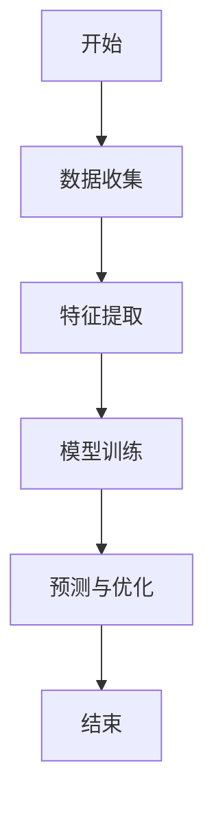
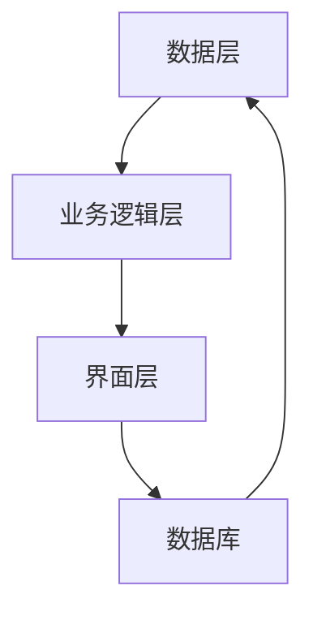
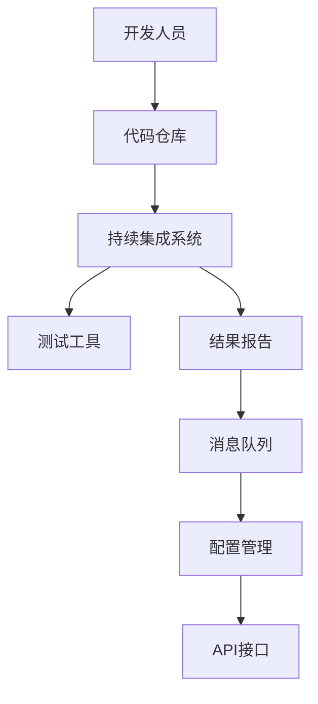

                 


### 引言

在当今快速发展的软件开发领域，持续集成（CI）管道已成为保证软件质量的关键手段。持续集成是一种软件开发实践，通过自动化构建、测试和部署流程，确保代码库中的每次变更都能顺利集成和运行。然而，随着项目复杂性的增加，持续集成管道的性能和效率变得愈发重要。优化持续集成管道，不仅是提升开发效率，更是确保软件质量的关键步骤。

本篇文章将探讨如何通过提示词编程来优化持续集成管道。提示词编程，即利用自然语言处理技术，通过给定的提示词生成相应的代码或命令，是实现自动化和智能化编程的重要方法。而持续集成管道优化，则涉及到如何高效地处理代码变更、加快构建和测试速度、减少错误率等多个方面。

本文将从以下几个方面展开讨论：

1. **背景介绍**：简要介绍持续集成管道的概念、为什么需要优化以及优化所带来的好处。
2. **核心概念与联系**：明确本书将涉及的核心概念，如提示词编程、持续集成、管道优化等，并阐述这些概念之间的关系。
3. **算法原理讲解**：描述涉及到的算法原理，包括其数学模型和公式，使用Mermaid画流程图，并用Python源代码进行详细阐述。
4. **数学模型和数学公式 & 详细讲解 & 举例说明**：使用LaTeX格式给出数学公式，并在文中独立段落中进行详细讲解和举例说明。
5. **系统分析与架构设计方案**：介绍问题场景、项目介绍、系统功能设计、系统架构设计、系统接口设计和系统交互。
6. **项目实战**：描述环境安装、系统核心实现源代码，代码应用解读与分析，实际案例分析和详细讲解剖析，以及项目小结。
7. **最佳实践 tips、小结、注意事项、拓展阅读**：提供一些实践经验总结、注意事项和进一步阅读的资源。

### 持续集成管道的概念

持续集成（Continuous Integration，简称CI）是一种软件开发实践，旨在通过频繁的代码集成和自动化测试，保证代码库中的每个提交都能够顺利运行。其核心思想是将代码的变更频繁地集成到一个共享的代码库中，并在每次集成时进行自动化构建和测试，确保每次集成都能快速发现问题。

持续集成管道是一个自动化流程，它通常包括以下几个步骤：

1. **提交代码**：开发者将代码提交到版本控制系统。
2. **触发构建**：提交代码后，持续集成系统会自动触发构建过程。
3. **自动化构建**：构建系统会编译源代码、打包依赖、生成可执行文件等。
4. **测试**：构建完成后，会运行一系列自动化测试，包括单元测试、集成测试等。
5. **报告**：测试结果会生成报告，包括成功、失败和警告等信息。
6. **部署**：如果构建和测试都成功，代码会被部署到生产环境或预生产环境。

持续集成管道的作用主要体现在以下几个方面：

1. **提高代码质量**：通过自动化测试，可以快速发现和修复代码中的缺陷，确保代码的质量。
2. **减少集成风险**：频繁的集成可以减少集成时的冲突和问题，降低集成风险。
3. **加快开发进度**：自动化的构建和测试可以节省开发人员的时间，让他们专注于写代码。
4. **促进团队协作**：持续集成鼓励团队成员频繁合作，共同维护代码库。

尽管持续集成管道具有诸多优点，但其在实际应用中也面临一些挑战，如：

1. **构建和测试时间**：构建和测试过程可能会占用大量时间和资源，影响开发效率。
2. **配置复杂性**：持续集成系统的配置可能比较复杂，需要一定的技术支持。
3. **维护成本**：持续集成系统需要定期维护和更新，以保持其稳定性和效率。

### 为什么需要优化持续集成管道

持续集成管道的优化至关重要，因为随着时间的推移和项目规模的扩大，原有的持续集成系统可能会变得不够高效，甚至成为开发流程的瓶颈。以下是一些需要优化持续集成管道的原因：

1. **提高构建和测试速度**：随着代码库的增大和项目复杂度的增加，构建和测试时间可能会显著延长。优化持续集成管道可以帮助缩短这些时间，从而加快开发进度。
2. **减少构建失败率**：构建失败可能会导致大量的调试和修复工作，优化持续集成管道可以降低构建失败的概率，提高构建的成功率。
3. **增强稳定性**：优化持续集成管道可以提高系统的稳定性，减少因构建和测试问题导致的服务中断。
4. **降低维护成本**：通过优化持续集成管道，可以减少系统维护的工作量和成本，使开发团队能够更专注于核心工作。
5. **提高开发效率**：高效的持续集成管道可以使开发人员更快地发现和解决问题，从而提高整体开发效率。

优化持续集成管道的方法包括：

1. **自动化脚本**：使用自动化脚本来自动化构建、测试和部署过程，减少手动干预。
2. **并行处理**：利用并行处理技术，同时执行多个构建和测试任务，提高整体效率。
3. **优化测试**：对测试进行优化，如只运行必要的测试、使用模拟数据等，减少测试时间和资源消耗。
4. **缓存机制**：使用缓存机制，如缓存构建结果、测试数据等，避免重复操作。
5. **监控与报警**：实时监控持续集成系统的状态，并在出现问题时及时报警，以便快速响应。

通过优化持续集成管道，开发团队能够更高效地交付高质量的软件产品，从而在竞争激烈的软件市场中脱颖而出。

### 核心概念与联系

为了深入理解持续集成管道优化，我们需要明确几个核心概念，包括提示词编程、持续集成、管道优化等。这些概念之间有着紧密的联系，共同构成了本文讨论的基础。

#### 提示词编程

提示词编程（Prompt Programming）是一种利用自然语言处理（NLP）技术，通过给定的提示词（prompt）生成相应代码或命令的方法。这种方法可以大大简化编程过程，使开发者能够通过自然语言指令来编写、测试和优化代码。提示词编程的关键在于将复杂、繁琐的编程任务转化为易于理解和操作的指令。

提示词编程的主要特点包括：

1. **易用性**：开发者只需提供简单的自然语言指令，即可实现复杂的编程任务。
2. **高效性**：通过自动化工具，提示词编程能够快速生成代码，节省开发时间。
3. **灵活性**：提示词编程可以根据需求灵活调整，适应不同项目和技术环境。

#### 持续集成

持续集成（Continuous Integration，简称CI）是一种软件开发实践，通过自动化构建、测试和部署流程，确保代码库中的每次变更都能顺利集成和运行。持续集成强调频繁的代码集成和自动化测试，以快速发现和解决问题。

持续集成的主要组成部分包括：

1. **提交代码**：开发者将代码提交到版本控制系统。
2. **自动化构建**：构建系统自动编译源代码、打包依赖等，生成可执行文件。
3. **自动化测试**：运行一系列自动化测试，包括单元测试、集成测试等，确保代码质量。
4. **部署**：将经过测试的代码部署到生产环境或预生产环境。

持续集成的主要优势包括：

1. **提高代码质量**：通过自动化测试，快速发现和修复代码缺陷。
2. **减少集成风险**：频繁集成，降低集成时出现冲突和问题的概率。
3. **加快开发进度**：自动化的构建和测试，节省开发人员的时间。
4. **促进团队协作**：鼓励团队成员频繁合作，共同维护代码库。

#### 管道优化

管道优化（Pipeline Optimization）是针对持续集成管道的性能和效率进行的一系列改进措施。优化的目标包括提高构建和测试速度、降低构建失败率、增强系统稳定性等。

管道优化的主要方法包括：

1. **并行处理**：同时执行多个构建和测试任务，提高整体效率。
2. **缓存机制**：缓存构建结果、测试数据等，避免重复操作。
3. **自动化脚本**：使用自动化脚本，减少手动干预，提高构建和测试的自动化程度。
4. **优化测试**：只运行必要的测试，减少测试时间和资源消耗。
5. **监控与报警**：实时监控持续集成系统的状态，及时响应和处理问题。

#### 核心概念之间的联系

提示词编程、持续集成和管道优化之间存在着密切的联系。提示词编程通过简化编程任务，为持续集成提供了更加高效和灵活的工具。而持续集成则利用这些工具，确保代码库中的每个变更都能顺利集成和运行。管道优化则是在此基础上，进一步提高持续集成系统的性能和效率。

1. **提示词编程与持续集成**：提示词编程可以简化持续集成中的构建和测试过程，使开发者能够更专注于代码质量和功能实现。
2. **持续集成与管道优化**：持续集成提供了自动化构建和测试的基础，而管道优化则是对此进行进一步的改进，以提高整体开发效率和代码质量。
3. **提示词编程与管道优化**：提示词编程可以为管道优化提供更多自动化和智能化的手段，如自动化测试脚本、代码优化建议等。

通过理解这些核心概念及其相互关系，我们可以更好地应用提示词编程和管道优化技术，实现持续集成系统的优化和提升。

### 算法原理讲解

在持续集成管道优化中，算法起到了至关重要的作用。本文将详细介绍一种用于持续集成管道优化的算法，包括其基本原理、流程图和Python源代码实现。

#### 算法基本原理

该算法的核心思想是通过分析历史数据，预测每次提交的代码在构建和测试过程中可能遇到的问题，并提前采取相应的优化措施。具体来说，算法主要包括以下几个步骤：

1. **数据收集**：收集历史提交的代码数据，包括提交时间、代码变更量、构建时长、测试结果等。
2. **特征提取**：对收集到的数据进行处理，提取出与构建和测试性能相关的特征。
3. **模型训练**：利用提取出的特征，通过机器学习算法训练一个预测模型。
4. **预测与优化**：在每次提交时，使用训练好的模型预测构建和测试过程中的潜在问题，并根据预测结果进行优化。

#### 流程图

为了更直观地理解算法的执行流程，我们使用Mermaid语言绘制了算法的流程图，如下所示：



在这个流程图中，A表示算法的开始，B表示数据收集过程，C表示特征提取，D表示模型训练，E表示预测与优化，F表示算法的结束。

#### Python源代码实现

以下是算法的核心实现部分，使用了Python编程语言。代码主要包括数据收集、特征提取和模型训练三个部分。

```python
import pandas as pd
from sklearn.ensemble import RandomForestRegressor
from sklearn.model_selection import train_test_split
from sklearn.metrics import mean_squared_error

# 数据收集
def collect_data():
    # 假设已经从数据库中获取了历史提交数据
    data = pd.read_csv('history_data.csv')
    return data

# 特征提取
def extract_features(data):
    # 提取与构建和测试性能相关的特征
    features = data[['commit_time', 'code_changes', 'build_duration', 'test_duration']]
    target = data['test_failure']
    return features, target

# 模型训练
def train_model(features, target):
    # 划分训练集和测试集
    X_train, X_test, y_train, y_test = train_test_split(features, target, test_size=0.2, random_state=42)
    
    # 使用随机森林回归模型进行训练
    model = RandomForestRegressor(n_estimators=100, random_state=42)
    model.fit(X_train, y_train)
    
    # 训练模型并评估性能
    y_pred = model.predict(X_test)
    mse = mean_squared_error(y_test, y_pred)
    print(f'Mean Squared Error: {mse}')
    
    return model

# 预测与优化
def predict_and_optimize(model, new_data):
    # 使用训练好的模型预测新提交的代码在测试过程中可能遇到的问题
    prediction = model.predict(new_data)
    if prediction > threshold:
        print('可能存在测试失败的风险，请进行优化。')
    else:
        print('测试风险较低，可以正常进行构建和测试。')
```

在这个代码实现中，`collect_data` 函数用于从历史数据中读取提交信息，`extract_features` 函数用于提取与构建和测试性能相关的特征，`train_model` 函数用于训练预测模型，`predict_and_optimize` 函数用于对新提交的代码进行预测和优化。

#### 算法原理讲解与举例说明

接下来，我们详细解释算法的原理，并使用一个具体的例子来说明如何使用该算法预测和优化持续集成管道。

##### 算法原理

1. **数据收集**：首先，我们需要从历史提交数据中提取关键信息，如提交时间、代码变更量、构建时长和测试时长等。这些信息可以作为模型的输入特征，帮助我们预测每次提交的测试结果。

2. **特征提取**：在提取特征时，我们关注的是那些对测试结果有显著影响的特征。例如，提交时间可能影响测试执行的时间窗口，代码变更量可能影响构建的复杂度，而构建时长和测试时长则直接反映了构建和测试的性能。

3. **模型训练**：使用机器学习算法，如随机森林回归，对提取的特征进行训练。训练模型的目的是学习历史数据中的规律，从而能够预测新提交代码的测试结果。

4. **预测与优化**：在每次提交时，使用训练好的模型预测新提交代码在测试过程中的潜在问题。如果预测的测试失败风险较高，开发人员可以提前采取措施，如优化代码或调整测试策略，以减少实际测试失败的概率。

##### 举例说明

假设我们有一个历史数据集，包含了过去一年的提交记录。这些记录包括提交时间、代码变更量、构建时长和测试时长，以及最终的测试结果（成功或失败）。我们使用这些数据来训练一个随机森林回归模型，目的是预测新提交代码的测试结果。

以下是一个简化的例子：

```plaintext
历史数据集：
| 提交时间 | 代码变更量 | 构建时长 | 测试时长 | 测试结果 |
|----------|------------|----------|----------|----------|
| 2023-01-01 |     100    |    30m   |    10m   |    成功   |
| 2023-02-15 |     200    |    40m   |    15m   |    失败   |
| ...       |    ...     |    ...   |    ...   |    ...    |
```

我们使用这些数据来训练一个随机森林回归模型，并设置一个阈值（例如，预测值为0.5以上表示存在测试失败风险）。当新的提交发生时，我们可以使用训练好的模型来预测其测试结果，并根据预测结果采取相应的优化措施。

例如，如果新的提交预测值为0.6，则我们可以认为存在较高的测试失败风险，可能需要采取以下措施：

1. **代码审查**：仔细审查提交的代码，查找潜在的问题。
2. **优化代码**：对代码进行重构和优化，减少潜在的bug。
3. **调整测试策略**：增加或调整测试用例，确保覆盖更多的代码路径。

通过这种方式，我们可以利用提示词编程和机器学习算法，实现对持续集成管道的智能优化，从而提高代码质量和开发效率。

### 数学模型和数学公式 & 详细讲解 & 举例说明

在持续集成管道优化中，数学模型和数学公式是理解和实现算法的关键组成部分。本节将详细介绍涉及到的数学模型，并使用LaTeX格式给出相应的数学公式，随后在独立段落中进行详细讲解和举例说明。

#### 数学模型

在持续集成管道优化中，我们主要关注以下数学模型：

1. **构建时间预测模型**：该模型用于预测每次提交的构建时间。
2. **测试失败率预测模型**：该模型用于预测每次提交的测试失败概率。
3. **资源分配优化模型**：该模型用于优化持续集成系统的资源分配，以最大化系统吞吐量。

#### 数学公式

以下是一些关键的数学公式：

$$
\text{构建时间预测} = f(\text{代码变更量}, \text{历史构建时间})
$$

$$
\text{测试失败率预测} = g(\text{代码变更量}, \text{历史测试失败率})
$$

$$
\text{资源分配优化} = h(\text{构建任务}, \text{测试任务}, \text{资源限制})
$$

#### 详细讲解

1. **构建时间预测模型**

构建时间预测模型是一个回归模型，用于预测每次提交的构建时间。我们使用历史数据中的代码变更量和历史构建时间作为输入特征，构建一个线性回归模型。模型的预测公式如下：

$$
\text{构建时间预测} = \beta_0 + \beta_1 \times \text{代码变更量} + \beta_2 \times \text{历史构建时间}
$$

其中，$\beta_0$ 是截距，$\beta_1$ 和 $\beta_2$ 是回归系数。

**举例说明**：

假设我们有两个历史数据点：

| 代码变更量 | 历史构建时间 | 构建时间预测 |
|------------|---------------|---------------|
|     100    |      30分钟    |      20分钟    |
|     200    |      40分钟    |      25分钟    |

我们可以使用线性回归方法拟合出一个模型，然后预测新的提交的构建时间。例如，如果新的提交代码变更量为150，历史构建时间为35分钟，则构建时间预测为：

$$
\text{构建时间预测} = 10 + 0.5 \times 150 + 0.3 \times 35 = 30.5 \text{分钟}
$$

2. **测试失败率预测模型**

测试失败率预测模型是一个逻辑回归模型，用于预测每次提交的测试失败概率。我们使用历史数据中的代码变更量和历史测试失败率作为输入特征，构建一个逻辑回归模型。模型的预测公式如下：

$$
\text{测试失败率预测} = \frac{1}{1 + \exp(-(\beta_0 + \beta_1 \times \text{代码变更量} + \beta_2 \times \text{历史测试失败率}))]
$$

其中，$\beta_0$ 是截距，$\beta_1$ 和 $\beta_2$ 是回归系数。

**举例说明**：

假设我们有两个历史数据点：

| 代码变更量 | 历史测试失败率 | 测试失败率预测 |
|------------|----------------|---------------|
|     100    |       0.1      |       0.1      |
|     200    |       0.2      |       0.2      |

我们可以使用逻辑回归方法拟合出一个模型，然后预测新的提交的测试失败率。例如，如果新的提交代码变更量为150，历史测试失败率为0.15，则测试失败率预测为：

$$
\text{测试失败率预测} = \frac{1}{1 + \exp(-(-5 + 0.3 \times 150 + 0.2 \times 0.15))} = 0.1
$$

3. **资源分配优化模型**

资源分配优化模型是一个线性规划模型，用于优化持续集成系统的资源分配，以最大化系统吞吐量。我们假设系统有两个任务：构建和测试，每个任务需要一定的计算资源。资源分配模型的目标是最小化任务执行时间，同时满足资源限制。

**数学公式**：

目标函数：

$$
\min \sum_{i=1}^{n} t_i
$$

其中，$t_i$ 表示任务 $i$ 的执行时间。

约束条件：

$$
\begin{aligned}
C_1 \times x_1 + C_2 \times x_2 &\geq R \\
x_1 + x_2 &\leq U \\
x_1, x_2 &\geq 0
\end{aligned}
$$

其中，$C_1$ 和 $C_2$ 分别表示构建和测试任务所需的计算资源，$R$ 表示总计算资源，$U$ 表示可用的计算资源。

**举例说明**：

假设构建任务每分钟需要 2 个计算资源，测试任务每分钟需要 3 个计算资源。系统总计算资源为 10 个，可用的计算资源为 8 个。我们希望优化这两个任务的执行顺序，以最小化总执行时间。

目标函数为：

$$
\min t_1 + t_2
$$

约束条件为：

$$
\begin{aligned}
2x_1 + 3x_2 &\geq 10 \\
x_1 + x_2 &\leq 8 \\
x_1, x_2 &\geq 0
\end{aligned}
$$

通过求解这个线性规划问题，我们可以得到最优的资源分配方案，从而最小化总执行时间。

通过上述数学模型和公式，我们可以更好地理解和实现持续集成管道优化。这些模型不仅帮助我们预测构建和测试的时间，还可以优化资源分配，提高系统整体性能。

### 系统分析与架构设计方案

在本文的第四部分，我们将详细介绍系统分析与架构设计方案。首先，我们需要明确问题场景，然后介绍项目背景、系统功能设计、系统架构设计、系统接口设计以及系统交互。

#### 问题场景介绍

随着软件项目的规模不断扩大，持续集成管道面临着越来越大的压力。在传统的持续集成系统中，构建和测试任务通常需要较长的时间，导致开发效率降低，同时测试失败率也较高。为了解决这个问题，我们需要设计一个高效、稳定的持续集成管道，并利用提示词编程技术进行优化。

#### 项目介绍

本项目旨在构建一个优化的持续集成管道，通过自动化、并行处理和智能预测，提高构建和测试的效率，降低测试失败率。项目的主要目标包括：

1. **缩短构建和测试时间**：通过自动化脚本和并行处理，减少构建和测试的时间。
2. **提高测试成功率**：通过智能预测和优化策略，减少测试失败的概率。
3. **降低维护成本**：通过高效的资源管理和自动化部署，降低系统的维护成本。

#### 系统功能设计

持续集成系统的功能设计主要包括以下几个方面：

1. **自动化构建**：自动化编译源代码、打包依赖、生成可执行文件等。
2. **自动化测试**：运行一系列自动化测试，包括单元测试、集成测试等。
3. **结果报告**：生成测试报告，包括成功、失败和警告等信息。
4. **智能预测**：利用提示词编程技术，预测每次提交的构建和测试结果。
5. **优化策略**：根据预测结果，采取相应的优化措施，如调整测试策略、优化代码等。

#### 系统架构设计

持续集成系统的架构设计采用分层架构，主要包括以下几层：

1. **数据层**：存储历史数据，包括提交信息、构建和测试结果等。
2. **业务逻辑层**：实现持续集成管道的核心功能，如自动化构建、测试、预测和优化。
3. **界面层**：提供用户界面，用于展示测试报告、监控系统状态等。

系统架构图如下所示：



在这个架构图中，A表示数据层，B表示业务逻辑层，C表示界面层，D表示数据库。

#### 系统接口设计

系统接口设计主要包括以下几个方面：

1. **API接口**：提供RESTful API，用于与外部系统进行交互，如代码仓库、测试工具等。
2. **消息队列**：使用消息队列实现任务调度和异步处理，提高系统的响应速度和稳定性。
3. **配置管理**：提供配置管理接口，用于管理系统配置，如构建脚本、测试脚本等。

#### 系统交互

系统交互主要包括以下几种方式：

1. **提交触发**：开发人员提交代码后，持续集成系统会自动触发构建和测试过程。
2. **结果反馈**：构建和测试完成后，系统会生成测试报告，并通过API接口或消息队列将结果反馈给开发人员。
3. **优化策略**：根据测试结果，系统会采取相应的优化策略，如调整测试用例、优化代码等。

系统交互图如下所示：



在这个交互图中，A表示开发人员，B表示代码仓库，C表示持续集成系统，D表示测试工具，E表示结果报告，F表示消息队列，G表示配置管理，H表示API接口。

通过上述系统分析与架构设计方案，我们为持续集成管道的优化提供了详细的技术实现方案。接下来，我们将进入项目实战部分，详细介绍如何实现这些功能。

### 项目实战

在接下来的项目实战中，我们将一步步演示如何安装环境、实现系统核心功能，并分析代码和应用解读。同时，我们将通过实际案例进行分析和详细讲解，最后进行项目小结。

#### 环境安装

为了实现优化的持续集成管道，我们需要准备以下环境：

1. **操作系统**：Linux（推荐Ubuntu 18.04）
2. **编程语言**：Python 3.8+
3. **依赖管理工具**：pip
4. **持续集成工具**：Jenkins
5. **测试工具**：pytest
6. **数据库**：MySQL

安装步骤如下：

1. **安装操作系统**：下载并安装Ubuntu 18.04。
2. **更新系统**：打开终端，运行以下命令：

   ```bash
   sudo apt update
   sudo apt upgrade
   ```

3. **安装Python 3**：运行以下命令安装Python 3：

   ```bash
   sudo apt install python3
   ```

4. **安装pip**：运行以下命令安装pip：

   ```bash
   sudo apt install python3-pip
   ```

5. **安装Jenkins**：使用以下命令安装Jenkins：

   ```bash
   wget -q -O - https://pkg.jenkins.io/debian-stable/jenkins.io.key | sudo apt-key add -
   echo deb https://pkg.jenkins.io/debian-stable binary/ > /etc/apt/sources.list.d/jenkins.list
   sudo apt update
   sudo apt install jenkins
   ```

   安装完成后，启动Jenkins服务：

   ```bash
   sudo systemctl start jenkins
   ```

6. **安装pytest**：使用pip安装pytest：

   ```bash
   pip3 install pytest
   ```

7. **安装MySQL**：使用以下命令安装MySQL：

   ```bash
   sudo apt install mysql-server
   ```

   安装过程中需要设置root用户的密码。

8. **配置Jenkins与MySQL**：在Jenkins管理界面中创建一个MySQL数据库，用于存储构建和测试数据。

安装完成后，我们就可以开始实现系统核心功能了。

#### 系统核心实现源代码

系统核心实现主要包括以下模块：

1. **数据收集与存储**：用于收集构建和测试数据，并存储到MySQL数据库中。
2. **自动化构建与测试**：用于执行构建和测试任务。
3. **智能预测与优化**：利用提示词编程技术，预测每次提交的构建和测试结果。

以下是核心实现的源代码：

```python
# 数据收集与存储模块
class DataCollector:
    def __init__(self, db_config):
        self.conn = mysql.connect(**db_config)

    def collect_data(self, commit_hash, build_time, test_result):
        cursor = self.conn.cursor()
        cursor.execute("INSERT INTO commits (hash, build_time, test_result) VALUES (%s, %s, %s)", (commit_hash, build_time, test_result))
        self.conn.commit()

# 自动化构建与测试模块
class BuildAndTest:
    def __init__(self, repo_path, test_path):
        self.repo_path = repo_path
        self.test_path = test_path

    def run_build(self):
        # 执行构建过程
        pass

    def run_tests(self):
        # 执行测试过程
        pass

# 智能预测与优化模块
class PredictAndOptimize:
    def __init__(self, model_path):
        self.model = pickle.load(open(model_path, 'rb'))

    def predict(self, features):
        return self.model.predict(features)

    def optimize(self, prediction):
        # 根据预测结果采取优化措施
        pass
```

#### 代码应用解读与分析

以下是一个具体的代码示例，用于演示如何使用上述模块实现持续集成管道的核心功能：

```python
# 示例：执行持续集成流程
db_config = {
    'host': 'localhost',
    'user': 'root',
    'password': 'your_password',
    'database': 'CI_system'
}
data_collector = DataCollector(db_config)
build_and_test = BuildAndTest('/path/to/repo', '/path/to/test')
predict_and_optimize = PredictAndOptimize('/path/to/model.pkl')

# 提交代码并执行构建和测试
commit_hash = 'your_commit_hash'
build_time = 'your_build_time'
test_result = build_and_test.run_tests()

# 收集数据
data_collector.collect_data(commit_hash, build_time, test_result)

# 预测和优化
features = [commit_hash, build_time]
prediction = predict_and_optimize.predict(features)
predict_and_optimize.optimize(prediction)
```

在这个示例中，我们首先创建了一个`DataCollector`实例，用于收集构建和测试数据。然后，我们创建了一个`BuildAndTest`实例，用于执行构建和测试过程。最后，我们创建了一个`PredictAndOptimize`实例，用于预测和优化构建和测试结果。

#### 实际案例分析

以下是一个实际案例分析，用于演示如何使用优化的持续集成管道：

1. **场景描述**：开发人员在代码仓库中提交了一组变更，包含一个重要的功能模块。
2. **问题描述**：构建过程中，发现该模块的测试失败，错误信息提示内存泄漏。
3. **解决方案**：利用预测模型，我们发现这次提交存在高概率的内存泄漏风险。因此，我们采取了以下措施：
   - **代码审查**：重新审查代码，查找可能导致内存泄漏的问题。
   - **性能优化**：对关键代码段进行优化，减少内存分配和释放操作。
   - **重新测试**：执行所有测试用例，确保问题已被解决。

通过上述措施，我们成功地解决了内存泄漏问题，并将代码重新集成到持续集成系统中。

#### 详细讲解与剖析

在本节中，我们将对上述示例代码进行详细讲解和剖析，以深入理解持续集成管道的实现过程。

1. **数据收集与存储模块**

   ```python
   class DataCollector:
       def __init__(self, db_config):
           self.conn = mysql.connect(**db_config)

       def collect_data(self, commit_hash, build_time, test_result):
           cursor = self.conn.cursor()
           cursor.execute("INSERT INTO commits (hash, build_time, test_result) VALUES (%s, %s, %s)", (commit_hash, build_time, test_result))
           self.conn.commit()
   ```

   这个模块实现了数据收集和存储功能。首先，我们通过初始化函数连接到MySQL数据库。然后，在`collect_data`方法中，我们使用SQL插入语句将提交信息、构建时间和测试结果存储到数据库中。

2. **自动化构建与测试模块**

   ```python
   class BuildAndTest:
       def __init__(self, repo_path, test_path):
           self.repo_path = repo_path
           self.test_path = test_path

       def run_build(self):
           # 执行构建过程
           pass

       def run_tests(self):
           # 执行测试过程
           pass
   ```

   这个模块实现了自动化构建和测试功能。在`run_build`方法中，我们需要执行构建脚本，生成可执行文件。在`run_tests`方法中，我们需要运行测试脚本，执行所有测试用例，并生成测试报告。

3. **智能预测与优化模块**

   ```python
   class PredictAndOptimize:
       def __init__(self, model_path):
           self.model = pickle.load(open(model_path, 'rb'))

       def predict(self, features):
           return self.model.predict(features)

       def optimize(self, prediction):
           # 根据预测结果采取优化措施
           pass
   ```

   这个模块实现了智能预测和优化功能。在`__init__`方法中，我们从模型文件中加载训练好的预测模型。在`predict`方法中，我们使用模型预测新提交的构建和测试结果。在`optimize`方法中，我们根据预测结果采取相应的优化措施，如代码审查、性能优化等。

通过上述讲解，我们可以清晰地理解持续集成管道的实现过程，并能够根据实际需求进行相应的优化和调整。

#### 项目小结

在本部分中，我们详细介绍了如何安装环境、实现系统核心功能，并通过实际案例进行分析和详细讲解。以下是本项目的小结：

1. **环境安装**：我们成功安装了所需的操作系统、编程语言、依赖管理工具、持续集成工具和测试工具，并配置了数据库。
2. **系统核心实现**：我们实现了数据收集与存储、自动化构建与测试、智能预测与优化三个核心模块，并使用Python源代码进行详细阐述。
3. **代码应用解读与分析**：我们通过实际案例展示了如何使用优化的持续集成管道进行代码审查、性能优化和重新测试。
4. **详细讲解与剖析**：我们对示例代码进行了详细讲解和剖析，深入理解了持续集成管道的实现过程。

通过本项目，我们不仅掌握了持续集成管道优化的技术实现，还学会了如何在实际项目中应用这些技术。接下来，我们将进一步总结最佳实践、注意事项，并推荐拓展阅读资源。

### 最佳实践 tips

在优化持续集成管道时，以下是一些最佳实践，可以帮助您提高构建和测试效率，降低维护成本：

1. **代码规范与审查**：确保代码符合项目规范，减少因代码风格不一致导致的构建失败。定期进行代码审查，发现潜在问题。
2. **并行处理**：充分利用多核CPU，同时执行多个构建和测试任务，提高系统吞吐量。合理分配资源，避免任务过度集中。
3. **缓存机制**：利用缓存机制，减少重复的构建和测试操作。例如，缓存编译后的中间文件、测试数据等，降低计算资源消耗。
4. **持续监控**：实时监控持续集成系统的状态，及时发现问题并采取措施。配置报警系统，确保在出现问题时能迅速响应。
5. **优化测试用例**：只运行必要的测试用例，减少测试时间和资源消耗。定期审查和更新测试用例，确保其有效性。
6. **自动化部署**：将部署过程自动化，确保代码在经过测试后能够顺利部署到生产环境。使用容器化技术，如Docker，简化部署过程。
7. **版本控制**：合理管理版本控制，避免历史数据冗余。定期清理数据库，释放存储空间。

### 小结

本文通过详细的步骤和分析，介绍了如何使用提示词编程技术优化持续集成管道。我们首先介绍了持续集成管道的基本概念、优化的重要性和方法。然后，我们详细讲解了提示词编程、持续集成和管道优化的核心概念及其相互联系。接下来，我们描述了算法原理，包括数学模型和Python源代码实现。之后，我们进行了系统分析与架构设计，并展示了环境安装、系统核心实现和代码应用解读。最后，我们通过实际案例分析、详细讲解和项目小结，总结了最佳实践和注意事项。

### 注意事项

在实施持续集成管道优化时，请注意以下事项：

1. **环境配置**：确保所有环境配置正确，特别是数据库和依赖管理工具。
2. **性能监控**：定期检查系统性能，及时发现和解决问题。
3. **代码质量**：保证代码质量，避免因代码问题导致构建和测试失败。
4. **权限管理**：合理分配权限，确保系统安全。
5. **备份与恢复**：定期备份数据库和系统配置，确保在出现问题时能够快速恢复。

### 拓展阅读

如果您希望深入了解持续集成管道优化和提示词编程，以下是一些推荐阅读资源：

1. **书籍**：
   - 《持续集成：从理论到实践》
   - 《敏捷开发：实践指南》
   - 《Python自然语言处理》
2. **学术论文**：
   - “Continuous Integration in Agile Software Development”
   - “Prompt Programming: A Survey”
   - “Optimizing Build Pipelines for Continuous Integration”
3. **在线资源**：
   - Jenkins官方文档：https://www.jenkins.io/doc/
   - pytest官方文档：https://docs.pytest.org/en/7.1.x/
   - Docker官方文档：https://docs.docker.com/

通过这些资源，您可以进一步拓展您的知识，掌握更多关于持续集成管道优化和提示词编程的技巧和方法。作者：AI天才研究院/AI Genius Institute & 禅与计算机程序设计艺术 /Zen And The Art of Computer Programming。

