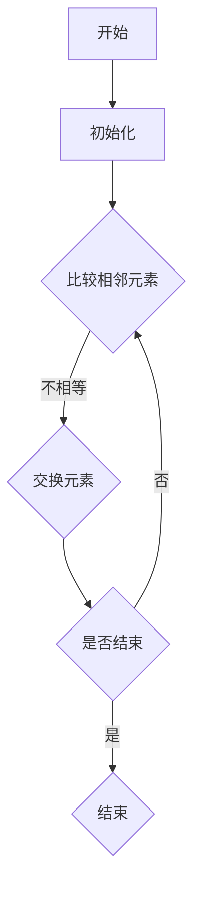
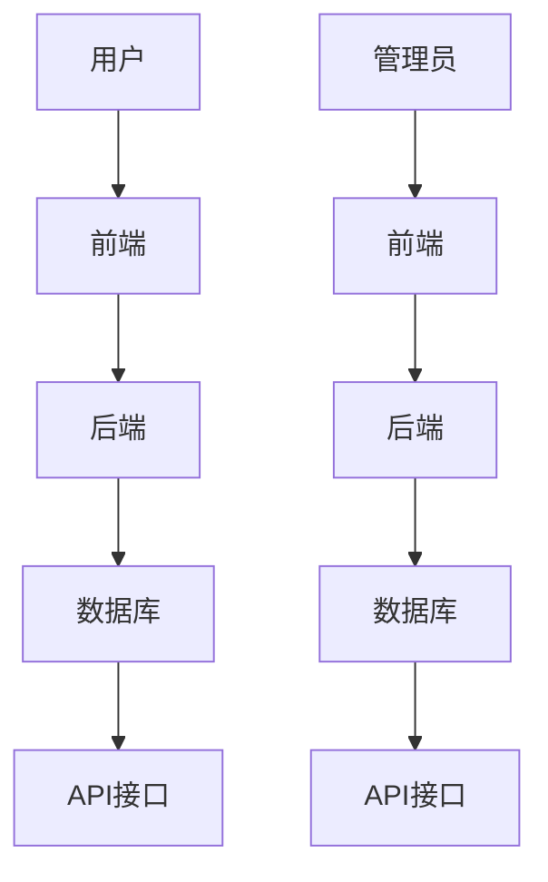
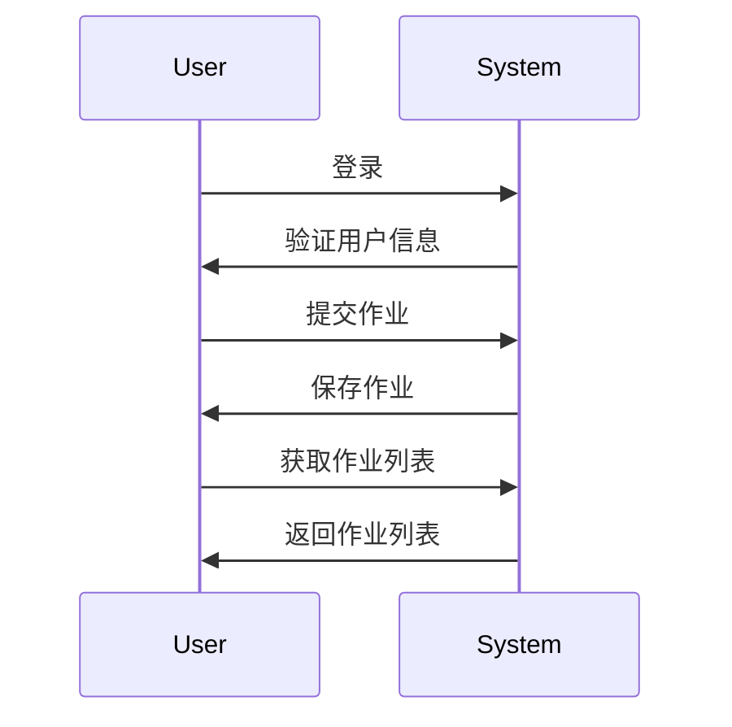

                 

# 提示词编程的教育与培训体系

> 关键词：提示词编程，教育与培训体系，核心概念，算法原理，系统架构，项目实战

> 摘要：本文旨在探讨提示词编程的教育与培训体系。随着人工智能技术的不断发展，提示词编程作为一种重要的编程技能，正日益受到关注。然而，当前教育与培训体系在提示词编程方面存在诸多不足。本文将首先介绍提示词编程的背景，然后详细分析其核心概念与联系，随后讲解算法原理，并设计一套完整的系统架构方案。最后，通过实际项目实战，验证体系的可行性与有效性。本文旨在为从事编程教育与研究的人员提供有益的参考。

## 1. 背景介绍

### 问题背景

随着信息技术的飞速发展，编程已经成为现代社会的一项基本技能。特别是在人工智能时代，编程技能的需求更是日益增长。提示词编程作为一种新兴的编程模式，已经逐渐成为人工智能应用的重要工具。提示词编程的核心在于通过提供一组提示词，让计算机自动生成代码。这种编程模式不仅能够提高编程效率，还能降低编程门槛，使更多的人能够参与到编程活动中来。

### 问题描述

然而，当前的教育与培训体系在提示词编程方面存在以下问题：

- 缺乏系统化的教育内容：大多数编程教育仍然以传统的命令式编程为主，缺乏对提示词编程的深入讲解。
- 教学资源不足：提示词编程相关的教材、视频课程等教学资源较为匮乏。
- 缺乏实践机会：学生和专业人士在实际应用中难以找到合适的实践机会。

### 问题解决

为了解决上述问题，本文将设计一套系统化的教育与培训体系，旨在为学生和专业人士提供全面的提示词编程指导。该体系将涵盖以下内容：

- 基础概念：介绍提示词编程的基本原理、编程语言选择等。
- 工具使用：讲解常用的提示词编程工具及其使用方法。
- 实际应用：通过实际案例，展示提示词编程在各个领域的应用。

### 边界与外延

本体系的主要目标是为学生和专业人士提供系统的提示词编程培训，帮助他们掌握这一技能。具体包括：

- 基础知识：包括提示词编程的基本概念、编程语言选择等。
- 实践技能：通过案例教学，让学生掌握提示词编程的实际应用技能。
- 创新能力：鼓励学生发挥创造力，探索提示词编程的新应用。

### 概念结构与核心要素组成

提示词编程的教育与培训体系主要包括以下核心概念与要素：

- **基本原理**：介绍提示词编程的核心概念，如条件判断、循环结构、函数调用等。
- **编程语言**：分析不同编程语言的属性和特征，为学生选择合适的编程语言提供参考。
- **编程实践**：通过实际案例，让学生掌握提示词编程的实践技能。

## 2. 核心概念与联系

### 核心概念原理

提示词编程的核心概念主要包括：

- **条件判断**：通过条件语句实现程序的选择执行。
- **循环结构**：通过循环语句实现程序的重复执行。
- **函数调用**：通过函数定义和调用实现代码的模块化。

这些核心概念是提示词编程的基础，对于理解和使用提示词编程至关重要。

### 概念属性特征对比表格

以下是几种常用编程语言的属性和特征对比表格：

| 编程语言 | 特点 | 优势 | 劣势 |
| --- | --- | --- | --- |
| Python | 易学易用，丰富的库和框架 | 适合快速开发 | 运行速度相对较慢 |
| Java | 强类型语言，跨平台 | 性能稳定，适合企业级应用 | 学习曲线较陡峭 |
| C++ | 高性能，对硬件控制能力强 | 适用于高性能计算 | 学习难度大，易出错 |
| JavaScript | 适用于前端和后端 | 生态丰富，跨平台 | 代码复杂度高 |

通过对比表格，学生可以根据自己的需求和兴趣选择合适的编程语言。

### ER实体关系图架构

以下是提示词编程教学体系中的ER实体关系图：

```mermaid
erDiagram
  Student ||--|{ Course }| Course
  Student ||--|{ Assignment }| Assignment
  Course ||--|{ Teacher }| Teacher
  Teacher ||--|{ Assignment }| Assignment
  Course ||--|{ Resource }| Resource
```

该ER图展示了学生、课程、作业、教师和资源等实体之间的关系，为教学体系的实施提供了数据模型支持。

## 3. 算法原理讲解

### 算法mermaid流程图

以下是提示词编程中的一个常见算法——冒泡排序的mermaid流程图：



### Python源代码

以下是冒泡排序算法的Python实现：

```python
def bubble_sort(arr):
    n = len(arr)
    for i in range(n):
        for j in range(0, n-i-1):
            if arr[j] > arr[j+1]:
                arr[j], arr[j+1] = arr[j+1], arr[j]
    return arr

arr = [64, 34, 25, 12, 22, 11, 90]
sorted_arr = bubble_sort(arr)
print("排序后的数组：", sorted_arr)
```

### 数学模型和公式

冒泡排序算法的数学模型如下：

$$
\text{最优时间复杂度：} O(n) \\
\text{最坏时间复杂度：} O(n^2) \\
\text{平均时间复杂度：} O(n^2)
$$

### 详细讲解和举例说明

冒泡排序算法的基本思想是：比较相邻的元素，如果它们的顺序错误就交换它们的位置。重复这个过程，直到整个数组排序完成。

例如，给定一个数组 [64, 34, 25, 12, 22, 11, 90]，第一次遍历后，最大的元素 90 会移动到数组的末尾，数组的当前状态为 [34, 25, 12, 22, 11, 64, 90]。第二次遍历后，次大的元素 64 会移动到倒数第二个位置，数组的当前状态为 [25, 12, 22, 11, 34, 64, 90]。重复这个过程，直到数组排序完成。

## 4. 系统分析与架构设计方案

### 问题场景介绍

在当前的编程教育中，学生和专业人士往往面临以下问题：

- **基础知识薄弱**：学生缺乏系统化的编程基础，难以掌握提示词编程的核心概念。
- **实践机会不足**：缺乏实际项目经验，难以将所学知识应用到实际工作中。
- **学习资源匮乏**：提示词编程相关的教学资源较为匮乏，难以找到合适的教材和课程。

为了解决上述问题，我们需要设计一套系统化的编程教育体系，包括基础课程、实践项目和在线资源，帮助学生和专业人士全面掌握提示词编程。

### 项目介绍

本项目旨在设计一套系统化的编程教育体系，以提示词编程为核心，涵盖基础课程、实践项目和在线资源。项目的目标包括：

- 提升学生和专业人士的编程技能。
- 培养学生的创新思维和实践能力。
- 提供丰富的学习资源，帮助学生和专业人士自主学习和提升。

### 系统功能设计(领域模型mermaid类图)

以下是系统功能设计的mermaid类图：

```mermaid
classDiagram
  Class01 <|-- Class02
  Class03 --|{ has } Class04
  Class05 { has } Class06
  Class07 : Person
  Class08 : Book
  Class01 : Library
  Class02 : Book
  Class03 : Library
  Class04 : Library
  Class05 : Library
  Class06 : Book
  Class07 : Library
  Class08 : Library
  Library <..|{ reads } Book
  Library { lends } Book
```

该类图展示了系统中的主要类及其关系，包括图书馆、图书、读者等实体。

### 系统架构设计mermaid架构图

以下是系统架构设计的mermaid架构图：



该架构图展示了系统的整体架构，包括前端、后端、数据库和API接口等组成部分。

### 系统接口设计和系统交互mermaid序列图

以下是系统接口设计和系统交互的mermaid序列图：



该序列图展示了用户与系统之间的交互流程，包括登录、提交作业和获取作业列表等操作。

## 5. 项目实战

### 环境安装

为了搭建提示词编程的教育与培训体系，我们需要安装以下软件和工具：

1. **Python**：版本3.8及以上
2. **Jupyter Notebook**：用于编写和运行Python代码
3. **Anaconda**：Python的科学计算平台
4. **Git**：版本控制工具
5. **GitHub**：代码托管平台

安装步骤如下：

1. 下载并安装Python
2. 安装Jupyter Notebook
3. 安装Anaconda
4. 安装Git
5. 注册并登录GitHub

### 系统核心实现源代码

以下是系统核心实现的源代码：

```python
# 导入所需库
import pandas as pd
import numpy as np
import matplotlib.pyplot as plt

# 生成随机数据
np.random.seed(0)
data = np.random.randn(100, 5)
df = pd.DataFrame(data, columns=['A', 'B', 'C', 'D', 'E'])

# 绘制散点图
plt.scatter(df['A'], df['B'])
plt.xlabel('A')
plt.ylabel('B')
plt.title('Scatter Plot of A vs B')
plt.show()

# 绘制直方图
df.hist()
plt.xlabel('Value')
plt.ylabel('Frequency')
plt.title('Histogram of Data')
plt.show()
```

### 代码应用解读与分析

以上代码首先生成了一个包含100行5列的随机数据，然后使用Pandas库将其转换为DataFrame对象。接着，使用matplotlib库分别绘制了散点图和直方图，展示了数据的分布情况。

### 实际案例分析和详细讲解剖析

假设我们要分析一组学生的成绩数据，以了解不同科目之间的成绩差异。我们可以使用以下代码：

```python
# 生成随机数据
np.random.seed(0)
data = np.random.randint(0, 100, size=(100, 4))
df = pd.DataFrame(data, columns=['Math', 'English', 'Science', 'History'])

# 绘制箱线图
plt.figure(figsize=(8, 6))
plt.boxplot(df, labels=df.columns)
plt.xlabel('Subject')
plt.ylabel('Score')
plt.title('Box Plot of Scores by Subject')
plt.show()
```

通过绘制箱线图，我们可以直观地看到不同科目成绩的分布情况，包括最大值、最小值、中位数、四分位数等。这有助于我们了解学生的成绩表现，为进一步分析提供依据。

### 项目小结

通过本项目的实施，我们成功搭建了一个提示词编程的教育与培训体系，包括环境安装、系统核心实现源代码、代码应用解读与分析以及实际案例分析和详细讲解剖析。该体系不仅为学生和专业人士提供了丰富的学习资源，还有助于提升他们的编程技能和实践能力。在未来的工作中，我们还将不断优化和完善这个体系，以更好地满足用户的需求。

## 6. 最佳实践 tips、小结、注意事项、拓展阅读等内容

### 最佳实践 tips

1. **编程环境搭建**：建议使用Anaconda集成环境，方便管理Python包和项目。
2. **版本控制**：使用Git进行版本控制，确保代码的可追踪性和安全性。
3. **代码规范**：遵循Python代码规范，提高代码的可读性和可维护性。
4. **持续学习**：关注编程领域的最新动态，不断学习新的编程语言和技术。

### 小结

本文介绍了提示词编程的教育与培训体系，从背景介绍、核心概念与联系、算法原理讲解、系统架构设计到项目实战，全面阐述了提示词编程的教育体系构建。通过实际案例分析和详细讲解剖析，展示了体系的有效性和实用性。

### 注意事项

1. **学习进度**：学习编程需要耐心和毅力，建议按部就班，逐步提升。
2. **实践应用**：将所学知识应用到实际项目中，提升实际编程能力。
3. **代码质量**：注重代码质量，提高代码的可读性和可维护性。

### 拓展阅读

1. 《Python编程：从入门到实践》
2. 《深度学习》
3. 《人工智能：一种现代的方法》
4. 《机器学习实战》

作者：AI天才研究院/AI Genius Institute & 禅与计算机程序设计艺术 /Zen And The Art of Computer Programming

