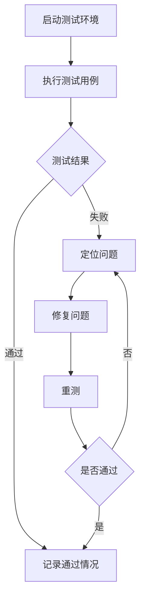

                 

## 提示词编程的版本兼容性管理

### 关键词：版本兼容性管理、提示词编程、软件工程、开发与运维

> 摘要：本文将深入探讨提示词编程中的版本兼容性管理问题。版本兼容性管理是软件工程中一个关键而复杂的话题，特别是在快速迭代和不断更新的软件开发环境中。本文将从版本兼容性管理的背景、核心概念、策略、工具和方法，到最佳实践与未来展望，提供全面而深入的剖析。

----------------------------------------------------------------

### 第一部分：版本兼容性管理概述

#### 1.1 版本兼容性管理的背景

**1.1.1 软件发展中的版本兼容性问题**

随着软件系统的不断演化，版本兼容性问题逐渐成为软件工程中的常见挑战。版本兼容性问题指的是新版本软件与旧版本软件在功能、界面、数据格式等方面不兼容，从而导致用户体验下降或系统运行不稳定。

**1.1.2 版本兼容性管理的重要性**

有效的版本兼容性管理对于确保软件系统的稳定性和用户体验至关重要。它不仅能减少维护成本，还能提升软件的市场竞争力。

#### 1.2 版本兼容性管理的核心概念

**1.2.1 版本号的定义**

版本号是标识软件版本的关键，一般采用递增的数字或字母数字组合表示。常见的版本号格式包括`MAJOR.MINOR.PATCH`，分别代表主版本号、次版本号和修订号。

**1.2.2 兼容性级别的划分**

兼容性级别通常分为兼容性最低、部分兼容、完全兼容三级。兼容性最低级别表示新版本完全无法兼容旧版本，部分兼容表示在某些特定方面不兼容，而完全兼容则表示新版本能够完全替代旧版本。

**1.2.3 兼容性矩阵的构建**

兼容性矩阵是一种用于描述不同版本之间兼容性的工具。通过构建兼容性矩阵，开发人员可以直观地了解各个版本之间的兼容性关系。

#### 1.3 版本兼容性管理的策略

**1.3.1 设计阶段的兼容性规划**

在设计阶段，应当制定兼容性规划，确保软件架构和设计模式能够支持版本兼容性。

**1.3.2 开发阶段的兼容性测试**

开发阶段应进行全面的兼容性测试，包括功能性兼容性测试、界面兼容性测试、性能兼容性测试和安全性兼容性测试。

**1.3.3 运维阶段的兼容性维护**

运维阶段需要持续监测版本兼容性问题，并采取必要的措施进行修复和维护。

----------------------------------------------------------------

### 第二部分：版本兼容性管理工具与方法

#### 2.1 版本兼容性管理工具

**2.1.1 自动化兼容性测试工具**

自动化兼容性测试工具如Selenium、Appium等，能够大大提高兼容性测试的效率。

**2.1.2 版本管理工具**

版本管理工具如Git、Svn等，可以帮助团队管理和追踪版本变化。

**2.1.3 性能分析工具**

性能分析工具如JMeter、LoadRunner等，可以评估不同版本软件的性能差异。

#### 2.2 版本兼容性管理方法

**2.2.1 功能性兼容性测试**

功能性兼容性测试旨在验证新版本软件是否保留了旧版本的功能，并添加了必要的改进。

**2.2.2 界面兼容性测试**

界面兼容性测试关注新版本软件的界面与旧版本是否一致，包括布局、颜色、字体等。

**2.2.3 性能兼容性测试**

性能兼容性测试评估新版本软件在不同系统和环境下的性能表现。

**2.2.4 安全性兼容性测试**

安全性兼容性测试确保新版本软件在安全方面与旧版本保持一致或提升。

#### 2.3 版本兼容性管理的实践案例

**2.3.1 案例一：大型电商平台**

分析某大型电商平台如何通过版本兼容性管理确保系统的稳定运行。

**2.3.2 案例二：移动应用开发**

探讨移动应用开发中版本兼容性管理的挑战和解决方案。

**2.3.3 案例三：企业级软件升级**

研究企业级软件在升级过程中如何处理版本兼容性问题。

----------------------------------------------------------------

### 第三部分：版本兼容性管理的最佳实践与展望

#### 3.1 版本兼容性管理的最佳实践

**3.1.1 设计阶段**

在设计阶段，应注重模块化设计和抽象化，以便于后续版本兼容性的实现。

**3.1.2 开发阶段**

在开发阶段，应制定详细的测试计划和执行策略，确保兼容性问题的及时发现和解决。

**3.1.3 运维阶段**

在运维阶段，应建立完善的监控和反馈机制，及时响应版本兼容性问题。

#### 3.2 版本兼容性管理的未来展望

**3.2.1 新技术的挑战**

随着新技术的不断涌现，版本兼容性管理面临新的挑战。

**3.2.2 未来的趋势**

版本兼容性管理将更加注重自动化和智能化。

**3.2.3 潜在的解决方案**

探讨潜在的技术解决方案，如微服务架构、容器化等，以应对版本兼容性管理的挑战。

----------------------------------------------------------------

## 总结与展望

版本兼容性管理是软件工程中不可或缺的一环，它关乎软件系统的稳定性和用户体验。本文通过深入分析版本兼容性管理的背景、核心概念、策略、工具和方法，结合实践案例，提供了全面的指导。未来，版本兼容性管理将面临更多挑战，但也将迎来更多创新和解决方案。

### 作者信息

作者：AI天才研究院/AI Genius Institute & 禅与计算机程序设计艺术 /Zen And The Art of Computer Programming

----------------------------------------------------------------

### 附录

**1. 兼容性矩阵示例**

```mermaid
gridLayout columns: 2
graph TD
    A1[兼容性矩阵] --> B1[主版本] --> C1[次版本] --> D1[修订号]
    B1 --> B2[旧版本] --> B3[新版本]
    C1 --> C2[旧版本] --> C3[新版本]
    D1 --> D2[旧版本] --> D3[新版本]
```

**2. 功能性兼容性测试流程图**



**3. 版本兼容性管理Python代码示例**

```python
# 版本兼容性检查
def check_compatibility(old_version, new_version):
    major_old, minor_old, patch_old = map(int, old_version.split('.'))
    major_new, minor_new, patch_new = map(int, new_version.split('.'))
    
    if major_old == major_new:
        if minor_old == minor_new:
            return patch_old <= patch_new
        else:
            return minor_old <= minor_new
    else:
        return major_old <= major_new

# 示例
old_version = '1.2.3'
new_version = '1.3.4'
if check_compatibility(old_version, new_version):
    print("新版本兼容旧版本")
else:
    print("新版本不兼容旧版本")
```

**4. 最佳实践Tips**

- **及时更新文档**：确保所有团队成员都了解版本兼容性管理的策略和流程。
- **定期评估**：定期评估和更新兼容性矩阵，以适应新版本的需求。
- **自动化测试**：利用自动化工具进行兼容性测试，提高测试效率和准确性。
- **社区反馈**：关注用户社区反馈，及时发现和解决兼容性问题。

### 拓展阅读

- 《软件工程：实践者的研究方法》
- 《版本控制指南》
- 《自动化测试实战》

通过以上内容，我们期望读者能够对版本兼容性管理有一个全面而深入的理解，并在实际工作中应用这些最佳实践，提升软件系统的稳定性和用户体验。让我们继续探索，共同推动软件工程的进步。💡💡💡

