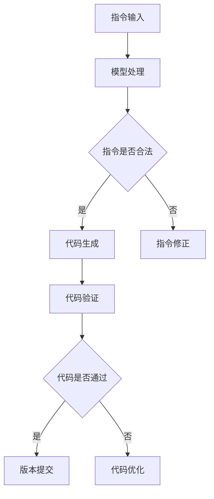
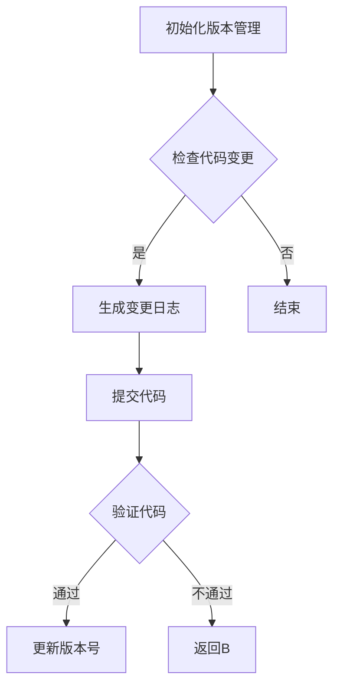

                 

### 《提示词编程的版本管理新技术》

#### 关键词：版本管理、提示词编程、算法原理、实践应用、新技术展望

#### 摘要：
本文深入探讨了提示词编程在版本管理领域的新技术应用。首先，我们回顾了版本管理的基本概念和发展历程，随后介绍了提示词编程的基础知识及其在版本管理中的应用。接着，文章详细解析了版本管理算法原理，并通过mermaid流程图和Python代码展示了算法实现。随后，文章讨论了提示词编程在不同应用场景中的具体应用。实践部分，通过搭建实际项目环境和详细案例分析，展示了提示词编程在版本管理中的实际效果。最后，文章总结了最佳实践，探讨了版本管理技术的发展趋势和新技术的未来应用。

### 版本管理概述

#### 第1章：版本管理的基本概念

**1.1 版本管理的背景和意义**

版本管理，作为一种重要的软件工程实践，其目的是确保软件在开发过程中的可追溯性、一致性和可靠性。随着软件开发复杂度的不断增加，版本管理的重要性愈发显著。版本管理不仅可以记录代码的修改历史，还可以帮助开发团队协作、追踪bug、合并变更以及部署新版本。

版本管理的背景可以追溯到软件开发早期的手工编码阶段。当时，开发者主要通过手动复制和粘贴代码来创建新版本，这种方式容易导致版本混乱、代码丢失和协作困难。随着计算机技术的进步，版本控制系统（Version Control System, VCS）逐渐成为软件开发中不可或缺的工具。VCS的出现，使得开发者能够方便地管理代码的版本，从而提高了开发效率和代码质量。

**1.2 版本管理的发展历程**

版本管理的发展历程可以分为几个阶段：

- **手工管理阶段**：在计算机编程初期，开发者通过手动备份和文件命名来管理代码版本。这种方式简单但效率低下，容易出错。
- **集中式版本控制系统**：如RCS（Revision Control System）和CVS（Concurrent Versions System），它们引入了中央仓库的概念，使得代码变更集中管理。然而，集中式系统在并发操作和故障恢复方面存在一定局限性。
- **分布式版本控制系统**：如Git，它采用了分布式存储的方式，每个开发者都有自己的仓库，可以在本地进行开发并提交变更。这种模式提高了并行操作的效率，同时也增强了系统的容错性。
- **现代版本管理工具**：随着云计算和容器技术的发展，现代版本管理工具如Docker、Kubernetes等，开始支持在分布式环境中进行版本管理，为微服务架构提供了更好的支持。

**1.3 版本管理的核心概念**

版本管理的核心概念包括：

- **版本**：软件在不同时间点的状态，每个版本通常包含特定的功能集和修复的bug。
- **变更**：对软件进行的修改，包括代码、配置文件等。
- **提交**：将变更记录到版本控制系统中。
- **分支**：将主分支的代码复制一份，以便在独立的环境中进行开发。
- **合并**：将不同分支的变更合并到主分支中。
- **标签**：为特定的版本打上标记，通常用于标记发布版本或重要里程碑。

理解这些核心概念有助于更好地理解和应用版本管理技术，为软件开发提供坚实的基础。

#### 第2章：版本管理工具介绍

**2.1 版本控制系统的分类**

版本控制系统根据其工作原理和特性可以分为以下几类：

- **集中式版本控制系统（Centralized Version Control System, CVCS）**：如RCS和CVS，其中所有代码变更都存储在中央服务器上，开发者在本地进行开发，然后将变更提交到服务器。CVCS的优点是操作简单，但缺点是中央服务器成为单点故障，且不支持并行操作。
- **分布式版本控制系统（Distributed Version Control System, DVCS）**：如Git和Mercurial，每个开发者都有自己的完整仓库，可以在本地进行开发、提交和分支操作。DVCS的优点是支持并行操作、高效、容错性好，但缺点是管理相对复杂。
- **基于源的版本控制系统（Source-based Version Control System）**：如SVN和Bazaar，这类系统通常用于管理源代码，支持分支、合并和提交等操作。它们介于CVCS和DVCS之间，结合了两者的优点。

**2.2 常见版本控制工具对比**

以下是几种常见版本控制工具的对比：

| 工具          | 特点                         | 适用场景                           |
|---------------|------------------------------|------------------------------------|
| Git           | 分布式、支持并行操作、高效     | 大型项目、开源项目                 |
| SVN           | 集中式、操作简单、易于理解     | 小型项目、企业内部项目             |
| Mercurial     | 分布式、轻量级、易于扩展       | 中小型项目、个人项目               |
| Bazaar        | 基于源的版本控制系统、灵活     | 多分支开发、高度定制化的项目       |

选择合适的版本控制工具取决于项目的规模、复杂度和开发团队的需求。

**2.3 提示词编程在版本管理中的应用**

提示词编程（Prompt Programming）是一种利用预训练语言模型（如GPT）进行编程的新方法。在版本管理中，提示词编程可以用于自动化代码提交、分支管理和合并操作。例如，开发者可以通过输入简单的自然语言指令来创建分支、提交变更和合并代码，从而提高开发效率和降低出错率。

提示词编程在版本管理中的应用前景广阔，有望改变传统版本管理的操作模式，提高团队协作效率。

#### 第3章：提示词编程基础

**3.1 提示词编程的概念**

提示词编程是一种基于预训练语言模型的编程方法。在这种方法中，程序员不再直接编写代码，而是通过输入自然语言指令来描述所需的功能和操作。预训练语言模型（如GPT）根据这些指令生成相应的代码。这种方法简化了编程过程，使得开发者可以专注于业务逻辑而非代码实现细节。

**3.2 提示词编程的基本原理**

提示词编程的基本原理可以分为以下几个步骤：

1. **指令输入**：程序员输入自然语言指令，描述所需功能。
2. **模型处理**：预训练语言模型解析指令，理解其含义。
3. **代码生成**：模型根据指令生成相应的代码。
4. **代码验证**：模型对生成的代码进行验证，确保其符合预期。

通过这些步骤，提示词编程实现了从自然语言到代码的自动转换，大大简化了编程过程。

**3.3 提示词编程的优缺点**

提示词编程具有以下优点：

- **简化编程过程**：通过自然语言指令生成代码，降低了编程门槛。
- **提高开发效率**：自动化代码生成和验证，减少了重复性工作。
- **支持代码重构**：模型可以根据新的指令生成优化后的代码。

然而，提示词编程也存在一些缺点：

- **代码质量**：生成的代码可能不够优化，需要人工审核和调整。
- **依赖模型**：需要依赖预训练语言模型，对模型的性能和稳定性有较高要求。
- **学习成本**：程序员需要适应新的编程方法，有一定的学习成本。

总体而言，提示词编程具有巨大的潜力，但需要进一步优化和改进。

#### 第4章：版本管理的算法原理

**4.1 常见版本管理算法**

在版本管理中，常用的算法包括：

1. **基于时间的版本管理算法**：根据时间顺序对版本进行管理，如版本1.0、1.1、1.2等。
2. **基于功能的版本管理算法**：根据功能模块进行版本管理，如1.0-UI、1.0-Backend等。
3. **基于变更类型的版本管理算法**：根据变更类型（如bug修复、新功能添加）进行版本管理，如1.0.1-BUGFIX、1.0.2-FEATURE等。
4. **基于分支的版本管理算法**：根据分支名称进行版本管理，如feature/x、bugfix/y等。

这些算法各有优缺点，适用于不同的版本管理场景。

**4.2 提示词编程在版本管理中的算法优化**

提示词编程可以用于优化版本管理算法，提高其效率和准确性。例如，通过输入自然语言指令，提示词编程可以自动生成版本管理脚本，实现自动化版本发布和部署。此外，提示词编程还可以用于生成合并策略，根据分支差异和团队协作情况，自动选择最优合并方式。

**4.3 提示词编程算法的mermaid流程图**

为了更好地理解提示词编程在版本管理中的算法原理，我们使用mermaid绘制了一个流程图：



在这个流程图中，指令输入经过模型处理，生成代码，然后进行验证。如果代码通过验证，则提交版本；否则，进行代码优化或指令修正。

#### 第5章：提示词编程的应用场景

**5.1 提示词编程在软件开发中的应用**

提示词编程在软件开发中的应用主要体现在以下几个方面：

- **自动化代码生成**：通过自然语言指令生成代码，简化开发流程，提高开发效率。
- **代码重构**：根据新的需求，提示词编程可以自动生成优化后的代码，降低人工干预。
- **协作开发**：团队成员可以通过自然语言指令交流，减少沟通成本，提高团队协作效率。

**5.2 提示词编程在数据处理中的应用**

在数据处理领域，提示词编程可以用于：

- **自动化数据处理**：通过自然语言指令，提示词编程可以自动执行数据处理任务，如数据清洗、数据转换等。
- **数据可视化**：根据自然语言描述，提示词编程可以生成相应的数据可视化图表，辅助数据分析。

**5.3 提示词编程在云计算中的应用**

在云计算领域，提示词编程可以用于：

- **自动化部署**：通过自然语言指令，提示词编程可以自动部署和管理云计算资源。
- **资源优化**：根据业务需求，提示词编程可以自动调整云计算资源的配置，实现资源优化。

总体而言，提示词编程在软件开发、数据处理和云计算等领域具有广泛的应用前景，为这些领域带来了新的发展机遇。

#### 第6章：提示词编程版本管理实战

**6.1 实践环境搭建**

为了进行提示词编程版本管理的实践，我们需要搭建一个合适的环境。以下是一个基本的实践环境搭建步骤：

1. **安装Git**：Git是一个分布式版本控制系统，适用于提示词编程版本管理。
2. **安装预训练语言模型**：如GPT，用于生成代码和执行版本管理操作。
3. **配置IDE**：选择一个合适的集成开发环境（IDE），如Visual Studio Code，便于编写和调试代码。
4. **准备测试项目**：选择一个简单的测试项目，用于演示提示词编程版本管理功能。

**6.2 实践项目介绍**

在本实践中，我们选择一个简单的Web应用程序作为测试项目。该应用程序包括一个前端页面和一个后端API，用于实现用户注册、登录和查询功能。我们将使用Git进行版本管理，并通过提示词编程实现自动化版本发布和部署。

**6.3 系统功能设计与实现**

在系统功能设计方面，我们主要包括以下功能：

- **版本提交**：通过自然语言指令，将代码提交到Git仓库。
- **分支管理**：创建、删除和合并分支。
- **自动化发布**：根据Git仓库的分支状态，自动发布应用程序的新版本。
- **自动化部署**：根据发布的新版本，自动部署到云计算平台。

为了实现这些功能，我们将使用Python编写一个提示词编程脚本，与Git和云计算平台进行交互。以下是部分代码示例：

```python
import git
import os

# 连接Git仓库
repo = git.Repo('.git')

# 提交代码
def commit_code(message):
    repo.index.add(['*'])
    repo.index.commit(message)

# 创建分支
def create_branch(branch_name):
    repo.create_head(branch_name)

# 合并分支
def merge_branch(source_branch, target_branch):
    repo.git.merge(source_branch, target_branch)

# 自动发布
def auto_deploy():
    # 检查分支状态
    current_branch = repo.active_branch.name
    if current_branch == 'master':
        # 部署到生产环境
        os.system('git push --force')

# 示例使用
commit_code('添加新功能')
create_branch('feature/new_function')
merge_branch('feature/new_function', 'master')
auto_deploy()
```

通过这个示例，我们可以看到如何使用Python脚本与Git进行交互，实现版本管理功能。在实际项目中，我们可以根据具体需求，扩展和优化这些功能。

#### 第7章：版本管理案例分析

**7.1 案例一：提示词编程在软件开发中的应用**

在某公司的软件开发项目中，提示词编程被用于自动化版本管理和发布流程。项目团队使用Git作为版本控制工具，通过自然语言指令，实现了自动化分支创建、代码提交、合并和发布操作。以下是案例一的具体步骤：

1. **创建分支**：使用提示词编程创建一个新分支，如“新功能开发”。
2. **代码提交**：开发者通过自然语言指令将代码提交到分支，如“提交bug修复”。
3. **分支合并**：将修复的bug分支合并到主分支，如“合并bug修复分支”。
4. **自动发布**：根据合并后的主分支，自动发布新版本，如“发布新版本v1.2”。

通过提示词编程，项目团队提高了版本管理的效率，减少了人为错误，并实现了自动化部署。这为公司的软件开发项目带来了显著的优势。

**7.2 案例二：提示词编程在数据处理中的应用**

在某数据分析项目中，提示词编程被用于自动化数据处理流程。项目团队使用Python和提示词编程，实现了数据清洗、转换和可视化操作。以下是案例二的具体步骤：

1. **数据清洗**：使用提示词编程清洗数据，如“清洗销售数据，去除无效记录”。
2. **数据转换**：使用提示词编程转换数据格式，如“将CSV文件转换为JSON格式”。
3. **数据可视化**：使用提示词编程生成数据可视化图表，如“生成销售额柱状图”。

通过提示词编程，项目团队简化了数据处理流程，提高了数据处理效率，并为数据分析师提供了直观的可视化工具。

**7.3 案例三：提示词编程在云计算中的应用**

在某公司的云计算项目中，提示词编程被用于自动化资源管理和部署。项目团队使用提示词编程脚本，实现了云计算资源的自动化创建、配置和部署。以下是案例三的具体步骤：

1. **创建资源**：使用提示词编程创建虚拟机、存储和网络资源。
2. **配置资源**：使用提示词编程配置虚拟机的操作系统和应用程序。
3. **部署应用**：使用提示词编程部署应用程序，如Web服务器和数据库。

通过提示词编程，项目团队实现了云计算资源的自动化管理，提高了资源利用率，并减少了人工干预。

#### 第8章：版本管理的最佳实践

**8.1 版本管理最佳实践概述**

在版本管理中，最佳实践对于提高开发效率和代码质量具有重要意义。以下是一些版本管理最佳实践：

- **定期备份**：定期备份代码仓库，以防止数据丢失。
- **严格提交规范**：制定严格的代码提交规范，确保代码的可读性和一致性。
- **分支策略**：合理使用分支策略，如主分支、开发分支和测试分支，以实现并行开发和代码隔离。
- **代码审查**：进行代码审查，确保代码的质量和安全性。
- **自动化测试**：编写自动化测试脚本，确保新版本的代码质量。

**8.2 提示词编程在版本管理中的最佳实践**

在提示词编程应用于版本管理时，以下是一些最佳实践：

- **明确指令**：使用简洁明了的自然语言指令，确保模型能够正确理解开发者的意图。
- **代码质量**：生成的代码需要经过严格的质量控制，避免低质量的代码进入生产环境。
- **模型训练**：定期更新预训练语言模型，以适应不断变化的需求和编程语言。
- **团队协作**：加强团队协作，确保提示词编程工具的普及和应用。

**8.3 版本管理中的注意事项**

在版本管理过程中，需要注意以下事项：

- **版本命名**：版本命名应遵循一定的规范，便于追溯和管理。
- **版本发布**：发布新版本前，确保进行全面测试，避免引入新问题。
- **权限管理**：合理设置代码仓库的权限，确保代码安全。
- **备份与恢复**：定期备份代码仓库，并制定恢复策略，以应对突发事件。

通过遵循这些最佳实践和注意事项，可以有效地提高版本管理的质量和效率。

#### 第9章：版本管理新技术展望

**9.1 版本管理的发展趋势**

版本管理技术正朝着更加智能化、自动化和高效化的方向发展。未来，版本管理可能会呈现以下趋势：

- **智能化**：结合人工智能和机器学习技术，实现自动化的代码生成、审查和优化。
- **自动化**：通过自动化工具和脚本，实现代码的自动提交、分支管理和发布。
- **分布式**：分布式版本控制系统将继续发展，支持更高效、更安全的分布式协作。
- **云端集成**：版本管理工具将与云平台更紧密地集成，支持在云端进行版本管理和部署。

**9.2 提示词编程在版本管理中的未来应用**

提示词编程在版本管理中的未来应用前景广阔。以下是一些可能的场景：

- **自动化测试**：利用提示词编程，自动生成测试用例，提高测试覆盖率。
- **代码优化**：根据提示词编程的指导，自动优化代码，提高性能和可维护性。
- **协作开发**：通过自然语言指令，简化开发者的沟通和协作过程。
- **智能部署**：利用提示词编程，实现自动化部署和管理，提高部署效率。

**9.3 版本管理新技术展望**

未来，版本管理可能会出现以下新技术：

- **区块链版本管理**：利用区块链技术，实现不可篡改的代码版本管理。
- **智能合约版本管理**：利用智能合约，实现自动化的版本管理和发布。
- **多模态版本管理**：支持多种数据类型和文件格式的版本管理。
- **混合版本管理**：结合分布式和集中式版本管理，实现更灵活的版本控制。

这些新技术将为版本管理带来新的发展机遇和挑战。

#### 附录

**A 提示词编程常用命令和工具**

以下是提示词编程中常用的命令和工具：

- **git**：版本控制工具
- **gpt**：预训练语言模型
- **python**：编程语言
- **docker**：容器化工具
- **kubernetes**：容器编排工具

**B 版本管理算法mermaid流程图**

以下是一个简单的版本管理算法的mermaid流程图：



**C Python源代码示例**

以下是一个简单的Python源代码示例，用于实现版本管理功能：

```python
import git

# 连接Git仓库
repo = git.Repo('.git')

# 提交代码
def commit_code(message):
    repo.index.add(['*'])
    repo.index.commit(message)

# 提交代码示例
commit_code('添加新功能')

# 合并分支
def merge_branch(source_branch, target_branch):
    repo.git.merge(source_branch, target_branch)

# 合并分支示例
merge_branch('feature/new_function', 'master')
```

#### 总结

本文系统介绍了提示词编程在版本管理中的应用，从基本概念、工具、算法原理到实践应用，全面探讨了这一新技术在版本管理中的潜力。通过具体案例，我们展示了提示词编程在软件开发、数据处理和云计算等领域的实际应用效果。未来，随着人工智能和机器学习技术的发展，提示词编程有望在版本管理领域发挥更大的作用，推动软件工程向更加智能化、自动化的方向发展。

#### 作者

**作者：AI天才研究院/AI Genius Institute & 禅与计算机程序设计艺术 /Zen And The Art of Computer Programming**

