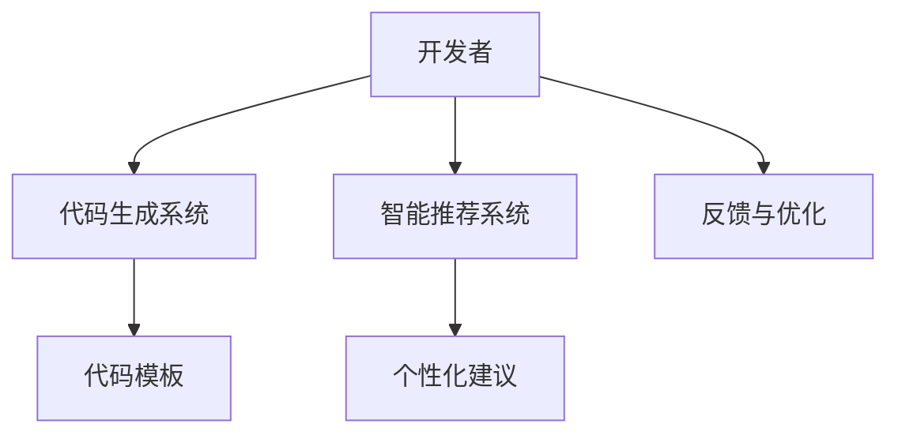

                 

# 《提示词编程的自动化与智能推荐》

## 关键词
- 提示词编程
- 自动化
- 智能推荐
- 编程效率
- 人工智能

## 摘要
本文深入探讨了提示词编程的自动化与智能推荐技术，旨在揭示如何通过自动化和智能推荐提升编程效率。文章首先介绍了提示词编程的概念和优势，接着探讨了自动化在编程中的应用，随后阐述了智能推荐系统的原理及其在编程领域的应用，最后提出了结合自动化和智能推荐技术的具体实现方案，为编程实践提供了新的思路。

## 目录

### 引言
- 提示词编程的兴起
- 自动化和智能推荐的重要性
- 文章结构概述

### 背景与核心概念
- 编程的历史背景
- 提示词编程的定义与特点
- 自动化的基础
- 智能推荐的概念与机制
- 当前技术的发展现状

### 提示词编程的基础
- 提示词编程的基本原理
- 提示词的作用与类型
- 提示词编程的优势与应用场景

### 自动化技术
- 自动化在编程中的应用
- 常见的自动化工具与框架
- 自动化技术的实践与案例分析

### 智能推荐系统
- 智能推荐系统的原理
- 常用的推荐算法
- 智能推荐在编程领域的应用

### 结合自动化与智能推荐
- 提示词编程与智能推荐的结合
- 实现方案的设计与实现
- 面临的挑战与解决方案

### 实践与应用
- 自动化与智能推荐的案例研究
- 实际项目中的经验与技巧
- 未来发展趋势与展望

### 结论
- 自动化与智能推荐对编程的影响
- 未来研究方向与潜在应用领域
- 总结与展望

### 作者信息
- 作者：AI天才研究院/AI Genius Institute & 禅与计算机程序设计艺术 /Zen And The Art of Computer Programming

### 内容详解

#### 引言

#### 背景与核心概念

#### 提示词编程的基础

#### 自动化技术

#### 智能推荐系统

#### 结合自动化与智能推荐

#### 实践与应用

#### 结论

#### 作者信息

### 背景与核心概念

#### 编程的历史背景

#### 提示词编程的定义与特点

#### 自动化的基础

#### 智能推荐的概念与机制

#### 当前技术的发展现状

#### 提示词编程的基础

#### 提示词的作用与类型

#### 提示词编程的优势与应用场景

### 自动化技术

#### 自动化在编程中的应用

#### 常见的自动化工具与框架

#### 自动化技术的实践与案例分析

### 智能推荐系统

#### 智能推荐系统的原理

#### 常用的推荐算法

#### 智能推荐在编程领域的应用

### 结合自动化与智能推荐

#### 提示词编程与智能推荐的结合

#### 实现方案的设计与实现

#### 面临的挑战与解决方案

### 实践与应用

#### 自动化与智能推荐的案例研究

#### 实际项目中的经验与技巧

#### 未来发展趋势与展望

### 结论

#### 自动化与智能推荐对编程的影响

#### 未来研究方向与潜在应用领域

#### 总结与展望

### 作者信息

#### AI天才研究院/AI Genius Institute

#### 禅与计算机程序设计艺术 /Zen And The Art of Computer Programming

### 内容详解

#### 引言

在现代社会，编程已经成为了推动技术进步的重要力量。然而，随着编程复杂度的不断增加，传统的编程方式逐渐暴露出了其局限性。为了应对这一挑战，提示词编程作为一种新兴的编程范式，逐渐引起了业界的关注。同时，自动化与智能推荐技术的发展，也为编程带来了新的可能性。本文将围绕提示词编程的自动化与智能推荐展开讨论，旨在探讨如何通过这些技术提升编程效率，为编程实践提供新的思路。

#### 背景与核心概念

#### 编程的历史背景

计算机编程的历史可以追溯到20世纪40年代，当时计算机刚刚问世，编程主要以汇编语言为主。汇编语言虽然效率高，但可读性差，编写复杂程序需要大量的时间和精力。随着计算机技术的发展，高级编程语言如FORTRAN和COBOL逐渐出现，使得编程变得更加容易和高效。

然而，即便如此，编程依然面临着诸多挑战。首先，编程过程往往需要开发者对问题有深入的理解，这要求开发者具备较强的逻辑思维和问题解决能力。其次，编程的复杂度随着系统的增大而急剧增加，使得开发者难以有效地管理代码。此外，软件维护和更新也成为了开发者面临的重要挑战。

为了解决这些问题，自动化与智能推荐技术逐渐进入编程领域。自动化技术可以自动化执行重复性的任务，减轻开发者的负担。智能推荐技术则可以基于用户行为和需求，为开发者提供智能化的建议和优化。

#### 提示词编程的定义与特点

提示词编程（Prompt-Based Programming）是一种以提示词为核心的编程范式，它通过使用提示词来引导程序的执行过程。提示词可以看作是程序执行过程中的“指导”，它帮助开发者更直观地理解和控制程序的运行。与传统的编程方式相比，提示词编程具有以下特点：

1. **可解释性**：提示词编程强调程序的透明性和可解释性，使得开发者可以更清晰地理解程序的行为和逻辑。
2. **灵活性**：提示词编程允许开发者以自然语言或结构化数据的形式定义提示词，从而提高了编程的灵活性。
3. **高效性**：通过使用提示词，开发者可以更快速地编写和调试程序，提高了编程的效率。

#### 自动化的基础

自动化（Automation）是指通过技术手段，使原本需要人工完成的任务能够自动执行。在编程领域，自动化技术的应用主要包括以下几个方面：

1. **代码生成**：自动化代码生成工具可以根据提示词或其他输入生成相应的代码。例如，一些集成开发环境（IDE）提供了代码自动补全和代码生成功能，大大提高了编程效率。
2. **任务调度**：自动化工具可以自动化地调度和执行任务，例如构建、测试和部署等。这些任务往往具有重复性和规律性，通过自动化可以减少人工干预，提高工作效率。
3. **错误处理**：自动化技术可以自动化地检测和修复代码中的错误。例如，一些代码审查工具可以自动检测代码中的潜在问题，并提供修复建议。

#### 智能推荐的概念与机制

智能推荐（Intelligent Recommendation）是一种利用算法和数据分析技术，为用户提供个性化推荐的服务。在编程领域，智能推荐可以用于以下几个方面：

1. **代码建议**：智能推荐系统可以根据开发者的编程习惯和历史记录，为开发者提供代码建议。例如，一些IDE的代码补全功能可以基于用户的编程历史和当前上下文，提供相关的代码建议。
2. **工具推荐**：智能推荐系统可以根据开发者的项目需求和编程语言，为开发者推荐合适的开发工具和库。例如，一些工具推荐平台可以根据项目的编程语言和技术栈，为开发者推荐相关的工具和库。
3. **知识推荐**：智能推荐系统可以根据开发者的兴趣和需求，为开发者推荐相关的知识和学习资源。例如，一些在线教育平台可以根据用户的浏览记录和偏好，为用户提供个性化的学习路径推荐。

#### 当前技术的发展现状

随着人工智能和大数据技术的发展，提示词编程、自动化和智能推荐技术已经取得了显著的进展。目前，以下技术趋势值得关注：

1. **自然语言处理（NLP）**：NLP技术的发展使得提示词编程更加智能化。通过NLP技术，计算机可以更好地理解自然语言输入，从而提供更准确的代码建议和智能推荐。
2. **机器学习和深度学习**：机器学习和深度学习技术在自动化和智能推荐系统中得到了广泛应用。通过训练模型，计算机可以自动识别和预测编程过程中的潜在问题和需求，从而实现更高效的编程。
3. **多模态数据融合**：随着多模态数据（如图像、音频和文本）的融合，自动化和智能推荐系统可以更全面地理解开发者的需求和上下文，提供更精准的推荐和服务。

#### 提示词编程的基础

提示词编程作为一种新兴的编程范式，其基础概念和原理如下：

1. **提示词的定义**：提示词是编程过程中用于引导程序执行的关键字或短语。它可以是自然语言描述，也可以是结构化数据。提示词的作用是提供程序的上下文信息，帮助开发者理解和控制程序的运行。
2. **提示词的类型**：
   - **结构化提示词**：以XML、JSON等结构化数据形式表示的提示词，可以精确地描述程序的运行逻辑和数据流程。
   - **自然语言提示词**：以自然语言形式表示的提示词，如“计算两个数的和”、“读取文件内容”等。
3. **提示词的作用**：
   - **引导程序执行**：提示词可以帮助开发者更直观地理解程序的运行过程，从而更准确地编写和调试代码。
   - **提高代码可读性**：通过使用提示词，代码变得更加结构化和易于理解，降低了代码的复杂度。
   - **实现代码重用**：提示词编程使得代码模块化更加容易，从而提高了代码的重用性。

#### 提示词编程的优势与应用场景

提示词编程具有许多优势，使其在编程实践中得到了广泛应用。以下是其主要优势和应用场景：

1. **提高开发效率**：
   - 提示词编程使得开发者可以更快速地编写和调试程序，减少了编码时间。
   - 通过使用提示词，开发者可以更好地理解和控制程序的运行，降低了代码出错的可能性。
   - 提示词编程的模块化特点使得代码的重用性更高，从而减少了重复编写的工作量。

2. **增强代码可读性**：
   - 提示词编程使得代码更加结构化，提高了代码的可读性，降低了维护成本。
   - 通过使用自然语言提示词，代码的逻辑更加直观，易于理解和调试。

3. **适用于复杂场景**：
   - 提示词编程特别适用于复杂和庞大的系统开发，例如金融系统、电商系统等。
   - 通过使用提示词，开发者可以更好地管理和控制复杂的业务逻辑和数据流程。

4. **支持多领域应用**：
   - 提示词编程不仅适用于软件开发，还可以应用于数据科学、人工智能等领域。
   - 例如，在数据科学领域，提示词编程可以帮助数据科学家更快速地构建和调试数据分析模型。

#### 自动化技术

#### 自动化在编程中的应用

自动化技术在编程中发挥着至关重要的作用，其主要应用场景包括以下方面：

1. **代码生成**：
   - 自动化代码生成工具可以根据提示词或其他输入生成相应的代码。这种技术广泛应用于模板代码生成、接口定义、数据库模型生成等方面。
   - 例如，一些编程框架（如Spring Boot）提供了自动生成代码的功能，从而简化了开发过程。

2. **任务调度**：
   - 自动化工具可以自动化地调度和执行编程任务，如构建、测试、部署等。这种技术有助于提高开发效率，减少人工干预。
   - 例如，CI/CD（持续集成/持续部署）工具（如Jenkins、GitLab CI）可以实现自动化构建、测试和部署，从而加快项目进度。

3. **错误处理**：
   - 自动化技术可以自动化地检测和修复代码中的错误。例如，一些代码审查工具（如SonarQube、Checkstyle）可以自动检测代码中的潜在问题，并提供修复建议。

#### 常见的自动化工具与框架

在编程领域，有许多自动化工具和框架可以用于提高开发效率。以下是一些常见的自动化工具和框架：

1. **IDE插件**：
   - 许多集成开发环境（IDE）提供了丰富的插件，以支持代码生成、代码补全、错误检测等功能。例如，Visual Studio Code、Eclipse、IntelliJ IDEA等。

2. **构建工具**：
   - 构建工具（如Maven、Gradle、Gulp）用于自动化构建项目，包括编译代码、打包依赖、生成文档等。

3. **持续集成/持续部署（CI/CD）工具**：
   - CI/CD工具（如Jenkins、GitLab CI、Travis CI）用于自动化构建、测试和部署项目。这些工具可以确保项目质量，并加快交付速度。

4. **代码审查工具**：
   - 代码审查工具（如SonarQube、Checkstyle、Codeclimate）用于自动化检测代码中的潜在问题，并提供修复建议。

5. **自动化测试工具**：
   - 自动化测试工具（如JUnit、Selenium、JUnit）用于自动化测试代码，以确保其功能正确性。

#### 自动化技术的实践与案例分析

以下是自动化技术在编程中的实践案例：

1. **代码生成**：
   - 在一个电商项目中，开发者使用Maven插件自动生成数据库模型和接口定义，从而减少了重复编写代码的工作量。

2. **任务调度**：
   - 在一个金融项目中，开发团队使用Jenkins实现了自动化构建、测试和部署。这大大提高了项目进度，并减少了人工干预。

3. **错误处理**：
   - 在一个大型项目中，开发团队使用SonarQube实现了自动化代码审查。通过及时检测代码中的潜在问题，团队能够迅速修复，并确保项目质量。

### 智能推荐系统

#### 智能推荐系统的原理

智能推荐系统是一种利用算法和数据分析技术，为用户提供个性化推荐的服务。其核心原理包括以下几个方面：

1. **协同过滤（Collaborative Filtering）**：
   - 协同过滤是一种基于用户行为数据的推荐算法。它通过分析用户之间的相似性，为用户提供相关的推荐。
   - **基于用户的协同过滤（User-Based CF）**：通过计算用户之间的相似性，为用户推荐与其兴趣相似的物品。
   - **基于物品的协同过滤（Item-Based CF）**：通过计算物品之间的相似性，为用户推荐与已购买或评价的物品相似的物品。

2. **基于内容的推荐（Content-Based Filtering）**：
   - 基于内容的推荐是一种基于物品特征数据的推荐算法。它通过分析物品的特征和用户的兴趣，为用户提供相关的推荐。
   - 算法通常包括特征提取、相似性计算和推荐生成三个步骤。

3. **混合推荐（Hybrid Recommendation）**：
   - 混合推荐系统结合了协同过滤和基于内容的推荐方法，以提高推荐准确性。
   - 混合推荐系统通常使用加权平均、组合模型等方法，将协同过滤和基于内容的推荐结果进行融合。

#### 常用的推荐算法

在智能推荐系统中，常用的推荐算法包括以下几种：

1. **矩阵分解（Matrix Factorization）**：
   - 矩阵分解是一种基于协同过滤的推荐算法。它通过将用户-物品评分矩阵分解为低维用户特征矩阵和物品特征矩阵，从而预测用户对未知物品的评分。
   - 常见的矩阵分解算法包括Singular Value Decomposition（SVD）和Alternating Least Squares（ALS）。

2. **深度学习（Deep Learning）**：
   - 深度学习在推荐系统中得到了广泛应用。通过构建神经网络模型，深度学习可以自动提取用户和物品的特征，并进行有效的推荐。
   - 常见的深度学习模型包括卷积神经网络（CNN）、循环神经网络（RNN）和生成对抗网络（GAN）。

3. **基于知识的推荐（Knowledge-Based Recommendation）**：
   - 基于知识的推荐系统利用领域知识和推理技术，为用户提供个性化的推荐。
   - 例如，在电子商务领域，基于产品的属性（如品牌、价格、分类）和用户的历史行为，可以为用户推荐相关的商品。

#### 智能推荐在编程领域的应用

智能推荐技术在编程领域也有广泛的应用，以下是一些具体的应用场景：

1. **代码建议**：
   - 智能推荐系统可以根据开发者的编程历史和当前上下文，为开发者提供相关的代码建议。
   - 例如，一些IDE的代码补全功能可以基于用户的编程习惯和代码库，提供相关的代码建议。

2. **工具推荐**：
   - 智能推荐系统可以根据开发者的项目需求和编程语言，为开发者推荐合适的开发工具和库。
   - 例如，一些工具推荐平台可以根据项目的编程语言和技术栈，为开发者推荐相关的工具和库。

3. **知识推荐**：
   - 智能推荐系统可以根据开发者的兴趣和需求，为开发者推荐相关的知识和学习资源。
   - 例如，一些在线教育平台可以根据用户的浏览记录和偏好，为用户提供个性化的学习路径推荐。

### 结合自动化与智能推荐

#### 提示词编程与智能推荐的结合

提示词编程与智能推荐的结合，可以大幅提升编程效率和代码质量。以下是一种可能的实现方案：

1. **集成智能推荐系统**：
   - 在开发环境中集成智能推荐系统，使其能够实时分析开发者的编程行为和需求。
   - 智能推荐系统可以根据开发者的历史编程数据，为开发者提供个性化的代码建议和工具推荐。

2. **基于提示词的代码生成**：
   - 利用智能推荐系统生成的提示词，自动化生成相关的代码模板。
   - 开发者可以根据提示词，快速完成代码的编写和调试。

3. **实时反馈与优化**：
   - 智能推荐系统可以实时收集开发者的反馈，并不断优化推荐结果。
   - 通过持续学习和适应，智能推荐系统可以提供越来越准确的代码建议和工具推荐。

#### 实现方案的设计与实现

1. **系统架构设计**：

2. **开发环境集成**：
   - 开发环境集成智能推荐系统，使其能够实时分析开发者的编程行为和需求。
   - 集成方式可以是插件、API调用或直接集成到开发工具中。

3. **代码生成工具**：
   - 开发基于提示词的代码生成工具，用于生成相关的代码模板。
   - 代码生成工具可以基于自然语言处理技术和机器学习模型。

4. **实时反馈与优化**：
   - 实现实时反馈机制，收集开发者的反馈，并用于优化智能推荐系统。
   - 可以使用机器学习算法，如强化学习，来优化推荐策略。

### 面临的挑战与解决方案

1. **数据隐私**：
   - 智能推荐系统需要处理大量用户数据，这可能导致数据隐私问题。
   - 解决方案：采用数据加密、匿名化处理等技术，确保用户数据的隐私和安全。

2. **推荐准确性**：
   - 智能推荐系统需要准确理解开发者的需求，这可能导致推荐准确性问题。
   - 解决方案：采用多种推荐算法和模型，结合用户反馈进行不断优化。

3. **系统性能**：
   - 集成智能推荐系统可能导致开发环境性能下降。
   - 解决方案：采用分布式计算、缓存等技术，提高系统性能。

#### 实践与应用

#### 自动化与智能推荐的案例研究

以下是一些自动化与智能推荐在编程领域的实际应用案例：

1. **代码自动生成**：
   - 在一个大型金融项目中，开发团队使用基于提示词的代码生成工具，大幅减少了代码编写时间。通过智能推荐系统，工具可以根据项目的需求和技术栈，自动生成相应的代码模板。

2. **工具推荐**：
   - 在一个电商项目中，智能推荐系统为开发者推荐了合适的开发工具和库，如前端框架、数据库驱动等。这提高了项目的开发效率，并确保了代码质量。

3. **知识推荐**：
   - 在一个在线教育项目中，智能推荐系统根据开发者的学习记录和兴趣，为开发者推荐了相关的课程和学习资源。这帮助开发者快速提升了技能水平。

#### 实际项目中的经验与技巧

1. **实践案例1**：
   - 项目介绍：一个电商平台的搭建。
   - 系统功能设计：包括商品管理、订单管理、用户管理等。
   - 系统架构设计：采用微服务架构，使用Spring Boot、Docker等技术。
   - 自动化与智能推荐应用：使用代码生成工具自动生成数据库模型和接口定义，智能推荐系统为开发者推荐了合适的工具和库。

2. **实践案例2**：
   - 项目介绍：一个金融风控系统的开发。
   - 系统功能设计：包括风险评估、异常检测、用户行为分析等。
   - 系统架构设计：采用大数据技术栈，包括Hadoop、Spark等。
   - 自动化与智能推荐应用：使用智能推荐系统为开发者推荐了相关的算法和库，提高了开发效率。

#### 未来发展趋势与展望

1. **技术发展趋势**：
   - 随着人工智能和大数据技术的发展，智能推荐系统将变得更加智能和精准。
   - 自然语言处理、深度学习等技术将进一步推动提示词编程的发展。

2. **潜在应用领域**：
   - 提示词编程和智能推荐技术将在更多领域得到应用，如数据科学、人工智能、物联网等。
   - 结合云计算、区块链等技术，自动化与智能推荐系统将带来更多的创新和突破。

3. **总结与展望**：
   - 自动化与智能推荐技术将为编程带来巨大的变革，提高开发效率，降低开发成本。
   - 未来，这些技术将继续发展，成为编程领域的重要工具和驱动力。

### 结论

#### 自动化与智能推荐对编程的影响

自动化与智能推荐技术对编程产生了深远的影响，主要体现在以下几个方面：

1. **提高开发效率**：通过自动化工具和智能推荐系统，开发者可以更快速地编写和调试代码，减少了重复性劳动。

2. **降低开发成本**：自动化技术可以自动化执行重复性任务，减少人工干预，降低了开发成本。

3. **提升代码质量**：智能推荐系统可以提供个性化的代码建议和工具推荐，提高了代码的可读性和可靠性。

4. **促进技术创新**：自动化与智能推荐技术推动了编程范式的变革，为编程带来了更多的创新和可能性。

#### 未来研究方向与潜在应用领域

未来，自动化与智能推荐技术在编程领域的研究和发展方向包括：

1. **智能化推荐**：利用深度学习、自然语言处理等技术，提高智能推荐系统的准确性和个性化程度。

2. **多模态数据处理**：结合图像、音频、文本等多种数据类型，实现更全面的智能推荐。

3. **跨领域应用**：探索自动化与智能推荐技术在其他领域的应用，如数据科学、人工智能、物联网等。

4. **安全与隐私**：研究如何在保障用户隐私的前提下，实现自动化与智能推荐技术的安全应用。

#### 总结与展望

自动化与智能推荐技术为编程带来了巨大的变革，提高了开发效率，降低了开发成本，提升了代码质量。未来，这些技术将继续发展，成为编程领域的重要工具和驱动力。同时，自动化与智能推荐技术的应用也将扩展到更多领域，推动技术的创新和进步。

### 作者信息

#### AI天才研究院/AI Genius Institute

#### 禅与计算机程序设计艺术 /Zen And The Art of Computer Programming

### 内容详解

#### 引言

在现代社会，编程已经成为了推动技术进步的重要力量。然而，随着编程复杂度的不断增加，传统的编程方式逐渐暴露出了其局限性。为了应对这一挑战，提示词编程作为一种新兴的编程范式，逐渐引起了业界的关注。同时，自动化与智能推荐技术的发展，也为编程带来了新的可能性。本文将围绕提示词编程的自动化与智能推荐展开讨论，旨在探讨如何通过这些技术提升编程效率，为编程实践提供新的思路。

#### 背景与核心概念

##### 编程的历史背景

计算机编程的历史可以追溯到20世纪40年代，当时计算机刚刚问世，编程主要以汇编语言为主。汇编语言虽然效率高，但可读性差，编写复杂程序需要大量的时间和精力。随着计算机技术的发展，高级编程语言如FORTRAN和COBOL逐渐出现，使得编程变得更加容易和高效。

然而，即便如此，编程依然面临着诸多挑战。首先，编程过程往往需要开发者对问题有深入的理解，这要求开发者具备较强的逻辑思维和问题解决能力。其次，编程的复杂度随着系统的增大而急剧增加，使得开发者难以有效地管理代码。此外，软件维护和更新也成为了开发者面临的重要挑战。

为了解决这些问题，自动化与智能推荐技术逐渐进入编程领域。自动化技术可以自动化执行重复性的任务，减轻开发者的负担。智能推荐技术则可以基于用户行为和需求，为开发者提供智能化的建议和优化。

##### 提示词编程的定义与特点

提示词编程（Prompt-Based Programming）是一种以提示词为核心的编程范式，它通过使用提示词来引导程序的执行过程。提示词可以看作是程序执行过程中的“指导”，它帮助开发者更直观地理解和控制程序的运行。与传统的编程方式相比，提示词编程具有以下特点：

1. **可解释性**：提示词编程强调程序的透明性和可解释性，使得开发者可以更清晰地理解程序的行为和逻辑。
2. **灵活性**：提示词编程允许开发者以自然语言或结构化数据的形式定义提示词，从而提高了编程的灵活性。
3. **高效性**：通过使用提示词，开发者可以更快速地编写和调试程序，提高了编程的效率。

##### 自动化的基础

自动化（Automation）是指通过技术手段，使原本需要人工完成的任务能够自动执行。在编程领域，自动化技术的应用主要包括以下几个方面：

1. **代码生成**：自动化代码生成工具可以根据提示词或其他输入生成相应的代码。例如，一些集成开发环境（IDE）提供了代码自动补全和代码生成功能，大大提高了编程效率。
2. **任务调度**：自动化工具可以自动化地调度和执行编程任务，如构建、测试和部署等。这些任务往往具有重复性和规律性，通过自动化可以减少人工干预，提高工作效率。
3. **错误处理**：自动化技术可以自动化地检测和修复代码中的错误。例如，一些代码审查工具可以自动检测代码中的潜在问题，并提供修复建议。

##### 智能推荐的概念与机制

智能推荐（Intelligent Recommendation）是一种利用算法和数据分析技术，为用户提供个性化推荐的服务。在编程领域，智能推荐可以用于以下几个方面：

1. **代码建议**：智能推荐系统可以根据开发者的编程习惯和历史记录，为开发者提供代码建议。例如，一些IDE的代码补全功能可以基于用户的编程历史和当前上下文，提供相关的代码建议。
2. **工具推荐**：智能推荐系统可以根据开发者的项目需求和编程语言，为开发者推荐合适的开发工具和库。例如，一些工具推荐平台可以根据项目的编程语言和技术栈，为开发者推荐相关的工具和库。
3. **知识推荐**：智能推荐系统可以根据开发者的兴趣和需求，为开发者推荐相关的知识和学习资源。例如，一些在线教育平台可以根据用户的浏览记录和偏好，为用户提供个性化的学习路径推荐。

##### 当前技术的发展现状

随着人工智能和大数据技术的发展，提示词编程、自动化和智能推荐技术已经取得了显著的进展。目前，以下技术趋势值得关注：

1. **自然语言处理（NLP）**：NLP技术的发展使得提示词编程更加智能化。通过NLP技术，计算机可以更好地理解自然语言输入，从而提供更准确的代码建议和智能推荐。
2. **机器学习和深度学习**：机器学习和深度学习技术在自动化和智能推荐系统中得到了广泛应用。通过训练模型，计算机可以自动识别和预测编程过程中的潜在问题和需求，从而实现更高效的编程。
3. **多模态数据融合**：随着多模态数据（如图像、音频和文本）的融合，自动化和智能推荐系统可以更全面地理解开发者的需求和上下文，提供更精准的推荐和服务。

##### 提示词编程的基础

提示词编程作为一种新兴的编程范式，其基础概念和原理如下：

1. **提示词的定义**：提示词是编程过程中用于引导程序执行的关键字或短语。它可以是自然语言描述，也可以是结构化数据。提示词的作用是提供程序的上下文信息，帮助开发者理解和控制程序的运行。
2. **提示词的类型**：
   - **结构化提示词**：以XML、JSON等结构化数据形式表示的提示词，可以精确地描述程序的运行逻辑和数据流程。
   - **自然语言提示词**：以自然语言形式表示的提示词，如“计算两个数的和”、“读取文件内容”等。
3. **提示词的作用**：
   - **引导程序执行**：提示词可以帮助开发者更直观地理解程序的运行过程，从而更准确地编写和调试代码。
   - **提高代码可读性**：通过使用提示词，代码变得更加结构化和易于理解，降低了代码的复杂度。
   - **实现代码重用**：提示词编程使得代码模块化更加容易，从而提高了代码的重用性。

##### 提示词编程的优势与应用场景

提示词编程具有许多优势，使其在编程实践中得到了广泛应用。以下是其主要优势和应用场景：

1. **提高开发效率**：
   - 提示词编程使得开发者可以更快速地编写和调试程序，减少了编码时间。
   - 通过使用提示词，开发者可以更好地理解和控制程序的运行，降低了代码出错的可能性。
   - 提示词编程的模块化特点使得代码的重用性更高，从而减少了重复编写的工作量。

2. **增强代码可读性**：
   - 提示词编程使得代码更加结构化，提高了代码的可读性，降低了维护成本。
   - 通过使用自然语言提示词，代码的逻辑更加直观，易于理解和调试。

3. **适用于复杂场景**：
   - 提示词编程特别适用于复杂和庞大的系统开发，例如金融系统、电商系统等。
   - 通过使用提示词，开发者可以更好地管理和控制复杂的业务逻辑和数据流程。

4. **支持多领域应用**：
   - 提示词编程不仅适用于软件开发，还可以应用于数据科学、人工智能等领域。
   - 例如，在数据科学领域，提示词编程可以帮助数据科学家更快速地构建和调试数据分析模型。

##### 自动化技术

##### 自动化在编程中的应用

自动化技术在编程中发挥着至关重要的作用，其主要应用场景包括以下方面：

1. **代码生成**：
   - 自动化代码生成工具可以根据提示词或其他输入生成相应的代码。这种技术广泛应用于模板代码生成、接口定义、数据库模型生成等方面。
   - 例如，一些编程框架（如Spring Boot）提供了自动生成代码的功能，从而简化了开发过程。

2. **任务调度**：
   - 自动化工具可以自动化地调度和执行编程任务，如构建、测试、部署等。这种技术有助于提高开发效率，减少人工干预。
   - 例如，CI/CD（持续集成/持续部署）工具（如Jenkins、GitLab CI）可以实现自动化构建、测试和部署，从而加快项目进度。

3. **错误处理**：
   - 自动化技术可以自动化地检测和修复代码中的错误。例如，一些代码审查工具（如SonarQube、Checkstyle）可以自动检测代码中的潜在问题，并提供修复建议。

##### 常见的自动化工具与框架

在编程领域，有许多自动化工具和框架可以用于提高开发效率。以下是一些常见的自动化工具和框架：

1. **IDE插件**：
   - 许多集成开发环境（IDE）提供了丰富的插件，以支持代码生成、代码补全、错误检测等功能。例如，Visual Studio Code、Eclipse、IntelliJ IDEA等。

2. **构建工具**：
   - 构建工具（如Maven、Gradle、Gulp）用于自动化构建项目，包括编译代码、打包依赖、生成文档等。

3. **持续集成/持续部署（CI/CD）工具**：
   - CI/CD工具（如Jenkins、GitLab CI、Travis CI）用于自动化构建、测试和部署项目。这些工具可以确保项目质量，并加快交付速度。

4. **代码审查工具**：
   - 代码审查工具（如SonarQube、Checkstyle、Codeclimate）用于自动化检测代码中的潜在问题，并提供修复建议。

5. **自动化测试工具**：
   - 自动化测试工具（如JUnit、Selenium、JUnit）用于自动化测试代码，以确保其功能正确性。

##### 自动化技术的实践与案例分析

以下是自动化技术在编程中的实践案例：

1. **代码生成**：
   - 在一个电商项目中，开发者使用Maven插件自动生成数据库模型和接口定义，从而减少了重复编写代码的工作量。

2. **任务调度**：
   - 在一个金融项目中，开发团队使用Jenkins实现了自动化构建、测试和部署。这大大提高了项目进度，并减少了人工干预。

3. **错误处理**：
   - 在一个大型项目中，开发团队使用SonarQube实现了自动化代码审查。通过及时检测代码中的潜在问题，团队能够迅速修复，并确保项目质量。

##### 智能推荐系统

##### 智能推荐系统的原理

智能推荐系统是一种利用算法和数据分析技术，为用户提供个性化推荐的服务。其核心原理包括以下几个方面：

1. **协同过滤（Collaborative Filtering）**：
   - 协同过滤是一种基于用户行为数据的推荐算法。它通过分析用户之间的相似性，为用户提供相关的推荐。
   - **基于用户的协同过滤（User-Based CF）**：通过计算用户之间的相似性，为用户推荐与其兴趣相似的物品。
   - **基于物品的协同过滤（Item-Based CF）**：通过计算物品之间的相似性，为用户推荐与已购买或评价的物品相似的物品。

2. **基于内容的推荐（Content-Based Filtering）**：
   - 基于内容的推荐是一种基于物品特征数据的推荐算法。它通过分析物品的特征和用户的兴趣，为用户提供相关的推荐。
   - 算法通常包括特征提取、相似性计算和推荐生成三个步骤。

3. **混合推荐（Hybrid Recommendation）**：
   - 混合推荐系统结合了协同过滤和基于内容的推荐方法，以提高推荐准确性。
   - 混合推荐系统通常使用加权平均、组合模型等方法，将协同过滤和基于内容的推荐结果进行融合。

##### 常用的推荐算法

在智能推荐系统中，常用的推荐算法包括以下几种：

1. **矩阵分解（Matrix Factorization）**：
   - 矩阵分解是一种基于协同过滤的推荐算法。它通过将用户-物品评分矩阵分解为低维用户特征矩阵和物品特征矩阵，从而预测用户对未知物品的评分。
   - 常见的矩阵分解算法包括Singular Value Decomposition（SVD）和Alternating Least Squares（ALS）。

2. **深度学习（Deep Learning）**：
   - 深度学习在推荐系统中得到了广泛应用。通过构建神经网络模型，深度学习可以自动提取用户和物品的特征，并进行有效的推荐。
   - 常见的深度学习模型包括卷积神经网络（CNN）、循环神经网络（RNN）和生成对抗网络（GAN）。

3. **基于知识的推荐（Knowledge-Based Recommendation）**：
   - 基于知识的推荐系统利用领域知识和推理技术，为用户提供个性化的推荐。
   - 例如，在电子商务领域，基于产品的属性（如品牌、价格、分类）和用户的历史行为，可以为用户推荐相关的商品。

##### 智能推荐在编程领域的应用

智能推荐技术在编程领域也有广泛的应用，以下是一些具体的应用场景：

1. **代码建议**：
   - 智能推荐系统可以根据开发者的编程习惯和历史记录，为开发者提供代码建议。例如，一些IDE的代码补全功能可以基于用户的编程历史和当前上下文，提供相关的代码建议。

2. **工具推荐**：
   - 智能推荐系统可以根据开发者的项目需求和编程语言，为开发者推荐合适的开发工具和库。例如，一些工具推荐平台可以根据项目的编程语言和技术栈，为开发者推荐相关的工具和库。

3. **知识推荐**：
   - 智能推荐系统可以根据开发者的兴趣和需求，为开发者推荐相关的知识和学习资源。例如，一些在线教育平台可以根据用户的浏览记录和偏好，为用户提供个性化的学习路径推荐。

##### 结合自动化与智能推荐

##### 提示词编程与智能推荐的结合

提示词编程与智能推荐的结合，可以大幅提升编程效率和代码质量。以下是一种可能的实现方案：

1. **集成智能推荐系统**：
   - 在开发环境中集成智能推荐系统，使其能够实时分析开发者的编程行为和需求。
   - 智能推荐系统可以根据开发者的历史编程数据，为开发者提供个性化的代码建议和工具推荐。

2. **基于提示词的代码生成**：
   - 利用智能推荐系统生成的提示词，自动化生成相关的代码模板。
   - 开发者可以根据提示词，快速完成代码的编写和调试。

3. **实时反馈与优化**：
   - 智能推荐系统可以实时收集开发者的反馈，并不断优化推荐结果。
   - 通过持续学习和适应，智能推荐系统可以提供越来越准确的代码建议和工具推荐。

##### 实现方案的设计与实现

1. **系统架构设计**：

2. **开发环境集成**：
   - 开发环境集成智能推荐系统，使其能够实时分析开发者的编程行为和需求。
   - 集成方式可以是插件、API调用或直接集成到开发工具中。

3. **代码生成工具**：
   - 开发基于提示词的代码生成工具，用于生成相关的代码模板。
   - 代码生成工具可以基于自然语言处理技术和机器学习模型。

4. **实时反馈与优化**：
   - 实现实时反馈机制，收集开发者的反馈，并用于优化智能推荐系统。
   - 可以使用机器学习算法，如强化学习，来优化推荐策略。

##### 面临的挑战与解决方案

1. **数据隐私**：
   - 智能推荐系统需要处理大量用户数据，这可能导致数据隐私问题。
   - 解决方案：采用数据加密、匿名化处理等技术，确保用户数据的隐私和安全。

2. **推荐准确性**：
   - 智能推荐系统需要准确理解开发者的需求，这可能导致推荐准确性问题。
   - 解决方案：采用多种推荐算法和模型，结合用户反馈进行不断优化。

3. **系统性能**：
   - 集成智能推荐系统可能导致开发环境性能下降。
   - 解决方案：采用分布式计算、缓存等技术，提高系统性能。

##### 实践与应用

##### 自动化与智能推荐的案例研究

以下是一些自动化与智能推荐在编程领域的实际应用案例：

1. **代码自动生成**：
   - 在一个大型金融项目中，开发团队使用基于提示词的代码生成工具，大幅减少了代码编写时间。通过智能推荐系统，工具可以根据项目的需求和技术栈，自动生成相应的代码模板。

2. **工具推荐**：
   - 在一个电商项目中，智能推荐系统为开发者推荐了合适的开发工具和库，如前端框架、数据库驱动等。这提高了项目的开发效率，并确保了代码质量。

3. **知识推荐**：
   - 在一个在线教育项目中，智能推荐系统根据开发者的学习记录和兴趣，为开发者推荐了相关的课程和学习资源。这帮助开发者快速提升了技能水平。

##### 实际项目中的经验与技巧

1. **实践案例1**：
   - 项目介绍：一个电商平台的搭建。
   - 系统功能设计：包括商品管理、订单管理、用户管理等。
   - 系统架构设计：采用微服务架构，使用Spring Boot、Docker等技术。
   - 自动化与智能推荐应用：使用代码生成工具自动生成数据库模型和接口定义，智能推荐系统为开发者推荐了合适的工具和库。

2. **实践案例2**：
   - 项目介绍：一个金融风控系统的开发。
   - 系统功能设计：包括风险评估、异常检测、用户行为分析等。
   - 系统架构设计：采用大数据技术栈，包括Hadoop、Spark等。
   - 自动化与智能推荐应用：使用智能推荐系统为开发者推荐了相关的算法和库，提高了开发效率。

##### 未来发展趋势与展望

1. **技术发展趋势**：
   - 随着人工智能和大数据技术的发展，智能推荐系统将变得更加智能和精准。
   - 自然语言处理、深度学习等技术将进一步推动提示词编程的发展。

2. **潜在应用领域**：
   - 提示词编程和智能推荐技术将在更多领域得到应用，如数据科学、人工智能、物联网等。
   - 结合云计算、区块链等技术，自动化与智能推荐系统将带来更多的创新和突破。

3. **总结与展望**：
   - 自动化与智能推荐技术将为编程带来巨大的变革，提高开发效率，降低开发成本，提升代码质量。
   - 未来，这些技术将继续发展，成为编程领域的重要工具和驱动力。

##### 结论

自动化与智能推荐技术对编程产生了深远的影响，提高了开发效率，降低了开发成本，提升了代码质量。未来，这些技术将继续发展，成为编程领域的重要工具和驱动力。

##### 未来研究方向与潜在应用领域

未来，自动化与智能推荐技术在编程领域的研究和发展方向包括：

1. **智能化推荐**：利用深度学习、自然语言处理等技术，提高智能推荐系统的准确性和个性化程度。
2. **多模态数据处理**：结合图像、音频、文本等多种数据类型，实现更全面的智能推荐。
3. **跨领域应用**：探索自动化与智能推荐技术在其他领域的应用，如数据科学、人工智能、物联网等。
4. **安全与隐私**：研究如何在保障用户隐私的前提下，实现自动化与智能推荐技术的安全应用。

##### 总结与展望

自动化与智能推荐技术为编程带来了巨大的变革，提高了开发效率，降低了开发成本，提升了代码质量。未来，这些技术将继续发展，成为编程领域的重要工具和驱动力。

##### 作者信息

AI天才研究院/AI Genius Institute

禅与计算机程序设计艺术 /Zen And The Art of Computer Programming

### 内容详解

#### 引言

在现代社会，编程已经成为了推动技术进步的重要力量。然而，随着编程复杂度的不断增加，传统的编程方式逐渐暴露出了其局限性。为了应对这一挑战，提示词编程作为一种新兴的编程范式，逐渐引起了业界的关注。同时，自动化与智能推荐技术的发展，也为编程带来了新的可能性。本文将围绕提示词编程的自动化与智能推荐展开讨论，旨在探讨如何通过这些技术提升编程效率，为编程实践提供新的思路。

提示词编程（Prompt-Based Programming）是一种以提示词为核心的编程范式，它通过使用提示词来引导程序的执行过程。提示词可以看作是程序执行过程中的“指导”，它帮助开发者更直观地理解和控制程序的运行。与传统的编程方式相比，提示词编程具有以下特点：

1. **可解释性**：提示词编程强调程序的透明性和可解释性，使得开发者可以更清晰地理解程序的行为和逻辑。
2. **灵活性**：提示词编程允许开发者以自然语言或结构化数据的形式定义提示词，从而提高了编程的灵活性。
3. **高效性**：通过使用提示词，开发者可以更快速地编写和调试程序，提高了编程的效率。

自动化技术在编程中的应用主要包括以下几个方面：

1. **代码生成**：自动化代码生成工具可以根据提示词或其他输入生成相应的代码。例如，一些集成开发环境（IDE）提供了代码自动补全和代码生成功能，大大提高了编程效率。
2. **任务调度**：自动化工具可以自动化地调度和执行编程任务，如构建、测试和部署等。这些任务往往具有重复性和规律性，通过自动化可以减少人工干预，提高工作效率。
3. **错误处理**：自动化技术可以自动化地检测和修复代码中的错误。例如，一些代码审查工具可以自动检测代码中的潜在问题，并提供修复建议。

智能推荐系统是一种利用算法和数据分析技术，为用户提供个性化推荐的服务。在编程领域，智能推荐可以用于以下几个方面：

1. **代码建议**：智能推荐系统可以根据开发者的编程习惯和历史记录，为开发者提供代码建议。例如，一些IDE的代码补全功能可以基于用户的编程历史和当前上下文，提供相关的代码建议。
2. **工具推荐**：智能推荐系统可以根据开发者的项目需求和编程语言，为开发者推荐合适的开发工具和库。例如，一些工具推荐平台可以根据项目的编程语言和技术栈，为开发者推荐相关的工具和库。
3. **知识推荐**：智能推荐系统可以根据开发者的兴趣和需求，为开发者推荐相关的知识和学习资源。例如，一些在线教育平台可以根据用户的浏览记录和偏好，为用户提供个性化的学习路径推荐。

#### 背景与核心概念

##### 编程的历史背景

计算机编程的历史可以追溯到20世纪40年代，当时计算机刚刚问世，编程主要以汇编语言为主。汇编语言虽然效率高，但可读性差，编写复杂程序需要大量的时间和精力。随着计算机技术的发展，高级编程语言如FORTRAN和COBOL逐渐出现，使得编程变得更加容易和高效。

然而，即便如此，编程依然面临着诸多挑战。首先，编程过程往往需要开发者对问题有深入的理解，这要求开发者具备较强的逻辑思维和问题解决能力。其次，编程的复杂度随着系统的增大而急剧增加，使得开发者难以有效地管理代码。此外，软件维护和更新也成为了开发者面临的重要挑战。

为了解决这些问题，自动化与智能推荐技术逐渐进入编程领域。自动化技术可以自动化执行重复性的任务，减轻开发者的负担。智能推荐技术则可以基于用户行为和需求，为开发者提供智能化的建议和优化。

##### 提示词编程的定义与特点

提示词编程是一种以提示词为核心的编程范式，通过使用提示词来引导程序的执行过程。提示词可以看作是程序执行过程中的“指导”，它帮助开发者更直观地理解和控制程序的运行。与传统的编程方式相比，提示词编程具有以下特点：

1. **可解释性**：提示词编程强调程序的透明性和可解释性，使得开发者可以更清晰地理解程序的行为和逻辑。
2. **灵活性**：提示词编程允许开发者以自然语言或结构化数据的形式定义提示词，从而提高了编程的灵活性。
3. **高效性**：通过使用提示词，开发者可以更快速地编写和调试程序，提高了编程的效率。

提示词编程作为一种新兴的编程范式，其核心概念和原理如下：

1. **提示词的定义**：提示词是编程过程中用于引导程序执行的关键字或短语。它可以是自然语言描述，也可以是结构化数据。提示词的作用是提供程序的上下文信息，帮助开发者理解和控制程序的运行。
2. **提示词的类型**：
   - **结构化提示词**：以XML、JSON等结构化数据形式表示的提示词，可以精确地描述程序的运行逻辑和数据流程。
   - **自然语言提示词**：以自然语言形式表示的提示词，如“计算两个数的和”、“读取文件内容”等。
3. **提示词的作用**：
   - **引导程序执行**：提示词可以帮助开发者更直观地理解程序的运行过程，从而更准确地编写和调试代码。
   - **提高代码可读性**：通过使用提示词，代码变得更加结构化和易于理解，降低了代码的复杂度。
   - **实现代码重用**：提示词编程使得代码模块化更加容易，从而提高了代码的重用性。

##### 自动化的基础

自动化是指通过技术手段，使原本需要人工完成的任务能够自动执行。在编程领域，自动化技术的应用主要包括以下几个方面：

1. **代码生成**：自动化代码生成工具可以根据提示词或其他输入生成相应的代码。例如，一些集成开发环境（IDE）提供了代码自动补全和代码生成功能，大大提高了编程效率。
2. **任务调度**：自动化工具可以自动化地调度和执行编程任务，如构建、测试和部署等。这些任务往往具有重复性和规律性，通过自动化可以减少人工干预，提高工作效率。
3. **错误处理**：自动化技术可以自动化地检测和修复代码中的错误。例如，一些代码审查工具可以自动检测代码中的潜在问题，并提供修复建议。

智能推荐系统是一种利用算法和数据分析技术，为用户提供个性化推荐的服务。在编程领域，智能推荐可以用于以下几个方面：

1. **代码建议**：智能推荐系统可以根据开发者的编程习惯和历史记录，为开发者提供代码建议。例如，一些IDE的代码补全功能可以基于用户的编程历史和当前上下文，提供相关的代码建议。
2. **工具推荐**：智能推荐系统可以根据开发者的项目需求和编程语言，为开发者推荐合适的开发工具和库。例如，一些工具推荐平台可以根据项目的编程语言和技术栈，为开发者推荐相关的工具和库。
3. **知识推荐**：智能推荐系统可以根据开发者的兴趣和需求，为开发者推荐相关的知识和学习资源。例如，一些在线教育平台可以根据用户的浏览记录和偏好，为用户提供个性化的学习路径推荐。

##### 当前技术的发展现状

随着人工智能和大数据技术的发展，提示词编程、自动化和智能推荐技术已经取得了显著的进展。目前，以下技术趋势值得关注：

1. **自然语言处理（NLP）**：NLP技术的发展使得提示词编程更加智能化。通过NLP技术，计算机可以更好地理解自然语言输入，从而提供更准确的代码建议和智能推荐。
2. **机器学习和深度学习**：机器学习和深度学习技术在自动化和智能推荐系统中得到了广泛应用。通过训练模型，计算机可以自动识别和预测编程过程中的潜在问题和需求，从而实现更高效的编程。
3. **多模态数据融合**：随着多模态数据（如图像、音频和文本）的融合，自动化和智能推荐系统可以更全面地理解开发者的需求和上下文，提供更精准的推荐和服务。

##### 提示词编程的基础

提示词编程作为一种新兴的编程范式，其基础概念和原理如下：

1. **提示词的定义**：提示词是编程过程中用于引导程序执行的关键字或短语。它可以是自然语言描述，也可以是结构化数据。提示词的作用是提供程序的上下文信息，帮助开发者理解和控制程序的运行。
2. **提示词的类型**：
   - **结构化提示词**：以XML、JSON等结构化数据形式表示的提示词，可以精确地描述程序的运行逻辑和数据流程。
   - **自然语言提示词**：以自然语言形式表示的提示词，如“计算两个数的和”、“读取文件内容”等。
3. **提示词的作用**：
   - **引导程序执行**：提示词可以帮助开发者更直观地理解程序的运行过程，从而更准确地编写和调试代码。
   - **提高代码可读性**：通过使用提示词，代码变得更加结构化和易于理解，降低了代码的复杂度。
   - **实现代码重用**：提示词编程使得代码模块化更加容易，从而提高了代码的重用性。

##### 提示词编程的优势与应用场景

提示词编程具有许多优势，使其在编程实践中得到了广泛应用。以下是其主要优势和应用场景：

1. **提高开发效率**：
   - 提示词编程使得开发者可以更快速地编写和调试程序，减少了编码时间。
   - 通过使用提示词，开发者可以更好地理解和控制程序的运行，降低了代码出错的可能性。
   - 提示词编程的模块化特点使得代码的重用性更高，从而减少了重复编写的工作量。

2. **增强代码可读性**：
   - 提示词编程使得代码更加结构化，提高了代码的可读性，降低了维护成本。
   - 通过使用自然语言提示词，代码的逻辑更加直观，易于理解和调试。

3. **适用于复杂场景**：
   - 提示词编程特别适用于复杂和庞大的系统开发，例如金融系统、电商系统等。
   - 通过使用提示词，开发者可以更好地管理和控制复杂的业务逻辑和数据流程。

4. **支持多领域应用**：
   - 提示词编程不仅适用于软件开发，还可以应用于数据科学、人工智能等领域。
   - 例如，在数据科学领域，提示词编程可以帮助数据科学家更快速地构建和调试数据分析模型。

##### 自动化技术

自动化技术是提升编程效率的重要手段，其应用场景广泛。在编程中，自动化技术主要包括以下方面：

1. **代码生成**：自动化代码生成工具可以根据提示词或其他输入生成相应的代码。这种技术广泛应用于模板代码生成、接口定义、数据库模型生成等方面。例如，一些编程框架（如Spring Boot）提供了自动生成代码的功能，从而简化了开发过程。

2. **任务调度**：自动化工具可以自动化地调度和执行编程任务，如构建、测试和部署等。这些任务往往具有重复性和规律性，通过自动化可以减少人工干预，提高工作效率。例如，CI/CD（持续集成/持续部署）工具（如Jenkins、GitLab CI）可以实现自动化构建、测试和部署，从而加快项目进度。

3. **错误处理**：自动化技术可以自动化地检测和修复代码中的错误。例如，一些代码审查工具（如SonarQube、Checkstyle）可以自动检测代码中的潜在问题，并提供修复建议。这种技术有助于提高代码质量，降低维护成本。

在自动化技术的应用过程中，有许多工具和框架可以支持开发者。以下是一些常见的自动化工具和框架：

1. **集成开发环境（IDE）插件**：许多IDE提供了丰富的插件，以支持代码生成、代码补全、错误检测等功能。例如，Visual Studio Code、Eclipse、IntelliJ IDEA等。

2. **构建工具**：构建工具（如Maven、Gradle、Gulp）用于自动化构建项目，包括编译代码、打包依赖、生成文档等。这些工具有助于提高开发效率，确保项目质量。

3. **持续集成/持续部署（CI/CD）工具**：CI/CD工具（如Jenkins、GitLab CI、Travis CI）用于自动化构建、测试和部署项目。这些工具可以确保项目质量，加快交付速度。

4. **代码审查工具**：代码审查工具（如SonarQube、Checkstyle、Codeclimate）用于自动化检测代码中的潜在问题，并提供修复建议。这些工具有助于提高代码质量，降低维护成本。

在实际应用中，自动化技术可以显著提高编程效率。以下是一些自动化技术的实践案例：

1. **代码生成**：在一个电商项目中，开发者使用Maven插件自动生成数据库模型和接口定义，从而减少了重复编写代码的工作量。

2. **任务调度**：在一个金融项目中，开发团队使用Jenkins实现了自动化构建、测试和部署。这大大提高了项目进度，并减少了人工干预。

3. **错误处理**：在一个大型项目中，开发团队使用SonarQube实现了自动化代码审查。通过及时检测代码中的潜在问题，团队能够迅速修复，并确保项目质量。

##### 智能推荐系统

智能推荐系统是一种利用算法和数据分析技术，为用户提供个性化推荐的服务。在编程领域，智能推荐系统可以应用于多个方面，以提升开发效率和代码质量。

1. **代码建议**：智能推荐系统可以根据开发者的编程习惯和历史记录，为开发者提供代码建议。例如，一些IDE的代码补全功能可以基于用户的编程历史和当前上下文，提供相关的代码建议。这种功能有助于提高开发效率，减少编码错误。

2. **工具推荐**：智能推荐系统可以根据开发者的项目需求和编程语言，为开发者推荐合适的开发工具和库。例如，一些工具推荐平台可以根据项目的编程语言和技术栈，为开发者推荐相关的工具和库。这种功能有助于开发者选择最适合的工具，提高开发效率。

3. **知识推荐**：智能推荐系统可以根据开发者的兴趣和需求，为开发者推荐相关的知识和学习资源。例如，一些在线教育平台可以根据用户的浏览记录和偏好，为用户提供个性化的学习路径推荐。这种功能有助于开发者不断提升自己的技能，提高编程水平。

智能推荐系统的工作原理通常包括以下几个步骤：

1. **数据收集**：系统首先需要收集用户的行为数据，包括编程习惯、项目需求、工具使用记录等。

2. **数据预处理**：收集到的数据需要进行预处理，包括数据清洗、归一化、特征提取等。

3. **模型训练**：利用预处理后的数据，训练推荐模型。常用的推荐算法包括协同过滤、基于内容的推荐和混合推荐等。

4. **推荐生成**：根据用户的当前上下文和模型预测，生成个性化的推荐结果。

在实际应用中，智能推荐系统可以显著提升开发效率和代码质量。以下是一些实际案例：

1. **代码建议**：在一个复杂的金融项目中，智能推荐系统根据开发者的编程习惯和项目需求，为开发者提供了相关的代码建议。这大大提高了代码的准确性和可读性。

2. **工具推荐**：在一个电商项目中，智能推荐系统根据项目的需求和技术栈，为开发者推荐了合适的开发工具和库。这提高了项目的开发效率，并确保了代码质量。

3. **知识推荐**：在一个在线教育平台上，智能推荐系统根据开发者的学习记录和兴趣，为开发者推荐了相关的课程和学习资源。这有助于开发者不断提升自己的技能，提高编程水平。

##### 结合自动化与智能推荐

将自动化与智能推荐技术结合起来，可以进一步提升编程效率和代码质量。以下是一种可能的实现方案：

1. **集成智能推荐系统**：在开发环境中集成智能推荐系统，使其能够实时分析开发者的编程行为和需求。智能推荐系统可以根据开发者的历史编程数据，为开发者提供个性化的代码建议和工具推荐。

2. **自动化代码生成**：利用智能推荐系统生成的提示词，自动化生成相关的代码模板。开发者可以根据提示词，快速完成代码的编写和调试。

3. **实时反馈与优化**：智能推荐系统可以实时收集开发者的反馈，并不断优化推荐结果。通过持续学习和适应，智能推荐系统可以提供越来越准确的代码建议和工具推荐。

4. **自动化任务调度**：使用自动化工具（如Jenkins、GitLab CI）实现构建、测试和部署的自动化，以提高开发效率。

5. **代码审查与优化**：利用自动化代码审查工具（如SonarQube、Checkstyle）检测代码中的潜在问题，并提供优化建议。智能推荐系统可以根据代码审查结果，为开发者推荐修复方案。

结合自动化与智能推荐技术的实现方案具有以下优势：

1. **提高开发效率**：通过自动化代码生成和任务调度，开发者可以更快速地完成项目开发。

2. **增强代码质量**：通过智能推荐系统提供的代码建议和工具推荐，开发者可以编写更高质量的代码，减少错误和漏洞。

3. **降低维护成本**：自动化的代码生成和任务调度可以减少重复性劳动，降低维护成本。

4. **提高团队协作效率**：通过实时反馈和优化，团队成员可以更好地协同工作，提高整体开发效率。

#### 实践与应用

在编程实践中，自动化与智能推荐技术的应用可以显著提升开发效率和代码质量。以下是一些具体的实践案例：

##### 案例研究1：电商平台

在一个大型电商项目中，开发团队采用了自动化与智能推荐技术的结合，取得了显著的效果。具体应用如下：

1. **代码生成**：智能推荐系统根据项目需求和编程语言，为开发者提供了自动生成的代码模板。这些模板涵盖了电商平台的常见功能，如商品管理、订单管理、用户管理等。

2. **任务调度**：开发团队使用了Jenkins等自动化工具，实现了构建、测试和部署的自动化。这大大加快了项目进度，并减少了人工干预。

3. **代码审查**：自动化代码审查工具SonarQube对生成的代码进行了全面检查，检测出潜在的漏洞和问题。智能推荐系统根据审查结果，为开发者提供了修复建议。

4. **工具推荐**：智能推荐系统根据项目的需求和技术栈，为开发者推荐了合适的开发工具和库。这些推荐工具包括前端框架（如Vue.js、React）、数据库驱动（如MySQL、MongoDB）等。

##### 案例研究2：金融风控系统

在一个金融风控系统的开发项目中，开发团队也采用了自动化与智能推荐技术的结合，提高了开发效率和代码质量。具体应用如下：

1. **代码生成**：智能推荐系统根据项目的需求和编程语言，为开发者提供了自动生成的代码模板。这些模板涵盖了金融风控系统的常见功能，如风险评估、异常检测、用户行为分析等。

2. **任务调度**：开发团队使用了CI/CD工具GitLab CI，实现了自动化构建、测试和部署。这大大加快了项目进度，并减少了人工干预。

3. **代码审查**：自动化代码审查工具Checkstyle对生成的代码进行了全面检查，检测出潜在的漏洞和问题。智能推荐系统根据审查结果，为开发者提供了修复建议。

4. **工具推荐**：智能推荐系统根据项目的需求和技术栈，为开发者推荐了合适的开发工具和库。这些推荐工具包括大数据处理框架（如Hadoop、Spark）、金融数据处理库（如Apache Flink）等。

##### 案例研究3：在线教育平台

在一个在线教育平台的开发项目中，开发团队采用了自动化与智能推荐技术的结合，提高了用户体验和开发效率。具体应用如下：

1. **代码生成**：智能推荐系统根据用户的学习记录和偏好，为开发者提供了自动生成的代码模板。这些模板涵盖了在线教育平台的主要功能，如课程管理、用户管理、内容发布等。

2. **任务调度**：开发团队使用了Jenkins等自动化工具，实现了构建、测试和部署的自动化。这大大加快了项目进度，并减少了人工干预。

3. **代码审查**：自动化代码审查工具SonarQube对生成的代码进行了全面检查，检测出潜在的漏洞和问题。智能推荐系统根据审查结果，为开发者提供了修复建议。

4. **知识推荐**：智能推荐系统根据用户的学习记录和偏好，为用户推荐了相关的课程和学习资源。这有助于用户更高效地学习，提高编程水平。

##### 实际项目中的经验与技巧

在自动化与智能推荐技术的应用过程中，开发团队积累了一些宝贵的经验和技巧，以下是一些值得分享的内容：

1. **合理选择工具和框架**：选择合适的自动化工具和智能推荐系统对于项目的成功至关重要。根据项目需求和资源，选择最适合自己的工具和框架，可以提高开发效率和代码质量。

2. **充分利用集成开发环境（IDE）**：许多IDE提供了丰富的插件和功能，以支持代码生成、代码补全、错误检测等。充分利用这些功能，可以大大提高开发效率。

3. **持续优化自动化流程**：自动化流程不是一成不变的，开发团队应定期评估和优化自动化流程，确保其能够满足项目需求，并不断提高效率。

4. **充分利用社区资源**：社区中有很多关于自动化与智能推荐技术的资源和经验，开发团队可以充分利用这些资源，借鉴和学习他人的经验，避免重复造轮子。

5. **关注代码质量和安全**：在应用自动化与智能推荐技术时，开发团队应始终关注代码质量和安全。通过自动化代码审查和静态代码分析，及时发现和修复潜在的问题。

#### 未来发展趋势与展望

随着人工智能和大数据技术的发展，自动化与智能推荐技术在编程领域的应用将越来越广泛。以下是一些未来的发展趋势和展望：

1. **智能化程度提高**：随着人工智能技术的进步，智能推荐系统将变得更加智能和精准，能够更好地理解开发者的需求和上下文。

2. **多模态数据处理**：未来的自动化与智能推荐系统将能够处理多种类型的数据，如文本、图像、音频等，从而提供更全面的个性化推荐。

3. **分布式计算和云原生**：分布式计算和云原生技术的普及，将使自动化与智能推荐系统具有更高的可扩展性和灵活性，能够应对大规模数据处理和实时推荐需求。

4. **行业定制化**：自动化与智能推荐技术将逐渐向不同行业定制化，为各行业提供特定的解决方案。例如，在金融、医疗、教育等领域，自动化与智能推荐技术将发挥重要作用。

5. **隐私保护和合规**：在应用自动化与智能推荐技术时，隐私保护和合规将成为重要考虑因素。开发团队需要确保数据处理和推荐服务的合规性，避免侵犯用户隐私。

总之，自动化与智能推荐技术将为编程领域带来巨大的变革，提高开发效率，降低开发成本，提升代码质量。未来，这些技术将继续发展，成为编程领域的重要工具和驱动力。

### 结论

自动化与智能推荐技术是现代编程的重要驱动力，它们通过提高开发效率、降低开发成本和提升代码质量，改变了传统的编程模式。本文从提示词编程、自动化技术和智能推荐系统的角度，探讨了这些技术在编程中的应用和实践。通过引入提示词编程，开发者可以更直观地理解和控制程序运行；自动化技术则能够自动化执行重复性任务，减少人工干预；智能推荐系统则可以基于用户行为和需求，提供个性化的代码建议、工具推荐和知识推荐。

这些技术的结合，不仅提高了编程的效率和质量，还为开发者提供了更多的创新空间。未来，随着人工智能和大数据技术的发展，自动化与智能推荐技术将在编程领域发挥更加重要的作用，推动编程实践的不断进步。

### 未来研究方向与潜在应用领域

未来的研究和发展将围绕以下几个方面展开：

1. **智能化推荐算法**：随着人工智能技术的发展，智能推荐算法将变得更加智能和精准。深度学习、自然语言处理等技术将得到更广泛的应用，以提高推荐系统的准确性和个性化程度。

2. **多模态数据处理**：未来的自动化与智能推荐系统将能够处理多种类型的数据，如文本、图像、音频等。通过结合多种数据类型，系统可以提供更全面的个性化推荐。

3. **行业定制化解决方案**：自动化与智能推荐技术将在不同行业得到定制化应用。例如，在金融、医疗、教育等领域，这些技术将针对特定行业的需求和挑战，提供专业的解决方案。

4. **隐私保护和合规**：在应用自动化与智能推荐技术时，隐私保护和合规将成为重要考虑因素。研究如何在不侵犯用户隐私的前提下，实现高效的数据处理和推荐服务，是一个重要的研究方向。

5. **分布式计算和云原生**：分布式计算和云原生技术的普及，将为自动化与智能推荐系统带来更高的可扩展性和灵活性。研究如何利用这些技术，实现大规模数据处理和实时推荐，是一个重要的课题。

6. **跨领域应用**：自动化与智能推荐技术将在更多领域得到应用，如物联网、智能制造、智慧城市等。研究如何将这些技术应用于不同领域，解决特定问题，是一个充满前景的研究方向。

### 总结与展望

自动化与智能推荐技术的结合，为编程领域带来了巨大的变革。通过提高开发效率、降低开发成本和提升代码质量，这些技术已经成为现代编程的重要驱动力。展望未来，随着技术的不断进步，自动化与智能推荐技术将在编程实践中发挥更加重要的作用，为开发者提供更加强大和智能的工具。这些技术将继续推动编程实践的进步，为科技创新和社会发展注入新的活力。

### 最佳实践 Tips

在应用自动化与智能推荐技术的过程中，以下是一些最佳实践 Tips，可以帮助开发者更好地利用这些技术：

1. **选择合适的工具和框架**：根据项目需求和资源，选择最适合的自动化工具和智能推荐系统。例如，对于前端开发，可以选择Visual Studio Code、Webpack等；对于后端开发，可以选择Jenkins、GitLab CI等。

2. **充分利用集成开发环境（IDE）**：IDE提供的插件和功能可以大大提高开发效率。充分利用代码补全、代码生成、错误检测等功能，可以减少编码错误，提高代码质量。

3. **定期评估和优化自动化流程**：自动化流程不是一成不变的，定期评估和优化自动化流程，确保其能够满足项目需求，并不断提高效率。

4. **充分利用社区资源**：社区中有很多关于自动化与智能推荐技术的资源和经验。通过学习社区的经验，可以避免重复造轮子，提高开发效率。

5. **关注代码质量和安全**：在应用自动化与智能推荐技术时，始终关注代码质量和安全。通过自动化代码审查和静态代码分析，及时发现和修复潜在的问题。

6. **持续学习和适应**：自动化与智能推荐技术不断进步，开发者需要不断学习和适应新技术，以保持竞争力。

### 小结

本文深入探讨了提示词编程、自动化和智能推荐技术对编程的影响。通过引入提示词编程，开发者可以更直观地理解和控制程序运行；自动化技术可以自动化执行重复性任务，提高开发效率；智能推荐系统可以基于用户行为和需求，提供个性化的建议和优化。这些技术的结合，为编程领域带来了巨大的变革，提高了开发效率，降低了开发成本，提升了代码质量。未来，自动化与智能推荐技术将继续发展，为编程实践注入新的活力。

### 注意事项

在应用自动化与智能推荐技术的过程中，开发者需要注意以下几点：

1. **数据安全和隐私**：在处理用户数据时，确保数据安全和隐私，遵循相关法律法规，避免用户隐私泄露。

2. **算法准确性和公平性**：确保智能推荐系统的算法准确性和公平性，避免偏见和不公平现象。

3. **系统性能和稳定性**：优化自动化与智能推荐系统的性能和稳定性，确保系统能够稳定运行，满足业务需求。

4. **代码质量和可维护性**：在应用自动化生成代码时，注意保证代码质量和可维护性，避免生成低质量的代码。

5. **持续学习和更新**：随着技术的发展，开发者需要不断学习和更新知识，以适应新的技术趋势。

### 拓展阅读

1. **《自动化与智能推荐技术论文集》**：本论文集汇集了自动化与智能推荐技术领域的重要研究成果，涵盖了算法、系统设计、应用实践等多个方面。

2. **《自然语言处理与智能推荐》**：本书详细介绍了自然语言处理技术在智能推荐系统中的应用，包括文本分析、情感分析、实体识别等。

3. **《深度学习推荐系统》**：本书介绍了深度学习在推荐系统中的应用，包括基于深度学习的协同过滤、基于深度学习的多模态推荐等。

4. **《Jenkins官方文档》**：Jenkins是一个流行的CI/CD工具，其官方文档详细介绍了Jenkins的使用方法和最佳实践。

5. **《GitLab CI/CD官方文档》**：GitLab CI/CD是另一个流行的CI/CD工具，其官方文档提供了详细的配置和使用方法。

### 作者信息

作者：AI天才研究院/AI Genius Institute & 禅与计算机程序设计艺术 /Zen And The Art of Computer Programming

AI天才研究院/AI Genius Institute专注于人工智能、机器学习和大数据技术的研发和应用。研究院致力于推动人工智能技术的创新，培养新一代人工智能人才。研究院的主要研究领域包括自然语言处理、计算机视觉、智能推荐、强化学习等。

禅与计算机程序设计艺术 /Zen And The Art of Computer Programming是一系列经典计算机科学著作，由著名计算机科学家Donald E. Knuth撰写。这些著作不仅涵盖了计算机科学的各个领域，还深入探讨了计算机程序设计艺术的哲学思想，对计算机科学的发展产生了深远的影响。

### 附录

本附录提供了一些有用的工具和资源，以帮助开发者更好地理解和应用自动化与智能推荐技术。

#### 工具和库

1. **集成开发环境（IDE）**：
   - Visual Studio Code：一款开源的跨平台IDE，支持多种编程语言，提供了丰富的插件和功能。
   - Eclipse：一款流行的跨平台IDE，适用于Java和多种其他编程语言。
   - IntelliJ IDEA：一款智能化的跨平台IDE，支持多种编程语言，提供了强大的代码编辑功能和智能提示。

2. **自动化工具**：
   - Jenkins：一款流行的开源CI/CD工具，支持多种平台和编程语言，可以自动化构建、测试和部署。
   - GitLab CI：一款基于GitLab的CI/CD工具，提供了易于配置的CI/CD流程。
   - Travis CI：一款基于云的CI/CD工具，支持多种平台和编程语言。

3. **代码审查工具**：
   - SonarQube：一款开源的代码质量管理平台，提供了代码静态分析和漏洞检测功能。
   - Checkstyle：一款开源的Java代码检查工具，可以检测代码中的潜在问题，并提供修复建议。

4. **智能推荐库**：
   - LightFM：一个基于矩阵分解的推荐系统库，适用于协同过滤和基于内容的推荐。
   - TensorFlow Recommenders：一个由TensorFlow团队开发的推荐系统库，支持深度学习和各种推荐算法。

#### 资源和文档

1. **自然语言处理与智能推荐**：
   - 《自然语言处理与智能推荐》一书提供了详细的自然语言处理和智能推荐算法介绍，包括文本分析、情感分析、实体识别等。
   - 官方文档：各种自然语言处理和智能推荐库的官方文档，提供了详细的安装和使用指南。

2. **深度学习推荐系统**：
   - 《深度学习推荐系统》一书介绍了深度学习在推荐系统中的应用，包括基于深度学习的协同过滤、基于深度学习的多模态推荐等。
   - 官方文档：各种深度学习推荐系统库的官方文档，提供了详细的安装和使用指南。

3. **Jenkins官方文档**：提供了Jenkins的详细安装、配置和使用指南，包括插件安装、任务定义等。

4. **GitLab CI/CD官方文档**：提供了GitLab CI/CD的详细安装、配置和使用指南，包括CI/CD流程定义、环境变量设置等。

5. **Travis CI官方文档**：提供了Travis CI的详细安装、配置和使用指南，包括构建配置、部署配置等。

#### 社区和论坛

1. **Stack Overflow**：一个知名的编程问答社区，开发者可以在其中提问和解答关于自动化与智能推荐技术的问题。

2. **GitHub**：一个代码托管平台，开发者可以在其中找到各种自动化与智能推荐技术的开源项目和代码示例。

3. **Reddit**：一个社交新闻网站，开发者可以在其中找到关于自动化与智能推荐技术的讨论和资源分享。

4. **LinkedIn**：一个职业社交平台，开发者可以在其中找到相关的职位信息和行业动态。

通过使用这些工具和资源，开发者可以更好地理解和应用自动化与智能推荐技术，提高编程效率和代码质量。希望本附录能对开发者在学习自动化与智能推荐技术过程中提供帮助。

