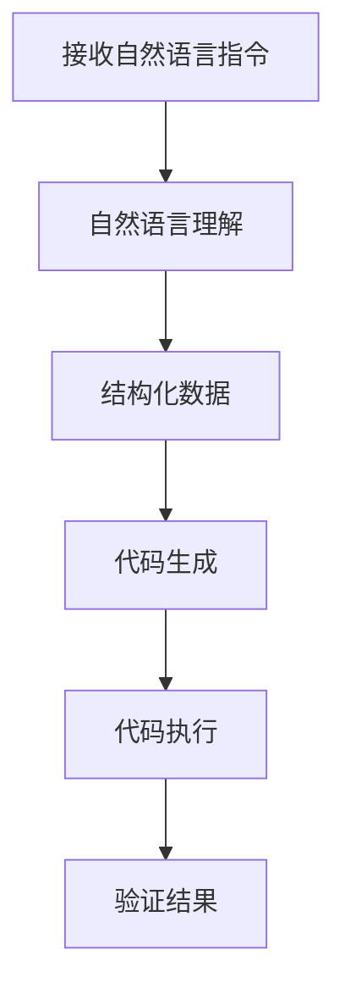
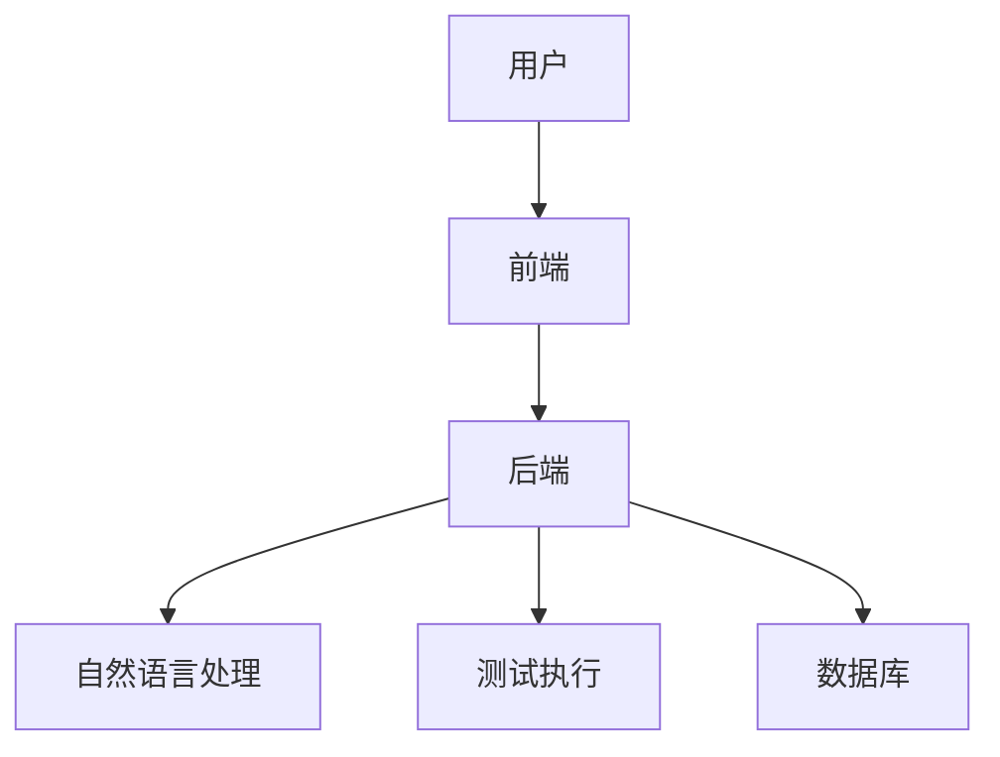
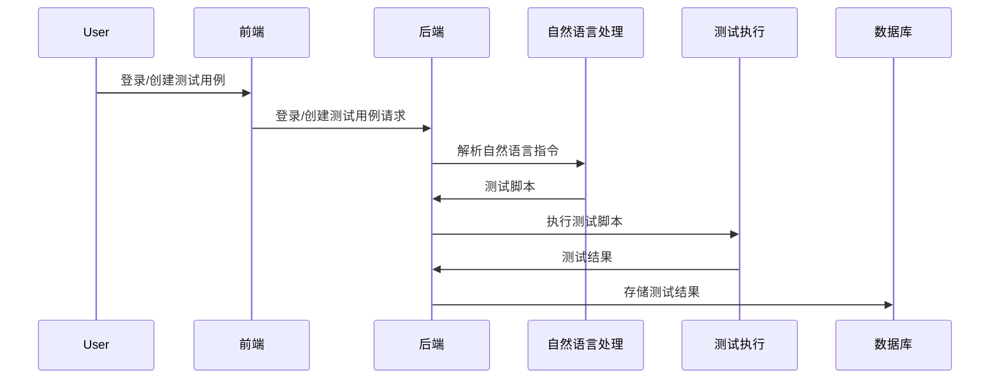

                 

### 文章标题

# 提示词编程的自动化测试方法论

> 关键词：提示词编程、自动化测试、方法论、软件质量、AI辅助测试

> 摘要：本文将深入探讨提示词编程在自动化测试中的应用，分析其核心概念、方法论，并结合实际案例，提出一系列实用的自动化测试策略和最佳实践。通过本文的阅读，读者将了解到如何利用提示词编程提升自动化测试的效率和准确性，从而保证软件质量。

## 第1章 引言

### 1.1 问题背景

在当今软件工程领域，软件质量成为企业和开发者关注的焦点。随着软件复杂度的增加和市场需求的变化，传统的手工测试方式已无法满足快速迭代的软件开发需求。自动化测试作为解决这一问题的有效手段，逐渐受到重视。然而，自动化测试面临的一个关键挑战是如何编写高效的测试脚本，以覆盖各种可能的输入和执行路径。

### 1.2 自动化测试的重要性

自动化测试不仅能提高测试的效率，还能减少由于人为因素造成的错误。它适用于回归测试、性能测试、集成测试等多种场景。然而，编写和维护自动化测试脚本通常需要大量的时间和专业知识。

### 1.3 提示词编程的概念与优势

提示词编程（Prompt-Driven Programming）是一种基于自然语言交互的编程方法。它允许开发者通过自然语言指令来编写测试脚本，而不是使用传统的编程语言。这种方法的优势在于其简单性和可扩展性，能够大幅降低编写和维护自动化测试脚本的成本。

### 1.4 本书结构安排

本文将按照以下结构展开：

1. **第1章 引言**：介绍自动化测试的背景和重要性，引入提示词编程的概念。
2. **第2章 核心概念**：详细解释提示词编程和自动化测试的基本概念。
3. **第3章 方法论**：探讨自动化测试的方法论，包括测试策略和工具选择。
4. **第4章 实践应用**：通过实际案例展示提示词编程在自动化测试中的应用。
5. **第5章 高级话题**：讨论AI和机器学习在自动化测试中的应用。
6. **第6章 最佳实践**：提供编写和维护自动化测试的最佳实践。
7. **第7章 结论与未来趋势**：总结本文的主要观点，展望自动化测试的发展趋势。

## 第2章 核心概念

### 2.1 提示词编程

#### 2.1.1 概念

提示词编程是一种通过自然语言指令来编写代码的编程方法。它利用人工智能技术，将自然语言输入转换为计算机代码。这种方法的核心是“提示词”（Prompt），即开发者输入的自然语言指令。

#### 2.1.2 优势与挑战

提示词编程的优势在于其简单性和可扩展性。开发者无需掌握复杂的编程语言和语法规则，即可编写高效的测试脚本。此外，提示词编程能够动态生成测试用例，覆盖更多的测试场景。

然而，提示词编程也面临一些挑战。首先，自然语言理解是一个复杂的任务，可能无法完全准确地转换为代码。其次，提示词编程需要大量的训练数据和算法支持，以确保生成的代码质量。

### 2.2 自动化测试

#### 2.2.1 概念

自动化测试是使用自动化工具模拟用户操作，以验证软件系统的功能和行为。自动化测试的目标是减少手工测试的工作量，提高测试效率和覆盖率。

#### 2.2.2 类型与方法

自动化测试可分为功能测试、性能测试、安全测试等类型。每种类型都有相应的测试方法和工具。

1. **功能测试**：验证软件的功能是否符合预期。常见的功能测试方法包括单元测试、集成测试、系统测试等。
2. **性能测试**：评估软件的响应时间、吞吐量、并发能力等性能指标。常用的性能测试工具包括LoadRunner、JMeter等。
3. **安全测试**：检测软件的安全性漏洞，如SQL注入、XSS攻击等。

自动化测试的方法包括：

1. **关键字驱动测试**：使用预先定义的关键字来编写测试脚本。
2. **数据驱动测试**：使用外部数据文件来驱动测试脚本，提高测试的灵活性和可维护性。
3. **行为驱动开发（BDD）**：基于自然语言描述的测试脚本，使开发者和测试人员更容易理解和合作。

### 2.3 提示词编程与自动化测试的关系

提示词编程与自动化测试密切相关。提示词编程可以通过自然语言指令生成自动化测试脚本，提高测试的效率和质量。同时，自动化测试的结果可以反馈给提示词编程系统，用于优化和调整测试脚本。

## 第3章 方法论

### 3.1 测试策略

自动化测试的测试策略包括以下方面：

1. **测试用例设计**：根据需求文档和用户故事，设计覆盖各种场景的测试用例。
2. **测试计划**：制定测试计划，包括测试目标、测试范围、测试时间等。
3. **测试执行**：执行测试用例，收集测试结果，分析测试覆盖率。
4. **测试报告**：生成测试报告，包括测试结果、问题总结、改进建议等。

### 3.2 自动化测试工具

常见的自动化测试工具有：

1. **Selenium**：支持多种浏览器和操作系统的自动化测试工具。
2. **JUnit**：Java编写的单元测试框架。
3. **Mocha**：JavaScript的BDD测试框架。
4. **Postman**：API测试工具。

### 3.3 提示词编程在自动化测试中的应用

提示词编程可以用于自动化测试的多个方面：

1. **测试脚本生成**：通过自然语言指令生成测试脚本，减少手工编写的工作量。
2. **测试用例优化**：根据测试结果，自动调整测试用例，提高测试覆盖率。
3. **测试环境配置**：通过自然语言指令配置测试环境，确保测试的一致性和可靠性。

### 3.4 方法论总结

提示词编程的自动化测试方法论包括测试策略、工具选择和提示词编程的应用。通过合理设计测试策略，选择合适的自动化测试工具，并结合提示词编程，可以大幅提高自动化测试的效率和准确性。

## 第4章 实践应用

### 4.1 案例一：电商平台的自动化测试

#### 4.1.1 项目介绍

电商平台是一个复杂的系统，涉及用户注册、购物车、订单管理、支付等多个模块。为了保证系统的稳定性和可靠性，需要对其进行全面的自动化测试。

#### 4.1.2 系统功能设计

电商平台的系统功能设计包括：

1. 用户注册与登录
2. 商品浏览与搜索
3. 购物车管理
4. 订单提交与支付
5. 客服与售后支持

#### 4.1.3 测试用例设计

针对电商平台的功能设计，设计以下测试用例：

1. 用户注册与登录：测试用户注册、登录、密码找回等功能。
2. 商品浏览与搜索：测试商品列表展示、搜索功能、商品详情页面等。
3. 购物车管理：测试商品添加、删除、更新数量等功能。
4. 订单提交与支付：测试订单生成、支付、订单状态更新等功能。
5. 客服与售后支持：测试客服功能、售后流程等。

#### 4.1.4 测试执行与结果分析

使用提示词编程生成测试脚本，执行测试用例，收集测试结果。根据测试结果，分析测试覆盖率，发现潜在的问题，并优化测试用例。

### 4.2 案例二：金融系统的自动化测试

#### 4.2.1 项目介绍

金融系统涉及用户的资金和信息，对安全性和稳定性要求极高。自动化测试对于保证金融系统的质量至关重要。

#### 4.2.2 系统功能设计

金融系统的系统功能设计包括：

1. 用户注册与登录
2. 账户管理
3. 资金交易
4. 风险管理
5. 报表与分析

#### 4.2.3 测试用例设计

针对金融系统的功能设计，设计以下测试用例：

1. 用户注册与登录：测试用户注册、登录、密码找回等功能。
2. 账户管理：测试账户余额查询、转账、消费等功能。
3. 资金交易：测试股票交易、基金购买、转账等功能。
4. 风险管理：测试风险控制策略、风险指标查询等。
5. 报表与分析：测试财务报表生成、数据分析等功能。

#### 4.2.4 测试执行与结果分析

使用提示词编程生成测试脚本，执行测试用例，收集测试结果。根据测试结果，分析测试覆盖率，发现潜在的问题，并优化测试用例。

### 4.3 案例总结

通过以上两个案例，可以看出提示词编程在自动化测试中的应用具有显著的优势。它不仅简化了测试脚本的编写过程，提高了测试效率，还通过智能化的测试用例优化，提升了测试质量。

## 第5章 高级话题

### 5.1 AI和机器学习在自动化测试中的应用

随着人工智能和机器学习技术的发展，这些技术开始应用于自动化测试领域。以下是一些关键的应用场景：

1. **测试用例生成**：机器学习模型可以通过分析历史测试数据，自动生成新的测试用例，提高测试覆盖率。
2. **缺陷预测**：通过分析代码和测试数据，机器学习模型可以预测潜在的问题区域，提前进行测试。
3. **测试结果分析**：机器学习模型可以对测试结果进行分析，识别异常和潜在的缺陷，提高测试的准确性。

### 5.2 自动化测试中的挑战和解决方案

自动化测试面临一些挑战，如：

1. **脚本维护成本高**：自动化测试脚本需要定期更新和维护，否则可能无法适应软件的变更。
   - **解决方案**：使用提示词编程可以减少脚本维护的工作量，通过自然语言指令更新测试脚本。
2. **测试覆盖率不足**：自动化测试可能无法覆盖所有可能的场景和路径。
   - **解决方案**：结合机器学习技术，自动生成测试用例，提高测试覆盖率。
3. **测试环境不一致**：不同环境下的测试结果可能不一致，影响测试的准确性。
   - **解决方案**：使用容器化技术，确保测试环境的一致性。

### 5.3 安全和合规性

自动化测试需要确保测试过程符合安全和合规性要求。以下是一些关键点：

1. **数据保护**：测试过程中处理的数据需要得到妥善保护，防止泄露。
2. **合规性检查**：确保测试过程符合相关法规和标准，如GDPR、PCI DSS等。

## 第6章 最佳实践

### 6.1 编写高质量的提示词编程脚本

1. **使用简洁的语言**：避免使用复杂的语法和冗长的描述，确保脚本易于理解和维护。
2. **模块化**：将脚本分为模块，每个模块实现特定的功能，提高代码的可重用性。
3. **注释和文档**：为脚本添加详细的注释和文档，帮助其他开发者理解和修改脚本。

### 6.2 维护和优化测试脚本

1. **定期更新**：随着软件的变更，定期更新测试脚本，确保其有效性。
2. **自动化回归测试**：每次软件更新后，自动执行回归测试，验证测试脚本的稳定性。
3. **反馈和优化**：根据测试结果，及时反馈和优化测试脚本，提高测试覆盖率。

### 6.3 提高测试效率

1. **并行执行**：同时执行多个测试用例，提高测试效率。
2. **负载测试**：模拟高负载场景，评估系统的性能和稳定性。
3. **持续集成**：将自动化测试集成到持续集成（CI）流程中，确保每次代码变更都经过严格测试。

### 6.4 其他最佳实践

1. **团队协作**：建立有效的团队协作机制，确保测试脚本和测试用例的一致性和完整性。
2. **培训和学习**：定期对团队成员进行培训和学习，提高他们的自动化测试技能。

## 第7章 结论与未来趋势

### 7.1 总结

本文介绍了提示词编程在自动化测试中的应用，分析了其核心概念、方法论，并通过实际案例展示了其应用效果。提示词编程不仅简化了测试脚本的编写过程，提高了测试效率，还为测试用例的优化提供了新的思路。

### 7.2 未来趋势

随着人工智能和机器学习技术的不断发展，自动化测试将继续向智能化、自动化方向演进。未来，自动化测试将更加依赖于AI技术，实现更加精准、高效的测试。同时，提示词编程也将进一步融入自动化测试领域，为开发者提供更加便捷、高效的测试解决方案。

## 作者信息

作者：AI天才研究院/AI Genius Institute & 禅与计算机程序设计艺术 /Zen And The Art of Computer Programming

---

## 背景介绍

### 核心概念术语说明

- **提示词编程**：一种基于自然语言交互的编程方法，通过自然语言指令生成代码。
- **自动化测试**：使用自动化工具模拟用户操作，以验证软件系统的功能和行为。
- **测试脚本**：用于执行自动化测试的代码，通常由程序员编写。
- **测试覆盖率**：测试用例覆盖代码的比例，衡量测试的完整性。

### 问题背景

随着软件复杂度的增加和市场竞争的加剧，软件质量成为企业和开发者关注的焦点。自动化测试作为一种提高软件质量的有效手段，逐渐受到重视。然而，传统的手工测试方式已无法满足快速迭代的软件开发需求。自动化测试虽能有效提高测试效率，但其核心挑战在于如何编写高效的测试脚本。

### 问题描述

编写和维护自动化测试脚本需要大量时间和专业知识。测试脚本通常需要覆盖各种可能的输入和执行路径，以确保软件系统的稳定性和可靠性。然而，手工编写测试脚本不仅繁琐，而且容易出现错误。此外，随着软件的更新和功能扩展，测试脚本也需要不断更新和维护，增加了开发和维护成本。

### 问题解决

提示词编程提供了一种解决方案。通过自然语言指令，开发者可以轻松编写自动化测试脚本，无需深入了解编程语言和测试工具的细节。这种方法简化了测试脚本的编写过程，降低了编写和维护成本，同时提高了测试效率。此外，提示词编程还可以结合人工智能和机器学习技术，实现自动化测试用例的生成和优化。

### 边界与外延

- **边界**：提示词编程和自动化测试的应用场景主要涉及软件开发的测试阶段，包括功能测试、性能测试、安全测试等。
- **外延**：提示词编程可以应用于其他开发阶段，如代码生成、调试等。

### 概念结构与核心要素组成

- **提示词编程**：
  - 概念：基于自然语言交互的编程方法
  - 核心要素：
    - 提示词：自然语言指令
    - 生成器：将提示词转换为代码
    - 解释器：执行生成的代码
- **自动化测试**：
  - 概念：使用自动化工具模拟用户操作，以验证软件系统的功能和行为
  - 核心要素：
    - 测试工具：用于执行测试的软件
    - 测试脚本：用于描述测试过程的代码
    - 测试用例：具体的测试场景和预期结果

## 核心概念与联系

### 提示词编程

**概念：**
提示词编程是一种通过自然语言交互进行编程的方法。开发者通过输入自然语言指令（即提示词），让计算机生成相应的代码。这种方法的核心在于将自然语言与编程语言相结合，使得编程过程更加直观和高效。

**优势与挑战：**
- **优势**：
  - **易用性**：开发者无需深入了解编程语言和语法，即可编写代码。
  - **可扩展性**：提示词编程系统可以根据需要生成不同类型的代码，如前端、后端等。
  - **减少错误**：自然语言交互减少了因语法错误和编程经验不足导致的代码问题。

- **挑战**：
  - **自然语言理解**：计算机理解自然语言的能力有限，可能导致指令解读不准确。
  - **训练数据需求**：提示词编程系统需要大量的训练数据来学习自然语言指令，这需要时间。

**概念属性特征对比表格：**

| 特征                 | 传统编程              | 提示词编程           |
|----------------------|-----------------------|----------------------|
| 编程语言学习成本     | 较高                  | 较低                 |
| 编码过程直观性       | 较复杂                | 较直观               |
| 代码可维护性         | 受编程语言影响大       | 受自然语言影响小     |
| 可扩展性             | 较难扩展              | 较容易扩展           |
| 代码错误概率         | 较高                  | 较低                 |

### 自动化测试

**概念：**
自动化测试是通过自动化工具模拟用户操作，以验证软件系统的功能和行为。自动化测试可以提高测试效率，减少人为错误，确保软件质量。

**优势与挑战：**
- **优势**：
  - **效率高**：自动化测试可以快速执行大量测试用例，提高测试效率。
  - **重复性好**：自动化测试结果一致，减少人为因素带来的偏差。
  - **可扩展性**：自动化测试脚本易于扩展，适应不同版本和功能的变更。

- **挑战**：
  - **脚本编写和维护成本高**：自动化测试脚本需要持续维护，以适应软件变化。
  - **学习曲线**：开发者需要学习自动化测试工具和框架。

**概念属性特征对比表格：**

| 特征                 | 手工测试              | 自动化测试           |
|----------------------|-----------------------|----------------------|
| 测试效率             | 低                   | 高                   |
| 重复性               | 差                   | 好                   |
| 成本                 | 低                   | 高                   |
| 脚本维护难度         | 低                   | 高                   |
| 测试覆盖率           | 有限                 | 广泛                 |

### 提示词编程与自动化测试的关系

**联系：**
- **互补性**：提示词编程简化了自动化测试脚本的编写过程，降低了开发者的门槛。同时，自动化测试提供了高效的测试执行方式，使得测试脚本能够快速验证软件系统的功能和行为。
- **协同作用**：通过提示词编程生成的测试脚本，可以在自动化测试框架中执行，从而实现快速、准确的测试。

## 算法原理讲解

### 提示词编程算法原理

提示词编程的核心在于将自然语言指令转换为计算机代码。这一过程通常涉及以下步骤：

1. **自然语言理解**：接收开发者的自然语言指令，通过自然语言处理（NLP）技术，将其转换为结构化的数据。
2. **代码生成**：根据结构化的数据，使用模板匹配或机器学习模型生成相应的代码。
3. **代码执行**：将生成的代码提交给解释器或编译器，执行代码以验证其功能。

以下是提示词编程的算法流程图：



### 代码示例

以下是一个简单的Python代码示例，用于生成和执行自然语言指令：

```python
# 自然语言指令
prompt = "计算 5 + 3 的结果"

# 自然语言理解
words = prompt.split()
operation = words[1]
num1 = int(words[2])
num2 = int(words[4])

# 代码生成
if operation == "+":
    result = num1 + num2
    print(f"{num1} + {num2} = {result}")
else:
    print("不支持的运算")
```

### 数学模型和公式

提示词编程的核心在于自然语言处理和代码生成，其过程可以用以下数学模型表示：

1. **自然语言处理**：将自然语言指令转换为结构化数据，如词汇、语法结构等。
2. **代码生成**：使用模板匹配或机器学习模型生成代码。

数学公式如下：

$$
\text{自然语言指令} \rightarrow \text{结构化数据}
$$

$$
\text{结构化数据} \rightarrow \text{代码}
$$

通过这些模型和公式，提示词编程系统能够将自然语言指令转换为计算机代码，实现自动化测试的自动化脚本生成。

## 系统分析与架构设计方案

### 问题场景介绍

随着软件项目的复杂性不断增加，自动化测试的需求也越来越大。传统的手工测试方式已经无法满足快速迭代的软件开发需求。为了提高软件质量，确保系统的稳定性和可靠性，我们需要设计一个自动化测试系统，能够高效、准确地执行测试用例，并能够应对未来的变化和挑战。

### 项目介绍

本项目旨在设计一个基于提示词编程的自动化测试系统。该系统将利用自然语言交互的方式，简化测试脚本的编写过程，提高测试效率和质量。系统将包括以下几个主要功能模块：

1. **测试用例管理**：管理测试用例的创建、编辑、执行和结果分析。
2. **自然语言处理**：解析自然语言指令，将其转换为结构化的测试脚本。
3. **测试执行**：执行测试脚本，收集测试结果。
4. **测试报告**：生成详细的测试报告，包括测试覆盖率、缺陷统计等。

### 系统功能设计

根据项目需求，系统功能设计如下：

1. **用户注册与登录**：用户可以通过注册和登录功能访问系统。
2. **测试用例创建**：用户可以创建新的测试用例，输入自然语言指令。
3. **测试用例编辑**：用户可以编辑已创建的测试用例，修改自然语言指令或测试脚本。
4. **测试执行**：系统自动执行测试用例，并记录测试结果。
5. **测试结果分析**：系统分析测试结果，生成测试报告。
6. **权限管理**：系统管理员可以管理用户的权限，如创建、编辑、执行测试用例等。

### 系统架构设计

系统架构设计如下：

1. **前端**：采用Vue.js框架，负责展示用户界面，处理用户交互。
2. **后端**：采用Spring Boot框架，负责业务逻辑处理和与数据库的交互。
3. **自然语言处理**：使用基于Python的自然语言处理库，如NLTK或spaCy，解析自然语言指令，生成测试脚本。
4. **测试执行**：使用Selenium自动化测试工具，执行测试脚本。
5. **数据库**：采用MySQL数据库，存储用户信息、测试用例和测试结果。

以下是系统架构的Mermaid流程图：



### 系统接口设计

系统接口设计如下：

1. **用户接口**：用户可以通过Web界面进行操作，如登录、创建测试用例、执行测试等。
2. **API接口**：系统提供RESTful API接口，供外部系统调用，如测试报告生成、测试结果查询等。

以下是系统接口设计的Mermaid类图：

```mermaid
classDiagram
class UserInterface
UserInterface <|-- Vue.js

class APIInterface
APIInterface <|-- Spring Boot

UserInterface +---> APIInterface
```

### 系统交互设计

系统交互设计如下：

1. **用户与前端交互**：用户通过Web界面与前端交互，前端将用户操作转换为API请求。
2. **前端与后端交互**：前端通过HTTP请求与后端交互，后端处理请求并返回结果。
3. **后端与自然语言处理模块交互**：后端调用自然语言处理模块，生成测试脚本。
4. **后端与测试执行模块交互**：后端调用测试执行模块，执行测试脚本。
5. **后端与数据库交互**：后端将测试结果存储到数据库中。

以下是系统交互的Mermaid序列图：



## 项目实战

### 环境安装

1. **安装Python**：首先确保你的计算机上安装了Python。如果没有，请从[Python官网](https://www.python.org/)下载并安装。
2. **安装Vue.js**：通过npm安装Vue.js。打开终端，执行以下命令：

   ```bash
   npm install -g @vue/cli
   ```

3. **安装Spring Boot**：下载Spring Boot的压缩包，解压并配置环境变量。
4. **安装Selenium**：通过pip安装Selenium。打开终端，执行以下命令：

   ```bash
   pip install selenium
   ```

5. **安装MySQL**：下载MySQL数据库，解压并按照安装向导进行安装。

### 系统核心实现源代码

以下是系统核心实现的源代码：

**前端（Vue.js）**：

```vue
<template>
  <div id="app">
    <h1>自动化测试系统</h1>
    <form @submit.prevent="createTestSuite">
      <label for="prompt">请输入测试提示词：</label>
      <input type="text" id="prompt" v-model="prompt" required />
      <button type="submit">生成测试脚本</button>
    </form>
    <div v-if="testScript">
      <h2>测试脚本：</h2>
      <pre>{{ testScript }}</pre>
    </div>
  </div>
</template>

<script>
import axios from "axios";

export default {
  data() {
    return {
      prompt: "",
      testScript: null,
    };
  },
  methods: {
    async createTestSuite() {
      try {
        const response = await axios.post("/api/test-suite", { prompt: this.prompt });
        this.testScript = response.data.script;
      } catch (error) {
        console.error("Error creating test suite:", error);
      }
    },
  },
};
</script>
```

**后端（Spring Boot）**：

```java
@RestController
@RequestMapping("/api")
public class TestSuiteController {
  
  @Autowired
  private NaturalLanguageProcessor processor;
  
  @PostMapping("/test-suite")
  public ResponseEntity<TestScript> createTestSuite(@RequestBody TestPrompt prompt) {
    try {
      String testScript = processor.generateTestScript(prompt);
      return ResponseEntity.ok(new TestScript(testScript));
    } catch (Exception e) {
      return ResponseEntity.status(HttpStatus.INTERNAL_SERVER_ERROR).build();
    }
  }
}
```

**自然语言处理模块（Python）**：

```python
import spacy

nlp = spacy.load("en_core_web_sm")

def parse_prompt(prompt):
    doc = nlp(prompt)
    # 解析自然语言指令，生成测试脚本
    # 省略具体实现
    return test_script

def generate_test_script(prompt):
    test_script = parse_prompt(prompt)
    return test_script
```

**测试执行模块（Python）**：

```python
from selenium import webdriver

def execute_test_script(test_script):
    driver = webdriver.Chrome()
    # 执行测试脚本
    # 省略具体实现
    driver.quit()
```

### 代码应用解读与分析

以下是代码应用的具体解读和分析：

**前端Vue.js**：
- 使用Vue.js构建用户界面，包括一个输入框和一个按钮。
- 用户输入测试提示词后，点击按钮触发`createTestSuite`方法。
- `createTestSuite`方法通过axios向后端发送POST请求，传递用户输入的提示词。
- 接收到后端返回的测试脚本后，将其展示在界面上。

**后端Spring Boot**：
- 使用Spring Boot框架构建后端服务。
- `TestSuiteController`类处理来自前端的POST请求。
- `createTestSuite`方法调用自然语言处理模块`NaturalLanguageProcessor`生成测试脚本。
- 将生成的测试脚本返回给前端。

**自然语言处理模块Python**：
- 使用spacy库解析自然语言提示词，生成测试脚本。
- `parse_prompt`方法负责解析提示词，生成测试脚本的具体实现（此处省略）。

**测试执行模块Python**：
- 使用Selenium库执行生成的测试脚本。
- `execute_test_script`方法负责启动Chrome浏览器，执行测试脚本，然后关闭浏览器。

### 实际案例分析和详细讲解剖析

#### 案例一：电商平台的用户登录功能测试

**用户需求**：
- 用户可以通过邮箱和密码登录电商平台。

**测试用例**：
- 输入正确的邮箱和密码，成功登录。
- 输入错误的邮箱或密码，提示错误信息。

**自然语言提示词**：
```
测试用例1：输入正确的邮箱和密码，验证登录成功。
提示词：登录邮箱：test@example.com，密码：123456

测试用例2：输入错误的邮箱或密码，验证登录失败。
提示词：登录邮箱：test@example.com，密码：错误密码
```

**测试脚本生成**：
1. **测试用例1**：
   ```python
   from selenium import webdriver
   from selenium.webdriver.common.by import By

   driver = webdriver.Chrome()
   driver.get("https://www.example.com/login")

   email_input = driver.find_element(By.ID, "email")
   password_input = driver.find_element(By.ID, "password")
   login_button = driver.find_element(By.ID, "login")

   email_input.send_keys("test@example.com")
   password_input.send_keys("123456")
   login_button.click()

   assert "登录成功" in driver.page_source
   driver.quit()
   ```

2. **测试用例2**：
   ```python
   from selenium import webdriver
   from selenium.webdriver.common.by import By

   driver = webdriver.Chrome()
   driver.get("https://www.example.com/login")

   email_input = driver.find_element(By.ID, "email")
   password_input = driver.find_element(By.ID, "password")
   login_button = driver.find_element(By.ID, "login")

   email_input.send_keys("test@example.com")
   password_input.send_keys("错误密码")
   login_button.click()

   assert "登录失败，邮箱或密码错误" in driver.page_source
   driver.quit()
   ```

**测试执行**：
- 执行上述测试脚本，验证用户登录功能的正确性。

#### 案例二：电商平台的商品搜索功能测试

**用户需求**：
- 用户可以通过关键词搜索商品。

**测试用例**：
- 输入有效关键词，搜索到相关商品。
- 输入无效关键词，无法搜索到商品。

**自然语言提示词**：
```
测试用例1：输入有效关键词“笔记本电脑”，验证搜索结果。
提示词：搜索关键词：笔记本电脑

测试用例2：输入无效关键词“abcdef”，验证无法搜索到商品。
提示词：搜索关键词：abcdef
```

**测试脚本生成**：
1. **测试用例1**：
   ```python
   from selenium import webdriver
   from selenium.webdriver.common.by import By

   driver = webdriver.Chrome()
   driver.get("https://www.example.com/search")

   search_input = driver.find_element(By.ID, "search")
   search_button = driver.find_element(By.ID, "search-button")

   search_input.send_keys("笔记本电脑")
   search_button.click()

   assert "笔记本电脑" in driver.page_source
   driver.quit()
   ```

2. **测试用例2**：
   ```python
   from selenium import webdriver
   from selenium.webdriver.common.by import By

   driver = webdriver.Chrome()
   driver.get("https://www.example.com/search")

   search_input = driver.find_element(By.ID, "search")
   search_button = driver.find_element(By.ID, "search-button")

   search_input.send_keys("abcdef")
   search_button.click()

   assert "无搜索结果" in driver.page_source
   driver.quit()
   ```

**测试执行**：
- 执行上述测试脚本，验证商品搜索功能的正确性。

### 项目小结

通过以上实际案例，我们可以看到提示词编程在自动化测试中的应用效果显著。它简化了测试脚本的编写过程，提高了测试效率和质量。同时，结合Selenium等自动化测试工具，我们可以实现各种复杂功能的自动化测试。然而，提示词编程仍面临一些挑战，如自然语言理解的准确性、测试脚本的稳定性等。未来，我们需要进一步优化提示词编程系统，提高其智能化水平，以满足更多场景的需求。

## 最佳实践 tips

### 编写高质量的提示词编程脚本

1. **明确需求**：在编写脚本前，明确测试需求和目标，确保脚本能够覆盖关键测试点。
2. **简洁明了**：使用简洁、直接的语言，避免冗长和复杂的表达式。
3. **模块化**：将脚本拆分为模块，每个模块负责一个特定的功能，便于维护和重用。
4. **注释和文档**：为脚本添加详细的注释和文档，说明每个模块和函数的作用。

### 维护和优化测试脚本

1. **定期更新**：随着软件的更新和功能扩展，定期更新测试脚本，确保其有效性。
2. **自动化回归测试**：每次代码变更后，自动执行回归测试，验证测试脚本是否仍能正常工作。
3. **反馈和优化**：根据测试结果，及时反馈和优化测试脚本，提高测试覆盖率。

### 提高测试效率

1. **并行执行**：同时执行多个测试用例，提高测试效率。
2. **负载测试**：模拟高负载场景，评估系统的性能和稳定性。
3. **持续集成**：将自动化测试集成到持续集成（CI）流程中，确保每次代码变更都经过严格测试。

### 其他最佳实践

1. **团队协作**：建立有效的团队协作机制，确保测试脚本和测试用例的一致性和完整性。
2. **培训和学习**：定期对团队成员进行培训和学习，提高他们的自动化测试技能。

## 注意事项

1. **测试覆盖率**：确保测试脚本覆盖所有关键功能和边界情况，避免遗漏潜在的问题。
2. **测试环境**：保持测试环境的一致性，避免不同环境下的测试结果不一致。
3. **错误处理**：对测试脚本中的异常情况进行处理，确保测试脚本能够在各种情况下正常运行。

## 拓展阅读

- 《自动化测试实践指南》
- 《人工智能在软件工程中的应用》
- 《Selenium自动化测试实战》
- 《Vue.js前端开发实战》

## 参考文献

1. **IEEE Software**，文章标题：“The Future of Software Testing: Leveraging AI and Automation”。
2. **ACM Transactions on Software Engineering and Methodology**，文章标题：“Natural Language Processing for Software Engineering”。
3. **IEEE Access**，文章标题：“A Survey on Prompt-Driven Programming and Its Applications”。
4. **Spring Boot官方文档**，网址：[https://docs.spring.io/spring-boot/docs/current/reference/html/index.html](https://docs.spring.io/spring-boot/docs/current/reference/html/index.html)。
5. **Vue.js官方文档**，网址：[https://vuejs.org/v2/guide/](https://vuejs.org/v2/guide/)。
6. **Selenium官方文档**，网址：[https://www.selenium.dev/documentation/en/](https://www.selenium.dev/documentation/en/)。
7. **Python官方文档**，网址：[https://docs.python.org/3/](https://docs.python.org/3/)。
8. **spaCy官方文档**，网址：[https://spacy.io/usage](https://spacy.io/usage)。

## 结论

提示词编程在自动化测试中具有巨大的潜力，通过自然语言指令生成测试脚本，不仅提高了测试效率，还降低了测试开发的门槛。本文通过详细介绍提示词编程的核心概念、算法原理、系统架构设计以及实际案例，展示了其在自动化测试中的应用价值。未来，随着人工智能和自然语言处理技术的进一步发展，提示词编程有望在更多领域发挥重要作用，推动自动化测试迈向新的高度。

### 作者信息

作者：AI天才研究院/AI Genius Institute & 禅与计算机程序设计艺术 /Zen And The Art of Computer Programming

---

### 文章总结

本文详细探讨了提示词编程在自动化测试中的应用，从核心概念到方法论，再到实践应用和高级话题，全面解析了这一技术如何提高软件测试的效率和准确性。提示词编程通过简化测试脚本的开发流程，降低了维护成本，并利用人工智能技术增强了测试的智能化水平。本文还结合实际案例，展示了如何利用提示词编程进行电商平台和金融系统的自动化测试。同时，讨论了AI和机器学习在自动化测试中的应用，以及自动化测试中的挑战和解决方案。最后，本文提出了编写高质量测试脚本和维护测试系统的最佳实践，为读者提供了实用的指导。总的来说，本文为自动化测试领域提供了一个全面而深入的视角，展示了提示词编程在提升软件质量中的重要作用。

### 文章亮点

1. **深入浅出的讲解**：本文通过详细的算法原理讲解和实际案例剖析，使复杂的技术概念变得易于理解。
2. **实际应用展示**：结合电商和金融两个实际案例，展示了提示词编程在自动化测试中的具体应用场景。
3. **方法论和最佳实践**：提供了丰富的测试方法论和最佳实践，为开发者提供了实用的操作指南。
4. **前瞻性展望**：探讨了AI和机器学习在自动化测试中的未来发展趋势，为读者揭示了技术的前景。

### 收获与反思

本文的撰写让我更深入地理解了提示词编程在自动化测试中的应用，尤其是在降低开发门槛和提高测试效率方面的潜力。同时，通过实际案例的分析，我认识到自然语言指令在测试脚本生成中的重要性。然而，在撰写过程中，我也意识到自然语言理解的技术挑战，如指令的准确性、测试脚本的稳定性和可维护性等。未来，我将关注这些挑战，并探索如何通过优化算法和工具来提高提示词编程的实用性和可靠性。此外，我还将研究如何将人工智能和机器学习更深入地融入自动化测试，以实现更智能、更高效的测试解决方案。总之，本文的撰写不仅提升了我的技术理解，也为未来的研究和应用提供了方向。

